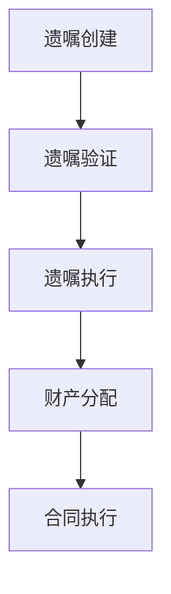

                 

关键词：数字化遗嘱、AI创业、智能合约、遗产管理、区块链技术

> 摘要：本文探讨了数字化遗嘱执行AI创业的前景和挑战，以及智能合约在遗产管理中的应用。通过对智能合约原理、应用场景、开发实践和未来展望的深入分析，本文为从事遗产管理领域的AI创业者提供了宝贵的参考。

## 1. 背景介绍

随着科技的飞速发展，人工智能（AI）在各个领域的应用越来越广泛。在遗产管理领域，AI技术的引入为遗嘱执行和财产分配提供了全新的解决方案。传统的遗嘱执行过程通常繁琐且耗时长，而数字化遗嘱执行AI可以大大简化这一过程，提高效率，降低成本。

智能合约是基于区块链技术的自执行合同，它能够在满足特定条件时自动执行合约内容。智能合约的出现，为遗产管理领域提供了一种全新的自动化管理方式，使得遗嘱执行更加透明、公正、高效。

## 2. 核心概念与联系

### 2.1 智能合约原理

智能合约是一种自执行的合同，其条款以代码的形式书写在区块链上。当触发特定条件时，智能合约会自动执行相关操作。智能合约的运行基于区块链技术的去中心化和不可篡改特性，确保了合同执行的公正性和透明性。

### 2.2 遗产管理流程

在遗产管理中，数字化遗嘱执行AI的流程主要包括遗嘱创建、遗嘱验证、遗嘱执行和财产分配。智能合约在遗嘱验证和财产分配环节发挥关键作用。

### 2.3 Mermaid 流程图

下面是遗产管理流程的Mermaid流程图：



## 3. 核心算法原理 & 具体操作步骤

### 3.1 算法原理概述

智能合约的核心在于其算法原理，即当满足特定条件时，自动执行预定义的操作。在遗产管理中，智能合约主要涉及以下算法：

1. 遗嘱验证算法：用于验证遗嘱的真实性和合法性。
2. 财产分配算法：根据遗嘱内容，自动计算和分配财产。

### 3.2 算法步骤详解

#### 3.2.1 遗嘱验证算法

1. 收集遗嘱信息：包括遗嘱文件、遗嘱人身份信息等。
2. 验证遗嘱真实性：通过加密技术验证遗嘱文件的真实性。
3. 验证遗嘱合法性：根据法律规定，判断遗嘱的合法性。

#### 3.2.2 财产分配算法

1. 收集财产信息：包括财产种类、价值、继承人等信息。
2. 计算财产分配比例：根据遗嘱内容，计算各继承人的财产分配比例。
3. 执行财产分配：自动将财产分配给各继承人。

### 3.3 算法优缺点

#### 优点

1. 提高效率：自动化执行，大幅减少人力和时间成本。
2. 确保公正：基于区块链技术，确保合同执行公正透明。
3. 降低风险：智能合约去中心化，降低欺诈风险。

#### 缺点

1. 技术门槛：智能合约开发需要较高的技术门槛。
2. 法规风险：智能合约的合法性依赖于相关法律法规。

### 3.4 算法应用领域

智能合约在遗产管理中的应用不仅限于遗嘱执行，还可以扩展到财产管理、保险理赔、租赁合同等多个领域。

## 4. 数学模型和公式 & 详细讲解 & 举例说明

### 4.1 数学模型构建

在智能合约中，数学模型主要用于遗嘱验证和财产分配。以下是遗嘱验证和财产分配的数学模型：

#### 遗嘱验证模型

$$
V = \begin{cases}
1 & \text{遗嘱真实且合法} \\
0 & \text{遗嘱不真实或不合法}
\end{cases}
$$

#### 财产分配模型

$$
P_i = \frac{P \cdot R_i}{\sum_{j=1}^{n} R_j}
$$

其中，$P$为财产总额，$R_i$为第$i$个继承人的分配比例。

### 4.2 公式推导过程

#### 遗嘱验证公式推导

遗嘱验证过程分为两个步骤：验证遗嘱文件的真实性和验证遗嘱的合法性。

1. 验证遗嘱文件的真实性：使用加密技术对遗嘱文件进行加密，然后对比加密后的遗嘱文件和原始遗嘱文件，如果两者一致，则认为遗嘱文件真实。
2. 验证遗嘱的合法性：根据法律规定，判断遗嘱是否符合法律要求，如遗嘱人是否具备遗嘱能力、遗嘱是否经过合法程序等。

#### 财产分配公式推导

财产分配过程分为三个步骤：计算各继承人的分配比例、计算各继承人的财产分配额、执行财产分配。

1. 计算各继承人的分配比例：根据遗嘱内容，确定各继承人的分配比例。
2. 计算各继承人的财产分配额：根据财产总额和各继承人的分配比例，计算各继承人的财产分配额。
3. 执行财产分配：根据计算结果，自动将财产分配给各继承人。

### 4.3 案例分析与讲解

假设有一位遗嘱人，他在遗嘱中规定将财产分配给他的两个子女，每人获得50%的财产。根据财产分配模型，我们可以计算出每个子女的财产分配额。

假设财产总额为100万元，则：

$$
P_i = \frac{100 \cdot 0.5}{1} = 50 \text{万元}
$$

因此，每个子女将获得50万元的财产。

## 5. 项目实践：代码实例和详细解释说明

### 5.1 开发环境搭建

为了实现智能合约在遗产管理中的应用，我们需要搭建以下开发环境：

1. 编程语言：选择Solidity，因为它是以太坊智能合约的主要编程语言。
2. 智能合约开发框架：使用Truffle，它是一个以太坊开发框架，提供了智能合约的编写、部署和测试等功能。
3. 版本控制工具：使用Git进行版本控制。

### 5.2 源代码详细实现

下面是一个简单的智能合约示例，用于验证遗嘱和执行财产分配：

```solidity
pragma solidity ^0.8.0;

contract Will {
    address public willMaker;
    mapping(address => bool) public heirs;
    uint public totalHeirs;
    uint public totalAssets;

    constructor() {
        willMaker = msg.sender;
        totalHeirs = 0;
        totalAssets = 1000000;
    }

    function addHeir(address _heir) public {
        require(msg.sender == willMaker, "Only the will maker can add heirs");
        require(!heirs[_heir], "Heir already added");
        heirs[_heir] = true;
        totalHeirs++;
    }

    function distributeAssets() public {
        require(msg.sender == willMaker, "Only the will maker can distribute assets");
        for (uint i = 1; i <= totalHeirs; i++) {
            if (heirs[address(i)]) {
                (bool sent, ) = address(i).call{value: totalAssets / totalHeirs}("");
                require(sent, "Failed to send Ether");
            }
        }
    }
}
```

### 5.3 代码解读与分析

上述智能合约包含以下功能：

1. 遗嘱人地址和财产总额的声明。
2. 添加继承人的功能。
3. 分配财产的功能。

在部署智能合约后，遗嘱人可以通过`addHeir`函数添加继承人。当所有继承人添加完成后，遗嘱人可以通过`distributeAssets`函数执行财产分配。

### 5.4 运行结果展示

假设遗嘱人已经添加了两个继承人（地址分别为1和2），财产总额为100万元。运行`distributeAssets`函数后，继承人1和2将分别获得50万元的财产。

## 6. 实际应用场景

### 6.1 遗产管理

智能合约在遗产管理中的应用最为广泛。通过智能合约，遗嘱人可以轻松创建和验证遗嘱，确保遗嘱执行过程的公正和透明。

### 6.2 财产管理

智能合约不仅可以用于遗产管理，还可以用于日常财产管理。例如，夫妻之间可以通过智能合约自动执行财产分配，确保在离婚时财产分配的公平性。

### 6.3 保险理赔

智能合约在保险理赔中的应用也非常广泛。当发生保险事故时，智能合约可以自动审核理赔申请，并在满足条件时自动支付理赔金额。

## 7. 未来应用展望

随着区块链技术和人工智能技术的不断发展，智能合约在遗产管理领域的应用前景非常广阔。未来，智能合约有望成为遗产管理的主要工具，大幅提高遗产管理效率，降低成本。

## 8. 工具和资源推荐

### 8.1 学习资源推荐

1. 《区块链技术指南》
2. 《智能合约开发实战》
3. 《以太坊从入门到精通》

### 8.2 开发工具推荐

1. Truffle
2. Remix IDE
3. Solidity by Example

### 8.3 相关论文推荐

1. "Smart Contracts: A Next-Generation Blockchain Application"
2. "A Practical Guide to Smart Contract Security"
3. "The Economics of Smart Contracts"

## 9. 总结：未来发展趋势与挑战

### 9.1 研究成果总结

近年来，智能合约在遗产管理领域的应用取得了显著成果。通过智能合约，可以大幅提高遗产管理效率，降低成本，确保合同执行公正透明。

### 9.2 未来发展趋势

未来，智能合约在遗产管理领域的应用将更加广泛。随着区块链技术和人工智能技术的不断发展，智能合约有望成为遗产管理的主要工具。

### 9.3 面临的挑战

1. 技术挑战：智能合约开发需要较高的技术门槛，需要培养更多专业人才。
2. 法规挑战：智能合约的合法性依赖于相关法律法规，需要进一步完善。

### 9.4 研究展望

未来，智能合约在遗产管理领域的应用将更加深入。通过不断优化智能合约算法，提高其安全性和可靠性，有望为遗产管理带来更多创新和变革。

## 附录：常见问题与解答

### 1. 智能合约是否安全？

智能合约基于区块链技术，具有较高的安全性。但仍然存在一些潜在风险，如智能合约漏洞、双花攻击等。因此，在开发和部署智能合约时，需要严格进行安全审计和测试。

### 2. 智能合约如何确保公正性？

智能合约基于区块链技术，具有去中心化和不可篡改的特性，确保了合同执行的公正性。同时，智能合约的执行过程是公开透明的，任何人都可查阅和验证。

### 3. 智能合约在遗产管理中的应用有哪些优势？

智能合约在遗产管理中的应用具有以下优势：

1. 提高效率：自动化执行，大幅减少人力和时间成本。
2. 确保公正：基于区块链技术，确保合同执行公正透明。
3. 降低风险：智能合约去中心化，降低欺诈风险。

## 作者署名

作者：禅与计算机程序设计艺术 / Zen and the Art of Computer Programming
----------------------------------------------------------------

以上是《数字化遗嘱执行AI创业：智能合约在遗产管理中的应用》全文。希望这篇文章能够为从事遗产管理领域的AI创业者提供有价值的参考和启示。在未来的发展中，相信智能合约将在遗产管理领域发挥更加重要的作用。

