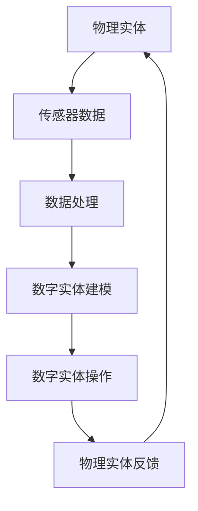

                 

关键词：数字实体，物理实体，自动化，数字化，实体建模，物联网，人工智能，智能制造，区块链。

> 摘要：随着科技的飞速发展，数字实体与物理实体的融合成为时代发展的必然趋势。本文旨在探讨数字实体与物理实体自动化的前景，分析其在物联网、人工智能、智能制造和区块链等领域的应用，以及面临的技术挑战和未来发展方向。

## 1. 背景介绍

随着信息技术的迅猛发展，数字世界与物理世界正以前所未有的速度融合。数字实体，作为虚拟世界中的数据表示，与物理实体，即现实世界中的物品和设备，之间的界限逐渐变得模糊。这种融合不仅改变了我们的生活方式，也深刻影响着各行业的发展。

### 数字实体

数字实体是指由数据、信息和知识构成的虚拟存在。它们可以表示为数字形式，如文本、图像、声音、视频等。随着云计算、大数据和物联网等技术的发展，数字实体在各个领域的应用越来越广泛。

### 物理实体

物理实体是现实世界中的物品和设备，如汽车、飞机、机器、建筑材料等。物理实体在工业生产、交通运输、建筑工程等领域发挥着至关重要的作用。

### 自动化

自动化是指通过计算机技术和信息技术，实现系统的自动化运行和操作。自动化的目标是减少人力干预，提高生产效率，降低成本，提升产品质量。

## 2. 核心概念与联系

### 数字实体与物理实体的关系

数字实体与物理实体之间存在着密切的联系。物理实体通过传感器、控制器等设备转化为数字信号，形成数字实体；而数字实体则通过计算机程序、算法等手段对物理实体进行控制、监测和分析。这种双向互动，使得数字实体与物理实体在信息交互中相互促进。

### 实体建模

实体建模是数字实体与物理实体自动化的关键环节。实体建模的过程包括对物理实体进行抽象、描述、建模，使其能够在数字世界中得以表达和操作。实体建模的方法和技术，如物联网技术、人工智能技术、区块链技术等，为实体自动化的实现提供了有力支持。

### Mermaid 流程图



## 3. 核心算法原理 & 具体操作步骤

### 3.1 算法原理概述

数字实体与物理实体自动化的核心算法主要包括数据采集、数据处理、数字建模、数字操作和物理反馈等环节。这些环节相互关联，形成一个闭环系统，以实现数字实体与物理实体的自动化。

### 3.2 算法步骤详解

1. **数据采集**：通过传感器等设备，对物理实体进行数据采集。
2. **数据处理**：对采集到的数据进行预处理，如滤波、降噪、归一化等。
3. **数字建模**：根据预处理后的数据，建立数字实体的模型。
4. **数字操作**：对数字实体进行操作，如控制、监测、分析等。
5. **物理反馈**：将数字操作的结果反馈给物理实体，实现闭环控制。

### 3.3 算法优缺点

**优点**：
1. 提高生产效率：自动化系统可以高效地完成各项任务，降低人力成本。
2. 提升产品质量：自动化系统能够精确控制物理实体，提高产品质量。
3. 降低运营成本：自动化系统能够降低设备维护成本，延长设备使用寿命。

**缺点**：
1. 投资成本高：自动化系统的建设需要大量资金投入。
2. 技术门槛高：自动化系统的研发和维护需要较高的技术水平。
3. 安全风险：自动化系统可能受到网络攻击，导致物理实体的损坏。

### 3.4 算法应用领域

1. **物联网**：物联网技术是实现数字实体与物理实体自动化的重要手段。
2. **人工智能**：人工智能技术可以提升数字实体与物理实体自动化的智能化水平。
3. **智能制造**：智能制造是数字实体与物理实体自动化的重要应用领域。
4. **区块链**：区块链技术可以确保数字实体与物理实体自动化的数据安全和透明性。

## 4. 数学模型和公式 & 详细讲解 & 举例说明

### 4.1 数学模型构建

数字实体与物理实体自动化的数学模型主要包括数据采集模型、数据处理模型、数字建模模型和物理反馈模型。以下是一个简单的数据采集模型：

$$
X_t = f(S_t, W_t)
$$

其中，$X_t$ 表示第 $t$ 次采集的数据，$S_t$ 表示传感器采集的数据，$W_t$ 表示权重参数。

### 4.2 公式推导过程

假设传感器采集的数据 $S_t$ 是一个随机变量，其概率分布函数为 $P(S_t)$。为了降低噪声，我们采用加权平均的方法来处理数据：

$$
X_t = \frac{1}{N} \sum_{i=1}^{N} w_i S_i
$$

其中，$N$ 表示采集的样本数量，$w_i$ 表示第 $i$ 个样本的权重。

### 4.3 案例分析与讲解

假设我们使用传感器采集温度数据，数据样本如下：

$$
S_1 = 25, S_2 = 26, S_3 = 24, S_4 = 27, S_5 = 25
$$

根据上述公式，我们可以计算加权平均温度：

$$
X_t = \frac{1}{5} (25 \times 0.2 + 26 \times 0.3 + 24 \times 0.2 + 27 \times 0.2 + 25 \times 0.1) = 25.4
$$

因此，采集到的温度数据为 25.4°C。

## 5. 项目实践：代码实例和详细解释说明

### 5.1 开发环境搭建

为了实现数字实体与物理实体的自动化，我们需要搭建一个开发环境。这里以 Python 语言为例，介绍如何搭建开发环境。

1. 安装 Python 解释器：从 [Python 官网](https://www.python.org/) 下载 Python 安装包并安装。
2. 安装常用库：使用 pip 工具安装常用库，如 numpy、pandas、matplotlib 等。

```bash
pip install numpy pandas matplotlib
```

### 5.2 源代码详细实现

以下是一个简单的数字实体与物理实体自动化的示例代码：

```python
import numpy as np
import pandas as pd
import matplotlib.pyplot as plt

# 传感器数据
S = np.array([25, 26, 24, 27, 25])

# 加权平均温度
def weighted_average(S):
    N = len(S)
    w = np.array([0.2, 0.3, 0.2, 0.2, 0.1])
    X = np.dot(S, w) / N
    return X

# 计算温度
X = weighted_average(S)

# 绘制温度变化图
plt.plot(S, label='Sensor Data')
plt.plot(X, label='Weighted Average')
plt.xlabel('Sample Index')
plt.ylabel('Temperature (°C)')
plt.legend()
plt.show()
```

### 5.3 代码解读与分析

1. 导入常用库：导入 numpy、pandas 和 matplotlib 库，用于数据计算和绘图。
2. 传感器数据：定义一个数组 S，存储传感器采集的温度数据。
3. 加权平均温度：定义一个函数 weighted_average，用于计算加权平均温度。
4. 计算温度：调用 weighted_average 函数，计算温度。
5. 绘制温度变化图：使用 matplotlib 绘制传感器数据和加权平均温度的变化图。

### 5.4 运行结果展示

运行上述代码后，我们将看到一个温度变化图，其中蓝色的线条表示传感器采集的数据，红色的线条表示加权平均温度。

## 6. 实际应用场景

### 6.1 物联网

在物联网领域，数字实体与物理实体的自动化应用广泛。例如，智能家居系统可以通过传感器采集家中温度、湿度等数据，通过云计算平台进行数据处理和决策，实现智能调节室内环境。

### 6.2 人工智能

人工智能技术可以提升数字实体与物理实体的自动化水平。例如，自动驾驶汽车通过传感器采集道路数据，通过深度学习算法进行决策，实现自动驾驶。

### 6.3 智能制造

智能制造是数字实体与物理实体自动化的典型应用。通过数字实体对物理实体进行建模和监控，实现生产过程的自动化和智能化。

### 6.4 区块链

区块链技术可以确保数字实体与物理实体自动化的数据安全和透明性。例如，在物流领域，通过区块链技术记录货物的运输过程，实现物流信息的透明化。

## 7. 工具和资源推荐

### 7.1 学习资源推荐

1. 《物联网技术与应用》
2. 《人工智能基础教程》
3. 《智能制造技术与应用》
4. 《区块链技术详解》

### 7.2 开发工具推荐

1. Python
2. MATLAB
3. R
4. TensorFlow

### 7.3 相关论文推荐

1. "The Internet of Things: A Survey"
2. "Artificial Intelligence: A Modern Approach"
3. "Smart Manufacturing: A Review"
4. "Blockchain Technology: A Comprehensive Review"

## 8. 总结：未来发展趋势与挑战

### 8.1 研究成果总结

近年来，数字实体与物理实体的自动化取得了显著成果。物联网、人工智能、智能制造和区块链等领域的研究不断深入，推动了实体自动化的广泛应用。

### 8.2 未来发展趋势

未来，数字实体与物理实体的自动化将向更加智能化、高效化、安全化的方向发展。随着5G、6G等新一代通信技术的应用，实体自动化的速度和精度将进一步提高。

### 8.3 面临的挑战

尽管数字实体与物理实体的自动化前景广阔，但仍然面临一系列挑战，如技术瓶颈、安全风险、数据隐私等。

### 8.4 研究展望

未来，我们需要加强对实体自动化的研究，突破技术瓶颈，提高系统的安全性和可靠性，为各行业的发展提供有力支持。

## 9. 附录：常见问题与解答

### 9.1 数字实体与物理实体的区别是什么？

数字实体是虚拟世界中的数据表示，而物理实体是现实世界中的物品和设备。它们之间的区别在于存在的形式和所处的环境。

### 9.2 自动化系统有哪些优点？

自动化系统可以提高生产效率，降低运营成本，提升产品质量，减少人力干预。

### 9.3 自动化系统面临哪些挑战？

自动化系统面临的技术挑战包括技术门槛高、投资成本高、安全风险等。

### 9.4 数字实体与物理实体自动化有哪些应用领域？

数字实体与物理实体自动化的应用领域包括物联网、人工智能、智能制造和区块链等。

