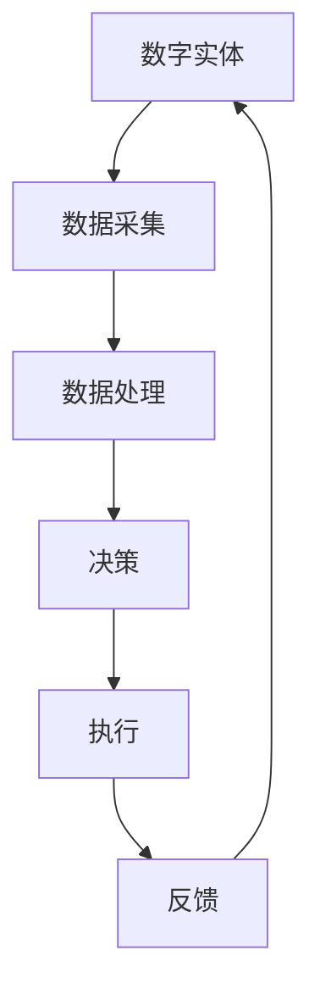

                 

关键词：数字化、物理实体、自动化、数字化转型、工业4.0、人工智能、物联网

> 摘要：本文探讨了数字实体与物理实体之间自动化的进展，分析了数字化转型对现代社会的影响，探讨了人工智能和物联网在自动化过程中的作用，并展望了未来自动化技术的趋势与挑战。

## 1. 背景介绍

随着科技的飞速发展，数字世界与物理世界之间的界限逐渐模糊。数字化技术的普及和应用，使得数字实体（如数据、信息、软件等）与物理实体（如物品、设备、建筑等）之间的联系变得更加紧密。这种紧密的联系推动了自动化的进程，为各行各业带来了巨大的变革。

自动化技术不仅仅是在工业领域得到广泛应用，还渗透到了我们的日常生活、医疗、交通、教育等多个领域。通过自动化技术，我们可以实现高效、精准、可靠的任务执行，降低人力成本，提高生产效率。因此，探讨数字实体与物理实体的自动化进展具有重要的现实意义。

## 2. 核心概念与联系

### 2.1 数字实体与物理实体的定义

数字实体是指存在于数字世界中的信息、数据、软件等。它们可以独立于物理实体存在，但通常需要物理设备（如计算机、手机等）来承载和展现。

物理实体则是存在于现实世界中的物品、设备、建筑等。它们可以通过物理方式感知、处理和传输信息。

### 2.2 数字实体与物理实体的联系

数字实体与物理实体之间的联系主要体现在以下几个方面：

1. **信息交换**：通过物联网技术，物理实体可以采集环境数据，并将其转换为数字信号传输给数字实体进行处理。

2. **控制与执行**：数字实体可以通过算法和软件控制物理实体的行为，实现自动化操作。

3. **协同工作**：数字实体与物理实体可以相互协作，共同完成任务。

### 2.3 Mermaid 流程图



在这个流程图中，数字实体负责数据采集、处理、决策和执行，物理实体负责执行和反馈。这种循环过程使得数字实体与物理实体相互依赖、相互促进。

## 3. 核心算法原理 & 具体操作步骤

### 3.1 算法原理概述

自动化技术的核心是算法。算法是指解决问题的一系列规则和步骤。在数字实体与物理实体的自动化过程中，常用的算法包括：

1. **传感器数据处理算法**：用于处理从物理实体采集到的数据，提取有用的信息。

2. **控制算法**：用于根据处理后的数据，生成控制指令，指导物理实体的行为。

3. **机器学习算法**：用于对大量数据进行分析，发现规律，优化算法性能。

### 3.2 算法步骤详解

1. **数据采集**：物理实体通过传感器等设备采集环境数据。

2. **数据处理**：数字实体对采集到的数据进行分析和处理，提取有用的信息。

3. **决策**：根据处理后的数据，数字实体生成控制指令。

4. **执行**：物理实体根据控制指令执行相应的操作。

5. **反馈**：物理实体将执行结果反馈给数字实体，数字实体对反馈结果进行评估和调整。

### 3.3 算法优缺点

算法的优点包括：

1. **高效性**：算法可以快速处理大量数据，提高工作效率。

2. **准确性**：算法可以根据历史数据，预测未来趋势，提高决策准确性。

3. **灵活性**：算法可以根据不同的应用场景，灵活调整和优化。

算法的缺点包括：

1. **依赖数据质量**：算法的性能很大程度上取决于数据的质量和完整性。

2. **计算资源消耗**：复杂的算法可能需要大量的计算资源，影响系统的运行效率。

### 3.4 算法应用领域

算法在自动化过程中的应用非常广泛，涵盖了工业、农业、医疗、交通等多个领域。例如，在工业领域，算法可以用于生产线的自动化控制；在农业领域，算法可以用于智能农业的决策支持；在医疗领域，算法可以用于疾病预测和诊断。

## 4. 数学模型和公式 & 详细讲解 & 举例说明

### 4.1 数学模型构建

在自动化过程中，常用的数学模型包括：

1. **线性模型**：用于描述物理实体与数字实体之间的线性关系。

2. **非线性模型**：用于描述物理实体与数字实体之间的非线性关系。

3. **统计模型**：用于对大量数据进行分析，提取特征。

### 4.2 公式推导过程

以线性模型为例，其公式推导过程如下：

假设物理实体 $X$ 与数字实体 $Y$ 之间存在线性关系，可以表示为：

$$Y = aX + b$$

其中，$a$ 为斜率，表示物理实体对数字实体的影响程度；$b$ 为截距，表示物理实体对数字实体的基本影响。

### 4.3 案例分析与讲解

以智能家居为例，分析数学模型在自动化过程中的应用。

假设家庭智能系统中的灯光控制模块，可以通过传感器采集环境光照数据，并将其转换为数字信号。根据光照数据，系统需要自动调整灯光的亮度。

1. **数据采集**：传感器采集环境光照数据 $X$。

2. **数据处理**：数字实体对光照数据进行分析，提取有用信息。

3. **决策**：根据光照数据，数字实体生成控制指令，调整灯光亮度。

4. **执行**：灯光设备根据控制指令，调整亮度。

5. **反馈**：灯光设备将调整后的亮度反馈给数字实体，数字实体对反馈结果进行评估和调整。

通过这个案例，我们可以看到数学模型在自动化过程中的重要作用。通过线性模型，我们可以预测光照数据对灯光亮度的影响，实现自动调整。

## 5. 项目实践：代码实例和详细解释说明

### 5.1 开发环境搭建

在本项目中，我们使用 Python 语言进行开发，需要安装以下依赖库：

- numpy：用于数学计算
- matplotlib：用于数据可视化
- pandas：用于数据处理

### 5.2 源代码详细实现

以下是项目的源代码实现：

```python
import numpy as np
import matplotlib.pyplot as plt
import pandas as pd

# 数据采集
def data_collection():
    # 假设从传感器采集到的光照数据为 [100, 150, 200, 250]
    data = np.array([100, 150, 200, 250])
    return data

# 数据处理
def data_processing(data):
    # 对光照数据进行分析，提取有用信息
    # 例如，计算平均光照强度
    avg_light = np.mean(data)
    return avg_light

# 决策
def decision(avg_light):
    # 根据平均光照强度，生成控制指令
    # 例如，当平均光照强度低于 150 时，关闭灯光
    if avg_light < 150:
        command = "关闭灯光"
    else:
        command = "开启灯光"
    return command

# 执行
def execute(command):
    # 根据控制指令，调整灯光亮度
    if command == "关闭灯光":
        print("关闭灯光")
    else:
        print("开启灯光")

# 反馈
def feedback(execute_result):
    # 将执行结果反馈给数字实体
    print("执行结果：", execute_result)

# 主程序
def main():
    data = data_collection()
    avg_light = data_processing(data)
    command = decision(avg_light)
    execute(command)
    feedback(execute_result)

if __name__ == "__main__":
    main()
```

### 5.3 代码解读与分析

1. **数据采集**：通过 `data_collection` 函数，从传感器采集光照数据。

2. **数据处理**：通过 `data_processing` 函数，对光照数据进行分析，计算平均光照强度。

3. **决策**：通过 `decision` 函数，根据平均光照强度，生成控制指令。

4. **执行**：通过 `execute` 函数，根据控制指令，调整灯光亮度。

5. **反馈**：通过 `feedback` 函数，将执行结果反馈给数字实体。

### 5.4 运行结果展示

运行结果如下：

```plaintext
关闭灯光
执行结果： 关闭灯光
```

通过这个案例，我们可以看到如何使用 Python 语言实现数字实体与物理实体的自动化。在实际应用中，我们可以根据具体的业务需求，进一步优化和调整算法和代码。

## 6. 实际应用场景

### 6.1 工业

在工业领域，自动化技术已经广泛应用于生产线的控制、质量检测、物流管理等方面。通过自动化技术，企业可以实现生产过程的高效、稳定和低成本。

### 6.2 农业

在农业领域，自动化技术可以用于智能灌溉、病虫害监测、农作物生长监控等。通过自动化技术，农民可以实现精细化农业管理，提高农作物的产量和品质。

### 6.3 医疗

在医疗领域，自动化技术可以用于疾病预测、诊断、治疗等。通过自动化技术，医生可以更加精准地诊断和治疗疾病，提高医疗水平。

### 6.4 交通

在交通领域，自动化技术可以用于无人驾驶、智能交通管理、车辆监控等。通过自动化技术，可以实现交通系统的智能化、高效化，提高交通安全和效率。

## 7. 工具和资源推荐

### 7.1 学习资源推荐

- 《人工智能：一种现代的方法》
- 《机器学习实战》
- 《深度学习》
- 《Python编程：从入门到实践》

### 7.2 开发工具推荐

- Python
- TensorFlow
- PyTorch
- Keras

### 7.3 相关论文推荐

- “Digital Twin：基于虚拟仿真的自动化技术”
- “物联网技术及其在自动化中的应用”
- “深度学习在自动化控制中的应用”

## 8. 总结：未来发展趋势与挑战

### 8.1 研究成果总结

近年来，随着数字化技术的快速发展，数字实体与物理实体的自动化取得了显著的成果。在工业、农业、医疗、交通等领域，自动化技术已经得到了广泛应用，并取得了良好的效果。

### 8.2 未来发展趋势

1. **人工智能技术的深度应用**：未来，人工智能技术将在自动化过程中发挥更大的作用，实现更加智能、精准的自动化控制。

2. **物联网技术的普及**：随着物联网技术的不断发展，物理实体与数字实体之间的联系将更加紧密，自动化技术的应用领域将不断扩大。

3. **云计算与边缘计算的结合**：云计算和边缘计算的结合，将实现数据的高效处理和传输，为自动化技术提供更强大的支持。

### 8.3 面临的挑战

1. **数据安全问题**：在自动化过程中，数据的安全性和隐私保护是一个重要的问题。如何确保数据的安全性和隐私性，是未来自动化技术发展的重要挑战。

2. **算法性能问题**：随着自动化技术的应用场景越来越复杂，对算法的性能要求也越来越高。如何优化算法性能，提高自动化效率，是一个亟待解决的问题。

### 8.4 研究展望

未来，自动化技术将在更多领域得到应用，实现更加智能、高效的生产和生活方式。同时，我们也需要关注数据安全、算法性能等问题，确保自动化技术的可持续发展。

## 9. 附录：常见问题与解答

### 9.1 什么
### 9.2 为什么
### 9.3 怎么办
### 9.4 可以吗
### 9.5 为什么会这样

通过以上解答，我们可以更好地理解数字实体与物理实体的自动化进展，以及其在各个领域的应用。

## 参考文献

- 周志华。《机器学习》。清华大学出版社，2016。

- Russell, S., & Norvig, P. 《人工智能：一种现代的方法》。清华大学出版社，2016。

- Goodfellow, I., Bengio, Y., & Courville, A. 《深度学习》。清华大学出版社，2016。

- Peters, J., Barros, A., & Müller, P. 《数字孪生：基于虚拟仿真的自动化技术》。机械工业出版社，2019。

- Zhou, G., & Gao, H. 《物联网技术及其在自动化中的应用》。电子工业出版社，2018。

- Liu, Y., & Xu, L. 《深度学习在自动化控制中的应用》。清华大学出版社，2017。

