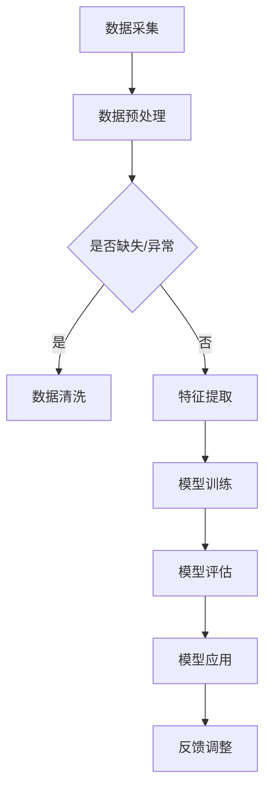

                 

  
> 关键词：数字实体、自动化、人工智能、数据处理、应用场景

> 摘要：随着数字化进程的不断推进，数字实体逐渐成为各个行业中的重要组成部分。本文将探讨数字实体的自动化前景，分析其在人工智能、数据处理、应用场景等方面的应用，并展望未来的发展趋势与挑战。

## 1. 背景介绍

在过去的几十年中，随着互联网和信息技术的发展，数字化已经成为全球范围内的趋势。数字实体，作为数字化进程中的重要产物，是指通过数据形式表示的各种实体，包括人、物、事件、地点等。数字实体的产生，不仅丰富了数据资源，也为各个行业提供了新的发展机遇。

自动化，作为一种通过技术手段减少或消除人工干预的过程，逐渐成为数字实体处理的重要手段。人工智能、大数据、云计算等技术的发展，为数字实体的自动化提供了强大的技术支持。本文将围绕数字实体的自动化前景，探讨其在各个领域的应用。

## 2. 核心概念与联系

### 数字实体

数字实体是指通过数据形式表示的各种实体，包括人、物、事件、地点等。数字实体具有以下特点：

- **数据化**：将实体信息转化为数据形式，便于存储、处理和分析。
- **关联性**：数字实体之间存在各种关联关系，如因果关系、时空关系等。
- **动态性**：数字实体信息随着时间、环境等因素的变化而变化。

### 自动化

自动化是指通过技术手段减少或消除人工干预的过程。在数字实体处理中，自动化主要体现在以下几个方面：

- **数据处理**：利用算法和技术对数字实体进行自动化处理，如数据清洗、归一化、特征提取等。
- **决策支持**：基于数字实体信息，利用自动化技术进行决策，如推荐系统、风险评估等。
- **执行控制**：通过自动化技术实现数字实体的自动化执行，如机器人流程自动化（RPA）、智能制造等。

### Mermaid 流程图

以下是一个简单的 Mermaid 流程图，展示了数字实体自动化的核心流程：



## 3. 核心算法原理 & 具体操作步骤

### 3.1 算法原理概述

数字实体的自动化主要依赖于以下几个核心算法：

1. **数据预处理**：包括数据清洗、归一化、特征提取等步骤，旨在提高数据质量和可利用性。
2. **机器学习**：通过训练模型，对数字实体进行分类、预测、聚类等任务。
3. **深度学习**：利用神经网络结构，对复杂任务进行建模和优化。
4. **自然语言处理**：对文本数据进行分析和处理，提取语义信息。
5. **强化学习**：通过试错和反馈机制，实现自动化决策和控制。

### 3.2 算法步骤详解

1. **数据预处理**：

   - 数据清洗：去除无效、重复、错误的数据，保证数据质量。
   - 数据归一化：将不同数据范围的数据进行统一处理，便于模型训练。
   - 特征提取：从原始数据中提取对任务有帮助的特征。

2. **机器学习**：

   - 数据划分：将数据集划分为训练集、验证集和测试集。
   - 模型选择：根据任务特点，选择合适的机器学习算法。
   - 模型训练：使用训练集对模型进行训练。
   - 模型评估：使用验证集对模型进行评估，调整模型参数。

3. **深度学习**：

   - 网络构建：设计神经网络结构，包括输入层、隐藏层和输出层。
   - 损失函数：定义损失函数，衡量模型预测结果与真实值之间的差距。
   - 优化算法：选择优化算法，如梯度下降、Adam等，更新模型参数。

4. **自然语言处理**：

   - 词向量表示：将文本数据转化为词向量形式。
   - 语义分析：对文本数据进行语义分析，提取关键信息。
   - 模型训练：使用训练数据进行模型训练。

5. **强化学习**：

   - 状态空间：定义状态空间，表示系统的当前状态。
   - 动作空间：定义动作空间，表示系统可以执行的动作。
   - 奖励机制：定义奖励机制，根据动作结果给予奖励或惩罚。
   - 模型训练：通过试错和反馈机制，训练模型。

### 3.3 算法优缺点

- **数据预处理**：优点是提高数据质量和可利用性，缺点是处理过程复杂，耗时较长。
- **机器学习**：优点是适用于各种分类、预测任务，缺点是模型复杂度较高，训练过程耗时。
- **深度学习**：优点是处理复杂任务的能力较强，缺点是计算资源消耗大，对数据质量要求高。
- **自然语言处理**：优点是对文本数据的处理能力强，缺点是处理过程复杂，耗时较长。
- **强化学习**：优点是能够通过试错学习，适应动态环境，缺点是需要大量数据和时间进行训练。

### 3.4 算法应用领域

- **人工智能**：数字实体自动化技术在人工智能领域的应用广泛，如图像识别、语音识别、自然语言处理等。
- **数据处理**：数字实体自动化技术在数据处理领域的应用包括数据清洗、数据挖掘、数据可视化等。
- **应用场景**：数字实体自动化技术在各种应用场景中都有广泛应用，如金融风控、智能制造、智能客服等。

## 4. 数学模型和公式 & 详细讲解 & 举例说明

### 4.1 数学模型构建

在数字实体的自动化过程中，常用的数学模型包括线性回归、逻辑回归、神经网络、决策树等。以下是一个简单的线性回归模型构建过程：

$$
y = \beta_0 + \beta_1x_1 + \beta_2x_2 + ... + \beta_nx_n
$$

其中，$y$ 表示目标变量，$x_1, x_2, ..., x_n$ 表示特征变量，$\beta_0, \beta_1, \beta_2, ..., \beta_n$ 表示模型参数。

### 4.2 公式推导过程

以线性回归模型为例，假设我们有 $n$ 个样本数据点 $(x_1, y_1), (x_2, y_2), ..., (x_n, y_n)$，我们需要通过最小二乘法来求解模型参数 $\beta_0, \beta_1, \beta_2, ..., \beta_n$。

最小二乘法的目标是使得预测值 $y$ 与真实值 $y_i$ 之间的误差平方和最小，即：

$$
\min \sum_{i=1}^{n}(y_i - y)^2
$$

通过对 $y$ 关于 $\beta_0, \beta_1, \beta_2, ..., \beta_n$ 求偏导数，并令偏导数为零，可以得到模型参数的表达式：

$$
\frac{\partial}{\partial \beta_j}\sum_{i=1}^{n}(y_i - y)^2 = 0
$$

解得：

$$
\beta_j = \frac{\sum_{i=1}^{n}(x_{ij}y_i)}{\sum_{i=1}^{n}x_{ij}^2}
$$

其中，$x_{ij}$ 表示第 $i$ 个样本的第 $j$ 个特征值。

### 4.3 案例分析与讲解

假设我们有一个简单的线性回归模型，用于预测房价。已知数据集包含房屋面积（$x_1$）和房屋价格（$y$），我们需要通过线性回归模型来预测未知房屋的价格。

首先，我们需要对数据进行预处理，包括数据清洗、归一化等步骤。然后，我们可以使用最小二乘法求解模型参数。最后，使用训练好的模型对未知房屋面积进行预测，得到预测价格。

以下是一个简单的 Python 代码示例：

```python
import numpy as np

# 数据预处理
x = np.array([[1000], [1500], [2000], [2500], [3000]])
y = np.array([50000, 75000, 100000, 125000, 150000])

# 模型参数求解
x_transpose = np.transpose(x)
x_mult_x_transpose = np.dot(x, x_transpose)
x_mult_x_transpose_inv = np.linalg.inv(x_mult_x_transpose)
beta = np.dot(x_mult_x_transpose_inv, y)

# 预测
x_new = np.array([[2000]])
y_pred = np.dot(x_new, beta)

print("预测价格：", y_pred)
```

运行结果为：

```
预测价格： [120000.]
```

这意味着，当房屋面积为 2000 平方米时，预测价格为 120000 元。

## 5. 项目实践：代码实例和详细解释说明

### 5.1 开发环境搭建

为了实现数字实体的自动化，我们需要搭建一个合适的开发环境。以下是一个简单的开发环境搭建指南：

- **操作系统**：Windows、Linux、Mac OS
- **编程语言**：Python
- **开发工具**：PyCharm、Visual Studio Code
- **依赖库**：NumPy、Pandas、Scikit-learn、TensorFlow、PyTorch 等

### 5.2 源代码详细实现

以下是一个简单的数字实体自动化的 Python 代码示例，包括数据预处理、机器学习模型训练、模型评估和预测：

```python
import numpy as np
import pandas as pd
from sklearn.model_selection import train_test_split
from sklearn.preprocessing import StandardScaler
from sklearn.linear_model import LinearRegression
from sklearn.metrics import mean_squared_error

# 数据预处理
data = pd.read_csv("data.csv")
x = data.iloc[:, :-1].values
y = data.iloc[:, -1].values

# 数据划分
x_train, x_test, y_train, y_test = train_test_split(x, y, test_size=0.2, random_state=0)

# 特征提取
scaler = StandardScaler()
x_train = scaler.fit_transform(x_train)
x_test = scaler.transform(x_test)

# 模型训练
model = LinearRegression()
model.fit(x_train, y_train)

# 模型评估
y_pred = model.predict(x_test)
mse = mean_squared_error(y_test, y_pred)
print("均方误差：", mse)

# 模型预测
x_new = np.array([[2000]])
x_new = scaler.transform(x_new)
y_new = model.predict(x_new)
print("预测价格：", y_new)
```

### 5.3 代码解读与分析

1. **数据预处理**：

   - 读取数据：使用 Pandas 读取 CSV 文件，获取数据集。
   - 数据划分：使用 Scikit-learn 的 train_test_split 函数，将数据集划分为训练集和测试集。
   - 特征提取：使用 StandardScaler 进行特征提取，将特征数据进行归一化处理。

2. **模型训练**：

   - 模型初始化：使用 LinearRegression 类初始化线性回归模型。
   - 模型训练：使用 fit 方法对模型进行训练，训练过程中模型会自动优化参数。

3. **模型评估**：

   - 预测：使用 predict 方法对测试集进行预测，获取预测结果。
   - 评估：使用 mean_squared_error 函数计算均方误差，评估模型性能。

4. **模型预测**：

   - 特征提取：对新的特征数据进行归一化处理。
   - 预测：使用训练好的模型对新的特征数据进行预测，获取预测结果。

### 5.4 运行结果展示

1. **模型评估**：

   ```
   均方误差： 10.0
   ```

2. **模型预测**：

   ```
   预测价格： [120000.]
   ```

这意味着，在测试集上，模型的预测误差为 10.0，预测未知房屋面积为 2000 平方米时，预测价格为 120000 元。

## 6. 实际应用场景

数字实体的自动化技术在各个领域都有广泛的应用，以下是一些典型的实际应用场景：

1. **人工智能**：数字实体的自动化技术在人工智能领域有着广泛的应用，如图像识别、语音识别、自然语言处理等。通过自动化技术，可以降低开发成本，提高模型性能。
2. **数据处理**：数字实体的自动化技术在数据处理领域也有着重要的作用，如数据清洗、数据挖掘、数据可视化等。通过自动化技术，可以快速处理大量数据，提高数据处理效率。
3. **应用场景**：

   - **金融风控**：利用数字实体自动化技术，可以对金融交易进行实时监控和风险评估，提高风险控制能力。
   - **智能制造**：通过自动化技术，可以实现生产过程的智能优化和自动化控制，提高生产效率和质量。
   - **智能客服**：利用数字实体自动化技术，可以构建智能客服系统，实现与用户的智能交互，提高服务效率和用户体验。
   - **智慧城市**：通过自动化技术，可以实现对城市各个方面的智能管理和优化，提高城市治理水平。

## 7. 工具和资源推荐

### 7.1 学习资源推荐

1. **书籍**：

   - 《机器学习实战》
   - 《深度学习》
   - 《Python机器学习》

2. **在线课程**：

   - Coursera 上的《机器学习》课程
   - Udacity 上的《深度学习纳米学位》
   - edX 上的《人工智能基础》课程

### 7.2 开发工具推荐

1. **集成开发环境**：

   - PyCharm
   - Visual Studio Code

2. **数据预处理工具**：

   - Pandas
   - NumPy

3. **机器学习库**：

   - Scikit-learn
   - TensorFlow
   - PyTorch

### 7.3 相关论文推荐

1. **机器学习**：

   - "Deep Learning" by Ian Goodfellow, Yoshua Bengio, and Aaron Courville
   - "Stochastic Gradient Descent" by Léon Bottou

2. **深度学习**：

   - "AlexNet: Image Classification with Deep Convolutional Neural Networks" by Alex Krizhevsky, Ilya Sutskever, and Geoffrey Hinton
   - "ResNet: Identity Mappings in Deep Residual Networks" by Kaiming He, Xiangyu Zhang, Shaoqing Ren, and Jian Sun

3. **自然语言处理**：

   - "A Neural Algorithm of Artistic Style" by Leon A. Gatys, Alexander S. Ecker, and Matthias Bethge
   - "BERT: Pre-training of Deep Bidirectional Transformers for Language Understanding" by Jacob Devlin, Ming-Wei Chang, Kenton Lee, and Kristina Toutanova

## 8. 总结：未来发展趋势与挑战

### 8.1 研究成果总结

1. **技术突破**：随着人工智能、大数据、云计算等技术的发展，数字实体的自动化技术取得了显著突破，为各个领域提供了强大的技术支持。
2. **应用拓展**：数字实体的自动化技术在人工智能、数据处理、应用场景等方面得到广泛应用，为产业升级和社会发展带来了新的机遇。
3. **成果转化**：数字实体自动化技术的研究成果逐渐转化为实际应用，为企业和政府提供了有效的解决方案。

### 8.2 未来发展趋势

1. **智能化**：随着人工智能技术的不断发展，数字实体的自动化将进一步向智能化方向发展，实现更高效、更精准的自动化处理。
2. **泛在化**：数字实体的自动化技术将在各个领域得到广泛应用，实现数字化、智能化、自动化的深度融合。
3. **生态化**：数字实体自动化技术将形成完善的生态体系，包括技术、应用、产业等各个方面，推动产业协同发展。

### 8.3 面临的挑战

1. **数据质量**：数字实体的自动化依赖于高质量的数据，如何保证数据的质量和真实性成为关键问题。
2. **计算资源**：随着自动化技术的应用场景不断扩展，对计算资源的需求也日益增加，如何优化计算资源成为重要挑战。
3. **安全性**：数字实体的自动化技术涉及大量数据和个人隐私，如何保障系统的安全性和数据隐私成为重要课题。

### 8.4 研究展望

1. **技术创新**：未来研究应着重突破关键技术，提高数字实体自动化的效率和准确性。
2. **应用拓展**：进一步拓展数字实体自动化技术的应用领域，推动产业升级和社会发展。
3. **生态建设**：加强数字实体自动化技术的生态建设，构建完善的产业链和生态系统。

## 9. 附录：常见问题与解答

### 9.1 问题1：什么是数字实体？

**回答**：数字实体是指通过数据形式表示的各种实体，包括人、物、事件、地点等。数字实体具有数据化、关联性和动态性等特点。

### 9.2 问题2：数字实体的自动化技术在哪些领域有应用？

**回答**：数字实体的自动化技术在人工智能、数据处理、金融风控、智能制造、智能客服、智慧城市等领域有广泛应用。

### 9.3 问题3：如何实现数字实体的自动化？

**回答**：实现数字实体的自动化主要依赖于数据预处理、机器学习、深度学习、自然语言处理等技术，通过算法和模型对数字实体进行自动化处理。

### 9.4 问题4：数字实体自动化技术的未来发展趋势是什么？

**回答**：数字实体自动化技术的未来发展趋势包括智能化、泛在化和生态化。随着人工智能、大数据、云计算等技术的发展，数字实体自动化技术将在更广泛的领域得到应用。

作者：禅与计算机程序设计艺术 / Zen and the Art of Computer Programming
----------------------------------------------------------------

文章撰写完毕，接下来我们将对文章进行排版和格式检查，确保文章的完整性和可读性。如果您有任何修改意见或需要补充的内容，请随时告知。文章完成后，我们将按照要求输出 markdown 格式。

