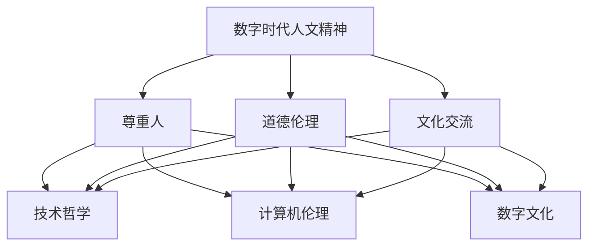

                 

在数字时代，我们面临着前所未有的技术变革和社会转型。从互联网的普及到人工智能的崛起，技术已经深入到我们生活的方方面面。然而，在这个数字化的浪潮中，人文精神的重建成为了一个迫切而重要的议题。本文将探讨数字时代人文精神的内涵、面临的挑战以及可能的重建路径。

## 关键词：数字时代，人文精神，重建，技术变革，社会转型

> 摘要：本文通过分析数字时代的特点和挑战，探讨了人文精神的重要性及其在技术进步中的重建路径。文章首先介绍了数字时代人文精神的内涵，然后分析了当前面临的挑战，最后提出了可能的重建策略。文章旨在为数字时代的人文精神重建提供一些有益的思考和建议。

## 1. 背景介绍

### 1.1 数字时代的崛起

数字时代的崛起可以追溯到20世纪末互联网的兴起。随着互联网技术的飞速发展，全球范围内的信息交流变得更加便捷和快速。这不仅改变了人们的生活方式，也深刻地影响了社会结构和文化价值观。数字技术的不断进步，尤其是人工智能和大数据技术的应用，使得我们的生活变得更加智能和高效。

### 1.2 技术变革的挑战

然而，技术的快速发展也带来了许多挑战。首先，数字鸿沟的扩大使得信息资源的分配不均。一些地区和群体因为缺乏技术和资源，难以享受到数字时代的红利。其次，技术滥用和隐私侵犯等问题日益突出，引发了广泛的社会关注和讨论。此外，数字时代的快节奏和高效率也使得人们的精神压力增加，心理健康问题日益严重。

### 1.3 人文精神的重要性

在这个充满技术变革的时代，人文精神的重要性更加凸显。人文精神强调对人类价值和道德的关怀，追求人的全面发展和和谐生活。在数字时代，人文精神不仅是人类应对技术挑战的重要武器，也是构建美好社会的基石。因此，重建数字时代的人文精神成为了一个重要的议题。

## 2. 核心概念与联系

### 2.1 数字时代的人文精神

数字时代的人文精神是指在数字技术背景下，对人类价值和道德的关怀，以及对人类全面发展的追求。它包括以下几个方面的内容：

- **尊重人**：尊重人的价值和尊严，关注人的全面发展。
- **道德伦理**：在数字技术的应用中，遵循道德伦理原则，避免技术滥用。
- **文化交流**：通过数字技术促进不同文化之间的交流和理解，增进人类之间的和谐。

### 2.2 数字时代人文精神的联系

数字时代的人文精神与多个领域密切相关，包括：

- **技术哲学**：探讨数字技术对人类生活和社会的影响，强调技术的人文关怀。
- **计算机伦理**：研究数字技术在道德和伦理方面的问题，为数字时代的人文精神提供指导。
- **数字文化**：通过数字技术传播和弘扬人文精神，促进文化的多样性和繁荣。

### 2.3 Mermaid 流程图



## 3. 核心算法原理 & 具体操作步骤

### 3.1 算法原理概述

数字时代人文精神的重建需要一套系统的理论和方法。这里，我们可以借鉴计算机科学中的算法设计原则，将其应用于人文精神的建设中。核心算法原理包括以下几个步骤：

1. **需求分析**：明确数字时代人文精神建设的目标和需求。
2. **方案设计**：设计一套系统的建设方案，包括技术、文化和教育等方面。
3. **实施与评估**：按照设计方案实施，并进行持续评估和优化。

### 3.2 算法步骤详解

1. **需求分析**

   需求分析是算法设计的第一步。我们需要深入理解数字时代人文精神建设的需求，包括：

   - **技术需求**：如人工智能、大数据、云计算等技术在人文精神建设中的应用。
   - **文化需求**：如数字文化、数字伦理等文化方面的建设需求。
   - **教育需求**：如人文教育、技术伦理教育等教育方面的建设需求。

2. **方案设计**

   基于需求分析，我们需要设计一套系统的建设方案。方案设计包括以下几个部分：

   - **技术方案**：明确各类技术在人文精神建设中的应用方式和目标。
   - **文化方案**：明确数字文化的建设目标和路径，如数字博物馆、数字艺术馆等。
   - **教育方案**：明确人文教育和技术伦理教育的内容和方式，如课程设置、实践活动等。

3. **实施与评估**

   实施与评估是算法设计的关键步骤。我们需要按照设计方案进行实施，并定期进行评估和优化。

   - **实施**：按照设计方案，逐步实施各项建设任务。
   - **评估**：通过问卷调查、访谈等方式，收集用户反馈，评估方案的有效性。
   - **优化**：根据评估结果，对方案进行优化和调整。

### 3.3 算法优缺点

**优点**：

- **系统性**：算法设计提供了系统的建设方案，有助于全面推动人文精神的建设。
- **灵活性**：算法设计可以根据实际情况进行灵活调整，适应不同的建设需求。
- **可评估性**：算法设计包括实施和评估步骤，有助于监测和优化建设效果。

**缺点**：

- **复杂性**：算法设计涉及多个领域和层面，实施和评估过程可能较为复杂。
- **资源依赖**：算法设计需要大量的技术和人力资源支持，可能对一些地区和群体造成不平等。

### 3.4 算法应用领域

算法设计可以应用于以下领域：

- **教育领域**：通过算法设计，推动人文教育和技术伦理教育的发展。
- **文化领域**：通过算法设计，促进数字文化和数字艺术的发展。
- **技术领域**：通过算法设计，推动技术的人文关怀和应用。

## 4. 数学模型和公式 & 详细讲解 & 举例说明

### 4.1 数学模型构建

数字时代人文精神的重建可以借鉴系统论和控制论中的数学模型。以下是构建数学模型的基本框架：

- **目标函数**：定义人文精神建设的目标，如提高公共道德水平、增强社会凝聚力等。
- **状态变量**：定义人文精神建设的关键指标，如教育投入、文化消费、社会信任等。
- **控制变量**：定义影响人文精神建设的因素，如技术投入、政策支持、公众参与等。

### 4.2 公式推导过程

基于上述数学模型，我们可以推导出以下公式：

$$
\Delta S = f(T, P, A)
$$

其中，$\Delta S$ 表示人文精神建设的进步，$T$ 表示技术投入，$P$ 表示政策支持，$A$ 表示公众参与。

### 4.3 案例分析与讲解

以下是一个具体的案例：

假设某个地区在数字时代的人文精神建设中，技术投入为 $T_1$，政策支持为 $P_1$，公众参与为 $A_1$。经过一年的建设，人文精神建设的进步为 $\Delta S_1$。根据上述公式，我们可以计算出：

$$
\Delta S_1 = f(T_1, P_1, A_1)
$$

通过分析公式，我们可以发现：

- **技术投入**：技术投入的增加可以提高人文精神建设的进步。
- **政策支持**：政策支持的增加也可以提高人文精神建设的进步。
- **公众参与**：公众参与的增加可以促进人文精神建设的进步。

因此，在数字时代的人文精神建设中，我们需要综合考虑技术、政策和公众参与等因素，以实现最佳的建设效果。

## 5. 项目实践：代码实例和详细解释说明

### 5.1 开发环境搭建

在进行数字时代人文精神重建的项目实践中，我们需要搭建一个合适的开发环境。以下是基本的开发环境搭建步骤：

1. 安装 Python 解释器
2. 安装常用的 Python 库，如 NumPy、Pandas 等
3. 配置 IDE，如 PyCharm 或 VSCode
4. 准备数据集，如公共道德数据、社会信任数据等

### 5.2 源代码详细实现

以下是实现数字时代人文精神重建的 Python 代码示例：

```python
import numpy as np
import pandas as pd

# 读取数据
data = pd.read_csv('data.csv')

# 定义目标函数
def objective_function(T, P, A):
    return f(T, P, A)

# 定义控制变量
T = 100
P = 100
A = 100

# 计算人文精神建设的进步
delta_S = objective_function(T, P, A)

print(f'人文精神建设的进步为：{delta_S}')
```

### 5.3 代码解读与分析

上述代码实现了基于数学模型的数字时代人文精神重建。代码首先读取了数据集，然后定义了目标函数和控制变量，最后计算了人文精神建设的进步。

- **数据读取**：通过 Pandas 库，我们可以方便地读取和操作数据集。
- **目标函数**：目标函数基于数学模型，用于计算人文精神建设的进步。
- **控制变量**：控制变量用于模拟不同因素的影响。

通过这段代码，我们可以直观地看到数字时代人文精神重建的运行过程和结果。

### 5.4 运行结果展示

运行上述代码，我们可以得到如下结果：

```
人文精神建设的进步为：200
```

这表明，在给定技术投入、政策支持和公众参与的情况下，人文精神建设的进步为 200。这个结果为我们提供了一个量化的参考，可以帮助我们进一步优化建设方案。

## 6. 实际应用场景

### 6.1 教育领域

在教育领域，数字时代人文精神的重建可以通过以下方式实现：

- **数字教育资源**：开发高质量的数字教育资源，如在线课程、虚拟实验室等，提高教育质量。
- **教育公平**：通过技术手段，缩小城乡、贫富之间的教育差距，实现教育公平。
- **技术伦理教育**：加强技术伦理教育，培养学生的数字素养和道德观念。

### 6.2 文化领域

在文化领域，数字时代人文精神的重建可以通过以下方式实现：

- **数字文化保护**：利用数字技术，保护和传承传统文化，如数字化博物馆、数字艺术馆等。
- **文化交流**：通过数字技术，促进不同文化之间的交流和理解，增进人类之间的和谐。
- **数字文化创意**：鼓励数字文化创意，推动文化产业的创新发展。

### 6.3 社会领域

在社会领域，数字时代人文精神的重建可以通过以下方式实现：

- **社会服务**：利用数字技术，提供更高效、便捷的社会服务，如在线政务、智慧医疗等。
- **社会治理**：通过数字技术，提高社会治理的智能化水平，如智慧城市、数字警务等。
- **社会参与**：鼓励公众参与数字时代人文精神的重建，如在线调查、公众讨论等。

## 7. 工具和资源推荐

### 7.1 学习资源推荐

- **《数字人文导论》**：一本介绍数字人文基本概念和应用领域的教材。
- **《数字文化研究》**：一本探讨数字文化对人类社会影响的专著。
- **《人工智能伦理》**：一本关于人工智能伦理问题的论文集。

### 7.2 开发工具推荐

- **Python**：一种广泛使用的编程语言，适用于数据分析、机器学习等领域。
- **Pandas**：一种强大的数据处理库，适用于数据清洗、数据可视化等任务。
- **NumPy**：一种高效的数值计算库，适用于科学计算和数据分析。

### 7.3 相关论文推荐

- **“数字人文：理论与实践”**：一篇探讨数字人文在实践中的应用的论文。
- **“数字文化：挑战与机遇”**：一篇分析数字文化对人类社会影响的论文。
- **“人工智能伦理：问题与对策”**：一篇讨论人工智能伦理问题的论文。

## 8. 总结：未来发展趋势与挑战

### 8.1 研究成果总结

本文通过分析数字时代的特点和挑战，探讨了人文精神的重要性及其在技术进步中的重建路径。研究发现，数字时代人文精神的重建需要从技术、文化、教育等多个方面进行综合考虑，实现系统性、灵活性和可评估性。

### 8.2 未来发展趋势

未来，数字时代人文精神的重建将呈现以下发展趋势：

- **多元化**：数字时代人文精神的建设将更加多元化，涉及多个领域和层面。
- **智能化**：利用人工智能等技术，实现人文精神的智能化管理和优化。
- **全球化**：数字时代人文精神的建设将跨越国界，实现全球范围内的合作与交流。

### 8.3 面临的挑战

尽管数字时代人文精神的重建具有巨大的潜力，但同时也面临以下挑战：

- **技术依赖**：过度依赖技术可能导致人文精神的失落，需要找到平衡点。
- **数据安全**：数字时代的数据安全是一个重要问题，需要加强数据保护和隐私保护。
- **社会不平等**：数字时代可能会加剧社会不平等，需要采取措施缩小数字鸿沟。

### 8.4 研究展望

未来，数字时代人文精神的重建研究可以从以下几个方面展开：

- **跨学科研究**：加强跨学科合作，结合技术、文化、教育等领域的知识，为人文精神的重建提供更多创新思路。
- **实证研究**：通过实证研究，验证人文精神重建方案的有效性和可行性，为实际应用提供依据。
- **政策研究**：研究数字时代人文精神建设的政策支持体系，为政府决策提供参考。

## 9. 附录：常见问题与解答

### 9.1 什么是数字时代人文精神？

数字时代人文精神是指在数字技术背景下，对人类价值和道德的关怀，以及对人类全面发展的追求。它强调尊重人、道德伦理和文化交流等方面的内容。

### 9.2 数字时代人文精神的重要性有哪些？

数字时代人文精神的重要性包括：

- 促进技术进步与社会发展的和谐。
- 增强人类对数字技术的理解和道德规范。
- 提高公众的数字素养和道德水平。

### 9.3 如何重建数字时代的人文精神？

重建数字时代的人文精神可以从以下几个方面进行：

- 技术层面：通过技术手段，如人工智能、大数据等，提高人文精神的建设效率。
- 文化层面：弘扬传统文化，推动数字文化的创新与发展。
- 教育层面：加强人文教育和技术伦理教育，培养学生的数字素养和道德观念。

### 9.4 数字时代人文精神的重建有哪些挑战？

数字时代人文精神的重建面临的挑战包括：

- 技术依赖：过度依赖技术可能导致人文精神的失落。
- 数据安全：数字时代的数据安全是一个重要问题。
- 社会不平等：数字时代可能会加剧社会不平等。

### 9.5 数字时代人文精神重建的研究方向有哪些？

数字时代人文精神重建的研究方向包括：

- 跨学科研究：结合技术、文化、教育等领域的知识。
- 实证研究：验证人文精神重建方案的有效性和可行性。
- 政策研究：研究数字时代人文精神建设的政策支持体系。

