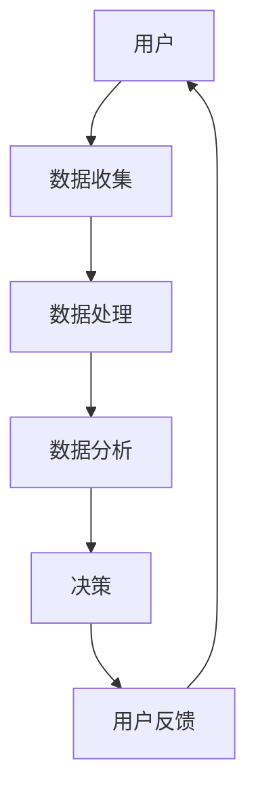

                 

关键词：平台经济、数据驱动、创新、技术架构、算法、应用场景、发展趋势

> 摘要：本文将探讨数据驱动平台经济的创新方法，分析其核心概念、算法原理，并通过实际项目案例和数学模型，详细解释其在不同领域的应用和未来发展。我们将介绍如何通过数据驱动的策略，实现平台经济的创新与增长，为企业和个人提供新的商业机会。

## 1. 背景介绍

### 平台经济的崛起

平台经济作为现代经济的重要形式，已经在全球范围内迅速崛起。从电子商务到共享经济，再到现代金融科技，平台经济的触角已经深入各个行业。这种经济模式通过连接供需双方，实现资源的高效配置和价值的最大化。

### 数据的重要性

在平台经济中，数据是关键驱动力。通过收集、分析和应用数据，平台能够更精准地满足用户需求，提升用户体验，创造更多的商业价值。大数据、人工智能等技术的发展，使得数据驱动的平台创新成为可能。

## 2. 核心概念与联系

### 平台经济的核心概念

- **平台**：连接供需双方的桥梁，提供交易、交流和服务的空间。
- **数据**：平台运营的基石，通过数据收集和分析，实现个性化服务、精准营销和资源优化配置。
- **用户**：平台的参与者和受益者，通过平台实现需求满足和利益共享。

### 架构的 Mermaid 流程图



## 3. 核心算法原理 & 具体操作步骤

### 3.1 算法原理概述

数据驱动的平台经济创新主要依赖于机器学习和数据分析技术。通过机器学习模型，平台能够从海量数据中提取有价值的信息，实现智能决策和个性化服务。

### 3.2 算法步骤详解

1. **数据收集**：通过多种渠道（如用户行为、交易记录、社交媒体等）收集数据。
2. **数据处理**：清洗、整合和预处理数据，为后续分析做好准备。
3. **数据分析**：使用机器学习算法（如聚类、分类、预测等）进行数据挖掘，提取关键特征。
4. **决策**：基于数据分析结果，制定运营策略和个性化服务方案。
5. **用户反馈**：收集用户反馈，调整和优化算法模型。

### 3.3 算法优缺点

**优点**：
- **个性化**：根据用户行为和偏好，提供个性化服务。
- **高效**：通过数据驱动，实现高效运营和资源优化。

**缺点**：
- **数据质量**：数据质量直接影响算法效果。
- **隐私**：数据收集和使用可能引发隐私问题。

### 3.4 算法应用领域

- **电子商务**：推荐系统、个性化营销等。
- **共享经济**：供需匹配、风险评估等。
- **金融科技**：风险管理、信用评估等。

## 4. 数学模型和公式 & 详细讲解 & 举例说明

### 4.1 数学模型构建

假设我们有一个电商平台，需要预测用户的购买行为。我们可以使用决策树模型来构建预测模型。

### 4.2 公式推导过程

决策树模型的预测公式为：

$$
y = f(x_1, x_2, ..., x_n)
$$

其中，$y$ 表示购买行为，$x_1, x_2, ..., x_n$ 表示用户特征。

### 4.3 案例分析与讲解

以某电商平台的用户购买预测为例，我们使用决策树模型进行预测。通过数据训练，我们得到以下决策树模型：


根据决策树模型，我们预测一个新用户是否会购买商品。假设该用户的特征如下：

- 用户年龄：30岁
- 收入水平：中高
- 购物频率：高
- 是否有孩子：是

根据决策树模型，该用户有较高的概率购买商品。

## 5. 项目实践：代码实例和详细解释说明

### 5.1 开发环境搭建

- Python 3.x
- Scikit-learn 库
- Pandas 库

### 5.2 源代码详细实现

```python
import pandas as pd
from sklearn.model_selection import train_test_split
from sklearn.tree import DecisionTreeClassifier
from sklearn.metrics import accuracy_score

# 加载数据
data = pd.read_csv('data.csv')

# 数据预处理
# ...

# 分割数据集
X_train, X_test, y_train, y_test = train_test_split(data.drop('target', axis=1), data['target'], test_size=0.2, random_state=42)

# 构建决策树模型
model = DecisionTreeClassifier()

# 训练模型
model.fit(X_train, y_train)

# 预测
predictions = model.predict(X_test)

# 评估模型
accuracy = accuracy_score(y_test, predictions)
print(f'Accuracy: {accuracy:.2f}')
```

### 5.3 代码解读与分析

上述代码首先加载数据，并进行预处理。然后，使用 Scikit-learn 库的 DecisionTreeClassifier 类构建决策树模型，并使用训练数据对其进行训练。最后，使用测试数据进行预测，并评估模型准确率。

## 6. 实际应用场景

### 6.1 电子商务

通过数据驱动，电商平台可以实现个性化推荐、精准营销等。例如，淘宝的“猜你喜欢”功能，就是通过用户行为数据，为用户推荐可能感兴趣的商品。

### 6.2 共享经济

共享经济平台（如滴滴、共享单车）可以通过数据驱动，实现供需匹配、风险评估等。例如，滴滴的智能调度系统，就是通过分析用户出行数据，实现高效的车辆调度和订单匹配。

### 6.3 金融科技

金融科技公司可以通过数据驱动，实现风险管理、信用评估等。例如，蚂蚁金服的信用评分模型，就是通过用户行为数据，评估用户的信用风险。

## 7. 工具和资源推荐

### 7.1 学习资源推荐

- 《机器学习实战》
- 《Python数据科学手册》
- Coursera 上的《机器学习》课程

### 7.2 开发工具推荐

- Jupyter Notebook
- Scikit-learn
- Pandas

### 7.3 相关论文推荐

- "Recommender Systems the Movie: An Introduction to Collaborative Filtering"
- "An Overview of Machine Learning for Text Classification"

## 8. 总结：未来发展趋势与挑战

### 8.1 研究成果总结

数据驱动平台经济创新已经取得了显著的成果，在多个领域都展现出了巨大的潜力。通过机器学习和数据分析，平台能够实现个性化服务、精准营销和资源优化配置。

### 8.2 未来发展趋势

- **数据治理**：随着数据量的增长，数据治理和隐私保护将成为重要课题。
- **多模态数据**：整合文本、图像、语音等多模态数据，实现更智能的决策。
- **边缘计算**：将计算能力下沉到边缘设备，实现实时数据处理和响应。

### 8.3 面临的挑战

- **数据质量**：数据质量直接影响算法效果，需要建立完善的数据质量控制体系。
- **隐私保护**：数据收集和使用可能引发隐私问题，需要制定有效的隐私保护策略。

### 8.4 研究展望

数据驱动平台经济创新将继续深入发展，有望带来更多的商业机会和社会价值。未来，我们将看到更多跨学科的融合，如数据科学、经济学、社会学等，共同推动平台经济的创新发展。

## 9. 附录：常见问题与解答

### 9.1 什么是平台经济？

平台经济是一种新型的经济模式，通过连接供需双方，提供交易、交流和服务的平台，实现资源的高效配置和价值的最大化。

### 9.2 数据驱动平台经济的优势是什么？

数据驱动平台经济的优势主要体现在以下几个方面：

- **个性化服务**：通过数据分析，为用户提供个性化服务，提升用户体验。
- **高效运营**：通过数据驱动，实现高效运营和资源优化配置。
- **精准营销**：通过用户行为数据，实现精准营销，提升销售转化率。

### 9.3 如何保证数据质量？

保证数据质量需要从数据收集、处理、存储、使用等各个环节进行控制。具体措施包括：

- **数据清洗**：清除重复、错误和异常数据。
- **数据验证**：对数据进行完整性、一致性和准确性验证。
- **数据治理**：建立数据质量管理体系，制定数据质量管理标准。

# 作者署名

作者：禅与计算机程序设计艺术 / Zen and the Art of Computer Programming
----------------------------------------------------------------

**文章撰写完毕，下一步将进行文章的校对与格式调整。请等待。**

