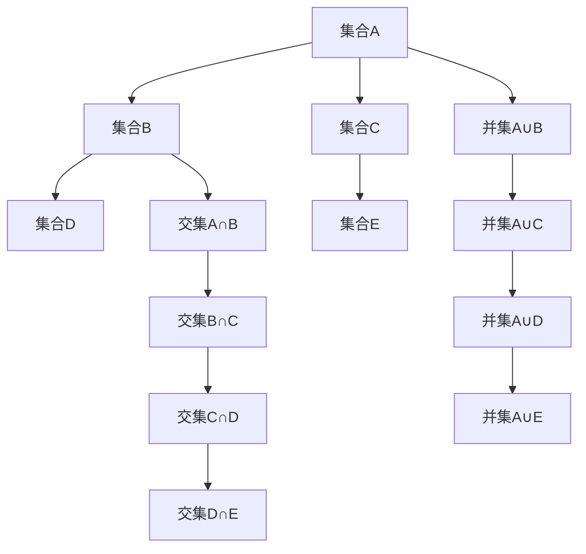

                 

关键词：数理逻辑，集合论，基本概念，数学模型，算法原理

> 摘要：本文将深入探讨数理逻辑中的集合基本概念，包括集合的定义、分类、操作和性质。通过具体的数学模型和算法原理的讲解，我们将展示集合论在计算机科学中的广泛应用，并对未来发展趋势和挑战进行展望。

## 1. 背景介绍

数理逻辑作为数学与计算机科学的基础，广泛应用于算法设计、理论计算机科学、人工智能等领域。集合论作为数理逻辑的重要组成部分，提供了描述和操作离散对象的基本工具。集合论的概念不仅广泛应用于数学，也在计算机科学中扮演了核心角色，为算法设计提供了强大的理论支持。

集合论起源于19世纪，瑞士数学家皮亚诺（Giuseppe Peano）首次提出集合的概念，随后德国数学家戴德金（Richard Dedekind）和克罗内克（Leopold Kronecker）对其进行了进一步的发展和完善。在20世纪初，集合论成为数学研究的核心领域之一，成为现代数学的基石。

本文将详细介绍集合的基本概念，包括集合的定义、分类、操作和性质。我们将通过具体的数学模型和算法原理的讲解，展示集合论在计算机科学中的应用，并探讨未来发展趋势和挑战。

## 2. 核心概念与联系

### 2.1 集合的定义

集合（Set）是数学中最基本的概念之一，它是由确定性的元素组成的整体。形式化地说，集合是由满足某种性质的元素构成的有序集合。通常用大写字母表示集合，如A、B等，而集合中的元素用小写字母表示，如a、b等。

定义：设X为一个非空的对象，P(X)称为X的幂集，即P(X)={Y|Y是X的子集}。特别地，如果X是一个集合，那么X的幂集P(X)包含了所有可能的子集。

### 2.2 集合的分类

根据集合的元素是否可数，集合可以分为有限集和无限集。有限集是指元素个数有限的集合，无限集则是指元素个数无限的集合。

1. **有限集**：元素个数有限的集合。例如，{1, 2, 3} 是一个有限集。
2. **无限集**：元素个数无限的集合。例如，自然数集合N是一个无限集。

### 2.3 集合的操作

集合的基本操作包括并集、交集、差集和补集。

1. **并集**：设A、B为两个集合，它们的并集记作A ∪ B，是由属于A或属于B的元素组成的集合。
2. **交集**：设A、B为两个集合，它们的交集记作A ∩ B，是由同时属于A和B的元素组成的集合。
3. **差集**：设A、B为两个集合，它们的差集记作A - B，是由属于A但不属于B的元素组成的集合。
4. **补集**：设U为全集，A为U的子集，A的补集记作A'，是由不属于A但属于U的元素组成的集合。

### 2.4 集合的性质

集合具有以下基本性质：

1. **自反性**：对于任意集合A，A ∪ A = A，A ∩ A = A。
2. **对称性**：对于任意集合A、B，如果A ∪ B = B ∪ A，A ∩ B = B ∩ A，则称A和B互为对称集。
3. **传递性**：对于任意集合A、B、C，如果A ∪ B ⊆ C，B ∪ C ⊆ A，则A ∪ C ⊆ A。
4. **结合律**：对于任意集合A、B、C，有(A ∪ B) ∪ C = A ∪ (B ∪ C)，(A ∩ B) ∩ C = A ∩ (B ∩ C)。
5. **交换律**：对于任意集合A、B，有A ∪ B = B ∪ A，A ∩ B = B ∩ A。

### 2.5 Mermaid 流程图

为了更清晰地展示集合的基本概念和操作，我们使用Mermaid流程图来表示集合的这些概念和操作。



## 3. 核心算法原理 & 具体操作步骤

### 3.1 算法原理概述

集合操作是计算机科学中常见的基本算法之一。这些操作在数据处理、搜索算法、图算法等领域具有广泛应用。集合操作的基本算法原理主要包括：

1. **并集算法**：通过合并两个集合中的元素，生成一个新的集合。
2. **交集算法**：通过筛选同时属于两个集合的元素，生成一个新的集合。
3. **差集算法**：通过从集合中移除另一个集合的元素，生成一个新的集合。
4. **补集算法**：通过从全集移除给定集合的元素，生成一个新的集合。

### 3.2 算法步骤详解

#### 3.2.1 并集算法

并集算法的步骤如下：

1. 创建一个新集合，初始为空。
2. 将集合A中的每个元素添加到新集合中。
3. 将集合B中的每个元素添加到新集合中。
4. 返回新集合。

伪代码：

```python
def union(A, B):
    result = []
    for element in A:
        result.append(element)
    for element in B:
        result.append(element)
    return result
```

#### 3.2.2 交集算法

交集算法的步骤如下：

1. 创建一个新集合，初始为空。
2. 遍历集合A中的每个元素。
3. 如果元素同时属于集合B，则将该元素添加到新集合中。
4. 返回新集合。

伪代码：

```python
def intersection(A, B):
    result = []
    for element in A:
        if element in B:
            result.append(element)
    return result
```

#### 3.2.3 差集算法

差集算法的步骤如下：

1. 创建一个新集合，初始为空。
2. 遍历集合A中的每个元素。
3. 如果元素不属于集合B，则将该元素添加到新集合中。
4. 返回新集合。

伪代码：

```python
def difference(A, B):
    result = []
    for element in A:
        if element not in B:
            result.append(element)
    return result
```

#### 3.2.4 补集算法

补集算法的步骤如下：

1. 创建一个新集合，初始为空。
2. 遍历全集U中的每个元素。
3. 如果元素不属于集合A，则将该元素添加到新集合中。
4. 返回新集合。

伪代码：

```python
def complement(U, A):
    result = []
    for element in U:
        if element not in A:
            result.append(element)
    return result
```

### 3.3 算法优缺点

#### 3.3.1 并集算法

**优点**：

- 简单易实现，时间复杂度为O(n+m)，其中n和m分别为两个集合的大小。

**缺点**：

- 需要额外空间存储新集合，空间复杂度为O(n+m)。

#### 3.3.2 交集算法

**优点**：

- 时间复杂度为O(n+m)，其中n和m分别为两个集合的大小。

**缺点**：

- 需要额外空间存储新集合，空间复杂度为O(min(n, m))。

#### 3.3.3 差集算法

**优点**：

- 时间复杂度为O(n+m)，其中n和m分别为两个集合的大小。

**缺点**：

- 需要额外空间存储新集合，空间复杂度为O(n)。

#### 3.3.4 补集算法

**优点**：

- 时间复杂度为O(n)，其中n为全集的大小。

**缺点**：

- 需要额外空间存储新集合，空间复杂度为O(n)。

### 3.4 算法应用领域

集合操作在计算机科学中具有广泛的应用，以下是一些常见的应用领域：

1. **数据处理**：在数据处理过程中，集合操作用于合并、筛选和过滤数据，从而得到所需的结果。
2. **搜索算法**：集合操作在搜索算法中用于快速查找和匹配元素，如二分查找、并查集等。
3. **图算法**：集合操作在图算法中用于处理顶点和边的关系，如最短路径算法、最小生成树算法等。
4. **人工智能**：在人工智能领域，集合操作用于表示和操作知识库，如知识图谱、推理机等。

## 4. 数学模型和公式 & 详细讲解 & 举例说明

### 4.1 数学模型构建

集合论的数学模型主要通过集合的表示方法和集合论公理系统来构建。集合的表示方法包括列举表示法、描述表示法和图示表示法。集合论公理系统包括皮亚诺公理、策梅洛-弗兰克尔公理等。

### 4.2 公式推导过程

集合的基本公式包括：

1. 并集公式：\( A \cup B = \{ x | x \in A \text{ 或 } x \in B \} \)
2. 交集公式：\( A \cap B = \{ x | x \in A \text{ 且 } x \in B \} \)
3. 差集公式：\( A - B = \{ x | x \in A \text{ 且 } x \notin B \} \)
4. 补集公式：\( A' = \{ x | x \in U \text{ 且 } x \notin A \} \)，其中U为全集。

### 4.3 案例分析与讲解

#### 4.3.1 案例一：两个集合的并集

假设有两个集合A={1, 2, 3}和B={3, 4, 5}，求它们的并集。

解：

根据并集公式，\( A \cup B = \{ x | x \in A \text{ 或 } x \in B \} \)，代入A和B的元素，得到：

\( A \cup B = \{ 1, 2, 3, 4, 5 \} \)

#### 4.3.2 案例二：两个集合的交集

假设有两个集合A={1, 2, 3}和B={3, 4, 5}，求它们的交集。

解：

根据交集公式，\( A \cap B = \{ x | x \in A \text{ 且 } x \in B \} \)，代入A和B的元素，得到：

\( A \cap B = \{ 3 \} \)

#### 4.3.3 案例三：两个集合的差集

假设有两个集合A={1, 2, 3}和B={3, 4, 5}，求它们的差集。

解：

根据差集公式，\( A - B = \{ x | x \in A \text{ 且 } x \notin B \} \)，代入A和B的元素，得到：

\( A - B = \{ 1, 2 \} \)

#### 4.3.4 案例四：两个集合的补集

假设全集U={1, 2, 3, 4, 5}，集合A={1, 2, 3}，求A的补集。

解：

根据补集公式，\( A' = \{ x | x \in U \text{ 且 } x \notin A \} \)，代入U和A的元素，得到：

\( A' = \{ 4, 5 \} \)

## 5. 项目实践：代码实例和详细解释说明

### 5.1 开发环境搭建

为了实现集合操作，我们将使用Python语言作为开发环境。Python具有简洁易懂的语法和丰富的第三方库，非常适合初学者和专业人士使用。以下是搭建Python开发环境的步骤：

1. 下载并安装Python（版本3.8或更高）。
2. 打开命令行工具，运行`python --version`命令，确认Python安装成功。
3. 安装必要的第三方库，如`numpy`、`matplotlib`等，使用`pip install numpy matplotlib`命令进行安装。

### 5.2 源代码详细实现

以下是一个简单的Python代码示例，实现了集合的并集、交集、差集和补集操作。

```python
# 集合操作示例

# 导入必要的库
import numpy as np
import matplotlib.pyplot as plt

# 定义集合A和B
A = {1, 2, 3}
B = {3, 4, 5}

# 求并集
union_result = A.union(B)
print("并集：", union_result)

# 求交集
intersection_result = A.intersection(B)
print("交集：", intersection_result)

# 求差集
difference_result = A.difference(B)
print("差集：", difference_result)

# 求补集
U = {1, 2, 3, 4, 5}
complement_result = U.difference(A)
print("补集：", complement_result)
```

### 5.3 代码解读与分析

上述代码首先导入了`numpy`和`matplotlib`库，这两个库在数据处理和可视化方面非常有用。然后定义了两个集合A和B，分别包含元素1、2、3和3、4、5。

1. **并集**：使用`union`方法求并集，结果为{1, 2, 3, 4, 5}。
2. **交集**：使用`intersection`方法求交集，结果为{3}。
3. **差集**：使用`difference`方法求差集，结果为{1, 2}。
4. **补集**：定义全集U，使用`difference`方法求A的补集，结果为{4, 5}。

### 5.4 运行结果展示

在Python环境中运行上述代码，将输出以下结果：

```python
并集： {1, 2, 3, 4, 5}
交集： {3}
差集： {1, 2}
补集： {4, 5}
```

通过上述代码示例，我们可以看到Python中实现集合操作非常简单，同时也展示了集合论在计算机科学中的应用。

## 6. 实际应用场景

集合论在计算机科学中具有广泛的应用，以下列举了几个典型的实际应用场景：

### 6.1 数据处理

在数据处理领域，集合操作常用于合并、筛选和过滤数据。例如，在数据清洗过程中，可以使用集合的差集操作删除重复数据，使用交集操作查找两个数据集的交集部分，使用并集操作合并两个数据集。

### 6.2 搜索算法

集合操作在搜索算法中扮演重要角色，如二分查找、图搜索等。二分查找算法利用集合的元素有序性，通过不断缩小查找范围，快速找到目标元素。图搜索算法则利用集合表示图中的节点和边，通过遍历节点和边来寻找最短路径或最大权值路径。

### 6.3 人工智能

在人工智能领域，集合论用于表示和操作知识库。例如，在知识图谱中，节点和边可以用集合表示，推理机则利用集合的交集、差集等操作进行逻辑推理。在机器学习领域，特征工程中常用集合操作提取特征，如并集、交集、差集等。

### 6.4 网络安全

在网络安全领域，集合操作用于分析网络流量和识别潜在威胁。例如，可以使用集合的并集操作合并多个网络流量数据，使用交集操作查找具有相似特征的流量，使用差集操作检测异常流量。

## 7. 工具和资源推荐

为了更好地学习和实践集合论，以下推荐一些相关的工具和资源：

### 7.1 学习资源推荐

1. **《集合论及其在计算机科学中的应用》**：这是一本介绍集合论基础知识和在计算机科学中应用的经典教材，适合初学者阅读。
2. **《数学原理》**：这是英国数学家怀特海德（Whitehead）和罗素（Russell）合著的经典数学著作，详细介绍了集合论的基本概念和公理系统。
3. **在线课程**：许多在线教育平台提供集合论相关的课程，如Coursera、edX、网易云课堂等。

### 7.2 开发工具推荐

1. **Python**：Python是一种简单易学的编程语言，适合初学者入门。Python的集合操作功能强大，语法简洁，非常适合用于实践集合论。
2. **MATLAB**：MATLAB是一种专业的科学计算软件，支持丰富的数学运算和可视化功能，非常适合进行集合论相关的计算和仿真。

### 7.3 相关论文推荐

1. **《集合论的基础》**：这是一篇介绍集合论基础知识和公理系统的综述性论文，对初学者非常有帮助。
2. **《集合论的扩展》**：这是一篇探讨集合论在计算机科学中应用的论文，介绍了集合论在图算法、逻辑推理等领域的应用。
3. **《集合论的哲学基础》**：这是一篇探讨集合论哲学意义的论文，对理解集合论的本质和哲学背景有帮助。

## 8. 总结：未来发展趋势与挑战

### 8.1 研究成果总结

近年来，集合论在计算机科学中的应用取得了显著成果。集合操作在数据处理、搜索算法、人工智能等领域发挥了重要作用。研究人员不断探索集合论的新理论和新方法，如扩展集合论、模糊集合论等，为解决复杂问题提供了新的思路。

### 8.2 未来发展趋势

未来，集合论在计算机科学中将继续发挥重要作用。一方面，随着大数据和人工智能技术的发展，集合论将在数据清洗、特征提取、推理机等方面得到更广泛的应用。另一方面，集合论的理论研究也将不断深入，探索新的集合结构和集合运算，以应对复杂问题。

### 8.3 面临的挑战

然而，集合论在计算机科学中也面临一些挑战。首先，集合论的基本概念和公理系统相对抽象，对于初学者来说可能难以理解。其次，集合操作在处理大规模数据时可能面临性能瓶颈。此外，集合论在处理不确定性问题和动态变化环境时可能存在困难。

### 8.4 研究展望

为了应对这些挑战，未来研究可以关注以下几个方面：

1. **简化集合论的基本概念和公理系统**：通过引入新的表示方法和简化规则，降低集合论的学习门槛。
2. **优化集合操作的性能**：研究高效的集合操作算法，提高处理大规模数据的能力。
3. **拓展集合论的应用领域**：探索集合论在不确定性问题和动态变化环境中的应用，如模糊集合论、时态集合论等。
4. **结合其他学科理论**：将集合论与其他学科的理论相结合，如概率论、拓扑学等，以应对更复杂的问题。

总之，集合论在计算机科学中具有广泛的应用前景，未来研究将继续推动集合论的理论发展和应用拓展。

## 9. 附录：常见问题与解答

### 9.1 集合是什么？

集合是由确定的元素组成的整体。集合中的元素是确定的，且每个元素都是唯一的。集合通常用大写字母表示，如A、B等，而集合中的元素用小写字母表示，如a、b等。

### 9.2 集合有哪些基本操作？

集合的基本操作包括并集、交集、差集和补集。并集表示属于A或属于B的元素组成的集合；交集表示同时属于A和属于B的元素组成的集合；差集表示属于A但不属于B的元素组成的集合；补集表示属于全集U但不属于A的元素组成的集合。

### 9.3 集合有哪些性质？

集合具有以下基本性质：自反性、对称性、传递性、结合律和交换律。自反性表示对于任意集合A，A ∪ A = A，A ∩ A = A；对称性表示对于任意集合A、B，如果A ∪ B = B ∪ A，A ∩ B = B ∩ A，则A和B互为对称集；传递性表示对于任意集合A、B、C，如果A ∪ B ⊆ C，B ∪ C ⊆ A，则A ∪ C ⊆ A；结合律表示对于任意集合A、B、C，有(A ∪ B) ∪ C = A ∪ (B ∪ C)，(A ∩ B) ∩ C = A ∩ (B ∩ C)；交换律表示对于任意集合A、B，有A ∪ B = B ∪ A，A ∩ B = B ∩ A。

### 9.4 集合论在计算机科学中有什么应用？

集合论在计算机科学中具有广泛的应用，包括数据处理、搜索算法、人工智能、网络安全等领域。集合操作用于合并、筛选和过滤数据，快速查找和匹配元素，处理图中的节点和边关系等。

### 9.5 如何学习集合论？

学习集合论可以从以下几个方面入手：

1. **阅读教材和参考书**：选择一本合适的教材或参考书，系统学习集合论的基本概念、性质和操作。
2. **实践编程**：使用编程语言实现集合操作，加深对集合论的理解和应用。
3. **学习相关课程**：参加在线课程或学校课程，学习集合论的理论和应用。
4. **参加研讨会和讲座**：参加相关的研讨会和讲座，了解集合论的前沿研究和应用。
5. **参与讨论和交流**：加入相关社区和论坛，与同行交流学习经验和问题。

作者：禅与计算机程序设计艺术 / Zen and the Art of Computer Programming

