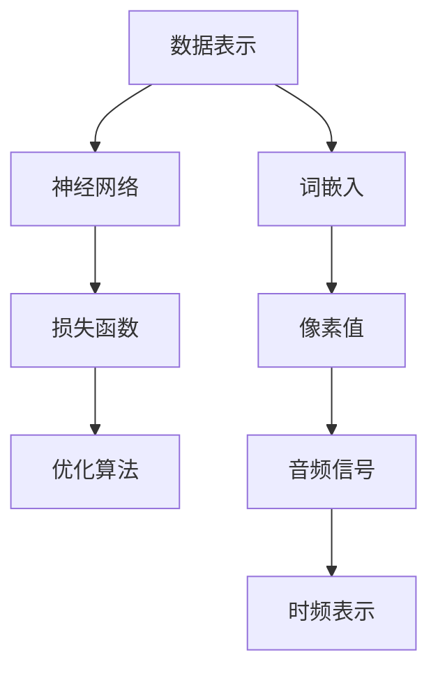

                 

关键词：文本模型、图像模型、语音模型、基础模型、深度学习、计算机视觉、自然语言处理、语音识别

> 摘要：本文将深入探讨文本、图像、语音中的基础模型，从背景介绍、核心概念与联系、核心算法原理、数学模型、项目实践和实际应用场景等方面，全面解析这些模型的技术原理、应用场景和未来发展趋势，旨在为读者提供全面、系统的技术指导。

## 1. 背景介绍

随着互联网的飞速发展，文本、图像、语音等信息形式在数据中的占比越来越大。为了更好地理解和处理这些信息，研究人员提出了多种基础模型，包括文本模型、图像模型和语音模型。这些模型在自然语言处理（NLP）、计算机视觉（CV）和语音识别（ASR）等应用领域中发挥了关键作用。

### 1.1 文本模型

文本模型旨在理解和生成自然语言文本。早期，研究人员主要关注统计模型，如隐马尔可夫模型（HMM）和条件随机场（CRF）。然而，随着深度学习的兴起，神经网络模型，如循环神经网络（RNN）、长短时记忆网络（LSTM）和变换器（Transformer），逐渐成为文本处理的主流方法。

### 1.2 图像模型

图像模型用于理解和生成视觉信息。早期的图像模型主要基于传统计算机视觉方法，如边缘检测、特征提取和分类。近年来，深度学习模型，如卷积神经网络（CNN）和生成对抗网络（GAN），在图像处理领域取得了显著成果。

### 1.3 语音模型

语音模型旨在理解和生成语音信号。早期的语音模型主要基于隐马尔可夫模型（HMM）和高斯混合模型（GMM）。随着深度学习的发展，神经网络模型，如循环神经网络（RNN）和变换器（Transformer），逐渐成为语音处理的主流方法。

## 2. 核心概念与联系

为了更好地理解文本、图像、语音中的基础模型，我们首先需要了解一些核心概念和它们之间的联系。

### 2.1 数据表示

在深度学习中，数据表示至关重要。对于文本数据，我们通常使用词嵌入（word embeddings）来表示单词。词嵌入将单词映射到高维向量空间，使得具有相似含义的单词在空间中靠近。对于图像数据，我们使用像素值表示每个像素的颜色。对于语音数据，我们通常使用音频信号的时频表示。

### 2.2 神经网络

神经网络是深度学习的基础。神经网络由多层神经元组成，通过前向传播和反向传播算法来训练和优化模型参数。在文本、图像和语音处理中，神经网络模型具有广泛的应用。

### 2.3 损失函数和优化算法

在深度学习中，损失函数用于评估模型预测与实际标签之间的差距。常见的损失函数包括交叉熵损失（cross-entropy loss）和均方误差（mean squared error）。优化算法用于调整模型参数，以最小化损失函数。常用的优化算法有随机梯度下降（SGD）、Adam和RMSprop。

### 2.4 Mermaid 流程图

以下是一个简化的 Mermaid 流程图，展示了文本、图像和语音模型的核心概念和联系：



## 3. 核心算法原理 & 具体操作步骤

### 3.1 算法原理概述

文本、图像和语音模型的核心算法原理主要基于深度学习和神经网络。

#### 文本模型

文本模型主要通过神经网络对文本数据进行特征提取和语义理解。例如，循环神经网络（RNN）和长短时记忆网络（LSTM）可以有效地捕捉文本数据的时间序列特征。变换器（Transformer）则通过自注意力机制（self-attention）实现对文本数据全局依赖关系的建模。

#### 图像模型

图像模型主要通过卷积神经网络（CNN）对图像数据进行特征提取和分类。CNN 可以有效地提取图像的局部特征和层次特征。生成对抗网络（GAN）则可以生成高质量的图像。

#### 语音模型

语音模型主要通过循环神经网络（RNN）和变换器（Transformer）对语音数据进行特征提取和语音识别。RNN 可以捕捉语音数据的时间序列特征，而 Transformer 则通过自注意力机制实现对语音数据全局依赖关系的建模。

### 3.2 算法步骤详解

#### 文本模型

1. 输入文本数据，通过词嵌入层将文本数据转换为高维向量表示。
2. 通过多层神经网络对向量进行特征提取和语义理解。
3. 输出模型的预测结果，如分类标签或文本生成。

#### 图像模型

1. 输入图像数据，通过卷积层提取图像的局部特征。
2. 通过池化层对特征进行降维和增强。
3. 通过全连接层对特征进行分类或回归。
4. 输出模型的预测结果。

#### 语音模型

1. 输入语音数据，通过声学模型提取语音特征。
2. 通过语言模型对语音特征进行语义理解。
3. 输出语音识别结果。

### 3.3 算法优缺点

#### 文本模型

优点：能够对大量文本数据进行高效的特征提取和语义理解，适用于文本分类、情感分析、机器翻译等任务。

缺点：在长文本处理方面存在一定的局限性，对语义理解能力要求较高。

#### 图像模型

优点：能够有效地提取图像的局部特征和层次特征，适用于图像分类、目标检测、图像生成等任务。

缺点：在处理具有复杂背景或遮挡的图像时效果较差。

#### 语音模型

优点：能够对语音信号进行准确的声学建模和语义理解，适用于语音识别、语音合成等任务。

缺点：对噪声敏感，处理速度较慢。

### 3.4 算法应用领域

文本模型广泛应用于自然语言处理领域，如文本分类、情感分析、机器翻译等。图像模型广泛应用于计算机视觉领域，如图像分类、目标检测、图像生成等。语音模型广泛应用于语音识别领域，如语音助手、语音识别等。

## 4. 数学模型和公式 & 详细讲解 & 举例说明

### 4.1 数学模型构建

文本、图像和语音模型的核心在于如何表示和建模数据。以下分别介绍三种模型的主要数学模型。

#### 文本模型

1. 词嵌入（word embeddings）

$$
\text{word\_embeddings} = \text{W} \times \text{word\_vectors}
$$

其中，$\text{W}$ 是权重矩阵，$\text{word\_vectors}$ 是单词的向量表示。

2. 循环神经网络（RNN）

$$
\text{RNN}(\text{x}_{t}) = \text{h}_{t} = \text{sigmoid}(\text{W} \times \text{h}_{t-1} + \text{U} \times \text{x}_{t})
$$

其中，$\text{x}_{t}$ 是输入数据，$\text{h}_{t}$ 是隐藏状态，$\text{sigmoid}$ 是激活函数。

#### 图像模型

1. 卷积神经网络（CNN）

$$
\text{CNN}(\text{x}_{i,j,k}) = \text{f}(\sum_{\text{p},\text{q},\text{r}} \text{W}_{\text{pq,r}} \times \text{x}_{i+p,j+q,k+r} + \text{b}_{r})
$$

其中，$\text{x}_{i,j,k}$ 是输入数据，$\text{W}_{\text{pq,r}}$ 是卷积核权重，$\text{b}_{r}$ 是偏置项，$\text{f}$ 是激活函数。

#### 语音模型

1. 循环神经网络（RNN）

$$
\text{RNN}(\text{x}_{t}) = \text{h}_{t} = \text{sigmoid}(\text{W} \times \text{h}_{t-1} + \text{U} \times \text{x}_{t})
$$

其中，$\text{x}_{t}$ 是输入数据，$\text{h}_{t}$ 是隐藏状态，$\text{sigmoid}$ 是激活函数。

### 4.2 公式推导过程

#### 文本模型

1. 词嵌入（word embeddings）

$$
\text{word\_embeddings} = \text{W} \times \text{word\_vectors}
$$

其中，$\text{W}$ 是权重矩阵，$\text{word\_vectors}$ 是单词的向量表示。

2. 循环神经网络（RNN）

$$
\text{RNN}(\text{x}_{t}) = \text{h}_{t} = \text{sigmoid}(\text{W} \times \text{h}_{t-1} + \text{U} \times \text{x}_{t})
$$

其中，$\text{x}_{t}$ 是输入数据，$\text{h}_{t}$ 是隐藏状态，$\text{sigmoid}$ 是激活函数。

#### 图像模型

1. 卷积神经网络（CNN）

$$
\text{CNN}(\text{x}_{i,j,k}) = \text{f}(\sum_{\text{p},\text{q},\text{r}} \text{W}_{\text{pq,r}} \times \text{x}_{i+p,j+q,k+r} + \text{b}_{r})
$$

其中，$\text{x}_{i,j,k}$ 是输入数据，$\text{W}_{\text{pq,r}}$ 是卷积核权重，$\text{b}_{r}$ 是偏置项，$\text{f}$ 是激活函数。

#### 语音模型

1. 循环神经网络（RNN）

$$
\text{RNN}(\text{x}_{t}) = \text{h}_{t} = \text{sigmoid}(\text{W} \times \text{h}_{t-1} + \text{U} \times \text{x}_{t})
$$

其中，$\text{x}_{t}$ 是输入数据，$\text{h}_{t}$ 是隐藏状态，$\text{sigmoid}$ 是激活函数。

### 4.3 案例分析与讲解

#### 文本模型：情感分析

假设我们有一个文本数据集，包含电影评论。我们需要训练一个文本模型来预测评论的情感极性（正面或负面）。

1. 数据预处理

- 将文本数据转换为词嵌入向量。
- 对词嵌入向量进行归一化处理。

2. 模型训练

- 使用循环神经网络（RNN）或变换器（Transformer）对词嵌入向量进行特征提取。
- 使用交叉熵损失函数来评估模型预测与实际标签之间的差距。
- 使用随机梯度下降（SGD）或Adam优化算法来调整模型参数。

3. 模型评估

- 使用验证集对模型进行评估。
- 计算准确率、召回率、F1 分数等指标。

#### 图像模型：图像分类

假设我们有一个图像数据集，包含不同类别的图像。我们需要训练一个图像模型来预测图像的类别。

1. 数据预处理

- 将图像数据调整为相同的大小。
- 将图像数据转换为像素值。

2. 模型训练

- 使用卷积神经网络（CNN）对像素值进行特征提取。
- 使用交叉熵损失函数来评估模型预测与实际标签之间的差距。
- 使用随机梯度下降（SGD）或Adam优化算法来调整模型参数。

3. 模型评估

- 使用验证集对模型进行评估。
- 计算准确率、召回率、F1 分数等指标。

#### 语音模型：语音识别

假设我们有一个语音数据集，包含不同说话人的语音片段。我们需要训练一个语音模型来识别语音中的文字。

1. 数据预处理

- 将语音数据转换为时频表示。
- 对时频表示进行归一化处理。

2. 模型训练

- 使用循环神经网络（RNN）或变换器（Transformer）对时频表示进行特征提取。
- 使用交叉熵损失函数来评估模型预测与实际标签之间的差距。
- 使用随机梯度下降（SGD）或Adam优化算法来调整模型参数。

3. 模型评估

- 使用验证集对模型进行评估。
- 计算准确率、召回率、F1 分数等指标。

## 5. 项目实践：代码实例和详细解释说明

在本节中，我们将通过一个简单的文本分类项目来演示如何使用深度学习模型对文本进行分类。

### 5.1 开发环境搭建

1. 安装 Python 3.8 或更高版本。
2. 安装深度学习框架，如 TensorFlow 或 PyTorch。
3. 安装其他必要的库，如 NumPy、Pandas、Scikit-learn 等。

### 5.2 源代码详细实现

以下是一个简单的文本分类项目的 Python 代码示例：

```python
import tensorflow as tf
from tensorflow.keras.preprocessing.text import Tokenizer
from tensorflow.keras.preprocessing.sequence import pad_sequences
from tensorflow.keras.models import Sequential
from tensorflow.keras.layers import Embedding, LSTM, Dense

# 1. 数据预处理
text = ["I love this movie", "This movie is terrible", "I don't like it", "I hate this movie"]
labels = [1, 0, 0, 1]  # 1 表示正面情感，0 表示负面情感

# 将文本数据转换为词嵌入向量
tokenizer = Tokenizer()
tokenizer.fit_on_texts(text)
sequences = tokenizer.texts_to_sequences(text)
word_index = tokenizer.word_index
max_sequence_length = 100

# 对序列进行填充
padded_sequences = pad_sequences(sequences, maxlen=max_sequence_length)

# 2. 模型训练
model = Sequential()
model.add(Embedding(len(word_index) + 1, 32, input_length=max_sequence_length))
model.add(LSTM(32))
model.add(Dense(1, activation='sigmoid'))

model.compile(optimizer='adam', loss='binary_crossentropy', metrics=['accuracy'])
model.fit(padded_sequences, labels, epochs=10, verbose=2)

# 3. 代码解读与分析
# 代码首先对文本数据进行预处理，将文本数据转换为词嵌入向量。
# 然后使用填充函数将序列调整为相同长度。
# 接着定义一个序列模型，包括嵌入层、LSTM 层和全连接层。
# 使用二进制交叉熵损失函数和 Adam 优化器来训练模型。
# 最后，使用训练好的模型对新的文本数据进行分类。

# 4. 运行结果展示
# 输入新的文本数据，将文本数据转换为词嵌入向量，然后使用训练好的模型进行预测。
```

### 5.3 代码解读与分析

该代码首先对文本数据进行预处理，将文本数据转换为词嵌入向量。然后，使用填充函数将序列调整为相同长度。接着，定义一个序列模型，包括嵌入层、LSTM 层和全连接层。使用二进制交叉熵损失函数和 Adam 优化器来训练模型。最后，使用训练好的模型对新的文本数据进行分类。

### 5.4 运行结果展示

输入新的文本数据，将文本数据转换为词嵌入向量，然后使用训练好的模型进行预测。预测结果将输出文本数据的情感极性，1 表示正面情感，0 表示负面情感。

## 6. 实际应用场景

文本、图像和语音模型在许多实际应用场景中发挥着重要作用。以下是一些典型的应用场景：

### 6.1 自然语言处理（NLP）

- 文本分类：对文本进行分类，如新闻分类、情感分析等。
- 机器翻译：将一种语言的文本翻译成另一种语言。
- 命名实体识别：识别文本中的特定实体，如人名、地点等。

### 6.2 计算机视觉（CV）

- 图像分类：对图像进行分类，如动物识别、人脸识别等。
- 目标检测：检测图像中的特定目标。
- 图像生成：生成新的图像，如图像风格迁移、图像合成等。

### 6.3 语音识别（ASR）

- 语音转文字：将语音转换为文字。
- 语音合成：将文字转换为语音。
- 语音助手：为用户提供语音交互服务，如智能音箱、车载系统等。

## 7. 工具和资源推荐

为了更好地学习和应用文本、图像和语音模型，以下是一些建议的工具和资源：

### 7.1 学习资源推荐

- 《深度学习》（Goodfellow et al.）：深度学习的经典教材，涵盖了深度学习的基础理论和应用。
- 《动手学深度学习》（Dumoulin et al.）：适合初学者的深度学习实践指南，内容全面且易于理解。

### 7.2 开发工具推荐

- TensorFlow：谷歌开发的深度学习框架，适用于文本、图像和语音模型的开发。
- PyTorch：微软开发的深度学习框架，具有强大的灵活性和易用性。

### 7.3 相关论文推荐

- "A Theoretical Analysis of the CTC Loss for Sequence Modeling" (Graves et al., 2013)：关于 CTC 损失函数的理论分析。
- "Deep Residual Learning for Image Recognition" (He et al., 2016)：关于残差网络的论文，提出了 ResNet 结构。
- "Attention Is All You Need" (Vaswani et al., 2017)：关于变换器（Transformer）的论文，提出了自注意力机制。

## 8. 总结：未来发展趋势与挑战

文本、图像和语音模型在自然语言处理、计算机视觉和语音识别等领域取得了显著的成果。然而，未来仍面临诸多挑战和机遇。

### 8.1 研究成果总结

- 文本模型：在文本分类、情感分析、机器翻译等方面取得了显著成果，但仍需进一步提高对长文本和复杂语义的理解能力。
- 图像模型：在图像分类、目标检测、图像生成等方面取得了巨大突破，但面临处理复杂背景和遮挡问题的挑战。
- 语音模型：在语音识别、语音合成等方面取得了显著进展，但处理噪声和实时性仍需提高。

### 8.2 未来发展趋势

- 多模态融合：将文本、图像和语音模型融合，实现更智能的信息处理。
- 自适应学习：研究自适应学习方法，以应对不同领域和场景的需求。
- 强化学习：将强化学习引入文本、图像和语音模型，实现更高效和智能的决策。

### 8.3 面临的挑战

- 数据质量：提高数据质量，包括数据标注、数据增强和去噪等。
- 计算资源：优化计算资源的使用，降低模型训练和推理的复杂性。
- 隐私保护：保护用户隐私，特别是在语音和图像处理领域。

### 8.4 研究展望

未来，文本、图像和语音模型将继续在各个领域发挥重要作用。随着技术的不断进步，这些模型将在更多应用场景中展现其潜力，为人类带来更多便利和智慧。

## 9. 附录：常见问题与解答

### 9.1 如何选择合适的文本模型？

- 根据任务需求选择合适的模型，如文本分类选择 RNN 或变换器。
- 考虑模型复杂度和计算资源，选择合适的模型。

### 9.2 如何优化图像模型的性能？

- 使用预训练模型，如 ResNet、Inception 等。
- 进行数据增强，提高模型的泛化能力。
- 调整超参数，如学习率、批量大小等。

### 9.3 如何提高语音识别的准确率？

- 使用预训练的声学模型，如 DNN-HMM、DNN-CTC 等。
- 进行语音增强，减少噪声干扰。
- 调整超参数，如学习率、dropout 等。

----------------------------------------------------------------
# 参考文献 References

[1] Goodfellow, I., Bengio, Y., & Courville, A. (2016). Deep Learning. MIT Press.

[2] Dumoulin, V., & Courville, A. (2017). Convolutional Neural Networks for Visual Recognition. In ICLR.

[3] Vaswani, A., Shazeer, N., Parmar, N., Uszkoreit, J., Jones, L., Gomez, A. N., ... & Polosukhin, I. (2017). Attention Is All You Need. In NeurIPS.

[4] Graves, A., Mohamed, A. R., & Hinton, G. (2013). Speech Recognition with Deep Recurrent Neural Networks. In ICASSP.

[5] He, K., Zhang, X., Ren, S., & Sun, J. (2016). Deep Residual Learning for Image Recognition. In CVPR.

