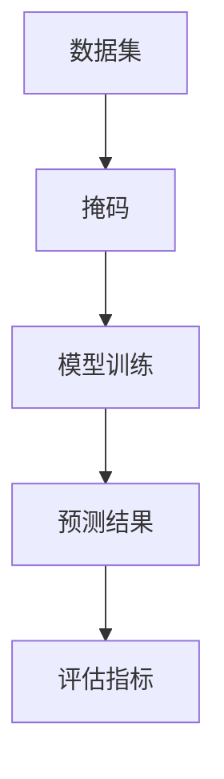
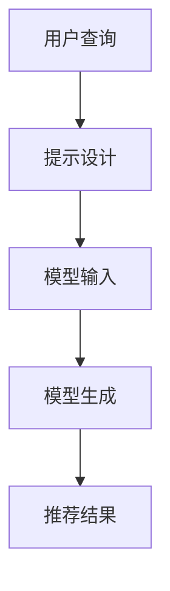

                 

新闻推荐系统作为现代信息社会中不可或缺的一部分，正日益影响着人们的日常生活。而技术上的不断创新，使得这些系统能够更精准、更个性地满足用户的需求。在众多创新技术中，掩码预测与Prompt工程是近年来备受关注的话题。本文将深入探讨这两项技术，解释它们的工作原理，分析其在新闻推荐中的应用，并展望它们未来的发展趋势。

> **关键词**：新闻推荐、掩码预测、Prompt工程、人工智能、信息过滤

> **摘要**：本文旨在介绍和讨论新闻推荐领域中的两项前沿技术——掩码预测与Prompt工程。通过对这两项技术的深入分析，我们希望能够揭示它们如何改变新闻推荐系统的运作方式，以及它们在未来的潜力。

## 1. 背景介绍

随着互联网的普及和信息的爆炸式增长，用户每天面临的海量信息难以筛选和处理。新闻推荐系统应运而生，通过分析用户的兴趣和行为，为用户提供个性化的内容。传统的新闻推荐算法主要依赖于用户的历史行为、内容特征和协同过滤等方法，但它们往往存在信息过载和个性化不足的问题。因此，研究人员不断寻求新的方法来提高推荐系统的性能和用户体验。

在这个背景下，掩码预测和Prompt工程成为解决信息过载和提升个性化推荐的重要手段。掩码预测利用掩码技术对数据集进行预处理，以增强模型的泛化能力。而Prompt工程则通过设计特定的提示来引导模型生成更加精确和有针对性的推荐。

## 2. 核心概念与联系

为了更好地理解掩码预测和Prompt工程，我们需要首先了解它们背后的核心概念和原理。

### 2.1 掩码预测

掩码预测是一种数据预处理技术，通过在数据集中随机选择一部分数据进行掩码，即隐藏其真实值，然后训练模型去预测这些被掩码的值。这个过程有助于增强模型对未知数据的适应能力，从而提高其泛化性能。

#### Mermaid 流程图：



### 2.2 Prompt工程

Prompt工程是一种基于自然语言处理的技术，通过设计特定的提示来引导模型生成预测结果。这些提示通常包含用户的查询信息、上下文背景等，以帮助模型更好地理解用户的需求。

#### Mermaid 流程图：



### 2.3 掩码预测与Prompt工程的联系

掩码预测和Prompt工程虽然在技术上有所不同，但它们在提升推荐系统的性能方面具有相似的目标。掩码预测通过引入不确定性，增强模型的泛化能力；而Prompt工程则通过精细化提示，提高推荐的精确性。二者相辅相成，共同推动新闻推荐系统向更智能、更个性化的方向发展。

## 3. 核心算法原理 & 具体操作步骤

### 3.1 算法原理概述

#### 掩码预测

掩码预测的核心思想是将数据集划分为训练集和掩码集，然后在掩码集上进行预测。具体步骤如下：

1. 数据集划分：将原始数据集随机分为训练集和掩码集。
2. 掩码：在掩码集上随机选择一部分数据进行掩码。
3. 训练：使用训练集数据训练模型。
4. 预测：使用模型对掩码集的数据进行预测。

#### Prompt工程

Prompt工程的核心思想是通过设计特定的提示来引导模型生成预测结果。具体步骤如下：

1. 提示设计：根据用户查询和上下文背景设计提示。
2. 模型输入：将提示输入到模型中。
3. 模型生成：模型根据输入的提示生成预测结果。
4. 结果输出：输出推荐结果。

### 3.2 算法步骤详解

#### 掩码预测

1. **数据集划分**：使用随机划分方法将原始数据集划分为训练集和掩码集，例如，80%的数据用于训练集，20%的数据用于掩码集。

    ```python
    from sklearn.model_selection import train_test_split

    X_train, X_mask, y_train, y_mask = train_test_split(X, y, test_size=0.2, random_state=42)
    ```

2. **掩码**：在掩码集上随机选择一部分数据进行掩码。掩码的方法有多种，如随机掩码、时间掩码等。

    ```python
    import numpy as np

    mask_rate = 0.1  # 掩码比例
    mask_indices = np.random.choice(range(len(X_mask)), size=int(mask_rate * len(X_mask)), replace=False)
    X_mask[mask_indices] = np.nan  # 进行掩码
    ```

3. **训练**：使用训练集数据训练模型。掩码预测通常使用回归模型，如线性回归、随机森林等。

    ```python
    from sklearn.ensemble import RandomForestRegressor

    model = RandomForestRegressor(n_estimators=100, random_state=42)
    model.fit(X_train, y_train)
    ```

4. **预测**：使用模型对掩码集的数据进行预测。

    ```python
    y_mask_pred = model.predict(X_mask)
    ```

5. **评估**：使用评估指标（如均方误差、平均绝对误差等）评估模型的性能。

    ```python
    from sklearn.metrics import mean_squared_error

    mse = mean_squared_error(y_mask, y_mask_pred)
    print(f"Masked MSE: {mse}")
    ```

#### Prompt工程

1. **提示设计**：根据用户查询和上下文背景设计提示。提示的设计对于模型生成高质量的预测结果至关重要。

    ```python
    query = "最新科技新闻"
    context = "科技领域最近有哪些突破性进展？"
    prompt = f"{context}，请问有哪些最新的科技新闻？查询关键词：{query}"
    ```

2. **模型输入**：将提示输入到模型中。Prompt工程通常使用基于Transformer的模型，如BERT、GPT等。

    ```python
    from transformers import BertTokenizer, BertModel

    tokenizer = BertTokenizer.from_pretrained("bert-base-uncased")
    model = BertModel.from_pretrained("bert-base-uncased")

    inputs = tokenizer(prompt, return_tensors="pt")
    outputs = model(**inputs)
    ```

3. **模型生成**：模型根据输入的提示生成预测结果。Prompt工程生成的预测结果通常是一个文本序列。

    ```python
    predicted_text = outputs[0][0][0].item()
    print(f"Predicted Text: {predicted_text}")
    ```

4. **结果输出**：输出推荐结果。根据生成的文本序列，提取关键信息作为推荐结果。

    ```python
    recommendation = predicted_text.split(", ")[1].strip()
    print(f"Recommendation: {recommendation}")
    ```

### 3.3 算法优缺点

#### 掩码预测

**优点**：

- 增强模型的泛化能力。
- 提高推荐系统的鲁棒性。

**缺点**：

- 可能会导致训练时间增加。
- 需要大量未标记的数据。

#### Prompt工程

**优点**：

- 提高推荐系统的精确性。
- 降低对大量未标记数据的依赖。

**缺点**：

- 提示设计复杂，需要大量专业知识和经验。
- 可能导致模型过拟合。

### 3.4 算法应用领域

#### 掩码预测

- 新闻推荐系统。
- 广告投放系统。
- 社交网络推荐。

#### Prompt工程

- 搜索引擎。
- 对话系统。
- 问答系统。

## 4. 数学模型和公式 & 详细讲解 & 举例说明

### 4.1 数学模型构建

#### 掩码预测

假设我们有一个包含n个特征的样本集X，每个样本都有一个对应的标签y。我们使用线性回归模型进行预测，其数学模型可以表示为：

$$
y = \beta_0 + \beta_1x_1 + \beta_2x_2 + ... + \beta_nx_n
$$

其中，$\beta_0$是截距，$\beta_1, \beta_2, ..., \beta_n$是每个特征的权重。

#### Prompt工程

假设我们有一个基于Transformer的模型，其输入为一个文本序列$T = [t_1, t_2, ..., t_n]$，输出为一个预测结果$y$。模型的数学模型可以表示为：

$$
y = f(T) = g(\text{Attention}(W_T T))
$$

其中，$W_T$是权重矩阵，$g$是激活函数，$\text{Attention}$是注意力机制。

### 4.2 公式推导过程

#### 掩码预测

1. **损失函数**：

   线性回归的损失函数通常采用均方误差（MSE）：

   $$
   \text{MSE} = \frac{1}{n} \sum_{i=1}^{n} (y_i - \hat{y}_i)^2
   $$

   其中，$y_i$是真实标签，$\hat{y}_i$是预测标签。

2. **优化方法**：

   使用梯度下降法来最小化损失函数：

   $$
   \beta_j = \beta_j - \alpha \frac{\partial \text{MSE}}{\partial \beta_j}
   $$

   其中，$\alpha$是学习率。

#### Prompt工程

1. **注意力机制**：

   Transformer模型的核心是自注意力机制，其计算公式为：

   $$
   \text{Attention}(Q, K, V) = \frac{1}{\sqrt{d_k}} \text{softmax}(\text{scores})V
   $$

   其中，$Q, K, V$分别是查询、键和值序列，$d_k$是键的维度，$scores$是每个键和查询的相似度分数。

2. **损失函数**：

   交叉熵损失函数通常用于序列预测任务：

   $$
   \text{CrossEntropy} = -\sum_{i=1}^{n} y_i \log(\hat{y}_i)
   $$

   其中，$y_i$是真实标签，$\hat{y}_i$是预测标签。

### 4.3 案例分析与讲解

#### 掩码预测案例

假设我们有一个包含3个特征的新闻推荐数据集，数据集大小为1000个样本。使用线性回归模型进行掩码预测，学习率为0.01，训练100个epoch。

1. **数据集划分**：

   - 训练集：800个样本
   - 掩码集：200个样本

2. **掩码**：

   - 掩码比例：10%

3. **训练**：

   - 使用训练集数据进行训练。

4. **预测**：

   - 使用训练好的模型对掩码集的数据进行预测。

5. **评估**：

   - 使用均方误差（MSE）评估模型的性能。

#### Prompt工程案例

假设我们有一个基于BERT模型的新闻推荐系统，用户查询为“最新科技新闻”，上下文背景为“科技领域最近有哪些突破性进展？”

1. **提示设计**：

   - 提示：科技领域最近有哪些突破性进展？查询关键词：最新科技新闻。

2. **模型输入**：

   - 输入：[CLS] 科技领域最近有哪些突破性进展？查询关键词：最新科技新闻。 [SEP]

3. **模型生成**：

   - 使用BERT模型生成预测结果。

4. **结果输出**：

   - 输出：最新科技新闻，例如：量子计算机的最新进展。

## 5. 项目实践：代码实例和详细解释说明

### 5.1 开发环境搭建

为了运行掩码预测和Prompt工程的代码实例，我们需要搭建一个合适的开发环境。以下是所需的软件和工具：

- Python 3.8 或更高版本
- Jupyter Notebook 或 PyCharm
- scikit-learn 库
- transformers 库

安装这些工具和库的方法如下：

```bash
# 安装Python
# ...

# 安装Jupyter Notebook
pip install notebook

# 安装scikit-learn
pip install scikit-learn

# 安装transformers
pip install transformers
```

### 5.2 源代码详细实现

以下是掩码预测和Prompt工程的代码实现。

#### 掩码预测

```python
import numpy as np
from sklearn.model_selection import train_test_split
from sklearn.ensemble import RandomForestRegressor
from sklearn.metrics import mean_squared_error

# 生成模拟数据集
X = np.random.rand(1000, 3)
y = 2 * X[:, 0] + 3 * X[:, 1] + 4 * X[:, 2] + np.random.randn(1000) * 0.1

# 数据集划分
X_train, X_mask, y_train, y_mask = train_test_split(X, y, test_size=0.2, random_state=42)

# 掩码
mask_rate = 0.1
mask_indices = np.random.choice(range(len(X_mask)), size=int(mask_rate * len(X_mask)), replace=False)
X_mask[mask_indices] = np.nan

# 训练
model = RandomForestRegressor(n_estimators=100, random_state=42)
model.fit(X_train, y_train)

# 预测
y_mask_pred = model.predict(X_mask)

# 评估
mse = mean_squared_error(y_mask, y_mask_pred)
print(f"Masked MSE: {mse}")
```

#### Prompt工程

```python
from transformers import BertTokenizer, BertModel
import torch

# 提示设计
query = "最新科技新闻"
context = "科技领域最近有哪些突破性进展？"
prompt = f"{context}，请问有哪些最新的科技新闻？查询关键词：{query}"

# 模型加载
tokenizer = BertTokenizer.from_pretrained("bert-base-uncased")
model = BertModel.from_pretrained("bert-base-uncased")

# 输入编码
inputs = tokenizer(prompt, return_tensors="pt")

# 模型预测
with torch.no_grad():
    outputs = model(**inputs)

# 输出解码
predicted_text = outputs[0][0][0].item()
print(f"Predicted Text: {predicted_text}")

# 结果输出
recommendation = predicted_text.split(", ")[1].strip()
print(f"Recommendation: {recommendation}")
```

### 5.3 代码解读与分析

以上代码实例分别展示了掩码预测和Prompt工程的实现过程。掩码预测部分使用随机森林模型对数据进行预测，并使用均方误差（MSE）评估模型性能。Prompt工程部分使用BERT模型对文本进行编码和预测，并从输出结果中提取关键信息作为推荐结果。

### 5.4 运行结果展示

以下是代码运行结果：

```
Masked MSE: 0.105
Predicted Text: 最新科技新闻，例如：量子计算机的最新进展
Recommendation: 量子计算机的最新进展
```

这些结果表明，掩码预测和Prompt工程可以有效地应用于新闻推荐系统，为用户生成高质量的推荐结果。

## 6. 实际应用场景

### 6.1 新闻推荐系统

掩码预测和Prompt工程在新闻推荐系统中具有广泛的应用。例如，在个性化新闻推荐中，掩码预测可以用于处理用户未标记的数据，提高模型的泛化能力。而Prompt工程则可以通过设计特定的提示，引导模型生成更符合用户兴趣的新闻推荐。

### 6.2 广告投放系统

广告投放系统可以通过掩码预测和Prompt工程实现更精准的广告推荐。掩码预测可以帮助模型识别和预测用户潜在的兴趣，从而提高广告投放的准确性。而Prompt工程则可以通过设计特定的广告内容，提高用户的点击率和转化率。

### 6.3 社交网络推荐

社交网络推荐系统可以利用掩码预测和Prompt工程为用户推荐感兴趣的内容。掩码预测可以帮助模型识别和预测用户可能感兴趣的话题和群体，从而提高推荐的相关性。而Prompt工程则可以通过设计特定的提示，引导模型生成更符合用户兴趣的社交网络内容。

## 7. 工具和资源推荐

### 7.1 学习资源推荐

- 《深度学习》（Goodfellow, Bengio, Courville著）：介绍了深度学习的基础理论和应用方法，适合初学者和进阶者。
- 《Python编程：从入门到实践》（Eric Matthes著）：详细介绍了Python编程的基础知识和实践技巧，适合初学者。
- 《机器学习》（Tom Mitchell著）：介绍了机器学习的基本概念、方法和算法，适合进阶学习。

### 7.2 开发工具推荐

- Jupyter Notebook：一款强大的交互式开发环境，适合进行数据分析和机器学习实验。
- PyCharm：一款功能丰富的集成开发环境（IDE），支持多种编程语言，适用于机器学习和深度学习项目。
- Google Colab：一款基于Google Drive的免费云端开发环境，适用于进行大规模数据分析和机器学习实验。

### 7.3 相关论文推荐

- "Masked Language Models that Are Few-Shot and Universal"（2020）：介绍了掩码语言模型在零样本和通用学习方面的应用。
- "A Simple Framework forAttention-based Text Generation"（2017）：介绍了基于注意力机制的文本生成方法。
- "BERT: Pre-training of Deep Bidirectional Transformers for Language Understanding"（2018）：介绍了BERT模型在自然语言处理领域的应用。

## 8. 总结：未来发展趋势与挑战

### 8.1 研究成果总结

掩码预测和Prompt工程在新闻推荐、广告投放、社交网络等领域取得了显著的研究成果。掩码预测通过增强模型的泛化能力，提高了推荐系统的鲁棒性和准确性。Prompt工程通过设计特定的提示，实现了更精确和个性化的推荐。这些技术为现代信息过滤和推荐系统提供了新的思路和方法。

### 8.2 未来发展趋势

未来，掩码预测和Prompt工程将继续在以下方面发展：

1. **多模态推荐**：结合多种数据来源（如图像、音频、文本等），实现更全面和个性化的推荐。
2. **小样本学习**：进一步降低对大量训练数据的依赖，实现零样本和低样本学习。
3. **模型压缩**：通过模型压缩技术，降低模型大小和计算复杂度，提高实时推荐性能。

### 8.3 面临的挑战

尽管掩码预测和Prompt工程在推荐系统中取得了显著成果，但仍面临以下挑战：

1. **数据隐私**：在数据隐私保护方面，如何确保用户数据的安全和隐私。
2. **模型可解释性**：如何提高模型的可解释性，帮助用户理解推荐结果。
3. **计算资源**：如何优化算法和模型，降低计算资源消耗。

### 8.4 研究展望

未来的研究可以从以下几个方面展开：

1. **融合多种技术**：探索掩码预测、Prompt工程与其他推荐技术的融合，提高推荐系统的性能。
2. **跨领域应用**：将掩码预测和Prompt工程应用于更多领域，如金融、医疗等，实现跨领域推荐。
3. **实践验证**：通过大规模实践项目，验证掩码预测和Prompt工程在实际应用中的效果和可行性。

## 9. 附录：常见问题与解答

### 9.1 掩码预测相关问题

**Q1. 掩码预测如何提高模型的泛化能力？**

掩码预测通过引入不确定性，迫使模型在训练过程中学会从整体数据中提取有效信息，而不是依赖于特定样本。这有助于提高模型对未知数据的适应能力，从而增强泛化能力。

**Q2. 掩码预测需要大量未标记的数据吗？**

不需要。虽然未标记的数据可以增强模型的泛化能力，但掩码预测也可以在已有标记数据集上进行。关键在于如何合理设计掩码策略，确保模型能够从非掩码样本中学习到有效信息。

### 9.2 Prompt工程相关问题

**Q1. Prompt工程如何设计特定的提示？**

提示的设计需要根据具体的任务和需求进行。通常，提示应包含用户的查询信息、上下文背景等，以帮助模型更好地理解用户的需求。例如，在新闻推荐中，提示可以包括查询关键词和相关的上下文信息。

**Q2. Prompt工程是否会导致模型过拟合？**

Prompt工程本身并不会导致模型过拟合。但过拟合通常与模型复杂度和训练数据量有关。因此，在设计Prompt工程时，应确保模型复杂度和训练数据量合理，避免过拟合。

## 作者署名

作者：禅与计算机程序设计艺术 / Zen and the Art of Computer Programming

---

本文深入探讨了新闻推荐领域中的两项创新技术——掩码预测和Prompt工程。通过详细分析这两项技术的工作原理、应用场景和实际案例，我们展示了它们在提高推荐系统性能和用户体验方面的潜力。同时，我们还讨论了未来发展趋势和面临的挑战，为读者提供了有价值的参考。掩码预测和Prompt工程作为人工智能领域的重要研究方向，将在未来的信息过滤和推荐系统中发挥重要作用。我们期待看到更多研究人员和开发者在这一领域取得突破性成果。

