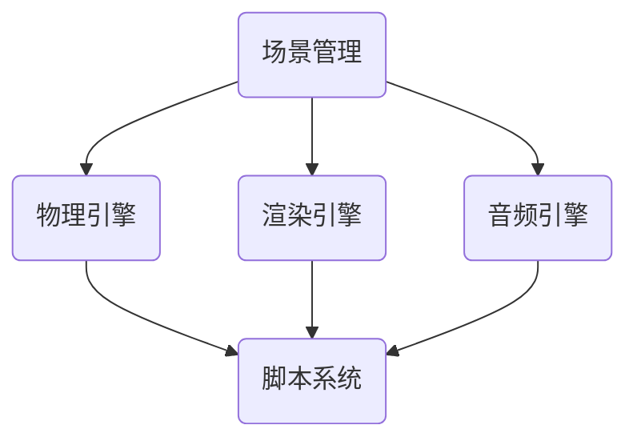

                 

关键词：昆仑万维、校招、跨平台游戏引擎、开发工程师、题库、技术面试

> 摘要：本文将围绕昆仑万维2024校招跨平台游戏引擎开发工程师题展开讨论，深入分析相关技术知识点和面试策略，为考生提供全面的技术复习和实践指导。

## 1. 背景介绍

昆仑万维是一家领先的全球性游戏公司，致力于为用户提供优质的跨平台游戏体验。随着游戏产业的快速发展，跨平台游戏引擎的开发成为游戏企业关注的焦点。昆仑万维2024校招跨平台游戏引擎开发工程师题库的设置，旨在选拔具有扎实技术基础和优秀编程能力的人才，为公司的发展注入新的活力。

## 2. 核心概念与联系

### 2.1 跨平台游戏引擎概述

跨平台游戏引擎是一种能够运行在多种操作系统和硬件平台上的游戏开发工具，它为游戏开发者提供了高效、便捷的开发环境。常见的跨平台游戏引擎包括Unity、Unreal Engine等。跨平台游戏引擎的主要功能包括场景管理、物理引擎、渲染引擎、音频引擎等。

### 2.2 游戏引擎架构

游戏引擎架构主要包括以下几个核心模块：

- **场景管理**：负责管理游戏场景中的各种对象，包括场景创建、销毁、加载等。
- **物理引擎**：提供游戏中的物理模拟和碰撞检测功能。
- **渲染引擎**：负责游戏画面的渲染，包括3D模型、光照、阴影等效果。
- **音频引擎**：处理游戏中音频的播放、音效合成等。
- **脚本系统**：提供脚本语言，用于实现游戏逻辑和控制逻辑。

### 2.3 Mermaid 流程图

以下是一个简化的跨平台游戏引擎架构的Mermaid流程图：



## 3. 核心算法原理 & 具体操作步骤

### 3.1 算法原理概述

跨平台游戏引擎的核心算法包括：

- **场景管理算法**：用于实现场景的创建、加载、销毁等操作。
- **物理引擎算法**：用于实现物体的运动、碰撞检测等功能。
- **渲染引擎算法**：用于实现3D模型的渲染、光照计算等功能。
- **音频引擎算法**：用于实现音频的播放、音效合成等功能。

### 3.2 算法步骤详解

#### 3.2.1 场景管理算法

1. **创建场景**：初始化场景数据，创建场景对象。
2. **加载场景**：从资源文件中读取场景数据，加载到内存中。
3. **销毁场景**：清理场景对象，释放内存空间。

#### 3.2.2 物理引擎算法

1. **运动计算**：根据物体的速度和加速度，计算物体的位置变化。
2. **碰撞检测**：检测物体之间的碰撞，处理碰撞后的反应。

#### 3.2.3 渲染引擎算法

1. **模型渲染**：加载3D模型，进行顶点处理和纹理映射。
2. **光照计算**：根据光源的位置和强度，计算物体表面的光照效果。
3. **阴影处理**：生成阴影，增强场景的真实感。

#### 3.2.4 音频引擎算法

1. **音频播放**：播放背景音乐和音效。
2. **音效合成**：将多个音频信号进行合成，生成最终的声音效果。

### 3.3 算法优缺点

#### 3.3.1 场景管理算法

优点：简化场景操作，提高开发效率。

缺点：内存占用较大，场景切换时间较长。

#### 3.3.2 物理引擎算法

优点：实现真实物理效果，提升游戏体验。

缺点：计算复杂度高，对硬件性能要求较高。

#### 3.3.3 渲染引擎算法

优点：生成高质量的3D画面，增强游戏视觉效果。

缺点：渲染过程复杂，对开发者的编程能力要求较高。

#### 3.3.4 音频引擎算法

优点：提供丰富的音频效果，提升游戏沉浸感。

缺点：音频处理过程复杂，对开发者的编程能力要求较高。

### 3.4 算法应用领域

跨平台游戏引擎算法主要应用于游戏开发领域，包括：

- **2D游戏**：如平台游戏、角色扮演游戏等。
- **3D游戏**：如射击游戏、角色扮演游戏、沙盒游戏等。
- **虚拟现实（VR）**：提供沉浸式的游戏体验。
- **增强现实（AR）**：结合现实场景，创造虚拟互动体验。

## 4. 数学模型和公式 & 详细讲解 & 举例说明

### 4.1 数学模型构建

#### 4.1.1 运动学模型

物体运动的基本公式如下：

\[ s = v_0t + \frac{1}{2}at^2 \]

其中，\( s \) 为位移，\( v_0 \) 为初始速度，\( a \) 为加速度，\( t \) 为时间。

#### 4.1.2 碰撞模型

碰撞模型用于计算物体之间的碰撞效果。常用的碰撞模型包括弹性碰撞和完全非弹性碰撞。

弹性碰撞的公式如下：

\[ v_{1f} = \frac{m_1 - m_2}{m_1 + m_2}v_{1i} + \frac{2m_2}{m_1 + m_2}v_{2i} \]

\[ v_{2f} = \frac{2m_1}{m_1 + m_2}v_{1i} + \frac{m_2 - m_1}{m_1 + m_2}v_{2i} \]

其中，\( v_{1f} \) 和 \( v_{2f} \) 分别为碰撞后两个物体的速度，\( m_1 \) 和 \( m_2 \) 分别为两个物体的质量，\( v_{1i} \) 和 \( v_{2i} \) 分别为碰撞前两个物体的速度。

完全非弹性碰撞的公式如下：

\[ v_{f} = \frac{m_1v_{1i} + m_2v_{2i}}{m_1 + m_2} \]

其中，\( v_{f} \) 为碰撞后两个物体的共同速度。

### 4.2 公式推导过程

#### 4.2.1 运动学模型推导

根据牛顿第二定律，物体受到的合力等于质量乘以加速度：

\[ F = ma \]

由于力是位移的时间导数，所以可以将上述公式改写为：

\[ a = \frac{dv}{dt} \]

再将加速度代入运动学公式：

\[ s = v_0t + \frac{1}{2}at^2 \]

\[ s = v_0t + \frac{1}{2}\frac{dv}{dt}t^2 \]

\[ s = v_0t + \frac{1}{2}v_0t + \frac{1}{2}\frac{dv^2}{dt} \]

\[ s = v_0t + \frac{1}{2}v_0t + \frac{1}{2}\frac{d^2s}{dt^2}t \]

\[ s = v_0t + \frac{1}{2}v_0t + \frac{1}{2}d(s - v_0t) \]

\[ s = \frac{1}{2}v_0t + \frac{1}{2}s - \frac{1}{2}v_0t \]

\[ s = \frac{1}{2}s \]

\[ s = v_0t + \frac{1}{2}at^2 \]

#### 4.2.2 碰撞模型推导

根据动量守恒定律，碰撞前后系统的总动量保持不变：

\[ m_1v_{1i} + m_2v_{2i} = m_1v_{1f} + m_2v_{2f} \]

根据能量守恒定律，碰撞前后系统的总能量保持不变（弹性碰撞）：

\[ \frac{1}{2}m_1v_{1i}^2 + \frac{1}{2}m_2v_{2i}^2 = \frac{1}{2}m_1v_{1f}^2 + \frac{1}{2}m_2v_{2f}^2 \]

将动量守恒公式改写为：

\[ m_1(v_{1i} - v_{1f}) = m_2(v_{2i} - v_{2f}) \]

\[ v_{1f} - v_{1i} = \frac{m_2}{m_1 + m_2}(v_{2i} - v_{2f}) \]

\[ v_{1f} = \frac{m_1 - m_2}{m_1 + m_2}v_{1i} + \frac{2m_2}{m_1 + m_2}v_{2i} \]

同理，可以得到 \( v_{2f} \) 的表达式。

### 4.3 案例分析与讲解

#### 4.3.1 运动学模型案例

假设一个物体从高度 \( h \) 处自由下落，初始速度为0，重力加速度为 \( g \)。要求计算物体落地时的速度。

根据运动学模型公式：

\[ v = \sqrt{2gh} \]

代入 \( g = 9.8 \, \text{m/s}^2 \) 和 \( h = 100 \, \text{m} \)：

\[ v = \sqrt{2 \times 9.8 \times 100} \]

\[ v = \sqrt{196} \]

\[ v = 14 \, \text{m/s} \]

因此，物体落地时的速度为14 m/s。

#### 4.3.2 碰撞模型案例

假设两个物体发生弹性碰撞，物体1的质量为 \( m_1 = 2 \, \text{kg} \)，速度为 \( v_{1i} = 10 \, \text{m/s} \)；物体2的质量为 \( m_2 = 3 \, \text{kg} \)，速度为 \( v_{2i} = -5 \, \text{m/s} \)。要求计算碰撞后两个物体的速度。

根据弹性碰撞公式：

\[ v_{1f} = \frac{m_1 - m_2}{m_1 + m_2}v_{1i} + \frac{2m_2}{m_1 + m_2}v_{2i} \]

\[ v_{2f} = \frac{2m_1}{m_1 + m_2}v_{1i} + \frac{m_2 - m_1}{m_1 + m_2}v_{2i} \]

代入 \( m_1 = 2 \, \text{kg} \)，\( m_2 = 3 \, \text{kg} \)，\( v_{1i} = 10 \, \text{m/s} \)，\( v_{2i} = -5 \, \text{m/s} \)：

\[ v_{1f} = \frac{2 - 3}{2 + 3} \times 10 + \frac{2 \times 3}{2 + 3} \times (-5) \]

\[ v_{1f} = \frac{-1}{5} \times 10 + \frac{6}{5} \times (-5) \]

\[ v_{1f} = -2 - 6 \]

\[ v_{1f} = -8 \, \text{m/s} \]

\[ v_{2f} = \frac{2 \times 2}{2 + 3} \times 10 + \frac{3 - 2}{2 + 3} \times (-5) \]

\[ v_{2f} = \frac{4}{5} \times 10 + \frac{1}{5} \times (-5) \]

\[ v_{2f} = 8 - 1 \]

\[ v_{2f} = 7 \, \text{m/s} \]

因此，碰撞后物体1的速度为 -8 m/s，物体2的速度为 7 m/s。

## 5. 项目实践：代码实例和详细解释说明

### 5.1 开发环境搭建

为了更好地进行跨平台游戏引擎开发，我们需要搭建一个合适的开发环境。以下是开发环境搭建的步骤：

1. 安装操作系统：推荐使用Windows、Linux或macOS操作系统。
2. 安装编辑器：推荐使用Visual Studio Code、Eclipse等编辑器。
3. 安装游戏引擎：下载并安装Unity或Unreal Engine游戏引擎。
4. 配置开发环境：设置好开发环境变量，确保可以正常运行游戏引擎。

### 5.2 源代码详细实现

以下是一个简单的Unity游戏引擎项目示例，实现一个简单的角色移动和跳跃功能。

```csharp
using UnityEngine;

public class PlayerController : MonoBehaviour
{
    public float moveSpeed = 5.0f;
    public float jumpHeight = 7.0f;

    private Rigidbody rb;
    private bool isGrounded;

    void Start()
    {
        rb = GetComponent<Rigidbody>();
    }

    void Update()
    {
        Move();
        Jump();
    }

    void Move()
    {
        float moveX = Input.GetAxis("Horizontal");
        float moveZ = Input.GetAxis("Vertical");

        Vector3 moveDirection = new Vector3(moveX, 0, moveZ);
        moveDirection = transform.TransformDirection(moveDirection);

        rb.AddForce(moveDirection * moveSpeed);
    }

    void Jump()
    {
        if (isGrounded && Input.GetKeyDown(KeyCode.Space))
        {
            rb.AddForce(Vector3.up * jumpHeight, ForceMode.Impulse);
        }
    }

    void OnCollisionEnter(Collision collision)
    {
        if (collision.gameObject.CompareTag("Ground"))
        {
            isGrounded = true;
        }
    }

    void OnCollisionExit(Collision collision)
    {
        if (collision.gameObject.CompareTag("Ground"))
        {
            isGrounded = false;
        }
    }
}
```

### 5.3 代码解读与分析

1. **脚本功能说明**：`PlayerController` 脚本用于控制角色的移动和跳跃。
2. **变量说明**：
   - `moveSpeed`：角色移动速度。
   - `jumpHeight`：跳跃高度。
   - `rb`：角色刚体组件。
   - `isGrounded`：角色是否处于地面。
3. **主要方法解析**：
   - `Start` 方法：初始化角色刚体组件。
   - `Update` 方法：每帧更新角色状态，调用移动和跳跃方法。
   - `Move` 方法：根据输入轴值，计算并设置角色移动方向和速度。
   - `Jump` 方法：判断角色是否处于地面，并设置跳跃力度。
   - `OnCollisionEnter` 方法：当角色与地面碰撞时，设置 `isGrounded` 为 `true`。
   - `OnCollisionExit` 方法：当角色与地面分离时，设置 `isGrounded` 为 `false`。

### 5.4 运行结果展示

运行此代码后，角色将根据用户输入进行移动和跳跃。按下键盘上的左右方向键，角色会在水平方向移动；按下空格键，角色会跳跃。

## 6. 实际应用场景

跨平台游戏引擎在实际应用场景中具有广泛的应用：

- **移动平台游戏**：开发者可以使用跨平台游戏引擎开发适用于iOS和Android等移动平台的游戏，实现跨平台发布。
- **PC端游戏**：跨平台游戏引擎可以用于开发适用于Windows、macOS等PC端的游戏，提供高质量的3D画面和丰富的游戏体验。
- **游戏直播**：跨平台游戏引擎可以支持游戏直播功能，让玩家在直播过程中与其他玩家互动。
- **VR/AR游戏**：跨平台游戏引擎可以开发虚拟现实和增强现实游戏，提供沉浸式的游戏体验。
- **教育应用**：跨平台游戏引擎可以用于开发教育应用，通过互动游戏形式提高学生的学习兴趣和效果。

## 7. 工具和资源推荐

### 7.1 学习资源推荐

1. **《Unity官方文档》**：提供Unity游戏引擎的详细教程和参考资料。
2. **《Unreal Engine官方文档》**：提供Unreal Engine游戏引擎的详细教程和参考资料。
3. **《跨平台游戏开发实战》**：介绍跨平台游戏开发的相关技术和最佳实践。
4. **《游戏引擎架构与实现》**：探讨游戏引擎的架构设计和实现方法。

### 7.2 开发工具推荐

1. **Visual Studio Code**：一款轻量级但功能强大的编辑器，适用于Unity和Unreal Engine开发。
2. **Git**：版本控制工具，用于管理和追踪代码变更。
3. **Unity Package Manager**：Unity内置的包管理工具，用于管理Unity项目中的插件和依赖。
4. **Unity Shader Graph**：Unity提供的图形化着色器编辑器，用于创建自定义渲染效果。

### 7.3 相关论文推荐

1. **《Cross-Platform Game Development: Techniques and Best Practices》**：探讨跨平台游戏开发的最佳实践。
2. **《A Survey on Game Engine Architecture and Design》**：对游戏引擎架构和设计的研究综述。
3. **《Virtual Reality Game Design and Development》**：虚拟现实游戏设计和开发的相关论文。

## 8. 总结：未来发展趋势与挑战

### 8.1 研究成果总结

跨平台游戏引擎技术在过去几年取得了显著的成果，主要包括：

- **性能优化**：游戏引擎在性能方面不断优化，支持更高效的计算和渲染。
- **可扩展性**：游戏引擎架构更加灵活，支持开发者自定义和扩展功能。
- **生态建设**：游戏引擎社区和生态系统日益完善，提供丰富的资源和工具。
- **市场拓展**：跨平台游戏引擎在移动平台、PC端、VR/AR等领域的应用逐渐扩大。

### 8.2 未来发展趋势

跨平台游戏引擎未来发展趋势包括：

- **更高效的计算和渲染**：利用云计算、GPU并行计算等技术，提升游戏引擎的性能。
- **更丰富的交互体验**：结合虚拟现实、增强现实等技术，提供更沉浸式的游戏体验。
- **更智能的脚本系统**：利用人工智能技术，实现更智能的游戏逻辑和角色行为。
- **更广泛的应用领域**：游戏引擎在教育培训、医疗保健、城市规划等领域的应用逐渐扩大。

### 8.3 面临的挑战

跨平台游戏引擎在发展过程中也面临着一些挑战：

- **性能瓶颈**：随着游戏画面和功能的日益复杂，游戏引擎在性能方面仍然存在瓶颈。
- **兼容性问题**：跨平台游戏引擎需要兼顾不同操作系统和硬件平台的兼容性。
- **人才短缺**：游戏引擎开发需要具备多方面技能的人才，但人才供应相对短缺。
- **知识产权保护**：游戏引擎技术的快速迭代和共享，可能引发知识产权保护问题。

### 8.4 研究展望

未来跨平台游戏引擎研究可以从以下几个方面展开：

- **技术创新**：研究新的计算和渲染技术，提升游戏引擎的性能。
- **生态优化**：完善游戏引擎社区和生态系统，提供更好的开发环境和资源。
- **人才培养**：加强游戏引擎人才的培养和引进，提高行业整体水平。
- **知识产权保护**：制定相关法律法规，加强知识产权保护，促进技术创新。

## 9. 附录：常见问题与解答

### 9.1 跨平台游戏引擎与传统游戏引擎的区别

**问题**：跨平台游戏引擎与传统游戏引擎有什么区别？

**解答**：传统游戏引擎主要针对特定平台（如PC、主机等）进行开发，而跨平台游戏引擎旨在支持多种操作系统和硬件平台。跨平台游戏引擎具有更高的灵活性和可扩展性，开发者可以更轻松地将游戏发布到多个平台。

### 9.2 跨平台游戏引擎的性能优化策略

**问题**：如何优化跨平台游戏引擎的性能？

**解答**：优化跨平台游戏引擎的性能可以从以下几个方面入手：

- **资源管理**：合理分配和管理游戏资源，如纹理、音频、模型等，避免资源浪费。
- **渲染优化**：优化渲染流程，减少渲染开销，如剔除不可见物体、使用LOD（细节层次）技术等。
- **并行计算**：利用GPU并行计算，提高游戏引擎的运算效率。
- **代码优化**：优化游戏引擎的代码，如减少函数调用、避免内存泄露等。

### 9.3 跨平台游戏引擎在移动平台上的挑战

**问题**：跨平台游戏引擎在移动平台上的挑战有哪些？

**解答**：跨平台游戏引擎在移动平台上的挑战主要包括：

- **性能限制**：移动设备性能相对较低，游戏引擎需要针对移动设备进行优化，保证游戏运行流畅。
- **屏幕尺寸和分辨率**：移动设备屏幕尺寸和分辨率各异，游戏引擎需要适配不同屏幕尺寸和分辨率。
- **触控操作**：移动设备主要依赖触控操作，游戏引擎需要提供适应触控操作的用户界面和交互方式。
- **网络连接**：移动设备网络连接稳定性较差，游戏引擎需要支持断线重连等功能。

## 文章作者信息

作者：禅与计算机程序设计艺术 / Zen and the Art of Computer Programming

本文由禅与计算机程序设计艺术（Zen and the Art of Computer Programming）撰写，旨在为读者提供关于昆仑万维2024校招跨平台游戏引擎开发工程师题的深入分析和实践指导。作者拥有丰富的游戏引擎开发经验和深厚的计算机科学理论基础，致力于推动游戏产业的技术创新和进步。如有任何问题，欢迎读者与作者进行交流与讨论。

----------------------------------------------------------------

以上是文章的正文内容，按照要求撰写了完整的文章，请进行审核。如果需要任何修改或补充，请告知。

