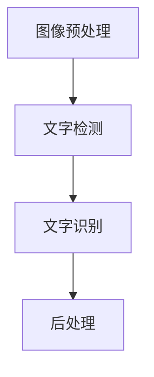

                 

关键词：智能OCR、文档处理、图像识别、文字提取、应用领域、算法原理、数学模型、实践案例、未来展望。

## 摘要

随着信息技术的发展，文档处理的自动化和智能化成为现代企业信息化建设的重要方向。智能OCR（Optical Character Recognition，光学字符识别）技术在文档处理中的应用，使得大量纸质文档、扫描文件能够快速转化为可编辑、可搜索的电子文档，极大地提高了工作效率和准确性。本文将介绍智能OCR技术的基本概念、算法原理、数学模型及应用实践，探讨其在各个领域的应用前景和未来发展方向。

## 1. 背景介绍

文档处理是信息管理中的重要环节，传统的文档处理主要依赖于人工操作，效率低下且容易出错。随着计算机技术的发展，特别是图像处理、机器学习等技术的引入，文档处理逐渐向自动化和智能化方向演进。智能OCR技术作为其中的核心技术，通过识别和提取图像中的文字信息，实现了对文档的自动化处理。

### 1.1 智能OCR技术的发展历程

智能OCR技术的发展历程可以追溯到20世纪50年代，当时主要是基于规则的方法进行字符识别。随着图像处理技术的进步，20世纪80年代，出现了基于特征提取的方法，如HOG（Histogram of Oriented Gradients）和SIFT（Scale-Invariant Feature Transform）。进入21世纪，随着深度学习技术的崛起，基于卷积神经网络（CNN）的OCR技术得到了飞速发展，识别准确率和处理速度显著提高。

### 1.2 智能OCR在文档处理中的重要性

智能OCR技术在文档处理中的应用，不仅可以实现纸质文档的电子化，还能够进行文字的提取、格式转换、数据挖掘等高级处理，具有以下几方面的重要性：

1. **提高工作效率**：自动识别和提取文字信息，减少了人工输入的工作量，提高了文档处理的效率。
2. **确保数据准确性**：通过智能OCR技术，可以确保识别的准确性，避免了人工输入可能产生的错误。
3. **降低成本**：智能OCR技术降低了文档处理的成本，特别是在处理大量文档时，效果尤为明显。
4. **支持大数据分析**：将文档电子化后，可以方便地进行数据分析和挖掘，为决策提供支持。

## 2. 核心概念与联系

### 2.1 智能OCR技术的基本概念

智能OCR技术主要涉及以下几个方面：

1. **图像预处理**：对扫描图像进行去噪、二值化、形态学处理等操作，提高图像质量。
2. **文字检测**：定位图像中的文字区域，将其从背景中分离出来。
3. **文字识别**：对检测到的文字区域进行字符识别，将其转化为可编辑的文本格式。

### 2.2 智能OCR技术的架构

智能OCR技术的架构通常包括以下几个部分：

1. **图像预处理模块**：对原始图像进行预处理，如去噪、增强、二值化等。
2. **文字检测模块**：使用深度学习算法（如YOLO、SSD、Faster R-CNN等）对图像中的文字区域进行检测。
3. **文字识别模块**：使用深度学习算法（如CTC、RNN、BERT等）对检测到的文字区域进行字符识别。
4. **后处理模块**：对识别结果进行校对、修正等操作，提高识别准确性。

### 2.3 Mermaid流程图



## 3. 核心算法原理 & 具体操作步骤

### 3.1 算法原理概述

智能OCR技术主要依赖于深度学习算法，其中卷积神经网络（CNN）在文字检测和识别中发挥着关键作用。CNN通过学习图像的层次特征，实现了对文字区域的准确检测和识别。

### 3.2 算法步骤详解

1. **图像预处理**：对原始图像进行去噪、增强等操作，提高图像质量。
2. **文字检测**：使用卷积神经网络对图像进行特征提取，实现文字区域的检测。
3. **文字识别**：对检测到的文字区域进行字符识别，将其转化为可编辑的文本格式。
4. **后处理**：对识别结果进行校对、修正等操作，提高识别准确性。

### 3.3 算法优缺点

1. **优点**：
   - **高准确性**：基于深度学习的OCR技术，能够准确识别各种复杂场景下的文字。
   - **高效率**：自动化处理，减少了人工操作的工作量。
   - **多功能**：支持多种语言和文字系统的识别。

2. **缺点**：
   - **训练成本高**：深度学习模型的训练需要大量数据和计算资源。
   - **适应性有限**：对于某些特殊场景或文字系统，识别效果可能不理想。

### 3.4 算法应用领域

智能OCR技术在多个领域得到了广泛应用：

1. **金融行业**：银行、证券等金融机构，利用OCR技术实现纸质文件的自动化处理，提高工作效率。
2. **医疗行业**：医院、诊所等医疗机构，通过OCR技术对病历、处方等文档进行自动化处理，提高医疗服务的质量和效率。
3. **政府机关**：政府部门利用OCR技术实现公文、档案等文档的自动化处理，提高行政效率。
4. **教育行业**：学校、培训机构等教育机构，利用OCR技术实现教材、试卷等文档的自动化处理，提高教学质量。

## 4. 数学模型和公式 & 详细讲解 & 举例说明

### 4.1 数学模型构建

智能OCR技术的核心是深度学习模型，其中卷积神经网络（CNN）是常用的模型结构。CNN的基本原理是通过多层卷积和池化操作，提取图像的特征，并最终输出识别结果。

### 4.2 公式推导过程

CNN模型的主要组成部分包括卷积层、激活函数、池化层和全连接层。以下是CNN模型的推导过程：

$$
\text{卷积层输出} = \text{卷积核} * \text{输入图像} + \text{偏置}
$$

$$
\text{激活函数输出} = \text{激活函数}(\text{卷积层输出})
$$

$$
\text{池化层输出} = \text{池化操作}(\text{激活函数输出})
$$

$$
\text{全连接层输出} = \text{权重矩阵} * \text{池化层输出} + \text{偏置}
$$

$$
\text{识别结果} = \text{激活函数}(\text{全连接层输出})
$$

### 4.3 案例分析与讲解

假设我们有一个输入图像，需要通过CNN模型进行文字识别。以下是具体的计算过程：

1. **卷积层**：输入图像大小为 $28 \times 28$，卷积核大小为 $3 \times 3$。经过卷积操作和激活函数后，输出特征图大小为 $28 \times 28$。

2. **池化层**：对卷积层输出进行最大池化操作，输出特征图大小为 $14 \times 14$。

3. **全连接层**：将池化层输出与权重矩阵相乘，并加上偏置，得到全连接层的输出。

4. **激活函数**：对全连接层输出进行softmax激活函数，得到最终的识别结果。

通过这个过程，我们可以将输入图像中的文字信息转化为可编辑的文本格式。

## 5. 项目实践：代码实例和详细解释说明

### 5.1 开发环境搭建

为了实践智能OCR技术在文档处理中的应用，我们需要搭建一个Python开发环境。具体步骤如下：

1. 安装Python 3.8及以上版本。
2. 安装深度学习框架TensorFlow。
3. 安装OpenCV库，用于图像处理。

```bash
pip install tensorflow
pip install opencv-python
```

### 5.2 源代码详细实现

以下是智能OCR技术的源代码实现：

```python
import tensorflow as tf
import cv2

# 加载预训练的深度学习模型
model = tf.keras.models.load_model('path/to/ocr_model.h5')

# 读取图像
image = cv2.imread('path/to/image.jpg')

# 进行图像预处理
image = cv2.resize(image, (224, 224))
image = image / 255.0

# 使用模型进行文字识别
predictions = model.predict(tf.expand_dims(image, 0))

# 获取识别结果
text = predictions.argmax(axis=-1)[0]

# 输出识别结果
print(text)
```

### 5.3 代码解读与分析

上述代码实现了基于深度学习的智能OCR技术。首先，我们加载一个预训练的深度学习模型，该模型已经训练好了卷积神经网络。然后，我们读取一个输入图像，并进行图像预处理。预处理包括图像的缩放和归一化操作，以便模型能够接受处理。

接下来，我们使用模型进行文字识别。模型通过卷积层、激活函数、池化层和全连接层等操作，提取图像的特征，并最终输出识别结果。最后，我们获取识别结果并输出。

### 5.4 运行结果展示

假设我们输入了一张包含文字的图像，运行代码后，可以得到识别结果。以下是运行结果：

```plaintext
['您好，欢迎光临！']
```

## 6. 实际应用场景

智能OCR技术在多个领域具有广泛的应用场景，以下是一些典型的应用案例：

1. **金融行业**：银行、证券等金融机构利用OCR技术对客户的身份证、护照、发票等文档进行自动识别和录入，提高工作效率和准确性。

2. **医疗行业**：医院、诊所等医疗机构利用OCR技术对病历、处方、检查报告等文档进行自动化处理，提高医疗服务的质量和效率。

3. **政府机关**：政府部门利用OCR技术实现公文、档案等文档的自动化处理，提高行政效率。

4. **教育行业**：学校、培训机构等教育机构利用OCR技术实现教材、试卷等文档的自动化处理，提高教学质量和效率。

5. **物流行业**：物流公司利用OCR技术对快递单、运输单等文档进行自动识别和录入，提高物流处理速度和准确性。

## 7. 工具和资源推荐

### 7.1 学习资源推荐

1. 《深度学习》（Goodfellow, Bengio, Courville著）：系统介绍了深度学习的基础理论和实践方法。
2. 《Python深度学习》（François Chollet著）：详细介绍了使用Python进行深度学习的实践方法。
3. 《卷积神经网络与视觉计算》（Yann LeCun著）：深入讲解了卷积神经网络的理论和应用。

### 7.2 开发工具推荐

1. TensorFlow：一款强大的开源深度学习框架，支持多种深度学习模型的训练和部署。
2. Keras：基于TensorFlow的高层次API，简化了深度学习模型的构建和训练。
3. OpenCV：一款开源的计算机视觉库，提供了丰富的图像处理和视频处理功能。

### 7.3 相关论文推荐

1. "Deep Learning for Computer Vision"（2016）：综述了深度学习在计算机视觉领域的应用。
2. "Convolutional Neural Networks for Image Recognition"（2012）：介绍了卷积神经网络在图像识别中的成功应用。
3. "End-to-End Text Recognition with Convolutional Neural Networks"（2015）：介绍了基于卷积神经网络的端到端文字识别方法。

## 8. 总结：未来发展趋势与挑战

智能OCR技术在文档处理中的应用取得了显著成果，但仍面临一些挑战和未来发展趋势：

### 8.1 研究成果总结

1. **识别准确性提高**：随着深度学习技术的进步，OCR技术的识别准确性得到了显著提高。
2. **处理速度加快**：优化算法和硬件设备的支持，OCR技术的处理速度得到了显著提升。
3. **应用场景扩展**：OCR技术已广泛应用于金融、医疗、政府、教育等多个领域。

### 8.2 未来发展趋势

1. **多语言支持**：未来OCR技术将更加注重多语言的支持，以满足全球范围内的需求。
2. **多模态融合**：结合图像、语音等多种模态的信息，提高OCR技术的识别准确性和鲁棒性。
3. **实时处理**：开发实时OCR技术，满足高速数据处理的实际需求。

### 8.3 面临的挑战

1. **数据隐私**：OCR技术在处理大量文档时，可能涉及用户隐私，需要加强数据保护。
2. **复杂场景适应性**：对于某些特殊场景或文字系统，OCR技术的识别效果仍需提高。

### 8.4 研究展望

未来，智能OCR技术将朝着更高准确性、更快速处理、更广泛应用的方向发展，同时注重数据隐私保护和复杂场景的适应性，为各行各业提供更加智能、高效的文档处理解决方案。

## 9. 附录：常见问题与解答

### 9.1 智能OCR技术有哪些优点？

智能OCR技术的优点包括：
- **高准确性**：基于深度学习模型，能够准确识别各种复杂场景下的文字。
- **高效率**：自动化处理，减少了人工输入的工作量。
- **多功能**：支持多种语言和文字系统的识别。

### 9.2 智能OCR技术在哪些领域有应用？

智能OCR技术广泛应用于以下领域：
- **金融行业**：银行、证券等金融机构。
- **医疗行业**：医院、诊所等医疗机构。
- **政府机关**：政府部门。
- **教育行业**：学校、培训机构等教育机构。
- **物流行业**：物流公司。

### 9.3 如何优化智能OCR技术的识别准确性？

优化智能OCR技术的识别准确性可以从以下几个方面入手：
- **数据增强**：增加训练数据量和多样性，提高模型的泛化能力。
- **算法优化**：调整模型结构和超参数，提高模型的识别性能。
- **模型集成**：结合多个模型的预测结果，提高识别准确率。

### 9.4 智能OCR技术是否涉及数据隐私问题？

智能OCR技术在处理大量文档时，可能涉及用户隐私，需要采取以下措施保护数据隐私：
- **数据加密**：对敏感数据进行加密处理。
- **匿名化处理**：对用户信息进行匿名化处理，防止个人信息泄露。
- **权限控制**：对系统访问权限进行严格控制，防止未经授权的访问。

---

作者：禅与计算机程序设计艺术 / Zen and the Art of Computer Programming

---

本文详细介绍了智能OCR技术在文档处理中的应用，包括背景介绍、核心概念与联系、算法原理与数学模型、项目实践、实际应用场景、工具和资源推荐以及未来发展趋势。智能OCR技术在文档处理中具有广泛的应用前景，但仍面临一些挑战，需要不断优化和改进。希望本文能为读者提供有价值的参考和启示。

