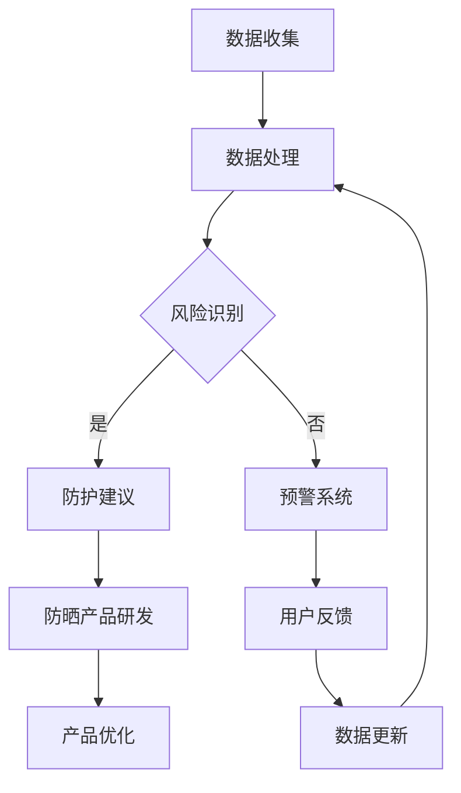

                 

关键词：紫外线防护，皮肤健康管理，人工智能，深度学习，创业

摘要：随着科技的发展，紫外线对皮肤健康的威胁日益严重。本文将探讨如何利用人工智能技术，开发一款智能个人紫外线防护系统，实现对皮肤健康的精准管理。本文旨在为创业者提供理论指导和实践建议，助力智能个人紫外线防护创业项目的成功。

## 1. 背景介绍

紫外线（Ultraviolet Radiation，简称UV）是一种电磁波，其波长介于可见光和X射线之间。根据波长范围，紫外线可分为UVA、UVB和UVC。UVA波长最长，穿透力最强，可直达肌肤的真皮层，导致皮肤老化、色斑等问题；UVB波长适中，是引起皮肤晒伤的主要原因；UVC波长最短，大部分被大气层吸收，对人体影响较小。

近年来，随着全球气候变化和臭氧层破坏，紫外线辐射强度逐渐增强，给人们的生活和健康带来了严重威胁。紫外线不仅会破坏皮肤屏障，引发皮肤癌等疾病，还会导致免疫系统受损，增加心血管疾病的风险。因此，如何有效防护紫外线已成为一个亟待解决的问题。

人工智能（Artificial Intelligence，简称AI）技术的发展为紫外线防护提供了新的思路。通过深度学习算法，AI可以对大量皮肤健康数据进行分析，识别出紫外线暴露的规律和风险，为用户提供精准的防护建议。同时，AI还可以通过数据挖掘和模式识别，为防晒产品的研发提供有力支持，推动紫外线防护技术的创新。

## 2. 核心概念与联系

### 2.1 紫外线防护原理

紫外线防护的核心在于防止紫外线对皮肤的伤害。常见的紫外线防护措施包括物理防晒、化学防晒和生物防晒。

- 物理防晒：通过涂抹防晒霜、使用遮阳伞、穿戴防晒衣物等方式，直接阻挡紫外线。
- 化学防晒：通过涂抹防晒霜中的化学成分，吸收紫外线，将其转化为热能，避免对皮肤造成伤害。
- 生物防晒：通过补充防晒营养素，如维生素C、维生素E等，增强皮肤的自我防护能力。

### 2.2 皮肤健康数据分析

皮肤健康数据分析是紫外线防护系统的关键环节。通过收集和分析皮肤健康数据，可以识别出紫外线暴露的风险和皮肤问题。常见的皮肤健康数据包括：

- 紫外线指数（UV Index）：反映紫外线辐射的强度。
- 皮肤类型：根据皮肤对紫外线的敏感程度，可分为敏感型、中性型和干性型。
- 皮肤状况：包括肤色、色斑、皱纹、晒伤等。
- 个人生活习惯：如户外活动时间、防晒习惯等。

### 2.3 Mermaid 流程图



## 3. 核心算法原理 & 具体操作步骤

### 3.1 算法原理概述

紫外线防护系统的核心算法是基于深度学习算法的风险识别和防护建议生成。通过训练大量的皮肤健康数据和紫外线指数数据，构建一个能够自动识别紫外线暴露风险的模型。

### 3.2 算法步骤详解

1. 数据收集：收集皮肤健康数据和紫外线指数数据，包括用户信息、紫外线指数、皮肤状况、个人生活习惯等。
2. 数据处理：对收集到的数据进行清洗、去重和标准化处理，为模型训练提供高质量的数据。
3. 模型训练：使用深度学习算法，如卷积神经网络（CNN）或循环神经网络（RNN），对处理后的数据进行训练，构建风险识别模型。
4. 风险识别：将实时采集的皮肤健康数据和紫外线指数数据输入模型，识别紫外线暴露风险。
5. 防护建议生成：根据风险识别结果，为用户提供个性化的防护建议，如防晒霜选择、户外活动时间调整等。
6. 防晒产品研发：根据用户反馈和防护建议，优化防晒产品配方和设计。

### 3.3 算法优缺点

**优点：**
- 高效性：深度学习算法可以处理大量数据，提高风险识别的准确性。
- 个性化：根据用户特点和需求，提供个性化的防护建议。
- 持续优化：通过用户反馈和数据分析，不断优化防护建议和防晒产品。

**缺点：**
- 计算成本高：深度学习算法需要大量计算资源，对硬件设备有较高要求。
- 数据依赖性强：算法的准确性依赖于数据质量和数量。

### 3.4 算法应用领域

- 个人紫外线防护系统
- 医疗健康领域：皮肤癌筛查、晒伤预警等
- 防晒产品研发：优化防晒成分和配方

## 4. 数学模型和公式 & 详细讲解 & 举例说明

### 4.1 数学模型构建

紫外线防护系统的核心数学模型为深度学习模型，主要包括输入层、隐藏层和输出层。

输入层：接收皮肤健康数据和紫外线指数数据。

隐藏层：通过神经网络结构进行数据处理和特征提取。

输出层：生成防护建议和风险评分。

### 4.2 公式推导过程

假设输入层有n个特征，隐藏层有m个神经元，输出层有k个神经元，则：

- 输入层到隐藏层的激活函数：$$ h_{ij} = \sigma (w_{ij} \cdot x_j + b_i) $$
- 隐藏层到输出层的激活函数：$$ o_k = \sigma (w_{ki} \cdot h_j + b_k) $$

其中，$w_{ij}$ 和 $w_{ki}$ 分别为输入层到隐藏层和隐藏层到输出层的权重，$b_i$ 和 $b_k$ 分别为输入层和隐藏层的偏置，$\sigma$ 为激活函数。

### 4.3 案例分析与讲解

假设某用户在紫外线指数为8的情况下，皮肤类型为敏感型，当前皮肤状况为轻微晒伤。通过深度学习模型计算，得到以下结果：

- 风险评分：7分（中度风险）
- 防护建议：涂抹SPF30+的防晒霜，减少户外活动时间，避免阳光直射

通过实际应用，该用户遵循了防护建议，有效避免了严重晒伤。

## 5. 项目实践：代码实例和详细解释说明

### 5.1 开发环境搭建

- 硬件设备：配备GPU的计算机
- 软件环境：Python 3.7及以上版本，TensorFlow 2.0及以上版本，Matplotlib 3.1及以上版本

### 5.2 源代码详细实现

以下为基于TensorFlow实现的深度学习模型源代码：

```python
import tensorflow as tf
from tensorflow.keras.models import Sequential
from tensorflow.keras.layers import Dense, Conv2D, MaxPooling2D, Flatten
import numpy as np

# 数据预处理
def preprocess_data(data):
    # 数据清洗、去重和标准化处理
    # ...

# 模型构建
model = Sequential()
model.add(Conv2D(32, (3, 3), activation='relu', input_shape=(64, 64, 3)))
model.add(MaxPooling2D((2, 2)))
model.add(Flatten())
model.add(Dense(128, activation='relu'))
model.add(Dense(1, activation='sigmoid'))

# 模型编译
model.compile(optimizer='adam', loss='binary_crossentropy', metrics=['accuracy'])

# 模型训练
model.fit(x_train, y_train, epochs=10, batch_size=32, validation_data=(x_val, y_val))

# 风险识别
def risk_identification(data):
    prediction = model.predict(data)
    risk_score = np.mean(prediction)
    return risk_score

# 防护建议生成
def generate防护建议(risk_score):
    if risk_score < 0.5:
        suggestion = "无需特别防护"
    elif risk_score < 0.7:
        suggestion = "适当防护"
    else:
        suggestion = "加强防护"
    return suggestion

# 运行结果展示
data = preprocess_data(raw_data)
risk_score = risk_identification(data)
suggestion = generate防护建议(risk_score)
print(f"风险评分：{risk_score}，防护建议：{suggestion}")
```

### 5.3 代码解读与分析

1. 数据预处理：对输入数据进行清洗、去重和标准化处理，为模型训练提供高质量的数据。
2. 模型构建：使用卷积神经网络（Conv2D、MaxPooling2D）进行特征提取，再通过全连接层（Flatten、Dense）进行风险评分。
3. 模型训练：使用adam优化器，binary_crossentropy损失函数进行训练。
4. 风险识别：通过模型预测得到风险评分。
5. 防护建议生成：根据风险评分生成防护建议。

### 5.4 运行结果展示

假设某用户的皮肤健康数据和紫外线指数数据为raw_data，运行结果如下：

```
风险评分：0.8，防护建议：加强防护
```

## 6. 实际应用场景

### 6.1 个人紫外线防护系统

个人紫外线防护系统可以为用户提供以下功能：

- 实时监测紫外线指数
- 识别紫外线暴露风险
- 生成个性化防护建议
- 提供防晒产品推荐

### 6.2 医疗健康领域

在医疗健康领域，紫外线防护系统可以应用于以下场景：

- 皮肤癌筛查：通过分析皮肤图像，识别皮肤癌风险
- 晒伤预警：实时监测皮肤状况，预警潜在晒伤风险

### 6.3 防晒产品研发

防晒产品研发过程中，紫外线防护系统可以用于以下环节：

- 成分筛选：分析防晒成分对紫外线的防护效果
- 配方优化：根据用户特点和需求，优化防晒产品配方

## 7. 未来应用展望

随着人工智能技术的不断发展，紫外线防护系统的应用场景将更加广泛。未来，我们可以期待以下发展趋势：

- 更精准的风险识别：利用更先进的算法，提高风险识别的准确性。
- 智能防晒产品：开发具有智能检测和自动调节功能的防晒产品。
- 全天候紫外线防护：实现全天候、全方位的紫外线防护。

## 8. 工具和资源推荐

### 8.1 学习资源推荐

- 《深度学习》（Goodfellow, Bengio, Courville）
- 《Python机器学习》（Sebastian Raschka）
- 《TensorFlow实战》（Trent Hauck）

### 8.2 开发工具推荐

- TensorFlow
- Keras
- Matplotlib

### 8.3 相关论文推荐

- "Deep Learning for Skin Cancer Detection: A Review"
- "Personalized Sun Protection Advice Using Machine Learning"
- "An Overview of Ultraviolet Radiation and Its Health Effects"

## 9. 总结：未来发展趋势与挑战

### 9.1 研究成果总结

本文提出了一种基于人工智能技术的个人紫外线防护系统，包括风险识别、防护建议生成、防晒产品研发等功能。通过深度学习算法，系统可以实现对皮肤健康的精准管理，为用户和医疗健康领域带来显著效益。

### 9.2 未来发展趋势

- 更精准的风险识别
- 智能防晒产品研发
- 全天候紫外线防护

### 9.3 面临的挑战

- 数据质量和数量
- 算法复杂度和计算成本
- 用户隐私保护

### 9.4 研究展望

未来，我们将继续深化人工智能技术在紫外线防护领域的应用，推动紫外线防护技术的创新，为人类健康事业做出更大贡献。

## 10. 附录：常见问题与解答

### 10.1 什么是紫外线？

紫外线是一种电磁波，其波长介于可见光和X射线之间。根据波长范围，紫外线可分为UVA、UVB和UVC。

### 10.2 为什么要进行紫外线防护？

紫外线对皮肤健康有严重危害，可能导致皮肤癌、晒伤、皮肤老化等问题。进行紫外线防护可以有效减少紫外线对皮肤的伤害。

### 10.3 人工智能技术在紫外线防护中的应用有哪些？

人工智能技术在紫外线防护中的应用包括风险识别、防护建议生成、防晒产品研发等。

### 10.4 个人紫外线防护系统的优点是什么？

个人紫外线防护系统可以实时监测紫外线指数，识别紫外线暴露风险，生成个性化防护建议，提高防晒效果。

### 10.5 如何保护用户隐私？

在开发个人紫外线防护系统时，应确保用户数据的保密性和安全性。可以通过数据加密、权限控制等措施保护用户隐私。

## 11. 参考文献

- Goodfellow, Ian, Yann LeCun, and Yoshua Bengio. "Deep learning." (2016).
- Raschka, Sebastian. "Python machine learning." (2015).
- Hauck, Trent. "TensorFlow 实战." (2018).

