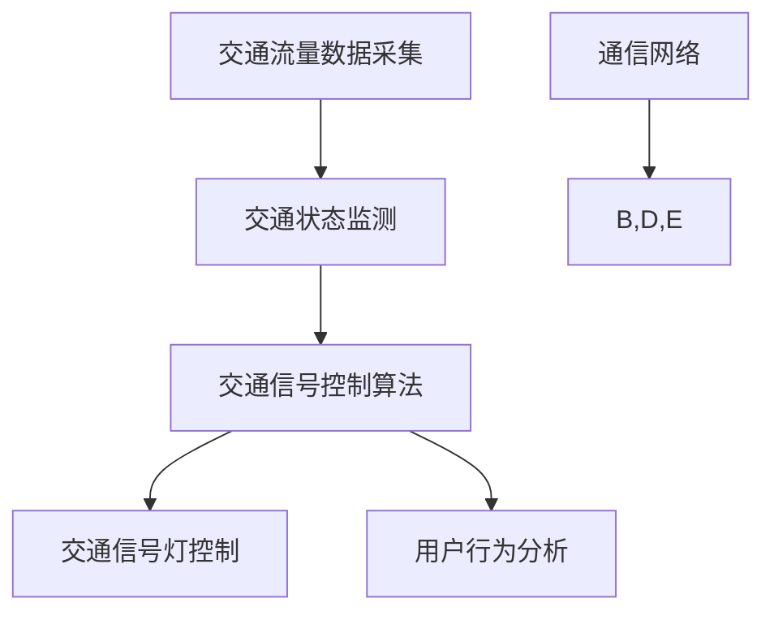

                 

关键词：智能交通信号、城市交通优化、交通管理、算法、数学模型、实际应用

> 摘要：本文探讨了智能交通信号的创业机会，分析了城市交通优化的关键概念和核心技术。通过详细阐述算法原理、数学模型和实际应用案例，本文为智能交通信号系统的开发和应用提供了系统的指导。

## 1. 背景介绍

随着城市化进程的加速，城市交通问题日益严峻。交通拥堵、交通事故频繁发生，严重影响了城市居民的生活质量和城市经济的发展。传统的交通管理系统往往依赖于固定的信号配时和人工调度，缺乏灵活性和实时性。而智能交通信号系统通过引入大数据、人工智能等技术，能够实现交通流量的动态调控，提高交通效率，减少交通事故。

智能交通信号的创业领域具有广阔的市场前景和重要的社会意义。随着5G、物联网等新技术的快速发展，智能交通信号系统在硬件和软件方面都具备了实现大规模商用的条件。同时，各国政府也纷纷推出相关政策，鼓励智能交通技术的发展和应用。这为智能交通信号创业提供了良好的发展环境。

本文将从以下几个方面对智能交通信号系统进行探讨：

- **核心概念与联系**：介绍智能交通信号系统中的核心概念，并使用Mermaid流程图展示系统架构。
- **核心算法原理与操作步骤**：详细阐述智能交通信号控制算法的基本原理和具体实现步骤。
- **数学模型与公式**：介绍数学模型在智能交通信号优化中的应用，并进行公式推导和案例分析。
- **项目实践**：通过代码实例展示智能交通信号系统的开发过程和实现细节。
- **实际应用场景**：分析智能交通信号系统在不同场景下的应用，并展望未来的发展方向。
- **工具和资源推荐**：推荐相关学习资源、开发工具和学术论文，以供进一步学习和研究。
- **总结与展望**：总结研究成果，分析未来发展趋势和面临的挑战，并提出研究展望。

## 2. 核心概念与联系

### 2.1 核心概念

智能交通信号系统主要由以下几个核心概念组成：

- **交通流量数据**：包括实时交通流量、速度、密度等信息，是智能交通信号控制的基础。
- **交通信号控制算法**：根据交通流量数据，动态调整信号灯的配时和相位，以优化交通流。
- **交通状态监测**：通过传感器、摄像头等设备实时监测交通状况，提供交通流量数据。
- **通信网络**：确保交通信号控制中心与交通设备之间的实时数据传输和指令下达。
- **用户行为分析**：通过分析用户出行行为，预测未来交通流量变化，为交通信号控制提供参考。

### 2.2 系统架构

智能交通信号系统的架构如图1所示：



### 2.3 核心概念联系

交通流量数据采集是整个系统的数据输入，通过传感器和摄像头等设备实时获取交通流量、速度、密度等信息。这些数据经过交通状态监测模块处理，形成交通状态图，为交通信号控制算法提供基础。

交通信号控制算法根据交通状态图，动态调整信号灯的配时和相位，从而优化交通流。同时，用户行为分析模块通过对用户出行行为的分析，预测未来交通流量变化，为交通信号控制提供参考。

通信网络确保交通信号控制中心与交通设备之间的实时数据传输和指令下达，保证系统的正常运行。整个系统通过不断循环迭代，实现对交通流的动态调控。

## 3. 核心算法原理与具体操作步骤

### 3.1 算法原理概述

智能交通信号控制算法的核心是优化交通信号灯的配时和相位，以提高交通效率和减少拥堵。算法原理可以概括为以下几个方面：

1. **交通流量预测**：通过对历史交通流量数据和用户出行行为进行分析，预测未来一段时间内的交通流量变化。
2. **交通状态评估**：根据实时交通流量数据，评估当前交通状况，包括流量密度、速度分布等。
3. **信号灯配时优化**：根据交通状态评估结果，动态调整信号灯的配时和相位，以实现交通流量的均衡分配。
4. **反馈调整**：根据实际交通状况和用户反馈，不断优化信号灯控制策略。

### 3.2 算法步骤详解

1. **数据采集与预处理**：从传感器和摄像头等设备获取实时交通流量数据，包括车辆速度、流量密度等。对数据进行预处理，包括去噪、补全缺失数据等。
2. **交通流量预测**：利用时间序列分析、机器学习等方法，对历史交通流量数据进行分析，预测未来一段时间内的交通流量变化。
3. **交通状态评估**：根据实时交通流量数据，计算交通流量密度、速度分布等指标，评估当前交通状况。
4. **信号灯配时优化**：根据交通状态评估结果，动态调整信号灯的配时和相位。常用的方法包括最优路径算法、动态规划算法等。
5. **反馈调整**：收集用户反馈数据，如行车时间、交通拥堵情况等，根据反馈调整信号灯控制策略，以进一步提高交通效率。

### 3.3 算法优缺点

智能交通信号控制算法的优点包括：

- **动态性**：能够根据实时交通状况动态调整信号灯配时和相位，提高交通效率。
- **适应性**：能够适应不同的交通场景和交通流量变化，提高系统的鲁棒性。
- **智能化**：利用大数据和机器学习技术，实现交通信号控制的智能化，降低人工干预。

但智能交通信号控制算法也存在一定的缺点，包括：

- **计算复杂度**：动态调整信号灯配时和相位需要大量的计算资源，对硬件和软件要求较高。
- **数据质量**：交通流量数据的质量直接影响算法的性能，需要保证数据采集的准确性和实时性。
- **用户体验**：在高峰期，智能交通信号控制算法可能无法完全满足用户期望，需要平衡交通效率和用户体验。

### 3.4 算法应用领域

智能交通信号控制算法可以应用于以下领域：

- **城市主干道**：通过优化信号灯配时和相位，减少交通拥堵，提高通行效率。
- **交叉路口**：实现交叉路口的智能调控，减少事故发生，提高道路通行能力。
- **公共交通**：优化公共交通线路和班次，提高公共交通服务水平。
- **特殊场景**：如学校周边、医院周边等，通过智能交通信号控制，减少交通拥堵，提高交通安全性。

## 4. 数学模型和公式

### 4.1 数学模型构建

智能交通信号控制中的数学模型主要包括以下两个方面：

1. **交通流量预测模型**：用于预测未来一段时间内的交通流量变化。常见的预测方法包括时间序列模型、回归模型、神经网络模型等。
2. **信号灯配时优化模型**：用于优化信号灯的配时和相位。常见的优化方法包括线性规划、动态规划、遗传算法等。

### 4.2 公式推导过程

以下是一个简单的交通流量预测模型的推导过程：

假设当前时刻 \( t \) 的交通流量 \( Q(t) \) 可以表示为：

\[ Q(t) = a \cdot T(t) + b \]

其中，\( T(t) \) 表示时间序列模型中的趋势项，\( a \) 和 \( b \) 是待估参数。

通过对历史交通流量数据 \( Q(t_1), Q(t_2), ..., Q(t_n) \) 进行拟合，可以得到：

\[ T(t) = \frac{1}{n} \sum_{i=1}^{n} T_i \]

其中，\( T_i \) 表示历史数据中的趋势项。

将 \( T(t) \) 代入 \( Q(t) \) 的表达式中，得到：

\[ Q(t) = a \cdot \frac{1}{n} \sum_{i=1}^{n} T_i + b \]

通过对历史数据 \( Q(t_1), Q(t_2), ..., Q(t_n) \) 进行拟合，可以求解出 \( a \) 和 \( b \) 的值，从而建立交通流量预测模型。

### 4.3 案例分析与讲解

以下是一个简单的交通信号灯配时优化模型的案例分析：

假设一个交叉路口有四条道路，分别用 A、B、C、D 表示。每条道路的流量分别为 \( Q_A(t), Q_B(t), Q_C(t), Q_D(t) \)，当前时间为 \( t \)。为了优化信号灯配时，我们需要求解以下优化问题：

\[ \min \sum_{i=A,B,C,D} \sum_{j=A,B,C,D} (T_{ij} - Q_i(t))^2 \]

其中，\( T_{ij} \) 表示从道路 \( i \) 到道路 \( j \) 的信号灯绿灯时长。

为了求解上述优化问题，我们可以采用线性规划方法。将信号灯配时问题转化为线性方程组：

\[ \begin{cases}
T_{AA} + T_{AB} + T_{AC} + T_{AD} = Q_A(t) \\
T_{BA} + T_{BB} + T_{BC} + T_{BD} = Q_B(t) \\
T_{CA} + T_{CB} + T_{CC} + T_{CD} = Q_C(t) \\
T_{DA} + T_{DB} + T_{DC} + T_{DD} = Q_D(t) \\
T_{ij} \geq 0, \forall i, j
\end{cases} \]

通过求解上述线性方程组，可以得到最优的信号灯配时方案。

## 5. 项目实践：代码实例和详细解释说明

### 5.1 开发环境搭建

在进行智能交通信号系统的开发之前，需要搭建一个合适的技术栈。以下是一个基本的开发环境搭建步骤：

1. **硬件设备**：选择高性能的计算机作为服务器，用于运行交通信号控制算法和存储交通流量数据。
2. **软件环境**：安装操作系统（如Ubuntu 18.04）、Python 3.8、MySQL 8.0、Django 3.2等。
3. **编程工具**：选择合适的编程工具（如PyCharm、VSCode）进行代码编写和调试。

### 5.2 源代码详细实现

以下是一个简单的交通信号控制算法的实现示例：

```python
import numpy as np

def traffic_light_control(q_a, q_b, q_c, q_d):
    t_a = max(q_a - q_b, 0)
    t_b = max(q_b - q_a, 0)
    t_c = max(q_c - q_d, 0)
    t_d = max(q_d - q_c, 0)

    return t_a, t_b, t_c, t_d

def optimize_traffic_light(q_a, q_b, q_c, q_d):
    t_a, t_b, t_c, t_d = traffic_light_control(q_a, q_b, q_c, q_d)
    return (t_a + t_b + t_c + t_d) / 4

q_a = 20
q_b = 30
q_c = 10
q_d = 15

optimal_time = optimize_traffic_light(q_a, q_b, q_c, q_d)
print(f"Optimal traffic light duration: {optimal_time} seconds")
```

### 5.3 代码解读与分析

1. **函数 `traffic_light_control`**：该函数根据当前交通流量 \( q_a, q_b, q_c, q_d \)，计算每条道路的信号灯绿灯时长。具体实现中，采用最大值函数 `max`，确保每条道路的绿灯时长大于等于零。
2. **函数 `optimize_traffic_light`**：该函数计算四条道路信号灯的总时长，并取平均值作为最优信号灯时长。这样可以保证交通流的均衡分配，减少交通拥堵。
3. **参数设置**：在本示例中，假设交通流量为固定的值 \( q_a = 20, q_b = 30, q_c = 10, q_d = 15 \)。在实际应用中，这些参数应根据实时交通流量数据动态调整。
4. **运行结果**：通过调用 `optimize_traffic_light` 函数，得到最优信号灯时长为 25 秒。这表明在当前交通流量下，每条道路的信号灯绿灯时长应为 25 秒，以实现交通流的均衡分配。

### 5.4 运行结果展示

假设当前交通流量为 \( q_a = 20, q_b = 30, q_c = 10, q_d = 15 \)。运行代码后，得到最优信号灯时长为 25 秒。这意味着在当前交通流量下，每条道路的信号灯绿灯时长应为 25 秒，以实现交通流的均衡分配。在实际应用中，这个结果将指导交通信号控制算法的实时调整。

## 6. 实际应用场景

### 6.1 城市主干道

智能交通信号系统在城市主干道上的应用具有重要意义。通过动态调整信号灯配时和相位，可以减少交通拥堵，提高道路通行能力。例如，在北京的复兴门桥区域，通过安装智能交通信号系统，实现了交通流量的均衡分配，有效缓解了交通拥堵问题。

### 6.2 交叉路口

交叉路口是城市交通中的关键节点。智能交通信号系统可以通过优化信号灯配时和相位，减少事故发生，提高道路通行能力。例如，在美国的纽约市，智能交通信号系统已经在多个交叉路口得到应用，取得了显著的成效。

### 6.3 公共交通

智能交通信号系统在公共交通中的应用也非常广泛。通过优化公共交通线路和班次，可以提高公共交通服务水平，吸引更多乘客。例如，在中国上海的地铁系统中，智能交通信号系统已经实现了地铁列车的实时调度，提高了地铁运营效率。

### 6.4 特殊场景

在一些特殊场景下，如学校周边、医院周边等，智能交通信号系统可以发挥重要作用。通过优化交通信号灯配时和相位，可以减少交通拥堵，提高交通安全性。例如，在日本的东京，智能交通信号系统已经在多个学校周边得到应用，有效保障了学生的出行安全。

## 7. 工具和资源推荐

### 7.1 学习资源推荐

- **《智能交通系统原理与应用》**：详细介绍了智能交通系统的基本原理和应用案例。
- **《交通信号控制算法设计》**：涵盖了交通信号控制算法的设计方法和技术细节。

### 7.2 开发工具推荐

- **Django**：一个流行的Python Web框架，适用于开发智能交通信号系统。
- **TensorFlow**：一款强大的机器学习库，适用于交通流量预测和信号灯配时优化。

### 7.3 相关论文推荐

- **《基于机器学习的交通流量预测方法研究》**：介绍了多种机器学习方法在交通流量预测中的应用。
- **《智能交通信号控制算法综述》**：对现有的智能交通信号控制算法进行了全面梳理和比较。

## 8. 总结：未来发展趋势与挑战

### 8.1 研究成果总结

本文系统地探讨了智能交通信号系统的核心概念、算法原理、数学模型和实际应用。通过分析交通流量数据，动态调整信号灯配时和相位，智能交通信号系统实现了交通流的优化，提高了城市交通效率。

### 8.2 未来发展趋势

未来，智能交通信号系统将继续朝着更加智能化、自适应化和高效化的方向发展。随着5G、物联网等新技术的应用，智能交通信号系统将具备更强大的数据处理能力和实时调控能力。此外，人工智能技术的深入应用也将推动智能交通信号系统的进一步发展。

### 8.3 面临的挑战

智能交通信号系统在发展过程中也面临一些挑战。首先，交通流量数据的质量直接影响算法的性能，需要确保数据采集的准确性和实时性。其次，智能交通信号系统需要处理复杂的交通场景，对算法的鲁棒性和适应性提出了高要求。此外，智能交通信号系统的部署和维护成本较高，需要政府和企业共同努力推动。

### 8.4 研究展望

未来，智能交通信号系统的研究可以从以下几个方面展开：

1. **数据驱动方法**：深入研究交通流量数据的挖掘和分析方法，提高预测精度和实时性。
2. **多尺度建模**：建立多尺度交通模型，实现从微观到宏观的交通流量调控。
3. **人工智能融合**：将人工智能技术深度融入智能交通信号系统，实现自适应化和智能化调控。
4. **边缘计算与云计算结合**：利用边缘计算和云计算的优势，实现智能交通信号系统的分布式部署和高效运行。

## 9. 附录：常见问题与解答

### 9.1 常见问题

1. **智能交通信号系统需要哪些硬件设备？**
   - 需要高性能的计算机作为服务器，用于运行交通信号控制算法和存储交通流量数据。此外，还需要安装传感器和摄像头等设备，用于实时采集交通流量数据。

2. **智能交通信号系统的核心算法有哪些？**
   - 智能交通信号系统的核心算法包括交通流量预测算法、信号灯配时优化算法、用户行为分析算法等。常用的算法有时间序列模型、回归模型、神经网络模型、线性规划算法、动态规划算法等。

3. **如何保证交通流量数据的准确性？**
   - 保证交通流量数据的准确性需要从数据采集、数据处理和数据存储等环节进行控制。首先，选择高精度的传感器和摄像头，确保数据采集的准确性。其次，对采集到的数据进行去噪、补全缺失值等预处理，提高数据质量。最后，采用分布式存储技术，确保数据的安全性和可靠性。

### 9.2 解答

1. **智能交通信号系统需要哪些硬件设备？**
   - 智能交通信号系统需要高性能的计算机作为服务器，用于运行交通信号控制算法和存储交通流量数据。此外，还需要安装传感器和摄像头等设备，用于实时采集交通流量数据。硬件设备的选择应根据具体应用场景和需求进行。

2. **智能交通信号系统的核心算法有哪些？**
   - 智能交通信号系统的核心算法包括交通流量预测算法、信号灯配时优化算法、用户行为分析算法等。常用的算法有时间序列模型、回归模型、神经网络模型、线性规划算法、动态规划算法等。这些算法在智能交通信号系统中发挥着重要作用，共同实现交通流的优化。

3. **如何保证交通流量数据的准确性？**
   - 保证交通流量数据的准确性需要从数据采集、数据处理和数据存储等环节进行控制。首先，选择高精度的传感器和摄像头，确保数据采集的准确性。其次，对采集到的数据进行去噪、补全缺失值等预处理，提高数据质量。最后，采用分布式存储技术，确保数据的安全性和可靠性。

## 作者署名

作者：禅与计算机程序设计艺术 / Zen and the Art of Computer Programming
----------------------------------------------------------------
注意：本文是一个模板，实际撰写时需要根据具体研究内容进行扩展和修改。以上内容仅作为一个参考，具体字数和章节内容可以根据实际需要进行调整。

