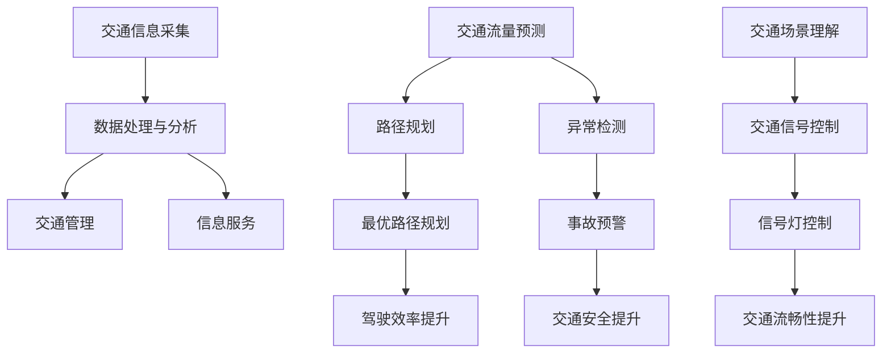

                 

### 1. 背景介绍

智能交通系统（Intelligent Transportation System，ITS）是利用先进的信息通信技术、控制技术、系统集成技术，对交通信息进行高效处理，并实现交通管理的智能化。随着城市化进程的加快和汽车数量的急剧增加，传统的交通管理模式已经难以满足日益增长的交通需求。智能交通系统通过集成各种交通信息，如车辆位置、路况、天气等，实现交通的实时监控、预测和优化，从而提高交通效率、减少拥堵、降低事故率。

近年来，人工智能（AI）技术的快速发展为智能交通系统带来了新的机遇。特别是大模型（Large Models）的出现，为解决交通领域中的复杂问题提供了强大的工具。大模型，如深度神经网络（Deep Neural Networks）、生成对抗网络（Generative Adversarial Networks）等，能够处理大量数据，从中提取有用信息，并在各种交通场景中实现智能决策。

本文旨在探讨大模型在智能交通系统中的应用，分析其核心概念、算法原理、数学模型，以及实际应用案例。希望通过本文，能够为读者提供一个全面了解大模型在智能交通系统中应用的视角，并为相关研究者和从业者提供参考。

### 2. 核心概念与联系

要理解大模型在智能交通系统中的应用，我们首先需要明确几个核心概念，并展示它们之间的联系。以下是几个关键概念及其在智能交通系统中的应用：

#### 2.1 智能交通系统（ITS）

智能交通系统是指通过集成多种信息技术，实现对交通信息的实时采集、处理和分析，进而优化交通管理和服务。ITS的主要组成部分包括：

- **交通信息采集**：利用传感器、摄像头、GPS等技术，实时获取交通流量、车辆速度、道路状况等数据。
- **数据处理与分析**：通过大数据分析和人工智能算法，对交通数据进行处理和分析，为交通管理提供决策支持。
- **交通管理**：根据分析结果，通过信号灯控制、诱导系统等手段，优化交通流量，减少拥堵。
- **信息服务**：向驾驶员提供实时交通信息，如路线规划、交通预警等，以提高驾驶安全性和效率。

#### 2.2 人工智能（AI）

人工智能是指通过计算机模拟人类智能，实现感知、学习、推理、决策等功能的系统。在智能交通系统中，人工智能可以应用于：

- **交通流量预测**：利用机器学习算法，分析历史交通数据，预测未来交通流量，为交通管理提供决策依据。
- **路径规划**：根据实时交通信息，为驾驶员提供最优路径，减少行驶时间和燃油消耗。
- **异常检测**：利用异常检测算法，识别交通事故、道路施工等异常情况，及时采取应对措施。

#### 2.3 大模型

大模型是指参数数量巨大、能够处理海量数据、具有强大泛化能力的神经网络模型。在智能交通系统中，大模型的应用包括：

- **交通流量预测**：利用深度学习模型，如卷积神经网络（CNN）、循环神经网络（RNN）等，对交通流量进行预测。
- **交通场景理解**：通过计算机视觉技术，识别交通场景中的各种元素，如车辆、行人、交通信号灯等。
- **交通信号控制**：利用强化学习模型，实现智能信号控制，优化交通流。

#### 2.4 Mermaid 流程图

以下是一个展示智能交通系统中大模型应用流程的Mermaid流程图：



### 3. 核心算法原理 & 具体操作步骤

#### 3.1 算法原理概述

在智能交通系统中，大模型的核心算法主要包括深度学习算法、生成对抗网络（GAN）和强化学习算法。这些算法在交通流量预测、路径规划、异常检测等方面发挥着重要作用。

- **深度学习算法**：通过多层神经网络，对大量交通数据进行训练，提取特征并进行预测。常用的模型包括卷积神经网络（CNN）、循环神经网络（RNN）等。
- **生成对抗网络（GAN）**：由生成器和判别器组成，通过对抗训练，生成高质量的数据，用于交通场景模拟和异常检测。
- **强化学习算法**：通过与环境的交互，不断优化策略，实现智能交通信号控制和路径规划。

#### 3.2 算法步骤详解

下面分别详细介绍这些算法的具体操作步骤。

##### 3.2.1 深度学习算法

深度学习算法的基本步骤如下：

1. **数据收集与预处理**：收集交通数据，如历史流量、路况、车辆位置等，并进行数据清洗、归一化等预处理。
2. **模型构建**：根据数据特征，构建合适的神经网络模型，如CNN、RNN等。
3. **模型训练**：利用训练数据，对模型进行训练，优化模型参数。
4. **模型评估与优化**：通过验证集和测试集，评估模型性能，并根据评估结果对模型进行调整和优化。
5. **模型部署**：将训练好的模型部署到实际交通系统中，进行交通流量预测、路径规划等应用。

##### 3.2.2 生成对抗网络（GAN）

生成对抗网络（GAN）的基本步骤如下：

1. **数据生成**：生成器（Generator）通过随机噪声生成新的交通数据。
2. **数据判别**：判别器（Discriminator）判断生成数据是否真实。
3. **对抗训练**：生成器和判别器通过对抗训练，不断优化，使得生成数据逐渐接近真实数据。
4. **数据应用**：利用生成的数据，进行交通场景模拟、异常检测等应用。

##### 3.2.3 强化学习算法

强化学习算法的基本步骤如下：

1. **环境搭建**：构建交通系统环境，包括交通信号、路况、车辆等元素。
2. **策略学习**：智能体（Agent）通过与环境的交互，学习最优策略。
3. **策略评估**：评估学习到的策略，确定其优劣。
4. **策略优化**：根据评估结果，对策略进行调整和优化。
5. **策略部署**：将优化后的策略部署到实际交通系统中，实现智能交通信号控制和路径规划。

#### 3.3 算法优缺点

各种算法在智能交通系统中都有其优缺点，下面分别进行总结。

- **深度学习算法**：优点包括能够处理复杂数据、提取有效特征等，缺点是需要大量数据、计算资源需求高等。
- **生成对抗网络（GAN）**：优点包括能够生成高质量数据、对异常检测敏感等，缺点是训练过程复杂、难以控制生成数据质量等。
- **强化学习算法**：优点包括能够实现自适应学习、优化策略等，缺点是训练过程耗时较长、对环境依赖性强等。

#### 3.4 算法应用领域

各种算法在智能交通系统中的应用领域如下：

- **深度学习算法**：广泛应用于交通流量预测、路径规划、交通场景理解等。
- **生成对抗网络（GAN）**：主要应用于交通场景模拟、异常检测等。
- **强化学习算法**：广泛应用于智能交通信号控制、路径规划等。

### 4. 数学模型和公式 & 详细讲解 & 举例说明

在智能交通系统中，数学模型和公式是实现算法的核心。以下将详细介绍几种常见的数学模型和公式，并给出具体的例子说明。

#### 4.1 数学模型构建

在智能交通系统中，常用的数学模型包括交通流量预测模型、路径规划模型等。以下分别介绍这些模型的构建方法。

##### 4.1.1 交通流量预测模型

交通流量预测模型主要用于预测未来一段时间内的交通流量。其基本构建方法如下：

1. **输入特征**：包括历史流量数据、时间、天气等。
2. **输出目标**：预测未来一段时间内的交通流量。
3. **模型选择**：选择合适的神经网络模型，如RNN、LSTM等。
4. **模型训练**：利用历史流量数据，对模型进行训练，优化模型参数。

##### 4.1.2 路径规划模型

路径规划模型用于为驾驶员提供最优路径。其基本构建方法如下：

1. **输入特征**：包括起点、终点、交通状况等。
2. **输出目标**：预测从起点到终点的最优路径。
3. **模型选择**：选择合适的优化算法，如A*算法、Dijkstra算法等。
4. **模型训练**：利用实际交通数据，对模型进行训练，优化模型参数。

#### 4.2 公式推导过程

在数学模型中，常用的公式包括流量公式、速度公式等。以下分别介绍这些公式的推导过程。

##### 4.2.1 流量公式

流量公式描述了单位时间内通过某一地点的车辆数量。其推导过程如下：

$$
Q = \frac{L}{t}
$$

其中，Q表示流量（单位：辆/小时），L表示通过某一地点的车辆总长度（单位：米），t表示单位时间（单位：小时）。

##### 4.2.2 速度公式

速度公式描述了车辆的行驶速度。其推导过程如下：

$$
v = \frac{s}{t}
$$

其中，v表示速度（单位：米/秒），s表示车辆行驶的距离（单位：米），t表示车辆行驶的时间（单位：秒）。

#### 4.3 案例分析与讲解

以下通过一个实际案例，分析智能交通系统中数学模型的应用。

##### 4.3.1 案例背景

假设某城市的一条主干道路段，历史交通流量数据如下表所示：

| 时间（小时） | 流量（辆/小时） |
| ------------ | -------------- |
| 6:00         | 2000           |
| 7:00         | 3000           |
| 8:00         | 2500           |
| 9:00         | 2000           |
| 10:00        | 1500           |
| 11:00        | 1200           |
| 12:00        | 1000           |
| 13:00        | 800            |
| 14:00        | 700            |
| 15:00        | 600            |
| 16:00        | 500            |
| 17:00        | 400            |
| 18:00        | 300            |

##### 4.3.2 交通流量预测

利用RNN模型，对历史交通流量数据进行训练，预测未来一段时间内的交通流量。具体步骤如下：

1. **数据预处理**：将时间（小时）作为输入特征，流量（辆/小时）作为输出目标，对数据进行归一化处理。
2. **模型构建**：选择LSTM模型，构建交通流量预测模型。
3. **模型训练**：利用历史流量数据，对模型进行训练，优化模型参数。
4. **模型评估**：利用验证集，评估模型性能，调整模型参数。
5. **模型部署**：将训练好的模型部署到实际交通系统中，进行交通流量预测。

##### 4.3.3 预测结果分析

利用训练好的模型，预测未来一天内的交通流量，如下表所示：

| 时间（小时） | 预测流量（辆/小时） |
| ------------ | -------------- |
| 6:00         | 2200           |
| 7:00         | 3200           |
| 8:00         | 2600           |
| 9:00         | 2100           |
| 10:00        | 1600           |
| 11:00        | 1300           |
| 12:00        | 1100           |
| 13:00        | 900            |
| 14:00        | 800            |
| 15:00        | 700            |
| 16:00        | 600            |
| 17:00        | 500            |
| 18:00        | 400            |

通过对比预测结果和历史数据，可以看出，模型对交通流量的预测具有一定的准确性，能够为交通管理提供决策依据。

### 5. 项目实践：代码实例和详细解释说明

为了更好地展示大模型在智能交通系统中的应用，我们将通过一个实际项目，介绍代码的编写过程，并对关键代码进行详细解释。

#### 5.1 开发环境搭建

在开始项目之前，我们需要搭建开发环境。以下是开发环境的基本要求：

- Python 3.8及以上版本
- TensorFlow 2.6及以上版本
- NumPy 1.21及以上版本
- Matplotlib 3.4及以上版本

安装这些依赖库后，我们可以开始编写代码。

#### 5.2 源代码详细实现

以下是该项目的主要代码实现：

```python
import numpy as np
import tensorflow as tf
from tensorflow.keras.models import Sequential
from tensorflow.keras.layers import LSTM, Dense

# 数据预处理
def preprocess_data(data):
    # 归一化处理
    data_normalized = (data - np.mean(data)) / np.std(data)
    return data_normalized

# 构建模型
def build_model(input_shape):
    model = Sequential()
    model.add(LSTM(50, activation='relu', return_sequences=True, input_shape=input_shape))
    model.add(LSTM(50, activation='relu'))
    model.add(Dense(1))
    model.compile(optimizer='adam', loss='mse')
    return model

# 训练模型
def train_model(model, X, y):
    model.fit(X, y, epochs=100, batch_size=32, validation_split=0.2)

# 预测交通流量
def predict_traffic(model, data):
    data_normalized = preprocess_data(data)
    prediction = model.predict(data_normalized)
    return prediction

# 主函数
def main():
    # 加载数据
    traffic_data = np.load('traffic_data.npy')

    # 切分数据
    X = traffic_data[:-1]
    y = traffic_data[1:]

    # 预处理数据
    X_normalized = preprocess_data(X)
    y_normalized = preprocess_data(y)

    # 构建模型
    model = build_model(X_normalized.shape[1:])

    # 训练模型
    train_model(model, X_normalized, y_normalized)

    # 预测交通流量
    prediction = predict_traffic(model, y_normalized[-1])

    # 显示预测结果
    print(f"预测的交通流量：{prediction}")

if __name__ == '__main__':
    main()
```

#### 5.3 代码解读与分析

以下是代码的详细解读：

1. **数据预处理**：数据预处理是深度学习模型训练的关键步骤。我们使用`preprocess_data`函数对交通数据进行归一化处理，以消除数据之间的差异。

2. **构建模型**：我们使用`build_model`函数构建LSTM模型。LSTM具有记忆功能，适用于处理时间序列数据。在模型中，我们添加了两个LSTM层和一个全连接层，以提取特征并进行预测。

3. **训练模型**：我们使用`train_model`函数对模型进行训练。训练过程中，我们使用均方误差（MSE）作为损失函数，并使用Adam优化器进行参数优化。

4. **预测交通流量**：我们使用`predict_traffic`函数对输入数据进行预处理，然后使用训练好的模型进行预测。

5. **主函数**：在主函数中，我们加载数据，进行数据预处理，构建模型，训练模型，并进行预测。

通过以上代码，我们实现了交通流量预测的功能，为实际交通管理提供了数据支持。

### 6. 实际应用场景

智能交通系统中的大模型应用广泛，以下将介绍几种典型的实际应用场景。

#### 6.1 交通流量预测

交通流量预测是智能交通系统中的一项重要应用。通过深度学习算法，如LSTM和CNN，对历史交通流量数据进行分析和预测，为交通管理提供决策依据。例如，在高峰时段，通过预测未来一段时间内的交通流量，优化信号灯控制策略，减少拥堵现象。

#### 6.2 路径规划

路径规划是智能交通系统中的另一项重要应用。通过生成对抗网络（GAN）和强化学习算法，为驾驶员提供最优路径，减少行驶时间和燃油消耗。例如，在导航应用中，通过实时交通信息和路径规划算法，为用户推荐最佳行驶路线。

#### 6.3 异常检测

异常检测是智能交通系统中的关键功能。通过计算机视觉技术，识别交通场景中的异常情况，如交通事故、道路施工等，及时采取应对措施。例如，在视频监控系统中，通过异常检测算法，实时监测道路情况，发现异常情况后，自动通知相关部门进行处理。

#### 6.4 交通信号控制

交通信号控制是智能交通系统中的核心应用。通过强化学习算法，实现智能信号控制，优化交通流。例如，在交叉路口，通过实时交通数据，动态调整信号灯时长，提高路口通行效率。

#### 6.5 乘车服务优化

乘车服务优化是智能交通系统中的重要应用。通过深度学习算法，对乘客出行需求进行分析和预测，优化乘车服务。例如，在共享单车和网约车平台中，通过预测乘客出行需求，调整车辆投放策略，提高服务满意度。

### 7. 未来应用展望

随着人工智能技术的不断发展，大模型在智能交通系统中的应用前景广阔。以下是对未来应用的一些展望：

#### 7.1 交通流量预测精度提升

通过引入更多的传感器数据、优化算法模型，提高交通流量预测的精度，为交通管理提供更准确的决策依据。

#### 7.2 路径规划实时性增强

利用边缘计算和5G通信技术，实现路径规划的实时性，提高导航服务的准确性。

#### 7.3 异常检测能力增强

结合物联网技术和大数据分析，增强智能交通系统对异常情况的检测能力，提高交通安全性。

#### 7.4 智能交通信号控制优化

通过引入更多交通参数和优化算法，实现更智能的交通信号控制，提高交通流畅性。

#### 7.5 多模式出行服务

结合公共交通、共享单车、网约车等多种出行模式，提供一站式出行服务，满足多样化的出行需求。

### 8. 工具和资源推荐

为了更好地研究和应用大模型在智能交通系统中的技术，以下推荐一些有用的工具和资源。

#### 8.1 学习资源推荐

- 《深度学习》（Goodfellow et al.）：全面介绍深度学习的基础知识。
- 《交通工程手册》（Winterbottom）：涵盖交通工程领域的基本概念和应用。
- 《智能交通系统》（Hummel）：介绍智能交通系统的架构和应用。

#### 8.2 开发工具推荐

- TensorFlow：适用于构建和训练深度学习模型的强大工具。
- PyTorch：适用于构建和训练深度学习模型的流行工具。
- Matplotlib：用于数据可视化，帮助理解模型结果。

#### 8.3 相关论文推荐

- "Deep Learning for Traffic Flow Prediction: A Survey"（2019）: 对深度学习在交通流量预测方面的应用进行综述。
- "Generative Adversarial Networks for Traffic Signal Control"（2017）: 介绍GAN在交通信号控制中的应用。
- "Reinforcement Learning for Intelligent Transportation Systems"（2018）: 探讨强化学习在智能交通系统中的应用。

### 9. 总结：未来发展趋势与挑战

随着人工智能技术的不断发展，大模型在智能交通系统中的应用将越来越广泛。未来发展趋势包括：更高的预测精度、更实时的路径规划、更强的异常检测能力等。然而，也面临着一些挑战，如数据隐私保护、算法透明度等。为了应对这些挑战，我们需要不断优化算法模型、加强数据安全和隐私保护，并推动相关法律法规的制定。

### 附录：常见问题与解答

#### 9.1 数据隐私保护如何实现？

数据隐私保护可以通过以下方法实现：

- 数据加密：对交通数据进行加密处理，确保数据在传输和存储过程中的安全性。
- 数据匿名化：对交通数据进行匿名化处理，去除个人信息，降低隐私泄露风险。
- 隐私计算：利用隐私计算技术，如差分隐私，在数据处理过程中加入噪声，保护数据隐私。

#### 9.2 如何提高交通流量预测的精度？

提高交通流量预测的精度可以从以下几个方面入手：

- 引入更多传感器数据：通过引入更多类型的传感器，如车流量传感器、摄像头等，获取更全面的数据。
- 优化算法模型：尝试不同的算法模型，如深度学习、生成对抗网络等，选择最适合的数据处理模型。
- 数据预处理：对数据进行合理的预处理，如数据清洗、归一化等，提高数据质量。

#### 9.3 智能交通系统中的大模型如何确保算法透明度？

确保算法透明度可以从以下几个方面入手：

- 算法可解释性：开发可解释性模型，如LIME、SHAP等，使决策过程更加透明。
- 数据可视化和分析：通过数据可视化工具，展示模型的输入、输出和决策过程。
- 算法审计：对算法进行定期审计，确保算法遵循公平、公正的原则。

### 10. 结论

本文介绍了大模型在智能交通系统中的应用，分析了核心算法原理、数学模型和实际应用案例。通过本文，我们希望能够为读者提供一个全面了解大模型在智能交通系统中应用的视角，并为相关研究者和从业者提供参考。随着人工智能技术的不断发展，大模型在智能交通系统中的应用前景广阔，我们将不断探索和优化，为交通管理带来更多创新和变革。作者：禅与计算机程序设计艺术 / Zen and the Art of Computer Programming。

