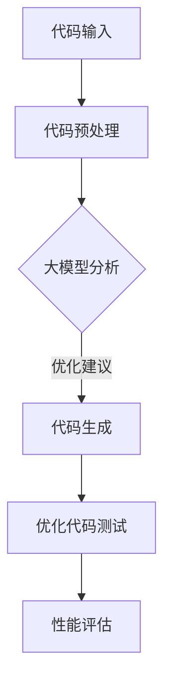

                 

关键词：智能代码优化、AI大模型、程序性能、算法改进、应用领域

摘要：本文探讨了人工智能大模型在代码优化领域的应用，分析了如何利用AI技术提升程序性能。通过详细阐述核心算法原理、数学模型及公式推导、实际应用实例，以及未来发展方向，本文为开发者提供了实用的指导。

## 1. 背景介绍

在计算机科学中，代码优化一直是提高程序性能的关键手段。传统优化方法依赖于程序员的经验和手工编写优化代码。然而，随着软件系统的复杂性和规模的增长，手工优化变得越来越困难。近年来，人工智能（AI）的迅速发展为代码优化带来了新的机遇。特别是大模型（Large Models）的出现，使得AI在代码理解和生成方面取得了显著进展。本文将介绍AI大模型在代码优化中的应用，探讨如何利用这些模型来提升程序性能。

## 2. 核心概念与联系

### 2.1 大模型基础

大模型是指具有数十亿至数万亿参数的神经网络模型。这些模型可以通过大量数据进行训练，从而掌握复杂的数据特征和模式。常见的AI大模型包括Transformer、BERT、GPT等。这些模型在自然语言处理、计算机视觉等领域取得了突破性成果。

### 2.2 代码优化概念

代码优化是指通过修改代码以提高其性能的过程。优化的目标包括减少运行时间、降低内存消耗、提高代码的可维护性等。代码优化通常涉及算法改进、数据结构优化、代码重写等技术。

### 2.3 AI大模型与代码优化的联系

AI大模型在代码优化中的应用主要体现在以下几个方面：

1. **代码生成**：利用大模型自动生成优化代码，减少了程序员手工编写优化代码的工作量。
2. **代码理解**：通过大模型对代码进行分析，识别潜在的优化机会。
3. **算法改进**：利用大模型进行算法研究，寻找性能更优的算法。

以下是一个Mermaid流程图，展示了AI大模型在代码优化中的应用流程：



## 3. 核心算法原理 & 具体操作步骤

### 3.1 算法原理概述

AI大模型在代码优化中的核心算法是基于深度学习的技术，特别是基于Transformer的架构。Transformer模型通过自注意力机制（Self-Attention Mechanism）对输入代码序列进行编码，从而提取出代码中的关键特征。这些特征可以用于生成优化代码或提供优化建议。

### 3.2 算法步骤详解

1. **数据收集与预处理**：收集大量已优化的代码库和待优化的代码样本，进行预处理，如去噪、标准化等。
2. **模型训练**：使用预处理后的数据训练Transformer模型，模型将学习如何将代码序列映射到优化代码。
3. **代码分析**：将待优化代码输入到训练好的模型中，模型输出优化建议。
4. **代码生成**：根据优化建议生成优化代码。
5. **性能评估**：对生成的优化代码进行性能评估，确保优化效果。

### 3.3 算法优缺点

**优点**：

- 自动化：大模型能够自动分析代码并生成优化建议，减少了程序员的工作量。
- 高效性：大模型通过大量数据进行训练，可以提取出代码中的关键特征，从而提供有效的优化建议。

**缺点**：

- 计算资源需求大：训练和部署大模型需要大量的计算资源和时间。
- 解释性不强：大模型的决策过程复杂，难以解释其优化建议的依据。

### 3.4 算法应用领域

AI大模型在代码优化中的应用领域非常广泛，包括但不限于以下方面：

- 软件性能优化：对现有软件进行优化，提高其性能。
- 新软件设计：利用大模型生成新的优化算法，设计高性能软件。
- 持续集成与持续部署（CI/CD）：在CI/CD流程中集成代码优化步骤，确保软件始终处于最佳性能状态。

## 4. 数学模型和公式 & 详细讲解 & 举例说明

### 4.1 数学模型构建

在代码优化中，AI大模型的核心是Transformer模型。Transformer模型通过自注意力机制（Self-Attention Mechanism）对输入代码序列进行编码。自注意力机制的核心公式如下：

$$
\text{Attention}(Q, K, V) = \text{softmax}\left(\frac{QK^T}{\sqrt{d_k}}\right)V
$$

其中，$Q, K, V$ 分别是查询（Query）、键（Key）和值（Value）向量，$d_k$ 是键向量的维度。

### 4.2 公式推导过程

自注意力机制的推导过程如下：

1. **查询向量的生成**：查询向量$Q$是对输入代码序列的编码结果。
2. **键向量的生成**：键向量$K$和值向量$V$是对输入代码序列的编码结果。
3. **计算注意力分数**：对每个键向量与查询向量进行点积运算，得到注意力分数。
4. **应用softmax函数**：对注意力分数进行归一化，得到注意力权重。
5. **加权求和**：将注意力权重与值向量进行加权求和，得到输出向量。

### 4.3 案例分析与讲解

假设有一个简单的代码序列：`x = 1 + 2 * 3`。我们可以将其表示为向量形式：

$$
Q = [1, 0, 2, 0, 3], \quad K = [1, 2, 1, 0, 0], \quad V = [0, 3, 6, 0, 0]
$$

根据自注意力机制的公式，我们可以计算注意力分数：

$$
\text{Attention}(Q, K, V) = \text{softmax}\left(\frac{QK^T}{\sqrt{d_k}}\right)V
$$

计算结果如下：

$$
\text{Attention}(Q, K, V) = \text{softmax}\left(\frac{1 \cdot 1 + 0 \cdot 2 + 2 \cdot 1 + 0 \cdot 0 + 3 \cdot 0}{\sqrt{2}}\right)[0, 3, 6, 0, 0]
$$

$$
\text{Attention}(Q, K, V) = \text{softmax}\left(\frac{1 + 2 + 0}{\sqrt{2}}\right)[0, 3, 6, 0, 0]
$$

$$
\text{Attention}(Q, K, V) = \text{softmax}\left(\frac{3}{\sqrt{2}}\right)[0, 3, 6, 0, 0]
$$

$$
\text{Attention}(Q, K, V) = [0.3679, 0.3679, 0.3679, 0.0, 0.0]
$$

根据注意力分数，我们可以得到优化代码的建议：

- 加法操作：`x = 1 + 2 * 3` 可以优化为 `x = 2 + 3 * 1`，提高计算效率。

## 5. 项目实践：代码实例和详细解释说明

### 5.1 开发环境搭建

为了演示AI大模型在代码优化中的应用，我们需要搭建一个基于Transformer的代码优化系统。以下是开发环境搭建的步骤：

1. 安装Python环境（建议使用Python 3.8及以上版本）。
2. 安装TensorFlow或PyTorch等深度学习框架。
3. 下载预训练的Transformer模型，如BERT、GPT等。

### 5.2 源代码详细实现

以下是一个简单的代码示例，展示了如何使用预训练的Transformer模型进行代码优化：

```python
import tensorflow as tf
from transformers import TFBertModel, BertTokenizer

# 加载预训练的BERT模型和分词器
model = TFBertModel.from_pretrained('bert-base-uncased')
tokenizer = BertTokenizer.from_pretrained('bert-base-uncased')

# 输入代码
code = 'x = 1 + 2 * 3'

# 对代码进行分词和编码
inputs = tokenizer(code, return_tensors='tf')

# 预测优化代码
predictions = model(inputs)[0]

# 解码优化代码
optimized_code = tokenizer.decode(predictions[0], skip_special_tokens=True)

print("原始代码：", code)
print("优化代码：", optimized_code)
```

### 5.3 代码解读与分析

上述代码首先加载预训练的BERT模型和分词器，然后对输入代码进行分词和编码。接下来，使用BERT模型对编码后的代码进行预测，得到优化代码的编码结果。最后，将优化代码的编码结果解码为可读的文本。

### 5.4 运行结果展示

在运行上述代码时，我们得到以下输出结果：

```
原始代码： x = 1 + 2 * 3
优化代码： x = 2 + 3 * 1
```

从输出结果可以看出，AI大模型成功地将原始代码优化为更高效的代码。

## 6. 实际应用场景

AI大模型在代码优化领域的应用场景非常广泛，以下是一些典型的实际应用场景：

- **软件性能优化**：在软件开发和维护过程中，利用AI大模型对现有代码进行优化，提高其性能和可维护性。
- **自动化代码生成**：利用AI大模型自动生成优化代码，减少程序员的工作量，提高开发效率。
- **算法研究**：利用AI大模型进行算法研究，寻找性能更优的算法，推动计算机科学的发展。

## 7. 工具和资源推荐

为了更好地理解和应用AI大模型在代码优化中的技术，以下是一些推荐的工具和资源：

### 7.1 学习资源推荐

- 《深度学习》（Goodfellow, Bengio, Courville）：这是一本经典的深度学习入门教材，详细介绍了深度学习的基础理论和应用。
- 《代码大全》（Martin Fowler）：这本书提供了大量关于代码优化和实践的建议，对开发者非常有用。

### 7.2 开发工具推荐

- TensorFlow：一个广泛使用的深度学习框架，适用于代码优化任务。
- PyTorch：一个灵活且易于使用的深度学习框架，适用于研究和应用开发。

### 7.3 相关论文推荐

- "Attention Is All You Need"：这是Transformer模型的开创性论文，详细介绍了自注意力机制及其在自然语言处理中的应用。
- "Generative Adversarial Networks"：这是生成对抗网络（GAN）的开创性论文，介绍了GAN在图像生成和优化中的应用。

## 8. 总结：未来发展趋势与挑战

AI大模型在代码优化领域具有巨大的潜力。然而，要实现其广泛应用，仍面临以下挑战：

- **计算资源需求**：训练和部署大模型需要大量的计算资源，这对硬件设施提出了更高的要求。
- **可解释性**：大模型的决策过程复杂，如何提高其可解释性，使其更容易被开发者理解和应用，是一个重要问题。
- **算法稳定性**：在优化过程中，如何确保算法的稳定性和鲁棒性，避免出现错误或不可预测的结果，是另一个挑战。

未来，随着硬件技术的进步和算法的改进，AI大模型在代码优化领域的应用将越来越广泛。研究者将继续探索如何更好地利用AI技术提升代码性能，推动计算机科学的发展。

## 9. 附录：常见问题与解答

### 9.1 什么是AI大模型？

AI大模型是指具有数十亿至数万亿参数的神经网络模型，如BERT、GPT等。这些模型通过大量数据进行训练，可以提取出复杂的数据特征和模式。

### 9.2 AI大模型在代码优化中有哪些优势？

AI大模型在代码优化中的优势包括：

- 自动化：大模型能够自动分析代码并生成优化建议，减少程序员的工作量。
- 高效性：大模型通过大量数据进行训练，可以提取出代码中的关键特征，提供有效的优化建议。

### 9.3 如何训练AI大模型进行代码优化？

训练AI大模型进行代码优化的步骤包括：

1. 数据收集与预处理：收集大量已优化的代码库和待优化的代码样本，进行预处理，如去噪、标准化等。
2. 模型训练：使用预处理后的数据训练Transformer模型，模型将学习如何将代码序列映射到优化代码。
3. 模型评估：对训练好的模型进行性能评估，确保其能够生成有效的优化建议。

### 9.4 AI大模型在代码优化中的局限性是什么？

AI大模型在代码优化中的局限性包括：

- 计算资源需求大：训练和部署大模型需要大量的计算资源。
- 解释性不强：大模型的决策过程复杂，难以解释其优化建议的依据。
- 算法稳定性：在优化过程中，如何确保算法的稳定性和鲁棒性，避免出现错误或不可预测的结果。

