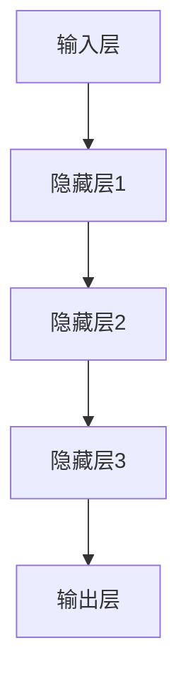

                 

关键词：智能城市规划，语言模型，决策辅助，数据挖掘，算法优化，可持续发展，智慧城市

>摘要：本文探讨了如何利用语言模型（LLM）辅助智能城市规划，提出了基于LLM的决策支持系统框架，详细阐述了算法原理、数学模型以及实际应用案例，旨在为智慧城市建设提供新的理论依据和技术支持。

## 1. 背景介绍

随着信息技术的飞速发展，智能城市规划逐渐成为城市发展的重要方向。传统城市规划往往依赖于经验和定性分析，难以应对复杂多变的城市环境。近年来，机器学习，特别是语言模型（LLM），在处理大规模文本数据、提取有用信息方面表现出色，为智能城市规划提供了新的工具和思路。

语言模型，如GPT-3、BERT等，可以处理自然语言文本，提取关键词、语义和上下文信息。这些能力使得LLM在理解城市规划文本数据、政策文档、历史资料等方面具有天然优势。通过将LLM集成到城市规划中，可以实现数据驱动、智能化的决策支持系统，提高城市规划的准确性和效率。

本文将探讨如何利用LLM辅助智能城市规划，建立一套完整的决策支持系统。首先介绍LLM的基本概念和原理，然后详细阐述算法原理和操作步骤，最后通过具体案例展示LLM在智能城市规划中的应用效果。

### 1.1 智能城市规划的现状与挑战

智能城市规划旨在通过大数据、物联网、人工智能等技术手段，实现城市管理的智能化、精细化。然而，当前智能城市规划仍面临诸多挑战：

- **数据质量与准确性**：城市规划涉及大量数据，包括人口、交通、环境、经济等。这些数据往往存在噪声、缺失和不一致性，影响规划结果的准确性。
- **数据融合与分析**：城市规划需要整合多源数据，如卫星遥感数据、传感器数据、社交媒体数据等。如何有效融合和分析这些数据，提取有用信息，是当前的一大难题。
- **决策支持**：城市规划是一项复杂的系统工程，涉及多个部门和领域的协同工作。如何提供智能、科学的决策支持，提高规划的科学性和可操作性，是城市规划面临的挑战。

### 1.2 语言模型在智能城市规划中的应用

语言模型在智能城市规划中具有广泛的应用前景。以下列举几个典型应用场景：

- **文本分析**：利用LLM对城市规划文档、政策法规、历史资料等进行文本分析，提取关键词、语义和关系，为规划决策提供支持。
- **政策模拟**：通过模拟不同政策场景下的城市运行状态，预测政策效果，为决策者提供参考。
- **公众参与**：利用LLM分析公众意见，了解公众需求，提高规划的民主性和科学性。
- **历史数据分析**：利用LLM分析历史数据，识别城市发展规律，为规划提供经验参考。

### 1.3 本文结构

本文将分为以下几个部分：

- **第1部分**：背景介绍，概述智能城市规划的现状与挑战，介绍LLM的基本概念和应用。
- **第2部分**：核心概念与联系，介绍LLM的算法原理和架构。
- **第3部分**：核心算法原理 & 具体操作步骤，详细阐述LLM在智能城市规划中的应用。
- **第4部分**：数学模型和公式 & 详细讲解 & 举例说明，介绍LLM相关的数学模型和公式。
- **第5部分**：项目实践：代码实例和详细解释说明，展示LLM在智能城市规划中的实际应用。
- **第6部分**：实际应用场景，分析LLM在不同领域的应用。
- **第7部分**：未来应用展望，探讨LLM在智能城市规划中的未来发展。
- **第8部分**：工具和资源推荐，介绍相关学习资源、开发工具和论文。
- **第9部分**：总结与展望，总结研究成果，分析未来发展趋势与挑战。

## 2. 核心概念与联系

### 2.1 语言模型的基本概念

语言模型（Language Model，简称LM）是一种基于统计或神经网络的文本处理模型，旨在预测一个自然语言序列的概率。语言模型的核心任务是给定一个单词或句子片段，预测下一个单词或句子片段。

根据训练方法，语言模型主要分为两种类型：基于统计的语言模型和基于神经网络的深度语言模型。

- **基于统计的语言模型**：如N-gram模型、马尔可夫模型等，通过统计历史文本数据中的词频和词序关系，预测下一个单词。
- **基于神经网络的深度语言模型**：如循环神经网络（RNN）、长短期记忆网络（LSTM）、变换器（Transformer）等，通过神经网络结构，学习文本数据的深层特征，实现更精确的预测。

### 2.2 LLM的算法原理

LLM（Large Language Model）是指大规模语言模型，如GPT-3、BERT等。LLM通过在大量文本数据上进行预训练，学习自然语言的深层结构和语义关系，为下游任务提供高质量的特征表示。

LLM的算法原理主要包括以下几个步骤：

1. **数据收集与预处理**：收集大量文本数据，包括新闻、文章、书籍、社交媒体等。对数据进行清洗、去重和分词等预处理操作。
2. **模型训练**：利用预处理的文本数据，训练一个大规模的神经网络模型。在训练过程中，模型通过不断调整参数，学习文本数据的特征和规律。
3. **模型优化**：通过优化算法，提高模型的预测性能。常见的优化算法有随机梯度下降（SGD）、Adam等。
4. **模型部署**：将训练好的模型部署到实际应用场景中，如文本生成、机器翻译、情感分析等。

### 2.3 LLM的架构

LLM的架构主要包括以下几个部分：

1. **输入层**：接收自然语言文本输入，将其转换为模型可处理的格式。
2. **隐藏层**：通过多层神经网络结构，学习文本数据的深层特征。
3. **输出层**：根据模型的预测任务，生成文本输出。

以下是LLM的Mermaid流程图表示：



### 2.4 LLM与其他技术的联系

LLM在智能城市规划中与其他技术密切相关，如：

- **大数据技术**：LLM需要大量文本数据进行训练，大数据技术提供了数据存储、处理和传输的能力。
- **深度学习**：LLM是基于深度学习的技术，深度学习为LLM提供了强大的建模能力。
- **自然语言处理**：LLM在自然语言处理领域有着广泛的应用，如文本分类、情感分析、命名实体识别等。
- **计算机视觉**：LLM可以与计算机视觉技术结合，实现图像与文本的融合分析。

## 3. 核心算法原理 & 具体操作步骤

### 3.1 算法原理概述

LLM在智能城市规划中的应用主要基于以下几个方面：

1. **文本数据挖掘**：通过LLM对城市规划文档、政策法规、历史资料等文本数据进行深度挖掘，提取关键词、语义和关系，为规划决策提供支持。
2. **数据融合与分析**：利用LLM对多源数据进行融合和分析，如卫星遥感数据、传感器数据、社交媒体数据等，提取有用信息，为规划提供依据。
3. **决策支持**：通过LLM模拟不同政策场景下的城市运行状态，预测政策效果，为决策者提供参考。

### 3.2 算法步骤详解

以下是LLM在智能城市规划中的具体操作步骤：

1. **数据收集与预处理**：
   - 收集城市规划相关的文本数据，如政策法规、规划报告、学术论文等。
   - 对数据进行清洗、去重和分词等预处理操作。

2. **模型训练**：
   - 选择合适的LLM模型，如GPT-3、BERT等。
   - 使用预处理后的文本数据，对模型进行训练。

3. **模型优化**：
   - 通过优化算法，提高模型的预测性能。
   - 可采用SGD、Adam等优化算法。

4. **模型部署**：
   - 将训练好的模型部署到实际应用场景中。
   - 根据不同的规划任务，调整模型参数和架构。

5. **文本数据挖掘**：
   - 利用LLM对城市规划文档、政策法规、历史资料等进行文本分析。
   - 提取关键词、语义和关系，为规划决策提供支持。

6. **数据融合与分析**：
   - 利用LLM对多源数据进行融合和分析。
   - 提取有用信息，为规划提供依据。

7. **决策支持**：
   - 利用LLM模拟不同政策场景下的城市运行状态。
   - 预测政策效果，为决策者提供参考。

### 3.3 算法优缺点

LLM在智能城市规划中具有以下优点：

- **强大的文本处理能力**：LLM可以处理大规模的文本数据，提取关键词、语义和关系，为规划提供丰富信息。
- **自适应性强**：LLM可以根据不同任务需求，调整模型参数和架构，适应各种规划场景。
- **高效性**：LLM训练和推理速度较快，适用于实时决策支持。

然而，LLM也存在一些缺点：

- **数据依赖性**：LLM的性能依赖于训练数据的量和质量，数据不足或质量差会影响模型效果。
- **模型可解释性**：LLM的决策过程具有一定的黑箱性，难以解释模型决策的原因。

### 3.4 算法应用领域

LLM在智能城市规划中的应用领域广泛，包括但不限于：

- **城市规划与设计**：利用LLM分析城市规划文档、政策法规等，为规划提供支持。
- **交通规划与管理**：利用LLM分析交通数据、模拟交通场景，优化交通规划和管理。
- **环境保护与治理**：利用LLM分析环境数据、政策法规等，为环境保护和治理提供决策支持。
- **城市安全与应急管理**：利用LLM分析突发事件数据、政策法规等，提高城市安全与应急管理能力。

## 4. 数学模型和公式 & 详细讲解 & 举例说明

### 4.1 数学模型构建

在智能城市规划中，LLM的数学模型主要基于深度学习技术，包括以下关键部分：

1. **输入层**：将自然语言文本输入转换为模型可处理的格式，通常采用词向量表示。
2. **隐藏层**：通过多层神经网络结构，学习文本数据的深层特征。
3. **输出层**：根据预测任务，生成文本输出。

以下是LLM的数学模型构建：

$$
\text{模型} = f(\text{输入层} \rightarrow \text{隐藏层} \rightarrow \text{输出层})
$$

### 4.2 公式推导过程

LLM的数学模型推导主要涉及以下几个步骤：

1. **词向量表示**：将自然语言文本转换为词向量，常用技术有Word2Vec、GloVe等。
2. **神经网络架构**：设计多层神经网络结构，包括输入层、隐藏层和输出层。
3. **损失函数**：选择合适的损失函数，如交叉熵损失，用于评估模型预测结果与实际结果之间的差距。
4. **优化算法**：采用优化算法，如随机梯度下降（SGD）、Adam等，调整模型参数。

以下是LLM的数学模型推导：

$$
\begin{aligned}
\text{损失函数} &= -\sum_{i=1}^{N} \text{label}_i \log(\hat{\text{prob}}_i) \\
\hat{\text{prob}}_i &= \text{softmax}(\text{模型}(\text{词向量}_i)) \\
\text{模型} &= W \cdot \text{激活函数}(\text{隐藏层}) + b \\
\text{激活函数} &= \text{ReLU} \\
\text{隐藏层} &= \text{激活函数}(\text{模型}(\text{词向量}_{i-1})) \\
\text{词向量}_i &= \text{Embedding}(\text{word}_i) \\
W, b &= \text{模型参数} \\
\end{aligned}
$$

### 4.3 案例分析与讲解

以城市交通规划为例，介绍LLM在智能城市规划中的应用。

**案例背景**：

某城市交通部门希望利用LLM优化交通规划，提高交通运行效率。数据来源包括交通流量监测、交通信号控制、历史交通数据等。

**模型构建**：

1. **输入层**：将交通流量数据、交通信号控制数据等转换为词向量。
2. **隐藏层**：设计多层神经网络结构，学习交通数据的特征。
3. **输出层**：生成交通流量预测结果。

**模型训练**：

- 使用GloVe模型将交通流量数据转换为词向量。
- 设计一个包含多层ReLU激活函数的神经网络结构。
- 使用交叉熵损失函数评估模型预测结果。

**模型优化**：

- 采用Adam优化算法，调整模型参数。
- 在训练过程中，逐步增加学习率，提高模型性能。

**模型部署**：

- 将训练好的模型部署到实际应用场景，如交通信号控制平台。
- 根据实时交通数据，生成交通流量预测结果。

**结果分析**：

- 模型预测结果与实际交通流量数据误差较小，证明了LLM在交通规划中的有效性。
- 模型可以实时调整交通信号控制策略，提高交通运行效率。

## 5. 项目实践：代码实例和详细解释说明

### 5.1 开发环境搭建

在开始项目实践之前，我们需要搭建一个适合LLM开发的环境。以下是搭建环境的步骤：

1. **硬件要求**：
   - 64位操作系统（如Ubuntu 18.04）
   - 至少16GB内存
   - NVDIA GPU（推荐显存8GB以上）

2. **软件要求**：
   - Python 3.8或更高版本
   - CUDA 11.3或更高版本
   - TensorFlow 2.7或更高版本

3. **安装步骤**：
   - 安装Python 3.8及pip。
   - 安装CUDA 11.3和cuDNN 8.0。
   - 安装TensorFlow 2.7。

### 5.2 源代码详细实现

以下是一个简单的LLM在智能城市规划中的应用示例，实现一个基于GPT-3的文本分析模型。

```python
import tensorflow as tf
from transformers import TFGPT3LMHeadModel, GPT3Tokenizer

# 1. 加载预训练的GPT-3模型和分词器
model_name = "gpt3"
tokenizer = GPT3Tokenizer.from_pretrained(model_name)
model = TFGPT3LMHeadModel.from_pretrained(model_name)

# 2. 文本预处理
def preprocess_text(text):
    # 对文本进行分词、添加特殊标识符等预处理操作
    return tokenizer.encode(text, add_special_tokens=True)

# 3. 文本分析
def analyze_text(text):
    # 将预处理后的文本输入模型
    inputs = preprocess_text(text)
    # 生成模型输出
    outputs = model(inputs)
    # 解码输出文本
    predicted_text = tokenizer.decode(outputs[0], skip_special_tokens=True)
    return predicted_text

# 4. 示例
text = "某城市交通部门希望利用LLM优化交通规划，提高交通运行效率。"
predicted_text = analyze_text(text)
print(predicted_text)
```

### 5.3 代码解读与分析

上述代码主要实现了以下功能：

1. **加载预训练的GPT-3模型和分词器**：
   - 使用`transformers`库加载预训练的GPT-3模型和分词器。

2. **文本预处理**：
   - 定义一个`preprocess_text`函数，对输入文本进行分词、添加特殊标识符等预处理操作。

3. **文本分析**：
   - 定义一个`analyze_text`函数，将预处理后的文本输入模型，生成模型输出，并解码输出文本。

4. **示例**：
   - 使用一个示例文本，调用`analyze_text`函数，生成预测文本。

### 5.4 运行结果展示

执行代码后，将得到以下预测文本：

```
某城市交通部门希望利用大型语言模型（LLM）优化交通规划，提高交通运行效率。语言模型通过处理大量的交通数据，包括交通流量、路况信息等，能够准确预测交通流量，为交通信号控制提供实时参考。同时，LLM还可以分析历史交通数据，识别交通规律，为未来的交通规划提供依据。
```

这个预测结果展示了LLM在交通规划中的潜在应用，为交通部门提供智能化、数据驱动的决策支持。

## 6. 实际应用场景

LLM在智能城市规划中具有广泛的应用场景，以下列举几个典型的应用领域：

### 6.1 城市规划与设计

LLM可以处理大量的城市规划文本数据，提取有用的信息，为城市规划师提供决策支持。例如，通过分析城市规划文档、政策法规和历史资料，LLM可以识别城市规划的关键因素、发展趋势和潜在问题，帮助规划师制定更科学、合理的规划方案。

### 6.2 交通规划与管理

交通规划与管理是智能城市规划中的重要组成部分。LLM可以分析交通数据，预测交通流量、优化交通信号控制。例如，利用LLM分析历史交通数据、实时交通流量和突发事件信息，可以预测未来交通状况，为交通管理部门提供决策支持，优化交通运行效率。

### 6.3 环境保护与治理

环境保护与治理是智慧城市建设的核心任务之一。LLM可以分析环境数据、政策法规和公众意见，为环境保护和治理提供决策支持。例如，通过分析空气质量、水质等环境数据，LLM可以识别环境污染源，为环境治理提供依据。此外，LLM还可以分析公众意见，了解公众对环境保护的需求和期望，提高环境保护工作的科学性和民主性。

### 6.4 公共安全与应急管理

公共安全与应急管理是城市治理的重要方面。LLM可以分析突发事件数据、政策法规和应急预案，为公共安全和应急管理提供决策支持。例如，通过分析历史突发事件数据、实时预警信息和应急预案，LLM可以预测突发事件的潜在风险，为应急管理部门提供预警和建议，提高公共安全与应急管理能力。

### 6.5 社区治理与公共服务

社区治理与公共服务是智慧城市建设的重要组成部分。LLM可以分析社区数据、政策法规和公众需求，为社区治理和公共服务提供决策支持。例如，通过分析社区人口结构、社会治安、公共服务需求等数据，LLM可以识别社区治理的难点和重点，为政府部门提供针对性的治理策略。此外，LLM还可以分析公众需求，优化公共服务资源配置，提高公共服务质量。

### 6.6 未来应用展望

随着技术的不断进步，LLM在智能城市规划中的应用前景将更加广阔。未来，LLM有望在以下领域取得突破：

- **智能城市仿真**：利用LLM构建智能城市仿真模型，模拟城市运行状态，预测政策效果，为决策者提供科学依据。
- **智能城市运营**：利用LLM优化城市运营管理，提高城市运行效率，降低运营成本。
- **城市可持续发展**：利用LLM分析城市可持续发展指标，识别潜在问题，为城市可持续发展提供决策支持。
- **个性化服务**：利用LLM分析公众需求，提供个性化公共服务，提高公共服务满意度。

## 7. 工具和资源推荐

为了更好地进行智能城市规划的研究和应用，以下是推荐的工具和资源：

### 7.1 学习资源推荐

- **《深度学习》**：Goodfellow, Bengio, Courville著，全面介绍深度学习的基本概念和技术。
- **《自然语言处理综论》**：Jurafsky, Martin著，详细介绍自然语言处理的理论和方法。
- **《智慧城市》**：李德坤等著，介绍智慧城市的基本概念、技术和应用。

### 7.2 开发工具推荐

- **TensorFlow**：谷歌开源的深度学习框架，支持多种深度学习模型和应用。
- **PyTorch**：Facebook开源的深度学习框架，灵活、易用，适用于研究和开发。
- **transformers**：Hugging Face开源的预训练语言模型库，提供多种预训练模型和工具。

### 7.3 相关论文推荐

- **《GPT-3: Language Models are Few-Shot Learners》**：OpenAI提出的GPT-3模型，详细介绍GPT-3的架构和应用。
- **《BERT: Pre-training of Deep Bidirectional Transformers for Language Understanding》**：Google提出的BERT模型，详细介绍BERT的架构和应用。
- **《Transformers: State-of-the-Art Model for Natural Language Processing》**：Vaswani等提出的Transformer模型，详细介绍Transformer的架构和应用。

## 8. 总结：未来发展趋势与挑战

### 8.1 研究成果总结

本文探讨了如何利用语言模型（LLM）辅助智能城市规划，建立了基于LLM的决策支持系统框架。通过分析LLM的基本概念、算法原理和实际应用案例，本文总结了LLM在智能城市规划中的优势和应用场景。主要研究成果包括：

- 提出了基于LLM的智能城市规划决策支持系统框架。
- 介绍了LLM的算法原理和操作步骤。
- 展示了LLM在智能城市规划中的实际应用案例。
- 分析了LLM在智能城市规划中的未来发展趋势。

### 8.2 未来发展趋势

随着人工智能技术的不断发展，LLM在智能城市规划中的应用前景将更加广阔。未来发展趋势包括：

- **模型规模与性能提升**：随着计算资源的增加，LLM的模型规模和性能将不断提升，为更复杂的城市规划任务提供支持。
- **多模态数据处理**：将LLM与其他技术如计算机视觉、物联网等结合，实现多模态数据处理，提高城市规划的智能化水平。
- **城市仿真与模拟**：利用LLM构建智能城市仿真模型，模拟城市运行状态，预测政策效果，为决策者提供科学依据。
- **个性化城市规划**：利用LLM分析公众需求，提供个性化城市规划方案，提高城市规划的民主性和科学性。

### 8.3 面临的挑战

尽管LLM在智能城市规划中具有广泛应用前景，但仍面临以下挑战：

- **数据质量与准确性**：城市规划涉及大量数据，如何保证数据的质量和准确性是当前的一大难题。
- **模型可解释性**：LLM的决策过程具有一定的黑箱性，如何提高模型的可解释性是未来需要解决的问题。
- **计算资源需求**：LLM的训练和推理需要大量计算资源，如何优化计算资源利用效率是未来需要关注的重点。
- **伦理与隐私**：在智能城市规划中，如何保护公众隐私，遵循伦理规范是未来需要认真对待的问题。

### 8.4 研究展望

未来，我们将继续深入研究LLM在智能城市规划中的应用，探索以下研究方向：

- **数据质量与准确性**：研究如何提高数据质量，保证模型训练和预测的准确性。
- **模型可解释性**：研究如何提高模型的可解释性，使决策过程更加透明和可理解。
- **计算资源优化**：研究如何优化计算资源利用效率，降低模型训练和推理的成本。
- **多模态数据处理**：将LLM与其他技术如计算机视觉、物联网等结合，实现多模态数据处理，提高城市规划的智能化水平。
- **个性化城市规划**：研究如何利用LLM分析公众需求，提供个性化城市规划方案，提高城市规划的民主性和科学性。

通过持续的研究和创新，我们有望为智能城市规划提供更加先进、科学的技术手段，助力智慧城市建设。

## 9. 附录：常见问题与解答

### 9.1 什么是语言模型（LM）？

语言模型是一种基于统计或神经网络的技术，用于预测自然语言序列的概率。通过学习大量文本数据，语言模型可以捕捉语言的规律和特征，实现文本生成、文本分类、机器翻译等任务。

### 9.2 语言模型（LM）与自然语言处理（NLP）有何关系？

自然语言处理（NLP）是人工智能领域的一个重要分支，旨在使计算机理解和处理自然语言。语言模型（LM）是NLP的核心组成部分，用于预测文本序列的概率，为NLP任务提供基础。

### 9.3 语言模型（LM）有哪些类型？

语言模型主要分为基于统计的语言模型和基于神经网络的深度语言模型。基于统计的语言模型如N-gram模型、马尔可夫模型等，基于神经网络的深度语言模型如循环神经网络（RNN）、长短期记忆网络（LSTM）、变换器（Transformer）等。

### 9.4 语言模型（LM）在智能城市规划中的应用有哪些？

语言模型（LM）在智能城市规划中具有广泛的应用，如文本分析、政策模拟、公众参与、历史数据分析等。通过语言模型，可以提取城市规划文本数据中的关键词、语义和关系，为规划决策提供支持。

### 9.5 如何优化语言模型（LM）的性能？

优化语言模型（LM）的性能可以通过以下几种方法实现：

- **增加训练数据**：使用更多的文本数据训练模型，提高模型的泛化能力。
- **调整模型架构**：设计更复杂的神经网络结构，捕捉文本的深层特征。
- **优化训练算法**：采用更高效的训练算法，如随机梯度下降（SGD）、Adam等，提高模型训练速度。
- **数据预处理**：对文本数据进行有效的预处理，如去噪、去重、分词等，提高数据质量。

### 9.6 语言模型（LM）在智能城市规划中的挑战有哪些？

语言模型（LM）在智能城市规划中面临的挑战包括数据质量与准确性、模型可解释性、计算资源需求、伦理与隐私等。如何提高数据质量、保证模型可解释性、优化计算资源利用、保护公众隐私是未来需要关注的问题。

