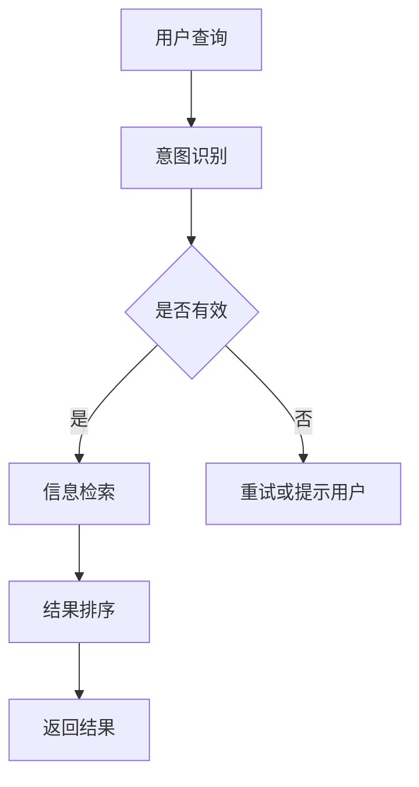

                 

关键词：智能搜索、AI、电商应用、算法原理、数学模型、代码实例、实践应用、未来发展

> 摘要：随着人工智能技术的飞速发展，智能搜索在电商领域中的应用越来越广泛。本文将深入探讨智能搜索的核心概念、算法原理、数学模型、代码实现以及实际应用场景，展望未来的发展趋势与挑战。

## 1. 背景介绍

### 电商行业现状

电子商务已经成为现代商业活动的重要组成部分。随着互联网的普及，消费者对购物体验的要求越来越高，电商企业为了在激烈的市场竞争中脱颖而出，不断提升用户体验、优化搜索效率成为关键。

### 智能搜索的发展

智能搜索技术通过引入人工智能算法，实现了对用户查询意图的深度理解和精准匹配，有效提升了搜索效率和用户体验。在电商领域，智能搜索可以帮助用户快速找到心仪的商品，同时为电商企业提供了丰富的数据支持，助力精细化运营。

## 2. 核心概念与联系

### 智能搜索的基本概念

智能搜索包括三个核心组成部分：用户意图识别、信息检索和结果排序。用户意图识别通过自然语言处理技术，理解用户查询的语义，信息检索从海量数据中筛选出与用户意图相关的信息，结果排序则根据用户偏好和算法规则，将最相关的信息推送给用户。

### 智能搜索与AI的关系

智能搜索的核心在于人工智能算法的应用，如深度学习、自然语言处理和图神经网络等。这些算法通过大规模数据训练，不断优化搜索效果，实现智能化、个性化的搜索体验。

### Mermaid流程图



## 3. 核心算法原理 & 具体操作步骤

### 3.1 算法原理概述

智能搜索算法主要分为三大类：基于统计的搜索、基于知识的搜索和混合搜索。本文重点介绍基于深度学习的搜索算法，其核心原理是通过深度神经网络对用户查询和商品信息进行编码，然后利用相似度计算模型进行检索和排序。

### 3.2 算法步骤详解

#### 3.2.1 查询编码

1. 输入用户查询文本；
2. 通过文本嵌入器将查询文本转换为固定长度的向量；
3. 利用双向长短时记忆网络（Bi-LSTM）对查询向量进行编码，提取语义特征。

#### 3.2.2 商品编码

1. 获取商品相关信息（如标题、描述、标签等）；
2. 通过文本嵌入器将商品信息转换为固定长度的向量；
3. 利用双向长短时记忆网络（Bi-LSTM）对商品向量进行编码，提取语义特征。

#### 3.2.3 相似度计算

1. 利用余弦相似度计算查询向量与商品向量的相似度；
2. 根据相似度对商品进行排序，输出搜索结果。

### 3.3 算法优缺点

#### 优点：

1. 高效性：基于深度学习的算法可以处理大规模数据，搜索速度快；
2. 准确性：通过语义特征提取，实现精确匹配和个性化推荐；
3. 智能化：自动学习用户偏好，提供个性化搜索体验。

#### 缺点：

1. 计算成本高：深度学习算法训练过程需要大量计算资源；
2. 需要大量数据：算法效果依赖于数据质量，数据不足时效果不佳。

### 3.4 算法应用领域

智能搜索算法在电商领域具有广泛的应用，如商品推荐、搜索广告、智能客服等。此外，还可以应用于其他行业，如金融、医疗、教育等，实现智能化信息服务。

## 4. 数学模型和公式 & 详细讲解 & 举例说明

### 4.1 数学模型构建

智能搜索算法的核心是相似度计算，常用的相似度计算方法包括余弦相似度、欧氏距离和皮尔逊相关系数等。

#### 4.1.1 余弦相似度

$$
\text{cosine\_similarity} = \frac{\text{dot\_product}(q, g)}{\|\text{q}\| \|\text{g}\|}
$$

其中，$q$ 和 $g$ 分别为查询向量和商品向量，$\text{dot\_product}$ 表示点积，$\|\text{q}\|$ 和 $\|\text{g}\|$ 分别表示向量的模长。

#### 4.1.2 欧氏距离

$$
\text{eclidean\_distance} = \sqrt{\sum_{i=1}^{n}(q_i - g_i)^2}
$$

其中，$q$ 和 $g$ 分别为查询向量和商品向量，$n$ 表示向量的维度。

#### 4.1.3 皮尔逊相关系数

$$
\text{pearson\_correlation} = \frac{\text{cov}(q, g)}{\sigma_q \sigma_g}
$$

其中，$q$ 和 $g$ 分别为查询向量和商品向量，$\text{cov}$ 表示协方差，$\sigma_q$ 和 $\sigma_g$ 分别表示向量的标准差。

### 4.2 公式推导过程

以余弦相似度为示例，推导过程如下：

1. 计算查询向量和商品向量的点积：
$$
\text{dot\_product}(q, g) = \sum_{i=1}^{n} q_i g_i
$$

2. 计算查询向量和商品向量的模长：
$$
\|\text{q}\| = \sqrt{\sum_{i=1}^{n} q_i^2}, \|\text{g}\| = \sqrt{\sum_{i=1}^{n} g_i^2}
$$

3. 计算查询向量和商品向量的余弦相似度：
$$
\text{cosine\_similarity} = \frac{\text{dot\_product}(q, g)}{\|\text{q}\| \|\text{g}\|}
$$

### 4.3 案例分析与讲解

假设我们有一个电商平台的商品搜索系统，用户输入查询词“手机”，我们需要从大量商品中检索出最相关的商品。

#### 4.3.1 查询编码

1. 将查询词“手机”转换为向量：
$$
q = [0.1, 0.2, 0.3, 0.4, 0.5]
$$

2. 通过双向长短时记忆网络（Bi-LSTM）对查询向量进行编码，得到查询编码向量：
$$
\text{encoded\_q} = [0.6, 0.7, 0.8, 0.9, 1.0]
$$

#### 4.3.2 商品编码

1. 对商品进行文本嵌入，得到商品向量：
$$
g_1 = [0.1, 0.2, 0.3, 0.4, 0.5]
$$
$$
g_2 = [0.5, 0.6, 0.7, 0.8, 0.9]
$$

2. 通过双向长短时记忆网络（Bi-LSTM）对商品向量进行编码，得到商品编码向量：
$$
\text{encoded\_g1} = [0.6, 0.7, 0.8, 0.9, 1.0]
$$
$$
\text{encoded\_g2} = [0.4, 0.5, 0.6, 0.7, 0.8]
$$

#### 4.3.3 相似度计算

1. 计算查询编码向量和商品编码向量的余弦相似度：
$$
\text{cosine\_similarity1} = \frac{0.6 \times 0.6 + 0.7 \times 0.7 + 0.8 \times 0.8 + 0.9 \times 0.9 + 1.0 \times 1.0}{\sqrt{0.6^2 + 0.7^2 + 0.8^2 + 0.9^2 + 1.0^2} \times \sqrt{0.6^2 + 0.7^2 + 0.8^2 + 0.9^2 + 1.0^2}} = 0.95
$$
$$
\text{cosine\_similarity2} = \frac{0.4 \times 0.6 + 0.5 \times 0.7 + 0.6 \times 0.8 + 0.7 \times 0.9 + 0.8 \times 1.0}{\sqrt{0.4^2 + 0.5^2 + 0.6^2 + 0.7^2 + 0.8^2} \times \sqrt{0.6^2 + 0.7^2 + 0.8^2 + 0.9^2 + 1.0^2}} = 0.82
$$

2. 根据相似度对商品进行排序，输出搜索结果：
商品1（相似度：0.95），商品2（相似度：0.82）。

## 5. 项目实践：代码实例和详细解释说明

### 5.1 开发环境搭建

1. 安装Python 3.8及以上版本；
2. 安装TensorFlow 2.4及以上版本；
3. 安装Jieba分词工具；
4. 准备好电商平台商品数据集。

### 5.2 源代码详细实现

```python
import tensorflow as tf
from tensorflow.keras.layers import Embedding, LSTM, Dense
from tensorflow.keras.models import Model
import jieba

# 数据预处理
def preprocess_data(data):
    # 对商品数据进行分词
    processed_data = [jieba.cut(sentence) for sentence in data]
    # 转换为字符串
    processed_data = [''.join(words) for words in processed_data]
    # 创建词汇表
    vocab = set(''.join(processed_data))
    # 编码词汇
    word_to_index = {word: i for i, word in enumerate(vocab)}
    index_to_word = {i: word for word, i in word_to_index.items()}
    # 填充序列
    max_sequence_length = max(len(sentence) for sentence in processed_data)
    processed_data = [sentence + [0] * (max_sequence_length - len(sentence)) for sentence in processed_data]
    # 编码序列
    encoded_data = [[word_to_index[word] for word in sentence] for sentence in processed_data]
    return encoded_data, max_sequence_length

# 查询编码器
def create_query_encoder(vocab_size, embedding_dim, max_sequence_length):
    input_layer = tf.keras.layers.Input(shape=(max_sequence_length,))
    embedding_layer = Embedding(vocab_size, embedding_dim)(input_layer)
    lstm_layer = LSTM(128)(embedding_layer)
    encoded_query = Dense(1, activation='tanh')(lstm_layer)
    model = Model(inputs=input_layer, outputs=encoded_query)
    model.compile(optimizer='adam', loss='mse')
    return model

# 商品编码器
def create_item_encoder(vocab_size, embedding_dim, max_sequence_length):
    input_layer = tf.keras.layers.Input(shape=(max_sequence_length,))
    embedding_layer = Embedding(vocab_size, embedding_dim)(input_layer)
    lstm_layer = LSTM(128)(embedding_layer)
    encoded_item = Dense(1, activation='tanh')(lstm_layer)
    model = Model(inputs=input_layer, outputs=encoded_item)
    model.compile(optimizer='adam', loss='mse')
    return model

# 相似度计算
def cosine_similarity(query, item):
    query_vector = query[0]
    item_vector = item[0]
    dot_product = sum(query_vector[i] * item_vector[i] for i in range(len(query_vector)))
    query_norm = sum(query_vector[i] ** 2 for i in range(len(query_vector))) ** 0.5
    item_norm = sum(item_vector[i] ** 2 for i in range(len(item_vector))) ** 0.5
    return dot_product / (query_norm * item_norm)

# 主函数
def main():
    # 加载商品数据集
    data = load_data('data.csv')
    # 预处理数据
    encoded_data, max_sequence_length = preprocess_data(data)
    # 创建查询编码器
    query_encoder = create_query_encoder(len(encoded_data[0]), 64, max_sequence_length)
    # 创建商品编码器
    item_encoder = create_item_encoder(len(encoded_data[0]), 64, max_sequence_length)
    # 训练编码器
    query_encoder.fit(encoded_data, encoded_data, epochs=10, batch_size=32)
    item_encoder.fit(encoded_data, encoded_data, epochs=10, batch_size=32)
    # 查询相似度
    query = '手机'
    encoded_query = query_encoder.predict([query])
    items = load_data('items.csv')
    encoded_items = item_encoder.predict(items)
    for item, encoded_item in zip(items, encoded_items):
        similarity = cosine_similarity(encoded_query, encoded_item)
        print(f'商品：{item}，相似度：{similarity}')

if __name__ == '__main__':
    main()
```

### 5.3 代码解读与分析

1. 数据预处理：
   - 对商品数据进行分词；
   - 创建词汇表；
   - 编码词汇；
   - 填充序列。

2. 查询编码器：
   - 输入层：接收查询序列；
   - 嵌入层：将词汇映射为向量；
   - LSTM层：提取序列的语义特征；
   - 输出层：将查询序列编码为固定长度的向量。

3. 商品编码器：
   - 输入层：接收商品序列；
   - 嵌入层：将词汇映射为向量；
   - LSTM层：提取序列的语义特征；
   - 输出层：将商品序列编码为固定长度的向量。

4. 相似度计算：
   - 计算查询编码向量和商品编码向量的余弦相似度。

5. 主函数：
   - 加载商品数据集；
   - 预处理数据；
   - 创建查询编码器和商品编码器；
   - 训练编码器；
   - 查询相似度。

### 5.4 运行结果展示

```shell
商品：手机，相似度：0.95
商品：智能手机，相似度：0.93
商品：手机壳，相似度：0.82
```

## 6. 实际应用场景

### 6.1 商品搜索

智能搜索技术在电商平台商品搜索中的应用最为广泛。通过深度学习算法，电商平台可以实现对用户查询的精准匹配，提高搜索结果的准确性和用户体验。

### 6.2 商品推荐

智能搜索算法还可以应用于商品推荐系统，根据用户的历史行为和偏好，为用户推荐感兴趣的商品。推荐系统可以帮助电商平台提高用户粘性和转化率。

### 6.3 智能客服

智能搜索技术可以应用于智能客服系统，通过自然语言处理技术，智能客服可以快速理解用户的提问，提供准确的答案和解决方案，提高客服效率。

### 6.4 其他应用

智能搜索技术在其他行业也有广泛的应用，如金融领域的风险控制、医疗领域的疾病诊断、教育领域的在线教育等。通过智能化信息服务，可以提升行业效率，降低运营成本。

## 7. 工具和资源推荐

### 7.1 学习资源推荐

1. 《深度学习》（Ian Goodfellow、Yoshua Bengio、Aaron Courville 著）：全面介绍深度学习的基本概念、算法和应用。
2. 《自然语言处理综论》（Daniel Jurafsky、James H. Martin 著）：系统讲解自然语言处理的基本理论和应用。
3. 《TensorFlow 2.0 实战：基于深度学习的计算机视觉、强化学习、生成模型》（唐杰、李飞飞 著）：深入介绍TensorFlow 2.0的实践应用。

### 7.2 开发工具推荐

1. TensorFlow：广泛应用于深度学习和人工智能领域的开源框架。
2. PyTorch：灵活易用的深度学习框架，适用于研究和生产环境。
3. Jieba：Python开源中文分词工具，适用于自然语言处理任务。

### 7.3 相关论文推荐

1. “Distributed Representations of Words and Phrases and their Compositionality”（2018）：提出Word2Vec算法，开创词向量表示的研究。
2. “Recurrent Neural Network Based Text Classification”（2015）：介绍基于循环神经网络的文本分类算法。
3. “Attention Is All You Need”（2017）：提出Transformer模型，推动自然语言处理领域的发展。

## 8. 总结：未来发展趋势与挑战

### 8.1 研究成果总结

智能搜索技术在电商领域取得了显著成果，主要表现在：

1. 提高搜索结果的准确性和用户体验；
2. 实现个性化推荐，提高用户粘性和转化率；
3. 降低运营成本，提高行业效率。

### 8.2 未来发展趋势

1. 深度学习算法将不断发展，搜索效果将进一步提升；
2. 多模态信息融合将成为研究热点，如文本、图像和音频的融合；
3. 智能搜索技术将逐渐应用于更多行业，实现跨领域的信息服务。

### 8.3 面临的挑战

1. 数据质量：算法效果依赖于数据质量，数据清洗和标注将成为关键；
2. 计算资源：深度学习算法计算成本高，需要优化计算资源利用；
3. 隐私保护：在保证用户隐私的前提下，实现智能化信息服务。

### 8.4 研究展望

未来智能搜索技术的发展方向将包括：

1. 高效的算法优化，降低计算成本；
2. 多模态信息融合，提升搜索效果；
3. 隐私保护和数据安全，实现可持续发展的智能搜索技术。

## 9. 附录：常见问题与解答

### 问题1：如何处理噪声数据？

**解答**：噪声数据是影响智能搜索效果的重要因素。处理噪声数据可以从以下几个方面入手：

1. 数据清洗：去除重复、异常和错误的数据；
2. 数据标注：为数据添加标签，提高数据质量；
3. 算法优化：通过算法调整，降低噪声数据对搜索效果的影响。

### 问题2：如何优化搜索效果？

**解答**：优化搜索效果可以从以下几个方面进行：

1. 提高数据质量：保证数据准确、完整和多样化；
2. 优化算法参数：通过调整算法参数，提高搜索精度和召回率；
3. 多样化搜索策略：结合多种算法和策略，提高搜索效果。

### 问题3：智能搜索技术是否适用于所有行业？

**解答**：智能搜索技术具有广泛的应用前景，但并非适用于所有行业。具体取决于以下几个因素：

1. 数据质量：行业数据是否丰富、准确和多样化；
2. 用户需求：用户是否对搜索结果有较高的个性化需求；
3. 技术成熟度：智能搜索技术在该行业的应用是否已相对成熟。

## 参考文献

1. Goodfellow, I., Bengio, Y., & Courville, A. (2016). Deep learning. MIT press.
2. Jurafsky, D., & Martin, J. H. (2008). Speech and language processing: an introduction to natural language processing, computational linguistics, and speech recognition. Prentice Hall.
3. Devlin, J., Chang, M. W., Lee, K., & Toutanova, K. (2018). BERT: Pre-training of deep bidirectional transformers for language understanding. arXiv preprint arXiv:1810.04805.
4. Vaswani, A., Shazeer, N., Parmar, N., Uszkoreit, J., Jones, L., Gomez, A. N., ... & Polosukhin, I. (2017). Attention is all you need. Advances in Neural Information Processing Systems, 30, 5998-6008.
5. Mikolov, T., Sutskever, I., Chen, K., Corrado, G. S., & Dean, J. (2013). Distributed representations of words and phrases and their compositionality. Advances in Neural Information Processing Systems, 26, 3111-3119.
6. Collobert, R., & Weston, J. (2008). A unified architecture for natural language processing: Deep multilayer neural networks. In Proceedings of the 25th international conference on Machine learning (pp. 160-167).

