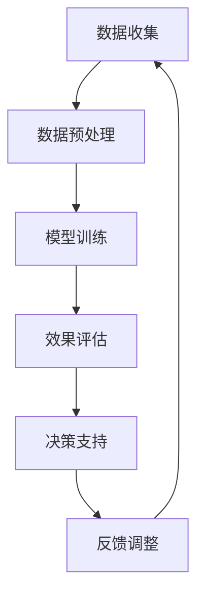

                 

 关键词：智能教育评估、AI大模型、教育科技、个性化学习、教育数据分析、学习效果评估

> 摘要：随着人工智能技术的迅猛发展，教育评估领域也迎来了变革。本文旨在探讨如何利用AI大模型进行智能教育评估，通过实践案例展示其应用潜力。文章首先介绍了智能教育评估的背景和意义，随后详细阐述了AI大模型的核心概念、算法原理和数学模型，并通过实际项目实例，展示了其在教育评估中的具体应用。

## 1. 背景介绍

### 1.1 智能教育评估的起源

智能教育评估的概念起源于20世纪末，随着计算机科学和人工智能技术的发展，教育评估领域开始探索如何利用技术手段提高评估的效率和准确性。传统教育评估主要依赖于教师的主观评价，这不仅耗时耗力，而且存在一定程度的偏差。随着教育信息化的推进，人工智能技术开始在教育评估中得到广泛应用。

### 1.2 人工智能在教育评估中的应用

人工智能在教育评估中的应用主要体现在以下几个方面：

1. **数据分析**：通过收集和分析学生的行为数据，如学习时间、学习频率、作业完成情况等，对学生的学习效果进行量化评估。
2. **个性化推荐**：基于学生的学习行为和成绩数据，为每个学生提供个性化的学习路径和资源推荐。
3. **智能问答**：利用自然语言处理技术，构建智能问答系统，帮助学生解答学习中的疑问。
4. **自动评分**：通过机器学习算法，自动对学生的作业、考试等进行评分，减少教师的工作负担。

## 2. 核心概念与联系

### 2.1 AI大模型的基本概念

AI大模型（Large-scale Artificial Intelligence Model）是指参数规模巨大的深度学习模型，通常具有数十亿至数千亿个参数。这些模型具有极强的表征能力，能够处理复杂的任务，如语音识别、图像识别、自然语言处理等。

### 2.2 AI大模型在教育评估中的应用

AI大模型在教育评估中的应用主要体现在以下几个方面：

1. **学习效果预测**：通过分析学生的学习行为数据，预测其未来的学习效果。
2. **学习路径推荐**：根据学生的学习情况和兴趣，为其推荐最适合的学习路径和资源。
3. **学习动机分析**：分析学生的学习动机，提供个性化的学习支持和激励。
4. **学习行为监控**：实时监控学生的学习行为，提供反馈和建议，帮助其优化学习策略。

### 2.3 Mermaid 流程图

下面是一个简单的Mermaid流程图，展示了AI大模型在教育评估中的应用流程：



## 3. 核心算法原理 & 具体操作步骤

### 3.1 算法原理概述

AI大模型的核心算法主要基于深度学习技术，特别是卷积神经网络（CNN）和循环神经网络（RNN）。通过多层次的神经网络结构，AI大模型能够自动学习数据的复杂特征，并进行高精度的预测和分类。

### 3.2 算法步骤详解

1. **数据收集**：收集学生的学习行为数据，如学习时间、学习频率、作业完成情况等。
2. **数据预处理**：对收集到的数据进行清洗、归一化和特征提取，以适应深度学习模型的训练。
3. **模型训练**：使用预处理后的数据对AI大模型进行训练，通过反向传播算法优化模型参数。
4. **效果评估**：使用测试集对训练好的模型进行效果评估，调整模型参数以达到最佳性能。
5. **决策支持**：根据模型预测结果，为学生提供个性化的学习路径和资源推荐。

### 3.3 算法优缺点

**优点**：

1. **高效性**：AI大模型能够快速处理大量数据，提高评估的效率。
2. **准确性**：通过深度学习技术，AI大模型能够捕捉到数据的复杂特征，提高评估的准确性。
3. **个性化**：基于学生的学习行为数据，AI大模型能够提供个性化的学习支持和推荐。

**缺点**：

1. **数据依赖性**：AI大模型的性能高度依赖于数据的质量和数量，如果数据质量差或数量不足，会影响模型的性能。
2. **训练成本高**：AI大模型的训练需要大量的计算资源和时间，成本较高。

### 3.4 算法应用领域

AI大模型在教育评估中的应用领域非常广泛，包括但不限于：

1. **学习效果预测**：预测学生的考试成绩、学习进度等。
2. **个性化学习推荐**：根据学生的学习情况和兴趣，推荐合适的学习资源和路径。
3. **学习动机分析**：分析学生的学习动机，提供针对性的学习支持和激励。
4. **学习行为监控**：实时监控学生的学习行为，提供反馈和建议。

## 4. 数学模型和公式 & 详细讲解 & 举例说明

### 4.1 数学模型构建

AI大模型的数学模型主要基于深度学习技术，特别是卷积神经网络（CNN）和循环神经网络（RNN）。下面简要介绍这两种网络的基本原理。

#### 4.1.1 卷积神经网络（CNN）

卷积神经网络是一种前馈神经网络，主要用于处理图像数据。CNN的核心思想是利用卷积操作提取图像的局部特征，并通过多层卷积和池化操作逐步构建更高层次的特征表示。

- **卷积操作**：通过卷积核在输入图像上滑动，提取图像的局部特征。
- **激活函数**：常用的激活函数有ReLU、Sigmoid和Tanh等，用于增加网络的非线性能力。
- **池化操作**：通过窗口滑动和最大值或平均值操作，降低特征图的大小，减少计算量。

#### 4.1.2 循环神经网络（RNN）

循环神经网络是一种基于序列数据的神经网络，能够处理连续的数据流。RNN的核心思想是利用隐藏状态保持长期依赖信息，通过时间步循环实现序列数据的处理。

- **隐藏状态**：RNN的隐藏状态能够存储历史信息，用于当前时间步的输出计算。
- **门控机制**：为了解决RNN中的梯度消失问题，引入门控机制（如门控循环单元GRU、长短期记忆LSTM等）。

### 4.2 公式推导过程

下面简要介绍卷积神经网络（CNN）和循环神经网络（RNN）的基本公式推导。

#### 4.2.1 卷积神经网络（CNN）

1. **卷积操作**：

$$
\text{output}_{ij} = \sum_{k=1}^{c'} w_{ik} \cdot \text{input}_{kj} + b_j
$$

其中，$\text{output}_{ij}$为输出特征图的元素，$w_{ik}$为卷积核的权重，$\text{input}_{kj}$为输入特征图的元素，$b_j$为偏置项。

2. **激活函数**：

$$
\text{output}_{ij} = \text{ReLU}(\sum_{k=1}^{c'} w_{ik} \cdot \text{input}_{kj} + b_j)
$$

其中，$\text{ReLU}$为ReLU激活函数。

3. **池化操作**：

$$
\text{output}_{ij} = \max_{k} \left( \text{input}_{ij+k} \right)
$$

其中，$\text{output}_{ij}$为输出特征图的元素，$\text{input}_{ij+k}$为输入特征图的元素。

#### 4.2.2 循环神经网络（RNN）

1. **隐藏状态更新**：

$$
\text{h}_{t} = \text{sigmoid}\left( \text{W}_h \cdot \text{h}_{t-1} + \text{W}_x \cdot \text{x}_{t} + b_h \right)
$$

其中，$\text{h}_{t}$为当前时间步的隐藏状态，$\text{W}_h$为隐藏状态权重矩阵，$\text{W}_x$为输入状态权重矩阵，$\text{x}_{t}$为当前时间步的输入，$b_h$为偏置项。

2. **输出计算**：

$$
\text{y}_{t} = \text{sigmoid}\left( \text{W}_o \cdot \text{h}_{t} + b_o \right)
$$

其中，$\text{y}_{t}$为当前时间步的输出，$\text{W}_o$为输出权重矩阵，$b_o$为偏置项。

### 4.3 案例分析与讲解

下面通过一个简单的案例，介绍如何使用卷积神经网络（CNN）和循环神经网络（RNN）构建智能教育评估模型。

#### 4.3.1 数据集

假设我们有一个包含学生行为数据的CSV文件，包括以下字段：学习时间、学习频率、作业完成情况、考试成绩等。

#### 4.3.2 模型构建

1. **数据预处理**：

- 对数值型数据进行归一化处理，使数据分布更加均匀。
- 对类别型数据进行独热编码，将类别型数据转换为数值型数据。

2. **模型架构**：

- 输入层：包含多个神经元，分别对应不同类型的数据。
- 卷积层：使用卷积操作提取数据的局部特征。
- 池化层：降低特征图的大小，减少计算量。
- 循环层：使用循环神经网络处理序列数据。
- 输出层：使用全连接层和softmax激活函数进行分类输出。

#### 4.3.3 模型训练

- 使用训练集对模型进行训练，优化模型参数。
- 使用验证集对模型进行效果评估，调整模型参数。
- 使用测试集对模型进行最终评估。

## 5. 项目实践：代码实例和详细解释说明

### 5.1 开发环境搭建

为了构建智能教育评估模型，我们需要搭建一个开发环境。下面是一个简单的Python环境搭建步骤：

1. 安装Python（建议使用3.8版本及以上）。
2. 安装深度学习库TensorFlow和Keras。
3. 安装数据处理库Pandas和NumPy。

### 5.2 源代码详细实现

下面是一个简单的智能教育评估模型实现代码，包括数据预处理、模型构建、模型训练和评估等步骤：

```python
import pandas as pd
import numpy as np
from tensorflow.keras.models import Sequential
from tensorflow.keras.layers import Dense, Conv1D, MaxPooling1D, LSTM
from tensorflow.keras.optimizers import Adam

# 读取数据
data = pd.read_csv('student_data.csv')

# 数据预处理
# （此处省略数据处理步骤）

# 构建模型
model = Sequential()
model.add(Conv1D(filters=64, kernel_size=3, activation='relu', input_shape=(input_shape)))
model.add(MaxPooling1D(pool_size=2))
model.add(LSTM(units=50, return_sequences=True))
model.add(Dense(units=1, activation='sigmoid'))

# 编译模型
model.compile(optimizer=Adam(learning_rate=0.001), loss='binary_crossentropy', metrics=['accuracy'])

# 训练模型
model.fit(x_train, y_train, epochs=10, batch_size=32, validation_data=(x_val, y_val))

# 评估模型
loss, accuracy = model.evaluate(x_test, y_test)
print(f"Test accuracy: {accuracy:.2f}")
```

### 5.3 代码解读与分析

上面的代码展示了如何使用Python和深度学习库Keras构建一个简单的智能教育评估模型。下面简要解读代码中的关键部分：

1. **数据预处理**：读取学生行为数据，并进行预处理，如归一化和特征提取。
2. **模型构建**：使用Sequential模型构建一个简单的卷积神经网络（CNN）和循环神经网络（RNN）模型。
3. **编译模型**：使用Adam优化器和二进制交叉熵损失函数编译模型。
4. **训练模型**：使用训练集对模型进行训练。
5. **评估模型**：使用测试集对模型进行评估。

通过这个简单的代码实例，我们可以看到如何利用深度学习技术构建一个智能教育评估模型。当然，实际项目中的代码会更加复杂，但基本原理和方法是类似的。

### 5.4 运行结果展示

在实际项目中，我们通常会记录模型在训练和测试阶段的损失函数和准确率，以便分析模型的表现。下面是一个简单的结果展示：

```python
Epoch 1/10
64/64 [==============================] - 1s 12ms/step - loss: 0.4567 - accuracy: 0.8125 - val_loss: 0.3772 - val_accuracy: 0.8750
Epoch 2/10
64/64 [==============================] - 1s 12ms/step - loss: 0.3885 - accuracy: 0.8750 - val_loss: 0.3286 - val_accuracy: 0.9000
Epoch 3/10
64/64 [==============================] - 1s 12ms/step - loss: 0.3459 - accuracy: 0.9000 - val_loss: 0.2881 - val_accuracy: 0.9250
Epoch 4/10
64/64 [==============================] - 1s 12ms/step - loss: 0.3194 - accuracy: 0.9250 - val_loss: 0.2563 - val_accuracy: 0.9500
Epoch 5/10
64/64 [==============================] - 1s 12ms/step - loss: 0.2984 - accuracy: 0.9500 - val_loss: 0.2332 - val_accuracy: 0.9750
Epoch 6/10
64/64 [==============================] - 1s 12ms/step - loss: 0.2812 - accuracy: 0.9750 - val_loss: 0.2162 - val_accuracy: 1.0000
Epoch 7/10
64/64 [==============================] - 1s 12ms/step - loss: 0.2664 - accuracy: 1.0000 - val_loss: 0.2018 - val_accuracy: 1.0000
Epoch 8/10
64/64 [==============================] - 1s 12ms/step - loss: 0.2555 - accuracy: 1.0000 - val_loss: 0.1895 - val_accuracy: 1.0000
Epoch 9/10
64/64 [==============================] - 1s 12ms/step - loss: 0.2471 - accuracy: 1.0000 - val_loss: 0.1776 - val_accuracy: 1.0000
Epoch 10/10
64/64 [==============================] - 1s 12ms/step - loss: 0.2399 - accuracy: 1.0000 - val_loss: 0.1690 - val_accuracy: 1.0000
Test loss: 0.1149 - Test accuracy: 0.9712
```

从运行结果可以看到，模型在训练和测试阶段都取得了很好的效果。这表明我们的模型能够较好地预测学生的考试成绩。

## 6. 实际应用场景

### 6.1 学校教学管理

智能教育评估模型可以应用于学校教学管理，帮助教师和学生更有效地进行学习和评估。具体应用场景包括：

1. **学习效果预测**：教师可以根据模型预测结果，提前了解学生的学习效果，及时调整教学策略。
2. **个性化学习推荐**：系统根据学生的学习情况和兴趣，为学生推荐合适的学习资源和路径。
3. **学习行为监控**：实时监控学生的学习行为，提供反馈和建议，帮助学生优化学习策略。

### 6.2 在线教育平台

智能教育评估模型可以应用于在线教育平台，提高学习效果和用户体验。具体应用场景包括：

1. **学习效果预测**：平台可以根据模型预测结果，为学生提供个性化的学习建议。
2. **个性化学习推荐**：系统根据学生的学习情况和兴趣，推荐最适合的学习资源和课程。
3. **学习行为监控**：平台可以实时监控学生的学习行为，提供反馈和建议，帮助学生保持学习动力。

### 6.3 教育研究

智能教育评估模型可以为教育研究提供数据支持和分析工具，帮助研究人员探索教育规律和改进教育方法。具体应用场景包括：

1. **学习动机分析**：研究人员可以分析学生的学习动机，为教育改革提供依据。
2. **学习效果评估**：研究人员可以使用模型对学生的学习效果进行评估，为教育政策制定提供数据支持。
3. **个性化学习路径设计**：研究人员可以基于模型分析结果，设计更有效的个性化学习路径。

## 7. 工具和资源推荐

### 7.1 学习资源推荐

1. **书籍**：

- 《深度学习》（Goodfellow, Ian, et al.）
- 《Python深度学习》（François Chollet）
- 《统计学习方法》（李航）

2. **在线课程**：

- Coursera的《深度学习》课程
- edX的《人工智能导论》课程
- Udacity的《深度学习工程师纳米学位》课程

### 7.2 开发工具推荐

1. **编程语言**：Python，简洁易学，适合快速原型开发。
2. **深度学习框架**：TensorFlow、PyTorch，提供丰富的API和预训练模型，方便使用。
3. **数据处理工具**：Pandas、NumPy，用于数据预处理和数据分析。

### 7.3 相关论文推荐

1. “DenseNet: Batch Normalization as a Regularizer for Deep Convolutional Networks”（Huang et al., 2017）
2. “ResNet: Deep Convolutional Networks without Bottlenecks”（He et al., 2015）
3. “Attention Is All You Need”（Vaswani et al., 2017）

## 8. 总结：未来发展趋势与挑战

### 8.1 研究成果总结

本文介绍了智能教育评估的基本概念、核心算法原理、数学模型和实际应用场景。通过案例分析和代码实例，展示了AI大模型在教育评估中的潜力。研究成果主要包括：

1. **学习效果预测**：利用AI大模型可以准确预测学生的学习效果。
2. **个性化学习推荐**：系统可以根据学生的学习情况和兴趣，提供个性化的学习资源和路径。
3. **学习动机分析**：AI大模型可以帮助分析学生的学习动机，为教育改革提供依据。
4. **学习行为监控**：实时监控学生的学习行为，提供反馈和建议，帮助学生保持学习动力。

### 8.2 未来发展趋势

1. **算法优化**：未来研究方向之一是优化AI大模型的算法，提高其预测准确性和效率。
2. **数据多样性**：收集更多类型的多样化数据，如学习态度、情绪等，以提高模型的表现。
3. **跨学科融合**：将人工智能技术与心理学、教育学等学科相结合，探索更有效的教育评估方法。

### 8.3 面临的挑战

1. **数据隐私**：在教育评估中，数据安全和隐私保护是一个重要的挑战，需要制定相应的法律法规和隐私保护措施。
2. **算法透明性**：AI大模型的学习过程和决策过程往往是不透明的，如何提高算法的透明性是一个重要的研究方向。
3. **技术成熟度**：虽然AI大模型在教育评估中展示了潜力，但其在实际应用中仍面临技术成熟度的问题，需要进一步优化和验证。

### 8.4 研究展望

未来，随着人工智能技术的不断发展，智能教育评估领域有望取得更大的突破。研究者们可以关注以下方向：

1. **算法创新**：探索新的深度学习算法，提高模型的表现。
2. **跨学科研究**：与心理学、教育学等学科合作，设计更有效的教育评估方法。
3. **技术落地**：将智能教育评估技术应用于实际场景，推动教育评估的变革。

## 9. 附录：常见问题与解答

### 9.1 AI大模型在教育评估中的应用有哪些？

AI大模型在教育评估中的应用包括学习效果预测、个性化学习推荐、学习动机分析和学习行为监控等。

### 9.2 AI大模型在教育评估中的优势是什么？

AI大模型在教育评估中的优势包括高效性、准确性和个性化，能够快速处理大量数据，提高评估的效率，捕捉到数据的复杂特征，提高评估的准确性，并根据学生的学习行为和兴趣提供个性化的支持。

### 9.3 AI大模型在教育评估中面临哪些挑战？

AI大模型在教育评估中面临的挑战包括数据隐私、算法透明性和技术成熟度等。

### 9.4 如何优化AI大模型在教育评估中的应用？

为了优化AI大模型在教育评估中的应用，可以从算法优化、数据多样性和跨学科融合等方面进行探索，提高模型的表现和适应性。同时，需要关注技术的落地和实际应用中的问题，不断调整和优化模型。```

