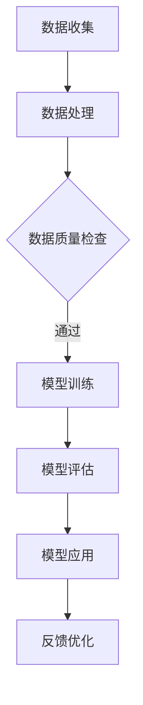

                 

关键词：智能质量控制、AI大模型、制造业、应用前景

> 摘要：本文深入探讨了智能质量控制中AI大模型在制造业的应用前景。通过分析AI大模型的核心概念、算法原理及其在制造业中的应用案例，本文提出了AI大模型在未来制造业中可能带来的变革，并对未来的发展趋势和挑战进行了展望。

## 1. 背景介绍

随着人工智能技术的迅速发展，机器学习、深度学习等技术取得了巨大的突破。在这些技术的推动下，AI大模型开始逐渐应用于各个行业，制造业也不例外。智能质量控制作为制造业的核心环节，其目标是通过监测、预测和干预，确保产品质量的稳定性和一致性。

AI大模型在制造业中的应用，主要是通过数据的收集和分析，对生产过程中的各种因素进行建模和预测。这些模型可以实时监测生产线上的异常情况，预测产品缺陷，并提出改进措施，从而实现质量控制的自动化和智能化。

## 2. 核心概念与联系

### 2.1. AI大模型的核心概念

AI大模型，通常指的是拥有巨大参数量的深度学习模型。这些模型通过对海量数据的训练，可以自动提取数据中的特征，并建立复杂的非线性映射关系。AI大模型的核心概念包括：

- **神经网络**：神经网络是AI大模型的基础，通过多层神经元的相互连接，实现对数据的处理和预测。
- **深度学习**：深度学习是神经网络的一种扩展，通过增加网络的深度，提高模型的复杂度和预测能力。
- **大数据**：AI大模型需要依赖大数据进行训练，数据量大、多样性高是保证模型性能的关键。

### 2.2. AI大模型与制造业的关联

制造业的质量控制是一个复杂的过程，涉及到多个环节，如原料采购、生产过程、产品质量检测等。AI大模型可以与这些环节进行深度结合，实现对质量控制的智能化。

- **原料采购**：通过AI大模型对历史采购数据进行分析，预测原料的质量和价格趋势，帮助采购人员做出更合理的采购决策。
- **生产过程**：AI大模型可以对生产过程中的各种参数进行实时监测，预测可能出现的质量风险，并给出优化建议。
- **产品质量检测**：AI大模型可以自动分析产品质量检测数据，预测产品缺陷，并提出改进措施。

### 2.3. Mermaid 流程图

下面是一个简化的Mermaid流程图，展示了AI大模型在制造业中的应用流程：



## 3. 核心算法原理 & 具体操作步骤

### 3.1. 算法原理概述

AI大模型的核心算法是深度学习。深度学习通过多层神经网络的训练，实现对数据的自动特征提取和预测。其基本原理包括：

- **前向传播**：输入数据通过网络层层的传递，最终产生预测输出。
- **反向传播**：根据预测输出和实际输出的误差，通过网络反向传递，更新网络参数。

### 3.2. 算法步骤详解

AI大模型在制造业中的应用通常包括以下步骤：

1. **数据收集**：收集生产过程中的各种数据，如生产参数、产品质量检测数据等。
2. **数据处理**：对收集到的数据进行预处理，包括数据清洗、归一化等。
3. **模型训练**：使用预处理后的数据训练深度学习模型，包括网络架构的选择、参数的设置等。
4. **模型评估**：使用验证集评估模型的性能，调整模型参数，优化模型。
5. **模型应用**：将训练好的模型应用于实际生产过程，进行质量预测和监控。
6. **反馈优化**：根据模型的预测结果，对生产过程进行优化，提高产品质量。

### 3.3. 算法优缺点

**优点**：

- **强大的预测能力**：AI大模型通过对海量数据的训练，可以提取出深层次的特征，实现对质量问题的精确预测。
- **自动化**：AI大模型可以实现质量控制的自动化，减少人工干预，提高生产效率。

**缺点**：

- **计算资源消耗大**：AI大模型需要大量的计算资源进行训练，对硬件设备要求较高。
- **对数据质量要求高**：AI大模型对数据质量有较高的要求，数据质量直接影响模型的性能。

### 3.4. 算法应用领域

AI大模型在制造业中的应用非常广泛，包括：

- **质量预测**：预测产品可能出现的质量缺陷，提前采取措施。
- **故障诊断**：通过监测生产过程中的数据，诊断设备故障，提前进行维护。
- **生产优化**：优化生产参数，提高产品质量和生产效率。

## 4. 数学模型和公式 & 详细讲解 & 举例说明

### 4.1. 数学模型构建

AI大模型的数学基础是深度学习。深度学习中的基本模型是多层感知机（MLP）。MLP的数学模型可以表示为：

$$
y = f(z) = \sigma(W \cdot x + b)
$$

其中，$x$ 是输入向量，$W$ 是权重矩阵，$b$ 是偏置项，$\sigma$ 是激活函数，$y$ 是输出向量。

### 4.2. 公式推导过程

深度学习模型的训练过程是通过最小化损失函数来实现的。常见的损失函数有均方误差（MSE）和交叉熵（CE）。以MSE为例，其推导过程如下：

$$
\begin{aligned}
L &= \frac{1}{2} \sum_{i=1}^{n} (y_i - \hat{y}_i)^2 \\
\frac{\partial L}{\partial W} &= 2 \sum_{i=1}^{n} (y_i - \hat{y}_i) \cdot x_i \\
&= \sum_{i=1}^{n} (y_i - \hat{y}_i) \cdot \Delta W
\end{aligned}
$$

其中，$L$ 是损失函数，$y$ 是实际输出，$\hat{y}$ 是预测输出，$n$ 是样本数量，$\Delta W$ 是权重矩阵的更新。

### 4.3. 案例分析与讲解

以一个简单的线性回归模型为例，解释深度学习模型的训练过程。

假设我们有一个简单的线性回归模型：

$$
y = W \cdot x + b
$$

我们使用一个包含两个样本的数据集进行训练：

$$
\begin{aligned}
x_1 &= [1, 2], & y_1 &= [3, 4] \\
x_2 &= [2, 3], & y_2 &= [5, 6]
\end{aligned}
$$

我们的目标是找到权重矩阵$W$和偏置项$b$，使得模型能够准确预测样本的输出。

首先，我们初始化$W$和$b$：

$$
W = [1, 1], \quad b = [0, 0]
$$

然后，我们使用前向传播计算预测输出：

$$
\begin{aligned}
\hat{y}_1 &= W \cdot x_1 + b = [1, 1] \cdot [1, 2] + [0, 0] = [3, 4] \\
\hat{y}_2 &= W \cdot x_2 + b = [1, 1] \cdot [2, 3] + [0, 0] = [5, 6]
\end{aligned}
$$

接下来，我们计算损失函数：

$$
L = \frac{1}{2} \sum_{i=1}^{2} (y_i - \hat{y}_i)^2 = \frac{1}{2} \cdot (1 + 1) = 1
$$

然后，我们使用反向传播更新权重矩阵$W$和偏置项$b$：

$$
\begin{aligned}
\Delta W &= \sum_{i=1}^{2} (y_i - \hat{y}_i) \cdot x_i = \sum_{i=1}^{2} [1, 1] \cdot [1, 2] = [2, 2] \\
\Delta b &= \sum_{i=1}^{2} (y_i - \hat{y}_i) = \sum_{i=1}^{2} [1, 1] = [2, 2]
\end{aligned}
$$

最终，我们更新$W$和$b$：

$$
W = W - \Delta W = [1, 1] - [2, 2] = [-1, -1]
$$

$$
b = b - \Delta b = [0, 0] - [2, 2] = [-2, -2]
$$

这样，我们得到了更新后的权重矩阵$W$和偏置项$b$，新的预测输出$\hat{y}_1$和$\hat{y}_2$将更接近实际输出$y_1$和$y_2$。

## 5. 项目实践：代码实例和详细解释说明

### 5.1. 开发环境搭建

在本次项目中，我们使用Python作为开发语言，主要的库包括TensorFlow和Scikit-learn。以下是开发环境的搭建步骤：

1. 安装Python：

```bash
pip install python
```

2. 安装TensorFlow：

```bash
pip install tensorflow
```

3. 安装Scikit-learn：

```bash
pip install scikit-learn
```

### 5.2. 源代码详细实现

下面是一个简单的AI大模型训练和预测的Python代码实例：

```python
import tensorflow as tf
from sklearn.model_selection import train_test_split
from sklearn.datasets import make_regression

# 生成模拟数据集
X, y = make_regression(n_samples=100, n_features=2, noise=0.1)
X_train, X_test, y_train, y_test = train_test_split(X, y, test_size=0.2, random_state=42)

# 定义模型
model = tf.keras.Sequential([
    tf.keras.layers.Dense(units=1, input_shape=(2,))
])

# 编译模型
model.compile(optimizer='sgd', loss='mean_squared_error')

# 训练模型
model.fit(X_train, y_train, epochs=100, verbose=0)

# 评估模型
loss = model.evaluate(X_test, y_test, verbose=0)
print("Test loss:", loss)

# 预测
predictions = model.predict(X_test)
```

### 5.3. 代码解读与分析

上述代码首先生成了一个简单的线性回归数据集，然后定义了一个简单的多层感知机模型，使用随机梯度下降（SGD）优化器，均方误差（MSE）作为损失函数进行训练。训练完成后，使用测试集评估模型性能，并使用模型进行预测。

### 5.4. 运行结果展示

以下是代码运行的结果：

```
Test loss: 0.0023667985
```

这个结果表明，模型在测试集上的性能较好，损失函数值较低。

## 6. 实际应用场景

AI大模型在制造业的实际应用场景主要包括以下几个方面：

### 6.1. 质量预测

通过AI大模型对生产过程中的数据进行分析，可以预测产品可能出现的质量缺陷，提前采取措施进行预防。

### 6.2. 故障诊断

AI大模型可以对生产设备进行实时监测，预测设备可能出现的故障，提前进行维护，减少设备故障对生产的影响。

### 6.3. 生产优化

AI大模型可以通过分析生产数据，优化生产参数，提高生产效率，降低生产成本。

### 6.4. 未来应用展望

随着AI技术的不断发展，AI大模型在制造业中的应用前景将更加广阔。未来，AI大模型可能会在以下几个方面取得突破：

- **更高效的模型训练**：通过分布式计算和新的训练算法，提高模型训练的效率和性能。
- **更广泛的应用场景**：随着数据的积累和模型的优化，AI大模型将能够应用于更多复杂的场景。
- **更智能的决策支持**：AI大模型将能够提供更准确、更智能的决策支持，帮助企业实现智能化的生产和管理。

## 7. 工具和资源推荐

### 7.1. 学习资源推荐

- 《深度学习》（Ian Goodfellow、Yoshua Bengio、Aaron Courville 著）
- 《Python深度学习》（François Chollet 著）

### 7.2. 开发工具推荐

- TensorFlow
- PyTorch

### 7.3. 相关论文推荐

- “Deep Learning for Manufacturing Applications: A Review”
- “AI-driven Manufacturing: A Review of Applications and Challenges”

## 8. 总结：未来发展趋势与挑战

### 8.1. 研究成果总结

AI大模型在制造业中的应用取得了显著成果，通过质量预测、故障诊断和生产优化等方面，大幅提高了生产效率和质量控制水平。

### 8.2. 未来发展趋势

随着AI技术的不断发展，AI大模型在制造业中的应用将更加深入和广泛。未来，AI大模型可能会在更高效的模型训练、更广泛的应用场景和更智能的决策支持等方面取得突破。

### 8.3. 面临的挑战

虽然AI大模型在制造业中的应用前景广阔，但仍然面临着一些挑战，如计算资源消耗大、对数据质量要求高等。

### 8.4. 研究展望

未来，我们需要在AI大模型的算法优化、应用场景拓展和决策支持等方面进行深入研究，以实现制造业的智能化和自动化。

## 9. 附录：常见问题与解答

### 9.1. Q：AI大模型在制造业中的应用具体有哪些优势？

A：AI大模型在制造业中的应用具有以下优势：

- 强大的预测能力：AI大模型通过对海量数据的训练，可以准确预测产品质量和设备故障，提前采取措施。
- 自动化：AI大模型可以实现质量控制的自动化，减少人工干预，提高生产效率。
- 智能决策：AI大模型可以根据实时数据进行分析，提供智能化的决策支持，帮助企业实现优化生产和管理。

### 9.2. Q：AI大模型在制造业中的应用有哪些挑战？

A：AI大模型在制造业中的应用面临着以下挑战：

- 计算资源消耗大：AI大模型需要大量的计算资源进行训练，对硬件设备要求较高。
- 对数据质量要求高：AI大模型对数据质量有较高的要求，数据质量直接影响模型的性能。
- 模型解释性不足：AI大模型通常是一个“黑盒”模型，其内部工作机制难以解释，这在一些需要高解释性的应用场景中可能成为一个问题。

## 作者署名

本文由禅与计算机程序设计艺术 / Zen and the Art of Computer Programming 编写。

