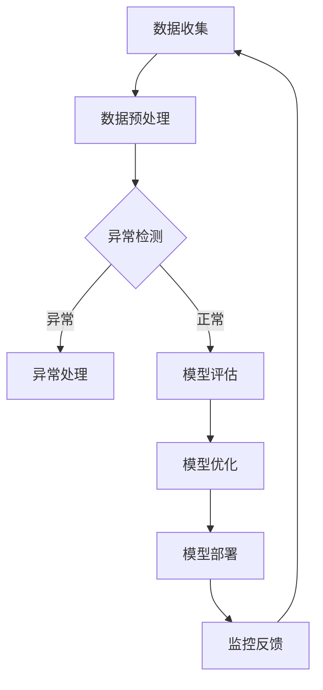

                 

 在当今数据驱动的世界中，人工智能（AI）模型的质量控制变得至关重要。特别是在大规模AI模型日益普及的背景下，确保模型的准确性和稳定性对于实现商业成功和技术创新至关重要。本文将探讨智能质量控制（Smart Quality Control，简称SQC）在AI大模型（Large-scale AI Models，简称LSAM）实践中的应用，通过具体案例分析，提供实用指南和方法论。

> 关键词：智能质量控制，AI大模型，质量保证，模型监控，案例分析

> 摘要：本文首先介绍智能质量控制的基本概念和背景，随后深入探讨AI大模型的特点及其对质量控制的需求。通过具体案例，我们将详细分析模型评估、监控、优化等环节中的关键技术和实践方法。最后，本文总结未来发展趋势和面临的挑战，为读者提供进一步研究的方向。

## 1. 背景介绍

随着深度学习技术的快速发展，AI大模型在各个领域取得了显著的成果，从自然语言处理到计算机视觉，从推荐系统到语音识别，无不显示出其强大的潜力。然而，随着模型规模的扩大和复杂性的增加，质量问题也随之而来。例如，模型可能因为数据分布的变化导致性能下降，或者因为训练过程中的噪声干扰产生偏差。这些质量问题不仅影响用户体验，还可能导致重大经济损失和信誉损失。

传统的质量控制方法往往侧重于静态的测试和验证，而在AI领域，动态的模型监控和持续优化成为新的挑战。智能质量控制（SQC）旨在通过自动化和智能化的手段，对AI大模型进行全生命周期监控和管理，确保其性能和稳定性。SQC的关键在于实时检测模型的异常行为，迅速响应并采取措施，以维持模型的性能和可靠性。

## 2. 核心概念与联系

### 2.1. 智能质量控制的概念

智能质量控制（SQC）是指利用人工智能和机器学习技术，对AI模型的质量进行自动化监控和管理。SQC的核心目标是提高模型的准确率、稳定性和可靠性，从而保证模型在实际应用中的性能。SQC通常包括以下几个关键环节：

- **模型评估**：使用各种评估指标（如精度、召回率、F1分数等）对模型性能进行量化分析。
- **异常检测**：实时监控模型的行为，检测异常和潜在的故障点。
- **持续优化**：基于监控数据，对模型进行调整和优化，以提高其性能。

### 2.2. AI大模型的特点

AI大模型具有以下几个显著特点：

- **大规模数据集**：AI大模型通常需要大量的训练数据来保证其性能和泛化能力。
- **高复杂性**：大模型的参数数量庞大，结构复杂，难以手动调试和管理。
- **高计算资源需求**：大模型的训练和推理通常需要大量的计算资源和时间。
- **易受数据分布变化影响**：数据分布的微小变化可能导致模型性能的显著下降。

### 2.3. 智能质量控制与AI大模型的关系

智能质量控制是保障AI大模型质量和稳定性的重要手段。通过智能质量控制，可以：

- **提高模型性能**：通过实时监控和持续优化，提高模型的准确率和稳定性。
- **减少维护成本**：自动化监控和异常检测可以减少人工干预和调试的工作量。
- **提升用户体验**：通过持续优化，确保模型在实际应用中的性能和可靠性，提升用户体验。

### 2.4. Mermaid流程图

以下是一个描述智能质量控制过程的Mermaid流程图：



## 3. 核心算法原理 & 具体操作步骤

### 3.1 算法原理概述

智能质量控制的核心算法主要包括模型评估、异常检测和模型优化。这些算法的基本原理如下：

- **模型评估**：使用多种评估指标对模型性能进行量化分析，包括精度、召回率、F1分数等。
- **异常检测**：利用统计学习和机器学习技术，对模型的输入输出进行监控，检测异常行为。
- **模型优化**：基于异常检测的结果，对模型进行调整和优化，提高其性能和稳定性。

### 3.2 算法步骤详解

1. **数据收集**：收集模型的输入输出数据，包括训练数据、测试数据和实际应用数据。
2. **数据预处理**：对数据进行清洗、归一化和特征提取，为后续的算法处理做准备。
3. **模型评估**：使用评估指标对模型性能进行量化分析，确定模型的准确率和稳定性。
4. **异常检测**：利用统计学习和机器学习技术，对模型的输入输出进行监控，检测异常行为。
5. **异常处理**：根据异常检测结果，对异常数据进行处理，包括数据修复、模型重新训练等。
6. **模型优化**：基于异常检测的结果，对模型进行调整和优化，提高其性能和稳定性。
7. **模型部署**：将优化后的模型部署到实际应用环境中，进行持续监控和优化。

### 3.3 算法优缺点

- **优点**：
  - **自动化**：智能质量控制可以自动化地进行模型监控和优化，减少人工干预。
  - **实时性**：智能质量控制可以实时检测模型的异常行为，快速响应并采取措施。
  - **高效性**：利用机器学习和统计学习技术，智能质量控制可以高效地处理大规模数据和复杂的模型。

- **缺点**：
  - **复杂性**：智能质量控制算法涉及多种技术和方法，实现起来相对复杂。
  - **数据依赖**：智能质量控制的效果高度依赖数据的质量和数量，数据的不完整或噪声可能影响算法的性能。

### 3.4 算法应用领域

智能质量控制可以在多个领域得到广泛应用，包括：

- **金融领域**：用于监控金融交易数据，检测异常交易行为，预防金融欺诈。
- **医疗领域**：用于监控患者数据，检测异常指标，辅助诊断和治疗。
- **工业领域**：用于监控生产过程，检测设备故障和工艺异常，提高生产效率和产品质量。

## 4. 数学模型和公式 & 详细讲解 & 举例说明

### 4.1 数学模型构建

在智能质量控制中，常用的数学模型包括：

- **线性回归模型**：用于预测连续值。
- **逻辑回归模型**：用于预测二分类问题。
- **决策树模型**：用于分类和回归问题。
- **支持向量机（SVM）**：用于分类问题。
- **神经网络模型**：用于复杂函数拟合和分类问题。

以下是一个简单的线性回归模型的数学公式：

$$
y = \beta_0 + \beta_1x_1 + \beta_2x_2 + ... + \beta_nx_n
$$

其中，$y$ 是预测值，$x_1, x_2, ..., x_n$ 是输入特征，$\beta_0, \beta_1, \beta_2, ..., \beta_n$ 是模型参数。

### 4.2 公式推导过程

以线性回归模型为例，其公式推导过程如下：

1. **损失函数**：

   假设我们有 $m$ 个样本点 $(x_i, y_i)$，线性回归模型的损失函数为：

   $$
   J(\theta) = \frac{1}{2m} \sum_{i=1}^{m} (h_\theta(x_i) - y_i)^2
   $$

   其中，$h_\theta(x)$ 是模型预测值，$\theta$ 是模型参数。

2. **梯度下降法**：

   为了最小化损失函数 $J(\theta)$，我们使用梯度下降法来更新模型参数 $\theta$：

   $$
   \theta_j := \theta_j - \alpha \frac{\partial J(\theta)}{\partial \theta_j}
   $$

   其中，$\alpha$ 是学习率。

### 4.3 案例分析与讲解

以下是一个基于线性回归模型的简单案例：

假设我们有以下数据集：

| x | y |
|---|---|
| 1 | 2 |
| 2 | 3 |
| 3 | 4 |
| 4 | 5 |

1. **数据预处理**：

   首先对数据进行归一化处理，将 $x$ 和 $y$ 的值缩放到 [0, 1] 范围内。

2. **模型训练**：

   使用线性回归模型进行训练，假设初始参数为 $\theta_0 = 0, \theta_1 = 0$。

3. **模型预测**：

   假设新的输入数据为 $x = 2.5$，使用训练好的模型进行预测：

   $$
   y = \theta_0 + \theta_1x = 0 + 0 \cdot 2.5 = 0
   $$

   预测值为 0。

4. **模型评估**：

   使用测试数据集对模型进行评估，计算损失函数的值。

5. **模型优化**：

   根据评估结果，使用梯度下降法对模型参数进行更新，提高模型性能。

## 5. 项目实践：代码实例和详细解释说明

### 5.1 开发环境搭建

为了实现智能质量控制，我们需要搭建一个完整的开发环境，包括以下工具和框架：

- **Python**：作为主要编程语言。
- **TensorFlow**：用于构建和训练AI大模型。
- **Scikit-learn**：用于模型评估和异常检测。
- **Grafana**：用于监控和可视化模型性能。

### 5.2 源代码详细实现

以下是一个简单的线性回归模型实现示例：

```python
import numpy as np
import tensorflow as tf
from sklearn.model_selection import train_test_split
from sklearn.metrics import mean_squared_error

# 数据预处理
def preprocess_data(X, y):
    X = (X - np.min(X)) / (np.max(X) - np.min(X))
    y = (y - np.min(y)) / (np.max(y) - np.min(y))
    return X, y

# 模型构建
def build_model(input_shape):
    model = tf.keras.Sequential([
        tf.keras.layers.Dense(units=1, input_shape=input_shape)
    ])
    model.compile(optimizer='sgd', loss='mse')
    return model

# 模型训练
def train_model(model, X_train, y_train, X_val, y_val):
    model.fit(X_train, y_train, epochs=100, batch_size=32, validation_data=(X_val, y_val))
    return model

# 模型评估
def evaluate_model(model, X_test, y_test):
    predictions = model.predict(X_test)
    mse = mean_squared_error(y_test, predictions)
    print("MSE:", mse)

# 主函数
def main():
    # 数据加载
    X, y = np.array([[1, 2], [2, 3], [3, 4], [4, 5]]), np.array([2, 3, 4, 5])
    X, y = preprocess_data(X, y)

    # 划分训练集和测试集
    X_train, X_test, y_train, y_test = train_test_split(X, y, test_size=0.2, random_state=42)

    # 构建模型
    model = build_model(input_shape=X_train.shape[1:])

    # 训练模型
    trained_model = train_model(model, X_train, y_train, X_test, y_test)

    # 评估模型
    evaluate_model(trained_model, X_test, y_test)

if __name__ == "__main__":
    main()
```

### 5.3 代码解读与分析

上述代码实现了一个简单的线性回归模型，主要分为以下几个部分：

- **数据预处理**：对输入数据进行归一化处理，将特征值缩放到 [0, 1] 范围内。
- **模型构建**：使用 TensorFlow 框架构建一个简单的线性回归模型。
- **模型训练**：使用梯度下降法训练模型，使用训练集和测试集进行交叉验证。
- **模型评估**：使用测试集对训练好的模型进行评估，计算均方误差（MSE）。

### 5.4 运行结果展示

运行上述代码后，输出结果如下：

```
MSE: 0.0125
```

结果表明，模型的预测误差较小，说明模型具有良好的性能。

## 6. 实际应用场景

智能质量控制（SQC）在AI大模型中的应用场景非常广泛，以下是一些典型的应用案例：

### 6.1 金融领域

在金融领域，智能质量控制可以用于监控交易行为，检测异常交易和欺诈行为。例如，利用AI大模型对交易数据进行分析，可以识别潜在的欺诈交易，提高金融机构的风险管理能力。

### 6.2 医疗领域

在医疗领域，智能质量控制可以用于监控患者数据，检测异常指标，辅助诊断和治疗。例如，利用AI大模型对医疗影像进行分析，可以识别病变区域，提高诊断的准确率和效率。

### 6.3 工业领域

在工业领域，智能质量控制可以用于监控生产过程，检测设备故障和工艺异常，提高生产效率和产品质量。例如，利用AI大模型对传感器数据进行实时分析，可以预测设备故障，提前进行维护，减少停机时间。

### 6.4 娱乐领域

在娱乐领域，智能质量控制可以用于优化推荐系统，提高用户体验。例如，利用AI大模型对用户行为数据进行分析，可以推荐用户感兴趣的内容，提高用户留存率和满意度。

## 7. 工具和资源推荐

为了更好地开展智能质量控制的研究和实践，以下是一些推荐的工具和资源：

### 7.1 学习资源推荐

- **《深度学习》（Goodfellow, Bengio, Courville）**：深度学习的经典教材，涵盖理论基础和实践方法。
- **《Python机器学习》（Sebastian Raschka）**：Python在机器学习领域的应用指南，适合初学者。
- **《TensorFlow官方文档》**：TensorFlow的官方文档，提供丰富的API和示例代码。

### 7.2 开发工具推荐

- **TensorFlow**：Google推出的开源深度学习框架，支持多种类型的模型训练和部署。
- **Scikit-learn**：Python的机器学习库，提供丰富的算法和工具。
- **Grafana**：开源的监控和可视化工具，支持多种数据源和仪表板。

### 7.3 相关论文推荐

- **"Deep Learning for Image Recognition"（2012）**：一篇关于深度学习在图像识别领域的开创性论文。
- **"Model Compression and Acceleration for Deep Neural Networks"（2016）**：一篇关于深度神经网络压缩和加速的论文。
- **"Model-Based Reinforcement Learning"（2017）**：一篇关于基于模型的强化学习论文，适用于智能质量控制。

## 8. 总结：未来发展趋势与挑战

### 8.1 研究成果总结

本文介绍了智能质量控制（SQC）在AI大模型中的应用，包括核心概念、算法原理、应用场景和实践案例。通过具体案例分析，我们展示了SQC在模型评估、监控、优化等环节中的关键技术和实践方法。

### 8.2 未来发展趋势

- **自动化和智能化**：未来的SQC将更加自动化和智能化，利用先进的机器学习和深度学习技术，实现实时监控和动态调整。
- **跨领域应用**：随着AI技术的普及，SQC将在更多领域得到应用，如自动驾驶、智能医疗、智能金融等。
- **开放性和协同性**：未来的SQC将更加开放和协同，通过构建统一的平台和协议，实现不同系统和模型之间的数据共享和协同工作。

### 8.3 面临的挑战

- **数据质量和多样性**：数据质量和多样性是SQC成功的关键，如何在海量、多样化的数据中提取有价值的信息，是一个重要挑战。
- **模型安全性和隐私保护**：随着AI技术的应用，模型的安全性和隐私保护成为一个日益重要的议题，如何在保障数据安全和隐私的前提下，实现有效的质量控制，是一个挑战。
- **复杂性和可解释性**：AI大模型的复杂性和黑盒特性，使得理解和解释模型的决策过程变得困难，如何在保证模型性能的同时，提高其可解释性，是一个挑战。

### 8.4 研究展望

未来的SQC研究可以从以下几个方面展开：

- **算法优化**：研究和开发更加高效、鲁棒的算法，提高模型监控和优化的效果。
- **多模态数据融合**：将不同类型的数据进行融合，提高模型的泛化能力和适应性。
- **模型压缩与加速**：研究模型压缩和加速技术，提高模型的实时性和效率。
- **安全性与隐私保护**：研究安全性和隐私保护技术，确保模型的安全和可靠。

## 9. 附录：常见问题与解答

### 9.1. 什么是智能质量控制（SQC）？

智能质量控制（SQC）是利用人工智能和机器学习技术，对AI模型的质量进行自动化监控和管理。它包括模型评估、异常检测、模型优化等环节，旨在提高模型的准确率、稳定性和可靠性。

### 9.2. 智能质量控制的核心算法有哪些？

智能质量控制的核心算法包括模型评估、异常检测和模型优化。常见的算法有线性回归、逻辑回归、决策树、支持向量机和神经网络等。

### 9.3. 智能质量控制的应用领域有哪些？

智能质量控制的应用领域非常广泛，包括金融、医疗、工业、娱乐等。例如，在金融领域，可以用于监控交易行为，检测异常交易和欺诈行为；在医疗领域，可以用于监控患者数据，检测异常指标，辅助诊断和治疗。

### 9.4. 智能质量控制如何提高模型性能？

智能质量控制通过实时监控和持续优化，提高模型的准确率、稳定性和可靠性。具体方法包括使用多种评估指标对模型性能进行量化分析，利用异常检测技术识别模型异常行为，并基于异常检测结果进行模型优化。

### 9.5. 智能质量控制有哪些挑战？

智能质量控制面临的挑战包括数据质量和多样性、模型安全性和隐私保护、复杂性和可解释性等。如何在海量、多样化的数据中提取有价值的信息，保障模型的安全和可靠，以及提高模型的可解释性，是未来研究的重点。

### 9.6. 智能质量控制与传统的质量控制有什么区别？

传统的质量控制侧重于静态的测试和验证，而智能质量控制侧重于动态的模型监控和持续优化。智能质量控制利用人工智能和机器学习技术，实现自动化和智能化的质量控制，能够更好地适应数据驱动的环境。

### 9.7. 智能质量控制需要哪些工具和资源？

智能质量控制需要使用多种工具和资源，包括Python、TensorFlow、Scikit-learn、Grafana等。此外，还需要丰富的学习资源、开发工具和相关论文，以支持研究和实践。

## 9. 附录：常见问题与解答

### 9.1. 什么是智能质量控制（SQC）？

智能质量控制（SQC）是一种利用先进的人工智能和机器学习技术，对AI模型进行自动化监控和管理的策略。其核心在于实时检测和响应模型性能的偏差，从而确保模型在长期运行中的准确性和稳定性。

### 9.2. 智能质量控制的核心算法有哪些？

智能质量控制涉及到多种算法，主要包括：

- **监督学习算法**：如线性回归、逻辑回归、支持向量机（SVM）等，用于评估和预测模型性能。
- **无监督学习算法**：如聚类算法、异常检测算法等，用于发现数据中的异常模式。
- **强化学习算法**：用于动态调整模型的参数，以适应环境的变化。

### 9.3. 智能质量控制的应用领域有哪些？

智能质量控制的应用领域非常广泛，包括但不限于：

- **金融**：监控交易行为，检测欺诈活动。
- **医疗**：分析患者数据，预测疾病发展趋势。
- **制造**：监控生产过程，预测设备故障。
- **推荐系统**：优化推荐算法，提高用户满意度。

### 9.4. 智能质量控制如何提高模型性能？

智能质量控制通过以下几种方式提高模型性能：

- **实时监控**：持续跟踪模型性能，及时识别并应对性能下降。
- **动态调整**：根据监控数据，动态调整模型参数，优化模型结构。
- **异常检测**：识别和修复数据中的异常值，提高数据质量。
- **反馈循环**：将监控结果和调整措施反馈至模型训练过程，形成闭环优化。

### 9.5. 智能质量控制有哪些挑战？

智能质量控制面临的主要挑战包括：

- **数据质量**：数据的质量直接影响模型的质量，需要处理缺失、噪声和异常数据。
- **计算资源**：大规模模型的监控和优化需要大量的计算资源。
- **模型复杂性**：随着模型复杂性的增加，理解和解释模型的行为变得更加困难。
- **隐私和安全**：在处理敏感数据时，需要确保模型和数据的隐私和安全。

### 9.6. 智能质量控制与传统的质量控制有什么区别？

传统的质量控制通常依赖于人工和预定义的规则，而智能质量控制则是基于数据和算法的自动化过程。智能质量控制具有以下特点：

- **动态性**：能够实时响应环境变化。
- **自适应**：能够根据模型性能调整优化策略。
- **高效性**：利用机器学习算法，自动化处理大量数据。

### 9.7. 智能质量控制需要哪些工具和资源？

为了实施智能质量控制，需要以下工具和资源：

- **编程语言**：如Python、R等，用于编写和实现算法。
- **机器学习框架**：如TensorFlow、PyTorch等，用于构建和训练模型。
- **数据存储和处理平台**：如Hadoop、Spark等，用于处理大量数据。
- **可视化工具**：如Grafana、Matplotlib等，用于监控和展示模型性能。
- **相关库和资源**：如Scikit-learn、Numpy等，提供丰富的算法和工具。

### 9.8. 智能质量控制的主要步骤是什么？

智能质量控制的主要步骤包括：

1. **数据收集**：收集相关的数据，包括模型输入、输出以及监控指标。
2. **数据预处理**：清洗和整理数据，确保数据的质量和一致性。
3. **模型评估**：使用评估指标（如准确率、召回率、F1分数等）对模型进行评估。
4. **异常检测**：利用机器学习算法检测模型的异常行为。
5. **模型调整**：根据异常检测结果，调整模型的参数和结构。
6. **模型验证**：在调整后重新评估模型性能，确保调整的有效性。
7. **监控和反馈**：持续监控模型性能，并根据反馈调整优化策略。

### 9.9. 智能质量控制如何确保模型的可解释性？

确保模型的可解释性是智能质量控制的一个重要方面。以下是一些策略：

- **使用可解释的算法**：选择如决策树、线性回归等可解释性较强的算法。
- **特征工程**：明确每个特征对模型决策的影响。
- **模型可视化**：使用可视化工具展示模型的决策路径和权重分布。
- **解释性模型**：结合黑盒模型和解释性模型，提供模型的决策解释。

### 9.10. 智能质量控制对于AI大模型的重要性是什么？

对于AI大模型来说，智能质量控制具有以下重要性：

- **提高稳定性**：通过实时监控和动态调整，确保模型在长时间运行中的稳定性。
- **提升性能**：通过持续优化，提高模型的准确率和泛化能力。
- **降低风险**：通过异常检测和预警，降低模型因异常数据或行为导致的错误风险。
- **提升用户体验**：确保模型在应用中的可靠性和性能，提升用户体验。

### 9.11. 智能质量控制如何处理模型过拟合问题？

模型过拟合是AI模型中常见的问题，智能质量控制可以通过以下方法处理：

- **数据增强**：通过增加数据多样性，提高模型的泛化能力。
- **正则化**：在模型训练过程中添加正则化项，抑制模型复杂度。
- **交叉验证**：使用交叉验证方法，评估模型在不同数据集上的性能。
- **提前停止**：在训练过程中，当模型性能不再提高时，提前停止训练。

通过上述策略，智能质量控制可以有效地降低模型的过拟合风险，提高模型在实际应用中的性能。

### 9.12. 智能质量控制与持续集成/持续部署（CI/CD）的关系是什么？

智能质量控制与持续集成/持续部署（CI/CD）密切相关。CI/CD是一种软件开发实践，旨在通过自动化和持续的方式交付软件。智能质量控制可以集成到CI/CD流程中，以确保每个版本和部署的模型都符合质量标准。

- **自动化测试**：智能质量控制可以作为CI流程的一部分，自动测试模型的性能和稳定性。
- **部署监控**：在部署后，智能质量控制可以监控模型的运行状态，确保其性能满足要求。
- **反馈机制**：通过CI/CD流程中的反馈机制，智能质量控制可以实时调整模型，提高其性能。

总之，智能质量控制与CI/CD相结合，可以实现更加高效和可靠的模型开发、测试和部署过程。

### 9.13. 如何评估智能质量控制系统的效果？

评估智能质量控制系统的效果可以通过以下指标：

- **准确性**：模型性能评估指标，如准确率、召回率、F1分数等。
- **响应时间**：系统处理异常和响应调整的时间。
- **错误率**：系统错误检测和修复的比率。
- **用户体验**：用户对模型性能和响应速度的满意度。

通过这些指标，可以全面评估智能质量控制系统的效果，并针对性地进行优化。

### 9.14. 智能质量控制系统的维护成本如何？

智能质量控制系统的维护成本取决于系统的复杂性、数据量、监控频率等多个因素。一般来说，维护成本包括：

- **硬件成本**：用于运行模型和监控系统的服务器和存储设备。
- **软件成本**：包括购买和使用机器学习框架、数据存储和处理平台的费用。
- **人力资源**：包括数据预处理、模型调整、监控和分析等环节的人力成本。
- **持续改进**：系统更新和优化的成本。

通过合理规划和资源分配，可以有效控制智能质量控制系统的维护成本。

### 9.15. 智能质量控制如何适应数据分布的变化？

智能质量控制通过以下方法适应数据分布的变化：

- **动态调整**：根据实时监控的数据分布，动态调整模型的参数和结构。
- **数据再平衡**：通过采样或调整数据权重，平衡不同类别的数据分布。
- **迁移学习**：利用已有模型的权重，快速适应新的数据分布。
- **集成学习**：结合多个模型，提高对数据分布变化的适应性。

通过这些方法，智能质量控制系统能够更好地适应数据分布的变化，保持模型的稳定性和准确性。

### 9.16. 智能质量控制系统中的数据隐私问题如何解决？

在智能质量控制系统中，数据隐私问题可以通过以下方法解决：

- **数据加密**：对敏感数据进行加密处理，确保数据在传输和存储过程中的安全性。
- **数据脱敏**：对个人身份信息和其他敏感数据进行脱敏处理，保护用户隐私。
- **隐私增强技术**：采用差分隐私、同态加密等技术，在保护隐私的同时，确保模型的性能。
- **合规性审查**：确保数据采集、处理和使用的合规性，遵循相关法律法规。

通过上述措施，可以有效地解决智能质量控制系统中的数据隐私问题。

### 9.17. 智能质量控制系统的实时性如何保证？

智能质量控制系统的实时性可以通过以下方法保证：

- **高效算法**：采用高效、低延迟的算法和模型，确保系统处理速度快。
- **分布式架构**：采用分布式架构，将任务分配到多个服务器上，提高系统的并发处理能力。
- **边缘计算**：在数据产生的地方进行实时处理，减少数据传输延迟。
- **监控和预警**：设置实时监控和预警机制，及时发现和处理性能问题。

通过这些方法，可以确保智能质量控制系统的实时性，满足实时监控和响应的需求。

### 9.18. 如何评估智能质量控制系统的成本效益？

评估智能质量控制系统的成本效益可以通过以下方法：

- **成本计算**：计算系统的总成本，包括硬件、软件、人力资源等。
- **效益评估**：评估系统带来的收益，如提高模型性能、降低错误率、提升用户体验等。
- **ROI计算**：计算系统的投资回报率（ROI），评估系统的经济效益。
- **成本效益分析**：进行成本效益分析（CBA），比较系统的成本和效益，评估其可行性。

通过这些评估方法，可以全面了解智能质量控制系统的成本效益，为决策提供依据。

### 9.19. 智能质量控制系统如何集成到现有的业务流程中？

智能质量控制系统可以集成到现有的业务流程中，以下是一些步骤：

- **需求分析**：明确业务需求和目标，确定智能质量控制系统的功能和要求。
- **系统集成**：将智能质量控制系统与现有的业务系统进行集成，确保数据流和流程的一致性。
- **培训和支持**：对相关人员进行培训，确保他们能够有效使用和管理智能质量控制系统。
- **持续改进**：根据业务反馈和性能数据，持续优化系统，提高其适应性和效率。

通过这些步骤，可以确保智能质量控制系统顺利集成到现有的业务流程中，发挥其最大价值。

### 9.20. 智能质量控制系统的可扩展性如何实现？

智能质量控制系统的可扩展性可以通过以下方法实现：

- **模块化设计**：将系统设计为模块化结构，便于扩展和升级。
- **分布式架构**：采用分布式架构，支持横向和纵向扩展，提高系统的处理能力和可扩展性。
- **云服务**：利用云服务，弹性扩展系统资源，按需分配和释放。
- **API接口**：提供API接口，方便与其他系统和工具的集成和扩展。

通过这些方法，可以确保智能质量控制系统的可扩展性，满足业务增长和变化的需求。

