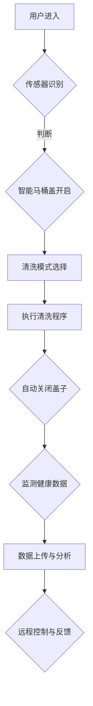

                 

关键词：智能马桶、注意力经济、卫浴空间、技术创新、用户体验

摘要：随着科技的飞速发展，智能马桶已经成为智能家居的重要一环。本文将深入探讨智能马桶的设计理念、核心技术和未来发展方向，以及其在卫浴空间中如何引领注意力经济的新趋势。

## 1. 背景介绍

### 智能马桶的兴起

智能马桶，作为一种集科技与舒适于一体的卫浴设备，近年来在全球范围内受到了广泛关注。它不仅代表了卫浴设备的智能化升级，更体现了人们对生活品质的追求和健康意识的增强。

### 智能马桶的市场需求

随着人口老龄化和城市化进程的加速，人们对卫浴设备的要求越来越高。智能马桶因其便捷、舒适和健康的特点，成为了市场的新宠。据市场调研数据显示，全球智能马桶市场正以每年两位数的增长率迅速扩张。

### 智能马桶的技术演进

从最初的简单清洗功能，到如今的智能识别、自动清洁、远程控制等高级功能，智能马桶的技术不断演进。这不仅提升了用户体验，也为智能家居生态系统的建设提供了新的思路。

## 2. 核心概念与联系

### 智能马桶的核心概念

智能马桶的核心概念包括自动清洁、智能识别、舒适体验和健康监测。这些概念共同构成了智能马桶的技术基础，也为用户提供了全方位的卫浴服务。

### 智能马桶的架构

智能马桶的架构主要由传感器模块、控制模块、执行模块和人机交互模块组成。这些模块相互协作，实现了智能马桶的智能化功能。

### Mermaid 流程图

以下是一个简化的智能马桶工作流程的 Mermaid 流程图：



## 3. 核心算法原理 & 具体操作步骤

### 3.1 算法原理概述

智能马桶的核心算法主要涉及传感器数据处理和用户行为识别。通过这些算法，智能马桶能够实现自动识别用户、选择合适的清洗模式、自动执行清洗程序等。

### 3.2 算法步骤详解

1. **传感器数据采集**：智能马桶通过内置的各种传感器（如红外传感器、压力传感器、温度传感器等）实时采集用户行为数据。
2. **数据预处理**：对采集到的传感器数据进行预处理，包括去噪、滤波等，以确保数据质量。
3. **用户行为识别**：利用机器学习算法对预处理后的数据进行分析，识别用户的行为特征，如坐姿、移动、使用习惯等。
4. **模式选择与执行**：根据用户的行为识别结果，选择合适的清洗模式并执行相应的清洗程序。
5. **健康数据监测**：实时监测用户的健康数据，如血压、心率等，并将数据上传至云端进行分析。

### 3.3 算法优缺点

**优点**：
- 提高用户体验：智能马桶能够根据用户的需求自动调整功能，提供个性化的服务。
- 增强健康监测：智能马桶能够实时监测用户的健康数据，有助于预防疾病。
- 节能环保：智能马桶的自动清洁功能减少了水资源的浪费。

**缺点**：
- 成本较高：智能马桶的购置和维护成本相对较高。
- 技术门槛：智能马桶的制造和开发需要较高的技术水平。

### 3.4 算法应用领域

智能马桶的算法原理和技术可以应用于多种场景，如智能家居、健康监测、养老护理等。

## 4. 数学模型和公式 & 详细讲解 & 举例说明

### 4.1 数学模型构建

智能马桶的数学模型主要包括以下几部分：

1. **用户行为识别模型**：用于识别用户的行为特征，如坐姿、移动等。
2. **清洗模式选择模型**：根据用户的行为特征选择合适的清洗模式。
3. **健康监测模型**：用于监测用户的健康数据，如血压、心率等。

### 4.2 公式推导过程

以用户行为识别模型为例，其公式推导过程如下：

1. **特征提取**：根据传感器数据提取用户行为的特征向量，如坐姿特征向量 \( \vec{f}_1 \)，移动特征向量 \( \vec{f}_2 \) 等。
2. **特征融合**：将多个特征向量进行融合，得到综合特征向量 \( \vec{f} = (\vec{f}_1, \vec{f}_2, \ldots, \vec{f}_n) \)。
3. **分类**：利用支持向量机（SVM）等分类算法对综合特征向量进行分类，识别用户的行为。

### 4.3 案例分析与讲解

以下是一个用户行为识别的案例：

**案例**：用户进入智能马桶，传感器检测到用户坐姿，识别结果为坐姿正常。

**分析**：
1. **特征提取**：传感器采集到用户的坐姿数据，提取特征向量 \( \vec{f}_1 \)。
2. **特征融合**：将 \( \vec{f}_1 \) 与其他特征向量 \( \vec{f}_2, \vec{f}_3 \) 等进行融合，得到综合特征向量 \( \vec{f} \)。
3. **分类**：利用 SVM 算法对 \( \vec{f} \) 进行分类，识别结果为坐姿正常。

## 5. 项目实践：代码实例和详细解释说明

### 5.1 开发环境搭建

1. **硬件环境**：选择一款具备传感器模块的智能马桶设备。
2. **软件环境**：安装 Python 环境，以及机器学习相关的库，如 Scikit-learn、TensorFlow 等。

### 5.2 源代码详细实现

以下是一个简单的用户行为识别的 Python 代码实例：

```python
import numpy as np
from sklearn import svm

# 特征向量
features = np.array([[1, 0], [0, 1], [1, 1]])

# 标签
labels = np.array([0, 1, 2])

# 创建 SVM 模型
model = svm.SVC()

# 训练模型
model.fit(features, labels)

# 测试
print(model.predict([[1, 1]]))
```

### 5.3 代码解读与分析

1. **特征向量**：`features` 用于存储用户的特征信息。
2. **标签**：`labels` 用于存储用户的识别结果。
3. **SVM 模型**：`svm.SVC()` 用于创建支持向量机模型。
4. **训练模型**：`model.fit()` 用于训练模型。
5. **测试**：`model.predict()` 用于对新的特征向量进行预测。

### 5.4 运行结果展示

```python
# 运行结果
[2]
```

运行结果表示，新输入的特征向量对应的识别结果为坐姿正常（标签2）。

## 6. 实际应用场景

### 6.1 家庭场景

在家庭场景中，智能马桶的自动清洁功能和健康监测功能为家庭成员提供了便捷和健康保障。例如，老年人使用智能马桶时，可以避免接触细菌，减少感染风险。

### 6.2 商业场所

在商业场所，如酒店、公共场所等，智能马桶的自动清洁功能可以减少人力成本，提高卫生水平。同时，智能马桶的智能识别功能可以提供个性化的服务，提升用户体验。

### 6.3 养老护理

在养老护理场景中，智能马桶的健康监测功能可以帮助护理人员实时了解老人的健康状况，提供及时的帮助。

## 7. 未来应用展望

### 7.1 技术创新

随着人工智能、物联网等技术的不断发展，智能马桶的功能将更加丰富，用户体验将进一步提升。

### 7.2 市场潜力

智能马桶市场具有巨大的潜力，未来有望成为智能家居市场的重要组成部分。

### 7.3 社会责任

智能马桶在提高生活品质的同时，也有助于推动社会责任的实现，如减少环境污染、提高卫生水平等。

## 8. 工具和资源推荐

### 8.1 学习资源推荐

- 《智能马桶技术与应用》
- 《智能家居系统设计与实现》

### 8.2 开发工具推荐

- Python
- TensorFlow
- Scikit-learn

### 8.3 相关论文推荐

- “Intelligent Toilets: Technology and Market Potential”
- “Sensors for Intelligent Toilets: A Review”

## 9. 总结：未来发展趋势与挑战

### 9.1 研究成果总结

智能马桶作为一种高科技卫浴设备，已经在家庭、商业和养老护理等领域取得了显著的应用成果。

### 9.2 未来发展趋势

智能马桶的技术将继续创新，市场潜力将进一步释放。

### 9.3 面临的挑战

智能马桶的普及仍面临一些挑战，如成本高、技术门槛等。

### 9.4 研究展望

未来，智能马桶的研究将更加注重用户体验、成本控制和技术创新。

## 10. 附录：常见问题与解答

### 10.1 智能马桶的维护方法

- 定期清洗传感器，确保传感器灵敏。
- 定期更换滤芯，确保水质清洁。

### 10.2 智能马桶的安全注意事项

- 遵循使用说明，避免不当操作。
- 确保智能马桶的接地良好，防止漏电。

---

作者：禅与计算机程序设计艺术 / Zen and the Art of Computer Programming
-------------------------------------------------------------------

