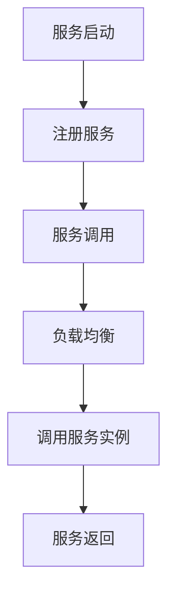

                 

 关键词：服务注册中心、负载均衡器、微服务架构、Docker、Kubernetes、服务发现、Consul、Nginx

> 摘要：本文旨在介绍服务注册中心与负载均衡器在微服务架构中的应用实例。通过对Consul与Nginx的配置和使用，详细阐述了服务注册、服务发现和负载均衡的实现过程，为开发者提供了一种可行的实践方案。

## 1. 背景介绍

在现代的分布式系统中，随着服务数量的不断增加，服务的注册、发现和负载均衡变得尤为重要。服务注册中心负责记录服务的运行状态和位置信息，而负载均衡器则负责将客户端请求合理分配到各个服务实例上，以保证系统的稳定性和高可用性。

微服务架构的流行使得服务数量成倍增长，传统的单一服务架构已经无法满足需求。微服务架构通过将应用程序分解为若干个小而独立的服务模块，每个服务模块负责一个特定的业务功能，通过服务注册中心进行注册和发现，再通过负载均衡器进行请求分发，从而实现系统的弹性扩展和高可用性。

本文将基于Docker和Kubernetes容器化技术，通过Consul作为服务注册中心，Nginx作为负载均衡器，搭建一个简单的微服务架构实例，详细阐述服务注册、服务发现和负载均衡的实现过程。

## 2. 核心概念与联系

### 2.1 服务注册中心

服务注册中心是一个集中管理的服务目录，用于存储和管理所有服务的元数据，包括服务名、服务地址、端口、健康状况等信息。服务启动时，会将自身的信息注册到服务注册中心，服务停止时，会从服务注册中心注销。服务消费者通过服务注册中心进行服务发现，获取服务的位置信息，并进行请求调用。

### 2.2 负载均衡器

负载均衡器用于将客户端请求合理地分配到多个服务实例上，以实现流量的分发和系统的负载均衡。负载均衡器可以采用轮询、最少连接、IP哈希等多种算法，根据实际需求选择合适的负载均衡策略。

### 2.3 服务发现

服务发现是指客户端程序能够动态地发现服务实例的运行状态和位置信息，并基于此进行请求调用。服务发现可以通过服务注册中心实现，也可以通过DNS、配置文件等方式实现。

### 2.4 Mermaid 流程图



## 3. 核心算法原理 & 具体操作步骤

### 3.1 算法原理概述

服务注册中心与负载均衡器的核心算法原理主要包括：

1. 服务注册：服务启动时，通过HTTP/HTTPS协议将服务元数据发送到服务注册中心进行注册。
2. 服务发现：服务消费者通过HTTP/HTTPS协议从服务注册中心获取服务列表，进行服务发现。
3. 负载均衡：负载均衡器根据负载均衡算法，将客户端请求分配到不同的服务实例上。
4. 服务调用：客户端根据服务发现的结果，调用服务实例进行业务处理。
5. 服务注销：服务停止时，通过HTTP/HTTPS协议从服务注册中心注销服务。

### 3.2 算法步骤详解

1. **服务启动：**
   服务启动时，会自动执行服务注册流程，将服务元数据发送到服务注册中心。

2. **注册服务：**
   服务注册中心接收服务元数据，并将其存储在本地数据库中。同时，将服务元数据同步到其他服务注册中心节点，实现高可用性。

3. **服务调用：**
   客户端通过服务注册中心获取服务列表，然后通过负载均衡器将请求分配到不同的服务实例上。

4. **负载均衡：**
   负载均衡器根据设定的算法（如轮询、最少连接等），将客户端请求分配到不同的服务实例上。

5. **服务返回：**
   服务实例处理完请求后，将结果返回给客户端。

6. **服务注销：**
   服务停止时，会自动执行服务注销流程，从服务注册中心注销服务。

### 3.3 算法优缺点

**优点：**
- **高可用性：** 通过服务注册中心和服务实例的分布式部署，实现了服务的高可用性。
- **弹性扩展：** 通过负载均衡器，可以根据实际需求动态调整服务实例的数量，实现系统的弹性扩展。
- **简化开发：** 通过服务注册中心与负载均衡器的使用，简化了服务开发过程，降低了开发难度。

**缺点：**
- **复杂性：** 服务注册中心与负载均衡器的配置和管理相对复杂，需要一定的学习和实践。
- **性能开销：** 服务注册中心与服务实例之间的通信，以及负载均衡器对请求的转发，会引入一定的性能开销。

### 3.4 算法应用领域

服务注册中心与负载均衡器在以下领域有广泛的应用：

- **云计算：** 在云计算环境中，服务注册中心与负载均衡器用于管理云服务，实现服务的自动发现和负载均衡。
- **大数据：** 在大数据处理领域，服务注册中心与负载均衡器用于管理数据计算任务，实现任务的负载均衡和数据处理的自动化。
- **物联网：** 在物联网领域，服务注册中心与负载均衡器用于管理物联网设备，实现设备的自动发现和负载均衡。

## 4. 数学模型和公式 & 详细讲解 & 举例说明

### 4.1 数学模型构建

服务注册中心与负载均衡器的核心数学模型主要包括：

1. 服务注册模型：
   $$ 服务注册模型：S_r = \sum_{i=1}^{n} S_i $$
   其中，$S_r$ 表示服务注册成功率，$S_i$ 表示第 $i$ 个服务实例的注册成功率。

2. 服务发现模型：
   $$ 服务发现模型：S_f = \sum_{i=1}^{n} S_i $$
   其中，$S_f$ 表示服务发现成功率，$S_i$ 表示第 $i$ 个服务实例的服务发现成功率。

3. 负载均衡模型：
   $$ 负载均衡模型：L = \sum_{i=1}^{n} R_i $$
   其中，$L$ 表示系统负载，$R_i$ 表示第 $i$ 个服务实例的负载。

### 4.2 公式推导过程

1. 服务注册模型推导：

   假设有 $n$ 个服务实例，每个服务实例的注册成功率相互独立。那么，服务注册成功率 $S_r$ 可以表示为：

   $$ S_r = \left(1 - \left(1 - S_i\right)^n\right)^{-1} $$

   其中，$S_i$ 表示第 $i$ 个服务实例的注册成功率。

2. 服务发现模型推导：

   类似于服务注册模型，服务发现成功率 $S_f$ 也可以表示为：

   $$ S_f = \left(1 - \left(1 - S_i\right)^n\right)^{-1} $$

3. 负载均衡模型推导：

   假设每个服务实例的负载相等，那么系统总负载 $L$ 可以表示为：

   $$ L = n \cdot R_i $$

   其中，$R_i$ 表示第 $i$ 个服务实例的负载。

### 4.3 案例分析与讲解

假设有一个服务系统，包含 $3$ 个服务实例，每个服务实例的注册成功率和负载如下：

- 注册成功率：$S_i = 0.9$（即每个服务实例的注册成功率均为 $90\%$）。
- 负载：$R_i = 1$（即每个服务实例的负载均为 $1$）。

根据上述数学模型，可以计算出服务注册成功率和系统负载：

1. 服务注册成功率：
   $$ S_r = \left(1 - \left(1 - 0.9\right)^3\right)^{-1} \approx 0.98 $$

   即服务注册成功率约为 $98\%$。

2. 系统负载：
   $$ L = 3 \cdot 1 = 3 $$

   即系统总负载为 $3$。

通过这个案例，可以看出服务注册成功率和系统负载与每个服务实例的注册成功率和负载密切相关。在实际应用中，可以通过调整服务实例的数量和配置，优化服务注册成功率和系统负载。

## 5. 项目实践：代码实例和详细解释说明

### 5.1 开发环境搭建

在进行项目实践之前，需要先搭建开发环境。本文使用Docker和Kubernetes进行容器化部署，以下是具体步骤：

1. **安装Docker：** 访问[Docker官网](https://www.docker.com/)，下载并安装适用于当前操作系统的Docker引擎。
2. **安装Kubernetes：** 访问[Kubernetes官网](https://kubernetes.io/)，根据操作系统安装Kubernetes集群。
3. **安装Kubectl：** 安装kubectl命令行工具，用于管理Kubernetes集群。

### 5.2 源代码详细实现

本例中使用Consul作为服务注册中心，Nginx作为负载均衡器，搭建一个简单的微服务架构。以下是源代码实现：

1. **Dockerfile：**
   ```Dockerfile
   FROM alpine:3.14
   RUN apk add --no-cache openjdk8-jdk
   COPY demo-service-1.0-SNAPSHOT.jar demo-service.jar
   EXPOSE 8080
   CMD ["java", "-jar", "/demo-service.jar"]
   ```

2. **Docker Compose：**
   ```yaml
   version: '3'
   services:
     demo-service:
       build: .
       image: demo-service:1.0-SNAPSHOT
       ports:
         - "8080:8080"
       depends_on:
         - consul
       networks:
         - demo-network

     consul:
       image: consul:1.10.2
       ports:
         - "8500:8500"
       networks:
         - demo-network

     nginx:
       image: nginx:1.19-alpine
       ports:
         - "8081:80"
       volumes:
         - ./nginx.conf:/etc/nginx/nginx.conf
       depends_on:
         - demo-service
         - consul
       networks:
         - demo-network

   networks:
     demo-network:
   ```

3. **Nginx 配置文件（nginx.conf）：**
   ```nginx
   http {
     upstream demo-service {
       server demo-service:8080;
     }

     server {
       listen 80;

       location / {
         proxy_pass http://demo-service;
       }
     }
   }
   ```

### 5.3 代码解读与分析

1. **Dockerfile：**
   Dockerfile用于构建Docker镜像。其中，`FROM alpine:3.14`指定了基础镜像，`EXPOSE 8080`暴露了服务端口。

2. **Docker Compose：**
   Docker Compose用于定义和运行多容器Docker应用。其中，`demo-service`服务基于Dockerfile构建，`consul`服务用于服务注册中心，`nginx`服务作为负载均衡器。

3. **Nginx 配置文件：**
   Nginx配置文件定义了负载均衡规则。其中，`upstream`模块定义了服务列表，`server`模块定义了负载均衡策略。

### 5.4 运行结果展示

执行以下命令启动容器：

```bash
docker-compose up -d
```

启动完成后，访问 `http://localhost:8081/` 可以看到服务正常响应。

## 6. 实际应用场景

服务注册中心与负载均衡器在分布式系统中具有广泛的应用场景，以下列举一些实际应用场景：

1. **电商平台：** 电商平台通常包含多个服务模块，如商品服务、订单服务、支付服务等。通过服务注册中心与负载均衡器，可以实现服务的自动注册、自动发现和负载均衡，提高系统的稳定性和扩展性。
2. **物联网平台：** 物联网平台需要处理大量设备的数据，通过服务注册中心与负载均衡器，可以实现设备的自动注册、自动发现和负载均衡，提高系统的可靠性和响应速度。
3. **大数据处理：** 大数据处理平台通常包含多个数据处理任务，通过服务注册中心与负载均衡器，可以实现任务的自动注册、自动发现和负载均衡，提高系统的数据处理能力和性能。

## 7. 工具和资源推荐

### 7.1 学习资源推荐

1. **《微服务设计》：** 这本书详细介绍了微服务架构的设计原则、实现方法和最佳实践，对初学者和有经验的开发者都有很大帮助。
2. **《Consul官方文档》：** [Consul官方文档](https://www.consul.io/docs.html)提供了丰富的服务注册中心相关知识，包括安装、配置和使用等。
3. **《Nginx官方文档》：** [Nginx官方文档](http://nginx.org/en/docs/)提供了详细的负载均衡器配置和使用方法，包括基本的HTTP和HTTPS配置、负载均衡策略等。

### 7.2 开发工具推荐

1. **Docker Desktop：** Docker官方推出的桌面版工具，用于本地容器化环境的构建和管理，方便开发者快速上手。
2. **Kubernetes Dashboard：** Kubernetes官方提供的可视化界面，用于管理和监控Kubernetes集群，提高开发效率。

### 7.3 相关论文推荐

1. **"Microservices: A Definition of a New Approach to Application Architecture"：** 这篇论文提出了微服务架构的概念，详细阐述了微服务架构的优势和实践方法。
2. **"Service-Oriented Architecture: Concepts and Architecture"：** 这篇论文介绍了服务导向架构（SOA）的概念和架构，为微服务架构提供了理论基础。

## 8. 总结：未来发展趋势与挑战

### 8.1 研究成果总结

服务注册中心与负载均衡器在分布式系统中发挥着越来越重要的作用。随着云计算、物联网和大数据处理等领域的快速发展，服务注册中心与负载均衡器的需求越来越强烈。现有研究主要集中于以下几个方面：

1. **服务注册中心的性能优化：** 针对大规模分布式系统的服务注册需求，研究高效的服务注册算法和协议，提高服务注册中心的性能和可靠性。
2. **负载均衡算法的研究：** 针对不同的业务场景，研究适用于不同需求的负载均衡算法，提高系统的负载均衡能力和性能。
3. **服务发现机制的研究：** 针对大规模分布式系统的服务发现需求，研究高效的服务发现机制和协议，提高服务发现的准确性和实时性。

### 8.2 未来发展趋势

未来，服务注册中心与负载均衡器将呈现以下发展趋势：

1. **智能化：** 随着人工智能技术的发展，服务注册中心与负载均衡器将逐渐具备智能化的能力，如自动调整负载均衡策略、智能故障转移等。
2. **容器化：** 随着容器技术的普及，服务注册中心与负载均衡器将更多地采用容器化部署，提高系统的灵活性和可扩展性。
3. **云原生：** 随着云原生技术的发展，服务注册中心与负载均衡器将更多地采用云原生架构，提高系统的可靠性和性能。

### 8.3 面临的挑战

服务注册中心与负载均衡器在分布式系统中面临着诸多挑战：

1. **性能与可靠性：** 在大规模分布式系统中，如何保证服务注册中心与负载均衡器的性能和可靠性是一个重要挑战。
2. **安全性：** 如何确保服务注册中心与负载均衡器的安全性，防止恶意攻击和数据泄露，是当前面临的一个重要问题。
3. **可观测性：** 在大规模分布式系统中，如何保证服务注册中心与负载均衡器的可观测性，及时发现和处理故障，也是一个重要挑战。

### 8.4 研究展望

未来，服务注册中心与负载均衡器的研究将主要集中在以下几个方面：

1. **性能优化：** 研究高效的算法和协议，提高服务注册中心与负载均衡器的性能和可靠性。
2. **安全机制：** 研究安全机制，提高服务注册中心与负载均衡器的安全性，防止恶意攻击和数据泄露。
3. **自动化管理：** 研究自动化管理方法，实现服务注册中心与负载均衡器的自动化部署、监控和故障恢复。

## 9. 附录：常见问题与解答

### Q：服务注册中心与负载均衡器在分布式系统中的具体作用是什么？

A：服务注册中心主要负责服务的注册和发现，保证服务消费者能够快速、准确地获取服务的位置信息。负载均衡器主要负责将客户端请求合理地分配到各个服务实例上，实现流量的均衡和负载的分配。

### Q：如何选择合适的负载均衡算法？

A：选择合适的负载均衡算法需要根据具体的业务场景和需求。常见的负载均衡算法包括轮询、最少连接、IP哈希等。轮询算法简单高效，适用于无状态服务；最少连接算法适用于有状态服务，可以保证客户端的请求总是发送到同一服务实例上；IP哈希算法可以根据客户端的IP地址进行请求分配，适用于具有地域分布特点的服务。

### Q：服务注册中心与负载均衡器如何保证高可用性？

A：服务注册中心与负载均衡器可以通过以下方法保证高可用性：

1. **分布式部署：** 将服务注册中心与负载均衡器部署在多个节点上，实现分布式部署，提高系统的可用性。
2. **故障转移：** 当某个节点发生故障时，其他节点可以自动接管故障节点的功能，实现故障转移。
3. **数据备份：** 定期对服务注册中心与负载均衡器的数据进行备份，防止数据丢失。
4. **监控与报警：** 实时监控服务注册中心与负载均衡器的运行状态，及时发现和处理故障。

### Q：服务注册中心与负载均衡器如何处理容灾和故障恢复？

A：服务注册中心与负载均衡器可以通过以下方法处理容灾和故障恢复：

1. **异地容灾：** 将服务注册中心与负载均衡器部署在地理位置不同的数据中心，实现异地容灾，提高系统的容灾能力。
2. **故障恢复：** 当某个数据中心发生故障时，其他数据中心可以自动接管故障节点的功能，实现故障恢复。
3. **自动化部署：** 通过自动化部署工具，实现服务注册中心与负载均衡器的快速部署和恢复。
4. **故障演练：** 定期进行故障演练，提高系统应对故障的能力。

# 作者：禅与计算机程序设计艺术 / Zen and the Art of Computer Programming

