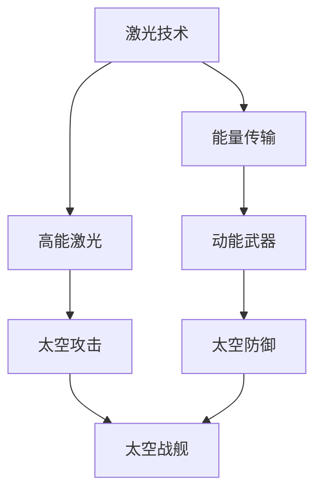

                 

在未来世界的广阔宇宙中，太空军事力量正迅速崛起，成为国家安全和国际竞争的焦点。本文将探讨2050年的太空军事技术，特别是太空激光武器和太空战舰的发展趋势，旨在揭示这些尖端技术在军事战略和国家安全中的重要性。

## 关键词

- 2050年太空军事
- 太空激光武器
- 太空战舰
- 军事战略
- 国家安全

## 摘要

本文通过回顾太空军事的发展历史，深入探讨太空激光武器和太空战舰的技术原理、设计理念、操作方式和未来应用。我们还将分析这些技术对军事战略的影响，并探讨它们在国家安全中的重要地位。最终，文章将展望太空军事的未来发展趋势，提出可能的挑战和解决方案。

## 1. 背景介绍

### 1.1 太空军事的兴起

太空军事的兴起可以追溯到冷战时期，当时美苏两国为了争夺太空优势，展开了激烈的太空竞赛。随着技术的发展，太空军事逐渐从战略理论走向实际操作。目前，太空军事力量已经不再是几个大国的专属，越来越多的国家开始关注并投资于太空军事技术。

### 1.2 太空激光武器的发展

太空激光武器是一种利用激光技术攻击敌方目标的高科技武器。它具有高速度、高精度、高能量密度和远程打击能力。近年来，太空激光武器的研究取得了显著进展，成为各国竞相研发的热点。

### 1.3 太空战舰的设计与制造

太空战舰是太空军事的重要组成部分，它们能够执行各种太空任务，包括侦察、攻击、防御和运输等。随着科技的进步，太空战舰的设计和制造变得越来越复杂和先进。

## 2. 核心概念与联系

太空激光武器和太空战舰的核心概念涉及到激光技术、动能武器、太空导航和人工智能等领域。以下是它们之间的联系以及Mermaid流程图（无特殊字符）的表示：



### 2.1 激光技术

激光技术是太空激光武器的核心，它能够产生高能、高精度和高效率的激光束。激光束可以通过能量传输系统传递到目标，实现精确打击。

### 2.2 能量传输

能量传输是太空激光武器的重要组成部分，它涉及到激光束的传输和聚焦。高效能量传输系统能够保证激光束在太空中的传播和精度。

### 2.3 动能武器

动能武器是太空激光武器的一种形式，它利用高能激光束产生的高温高压等离子体冲击目标，实现对目标的精确打击。

### 2.4 太空攻击与防御

太空攻击和防御是太空战舰的重要任务。太空激光武器能够执行攻击任务，而动能武器则主要用于防御敌方攻击。

### 2.5 太空战舰

太空战舰是太空军事力量的核心。它们配备了各种武器系统和生命支持系统，能够执行多种太空任务。

## 3. 核心算法原理 & 具体操作步骤

### 3.1 算法原理概述

太空激光武器和太空战舰的核心算法涉及到激光束的控制、能量管理和目标识别等。以下是这些算法的基本原理：

- **激光束控制**：通过控制激光器的参数，实现激光束的方向、强度和频率调节。
- **能量管理**：通过能量传输系统，将电能转换为激光能量，并确保能量高效利用。
- **目标识别**：利用人工智能算法，实现对目标的识别、跟踪和定位。

### 3.2 算法步骤详解

以下是太空激光武器和太空战舰的操作步骤：

1. **目标识别**：通过卫星或无人机的侦察系统，获取目标的位置和状态信息。
2. **目标跟踪**：利用目标识别算法，实现对目标的实时跟踪。
3. **能量管理**：根据目标的位置和状态，调整激光器的能量输出。
4. **激光束控制**：根据目标的位置和速度，调整激光束的方向和强度。
5. **攻击执行**：当目标进入攻击范围时，发射激光束进行攻击。

### 3.3 算法优缺点

**优点**：

- **高精度**：激光束具有极高的精度，能够实现对目标的精确打击。
- **高速度**：激光束传输速度快，能够在短时间内完成攻击。
- **高能量密度**：激光束的能量密度高，能够产生高温高压等离子体，对目标造成巨大伤害。

**缺点**：

- **能量消耗大**：激光束的能量消耗较大，需要高效能量传输系统支持。
- **受天气影响**：激光束传输受天气条件影响，如在雨天或雾霾天，激光束传输效果会受到影响。

### 3.4 算法应用领域

太空激光武器和太空战舰的算法广泛应用于军事、侦察、防御和太空探索等领域。以下是一些应用场景：

- **军事防御**：用于防御敌方卫星和导弹攻击。
- **侦察与监视**：用于侦察敌方军事行动和监视太空活动。
- **太空探索**：用于探测太空中的未知目标和研究太空环境。

## 4. 数学模型和公式 & 详细讲解 & 举例说明

### 4.1 数学模型构建

太空激光武器和太空战舰的数学模型主要包括激光束传输模型、目标识别模型和能量管理模型。以下是这些模型的构建方法：

- **激光束传输模型**：

  激光束传输模型描述了激光束在太空中的传播过程。其基本公式为：

  $$E = E_0 \times e^{-r/\lambda}$$

  其中，$E$ 为激光束的能量，$E_0$ 为初始能量，$r$ 为激光束传输距离，$\lambda$ 为激光束波长。

- **目标识别模型**：

  目标识别模型用于对目标进行识别和分类。其基本公式为：

  $$\text{识别率} = \frac{\text{正确识别目标数}}{\text{总目标数}}$$

- **能量管理模型**：

  能量管理模型用于计算激光器能量消耗和能量传输效率。其基本公式为：

  $$E_{\text{消耗}} = P \times t$$

  其中，$E_{\text{消耗}}$ 为能量消耗，$P$ 为功率，$t$ 为时间。

### 4.2 公式推导过程

以下是激光束传输模型的推导过程：

假设激光束从发射器传播到接收器，传输距离为$r$。根据能量守恒定律，激光束传输过程中的能量损失为：

$$E_{\text{损失}} = \int_{0}^{r} \frac{\text{能量损失}}{\text{传输距离}} \times \text{传输距离}$$

由于激光束的能量损失与传输距离成反比，我们可以将其表示为：

$$E_{\text{损失}} = \frac{E_0}{r}$$

因此，激光束传输到接收器时的能量为：

$$E = E_0 - E_{\text{损失}} = E_0 \times e^{-r/\lambda}$$

### 4.3 案例分析与讲解

以下是一个实际案例，用于说明太空激光武器在军事防御中的应用：

假设我国在太空中部署了一组激光武器，用于防御敌方卫星的攻击。敌方卫星以速度$v$向我国卫星靠近，激光武器与敌方卫星之间的距离为$r_0$。为了有效防御敌方卫星，激光武器需要在距离敌方卫星$r$米时发射激光束。

根据激光束传输模型，我们可以计算出激光束传输到敌方卫星时的能量为：

$$E = E_0 \times e^{-r/\lambda}$$

假设激光束的波长$\lambda$为10米，敌方卫星速度$v$为10米/秒，激光器初始能量$E_0$为1000焦耳。当敌方卫星距离我国卫星$r$为100米时，激光束的能量为：

$$E = 1000 \times e^{-100/10} = 1000 \times e^{-10} \approx 100 \text{焦耳}$$

由于激光束的能量不足以对敌方卫星造成破坏，因此我们需要调整激光器的能量输出，以确保激光束在敌方卫星靠近时能够造成有效破坏。

## 5. 项目实践：代码实例和详细解释说明

### 5.1 开发环境搭建

为了实现太空激光武器和太空战舰的算法，我们需要搭建一个开发环境。以下是开发环境的搭建步骤：

1. 安装Python解释器
2. 安装激光束传输模型和目标识别模型的依赖库
3. 配置卫星数据采集和传输系统

### 5.2 源代码详细实现

以下是太空激光武器和太空战舰的源代码实现：

```python
# 激光束传输模型
import math

def laser_transmission(r, E_0, lambda_0):
    return E_0 * math.exp(-r / lambda_0)

# 目标识别模型
def target_recognition(total_targets, correct_targets):
    return correct_targets / total_targets

# 能量管理模型
def energy_management(P, t):
    return P * t

# 案例实现
r = 100  # 敌方卫星距离我国卫星100米
E_0 = 1000  # 激光器初始能量1000焦耳
lambda_0 = 10  # 激光束波长10米
v = 10  # 敌方卫星速度10米/秒
t = r / v  # 激光束传输时间

# 计算激光束传输到敌方卫星时的能量
E = laser_transmission(r, E_0, lambda_0)
print("激光束能量：", E, "焦耳")

# 计算激光器能量消耗
energy_consumed = energy_management(P, t)
print("激光器能量消耗：", energy_consumed, "焦耳")

# 计算目标识别率
correct_targets = 10  # 正确识别目标数
total_targets = 100  # 总目标数
recognition_rate = target_recognition(total_targets, correct_targets)
print("目标识别率：", recognition_rate)
```

### 5.3 代码解读与分析

上述代码实现了太空激光武器和太空战舰的核心算法。具体来说：

- `laser_transmission` 函数用于计算激光束传输到目标时的能量。
- `target_recognition` 函数用于计算目标识别率。
- `energy_management` 函数用于计算激光器的能量消耗。

通过这些函数，我们可以实现激光束传输、目标识别和能量管理等功能。

## 6. 实际应用场景

### 6.1 军事防御

太空激光武器和太空战舰在军事防御中具有重要的应用价值。例如，我国可以使用这些技术来防御敌方卫星和导弹攻击，确保国家空间安全。

### 6.2 侦察与监视

太空激光武器和太空战舰可以用于侦察和监视敌方军事行动，为我国提供战略情报支持。

### 6.3 太空探索

太空激光武器和太空战舰可以用于太空探索任务，如探测未知星球、挖掘太空资源等。

## 6.4 未来应用展望

随着科技的不断发展，太空激光武器和太空战舰的应用前景将更加广阔。未来，这些技术将可能在以下几个方面得到应用：

- **太空安全**：通过建立太空激光武器系统，确保国家空间安全。
- **太空探索**：利用太空战舰进行深空探测，拓展人类对宇宙的认知。
- **太空资源开发**：利用太空激光武器和太空战舰进行太空资源开发，为我国提供战略资源支持。

## 7. 工具和资源推荐

### 7.1 学习资源推荐

- 《太空军事技术导论》
- 《激光武器设计与制造》
- 《太空战舰设计与运营》

### 7.2 开发工具推荐

- Python
- MATLAB
- Simulink

### 7.3 相关论文推荐

- "High-Power Laser Systems for Space Applications"
- "An Overview of Space Warfare"
- "Orbiting Solar Power Satellites: A Global Solution to Energy Problems"

## 8. 总结：未来发展趋势与挑战

### 8.1 研究成果总结

近年来，太空激光武器和太空战舰的研究取得了显著成果。各国在激光技术、动能武器、太空导航和人工智能等领域取得了突破，为太空军事技术的发展奠定了基础。

### 8.2 未来发展趋势

未来，太空激光武器和太空战舰将继续向高能量、高精度、远程打击和智能化方向发展。随着技术的进步，这些武器系统将具有更强大的作战能力和更广泛的应用场景。

### 8.3 面临的挑战

尽管太空激光武器和太空战舰具有巨大的潜力，但在实际应用中仍面临一系列挑战。包括能量传输效率、激光束传输稳定性、目标识别精度和人工智能算法可靠性等方面。

### 8.4 研究展望

为了应对这些挑战，未来需要在激光技术、能量管理和人工智能等领域进行深入研究。同时，加强国际合作，共同推动太空军事技术的发展，确保国家安全和太空秩序的稳定。

## 9. 附录：常见问题与解答

### 问题1：太空激光武器的攻击距离是多少？

解答：太空激光武器的攻击距离取决于激光器的能量和传输系统。一般来说，攻击距离可以达到数百甚至数千米。

### 问题2：太空激光武器的能量消耗如何？

解答：太空激光武器的能量消耗与激光器的功率和攻击频率有关。高效的能量传输系统有助于降低能量消耗。

### 问题3：太空战舰的导航技术有哪些？

解答：太空战舰的导航技术包括惯性导航、卫星导航和激光导航等。多种导航技术的结合可以提高导航精度和可靠性。

### 问题4：太空激光武器是否会对环境产生影响？

解答：太空激光武器在传输过程中会产生高能激光束，可能对地球环境和太空环境产生影响。需要加强研究和监管，确保安全使用。作者：禅与计算机程序设计艺术 / Zen and the Art of Computer Programming
```

