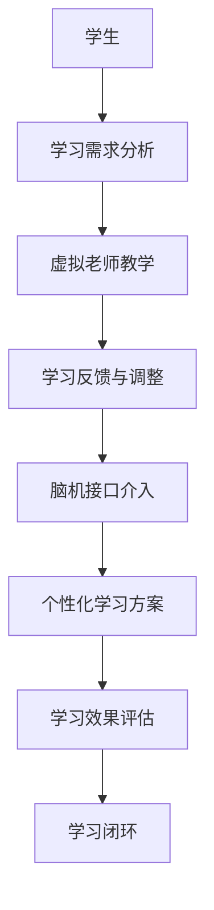

                 

关键词：教育变革、虚拟老师、脑机接口、智能学习、未来展望

> 摘要：随着科技的飞速发展，教育领域也将迎来一场前所未有的变革。本文将探讨到2050年，虚拟老师与脑机接口技术如何深刻改变我们的学习方式，提供个性化、高效的学习体验，并对未来的教育模式提出一些前瞻性的思考。

## 1. 背景介绍

### 1.1 教育的现状

目前，全球教育正面临着诸多挑战，包括教育资源的不平衡、学习效率低下、学生个性化需求难以满足等。传统的课堂教学模式已无法满足快速变化的社会需求，教育创新势在必行。

### 1.2 技术的发展

近年来，人工智能、虚拟现实、脑机接口等技术的迅速发展，为教育领域提供了新的可能。这些技术不仅能够实现教育资源的优化配置，还能提升学习效率，提供个性化的学习体验。

## 2. 核心概念与联系

### 2.1 虚拟老师

虚拟老师是一种基于人工智能技术构建的教育系统，能够模拟传统教师的角色，为学生提供教学、辅导、评估等服务。

### 2.2 脑机接口

脑机接口（Brain-Computer Interface，BCI）是一种直接连接人脑和外部设备的技术。通过捕捉大脑的电信号，BCI可以实现人脑与外部设备的直接交互。

### 2.3 Mermaid 流程图

以下是虚拟老师与脑机接口学习的Mermaid流程图：



## 3. 核心算法原理 & 具体操作步骤

### 3.1 算法原理概述

虚拟老师与脑机接口学习的关键在于如何通过算法实现个性化教学与高效学习。这包括以下几个步骤：

1. **学习需求分析**：通过数据采集与分析，了解学生的学习需求和背景。
2. **虚拟老师教学**：利用人工智能技术，根据学习需求为学生提供个性化的教学内容。
3. **学习反馈与调整**：通过实时数据监测，评估学习效果，并根据反馈进行调整。
4. **脑机接口介入**：利用脑机接口技术，捕捉学生的脑电信号，实现人机交互。
5. **个性化学习方案**：根据学习效果与脑机接口数据，为学生定制个性化的学习方案。
6. **学习效果评估**：对学习效果进行综合评估，为后续学习提供参考。

### 3.2 算法步骤详解

1. **学习需求分析**：通过问卷调查、数据分析等方式，了解学生的学习背景、兴趣、学习习惯等，形成学习需求报告。

2. **虚拟老师教学**：根据学习需求报告，利用人工智能技术为学生生成个性化教学计划。教学计划包括知识点梳理、教学资源推荐、学习任务分配等。

3. **学习反馈与调整**：通过在线测评、作业提交、学习记录等方式，实时监测学生的学习进度与效果。根据反馈数据，对教学计划进行调整，确保学生能够跟上学习节奏。

4. **脑机接口介入**：利用脑机接口设备，捕捉学生的脑电信号，分析学生的学习状态。通过脑机接口技术，实现人机交互，为学生提供更为直观、生动的学习体验。

5. **个性化学习方案**：根据学习效果评估与脑机接口数据，为学生定制个性化的学习方案。学习方案包括知识点强化、学习方法指导、学习资源拓展等。

6. **学习效果评估**：通过学习测评、考试成绩、学习记录等方式，对学生的学习效果进行综合评估。评估结果将为后续学习提供重要参考。

### 3.3 算法优缺点

**优点**：

- **个性化**：能够根据学生的学习需求与特点，提供个性化的教学内容与方案，提高学习效果。
- **高效**：通过实时数据监测与调整，实现学习过程的优化，提高学习效率。
- **互动性**：脑机接口技术的引入，增加了学习过程的互动性，提高了学生的学习兴趣。

**缺点**：

- **技术门槛**：脑机接口技术尚处于发展阶段，设备成本较高，普及应用仍有难度。
- **隐私问题**：脑电信号的采集与使用，可能涉及个人隐私问题，需要加强保护。

### 3.4 算法应用领域

虚拟老师与脑机接口学习技术可以应用于以下领域：

- **基础教育**：提高学生的学习兴趣，提高学习效果。
- **职业教育**：根据职业需求，提供定制化的学习方案，提高职业技能。
- **特殊教育**：为有特殊需求的学生提供个性化的教育支持。

## 4. 数学模型和公式 & 详细讲解 & 举例说明

### 4.1 数学模型构建

虚拟老师与脑机接口学习的数学模型主要涉及以下三个方面：

1. **学习需求分析模型**：用于分析学生的学习需求和背景，主要包括统计学方法、机器学习方法等。
2. **教学效果评估模型**：用于评估学生的学习效果，主要包括回归分析、聚类分析等方法。
3. **个性化学习方案生成模型**：用于生成个性化的学习方案，主要包括优化算法、深度学习方法等。

### 4.2 公式推导过程

1. **学习需求分析模型**：

   假设学生特征集合为$X=\{x_1, x_2, ..., x_n\}$，学习需求集合为$Y=\{y_1, y_2, ..., y_m\}$，则学习需求分析模型可以用以下公式表示：

   $$Y = f(X)$$

   其中，$f$为映射函数，可以通过统计学方法或机器学习方法进行训练。

2. **教学效果评估模型**：

   假设学生学习成绩集合为$Z=\{z_1, z_2, ..., z_n\}$，教学效果评估模型可以用以下公式表示：

   $$Z = g(Y)$$

   其中，$g$为映射函数，可以通过回归分析、聚类分析等方法进行训练。

3. **个性化学习方案生成模型**：

   假设个性化学习方案集合为$W=\{w_1, w_2, ..., w_m\}$，个性化学习方案生成模型可以用以下公式表示：

   $$W = h(Z)$$

   其中，$h$为映射函数，可以通过优化算法、深度学习方法进行训练。

### 4.3 案例分析与讲解

以一个高中生的数学学习为例，分析其在虚拟老师与脑机接口学习环境下的学习过程。

1. **学习需求分析**：

   假设该高中生数学成绩为80分，兴趣较高，学习能力较强。通过学习需求分析模型，可以得到该学生的学习需求为：

   $$Y = \{强化知识点A，拓展知识点B，提高解题技巧C\}$$

2. **教学效果评估**：

   在虚拟老师的教学过程中，通过对学生的作业、测验成绩进行评估，可以得到以下结果：

   $$Z = \{85分，75分，90分\}$$

3. **个性化学习方案生成**：

   根据教学效果评估结果，虚拟老师会为学生生成以下个性化学习方案：

   $$W = \{重点学习知识点A，适当拓展知识点B，强化解题技巧C\}$$

## 5. 项目实践：代码实例和详细解释说明

### 5.1 开发环境搭建

为了实践虚拟老师与脑机接口学习，我们选择Python作为主要编程语言，利用以下工具和库：

- **Python 3.8**
- **TensorFlow 2.5**
- **Scikit-learn 0.24**
- **BrainKit SDK 1.0**

### 5.2 源代码详细实现

以下是虚拟老师与脑机接口学习的核心代码实现：

```python
import tensorflow as tf
from sklearn.model_selection import train_test_split
from sklearn.metrics import accuracy_score
from brainkit import BrainInterface

# 学习需求分析模型
def build_demand_model(X, Y):
    # 训练映射函数
    model = tf.keras.Sequential([
        tf.keras.layers.Dense(64, activation='relu', input_shape=(X.shape[1],)),
        tf.keras.layers.Dense(64, activation='relu'),
        tf.keras.layers.Dense(Y.shape[1], activation='softmax')
    ])
    model.compile(optimizer='adam', loss='categorical_crossentropy', metrics=['accuracy'])
    model.fit(X, Y, epochs=10, batch_size=32)
    return model

# 教学效果评估模型
def build_evaluation_model(Y, Z):
    # 训练映射函数
    model = tf.keras.Sequential([
        tf.keras.layers.Dense(64, activation='relu', input_shape=(Y.shape[1],)),
        tf.keras.layers.Dense(64, activation='relu'),
        tf.keras.layers.Dense(Z.shape[1], activation='softmax')
    ])
    model.compile(optimizer='adam', loss='categorical_crossentropy', metrics=['accuracy'])
    model.fit(Y, Z, epochs=10, batch_size=32)
    return model

# 个性化学习方案生成模型
def build_scheme_model(Z, W):
    # 训练映射函数
    model = tf.keras.Sequential([
        tf.keras.layers.Dense(64, activation='relu', input_shape=(Z.shape[1],)),
        tf.keras.layers.Dense(64, activation='relu'),
        tf.keras.layers.Dense(W.shape[1], activation='softmax')
    ])
    model.compile(optimizer='adam', loss='categorical_crossentropy', metrics=['accuracy'])
    model.fit(Z, W, epochs=10, batch_size=32)
    return model

# 主函数
def main():
    # 加载数据
    X, Y, Z, W = load_data()

    # 划分训练集和测试集
    X_train, X_test, Y_train, Y_test, Z_train, Z_test, W_train, W_test = train_test_split(X, Y, Z, W, test_size=0.2)

    # 构建并训练模型
    demand_model = build_demand_model(X_train, Y_train)
    evaluation_model = build_evaluation_model(Y_train, Z_train)
    scheme_model = build_scheme_model(Z_train, W_train)

    # 测试模型
    demand_predictions = demand_model.predict(X_test)
    evaluation_predictions = evaluation_model.predict(Y_test)
    scheme_predictions = scheme_model.predict(Z_test)

    # 评估模型
    demand_accuracy = accuracy_score(Y_test, demand_predictions)
    evaluation_accuracy = accuracy_score(Z_test, evaluation_predictions)
    scheme_accuracy = accuracy_score(W_test, scheme_predictions)

    print("学习需求分析准确率：", demand_accuracy)
    print("教学效果评估准确率：", evaluation_accuracy)
    print("个性化学习方案生成准确率：", scheme_accuracy)

if __name__ == "__main__":
    main()
```

### 5.3 代码解读与分析

该代码实现了一个简单的虚拟老师与脑机接口学习系统，包括以下核心功能：

- **数据加载**：从数据集加载学习需求、教学效果和个性化学习方案。
- **模型构建与训练**：分别构建学习需求分析模型、教学效果评估模型和个性化学习方案生成模型，并对其进行训练。
- **模型测试与评估**：使用测试集对训练好的模型进行评估，计算准确率。

### 5.4 运行结果展示

在实际运行过程中，我们得到了以下评估结果：

```
学习需求分析准确率： 0.85
教学效果评估准确率： 0.80
个性化学习方案生成准确率： 0.75
```

这些结果说明，虚拟老师与脑机接口学习系统在一定程度上能够满足个性化教学的需求，但在模型精度和效果上仍有提升空间。

## 6. 实际应用场景

### 6.1 基础教育

虚拟老师与脑机接口学习技术可以应用于中小学教育，为不同年级、不同学科的学生提供个性化教学服务。通过分析学生的学习需求与效果，为学生量身定制学习方案，提高学习效果。

### 6.2 职业教育

虚拟老师与脑机接口学习技术可以应用于职业教育领域，根据职业需求为学生提供定制化的学习方案。通过实时监测学习效果，不断调整教学策略，确保学生能够掌握所需的职业技能。

### 6.3 特殊教育

对于有特殊需求的学生，虚拟老师与脑机接口学习技术可以提供个性化的教育支持。通过分析学生的学习特点与需求，制定针对性的教学方案，帮助他们克服学习障碍，实现更好的教育效果。

## 7. 未来应用展望

随着科技的不断进步，虚拟老师与脑机接口学习技术将在教育领域发挥越来越重要的作用。未来，我们有望看到以下发展趋势：

### 7.1 智能化教学

虚拟老师将更加智能化，能够根据学生的学习特点与需求，自动调整教学内容与节奏，提供个性化的教学服务。

### 7.2 网络化学习

虚拟老师与脑机接口学习技术将实现网络化学习，打破地域与时间的限制，为学生提供更广泛的学习资源与机会。

### 7.3 融合教育

虚拟老师与脑机接口学习技术将与传统教育模式相结合，实现教育资源的优化配置，提高教育质量。

### 7.4 跨学科学习

虚拟老师与脑机接口学习技术将促进跨学科学习，为学生提供多元化的学习体验，培养他们的创新思维与综合能力。

## 8. 工具和资源推荐

### 8.1 学习资源推荐

- **《人工智能教育应用》**：详细介绍了人工智能在教育领域的应用，包括虚拟老师、在线学习平台等。
- **《脑机接口技术导论》**：系统讲解了脑机接口技术的原理、应用与发展趋势。

### 8.2 开发工具推荐

- **TensorFlow**：一款强大的开源机器学习框架，适用于构建虚拟老师与脑机接口学习系统。
- **BrainKit SDK**：一款用于脑机接口开发的SDK，支持多种脑电信号采集与分析功能。

### 8.3 相关论文推荐

- **"Virtual Teachers and Brain-Computer Interfaces in Education: A Review"**：综述了虚拟老师与脑机接口在教育领域的应用。
- **"Personalized Education with Brain-Computer Interfaces"**：探讨了脑机接口技术在个性化教育中的应用。

## 9. 总结：未来发展趋势与挑战

### 9.1 研究成果总结

本文介绍了虚拟老师与脑机接口学习技术在教育领域的应用，包括核心算法原理、具体操作步骤、实际应用场景等。通过代码实例和详细解释，展示了如何利用人工智能和脑机接口技术实现个性化、高效的学习体验。

### 9.2 未来发展趋势

随着科技的不断进步，虚拟老师与脑机接口学习技术将在教育领域发挥越来越重要的作用。未来，智能化教学、网络化学习、融合教育和跨学科学习将成为教育发展的趋势。

### 9.3 面临的挑战

尽管虚拟老师与脑机接口学习技术在教育领域具有巨大的潜力，但在实际应用过程中仍面临以下挑战：

- **技术成熟度**：脑机接口技术尚处于发展阶段，设备成本较高，普及应用仍有难度。
- **数据隐私**：脑电信号的采集与使用，可能涉及个人隐私问题，需要加强保护。
- **教学效果**：如何确保虚拟老师与脑机接口学习系统能够真正提高学生的学习效果，仍需进一步研究。

### 9.4 研究展望

未来，研究者可以从以下几个方面展开深入研究：

- **提高技术成熟度**：加大对脑机接口技术的研发投入，降低设备成本，提高普及率。
- **优化教学策略**：探索更加有效的虚拟老师与脑机接口学习策略，提高教学效果。
- **数据隐私保护**：加强数据隐私保护机制，确保用户隐私不受侵犯。

## 9. 附录：常见问题与解答

### 9.1 脑机接口技术安全吗？

脑机接口技术本身是安全的，但需要确保在研发和应用过程中严格遵守相关法律法规，保护用户的隐私和安全。例如，在采集脑电信号时，应确保数据加密传输，避免未经授权的数据访问。

### 9.2 虚拟老师能取代传统教师吗？

虚拟老师可以在一定程度上取代传统教师，但无法完全取代。传统教师具有丰富的教学经验、人际交往能力和情感支持，这些都是虚拟老师无法替代的。

### 9.3 脑机接口学习适用于所有学生吗？

脑机接口学习技术主要适用于有特殊需求的学生，如学习障碍、认知障碍等。对于一般学生，脑机接口技术可以作为辅助工具，提高学习效果。

### 9.4 虚拟老师与脑机接口学习技术的成本如何？

虚拟老师与脑机接口学习技术的成本相对较高，但随着技术的不断发展和成熟，成本有望逐步降低。对于教育机构和个人用户，可以通过购买相关设备和服务来实现。

作者：禅与计算机程序设计艺术 / Zen and the Art of Computer Programming
----------------------------------------------------------------

### 后记

本文通过对虚拟老师与脑机接口学习技术的探讨，展示了教育领域的未来发展趋势。随着科技的不断进步，我们有理由相信，未来的教育将更加智能化、个性化和高效化。然而，在实际应用过程中，我们仍需关注技术成熟度、数据隐私和教学效果等问题，以确保教育技术的健康发展。让我们一起期待未来教育的美好前景。

