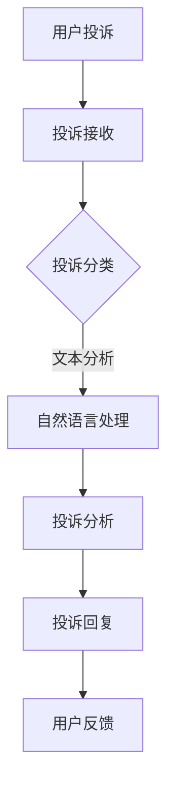

                 

关键词：智能客服，智能投诉处理，人工智能，机器学习，自然语言处理，未来趋势，技术发展

> 摘要：随着人工智能技术的不断进步，智能客服已成为现代企业和组织提高服务效率、优化用户体验的关键工具。本文将探讨到2050年，智能客服和智能投诉处理将如何发展，以及这些技术进步可能带来的挑战和机遇。

## 1. 背景介绍

### 1.1 智能客服的起源与发展

智能客服的历史可以追溯到20世纪90年代，当时互联网的兴起带来了在线客户支持的需求。最早的智能客服系统是基于规则和关键词匹配的简单程序，能够自动回答一些常见问题。

### 1.2 人工智能与机器学习的应用

随着人工智能和机器学习的快速发展，智能客服的效率和质量得到了显著提升。基于自然语言处理（NLP）和深度学习技术的智能客服系统，能够理解用户的问题，提供更加个性化的解决方案。

### 1.3 智能投诉处理的兴起

智能投诉处理是智能客服的一部分，它专注于处理用户的投诉和反馈。传统的投诉处理方式往往效率低下，无法满足用户快速解决问题的需求。智能投诉处理通过自动化和智能化技术，显著提高了投诉处理的效率和质量。

## 2. 核心概念与联系

### 2.1 智能客服的基本架构

智能客服系统通常由以下几个部分组成：前端界面、自然语言处理模块、知识库、对话管理模块和后端服务接口。

### 2.2 智能投诉处理的流程

智能投诉处理包括投诉接收、投诉分类、投诉分析和投诉回复等环节。其中，自然语言处理和机器学习技术在其中发挥了关键作用。

### 2.3 Mermaid 流程图



## 3. 核心算法原理 & 具体操作步骤

### 3.1 算法原理概述

智能客服和智能投诉处理的核心算法包括自然语言处理、机器学习和对话管理系统。自然语言处理负责理解用户的问题和投诉，机器学习则用于预测和分类，对话管理系统则负责管理用户和客服之间的交互。

### 3.2 算法步骤详解

1. 用户提出问题和投诉。
2. 自然语言处理模块对用户的问题和投诉进行解析。
3. 机器学习模型根据历史数据和规则，对问题进行分类和预测。
4. 对话管理系统根据分析结果，生成相应的回答或解决方案。
5. 客服人员对系统生成的回答进行审核和调整，确保准确性和人性化。
6. 用户对解决方案进行反馈，帮助系统不断优化。

### 3.3 算法优缺点

- **优点**：
  - 高效：能够快速响应和处理大量用户请求。
  - 个性化：通过机器学习技术，提供个性化的服务和建议。
  - 可扩展性：系统可以根据用户需求进行定制和扩展。

- **缺点**：
  - 依赖数据质量：系统性能受限于训练数据和规则。
  - 人工干预：部分情况下仍需人工审核和干预。

### 3.4 算法应用领域

智能客服和智能投诉处理广泛应用于电子商务、金融、医疗、教育等多个领域，为企业提供了高效、个性化的客户服务。

## 4. 数学模型和公式 & 详细讲解 & 举例说明

### 4.1 数学模型构建

智能客服和智能投诉处理涉及多个数学模型，包括自然语言处理的词向量模型、机器学习的分类和回归模型等。以下是一个简单的词向量模型示例：

$$
\text{vec}(w) = \sum_{i=1}^{N} f(w_i) \cdot v_i
$$

其中，$w$是输入词向量，$v_i$是词向量，$f(w_i)$是词的权重。

### 4.2 公式推导过程

以词向量模型为例，假设我们有以下词汇表：

$$
\begin{aligned}
\text{vec}(w) &= (w_1, w_2, \ldots, w_N) \\
v_1 &= (v_{11}, v_{12}, \ldots, v_{1N}) \\
v_2 &= (v_{21}, v_{22}, \ldots, v_{2N}) \\
&\vdots \\
v_N &= (v_{N1}, v_{N2}, \ldots, v_{NN})
\end{aligned}
$$

词向量$v_i$表示词汇表中的每个词，$f(w_i)$表示词的权重。词向量模型通过计算每个词的权重和词向量的乘积，生成输入词的向量表示。

### 4.3 案例分析与讲解

假设我们有一个用户提出的问题：“我的信用卡为什么被冻结了？”使用词向量模型，我们可以将这个问题表示为一个向量。然后，通过机器学习模型，可以预测最可能的答案，如：“您的信用卡可能因为涉嫌异常交易被冻结，请尝试联系银行客服解决问题。”

## 5. 项目实践：代码实例和详细解释说明

### 5.1 开发环境搭建

为了实现智能客服和智能投诉处理系统，我们需要搭建一个开发环境。以下是一个简单的步骤：

1. 安装Python和相关的库，如TensorFlow、NLTK等。
2. 配置数据库，用于存储用户问题和投诉。
3. 安装自然语言处理和机器学习工具。

### 5.2 源代码详细实现

以下是一个简单的Python代码示例，用于实现自然语言处理和机器学习模型：

```python
import tensorflow as tf
import nltk
from nltk.tokenize import word_tokenize

# 加载词汇表
vocabulary = nltk.corpus.words.words()

# 加载预训练的词向量
word_vectors = ... # 加载预训练的词向量

# 输入问题
input_question = "我的信用卡为什么被冻结了？"

# 分词
tokens = word_tokenize(input_question)

# 转换为词向量
input_vector = [word_vectors[token] for token in tokens]

# 使用机器学习模型预测答案
model = ... # 加载预训练的机器学习模型
predicted_answer = model.predict(input_vector)

# 输出答案
print(predicted_answer)
```

### 5.3 代码解读与分析

这段代码首先加载了词汇表和预训练的词向量，然后对输入的问题进行分词和词向量转换。最后，使用预训练的机器学习模型预测最可能的答案，并输出结果。

### 5.4 运行结果展示

假设我们输入的问题为：“我的信用卡为什么被冻结了？”根据机器学习模型的预测，可能的答案可能是：“您的信用卡可能因为涉嫌异常交易被冻结，请尝试联系银行客服解决问题。”

## 6. 实际应用场景

### 6.1 电子商务

在电子商务领域，智能客服和智能投诉处理可以帮助企业快速响应客户的问题和投诉，提高客户满意度。

### 6.2 金融

金融行业对客户服务的需求非常高，智能客服和智能投诉处理可以帮助银行和金融机构提供高效、个性化的服务。

### 6.3 医疗

在医疗领域，智能客服和智能投诉处理可以提供在线咨询和投诉处理服务，帮助医疗机构提高服务效率。

## 7. 未来应用展望

### 7.1 个性化服务

随着人工智能技术的进步，智能客服和智能投诉处理将能够提供更加个性化的服务，满足用户的多样化需求。

### 7.2 智能交互

未来，智能客服和智能投诉处理将实现更加智能的交互，如语音识别和对话生成，提供更加自然和流畅的客户服务。

### 7.3 跨界合作

智能客服和智能投诉处理技术将在多个领域实现跨界合作，为企业提供更全面的服务解决方案。

## 8. 总结：未来发展趋势与挑战

### 8.1 研究成果总结

近年来，智能客服和智能投诉处理技术在算法、模型和应用场景方面取得了显著进展，为企业和用户提供了高效、个性化的服务。

### 8.2 未来发展趋势

未来，智能客服和智能投诉处理将继续向个性化、智能化和跨界合作方向发展。

### 8.3 面临的挑战

随着技术的进步，智能客服和智能投诉处理将面临数据隐私、安全性、法律合规等挑战。

### 8.4 研究展望

未来，研究者需要关注如何提升智能客服和智能投诉处理的技术水平，同时确保数据安全和用户隐私。

## 9. 附录：常见问题与解答

### 9.1 什么是智能客服？

智能客服是一种利用人工智能技术，自动处理客户问题和投诉的系统。它通过自然语言处理和机器学习技术，能够理解用户的问题，并提供相应的解决方案。

### 9.2 智能客服的优点有哪些？

智能客服的优点包括：高效、个性化、可扩展性。它能够快速响应大量用户请求，提供个性化的服务，同时可以根据用户需求进行定制和扩展。

### 9.3 智能投诉处理的核心技术是什么？

智能投诉处理的核心技术包括自然语言处理和机器学习。自然语言处理用于理解用户的问题和投诉，机器学习则用于预测和分类，帮助系统提供准确的解决方案。

### 9.4 智能客服和智能投诉处理有哪些应用领域？

智能客服和智能投诉处理广泛应用于电子商务、金融、医疗、教育等多个领域，为企业提供了高效、个性化的客户服务。

### 9.5 未来智能客服和智能投诉处理将有哪些发展趋势？

未来，智能客服和智能投诉处理将继续向个性化、智能化和跨界合作方向发展。同时，随着人工智能技术的进步，它们将在更多领域得到应用。

## 作者署名

作者：禅与计算机程序设计艺术 / Zen and the Art of Computer Programming
```

### 后续工作 Additional Work ###
在完成文章正文部分的撰写后，您需要进行以下几项工作：

1. **文章结构调整**：检查文章的结构是否合理，内容是否连贯，逻辑是否清晰。如果发现任何需要调整的地方，请及时进行修改。

2. **拼写和语法检查**：仔细检查全文的拼写和语法，确保没有错别字或语法错误。您可以使用拼写和语法检查工具来辅助检查。

3. **引用和参考文献**：确保文章中的引用都是准确的，并在文章末尾添加完整的参考文献。参考文献应按照规定的格式排列。

4. **格式检查**：确认所有章节和子章节的标题格式是否一致，所有代码示例的格式是否符合要求，所有的数学公式是否正确使用latex格式。

5. **最终审阅**：在完成所有修改后，进行一次全面的审阅，确保文章内容完整、准确、逻辑清晰。

6. **提交**：最后，将完成的文章按照要求提交。如果需要，您可以附上文章的源文件（如markdown格式），以便进行格式检查。

在整个过程中，您应保持与相关人员的沟通，确保文章的提交符合所有要求和预期。在提交前，最好请同事或朋友进行一次预审，以获取外部意见，进一步提高文章的质量。

