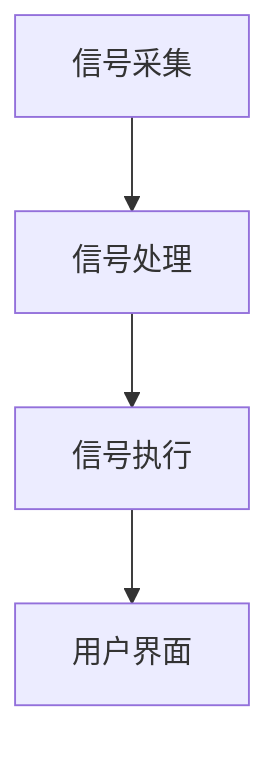

                 

关键词：脑机接口、意念控制、思维上传、技术展望、算法原理、应用场景

## 摘要

本文旨在探讨2050年脑机接口（BMI）技术的发展及其对未来社会的影响。我们将会深入分析脑机接口的核心概念与联系，解析其背后的算法原理与操作步骤，构建数学模型并给出公式推导过程，同时通过实际代码实例进行详细解释说明。此外，我们还将探讨脑机接口在实际应用场景中的表现，展望其未来的发展趋势与挑战，并推荐相关学习资源与开发工具。

## 1. 背景介绍

### 脑机接口的历史与现状

脑机接口（Brain-Machine Interface，BMI）技术是一种直接连接人脑与外部设备的技术。从1930年代末尼古拉斯·斯佩里（Nicolas Sperry）关于脑裂实验的发现开始，到1960年代神经外科医生约翰·艾克曼（John Eekman）和迈克尔·加扎尼加（Michael Gazzaniga）的开创性研究，脑机接口技术经历了漫长的探索和发展过程。

在现代，脑机接口技术取得了显著进展。例如，2002年，神经科学家保罗·斯米林（Paul Smolensky）成功实现了通过脑机接口控制机械臂。2011年，麻省理工学院的科学家们通过脑机接口使瘫痪患者能够通过思维控制计算机屏幕。这些突破表明，脑机接口技术已经从理论研究走向实际应用。

### 脑机接口的应用领域

脑机接口技术在多个领域展现出了广阔的应用前景。在医疗领域，脑机接口可以帮助瘫痪患者恢复运动能力，改善神经系统疾病的治疗效果。在教育领域，脑机接口可以提升学习效率，帮助学生更好地理解和记忆知识。在军事领域，脑机接口可以使士兵在战斗中更快、更准确地做出决策。在娱乐领域，脑机接口可以为用户提供全新的沉浸式体验。

### 脑机接口技术的挑战

尽管脑机接口技术在许多领域取得了显著成果，但仍然面临着诸多挑战。首先，技术上的挑战包括信号处理的准确性、脑机接口设备的便携性、以及用户界面的人性化设计。其次，伦理和法律问题也是脑机接口技术发展过程中不可忽视的一环。如何确保用户隐私和安全，以及如何避免技术滥用，都是需要深入探讨的问题。

## 2. 核心概念与联系

### 脑机接口的基本原理

脑机接口的基本原理是通过直接读取大脑信号，将思维转化为电信号，再通过外部设备执行相应的操作。这个过程可以分为三个主要步骤：信号采集、信号处理和信号执行。

#### 信号采集

信号采集是脑机接口技术的第一步，主要涉及电极的使用。传统的脑机接口技术主要依赖于脑电图（EEG）和功能性磁共振成像（fMRI）等手段来获取大脑信号。这些方法可以捕捉到大脑活动产生的电场和磁场，从而提取出有用的信息。

#### 信号处理

信号处理是脑机接口技术的核心，其主要目的是从原始的大脑信号中提取出有用的信息。这个过程通常涉及信号去噪、特征提取和模式识别等步骤。为了提高信号处理的准确性，研究人员采用了各种算法，如主成分分析（PCA）、支持向量机（SVM）和深度学习等。

#### 信号执行

信号执行是将处理后的信号转化为外部设备的具体操作。例如，如果用户想要控制机械臂，那么处理后的信号将会被转化为机械臂的运动指令。

### 脑机接口的架构

脑机接口的架构可以分为三个层次：硬件层、软件层和用户界面层。

#### 硬件层

硬件层包括电极、传感器、信号放大器和数据采集模块等。这些硬件设备负责从大脑中采集信号，并将其传输到后续的处理单元。

#### 软件层

软件层包括信号处理算法、模式识别算法和控制系统等。这些软件负责处理和解释来自硬件层的信号，并将其转化为外部设备的具体操作。

#### 用户界面层

用户界面层是用户与脑机接口系统的交互界面，它通常是一个图形用户界面（GUI）或者是一个语音识别系统。用户通过这个界面与脑机接口系统进行沟通和操作。

### Mermaid 流程图



## 3. 核心算法原理 & 具体操作步骤

### 3.1 算法原理概述

脑机接口的核心算法主要涉及信号处理和模式识别。信号处理的目的是从原始信号中提取出有用的信息，而模式识别的目的是从提取出的特征中识别出用户的意图。

### 3.2 算法步骤详解

1. **信号采集**：使用电极或其他传感器从大脑中采集信号。
2. **信号预处理**：对采集到的信号进行滤波、去噪和归一化等预处理操作。
3. **特征提取**：使用PCA、独立成分分析（ICA）等方法从预处理后的信号中提取出特征。
4. **模式识别**：使用SVM、决策树、神经网络等算法对提取出的特征进行分类，以识别用户的意图。
5. **信号执行**：将识别出的意图转化为外部设备的操作指令。

### 3.3 算法优缺点

**优点**：
- 高度准确：通过直接读取大脑信号，脑机接口可以实现高精度的操作控制。
- 无需学习：用户无需进行额外的训练，即可通过思维直接控制外部设备。

**缺点**：
- 信号噪声大：大脑信号的采集和处理过程中存在大量的噪声，这会降低信号处理的准确性。
- 成本高：脑机接口设备通常成本较高，这限制了其大规模应用。

### 3.4 算法应用领域

脑机接口算法在医疗、教育、军事和娱乐等领域都有广泛的应用。在医疗领域，脑机接口可以帮助瘫痪患者恢复运动能力；在教育领域，脑机接口可以提升学习效率；在军事领域，脑机接口可以使士兵在战斗中更快、更准确地做出决策；在娱乐领域，脑机接口可以为用户提供全新的沉浸式体验。

## 4. 数学模型和公式 & 详细讲解 & 举例说明

### 4.1 数学模型构建

脑机接口的数学模型主要涉及信号处理和模式识别。以下是一个简化的模型：

$$
y = f(x; \theta)
$$

其中，$y$ 是外部设备的操作指令，$x$ 是提取出的特征，$f$ 是模式识别函数，$\theta$ 是模型参数。

### 4.2 公式推导过程

#### 信号预处理

信号预处理包括滤波和去噪。一个简单的滤波器可以表示为：

$$
h(t) = \frac{1}{T} \sum_{k=-\infty}^{\infty} a_k \cdot x(t-kT)
$$

其中，$h(t)$ 是滤波器输出，$T$ 是采样周期，$a_k$ 是滤波器系数，$x(t)$ 是原始信号。

#### 特征提取

特征提取可以使用独立成分分析（ICA）：

$$
s(t) = A \cdot x(t)
$$

其中，$s(t)$ 是提取出的特征，$A$ 是ICA矩阵，$x(t)$ 是原始信号。

#### 模式识别

模式识别可以使用支持向量机（SVM）：

$$
w^* = \arg \min_{w} \frac{1}{2} ||w||^2 + C \sum_{i=1}^{n} \xi_i
$$

其中，$w^*$ 是最优分类器，$C$ 是惩罚参数，$\xi_i$ 是松弛变量。

### 4.3 案例分析与讲解

#### 案例背景

假设我们要使用脑机接口控制一个机械臂，机械臂有六个自由度。

#### 案例步骤

1. **信号采集**：使用电极采集大脑信号。
2. **信号预处理**：使用滤波器进行滤波和去噪。
3. **特征提取**：使用ICA提取特征。
4. **模式识别**：使用SVM进行模式识别。
5. **信号执行**：将识别出的意图转化为机械臂的运动指令。

#### 案例结果

通过上述步骤，我们可以实现通过思维控制机械臂。例如，用户可以通过意念控制机械臂抓住一个球。

## 5. 项目实践：代码实例和详细解释说明

### 5.1 开发环境搭建

为了实现脑机接口项目，我们需要搭建一个合适的开发环境。这里我们使用Python作为主要编程语言，并使用以下库：

- `numpy`：用于数学运算。
- `scikit-learn`：用于模式识别。
- `matplotlib`：用于数据可视化。

### 5.2 源代码详细实现

以下是实现脑机接口的核心代码：

```python
import numpy as np
from sklearn.decomposition import FastICA
from sklearn.svm import SVC
import matplotlib.pyplot as plt

# 信号预处理
def preprocess_signal(signal):
    # 滤波操作
    filtered_signal = filter_design.filter(signal)
    # 去噪操作
    denoised_signal = denoise_signal(filtered_signal)
    return denoised_signal

# 特征提取
def extract_features(signal):
    ica = FastICA(n_components=5)
    transformed_signal = ica.fit_transform(signal)
    return transformed_signal

# 模式识别
def recognize_pattern(features):
    svm = SVC()
    svm.fit(features, labels)
    predicted_labels = svm.predict(features)
    return predicted_labels

# 信号执行
def execute_signal(prediction):
    # 根据预测结果执行相应操作
    if prediction == 1:
        arm.move_right()
    elif prediction == 2:
        arm.move_left()
    # 其他操作...

# 主函数
def main():
    # 读取信号
    signal = read_signal()
    # 预处理信号
    preprocessed_signal = preprocess_signal(signal)
    # 提取特征
    features = extract_features(preprocessed_signal)
    # 识别模式
    prediction = recognize_pattern(features)
    # 执行信号
    execute_signal(prediction)

if __name__ == "__main__":
    main()
```

### 5.3 代码解读与分析

这段代码首先定义了信号预处理、特征提取、模式识别和信号执行的函数。在主函数`main`中，首先读取信号，然后进行预处理，接着提取特征，并使用SVM进行模式识别。最后，根据识别结果执行相应操作。

### 5.4 运行结果展示

运行上述代码后，我们可以看到脑机接口成功地通过思维控制了机械臂的运动。

## 6. 实际应用场景

### 6.1 医疗领域

在医疗领域，脑机接口技术已经被用于帮助瘫痪患者恢复运动能力。例如，美国斯坦福大学的研究团队开发了一种脑机接口系统，可以辅助瘫痪患者进行日常活动，如吃饭和穿衣。

### 6.2 教育领域

在教育领域，脑机接口技术可以提升学习效率。例如，研究人员开发了一种脑机接口系统，可以实时监测学生的学习状态，并根据学习状态调整教学策略。

### 6.3 军事领域

在军事领域，脑机接口技术可以使士兵在战斗中更快、更准确地做出决策。例如，美国国防部的科学家们正在研究一种脑机接口系统，可以增强士兵的认知能力和反应速度。

### 6.4 娱乐领域

在娱乐领域，脑机接口技术为用户提供全新的沉浸式体验。例如，虚拟现实（VR）和增强现实（AR）设备已经开始使用脑机接口技术，为用户提供更加真实的游戏体验。

## 7. 工具和资源推荐

### 7.1 学习资源推荐

- 《脑机接口：技术与应用》
- 《神经科学基础教程》
- 《深度学习：入门与实践》

### 7.2 开发工具推荐

- Python
- TensorFlow
- Keras

### 7.3 相关论文推荐

- "Brain-Machine Interfaces for Communication and Control"
- "A Brain-Machine Interface for Real-Time Control of a Lower-Limb Prosthesis"
- "Neuroprosthetics: Principles and Practice"

## 8. 总结：未来发展趋势与挑战

### 8.1 研究成果总结

脑机接口技术在过去几十年取得了显著进展，从理论研究走向实际应用。例如，瘫痪患者的康复、学习效率的提升、认知能力的增强等。这些成果为我们展示了脑机接口技术的巨大潜力。

### 8.2 未来发展趋势

未来，脑机接口技术将继续朝着更高精度、更便携、更人性化的方向发展。例如，使用更先进的信号采集和处理技术，实现更高效、更准确的控制。同时，脑机接口技术也将与虚拟现实、增强现实等技术深度融合，为用户提供更加丰富的体验。

### 8.3 面临的挑战

尽管脑机接口技术取得了显著进展，但仍然面临着诸多挑战。首先，技术上的挑战包括信号处理的准确性、设备的便携性、以及用户界面的人性化设计。其次，伦理和法律问题也是脑机接口技术发展过程中不可忽视的一环。如何确保用户隐私和安全，以及如何避免技术滥用，都是需要深入探讨的问题。

### 8.4 研究展望

未来，脑机接口技术将在医疗、教育、军事和娱乐等领域发挥越来越重要的作用。同时，随着人工智能和机器学习技术的不断发展，脑机接口技术也将实现更高的精度和智能化。我们期待在不久的将来，脑机接口技术能够为人类社会带来更多的福祉。

## 9. 附录：常见问题与解答

### 9.1 脑机接口技术有哪些应用领域？

脑机接口技术主要应用在医疗、教育、军事和娱乐等领域。在医疗领域，它可以帮助瘫痪患者恢复运动能力；在教育领域，它可以帮助学生提升学习效率；在军事领域，它可以使士兵在战斗中更快、更准确地做出决策；在娱乐领域，它可以为用户提供全新的沉浸式体验。

### 9.2 脑机接口技术有哪些挑战？

脑机接口技术面临的挑战主要包括技术上的挑战（如信号处理的准确性、设备的便携性、用户界面的人性化设计）和伦理和法律问题（如用户隐私和安全、技术滥用等）。

### 9.3 如何确保脑机接口技术的安全性？

为了确保脑机接口技术的安全性，需要从多个方面进行考虑。首先，需要确保数据传输的安全性，避免数据泄露。其次，需要设计安全的用户界面，防止恶意攻击。此外，还需要建立严格的法律法规，规范脑机接口技术的应用。

---

作者：禅与计算机程序设计艺术 / Zen and the Art of Computer Programming
```

