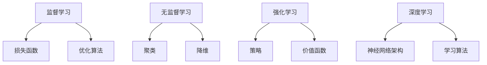

                 

关键词：机器学习、算法原理、数学模型、代码实例、应用领域、未来展望

> 摘要：本文深入探讨了机器学习的原理、核心算法、数学模型以及实际应用。通过对常见算法的详细讲解和代码实例分析，读者可以全面了解机器学习的工作机制和实际操作方法。此外，文章还展望了机器学习的未来发展趋势和面临的挑战。

## 1. 背景介绍

### 1.1 机器学习的定义与起源

机器学习（Machine Learning，ML）是一门研究如何让计算机从数据中自动学习和改进自身性能的学科。其目标是使计算机能够进行预测、决策和模式识别，从而无需显式编程。机器学习起源于20世纪50年代，当时学者们开始尝试让计算机通过训练数据来学习。

### 1.2 机器学习的应用场景

机器学习已经广泛应用于各种领域，包括但不限于自然语言处理、图像识别、推荐系统、医疗诊断、金融风控等。例如，通过机器学习算法，搜索引擎可以更准确地理解用户查询，推荐系统可以提供更个性化的推荐，医疗系统可以辅助医生进行诊断。

## 2. 核心概念与联系

### 2.1 监督学习（Supervised Learning）

监督学习是一种最常见的机器学习方法，其目标是通过学习输入和输出之间的映射关系，进行预测。监督学习的核心是损失函数（Loss Function）和优化算法（Optimization Algorithm）。

### 2.2 无监督学习（Unsupervised Learning）

无监督学习不需要标签信息，其目标是发现数据中的隐藏结构和模式。常见的方法包括聚类（Clustering）和降维（Dimensionality Reduction）。

### 2.3 强化学习（Reinforcement Learning）

强化学习是一种通过试错和奖励机制来学习的机器学习方法。其核心是策略（Policy）和价值函数（Value Function）。

### 2.4 深度学习（Deep Learning）

深度学习是一种基于多层神经网络（Neural Networks）的机器学习方法，其通过逐层抽象特征，实现复杂任务的学习。深度学习的核心是神经网络架构（Architecture）和学习算法（Learning Algorithm）。



## 3. 核心算法原理 & 具体操作步骤

### 3.1 算法原理概述

监督学习算法中最常用的是线性回归（Linear Regression）和逻辑回归（Logistic Regression）。线性回归用于预测连续值，而逻辑回归用于预测概率。

### 3.2 算法步骤详解

以线性回归为例，其基本步骤如下：

1. 数据预处理：包括特征工程、数据清洗等步骤，以确保数据的准确性和一致性。
2. 模型选择：根据问题类型选择合适的模型，如线性回归、决策树等。
3. 模型训练：使用训练数据集训练模型，优化模型参数。
4. 模型评估：使用验证集或测试集评估模型性能。
5. 模型部署：将训练好的模型部署到生产环境中进行实际应用。

### 3.3 算法优缺点

线性回归的优点是简单、易于实现，但缺点是对于非线性问题表现不佳。逻辑回归的优点是能够预测概率，但同样存在线性模型的局限性。

### 3.4 算法应用领域

线性回归和逻辑回归广泛应用于金融、电商、医疗等领域的预测和分类任务。

## 4. 数学模型和公式 & 详细讲解 & 举例说明

### 4.1 数学模型构建

线性回归的数学模型可以表示为：

$$y = \beta_0 + \beta_1 \cdot x$$

其中，$y$ 是预测值，$x$ 是特征值，$\beta_0$ 和 $\beta_1$ 是模型参数。

### 4.2 公式推导过程

线性回归的推导过程基于最小二乘法（Least Squares Method）。目标是找到最佳拟合直线，使得所有样本点到直线的距离平方和最小。

### 4.3 案例分析与讲解

假设我们有一组数据，包括自变量 $x$ 和因变量 $y$，我们要使用线性回归模型预测 $y$。以下是数据集的示例：

| $x$ | $y$ |
| --- | --- |
| 1   | 2   |
| 2   | 4   |
| 3   | 6   |
| 4   | 8   |

使用线性回归模型，我们得到拟合直线的参数为 $\beta_0 = 1$，$\beta_1 = 1$。因此，预测公式为：

$$y = 1 + 1 \cdot x$$

对于 $x = 5$，我们可以预测 $y = 6$。

## 5. 项目实践：代码实例和详细解释说明

### 5.1 开发环境搭建

本文使用 Python 编写代码，需要安装以下库：NumPy、Pandas、Scikit-learn。

```bash
pip install numpy pandas scikit-learn
```

### 5.2 源代码详细实现

以下是一个简单的线性回归代码实例：

```python
import numpy as np
import pandas as pd
from sklearn.linear_model import LinearRegression

# 加载数据
data = pd.read_csv('data.csv')
X = data[['x']]
y = data['y']

# 创建线性回归模型
model = LinearRegression()

# 训练模型
model.fit(X, y)

# 预测
predictions = model.predict(X)

# 打印结果
print(predictions)
```

### 5.3 代码解读与分析

代码首先加载数据集，然后使用 Scikit-learn 库的 LinearRegression 类创建线性回归模型。接着，使用 fit 方法训练模型，最后使用 predict 方法进行预测。代码运行结果将输出预测值。

## 6. 实际应用场景

### 6.1 金融领域

在金融领域，机器学习可以用于股票预测、风险评估、欺诈检测等任务。例如，通过线性回归模型预测股票价格，可以为投资者提供决策参考。

### 6.2 电商领域

在电商领域，机器学习可以用于用户行为分析、商品推荐等任务。例如，通过聚类算法分析用户行为，可以为用户推荐感兴趣的商品。

### 6.3 医疗领域

在医疗领域，机器学习可以用于疾病预测、医学图像分析等任务。例如，通过逻辑回归模型预测患者是否患有某种疾病，可以为医生提供诊断参考。

## 7. 工具和资源推荐

### 7.1 学习资源推荐

- 《机器学习》（周志华著）：一本经典的机器学习教材，适合初学者阅读。
- 《深度学习》（Ian Goodfellow、Yoshua Bengio、Aaron Courville 著）：一本深度学习的权威教材，适合进阶学习。

### 7.2 开发工具推荐

- Jupyter Notebook：一款强大的交互式开发环境，适合编写和运行机器学习代码。
- PyTorch：一款流行的深度学习框架，具有灵活的动态计算图和易于使用的接口。

### 7.3 相关论文推荐

- "Learning to Represent Languages with Neural Networks"（Collobert et al., 2011）
- "Deep Learning for Text Classification"（Yang et al., 2016）

## 8. 总结：未来发展趋势与挑战

### 8.1 研究成果总结

近年来，机器学习在算法、模型和硬件方面取得了显著进展，使得其在各个领域得到了广泛应用。

### 8.2 未来发展趋势

未来，机器学习将在以下几个方面继续发展：

- 模型压缩与加速：通过压缩模型和优化算法，提高模型的可部署性。
- 自监督学习：利用未标注数据进行学习，降低标注成本。
- 机器学习与自然语言处理：结合自然语言处理技术，实现更智能的交互。

### 8.3 面临的挑战

- 数据隐私与安全：保护用户数据隐私是机器学习领域的重要挑战。
- 可解释性：提高模型的可解释性，使其更加透明和可靠。

### 8.4 研究展望

随着技术的不断进步，机器学习将在更多领域发挥作用，为人类社会带来更多便利和创新。

## 9. 附录：常见问题与解答

### 9.1 机器学习与数据挖掘有什么区别？

机器学习和数据挖掘都是人工智能的分支，但它们的目标和应用场景有所不同。机器学习侧重于从数据中自动学习和改进性能，而数据挖掘侧重于从大量数据中发现有价值的模式和知识。

### 9.2 机器学习算法如何防止过拟合？

过拟合是指模型对训练数据过于适应，导致泛化能力差。为防止过拟合，可以采用以下方法：

- 正则化：通过添加正则项到损失函数，限制模型复杂度。
- 数据增强：通过增加训练数据量或对现有数据进行变换，提高模型泛化能力。
- 留一法/留N法：使用部分数据作为验证集，评估模型性能，避免过拟合。

---

作者：禅与计算机程序设计艺术 / Zen and the Art of Computer Programming
----------------------------------------------------------------

以上就是本文的全部内容，希望对您在机器学习领域的学习和研究有所帮助。如果您有任何疑问或建议，欢迎在评论区留言。感谢您的阅读！

