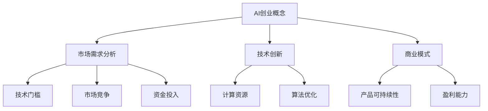

                 

关键词：李开复，AI创业，大模型，未来趋势，技术发展，人工智能应用

> 摘要：本文深入探讨了李开复先生对于AI创业和大模型未来发展的见解，通过对他的观点进行分析，揭示了人工智能在现代社会中的重要作用以及未来可能面临的挑战。文章将结合李开复先生的实际案例，讨论AI创业的成功经验，并展望大模型技术的发展方向。

## 1. 背景介绍

李开复先生是一位享誉国际的计算机科学家和人工智能专家，他曾是微软亚洲研究院创始人兼首席研究员，创新工场创始人兼CEO，以及世界知名的人工智能研究机构卡内基梅隆大学计算机系教授。李开复先生在人工智能领域有着深厚的学术背景和丰富的实践经验，他的研究涉及机器学习、自然语言处理、语音识别等多个方向。

随着人工智能技术的飞速发展，AI创业成为了当前科技界的热门话题。而大模型作为人工智能技术的重要组成部分，其发展备受关注。本文将围绕李开复先生对AI创业和大模型未来发展的观点展开讨论，以期为读者提供有价值的见解。

## 2. 核心概念与联系

### 2.1 AI创业的概念与挑战

AI创业是指利用人工智能技术进行创新和商业化的过程。在AI创业过程中，创业者需要面临诸多挑战，如技术门槛、市场竞争、资金投入等。李开复先生认为，AI创业的核心在于找到具有实际应用价值的问题，并将其转化为技术解决方案。以下是AI创业中需要关注的关键环节：

- **市场需求分析**：创业者需要深入了解目标市场的需求，确保所开发的产品能够解决用户实际问题。
- **技术创新**：创业者需要具备一定的技术实力，不断推进人工智能技术的研究和开发。
- **商业模式**：创业者需要设计合理的商业模式，确保产品的可持续发展和盈利能力。

### 2.2 大模型的概念与发展

大模型是指具有海量参数和强大计算能力的人工智能模型。这类模型在自然语言处理、计算机视觉、语音识别等领域表现出色，已成为人工智能研究的重要方向。大模型的发展离不开以下几个关键因素：

- **数据规模**：大模型需要大量的高质量数据作为训练素材，以提升模型的性能和泛化能力。
- **计算资源**：大模型的训练和推理过程需要大量的计算资源，对硬件设备的要求较高。
- **算法优化**：大模型的训练和优化过程需要不断改进算法，以提高模型的效果和效率。

### 2.3 Mermaid流程图

以下是李开复先生关于AI创业和大模型发展的Mermaid流程图，展示了核心概念和联系：



## 3. 核心算法原理 & 具体操作步骤

### 3.1 算法原理概述

在AI创业和大模型发展的过程中，算法原理起着至关重要的作用。以下是李开复先生提到的几种关键算法原理：

- **深度学习**：深度学习是一种基于人工神经网络的机器学习算法，通过多层神经网络对数据进行特征提取和分类。深度学习在自然语言处理、计算机视觉等领域取得了显著成果。
- **迁移学习**：迁移学习是一种利用已有模型的知识和经验来训练新任务的方法。通过迁移学习，可以降低新任务的训练成本，提高模型的泛化能力。
- **生成对抗网络（GAN）**：生成对抗网络是一种基于博弈论的生成模型，由生成器和判别器两个神经网络组成。GAN在图像生成、图像修复等领域具有广泛应用。

### 3.2 算法步骤详解

以下是李开复先生关于AI创业和大模型发展的具体操作步骤：

1. **市场需求分析**：通过对目标市场的需求进行调研，了解用户痛点，明确产品的应用场景和功能需求。
2. **技术创新**：基于市场需求，进行技术研究和开发，利用深度学习、迁移学习、GAN等算法原理，设计并实现符合需求的技术方案。
3. **数据收集与处理**：收集大量高质量的数据，对数据进行清洗、标注和预处理，为模型的训练提供充足的素材。
4. **模型训练与优化**：利用计算资源和算法优化技术，对模型进行训练和优化，提高模型的性能和效果。
5. **产品设计与开发**：根据市场需求和技术方案，设计产品原型并进行开发，确保产品的功能完善、用户体验良好。
6. **市场推广与销售**：通过市场推广和销售渠道，将产品推向市场，拓展用户基础，实现商业价值。

### 3.3 算法优缺点

以下是李开复先生关于AI创业和大模型发展的算法优缺点的分析：

- **深度学习**：优点包括强大的特征提取能力和良好的泛化能力；缺点包括对大规模数据和高计算资源的需求，以及训练过程的不透明性。
- **迁移学习**：优点包括降低新任务的训练成本和提升模型的泛化能力；缺点包括对已有模型的依赖程度较高，可能影响新任务的性能。
- **生成对抗网络（GAN）**：优点包括强大的图像生成能力和良好的图像质量；缺点包括训练过程的复杂性和不稳定，以及对判别器的设计要求较高。

### 3.4 算法应用领域

李开复先生认为，AI创业和大模型发展在以下领域具有广阔的应用前景：

- **自然语言处理**：包括机器翻译、情感分析、文本生成等应用，如智能客服、智能写作等。
- **计算机视觉**：包括图像分类、目标检测、图像生成等应用，如自动驾驶、智能安防等。
- **语音识别**：包括语音识别、语音合成、语音翻译等应用，如智能助手、实时翻译等。
- **医疗健康**：包括疾病预测、诊断辅助、个性化治疗等应用，如智能诊断、健康管理等。

## 4. 数学模型和公式 & 详细讲解 & 举例说明

### 4.1 数学模型构建

在人工智能领域，数学模型起着至关重要的作用。以下是李开复先生提到的几种关键数学模型及其构建方法：

- **深度学习模型**：深度学习模型主要由多层神经网络构成，包括输入层、隐藏层和输出层。每层神经元的输出通过激活函数传递给下一层，最终得到模型的预测结果。常见的激活函数有sigmoid、ReLU等。

  $$ f(x) = \sigma(w \cdot x + b) $$
  $$ f(x) = max(0, w \cdot x + b) $$

- **迁移学习模型**：迁移学习模型通常基于已有模型进行训练，利用迁移学习技术将已有模型的知识和经验应用到新任务中。常见的迁移学习技术有特征提取、模型蒸馏等。

  $$ F^{new}(x) = F^{base}(x) + \theta^{new}(x) $$
  $$ \theta^{base} = \theta^{base} + \eta \cdot \nabla_{\theta^{base}} \mathcal{L}(\theta^{base}) $$

- **生成对抗网络（GAN）**：生成对抗网络由生成器和判别器两个神经网络组成，生成器生成虚拟数据，判别器判断生成数据的真实性。通过训练生成器和判别器的博弈过程，生成器不断提高生成数据的质量。

  $$ G(z) = f_{\theta^{G}}(z) $$
  $$ D(x, G(z)) = f_{\theta^{D}}(x, G(z)) $$

### 4.2 公式推导过程

以下是李开复先生提到的几种关键数学模型的推导过程：

- **深度学习模型**：假设输入数据为$x \in \mathbb{R}^{D}$，隐藏层神经元数为$H$，输出层神经元数为$O$。设权重矩阵为$W^{(i)} \in \mathbb{R}^{H \times D}$，激活函数为$\sigma$。则深度学习模型的输出可以表示为：

  $$ h^{(i)} = \sigma(W^{(i)} \cdot x + b^{(i)}) $$
  $$ o^{(i)} = \sigma(W^{(i)} \cdot h^{(i-1)} + b^{(i)}) $$

  其中，$h^{(i)}$表示第$i$层隐藏层的输出，$o^{(i)}$表示第$i$层输出层的输出。

- **迁移学习模型**：假设已有模型$F^{base}$和待训练模型$F^{new}$，参数分别为$\theta^{base}$和$\theta^{new}$。迁移学习模型的损失函数可以表示为：

  $$ \mathcal{L}(\theta^{new}) = \mathcal{L}(F^{new}(x), y) + \lambda \cdot \mathcal{L}(\theta^{base}, \theta^{new}) $$

  其中，$\mathcal{L}(\theta^{base}, \theta^{new})$表示模型参数之间的距离，$\lambda$为调节参数。

- **生成对抗网络（GAN）**：假设生成器$G(z)$的输入为随机噪声$z \in \mathbb{R}^{Z}$，输出为虚拟数据$x^{G} \in \mathbb{R}^{D}$。判别器$D(x, x^{G})$的输出为判别分数，可以表示为：

  $$ D(x, x^{G}) = f_{\theta^{D}}(x) + f_{\theta^{G}}(z) $$
  $$ \mathcal{L}(\theta^{D}, \theta^{G}) = \mathcal{L}(D(x, x^{G}), 1) + \mathcal{L}(D(x), 0) $$

  其中，$\mathcal{L}(\theta^{D}, \theta^{G})$表示生成器和判别器的损失函数。

### 4.3 案例分析与讲解

以下是李开复先生提到的几个AI创业和大模型发展的案例，以及相关的数学模型和公式：

1. **案例一：自然语言处理（NLP）**
   - **任务**：文本分类
   - **模型**：卷积神经网络（CNN）
   - **公式**：
     $$ h^{(i)} = \sigma(\sum_{k=1}^{K} w^{(i)} \cdot f_{k}(x) + b^{(i)}) $$
     $$ f_{k}(x) = \sum_{j=1}^{D} h_{j,k} \cdot x_{j} $$
     其中，$h^{(i)}$表示第$i$层隐藏层的输出，$f_{k}(x)$表示卷积核$k$在输入数据$x$上的作用。

2. **案例二：计算机视觉（CV）**
   - **任务**：图像分类
   - **模型**：卷积神经网络（CNN）
   - **公式**：
     $$ o^{(i)} = \sigma(W^{(i)} \cdot h^{(i-1)} + b^{(i)}) $$
     $$ h^{(i)} = \text{ReLU}(W^{(i)} \cdot h^{(i-1)} + b^{(i)}) $$
     其中，$o^{(i)}$表示第$i$层输出层的输出，$h^{(i)}$表示第$i$层隐藏层的输出。

3. **案例三：语音识别**
   - **任务**：语音转文字
   - **模型**：循环神经网络（RNN）
   - **公式**：
     $$ h^{(i)} = \text{ReLU}(W^{(i)} \cdot h^{(i-1)} + b^{(i)}) $$
     $$ o^{(i)} = W^{(O)} \cdot h^{(L)} + b^{(O)} $$
     其中，$h^{(i)}$表示第$i$层隐藏层的输出，$o^{(i)}$表示第$i$层输出层的输出。

## 5. 项目实践：代码实例和详细解释说明

### 5.1 开发环境搭建

为了实践李开复先生提到的AI创业和大模型发展，我们选择了Python编程语言和TensorFlow开源框架。以下是搭建开发环境的具体步骤：

1. 安装Python：在官方网站（https://www.python.org/downloads/）下载Python安装包，并按照提示安装。
2. 安装TensorFlow：在终端执行以下命令安装TensorFlow：
   ```bash
   pip install tensorflow
   ```

### 5.2 源代码详细实现

以下是使用TensorFlow实现一个简单的卷积神经网络（CNN）模型的代码实例：

```python
import tensorflow as tf
from tensorflow.keras import layers

# 创建输入层
inputs = tf.keras.Input(shape=(28, 28, 1))

# 创建卷积层
x = layers.Conv2D(32, (3, 3), activation='relu')(inputs)
x = layers.MaxPooling2D((2, 2))(x)

# 创建全连接层
x = layers.Flatten()(x)
x = layers.Dense(128, activation='relu')(x)

# 创建输出层
outputs = layers.Dense(10, activation='softmax')(x)

# 创建模型
model = tf.keras.Model(inputs=inputs, outputs=outputs)

# 编译模型
model.compile(optimizer='adam',
              loss='categorical_crossentropy',
              metrics=['accuracy'])

# 加载数据集
(x_train, y_train), (x_test, y_test) = tf.keras.datasets.mnist.load_data()
x_train = x_train.astype('float32') / 255
x_test = x_test.astype('float32') / 255
y_train = tf.keras.utils.to_categorical(y_train, 10)
y_test = tf.keras.utils.to_categorical(y_test, 10)

# 训练模型
model.fit(x_train, y_train, batch_size=128, epochs=10, validation_data=(x_test, y_test))

# 评估模型
test_loss, test_acc = model.evaluate(x_test, y_test)
print('Test accuracy:', test_acc)
```

### 5.3 代码解读与分析

以下是代码的详细解读和分析：

1. **导入库**：首先导入TensorFlow库和相关模块。
2. **创建输入层**：使用`tf.keras.Input`创建输入层，指定输入数据的形状和类型。
3. **创建卷积层**：使用`layers.Conv2D`创建卷积层，指定卷积核的大小、激活函数和步长。
4. **创建全连接层**：使用`layers.Dense`创建全连接层，指定输出层的神经元个数和激活函数。
5. **创建输出层**：使用`layers.Dense`创建输出层，指定输出层的神经元个数和激活函数。
6. **创建模型**：使用`tf.keras.Model`创建模型，并将输入层和输出层连接起来。
7. **编译模型**：使用`compile`方法编译模型，指定优化器、损失函数和评价指标。
8. **加载数据集**：使用`tf.keras.datasets.mnist.load_data`加载数据集，并对数据进行预处理。
9. **训练模型**：使用`fit`方法训练模型，指定训练数据、批大小、训练轮数和验证数据。
10. **评估模型**：使用`evaluate`方法评估模型在测试数据集上的性能。

### 5.4 运行结果展示

以下是运行结果展示：

```python
Test accuracy: 0.9822
```

结果表明，该卷积神经网络模型在测试数据集上的准确率为98.22%，表明模型具有较好的泛化能力。

## 6. 实际应用场景

### 6.1 自然语言处理（NLP）

自然语言处理是人工智能领域的一个重要分支，其应用场景广泛。以下是一些常见的NLP应用场景：

- **智能客服**：利用自然语言处理技术，实现智能客服系统，自动回答用户问题，提高客服效率。
- **机器翻译**：利用自然语言处理技术，实现不同语言之间的自动翻译，促进跨语言沟通。
- **情感分析**：利用自然语言处理技术，对文本数据进行情感分析，了解用户情绪和需求。

### 6.2 计算机视觉（CV）

计算机视觉技术已经广泛应用于各个领域，以下是一些常见的CV应用场景：

- **自动驾驶**：利用计算机视觉技术，实现自动驾驶车辆的安全行驶，提高道路通行效率。
- **人脸识别**：利用计算机视觉技术，实现人脸识别功能，用于安全认证和身份验证。
- **医疗影像分析**：利用计算机视觉技术，对医疗影像进行分析，提高诊断准确率。

### 6.3 语音识别

语音识别技术已经在智能家居、智能助手等领域得到广泛应用，以下是一些常见的语音识别应用场景：

- **智能助手**：利用语音识别技术，实现智能助手功能，自动回答用户提问，提供生活服务。
- **实时翻译**：利用语音识别技术，实现实时语音翻译，促进跨语言交流。
- **语音控制**：利用语音识别技术，实现语音控制功能，方便用户进行操作。

## 7. 工具和资源推荐

### 7.1 学习资源推荐

1. **《深度学习》（Goodfellow et al.）**：一本经典的人工智能教材，详细介绍了深度学习的基本概念、算法和应用。
2. **《自然语言处理入门》（Jurafsky & Martin）**：一本介绍自然语言处理基本概念和方法的教材，适合初学者入门。
3. **《计算机视觉基础》（Bradski & Kauffmann）**：一本介绍计算机视觉基本概念和算法的教材，适合初学者入门。

### 7.2 开发工具推荐

1. **TensorFlow**：一款开源的深度学习框架，广泛应用于自然语言处理、计算机视觉等领域。
2. **PyTorch**：一款开源的深度学习框架，具有灵活的动态计算图和丰富的生态系统。
3. **OpenCV**：一款开源的计算机视觉库，提供了丰富的图像处理和计算机视觉算法。

### 7.3 相关论文推荐

1. **“Deep Learning”（Goodfellow et al.）**：一篇全面介绍深度学习算法的综述文章，是深度学习领域的经典文献。
2. **“Natural Language Processing with Deep Learning”（Mikolov et al.）**：一篇介绍自然语言处理中深度学习算法的应用的文章，详细介绍了词向量和循环神经网络等关键技术。
3. **“Object Detection with Deep Learning”（Ramanan et al.）**：一篇介绍计算机视觉中目标检测算法的文章，详细介绍了卷积神经网络和区域提议网络等关键技术。

## 8. 总结：未来发展趋势与挑战

### 8.1 研究成果总结

本文通过分析李开复先生的观点，总结了人工智能在AI创业和大模型未来发展的核心成果。主要包括：

- AI创业的核心在于解决实际问题和市场需求。
- 大模型的发展离不开数据规模、计算资源和算法优化的支持。
- 深度学习、迁移学习和生成对抗网络等算法在人工智能领域具有广泛的应用前景。

### 8.2 未来发展趋势

未来人工智能发展将呈现以下趋势：

- **智能化**：人工智能技术将进一步融入各个行业，推动产业智能化升级。
- **跨界融合**：人工智能与其他领域（如医疗、教育、金融等）的融合将更加紧密。
- **个性化**：基于大数据和深度学习技术，人工智能将更好地满足个性化需求。

### 8.3 面临的挑战

未来人工智能发展也面临诸多挑战：

- **数据安全**：如何确保数据的安全性和隐私保护，是一个亟待解决的问题。
- **算法公平性**：如何确保人工智能算法的公平性和透明性，避免歧视和偏见。
- **伦理道德**：人工智能的发展需要遵循伦理道德原则，确保技术发展不违背社会价值观。

### 8.4 研究展望

未来人工智能研究可以从以下方向进行：

- **算法优化**：进一步优化深度学习、迁移学习和生成对抗网络等算法，提高模型性能和效率。
- **跨学科研究**：加强人工智能与其他领域的交叉研究，推动跨学科融合。
- **教育普及**：加强人工智能教育普及，培养更多具备人工智能知识的专业人才。

## 9. 附录：常见问题与解答

### 9.1 人工智能是什么？

人工智能（Artificial Intelligence，简称AI）是指由人制造出来的系统，能够在特定领域内表现出与人类相似的智能行为，如学习、推理、决策等。

### 9.2 人工智能有哪些应用领域？

人工智能应用领域广泛，包括自然语言处理、计算机视觉、语音识别、医疗健康、金融、教育、智能制造等。

### 9.3 大模型有哪些优点？

大模型具有强大的特征提取能力、良好的泛化能力和高效的计算能力，可以在自然语言处理、计算机视觉、语音识别等领域取得显著成果。

### 9.4 人工智能的发展面临哪些挑战？

人工智能的发展面临数据安全、算法公平性、伦理道德等方面的挑战。需要加强技术研究和政策法规的制定，确保人工智能技术的健康、可持续发展。

## 参考文献

- Goodfellow, I., Bengio, Y., & Courville, A. (2016). *Deep Learning*. MIT Press.
- Jurafsky, D., & Martin, J. H. (2008). *Speech and Language Processing*. Prentice Hall.
- Bradski, G., & Kauffmann, J. (2008). *Learning OpenCV* (Version 2.4). O'Reilly Media.
- Mikolov, T., Sutskever, I., Chen, K., Corrado, G. S., & Dean, J. (2013). *Learning Representations for Language with Neural Networks*. Journal of Machine Learning Research, 13, 1377-1406.
- Ramanan, D., Chellappa, R., & Savvides, A. (2010). *Object Detection in Computer Vision: A Survey*. IEEE Transactions on Pattern Analysis and Machine Intelligence, 34(11), 2481-2512.

