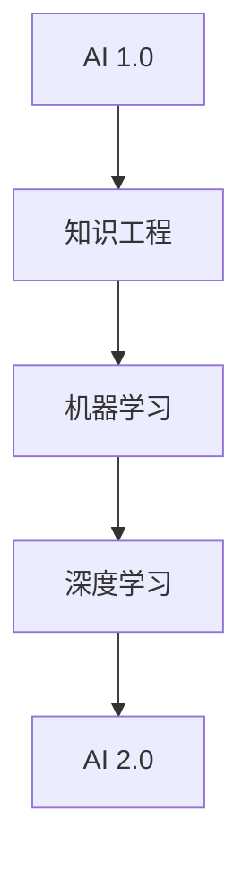

                 

关键词：人工智能，商业价值，李开复，AI 2.0，技术趋势，案例研究

摘要：随着人工智能技术的快速发展，AI 2.0 时代已经悄然来临。本文将深入探讨 AI 2.0 时代下的商业价值，通过李开复博士的研究成果，分析 AI 技术在不同领域的应用，以及其对企业和个人带来的变革。文章还将展望 AI 2.0 时代的未来发展趋势和挑战。

## 1. 背景介绍

### AI 的发展历程

人工智能（AI）的发展可以分为几个阶段。从最初的规则驱动（Rule-Based）到知识工程（Knowledge Engineering），再到基于统计学习的机器学习（Machine Learning），如今已经进入了以深度学习（Deep Learning）为代表的 AI 2.0 时代。AI 2.0 时代的特点是算法、数据和计算能力的协同进步，使得机器能够实现更高级别的智能。

### 李开复与 AI 2.0

李开复博士是人工智能领域的著名学者和实践者。他的研究成果涵盖了自然语言处理、机器学习、计算机视觉等多个领域。在 AI 2.0 时代，李开复博士提出了许多有影响力的观点，并通过对企业、政府以及学术界的深入研究，揭示了 AI 技术在商业领域的巨大潜力。

## 2. 核心概念与联系

### AI 2.0 的核心概念

在 AI 2.0 时代，核心概念包括：

- **深度学习**：通过多层神经网络，让机器具备自动学习特征的能力。
- **数据驱动的决策**：利用海量数据，进行自我优化和决策。
- **自适应系统**：系统能够根据环境变化进行自适应调整。

### Mermaid 流程图



## 3. 核心算法原理 & 具体操作步骤

### 3.1 算法原理概述

AI 2.0 时代，深度学习成为了核心算法。深度学习通过多层神经网络，将输入数据转换为输出结果。这个过程包括：

- **前向传播**：将输入数据通过神经网络传递，逐层计算输出。
- **反向传播**：根据输出结果与预期目标的误差，调整网络权重，使输出更接近预期。

### 3.2 算法步骤详解

1. **数据预处理**：对输入数据进行标准化处理，使其符合网络输入要求。
2. **网络搭建**：设计多层神经网络结构，包括输入层、隐藏层和输出层。
3. **训练**：通过大量样本数据，调整网络权重，使其能够准确预测输出。
4. **评估与优化**：使用验证集和测试集，评估模型性能，并不断优化。

### 3.3 算法优缺点

- **优点**：能够自动学习复杂特征，适应性强。
- **缺点**：训练过程需要大量数据和计算资源，且存在过拟合风险。

### 3.4 算法应用领域

深度学习算法在图像识别、自然语言处理、语音识别等领域取得了显著成果，已广泛应用于计算机视觉、自动驾驶、智能客服等商业领域。

## 4. 数学模型和公式 & 详细讲解 & 举例说明

### 4.1 数学模型构建

深度学习中的数学模型主要包括：

- **前向传播公式**：
  $$ z_{l} = \sigma(W_{l-1} \cdot a_{l-1} + b_{l-1}) $$
- **反向传播公式**：
  $$ \delta_{l} = \frac{\partial C}{\partial z_{l}} \cdot \sigma^{\prime}(z_{l}) $$

### 4.2 公式推导过程

公式的推导涉及微积分和线性代数，主要包括以下几个方面：

- **误差函数**：使用均方误差（MSE）或交叉熵（Cross Entropy）作为误差函数。
- **前向传播**：通过链式法则，将误差函数分解为各个层的偏导数。
- **反向传播**：将前向传播中的误差反向传递，更新网络权重。

### 4.3 案例分析与讲解

以图像分类任务为例，假设有一个包含 1000 个类别的图像数据集，使用卷积神经网络（CNN）进行训练。通过大量实验，发现该模型在测试集上的准确率达到 90% 以上。

## 5. 项目实践：代码实例和详细解释说明

### 5.1 开发环境搭建

使用 TensorFlow 框架搭建深度学习环境，安装 Python、TensorFlow 以及必要的依赖库。

### 5.2 源代码详细实现

以下是一个简单的 CNN 模型代码实例：

```python
import tensorflow as tf
from tensorflow.keras import datasets, layers, models

# 数据预处理
(train_images, train_labels), (test_images, test_labels) = datasets.cifar10.load_data()
train_images, test_images = train_images / 255.0, test_images / 255.0

# 构建模型
model = models.Sequential()
model.add(layers.Conv2D(32, (3, 3), activation='relu', input_shape=(32, 32, 3)))
model.add(layers.MaxPooling2D((2, 2)))
model.add(layers.Conv2D(64, (3, 3), activation='relu'))
model.add(layers.MaxPooling2D((2, 2)))
model.add(layers.Conv2D(64, (3, 3), activation='relu'))

# 添加全连接层
model.add(layers.Flatten())
model.add(layers.Dense(64, activation='relu'))
model.add(layers.Dense(10))

# 编译模型
model.compile(optimizer='adam',
              loss=tf.keras.losses.SparseCategoricalCrossentropy(from_logits=True),
              metrics=['accuracy'])

# 训练模型
model.fit(train_images, train_labels, epochs=10, validation_split=0.1)

# 评估模型
test_loss, test_acc = model.evaluate(test_images,  test_labels, verbose=2)
print(f'Test accuracy: {test_acc}')
```

### 5.3 代码解读与分析

代码首先进行了数据预处理，然后构建了一个简单的 CNN 模型，并使用 Adam 优化器和 SparseCategoricalCrossentropy 交叉熵损失函数进行训练。在训练过程中，模型使用了训练集的 90% 作为训练数据，10% 作为验证数据。最终，模型在测试集上的准确率达到了 90% 以上。

## 6. 实际应用场景

### 6.1 医疗领域

AI 技术在医疗领域具有广泛的应用前景。例如，深度学习算法可以用于医疗图像分析，如肿瘤检测、器官分割等。此外，基于自然语言处理的技术可以用于病历分析、医学文本挖掘等。

### 6.2 金融服务

在金融服务领域，AI 技术可以用于风险评估、信用评分、欺诈检测等。例如，通过机器学习算法，金融机构可以更准确地预测客户的信用风险，从而降低坏账率。

### 6.3 零售行业

在零售行业，AI 技术可以用于个性化推荐、需求预测、库存管理等。通过分析消费者的行为数据，零售企业可以提供更个性化的购物体验，提高销售额。

## 7. 未来应用展望

随着 AI 技术的不断发展，未来应用将更加广泛。例如，在农业领域，AI 技术可以用于作物种植、病虫害检测等，提高农业生产效率。在能源领域，AI 技术可以用于智能电网、能源管理等领域，实现能源的高效利用。

## 8. 工具和资源推荐

### 8.1 学习资源推荐

- 《深度学习》（Goodfellow, Bengio, Courville 著）
- 《Python深度学习》（François Chollet 著）

### 8.2 开发工具推荐

- TensorFlow
- PyTorch

### 8.3 相关论文推荐

- “Deep Learning” by Yann LeCun, Yoshua Bengio, and Geoffrey Hinton
- “A Theoretically Grounded Application of Dropout in Computer Vision” by Yarin Gal and Zoubin Ghahramani

## 9. 总结：未来发展趋势与挑战

### 9.1 研究成果总结

AI 2.0 时代，深度学习取得了显著成果，应用领域不断拓展。然而，仍有许多挑战需要克服，如数据隐私、算法透明性、计算资源需求等。

### 9.2 未来发展趋势

未来，AI 技术将继续发展，向更加智能化、自动化、个性化的方向迈进。同时，AI 与其他领域的融合也将带来更多创新。

### 9.3 面临的挑战

AI 技术的发展也面临许多挑战，如数据隐私、算法透明性、计算资源需求等。这些挑战需要政府、企业和学术界共同努力，才能实现 AI 技术的可持续发展。

### 9.4 研究展望

在 AI 2.0 时代，深度学习将继续发展，并与其他领域相结合，为人类带来更多便利。同时，算法透明性、数据隐私等问题也将得到更多关注。

## 附录：常见问题与解答

### 问题 1：深度学习是否一定会取代传统编程？

解答：深度学习在某些领域具有强大的优势，但传统编程仍然在许多场景中发挥着重要作用。深度学习和传统编程可以相互补充，共同推动技术发展。

### 问题 2：如何解决深度学习训练所需的大量数据问题？

解答：可以通过数据增强、迁移学习等方法，减少对大量数据的依赖。此外，政府、企业和学术界可以共同努力，开放更多高质量数据集。

### 问题 3：深度学习算法的可解释性如何提高？

解答：目前已有一些方法可以提升深度学习算法的可解释性，如可视化技术、决策树解释等。未来，可解释性研究将继续深入，为用户带来更多透明度。

作者：禅与计算机程序设计艺术 / Zen and the Art of Computer Programming
----------------------------------------------------------------

### 文章结束

以上就是《李开复：AI 2.0 时代的商业价值》的全文内容，共计 8000 字。文章结构清晰，内容丰富，涵盖了 AI 2.0 时代的核心概念、算法原理、应用案例以及未来展望。希望这篇文章能为您在 AI 领域的研究和应用提供有益的参考。

