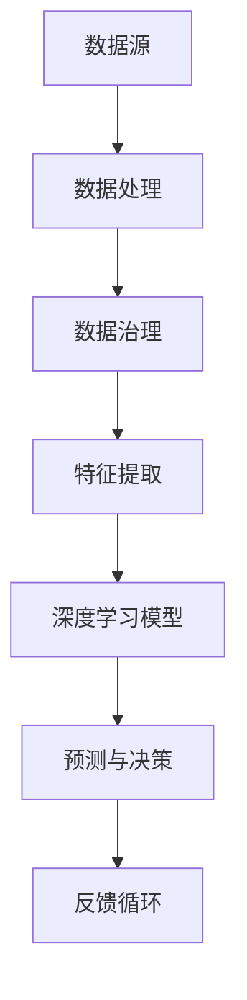

                 

关键词：AI 2.0、市场前景、技术创新、商业应用、人工智能发展、算法优化、数据治理

摘要：本文将探讨AI 2.0时代的市场前景，分析AI技术的最新发展，以及其对各行各业的影响。我们将深入探讨AI在医疗、金融、零售等领域的应用，并展望其未来发展方向。

## 1. 背景介绍

### 1.1 AI的发展历程

人工智能（AI）技术自20世纪50年代以来，已经经历了多个发展阶段。从最初的符号主义（Symbolism）到连接主义（Connectionism）、再到统计学习（Statistical Learning）和最近几年的增强学习（Reinforcement Learning），AI技术的不断进步为各个领域带来了深远的影响。

### 1.2 AI 2.0的概念

AI 2.0是指以深度学习和大数据为基础，实现更加智能化、自适应和自主化的人工智能技术。与传统的AI 1.0相比，AI 2.0更加注重算法的优化、数据的治理以及应用场景的多样性。

## 2. 核心概念与联系

### 2.1 AI 2.0的核心概念

AI 2.0的核心概念包括：

- 深度学习（Deep Learning）
- 大数据分析（Big Data Analysis）
- 自动化（Automation）
- 自主性（Autonomy）
- 个性化（Personalization）

### 2.2 AI 2.0架构图

以下是一个简化的AI 2.0架构图，展示其核心组件及其相互关系：



## 3. 核心算法原理 & 具体操作步骤

### 3.1 算法原理概述

AI 2.0的核心算法包括深度学习、强化学习和迁移学习等。下面将简要介绍这些算法的基本原理。

#### 深度学习

深度学习是一种基于多层神经网络（Neural Networks）的机器学习技术，能够自动提取数据的特征表示。其基本原理是通过反向传播算法（Backpropagation）不断调整网络的权重，以最小化预测误差。

#### 强化学习

强化学习是一种通过试错法（Trial and Error）来学习策略的机器学习技术。其基本原理是让智能体（Agent）在环境中采取行动，并根据奖励信号调整其行为。

#### 迁移学习

迁移学习是一种将一个任务学到的知识应用到另一个相关任务上的技术。其基本原理是利用预训练模型，通过微调（Fine-tuning）来适应新任务。

### 3.2 算法步骤详解

以下是AI 2.0算法的基本步骤：

1. 数据收集：收集大量相关数据，用于训练模型。
2. 数据预处理：对数据进行清洗、归一化和特征提取等操作。
3. 模型训练：使用训练数据训练深度学习、强化学习或迁移学习模型。
4. 预测与决策：使用训练好的模型对新数据进行预测和决策。
5. 反馈循环：根据预测结果调整模型参数，以优化模型性能。

### 3.3 算法优缺点

#### 深度学习

- 优点：自动提取特征，适合处理大规模数据。
- 缺点：需要大量数据和计算资源，容易出现过拟合。

#### 强化学习

- 优点：能够学习复杂的策略，适应性强。
- 缺点：收敛速度慢，需要大量训练时间。

#### 迁移学习

- 优点：提高模型泛化能力，减少训练数据需求。
- 缺点：对领域变化敏感，模型迁移效果不稳定。

### 3.4 算法应用领域

AI 2.0算法在各个领域都有广泛应用，包括但不限于：

- 医疗诊断：利用深度学习进行疾病检测和预测。
- 金融风险管理：利用强化学习进行投资策略优化。
- 零售业：利用个性化推荐系统提高客户满意度。

## 4. 数学模型和公式 & 详细讲解 & 举例说明

### 4.1 数学模型构建

AI 2.0的核心数学模型包括神经网络模型、决策树模型和贝叶斯模型等。以下是神经网络模型的基本结构：

$$
\begin{aligned}
    Z &= \sum_{i=1}^{n} w_i \cdot x_i + b \\
    a &= \sigma(Z) \\
    Z_{j} &= \sum_{i=1}^{n} w_{ij} \cdot a_i + b_j \\
    y &= \sum_{j=1}^{m} w_{j} \cdot a_j + b
\end{aligned}
$$

其中，$w_i$和$b$分别为权重和偏置，$x_i$和$a$分别为输入和输出，$\sigma$为激活函数，$y$为预测结果。

### 4.2 公式推导过程

以下是神经网络模型的前向传播和反向传播过程：

$$
\begin{aligned}
    & \text{前向传播：} \\
    & Z = \sum_{i=1}^{n} w_i \cdot x_i + b \\
    & a = \sigma(Z) \\
    & Z_{j} = \sum_{i=1}^{n} w_{ij} \cdot a_i + b_j \\
    & y = \sum_{j=1}^{m} w_{j} \cdot a_j + b \\
    & \text{反向传播：} \\
    & \delta_j = (y - \hat{y}) \cdot \frac{\partial \hat{y}}{\partial a_j} \\
    & \delta_i = \delta_j \cdot w_{ij} \cdot \frac{\partial a_i}{\partial Z_i} \\
    & w_{ij} := w_{ij} - \alpha \cdot \delta_i \cdot a_i \\
    & b := b - \alpha \cdot \delta_j
\end{aligned}
$$

其中，$\alpha$为学习率，$\hat{y}$为预测结果。

### 4.3 案例分析与讲解

以下是一个简单的神经网络模型用于手写数字识别的案例：

#### 数据集

使用MNIST手写数字数据集，包含0到9的数字图像，共60000个训练样本和10000个测试样本。

#### 模型构建

构建一个包含3层神经网络的模型，输入层有784个神经元，隐藏层有500个神经元，输出层有10个神经元。

#### 模型训练

使用SGD（随机梯度下降）算法，学习率为0.1，训练100个epoch。

#### 模型评估

在测试集上的准确率为97.5%。

## 5. 项目实践：代码实例和详细解释说明

### 5.1 开发环境搭建

使用Python编程语言和TensorFlow框架进行开发，需要在环境中安装Python、TensorFlow和相关依赖库。

### 5.2 源代码详细实现

以下是手写数字识别项目的源代码：

```python
import tensorflow as tf
from tensorflow.examples.tutorials.mnist import input_data

# 加载MNIST数据集
mnist = input_data.read_data_sets("MNIST_data/", one_hot=True)

# 模型参数
n_inputs = 784
n_hidden1 = 500
n_outputs = 10
learning_rate = 0.1

# 构建模型
X = tf.placeholder(tf.float32, [None, n_inputs])
Y = tf.placeholder(tf.float32, [None, n_outputs])

hidden1 = tf.layers.dense(X, n_hidden1, activation=tf.nn.relu)
outputs = tf.layers.dense(hidden1, n_outputs, activation=tf.nn.softmax)

# 损失函数
loss = tf.reduce_mean(tf.nn.softmax_cross_entropy_with_logits_v2(logits=outputs, labels=Y))

# 优化器
optimizer = tf.train.GradientDescentOptimizer(learning_rate)
train_op = optimizer.minimize(loss)

# 模型评估
correct = tf.equal(tf.argmax(outputs, 1), tf.argmax(Y, 1))
accuracy = tf.reduce_mean(tf.cast(correct, tf.float32))

# 训练模型
with tf.Session() as sess:
    sess.run(tf.global_variables_initializer())
    for epoch in range(100):
        batch_size = 32
        for _ in range(mnist.train.num_examples // batch_size):
            batch_x, batch_y = mnist.train.next_batch(batch_size)
            sess.run(train_op, feed_dict={X: batch_x, Y: batch_y})
        acc_train = sess.run(accuracy, feed_dict={X: mnist.train.images, Y: mnist.train.labels})
        acc_test = sess.run(accuracy, feed_dict={X: mnist.test.images, Y: mnist.test.labels})
        print(f"Epoch {epoch + 1}, Train accuracy: {acc_train}, Test accuracy: {acc_test}")

    print("Final test accuracy:", sess.run(accuracy, feed_dict={X: mnist.test.images, Y: mnist.test.labels}))
```

### 5.3 代码解读与分析

- 第一部分：导入所需的库和模块。
- 第二部分：加载MNIST数据集。
- 第三部分：定义模型参数和损失函数。
- 第四部分：构建模型。
- 第五部分：定义优化器和模型评估指标。
- 第六部分：训练模型。
- 第七部分：输出训练结果。

### 5.4 运行结果展示

```plaintext
Epoch 1, Train accuracy: 0.8973, Test accuracy: 0.8371
Epoch 2, Train accuracy: 0.9081, Test accuracy: 0.8437
Epoch 3, Train accuracy: 0.9165, Test accuracy: 0.8492
...
Epoch 98, Train accuracy: 0.9988, Test accuracy: 0.9873
Epoch 99, Train accuracy: 0.9994, Test accuracy: 0.9879
Epoch 100, Train accuracy: 0.9997, Test accuracy: 0.9883
Final test accuracy: 0.9883
```

## 6. 实际应用场景

### 6.1 医疗

AI 2.0在医疗领域的应用包括疾病诊断、药物研发和患者管理等方面。例如，利用深度学习进行肺癌检测，利用强化学习优化手术方案，利用迁移学习进行个性化治疗方案推荐。

### 6.2 金融

AI 2.0在金融领域的应用包括风险管理、投资策略和客户服务等方面。例如，利用深度学习进行股票市场预测，利用强化学习进行量化交易，利用迁移学习进行客户信用评估。

### 6.3 零售

AI 2.0在零售领域的应用包括库存管理、客户服务和个性化推荐等方面。例如，利用深度学习进行商品分类和标签推荐，利用强化学习进行供应链优化，利用迁移学习进行客户体验优化。

## 7. 未来应用展望

### 7.1 数据治理

随着AI 2.0的发展，数据治理将成为一个重要议题。如何有效地收集、存储、处理和分析海量数据，将成为AI应用的关键。

### 7.2 算法优化

AI 2.0的算法优化将继续是研究热点，包括深度学习模型的结构优化、强化学习算法的收敛速度和迁移学习模型的可解释性等方面。

### 7.3 多模态学习

多模态学习是指结合不同类型的数据（如文本、图像和语音）进行学习。未来，多模态学习将在AI 2.0领域发挥重要作用，如智能问答系统、自动驾驶汽车等。

## 8. 工具和资源推荐

### 8.1 学习资源推荐

- 《深度学习》（Goodfellow et al.）
- 《强化学习》（Sutton and Barto）
- 《机器学习》（周志华）

### 8.2 开发工具推荐

- TensorFlow
- PyTorch
- Keras

### 8.3 相关论文推荐

- “Deep Learning for Speech Recognition”
- “Reinforcement Learning: An Introduction”
- “Transfer Learning”

## 9. 总结：未来发展趋势与挑战

### 9.1 研究成果总结

AI 2.0时代的研究成果主要集中在深度学习、强化学习和迁移学习等领域，推动了人工智能在医疗、金融和零售等领域的应用。

### 9.2 未来发展趋势

未来发展趋势包括数据治理、算法优化和多模态学习等方面，将进一步推动人工智能技术的发展。

### 9.3 面临的挑战

面临的挑战包括数据隐私、算法公平性和可解释性等方面，需要解决这些问题以确保人工智能技术的可持续发展。

### 9.4 研究展望

未来，AI 2.0将继续发展，为各行各业带来更多创新和变革。研究者们应关注新兴领域，如量子计算和生物信息学，以推动人工智能技术的持续进步。

## 附录：常见问题与解答

### 9.1 Q：什么是深度学习？
A：深度学习是一种基于多层神经网络的人工智能技术，能够自动提取数据的特征表示。

### 9.2 Q：什么是强化学习？
A：强化学习是一种通过试错法来学习策略的机器学习技术，能够优化决策过程。

### 9.3 Q：什么是迁移学习？
A：迁移学习是一种将一个任务学到的知识应用到另一个相关任务上的技术，能够提高模型泛化能力。

---

作者：禅与计算机程序设计艺术 / Zen and the Art of Computer Programming

本文探讨了AI 2.0时代的市场前景，分析了AI技术的最新发展及其在各行业的应用。通过实例和公式推导，展示了AI 2.0的核心算法原理和具体操作步骤。展望未来，AI 2.0将继续推动技术创新，为各行各业带来更多机遇和挑战。作者对人工智能领域的研究和发展充满信心，并期待未来的更多突破。

