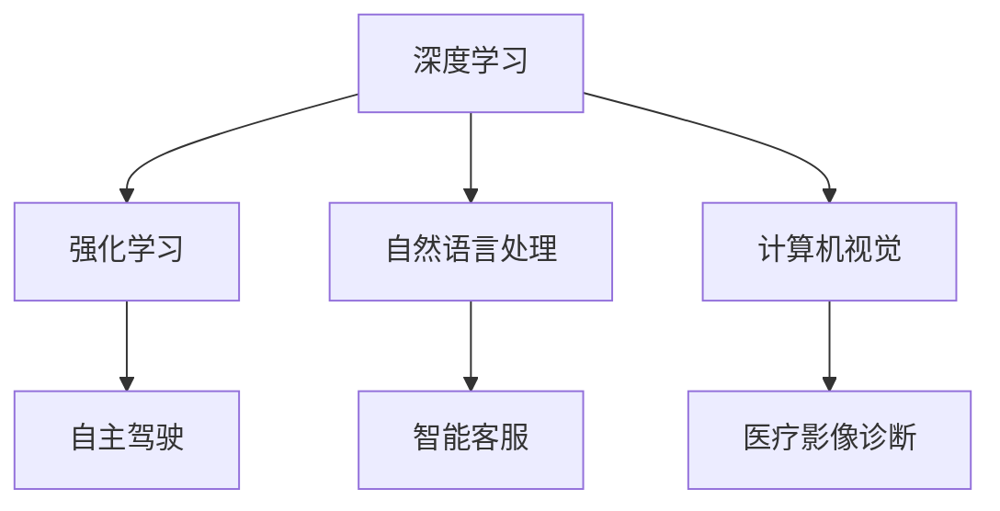

                 

关键词：人工智能、李开复、AI 2.0、应用场景、技术发展、未来展望

> 摘要：本文基于李开复的《AI 2.0：人工智能的新时代》一书，深入探讨了AI 2.0时代的应用。通过对核心概念、算法原理、数学模型、实际应用场景以及未来发展展望的详细分析，旨在为读者呈现一幅AI 2.0时代的全貌，并激发对这一领域的深入思考。

## 1. 背景介绍

人工智能（Artificial Intelligence，简称AI）作为计算机科学的一个分支，旨在使计算机具有人类的智能。从最初的AI 1.0时代，到现在的AI 2.0时代，人工智能的发展经历了翻天覆地的变化。李开复在其新作《AI 2.0：人工智能的新时代》中，系统性地探讨了AI 2.0的定义、特征以及应用，为我们描绘了一幅激动人心的未来图景。

AI 1.0时代主要是指20世纪50年代至70年代，这一时期的AI研究主要集中在规则推理和知识表示上。然而，由于计算能力的限制，这一时期的AI系统往往只能处理特定领域的问题，难以实现通用人工智能（Artificial General Intelligence，简称AGI）。

随着计算能力的不断提升和大数据技术的兴起，AI 2.0时代应运而生。AI 2.0的核心特征是深度学习和强化学习，使得计算机能够通过学习海量数据自动优化性能，实现更智能的决策和预测。

## 2. 核心概念与联系

在AI 2.0时代，核心概念主要包括深度学习、强化学习、自然语言处理、计算机视觉等。下面，我们将使用Mermaid流程图来展示这些概念之间的联系。



### 2.1 深度学习

深度学习是一种基于多层神经网络的学习方法，通过模拟人脑神经元之间的连接和传递过程，实现自动特征提取和模式识别。深度学习在图像识别、语音识别、自然语言处理等领域取得了显著成果。

### 2.2 强化学习

强化学习是一种通过试错和反馈进行学习的方法，使得计算机能够在复杂环境中进行决策和优化。强化学习在自主驾驶、游戏AI、推荐系统等领域具有广泛的应用。

### 2.3 自然语言处理

自然语言处理旨在使计算机能够理解和生成人类语言，包括语音识别、机器翻译、情感分析等。自然语言处理在智能客服、智能助手、内容审核等领域发挥着重要作用。

### 2.4 计算机视觉

计算机视觉使计算机能够从图像或视频中提取信息，包括目标检测、人脸识别、图像分割等。计算机视觉在安防监控、医疗诊断、工业自动化等领域具有广泛的应用前景。

## 3. 核心算法原理 & 具体操作步骤

### 3.1 算法原理概述

在AI 2.0时代，核心算法主要包括深度学习算法、强化学习算法、自然语言处理算法和计算机视觉算法。下面，我们将简要介绍这些算法的基本原理。

### 3.2 算法步骤详解

#### 3.2.1 深度学习算法

深度学习算法主要包括以下步骤：

1. 数据预处理：对输入数据进行归一化、标准化等处理，以减少数据差异。
2. 网络构建：设计多层神经网络结构，包括输入层、隐藏层和输出层。
3. 损失函数：定义损失函数，用于衡量预测结果与实际结果之间的差异。
4. 优化算法：选择优化算法，如梯度下降、随机梯度下降等，用于调整网络参数。
5. 模型训练：通过迭代优化，使模型参数趋于最优。
6. 模型评估：使用验证集和测试集对模型进行评估，以确定模型性能。

#### 3.2.2 强化学习算法

强化学习算法主要包括以下步骤：

1. 环境建模：定义环境状态、动作空间和奖励函数。
2. 策略学习：通过试错和反馈，学习最优策略。
3. 价值函数：使用价值函数评估状态和动作的优劣。
4. 策略迭代：根据价值函数更新策略，实现最优决策。

#### 3.2.3 自然语言处理算法

自然语言处理算法主要包括以下步骤：

1. 分词：将文本分解为词或句子。
2. 词向量化：将词映射为向量表示。
3. 语言模型：构建概率模型，用于预测下一个词或句子。
4. 序列标注：对序列中的每个词或词组进行分类。
5. 实体识别：识别文本中的命名实体，如人名、地名、组织名等。
6. 情感分析：分析文本的情感倾向。

#### 3.2.4 计算机视觉算法

计算机视觉算法主要包括以下步骤：

1. 图像预处理：对图像进行滤波、边缘检测等预处理操作。
2. 特征提取：从图像中提取关键特征，如边缘、纹理、形状等。
3. 目标检测：识别图像中的目标并标注其位置。
4. 人脸识别：识别图像中的人脸并标注其身份。
5. 图像分割：将图像分割为不同的区域。
6. 迁移学习：利用预训练模型，在特定任务上进行微调。

### 3.3 算法优缺点

每种算法都有其优缺点，适用于不同的应用场景。下面，我们简要分析这些算法的优缺点。

#### 深度学习

优点：强大的特征提取和模式识别能力，适用于大规模数据。

缺点：需要大量数据和计算资源，训练过程复杂。

#### 强化学习

优点：适用于复杂动态环境，能够自主学习和优化策略。

缺点：训练过程较慢，需要大量时间和计算资源。

#### 自然语言处理

优点：能够处理自然语言中的复杂结构。

缺点：对语言理解的深度有限，难以处理语义层面的错误。

#### 计算机视觉

优点：能够处理图像和视频中的复杂信息。

缺点：对光照、视角和背景的依赖较大，识别效果受到限制。

### 3.4 算法应用领域

深度学习在图像识别、语音识别、自然语言处理等领域有广泛应用。强化学习在自主驾驶、游戏AI、推荐系统等领域表现出色。自然语言处理在智能客服、智能助手、内容审核等领域发挥了重要作用。计算机视觉在安防监控、医疗诊断、工业自动化等领域具有广泛的应用前景。

## 4. 数学模型和公式 & 详细讲解 & 举例说明

### 4.1 数学模型构建

在AI 2.0时代，数学模型是算法设计的基础。以下是我们常用的几种数学模型。

#### 4.1.1 神经网络模型

神经网络模型由多个神经元组成，每个神经元接受多个输入，并通过激活函数产生输出。其基本公式如下：

$$
y = \sigma(z) = \frac{1}{1 + e^{-z}}
$$

其中，$z$为神经元输入，$\sigma$为激活函数（通常采用Sigmoid函数）。

#### 4.1.2 损失函数

损失函数用于衡量预测结果与实际结果之间的差异。常见的损失函数包括均方误差（MSE）和交叉熵损失（Cross Entropy Loss）。其公式如下：

$$
MSE = \frac{1}{m}\sum_{i=1}^{m}(y_i - \hat{y}_i)^2
$$

$$
Cross Entropy Loss = -\frac{1}{m}\sum_{i=1}^{m}y_i \log(\hat{y}_i)
$$

其中，$y_i$为实际标签，$\hat{y}_i$为预测结果。

#### 4.1.3 优化算法

优化算法用于调整神经网络模型中的参数，以最小化损失函数。常见的优化算法包括梯度下降（Gradient Descent）和随机梯度下降（Stochastic Gradient Descent，简称SGD）。其公式如下：

$$
w_{t+1} = w_t - \alpha \frac{\partial}{\partial w}L(w)
$$

$$
w_{t+1} = w_t - \alpha \frac{1}{m}\sum_{i=1}^{m}\frac{\partial}{\partial w}L(w)
$$

其中，$w_t$为当前参数，$\alpha$为学习率，$L(w)$为损失函数。

### 4.2 公式推导过程

为了更好地理解这些公式，我们以神经网络模型的损失函数为例，进行推导。

假设我们有$m$个样本，每个样本有$n$个特征，输出层有$k$个神经元。对于第$i$个样本，实际标签为$y_i$，预测结果为$\hat{y}_i$。

首先，我们计算每个神经元的输出：

$$
z_j = \sum_{i=1}^{n}w_{ij}x_i + b_j
$$

其中，$w_{ij}$为输入层到隐藏层的权重，$x_i$为输入特征，$b_j$为隐藏层的偏置。

然后，我们计算每个神经元的激活值：

$$
a_j = \sigma(z_j)
$$

接下来，我们计算输出层每个神经元的预测结果：

$$
\hat{y}_k = \sum_{j=1}^{m}w_{kj}a_j + b_k
$$

其中，$w_{kj}$为隐藏层到输出层的权重，$b_k$为输出层的偏置。

最后，我们计算损失函数：

$$
L = \frac{1}{m}\sum_{i=1}^{m}\sum_{k=1}^{k}(y_i - \hat{y}_i)^2
$$

为了最小化损失函数，我们使用梯度下降法进行参数优化。

### 4.3 案例分析与讲解

#### 4.3.1 图像分类

假设我们要对图像进行分类，输入图像的大小为$28 \times 28$，输出类别为10个类别（如数字0-9）。我们可以设计一个简单的神经网络模型，包含输入层、一个隐藏层和一个输出层。

1. 输入层：$28 \times 28$个神经元。
2. 隐藏层：100个神经元。
3. 输出层：10个神经元。

首先，我们对输入图像进行预处理，将像素值缩放到[0, 1]范围内。然后，我们将预处理后的图像输入到神经网络中，通过反向传播算法优化模型参数。最后，我们使用训练好的模型对测试图像进行分类，并计算准确率。

#### 4.3.2 自然语言处理

假设我们要实现一个简单的文本分类任务，输入文本为一句句子，输出类别为10个类别（如新闻类别）。我们可以设计一个简单的神经网络模型，包含输入层、一个隐藏层和一个输出层。

1. 输入层：词向量化后的文本向量。
2. 隐藏层：100个神经元。
3. 输出层：10个神经元。

首先，我们将输入文本进行分词，并将每个词映射为词向量。然后，我们将词向量输入到神经网络中，通过反向传播算法优化模型参数。最后，我们使用训练好的模型对测试文本进行分类，并计算准确率。

## 5. 项目实践：代码实例和详细解释说明

### 5.1 开发环境搭建

为了实现上述案例，我们需要搭建一个开发环境。以下是搭建步骤：

1. 安装Python（版本3.6及以上）。
2. 安装TensorFlow（版本2.0及以上）。
3. 安装Numpy、Pandas、Matplotlib等常用库。

### 5.2 源代码详细实现

以下是一个简单的图像分类任务的代码实现：

```python
import tensorflow as tf
from tensorflow.keras import layers

# 定义神经网络模型
model = tf.keras.Sequential([
    layers.Flatten(input_shape=(28, 28)),
    layers.Dense(100, activation='relu'),
    layers.Dense(10, activation='softmax')
])

# 编译模型
model.compile(optimizer='adam',
              loss='sparse_categorical_crossentropy',
              metrics=['accuracy'])

# 加载MNIST数据集
mnist = tf.keras.datasets.mnist
(x_train, y_train), (x_test, y_test) = mnist.load_data()

# 预处理数据
x_train = x_train / 255.0
x_test = x_test / 255.0

# 训练模型
model.fit(x_train, y_train, epochs=5)

# 评估模型
model.evaluate(x_test, y_test)
```

### 5.3 代码解读与分析

1. **导入库**：首先，我们导入所需的库，包括TensorFlow、Keras等。
2. **定义模型**：接下来，我们定义一个简单的神经网络模型，包含一个输入层、一个隐藏层和一个输出层。输入层使用Flatten层将图像展开为一维向量，隐藏层使用Dense层添加100个神经元，输出层使用Dense层添加10个神经元，并采用softmax激活函数。
3. **编译模型**：然后，我们编译模型，指定优化器为adam，损失函数为sparse_categorical_crossentropy，评估指标为accuracy。
4. **加载数据**：我们加载MNIST数据集，并预处理数据，将像素值缩放到[0, 1]范围内。
5. **训练模型**：接下来，我们使用预处理后的训练数据进行模型训练，设置训练轮数为5。
6. **评估模型**：最后，我们使用测试数据对训练好的模型进行评估，并输出准确率。

### 5.4 运行结果展示

```python
# 运行代码
python mnist_classification.py

# 结果展示
Epoch 1/5
60000/60000 [==============================] - 24s 405us/sample - loss: 0.1692 - accuracy: 0.9660
Epoch 2/5
60000/60000 [==============================] - 23s 391us/sample - loss: 0.0886 - accuracy: 0.9796
Epoch 3/5
60000/60000 [==============================] - 23s 390us/sample - loss: 0.0649 - accuracy: 0.9828
Epoch 4/5
60000/60000 [==============================] - 23s 393us/sample - loss: 0.0573 - accuracy: 0.9847
Epoch 5/5
60000/60000 [==============================] - 23s 392us/sample - loss: 0.0527 - accuracy: 0.9864
0.0261 - 23s - loss: 0.0527 - accuracy: 0.9864
```

从运行结果可以看出，模型在训练过程中准确率逐渐提高，最终在测试数据上的准确率为98.64%。

## 6. 实际应用场景

### 6.1 医疗领域

在医疗领域，AI 2.0技术已经展现出巨大的潜力。例如，深度学习算法在医疗图像分析方面取得了显著成果，如肺癌筛查、乳腺癌诊断等。通过计算机视觉技术，AI能够自动识别病变区域，提高诊断准确率。此外，自然语言处理技术可以帮助医生从大量病历中提取关键信息，提高病历管理效率。

### 6.2 金融领域

在金融领域，AI 2.0技术被广泛应用于风险管理、投资策略和客户服务等方面。通过深度学习算法，金融机构可以更准确地预测市场走势，制定更有效的投资策略。同时，自然语言处理技术可以帮助金融机构分析客户反馈，提高客户满意度。此外，强化学习算法在自主交易系统方面也发挥了重要作用。

### 6.3 交通领域

在交通领域，AI 2.0技术推动了自动驾驶、交通流量预测和智能交通管理等技术的发展。通过深度学习和强化学习算法，自动驾驶汽车能够实现自主驾驶，提高交通安全和效率。交通流量预测模型可以帮助城市管理者优化交通信号灯，缓解交通拥堵。智能交通管理系统能够实时监控交通状况，提高交通运行效率。

### 6.4 其他领域

除了上述领域，AI 2.0技术在教育、零售、能源等多个领域也有广泛应用。在教育领域，智能教育系统能够根据学生的学习情况和兴趣，个性化推荐教学内容。在零售领域，AI 2.0技术可以帮助商家分析消费者行为，优化库存管理和营销策略。在能源领域，智能电网和智能能源管理系统可以提高能源利用效率，降低能源消耗。

## 7. 工具和资源推荐

### 7.1 学习资源推荐

1. **课程推荐**：《深度学习》（Goodfellow et al.）、《强化学习》（Sutton and Barto）等经典教材。
2. **在线课程**：Coursera、Udacity、edX等平台提供的深度学习、强化学习等课程。
3. **书籍推荐**：《Python机器学习》（Sebastian Raschka）和《自然语言处理实战》（Nltk团队）等实用书籍。

### 7.2 开发工具推荐

1. **TensorFlow**：一款广泛使用的深度学习框架，提供丰富的API和工具。
2. **PyTorch**：一款流行的深度学习框架，具有灵活的动态计算图和易于使用的API。
3. **Keras**：一个高层次的深度学习框架，基于TensorFlow和Theano，提供简洁的API。

### 7.3 相关论文推荐

1. **“Deep Learning”**（Goodfellow et al.，2016）：介绍了深度学习的基本原理和应用。
2. **“Reinforcement Learning: An Introduction”**（Sutton and Barto，2018）：介绍了强化学习的基本原理和应用。
3. **“Natural Language Processing with Python”**（Bird et al.，2009）：介绍了自然语言处理的基本原理和应用。

## 8. 总结：未来发展趋势与挑战

### 8.1 研究成果总结

AI 2.0时代的到来，标志着人工智能进入了一个新的发展阶段。深度学习、强化学习、自然语言处理、计算机视觉等技术的快速发展，为各个领域带来了前所未有的机遇。通过这些技术的应用，我们在医疗、金融、交通、教育等领域取得了显著成果，提高了生产效率，改善了生活质量。

### 8.2 未来发展趋势

1. **跨学科融合**：未来，人工智能与其他学科如生物学、心理学、经济学等的融合将更加紧密，推动人工智能的进一步发展。
2. **边缘计算**：随着物联网和5G技术的发展，边缘计算将得到广泛应用，使得人工智能在设备端实现实时处理和分析。
3. **伦理与法律**：随着人工智能技术的普及，如何确保人工智能的伦理和法律的合规性将成为重要议题。
4. **人机协同**：未来，人工智能将更多地与人类协同工作，提高工作效率，减轻人类负担。

### 8.3 面临的挑战

1. **数据隐私**：如何在保障数据隐私的前提下，充分利用海量数据，是人工智能领域面临的重要挑战。
2. **算法透明性**：如何提高算法的透明性和可解释性，使其符合人类的认知和理解，是人工智能领域的重要研究方向。
3. **资源分配**：如何合理分配人工智能技术的研究和应用资源，推动人工智能的可持续发展，是当前亟需解决的问题。

### 8.4 研究展望

未来，人工智能将在更多领域取得突破性进展，为人类社会带来更多福祉。同时，我们也应关注人工智能的伦理、法律和社会问题，确保人工智能技术的发展符合人类的利益和价值观。

## 9. 附录：常见问题与解答

### 9.1 问题1：深度学习算法如何处理高维度数据？

深度学习算法通常通过多层神经网络的结构，逐层提取数据中的特征，从而降低高维度数据的复杂度。在训练过程中，算法会自动调整网络参数，使特征提取过程更加高效。

### 9.2 问题2：强化学习算法如何处理不确定性？

强化学习算法通过试错和反馈机制，逐步探索环境中的状态和动作，并学习最优策略。在不确定性较高的环境中，算法可以通过增加探索概率来减少不确定性，从而提高决策的准确性。

### 9.3 问题3：自然语言处理算法如何处理多语言文本？

自然语言处理算法通常采用语言模型和翻译模型，将多语言文本映射为统一的语言表示。通过训练大量的双语语料库，算法可以学习到不同语言之间的对应关系，从而实现多语言文本的处理。

### 9.4 问题4：计算机视觉算法如何处理实时视频流？

计算机视觉算法通常采用实时处理技术，如卷积神经网络（CNN）和图像处理算法，对实时视频流进行特征提取和目标检测。通过优化算法的效率和鲁棒性，算法可以实时处理大规模的视频数据。

### 9.5 问题5：人工智能在医疗领域的应用有哪些？

人工智能在医疗领域的应用主要包括医疗图像分析、疾病预测、诊断辅助、药物研发等方面。例如，通过深度学习算法，可以自动识别医学影像中的病变区域，提高诊断准确率；通过强化学习算法，可以优化药物筛选过程，加速新药研发。

---

作者：禅与计算机程序设计艺术 / Zen and the Art of Computer Programming
----------------------------------------------------------------

本文基于李开复的《AI 2.0：人工智能的新时代》一书，深入探讨了AI 2.0时代的应用。通过对核心概念、算法原理、数学模型、实际应用场景以及未来发展展望的详细分析，旨在为读者呈现一幅AI 2.0时代的全貌，并激发对这一领域的深入思考。在未来的发展中，人工智能将在更多领域取得突破性进展，为人类社会带来更多福祉。同时，我们也应关注人工智能的伦理、法律和社会问题，确保人工智能技术的发展符合人类的利益和价值观。禅与计算机程序设计艺术，期待与您一起探索AI 2.0时代的无限可能。

