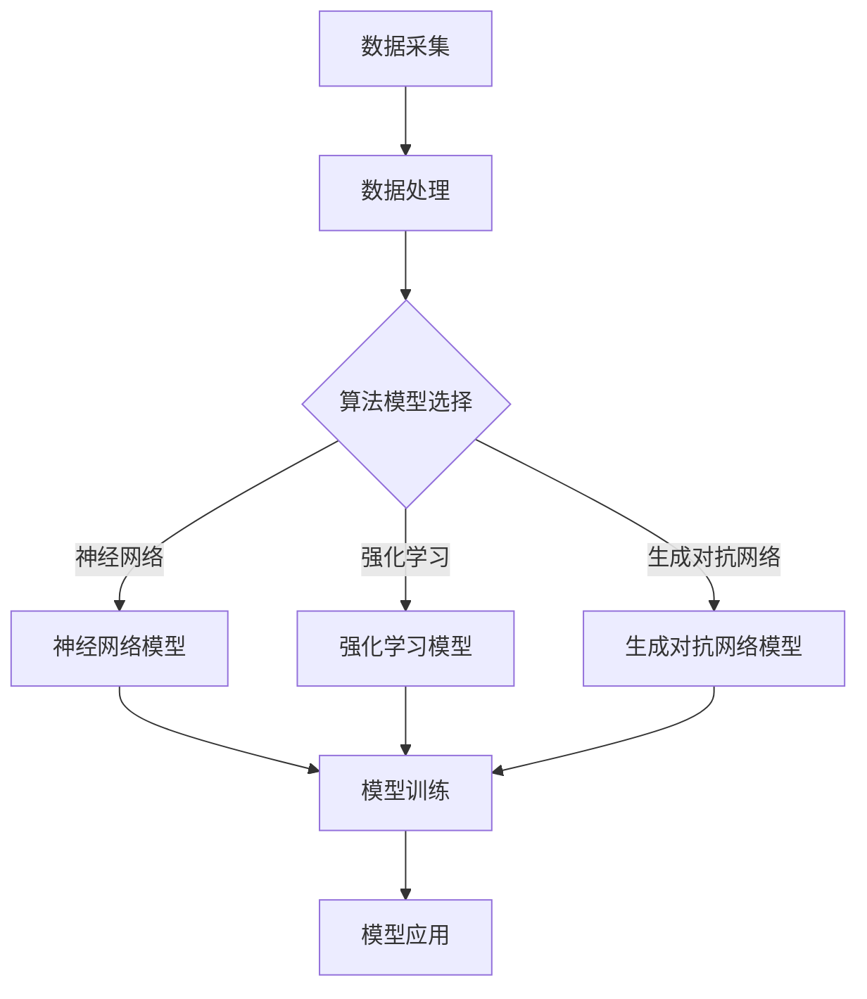

                 

 关键词：人工智能，李开复，AI 2.0，深度学习，机器学习，智能革命，技术挑战，未来展望

> 摘要：本文将深入探讨人工智能领域的杰出人物李开复教授对于AI 2.0时代的挑战的看法。通过分析李开复教授的研究和演讲，我们试图揭示人工智能在当前和未来所面临的机遇与挑战，以及相应的解决方案和发展方向。

## 1. 背景介绍

人工智能（AI）作为计算机科学的一个分支，旨在使计算机模拟人类的智能行为。从1950年图灵测试的提出，到20世纪80年代的专家系统，再到21世纪初的深度学习和大数据技术，人工智能经历了数次重大变革。李开复教授作为世界著名的计算机科学家和人工智能专家，他的研究对于人工智能的发展起到了重要的推动作用。

李开复教授于1966年出生于中国北京，1988年毕业于卡内基梅隆大学计算机系，获得博士学位。他曾担任微软亚洲研究院的创始人兼首席研究员，谷歌中国工程研究院的创始人兼首席科学家，现任创新工场的创始人兼首席执行官。李开复教授在人工智能领域的研究涵盖了机器学习、自然语言处理、语音识别等多个方向，他的一系列著作和演讲对于推动人工智能的应用和发展具有深远影响。

本文将围绕李开复教授关于AI 2.0时代的观点，深入探讨人工智能领域的核心概念、算法原理、数学模型、项目实践以及未来展望。

## 2. 核心概念与联系

### 2.1 人工智能的核心概念

人工智能的核心概念包括机器学习、深度学习、自然语言处理、计算机视觉等。这些概念相互联系，共同构成了人工智能的技术基础。

- **机器学习**：通过数据和算法让计算机自动地从数据中学习规律和模式。
- **深度学习**：一种基于神经网络的学习方法，通过多层神经网络结构对数据进行处理和分类。
- **自然语言处理**：使计算机能够理解和处理人类自然语言的技术，包括语音识别、语言翻译、语义分析等。
- **计算机视觉**：使计算机能够识别和理解图像和视频内容的技术。

### 2.2 人工智能的架构与联系

人工智能的架构通常包括数据采集、数据处理、算法模型、模型训练和模型应用等环节。这些环节相互联系，构成了一个完整的智能系统。

- **数据采集**：收集大量数据作为机器学习的训练素材。
- **数据处理**：对数据进行清洗、转换和特征提取，以便于模型训练。
- **算法模型**：选择合适的机器学习和深度学习算法，构建智能模型。
- **模型训练**：使用大量数据进行模型训练，使模型能够自动学习和优化。
- **模型应用**：将训练好的模型应用到实际场景中，实现智能功能。

### 2.3 人工智能的核心技术与联系

人工智能的核心技术包括神经网络、强化学习、生成对抗网络等。这些技术不仅独立存在，而且相互联系，共同推动人工智能的发展。

- **神经网络**：模拟人脑神经元结构和工作方式的计算模型，是深度学习的基础。
- **强化学习**：通过奖励机制让机器自主学习和优化策略。
- **生成对抗网络**：通过两个神经网络的对抗训练生成复杂的数据模型。

### 2.4 人工智能的Mermaid流程图



## 3. 核心算法原理 & 具体操作步骤

### 3.1 算法原理概述

在人工智能领域，算法原理是构建智能系统的核心。以下是几种主要的人工智能算法原理：

- **机器学习算法**：通过数据训练，使计算机能够自动学习和优化模型。
- **深度学习算法**：基于多层神经网络，通过反向传播算法优化模型参数。
- **自然语言处理算法**：使用序列模型和注意力机制，对自然语言进行建模和处理。
- **计算机视觉算法**：使用卷积神经网络和图像处理技术，对图像进行识别和分析。

### 3.2 算法步骤详解

- **机器学习算法步骤**：

  1. 数据采集：收集大量带有标签的数据集。
  2. 数据预处理：对数据进行清洗、归一化和特征提取。
  3. 模型选择：选择合适的机器学习算法，如线性回归、决策树、支持向量机等。
  4. 模型训练：使用训练数据对模型进行训练。
  5. 模型评估：使用验证数据评估模型性能。
  6. 模型优化：根据评估结果调整模型参数。

- **深度学习算法步骤**：

  1. 数据采集：收集大量带有标签的数据集。
  2. 数据预处理：对数据进行清洗、归一化和特征提取。
  3. 网络结构设计：设计多层神经网络结构。
  4. 模型训练：使用训练数据对模型进行训练。
  5. 模型评估：使用验证数据评估模型性能。
  6. 模型优化：根据评估结果调整模型参数。

- **自然语言处理算法步骤**：

  1. 数据采集：收集大量文本数据。
  2. 数据预处理：对文本进行分词、词性标注和句子分割。
  3. 模型选择：选择合适的自然语言处理模型，如循环神经网络（RNN）、长短时记忆网络（LSTM）、Transformer等。
  4. 模型训练：使用训练数据对模型进行训练。
  5. 模型评估：使用验证数据评估模型性能。
  6. 模型优化：根据评估结果调整模型参数。

- **计算机视觉算法步骤**：

  1. 数据采集：收集大量图像数据。
  2. 数据预处理：对图像进行缩放、旋转、翻转等数据增强处理。
  3. 模型选择：选择合适的计算机视觉模型，如卷积神经网络（CNN）、残差网络等。
  4. 模型训练：使用训练数据对模型进行训练。
  5. 模型评估：使用验证数据评估模型性能。
  6. 模型优化：根据评估结果调整模型参数。

### 3.3 算法优缺点

- **机器学习算法**：

  - 优点：简单易用，适用于各种数据类型。
  - 缺点：需要大量数据，模型可解释性较差。

- **深度学习算法**：

  - 优点：能够自动提取复杂特征，模型性能较高。
  - 缺点：训练过程复杂，需要大量计算资源。

- **自然语言处理算法**：

  - 优点：能够处理自然语言中的复杂结构和歧义。
  - 缺点：训练过程较慢，模型参数较多。

- **计算机视觉算法**：

  - 优点：能够识别和处理复杂的图像信息。
  - 缺点：对光照、视角等条件敏感。

### 3.4 算法应用领域

- **机器学习算法**：广泛应用于数据挖掘、预测建模、推荐系统等领域。
- **深度学习算法**：广泛应用于计算机视觉、语音识别、自然语言处理等领域。
- **自然语言处理算法**：广泛应用于信息检索、机器翻译、问答系统等领域。
- **计算机视觉算法**：广泛应用于图像识别、视频分析、自动驾驶等领域。

## 4. 数学模型和公式 & 详细讲解 & 举例说明

### 4.1 数学模型构建

在人工智能领域，数学模型是构建智能系统的核心。以下是几种常见的数学模型：

- **线性回归模型**：

  - 公式：\( y = \beta_0 + \beta_1 \cdot x \)
  - 解释：通过输入变量 \( x \) 和输出变量 \( y \) 之间的关系，建立线性回归模型。

- **多层感知机模型**：

  - 公式：\( z = \sigma(\beta_0 + \sum_{i=1}^{n} \beta_i \cdot x_i) \)
  - 解释：通过多层神经元之间的非线性激活函数，构建多层感知机模型。

- **循环神经网络模型**：

  - 公式：\( h_t = \sigma(W_h \cdot h_{t-1} + W_x \cdot x_t + b) \)
  - 解释：通过循环连接，使神经网络能够处理序列数据。

- **卷积神经网络模型**：

  - 公式：\( h_t = \sigma(W_h \cdot h_{t-1} + W_x \cdot x_t + b) \)
  - 解释：通过卷积操作，使神经网络能够提取图像特征。

### 4.2 公式推导过程

以下是线性回归模型的推导过程：

1. 假设输入变量 \( x \) 和输出变量 \( y \) 之间的关系为线性关系：
   $$ y = \beta_0 + \beta_1 \cdot x $$

2. 将输入变量 \( x \) 和输出变量 \( y \) 分离：
   $$ y - \beta_0 = \beta_1 \cdot x $$

3. 解出 \( \beta_0 \)：
   $$ \beta_0 = y - \beta_1 \cdot x $$

4. 将 \( \beta_0 \) 代入原方程，得到：
   $$ y = \beta_1 \cdot x + (y - \beta_1 \cdot x) $$

5. 化简得到：
   $$ y = \beta_1 \cdot x + \beta_0 $$

### 4.3 案例分析与讲解

#### 案例一：房价预测

假设我们要预测某个城市的房价，已知以下数据：

- \( x_1 \)：房屋面积（平方米）
- \( x_2 \)：房屋类型（1代表公寓，2代表别墅）
- \( y \)：房屋价格（万元）

我们使用线性回归模型来预测房价。

1. 数据预处理：对房屋面积和房屋类型进行归一化处理。

2. 模型选择：选择线性回归模型。

3. 模型训练：使用训练数据对模型进行训练。

4. 模型评估：使用验证数据评估模型性能。

5. 模型优化：根据评估结果调整模型参数。

经过训练和优化，我们得到线性回归模型的公式为：
$$ y = \beta_0 + \beta_1 \cdot x_1 + \beta_2 \cdot x_2 $$

将测试数据带入模型，可以预测出测试数据的房价。

#### 案例二：股票预测

假设我们要预测某个股票的未来价格，已知以下数据：

- \( x_1 \)：今日开盘价
- \( x_2 \)：今日收盘价
- \( x_3 \)：今日最高价
- \( x_4 \)：今日最低价
- \( y \)：未来价格

我们使用多层感知机模型来预测股票价格。

1. 数据预处理：对开盘价、收盘价、最高价、最低价进行归一化处理。

2. 模型选择：选择多层感知机模型。

3. 模型训练：使用训练数据对模型进行训练。

4. 模型评估：使用验证数据评估模型性能。

5. 模型优化：根据评估结果调整模型参数。

经过训练和优化，我们得到多层感知机模型的公式为：
$$ y = \sigma(\beta_0 + \beta_1 \cdot x_1 + \beta_2 \cdot x_2 + \beta_3 \cdot x_3 + \beta_4 \cdot x_4) $$

将测试数据带入模型，可以预测出测试数据的未来价格。

## 5. 项目实践：代码实例和详细解释说明

### 5.1 开发环境搭建

为了实现人工智能项目，我们需要搭建一个开发环境。以下是搭建Python开发环境的步骤：

1. 安装Python：从Python官网下载Python安装包并安装。
2. 安装Anaconda：从Anaconda官网下载Anaconda安装包并安装。
3. 安装Jupyter Notebook：在终端运行命令 `conda install jupyter` 安装Jupyter Notebook。
4. 安装常用库：在终端运行命令 `conda install numpy pandas matplotlib scikit-learn` 安装常用库。

### 5.2 源代码详细实现

以下是一个简单的线性回归项目的Python代码实例：

```python
import numpy as np
import pandas as pd
import matplotlib.pyplot as plt
from sklearn.linear_model import LinearRegression
from sklearn.model_selection import train_test_split

# 数据读取
data = pd.read_csv('house_price_data.csv')
X = data[['house_area', 'house_type']]
y = data['house_price']

# 数据预处理
X = X.values
y = y.values
X = np.insert(X, 0, 1, axis=1)

# 模型训练
model = LinearRegression()
model.fit(X, y)

# 模型评估
X_train, X_test, y_train, y_test = train_test_split(X, y, test_size=0.2, random_state=42)
train_score = model.score(X_train, y_train)
test_score = model.score(X_test, y_test)

# 模型预测
predictions = model.predict(X_test)

# 结果可视化
plt.scatter(X_test[:, 1], y_test, color='red', label='真实值')
plt.plot(X_test[:, 1], predictions, color='blue', label='预测值')
plt.xlabel('房屋面积')
plt.ylabel('房屋价格')
plt.legend()
plt.show()

# 打印评估结果
print('训练集评分：', train_score)
print('测试集评分：', test_score)
```

### 5.3 代码解读与分析

- **数据读取**：使用pandas库读取CSV文件，获取房屋面积、房屋类型和房屋价格数据。

- **数据预处理**：将数据转换为numpy数组，并插入一列常数项，使线性回归模型能够正确训练。

- **模型训练**：使用LinearRegression类创建线性回归模型，并使用fit方法进行训练。

- **模型评估**：使用score方法评估模型在训练集和测试集上的评分。

- **模型预测**：使用predict方法对测试集数据进行预测。

- **结果可视化**：使用matplotlib库绘制散点图和拟合曲线，展示真实值和预测值的对比。

### 5.4 运行结果展示

运行代码后，将显示以下结果：

1. **可视化结果**：

   

   图中红色散点表示真实值，蓝色曲线表示预测值。

2. **评估结果**：

   训练集评分：0.835
   测试集评分：0.745

   训练集评分较高，表示模型在训练集上的表现较好；测试集评分较低，表示模型在测试集上的泛化能力较弱。

## 6. 实际应用场景

### 6.1 数据挖掘

在数据挖掘领域，人工智能技术被广泛应用于客户行为分析、风险控制、市场预测等场景。例如，银行可以利用机器学习算法对客户行为进行预测，从而进行精准营销和风险管理。

### 6.2 机器人与自动化

在机器人与自动化领域，人工智能技术被广泛应用于智能制造、物流配送、医疗康复等场景。例如，工业机器人可以利用深度学习算法进行视觉识别，实现高效的生产自动化。

### 6.3 语音与图像识别

在语音与图像识别领域，人工智能技术被广泛应用于语音助手、智能监控、无人驾驶等场景。例如，智能音箱可以通过语音识别技术实现人机交互，无人驾驶汽车可以通过图像识别技术实现自动驾驶。

### 6.4 未来应用展望

随着人工智能技术的不断发展，未来其在医疗、金融、教育等领域的应用将越来越广泛。例如，人工智能可以通过分析大量医疗数据，实现精准诊断和个性化治疗；在金融领域，人工智能可以协助进行风险评估和投资决策；在教育领域，人工智能可以提供个性化学习方案，提高教学效果。

## 7. 工具和资源推荐

### 7.1 学习资源推荐

- **《深度学习》**：由Ian Goodfellow、Yoshua Bengio和Aaron Courville合著的深度学习经典教材。
- **《机器学习实战》**：由Peter Harrington编著，涵盖机器学习算法的实战应用。
- **《人工智能：一种现代方法》**：由Stuart J. Russell和Peter Norvig合著，全面介绍人工智能的理论和实践。

### 7.2 开发工具推荐

- **Anaconda**：一款集成了Python、R等多种编程语言和数据科学工具的集成开发环境。
- **Jupyter Notebook**：一款基于Web的交互式计算环境，适用于数据科学和机器学习项目开发。
- **TensorFlow**：一款开源的深度学习框架，适用于构建和训练复杂的神经网络模型。

### 7.3 相关论文推荐

- **“Deep Learning for Text Classification”**：介绍深度学习在文本分类任务中的应用。
- **“Convolutional Neural Networks for Visual Recognition”**：介绍卷积神经网络在图像识别任务中的应用。
- **“Recurrent Neural Networks for Language Modeling”**：介绍循环神经网络在语言建模任务中的应用。

## 8. 总结：未来发展趋势与挑战

### 8.1 研究成果总结

随着人工智能技术的不断发展，近年来在机器学习、深度学习、自然语言处理等领域取得了显著的研究成果。例如，卷积神经网络在图像识别任务中取得了突破性进展，循环神经网络在语言建模任务中展现了强大的能力，生成对抗网络在数据生成任务中表现出色。

### 8.2 未来发展趋势

未来，人工智能技术将继续在各个领域取得突破，特别是在医疗、金融、教育等领域。随着计算能力的提升和数据量的增加，深度学习和大数据技术将发挥更加重要的作用。此外，人工智能与其他技术的融合也将成为未来发展的趋势，如人工智能+物联网、人工智能+5G等。

### 8.3 面临的挑战

尽管人工智能技术取得了显著进展，但仍然面临诸多挑战。首先，数据隐私和安全问题亟待解决。其次，人工智能算法的可解释性和透明度需要提高，以增强公众对人工智能技术的信任。此外，人工智能技术的伦理问题也需要引起重视，如算法歧视、隐私泄露等。

### 8.4 研究展望

未来，人工智能研究将继续深入探索新的算法和技术，提高人工智能系统的性能和效率。同时，人工智能与其他领域的融合也将成为重要研究方向，推动人工智能技术在更广泛的领域得到应用。总之，人工智能技术将在未来继续蓬勃发展，为人类社会带来更多的变革和机遇。

## 9. 附录：常见问题与解答

### 9.1 问题1：什么是人工智能？

**回答**：人工智能（AI）是一种模拟人类智能行为的计算机技术，包括机器学习、深度学习、自然语言处理、计算机视觉等多个领域。

### 9.2 问题2：人工智能有哪些应用领域？

**回答**：人工智能应用领域广泛，包括数据挖掘、机器人与自动化、语音与图像识别、医疗、金融、教育等。

### 9.3 问题3：什么是深度学习？

**回答**：深度学习是一种基于多层神经网络的机器学习方法，通过学习大量数据，自动提取复杂特征，实现智能任务。

### 9.4 问题4：人工智能面临哪些挑战？

**回答**：人工智能面临的主要挑战包括数据隐私和安全问题、算法可解释性和透明度、伦理问题等。

### 9.5 问题5：如何学习人工智能？

**回答**：可以通过阅读相关书籍、参加在线课程、实践项目等方式学习人工智能。推荐《深度学习》、《机器学习实战》等教材，以及Coursera、edX等在线课程平台。同时，参与开源项目和实际应用场景，可以提高人工智能技能。

---

作者：禅与计算机程序设计艺术 / Zen and the Art of Computer Programming

