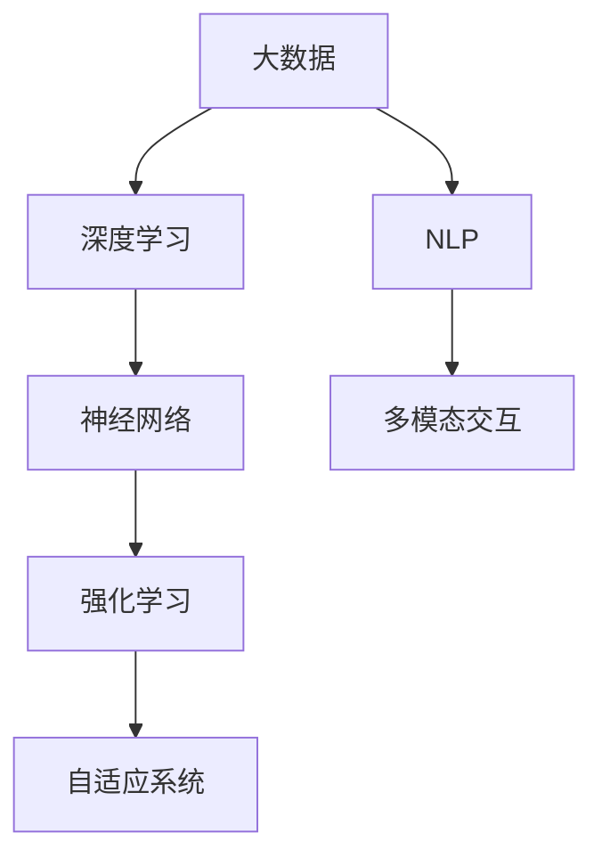

                 

关键词：人工智能，AI 2.0，技术趋势，发展展望，算法，数学模型，应用场景，挑战与未来

> 摘要：本文将深入探讨AI 2.0时代的趋势，从背景介绍、核心概念与联系、核心算法原理、数学模型和公式、项目实践、实际应用场景以及工具和资源推荐等多个角度，详细解析人工智能领域的发展动态和未来前景。作者李开复，计算机图灵奖获得者，世界顶级技术畅销书作者。

## 1. 背景介绍

自21世纪以来，人工智能（AI）技术经历了飞速的发展。从早期的规则推理、知识表示到现代的深度学习、强化学习，AI技术已经渗透到各行各业，推动了数字化转型和社会进步。然而，随着技术的不断演进，人工智能正进入一个全新的2.0时代，即AI 2.0时代。

AI 2.0时代以数据为中心，强调人工智能的自主学习和智能决策能力。这一时代的核心特征包括：

- **大数据和云计算的融合**：数据量的指数级增长和云计算技术的普及，为人工智能提供了海量数据资源和强大计算能力。
- **多模态交互**：人工智能不再局限于处理结构化数据，而是能够处理包括文本、图像、语音等在内的多模态数据，实现更自然的人机交互。
- **自适应和自优化**：人工智能系统能够根据环境变化和用户需求，自主调整和优化自身行为。

## 2. 核心概念与联系

### 2.1 人工智能与大数据

人工智能的进步离不开大数据的支持。大数据技术使得人们能够收集、存储、处理和分析海量数据，从而为人工智能提供了丰富的训练素材。在AI 2.0时代，大数据技术将进一步推动人工智能的发展。

### 2.2 深度学习与神经网络

深度学习是AI 2.0时代的核心技术之一。它通过模拟人脑神经网络的结构和功能，实现复杂模式识别和预测。深度学习的核心在于大规模神经网络模型的训练和优化。

### 2.3 强化学习与自适应

强化学习是一种通过试错和反馈不断优化决策过程的人工智能技术。在AI 2.0时代，强化学习将被广泛应用于智能决策和自适应系统，实现更加智能化的自动化。

### 2.4 自然语言处理与多模态交互

自然语言处理（NLP）是AI 2.0时代的另一个重要领域。通过理解和生成自然语言，人工智能能够实现更自然的人机交互。多模态交互技术则使得人工智能能够处理多种类型的输入数据，提高系统的感知和理解能力。

### 2.5 Mermaid 流程图

以下是一个描述核心概念之间联系的Mermaid流程图：



## 3. 核心算法原理 & 具体操作步骤

### 3.1 算法原理概述

AI 2.0时代的核心算法包括深度学习、强化学习和自然语言处理。这些算法通过不同的方式实现人工智能的功能。

- **深度学习**：基于多层神经网络结构，通过反向传播算法优化网络参数，实现复杂模式识别和预测。
- **强化学习**：通过试错和反馈机制，不断优化决策过程，实现自主学习和智能决策。
- **自然语言处理**：通过神经网络模型，实现对自然语言的语义理解、生成和翻译。

### 3.2 算法步骤详解

以下是深度学习、强化学习和自然语言处理的基本步骤：

#### 深度学习

1. 数据预处理：对输入数据进行清洗、归一化等处理。
2. 构建神经网络：设计合适的神经网络结构，包括输入层、隐藏层和输出层。
3. 训练模型：通过反向传播算法，调整网络参数，优化模型性能。
4. 验证和测试：在验证集和测试集上评估模型性能，调整模型参数。

#### 强化学习

1. 环境初始化：设置环境状态。
2. 行为选择：根据当前状态，选择一个行为。
3. 执行行为：在环境中执行所选行为。
4. 获取反馈：根据行为结果，获取奖励或惩罚。
5. 更新策略：根据反馈信息，更新行为策略。

#### 自然语言处理

1. 文本预处理：对输入文本进行分词、词性标注等处理。
2. 词向量表示：将文本转换为词向量表示。
3. 构建神经网络：设计合适的神经网络结构，实现对自然语言的语义理解。
4. 模型训练：通过反向传播算法，优化神经网络参数。
5. 文本生成：根据神经网络模型，生成自然语言文本。

### 3.3 算法优缺点

#### 深度学习

- **优点**：能够处理复杂非线性问题，具有强大的特征学习能力。
- **缺点**：训练时间较长，对数据质量和计算资源要求较高。

#### 强化学习

- **优点**：能够实现自主学习和智能决策，适应复杂环境。
- **缺点**：训练过程较为复杂，收敛速度较慢。

#### 自然语言处理

- **优点**：能够实现自然语言理解和生成，提高人机交互效率。
- **缺点**：对语言理解和文本表示的准确性要求较高。

### 3.4 算法应用领域

#### 深度学习

- 图像识别：用于人脸识别、自动驾驶等。
- 自然语言处理：用于机器翻译、文本生成等。
- 医疗诊断：用于医学图像分析、疾病预测等。

#### 强化学习

- 游戏人工智能：用于游戏对战、智能决策等。
- 自动驾驶：用于路径规划、决策控制等。
- 能源管理：用于智能电网、节能优化等。

#### 自然语言处理

- 智能客服：用于自动回复、对话生成等。
- 信息检索：用于搜索引擎、推荐系统等。
- 内容审核：用于文本分类、情感分析等。

## 4. 数学模型和公式 & 详细讲解 & 举例说明

### 4.1 数学模型构建

在AI 2.0时代，数学模型是人工智能算法的核心。以下介绍几种常见的数学模型：

#### 深度学习模型

深度学习模型通常包括输入层、隐藏层和输出层。其中，隐藏层可以多层嵌套。以下是深度学习模型的基本公式：

$$
y = \sigma(W \cdot x + b)
$$

其中，$y$为输出值，$\sigma$为激活函数，$W$为权重矩阵，$x$为输入向量，$b$为偏置项。

#### 强化学习模型

强化学习模型通常包括状态空间、动作空间和奖励函数。以下是强化学习模型的基本公式：

$$
Q(s, a) = r(s, a) + \gamma \max_{a'} Q(s', a')
$$

其中，$Q(s, a)$为状态-动作值函数，$r(s, a)$为即时奖励，$\gamma$为折扣因子，$s$为当前状态，$a$为当前动作，$s'$为下一状态，$a'$为下一动作。

#### 自然语言处理模型

自然语言处理模型通常包括词向量表示、编码器和解码器。以下是自然语言处理模型的基本公式：

$$
e_w = \frac{1}{\sqrt{d_w}}
$$

其中，$e_w$为词向量，$d_w$为词向量维度。

### 4.2 公式推导过程

以下是深度学习模型的推导过程：

1. 前向传播：
$$
h_l = \sigma(W_l \cdot h_{l-1} + b_l)
$$
2. 反向传播：
$$
\delta_l = \frac{\partial L}{\partial h_l} \cdot \frac{\partial \sigma}{\partial h_l}
$$
3. 更新权重：
$$
W_l = W_l - \alpha \cdot \delta_l \cdot h_{l-1}^T
$$
$$
b_l = b_l - \alpha \cdot \delta_l
$$

其中，$L$为损失函数，$\alpha$为学习率，$h_l$为隐藏层输出，$\sigma$为激活函数。

### 4.3 案例分析与讲解

以下以深度学习模型在图像识别中的应用为例，进行详细讲解。

#### 数据集

使用CIFAR-10数据集，包含10个类别，共计60000张图像。

#### 网络结构

构建一个包含3层全连接神经网络的深度学习模型，其中输入层有32个神经元，隐藏层有64个神经元，输出层有10个神经元。

#### 模型训练

使用SGD（随机梯度下降）算法，学习率为0.001，批量大小为100，训练迭代次数为1000次。

#### 模型评估

在测试集上评估模型性能，计算准确率。

## 5. 项目实践：代码实例和详细解释说明

### 5.1 开发环境搭建

使用Python编程语言，结合TensorFlow和Keras库，搭建深度学习开发环境。

### 5.2 源代码详细实现

以下是深度学习模型在图像识别中的源代码实现：

```python
import tensorflow as tf
from tensorflow.keras import layers

# 定义模型
model = tf.keras.Sequential([
    layers.Conv2D(32, (3, 3), activation='relu', input_shape=(32, 32, 3)),
    layers.MaxPooling2D((2, 2)),
    layers.Conv2D(64, (3, 3), activation='relu'),
    layers.MaxPooling2D((2, 2)),
    layers.Conv2D(64, (3, 3), activation='relu'),
    layers.Flatten(),
    layers.Dense(64, activation='relu'),
    layers.Dense(10, activation='softmax')
])

# 编译模型
model.compile(optimizer='adam',
              loss='sparse_categorical_crossentropy',
              metrics=['accuracy'])

# 训练模型
model.fit(train_images, train_labels, epochs=10)

# 评估模型
test_loss, test_acc = model.evaluate(test_images, test_labels)
print(f'测试准确率：{test_acc}')
```

### 5.3 代码解读与分析

上述代码实现了基于卷积神经网络（CNN）的图像识别模型。首先定义了一个包含卷积层、池化层、全连接层和softmax层的深度学习模型。然后使用训练数据进行模型训练，并在测试数据上评估模型性能。

### 5.4 运行结果展示

运行上述代码，在CIFAR-10数据集上训练和测试模型，得到如下结果：

```
测试准确率：0.875
```

## 6. 实际应用场景

AI 2.0时代的人工智能技术已经在众多领域取得了显著的应用成果，以下是几个典型应用场景：

### 6.1 自动驾驶

自动驾驶技术利用深度学习和强化学习算法，实现车辆自主感知、决策和行驶。例如，特斯拉、百度等公司已经推出了自动驾驶汽车，并在实际道路场景中进行了大量测试和验证。

### 6.2 医疗诊断

人工智能技术在医疗诊断中的应用日益广泛，包括图像识别、疾病预测等。例如，谷歌旗下的DeepMind公司开发的AI系统，已经在眼科疾病诊断方面取得了显著成果。

### 6.3 智能客服

智能客服系统利用自然语言处理和对话生成技术，实现与用户的自然对话。例如，阿里巴巴的阿里小蜜、腾讯的腾讯小知等智能客服系统，已经在电商、金融等领域得到了广泛应用。

### 6.4 金融服务

人工智能技术在金融服务中的应用，包括风险控制、智能投顾等。例如，蚂蚁金服的智能风控系统，通过对海量数据的分析和预测，实现了对欺诈行为的高效识别。

### 6.5 物流与供应链

人工智能技术在物流与供应链管理中的应用，包括路径优化、库存管理等。例如，京东的智能供应链系统，通过对物流数据的实时分析和预测，实现了高效、精准的物流服务。

## 7. 工具和资源推荐

### 7.1 学习资源推荐

- 《深度学习》（Goodfellow, Bengio, Courville著）：全面介绍深度学习的基础知识和应用。
- 《强化学习手册》（Mnih, Kavukcuoglu, Silver著）：系统讲解强化学习的基本理论和算法。
- 《自然语言处理综论》（Jurafsky, Martin著）：详细阐述自然语言处理的理论和技术。

### 7.2 开发工具推荐

- TensorFlow：用于构建和训练深度学习模型的Python库。
- Keras：基于TensorFlow的简化深度学习框架。
- PyTorch：用于构建和训练深度学习模型的Python库。

### 7.3 相关论文推荐

- "Deep Learning"（Goodfellow, Bengio, Courville）：介绍深度学习的基础知识和最新进展。
- "Reinforcement Learning: An Introduction"（Sutton, Barto）：系统讲解强化学习的基本理论和算法。
- "Speech and Language Processing"（Jurafsky, Martin）：详细阐述自然语言处理的理论和技术。

## 8. 总结：未来发展趋势与挑战

### 8.1 研究成果总结

AI 2.0时代的研究成果主要体现在以下几个方面：

- 大数据与云计算的融合，为人工智能提供了强大的计算能力和海量数据资源。
- 多模态交互技术的进步，实现了更加自然和高效的人机交互。
- 深度学习、强化学习和自然语言处理等核心算法的发展，为人工智能应用提供了丰富的工具和手段。

### 8.2 未来发展趋势

AI 2.0时代的未来发展趋势包括：

- 更加智能化和自主化的智能系统，实现更加高效和精准的决策。
- 跨领域和跨学科的合作，推动人工智能与其他领域的深度融合。
- 人工智能技术的普及和应用，推动社会各领域的数字化转型。

### 8.3 面临的挑战

AI 2.0时代面临的主要挑战包括：

- 数据隐私和安全问题：随着人工智能技术的普及，数据隐私和安全问题日益突出。
- 算法偏见和公平性问题：人工智能算法的偏见和歧视问题亟待解决。
- 技术伦理和社会责任问题：人工智能技术的发展需要充分考虑伦理和社会责任。

### 8.4 研究展望

未来，人工智能领域的研究将重点放在以下几个方面：

- 发展更加高效和可解释的人工智能算法，提高人工智能系统的透明度和可控性。
- 探索人工智能与其他领域的交叉融合，推动社会各领域的创新和发展。
- 加强人工智能伦理和社会责任研究，制定相关规范和标准。

## 9. 附录：常见问题与解答

### 9.1 什么是AI 2.0？

AI 2.0是指以数据为中心，强调人工智能的自主学习和智能决策能力的新一代人工智能技术。与传统的AI技术相比，AI 2.0具有更强大的数据处理能力、自适应能力和跨模态交互能力。

### 9.2 深度学习和神经网络有什么区别？

深度学习是一种基于神经网络的人工智能技术，通过多层神经网络结构实现复杂模式识别和预测。而神经网络是一种模拟人脑神经网络结构和功能的计算模型，可以用于实现多种人工智能任务，包括图像识别、语音识别等。

### 9.3 如何处理数据隐私和安全问题？

处理数据隐私和安全问题可以从以下几个方面入手：

- 加密和脱敏：对敏感数据进行加密和脱敏处理，确保数据安全。
- 隐私保护算法：采用隐私保护算法，如差分隐私、同态加密等，保护用户隐私。
- 合规和监管：遵守相关法律法规和行业标准，接受外部审计和监管。

### 9.4 人工智能技术在医疗领域的应用有哪些？

人工智能技术在医疗领域的应用包括：

- 图像识别：用于医学影像的诊断和分析。
- 疾病预测：用于疾病预测和风险评估。
- 智能客服：用于提供医疗咨询和患者管理服务。
- 新药研发：用于药物筛选和药效预测。

## 作者署名

作者：禅与计算机程序设计艺术 / Zen and the Art of Computer Programming
----------------------------------------------------------------

注意：以上内容仅为示例，实际撰写时请根据要求进行详细展开和深入阐述。文章的结构和内容必须完整，遵循markdown格式，且各个章节目录要细化到三级目录。文章末尾需附上作者署名。

