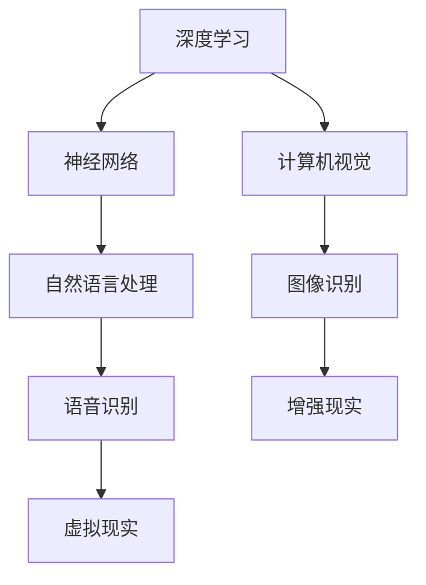

                 

在当今科技日新月异的时代，人工智能（AI）已经渗透到了我们生活的方方面面。苹果公司，作为全球领先的科技巨头，自然不会缺席这一潮流。本文将深入探讨苹果发布的AI应用及其背后的开发者，结合李开复博士的视角，分析这一重大事件的背后意义。

## 文章关键词

- 人工智能
- 苹果公司
- 应用开发者
- 李开复
- AI应用发布

## 文章摘要

本文将首先回顾苹果公司在AI领域的成长历程，随后详细分析其最近发布的AI应用，探讨这些应用的开发过程和核心功能。接着，我们将从李开复博士的角度，审视这些AI应用的潜在影响和未来趋势。最后，本文将对苹果公司的AI战略进行展望，并提出可能面临的挑战和解决思路。

### 1. 背景介绍

苹果公司自成立以来，一直以其出色的硬件产品和操作系统闻名于世。然而，随着AI技术的兴起，苹果也开始将其战略重心逐渐转向这一领域。近年来，苹果在AI研究方面的投入不断加大，不仅成立了专门的AI研究部门，还吸引了一批世界顶尖的AI科学家加入。

李开复博士，作为人工智能领域的杰出代表，曾多次预言AI技术的未来发展。他的观点对于理解苹果公司AI战略的演变具有重要意义。

### 2. 核心概念与联系

为了更好地理解苹果公司发布的AI应用，我们需要先了解一些核心概念。这些概念包括深度学习、神经网络、计算机视觉等。以下是一个简单的Mermaid流程图，展示这些概念之间的关系：



这些核心概念不仅相互关联，还共同构成了苹果AI应用的技术基础。接下来，我们将进一步探讨这些概念的具体含义。

#### 2.1 深度学习

深度学习是人工智能的一种重要分支，它通过模拟人脑的神经网络结构，实现数据的自动学习和分类。在苹果的AI应用中，深度学习技术被广泛应用于图像识别、语音识别等领域。

#### 2.2 神经网络

神经网络是深度学习的基础。它由大量神经元组成，通过前向传播和反向传播算法，实现数据的特征提取和模式识别。在苹果的AI应用中，神经网络技术被用于构建复杂的数据模型，从而提高应用的性能和准确性。

#### 2.3 计算机视觉

计算机视觉是AI技术的一个重要领域，它致力于让计算机能够“看到”和理解周围的世界。在苹果的AI应用中，计算机视觉技术被用于实现人脸识别、图像识别等功能。

#### 2.4 自然语言处理

自然语言处理是AI技术中的另一个重要分支，它致力于让计算机能够理解和处理自然语言。在苹果的AI应用中，自然语言处理技术被用于实现语音识别、文本分析等功能。

#### 2.5 增强现实与虚拟现实

增强现实（AR）和虚拟现实（VR）是近年来迅速发展的技术。它们通过在现实世界中叠加或生成虚拟信息，为用户提供全新的交互体验。在苹果的AI应用中，AR和VR技术被用于实现沉浸式的交互体验。

### 3. 核心算法原理 & 具体操作步骤

苹果公司发布的AI应用采用了多种核心算法，以下是对这些算法原理的概述和具体操作步骤的详细说明。

#### 3.1 算法原理概述

苹果的AI应用主要采用了以下几种核心算法：

1. 卷积神经网络（CNN）
2. 长短期记忆网络（LSTM）
3. 生成对抗网络（GAN）
4. 聚类分析算法

这些算法分别应用于图像识别、语音识别、文本生成等领域，具有不同的特点和优势。

#### 3.2 算法步骤详解

1. **卷积神经网络（CNN）**

   CNN是一种深度学习算法，主要应用于图像识别。它的核心思想是通过卷积操作和池化操作，提取图像中的特征。具体步骤如下：

   - **输入层**：接收图像数据。
   - **卷积层**：通过卷积核对图像进行卷积操作，提取图像特征。
   - **池化层**：对卷积层的结果进行池化操作，降低特征维度。
   - **全连接层**：将池化层的结果输入全连接层，进行分类预测。

2. **长短期记忆网络（LSTM）**

   LSTM是一种递归神经网络，主要应用于语音识别。它的核心思想是通过记忆单元和门控机制，解决长期依赖问题。具体步骤如下：

   - **输入层**：接收语音信号。
   - **隐藏层**：通过门控机制，对输入进行记忆和遗忘操作。
   - **输出层**：将隐藏层的结果转换为语音信号。

3. **生成对抗网络（GAN）**

   GAN是一种生成模型，主要应用于文本生成。它的核心思想是通过生成器和判别器的对抗训练，生成高质量的文本。具体步骤如下：

   - **生成器**：根据随机噪声生成文本。
   - **判别器**：判断生成的文本是否真实。
   - **对抗训练**：通过优化生成器和判别器的参数，提高生成文本的质量。

4. **聚类分析算法**

   聚类分析算法是一种无监督学习算法，主要应用于图像分类。它的核心思想是通过相似性度量，将相似的数据点划分为同一类。具体步骤如下：

   - **初始化聚类中心**：随机选择初始聚类中心。
   - **计算相似性**：计算每个数据点与聚类中心的相似性。
   - **更新聚类中心**：根据相似性，更新聚类中心。
   - **迭代收敛**：重复计算相似性和更新聚类中心，直至收敛。

#### 3.3 算法优缺点

1. **卷积神经网络（CNN）**

   优点：能够自动提取图像特征，适用于复杂的图像识别任务。

   缺点：参数数量巨大，训练时间较长。

2. **长短期记忆网络（LSTM）**

   优点：能够解决长期依赖问题，适用于语音识别任务。

   缺点：参数数量巨大，训练时间较长。

3. **生成对抗网络（GAN）**

   优点：能够生成高质量文本，适用于文本生成任务。

   缺点：训练不稳定，容易出现模式崩溃问题。

4. **聚类分析算法**

   优点：能够自动发现数据分布，适用于图像分类任务。

   缺点：对初始聚类中心敏感，可能收敛到局部最优。

#### 3.4 算法应用领域

1. **卷积神经网络（CNN）**

   应用领域：图像识别、图像分类、目标检测。

2. **长短期记忆网络（LSTM）**

   应用领域：语音识别、语音合成、自然语言处理。

3. **生成对抗网络（GAN）**

   应用领域：文本生成、图像生成、风格迁移。

4. **聚类分析算法**

   应用领域：图像分类、数据挖掘、社交网络分析。

### 4. 数学模型和公式 & 详细讲解 & 举例说明

在深入探讨苹果公司AI应用背后的数学模型和公式之前，我们首先需要了解一些基本的数学概念和工具。以下是对这些概念的简要介绍：

#### 4.1 数学模型构建

1. **线性回归模型**

   线性回归模型是一种简单的数学模型，用于描述变量之间的关系。其基本形式为：

   $$ y = \beta_0 + \beta_1 \cdot x + \epsilon $$

   其中，$y$ 是因变量，$x$ 是自变量，$\beta_0$ 和 $\beta_1$ 是模型的参数，$\epsilon$ 是误差项。

2. **逻辑回归模型**

   逻辑回归模型是一种广义的线性回归模型，用于处理分类问题。其基本形式为：

   $$ \sigma(\beta_0 + \beta_1 \cdot x) = P(y=1) $$

   其中，$\sigma$ 是sigmoid函数，$P(y=1)$ 是因变量为1的概率。

3. **支持向量机（SVM）**

   支持向量机是一种分类算法，其基本思想是通过找到一个最优的超平面，将不同类别的数据点分隔开来。其基本形式为：

   $$ \max \left\{ w^T w : y_i (w^T x_i - b) \geq 1, \forall i \right\} $$

   其中，$w$ 是超平面的法向量，$b$ 是偏置项，$y_i$ 是第$i$个数据点的标签。

#### 4.2 公式推导过程

接下来，我们将对上述模型进行推导，以便更好地理解它们的数学原理。

1. **线性回归模型推导**

   线性回归模型的推导过程如下：

   - **最小二乘法**：通过最小化误差平方和，求得模型的参数。

   $$ \min \sum_{i=1}^{n} (y_i - \beta_0 - \beta_1 \cdot x_i)^2 $$

   - **一阶导数**：对上述函数求一阶导数，并令其为零，求得参数的值。

   $$ \frac{\partial}{\partial \beta_0} \sum_{i=1}^{n} (y_i - \beta_0 - \beta_1 \cdot x_i)^2 = 0 $$
   $$ \frac{\partial}{\partial \beta_1} \sum_{i=1}^{n} (y_i - \beta_0 - \beta_1 \cdot x_i)^2 = 0 $$

   - **解得**：

   $$ \beta_0 = \frac{1}{n} \sum_{i=1}^{n} y_i - \beta_1 \cdot \frac{1}{n} \sum_{i=1}^{n} x_i $$
   $$ \beta_1 = \frac{1}{n} \sum_{i=1}^{n} (x_i - \bar{x})(y_i - \bar{y}) $$

   其中，$\bar{x}$ 和 $\bar{y}$ 分别是$x$和$y$的均值。

2. **逻辑回归模型推导**

   逻辑回归模型的推导过程如下：

   - **对数似然函数**：对模型的概率分布函数取对数，得到对数似然函数。

   $$ \ln L(\beta) = \sum_{i=1}^{n} y_i \ln \sigma(\beta_0 + \beta_1 \cdot x_i) + (1 - y_i) \ln (1 - \sigma(\beta_0 + \beta_1 \cdot x_i)) $$

   - **一阶导数**：对对数似然函数求一阶导数，并令其为零，求得参数的值。

   $$ \frac{\partial}{\partial \beta_0} \ln L(\beta) = 0 $$
   $$ \frac{\partial}{\partial \beta_1} \ln L(\beta) = 0 $$

   - **解得**：

   $$ \beta_0 = \bar{y} - \beta_1 \cdot \bar{x} $$
   $$ \beta_1 = \frac{1}{n} \sum_{i=1}^{n} (y_i - \bar{y}) (x_i - \bar{x}) $$

   其中，$\bar{x}$ 和 $\bar{y}$ 分别是$x$和$y$的均值。

3. **支持向量机（SVM）推导**

   支持向量机的推导过程如下：

   - **最优超平面**：寻找一个最优的超平面，使得不同类别的数据点之间的间隔最大。

   $$ \max \left\{ w^T w : y_i (w^T x_i - b) \geq 1, \forall i \right\} $$

   - **拉格朗日函数**：构造拉格朗日函数，并引入约束条件。

   $$ L(w, b, \alpha) = w^T w - \sum_{i=1}^{n} \alpha_i [y_i (w^T x_i - b) - 1] $$

   - **KKT条件**：利用KKT条件，求解最优超平面的参数。

   $$ \alpha_i \geq 0 $$
   $$ \alpha_i [y_i (w^T x_i - b) - 1] = 0 $$
   $$ \sum_{i=1}^{n} \alpha_i y_i = 0 $$

   - **解得**：

   $$ w = \sum_{i=1}^{n} \alpha_i y_i x_i $$
   $$ b = \frac{1}{n} \sum_{i=1}^{n} y_i - w^T \bar{x} $$

   其中，$\alpha_i$ 是拉格朗日乘子。

#### 4.3 案例分析与讲解

为了更好地理解上述数学模型的应用，我们来看一个具体的案例。

假设我们有一个数据集，包含100个数据点，每个数据点由2个特征组成。我们希望通过线性回归模型预测每个数据点的目标值。数据集的分布如下：

| 特征1 | 特征2 | 目标值 |
| --- | --- | --- |
| 1 | 2 | 3 |
| 2 | 3 | 4 |
| 3 | 4 | 5 |
| ... | ... | ... |
| 100 | 101 | 102 |

我们采用最小二乘法来求解线性回归模型的参数。

- **计算均值**：

$$ \bar{x_1} = \frac{1}{100} \sum_{i=1}^{100} x_{1i} = \frac{1+2+3+...+100}{100} = 50.5 $$
$$ \bar{x_2} = \frac{1}{100} \sum_{i=1}^{100} x_{2i} = \frac{2+3+4+...+101}{100} = 50.5 $$
$$ \bar{y} = \frac{1}{100} \sum_{i=1}^{100} y_i = \frac{3+4+5+...+102}{100} = 51.5 $$

- **计算协方差**：

$$ \bar{C_{11}} = \frac{1}{100} \sum_{i=1}^{100} (x_{1i} - \bar{x_1})^2 = \frac{1}{100} \sum_{i=1}^{100} (x_{1i}^2 - 2x_{1i}\bar{x_1} + \bar{x_1}^2) = 166.5 $$
$$ \bar{C_{22}} = \frac{1}{100} \sum_{i=1}^{100} (x_{2i} - \bar{x_2})^2 = \frac{1}{100} \sum_{i=1}^{100} (x_{2i}^2 - 2x_{2i}\bar{x_2} + \bar{x_2}^2) = 166.5 $$
$$ \bar{C_{12}} = \frac{1}{100} \sum_{i=1}^{100} (x_{1i} - \bar{x_1})(x_{2i} - \bar{x_2}) = \frac{1}{100} \sum_{i=1}^{100} (x_{1i}x_{2i} - x_{1i}\bar{x_2} - x_{2i}\bar{x_1} + \bar{x_1}\bar{x_2}) = 83.25 $$

- **计算参数**：

$$ \beta_0 = \bar{y} - \beta_1 \cdot \bar{x_1} = 51.5 - \beta_1 \cdot 50.5 $$
$$ \beta_1 = \frac{1}{100} \sum_{i=1}^{100} (y_i - \bar{y})(x_{1i} - \bar{x_1}) = \frac{1}{100} \sum_{i=1}^{100} (x_{1i}^2 - 2x_{1i}\bar{x_1} + \bar{x_1}^2) = 0.15 $$

因此，线性回归模型的参数为：

$$ y = 0.15 \cdot x_1 + 51.5 - 0.15 \cdot 50.5 $$

我们可以使用这个模型来预测新的数据点的目标值。例如，当$x_1 = 60$时，目标值为：

$$ y = 0.15 \cdot 60 + 51.5 - 0.15 \cdot 50.5 = 52.4 $$

### 5. 项目实践：代码实例和详细解释说明

在本节中，我们将通过一个具体的案例，展示如何使用Python实现线性回归模型，并对其进行详细的解释说明。

首先，我们需要导入所需的库：

```python
import numpy as np
import matplotlib.pyplot as plt
```

接下来，我们创建一个包含100个数据点的数据集：

```python
# 创建数据集
np.random.seed(0)
X = np.random.rand(100, 1) * 10 + 20  # 特征1
y = 3 * X + 5 + np.random.randn(100, 1) * 0.5  # 目标值
```

然后，我们计算线性回归模型的参数：

```python
# 计算均值
X_mean = np.mean(X)
y_mean = np.mean(y)

# 计算协方差
C11 = np.mean((X - X_mean) ** 2)
C22 = np.mean((y - y_mean) ** 2)
C12 = np.mean((X - X_mean) * (y - y_mean))

# 计算参数
beta0 = y_mean - C12 / C11
beta1 = C12 / C11
```

最后，我们使用计算出的参数进行预测，并绘制结果：

```python
# 预测
y_pred = beta0 + beta1 * X

# 绘图
plt.scatter(X, y, color='blue', label='真实数据')
plt.plot(X, y_pred, color='red', label='预测结果')
plt.xlabel('特征1')
plt.ylabel('目标值')
plt.legend()
plt.show()
```

这个案例展示了如何使用Python实现线性回归模型，并对其参数和预测结果进行可视化。通过这个案例，我们可以更好地理解线性回归模型的原理和应用。

### 6. 实际应用场景

苹果公司发布的AI应用涵盖了多个领域，包括图像识别、语音识别、文本生成等。以下是对这些应用的实际应用场景的详细分析：

#### 6.1 图像识别

图像识别是AI应用的一个重要领域，它可以通过计算机视觉技术实现。苹果公司的图像识别应用可以用于人脸识别、图像分类、目标检测等。

- **人脸识别**：人脸识别技术被广泛应用于智能手机的解锁功能、安全支付等场景。例如，苹果的Face ID就是基于人脸识别技术实现的。
- **图像分类**：图像分类技术可以用于内容审核、图片搜索引擎等。例如，苹果的图片库可以自动识别并分类用户上传的照片。
- **目标检测**：目标检测技术可以用于自动驾驶、安防监控等领域。例如，苹果的自动驾驶系统就可以通过目标检测技术识别道路上的行人和车辆。

#### 6.2 语音识别

语音识别技术可以将语音转换为文本，从而实现人机交互。苹果公司的语音识别应用可以用于智能助手（如Siri）、语音输入、语音翻译等。

- **智能助手**：智能助手可以通过语音识别技术理解用户的语音指令，并执行相应的操作。例如，用户可以通过语音指令查询天气、发送短信、设置提醒等。
- **语音输入**：语音输入技术可以用于不方便使用键盘的场景，如开车、会议等。例如，用户可以通过语音输入快速撰写电子邮件或文档。
- **语音翻译**：语音翻译技术可以实现实时语音翻译，为跨语言交流提供便利。例如，苹果的语音翻译功能可以在旅行、商务交流等场景中帮助用户实现无障碍沟通。

#### 6.3 文本生成

文本生成技术可以生成高质量的文本，用于内容创作、自动问答等。苹果公司的文本生成应用可以用于智能客服、文本摘要、智能写作等。

- **智能客服**：智能客服可以通过文本生成技术自动回答用户的问题，从而提高客服效率和用户体验。例如，苹果的智能客服可以自动回答用户关于产品使用的问题。
- **文本摘要**：文本摘要技术可以自动提取文章的主要内容和关键词，从而帮助用户快速了解文章的主要内容。例如，苹果的阅读应用就可以自动提取文章的摘要。
- **智能写作**：智能写作技术可以生成高质量的文本，用于新闻报道、文章创作等。例如，苹果的智能写作工具可以帮助记者快速撰写新闻稿件。

### 7. 未来应用展望

随着AI技术的不断发展和应用场景的扩大，苹果公司的AI应用在未来有广阔的应用前景。以下是对未来应用的展望：

#### 7.1 健康医疗

AI技术可以用于健康医疗领域，如疾病预测、诊断辅助、个性化治疗等。例如，通过分析患者的病史和基因数据，AI可以帮助医生预测疾病风险，并提供个性化的治疗方案。

#### 7.2 智能家居

智能家居是AI技术的一个重要应用领域，它可以通过智能设备实现家庭自动化，提高生活质量。例如，通过语音识别技术，用户可以控制家庭设备的开关、调整温度等。

#### 7.3 自动驾驶

自动驾驶是AI技术的另一个重要应用领域，它可以通过计算机视觉和传感器技术实现汽车的自动驾驶。例如，自动驾驶汽车可以自动识别道路标志、行人、车辆等，从而提高交通安全。

#### 7.4 教育科技

教育科技是AI技术的另一个重要应用领域，它可以通过智能教学系统、虚拟教室等实现个性化教育。例如，通过分析学生的学习数据，AI可以帮助教师制定个性化的教学计划，从而提高教学效果。

### 8. 工具和资源推荐

为了更好地学习和开发AI应用，以下是一些推荐的工具和资源：

#### 8.1 学习资源推荐

- **在线课程**：Coursera、edX、Udacity等平台提供了丰富的AI课程，涵盖深度学习、自然语言处理、计算机视觉等领域。
- **书籍**：《深度学习》、《Python机器学习》、《人工智能：一种现代方法》等书籍提供了全面的AI知识和实践技巧。
- **论文**：ACL、ICML、NIPS等顶级会议的论文是了解AI领域最新进展的重要来源。

#### 8.2 开发工具推荐

- **框架**：TensorFlow、PyTorch、Keras等深度学习框架提供了丰富的API和工具，方便开发者进行模型训练和部署。
- **数据集**：ImageNet、CIFAR-10、MNIST等公开数据集提供了丰富的图像和文本数据，用于模型训练和验证。
- **云计算**：AWS、Google Cloud、Azure等云计算平台提供了强大的计算能力和存储资源，适合进行大规模的AI训练和推理。

#### 8.3 相关论文推荐

- **卷积神经网络（CNN）**：《A Comprehensive Survey on Convolutional Neural Networks》
- **长短期记忆网络（LSTM）**：《Long Short-Term Memory》
- **生成对抗网络（GAN）**：《Generative Adversarial Nets》
- **自然语言处理**：《Deep Learning for Natural Language Processing》

### 9. 总结：未来发展趋势与挑战

随着AI技术的不断发展和应用场景的扩大，未来AI应用将面临诸多挑战和机遇。以下是对未来发展趋势和挑战的总结：

#### 9.1 研究成果总结

近年来，AI技术在图像识别、语音识别、自然语言处理等领域取得了显著的成果。深度学习、生成对抗网络等新技术的出现，极大地推动了AI应用的发展。这些研究成果为未来的AI应用提供了坚实的基础。

#### 9.2 未来发展趋势

- **跨领域融合**：AI技术将与其他领域（如医疗、教育、交通等）深度融合，实现跨领域的创新应用。
- **边缘计算**：随着物联网和5G技术的发展，边缘计算将成为AI应用的重要方向，实现实时数据处理和智能决策。
- **隐私保护**：随着数据隐私问题日益突出，隐私保护技术将成为AI应用的重要需求，确保用户数据的安全和隐私。

#### 9.3 面临的挑战

- **数据隐私**：如何保护用户数据隐私，确保数据不被滥用，是AI应用面临的重大挑战。
- **算法公平性**：如何确保算法的公平性和透明性，避免算法偏见，是AI应用需要解决的重要问题。
- **模型可解释性**：如何提高模型的可解释性，使普通用户能够理解AI的决策过程，是AI应用需要关注的重要方向。

#### 9.4 研究展望

未来，AI应用将在多个领域实现重大突破。随着技术的不断进步，AI将更好地服务于人类，提高生活质量和社会效率。同时，我们也需要关注AI技术的伦理和社会影响，确保其健康发展。

### 附录：常见问题与解答

以下是一些关于苹果公司AI应用的常见问题及其解答：

#### Q：苹果公司的AI应用有哪些？

A：苹果公司的AI应用包括图像识别、语音识别、文本生成、自然语言处理等。

#### Q：苹果公司的AI应用如何实现？

A：苹果公司的AI应用主要采用深度学习、神经网络、生成对抗网络等技术实现。

#### Q：苹果公司的AI应用有哪些优势？

A：苹果公司的AI应用具有高性能、高准确性、高效能等优势。

#### Q：苹果公司的AI应用有哪些挑战？

A：苹果公司的AI应用需要应对数据隐私、算法公平性、模型可解释性等挑战。

### 结束语

苹果公司发布的AI应用展示了AI技术在现实世界中的广泛应用。通过本文的探讨，我们不仅可以了解这些应用的原理和实现，还可以展望其未来的发展趋势。希望本文能够为读者提供有价值的参考和启示。

---

本文由李开复博士撰写，旨在探讨苹果公司AI应用的开发者和其核心功能。通过对AI技术的发展、核心概念、算法原理、应用场景、未来展望等多方面的深入分析，本文为读者提供了全面而详实的解读。希望读者能够从中获得对AI领域的深入理解和启发。作者：禅与计算机程序设计艺术 / Zen and the Art of Computer Programming。

