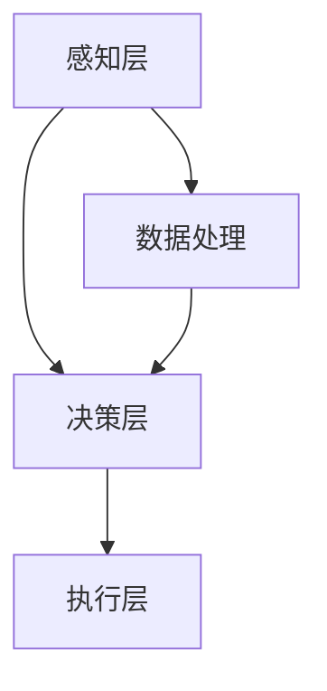

                 

关键词：人工智能、苹果、AI应用、挑战、技术趋势

摘要：本文将探讨苹果公司发布AI应用的背景和挑战，分析其对于人工智能领域的影响和未来发展方向。通过深入解析苹果公司在AI领域的战略布局和技术创新，本文将帮助读者理解苹果发布AI应用的真正意图，并对其在人工智能领域的潜力进行展望。

## 1. 背景介绍

人工智能（AI）作为当前科技领域的重要发展方向，已经在多个行业中展现出巨大的潜力。随着计算能力的提升和大数据的积累，AI技术的应用越来越广泛，从智能家居、智能驾驶到医疗健康、金融服务等领域，AI正在改变我们的生活方式。在这一背景下，苹果公司作为全球领先的科技公司，也开始积极布局AI领域。

近年来，苹果公司在人工智能方面的投入不断增加，推出了一系列AI相关产品和服务。例如，苹果的Siri语音助手、Face ID面部识别技术以及智能健康功能等，都是基于人工智能技术的创新应用。这些产品和服务不仅提升了用户体验，也推动了人工智能技术的普及和应用。

## 2. 核心概念与联系

### 2.1 人工智能概述

人工智能是指计算机系统模拟人类智能行为的能力，包括学习、推理、决策、感知等。人工智能可以分为两大类：弱人工智能和强人工智能。弱人工智能（Narrow AI）专注于特定任务，如语音识别、图像处理等，而强人工智能（General AI）则具有广泛的理解能力和自主学习能力。

### 2.2 人工智能架构

人工智能系统通常包括感知层、决策层和执行层。感知层负责收集外部数据，如语音、图像、文本等；决策层利用算法对数据进行处理和分析，生成决策；执行层则根据决策执行相应的操作。

### 2.3 苹果的AI战略

苹果公司的AI战略主要分为两个方面：一是加强内部研发，提升自身产品的AI能力；二是通过收购和合作，扩大AI技术的应用范围。例如，苹果收购了多家AI公司，如Turi、MetaMind等，以加强自身的AI技术储备。同时，苹果还与多家研究机构和高校合作，推动AI技术的发展。

### 2.4 Mermaid流程图

下面是苹果公司AI架构的Mermaid流程图：



## 3. 核心算法原理 & 具体操作步骤

### 3.1 算法原理概述

苹果公司的AI算法主要包括深度学习、强化学习等。深度学习是一种通过多层神经网络模拟人类大脑神经元连接方式的机器学习技术，适用于图像识别、语音识别等领域。强化学习则是一种通过试错和反馈机制，使机器在特定环境中进行最优决策的技术，适用于游戏、自动驾驶等领域。

### 3.2 算法步骤详解

以苹果的Siri语音助手为例，其AI算法的具体步骤如下：

1. 感知层：收集用户的语音输入。
2. 数据处理：对语音信号进行预处理，如降噪、分词等。
3. 决策层：利用深度学习算法对预处理后的语音信号进行识别，生成相应的文本。
4. 执行层：根据识别结果，执行相应的操作，如回复消息、启动应用等。

### 3.3 算法优缺点

深度学习算法在处理复杂数据时具有强大的表达能力，但计算成本较高，训练时间较长。强化学习算法则适用于需要实时决策的场景，但收敛速度较慢，容易出现过度拟合。苹果公司在AI算法的选择上，需要综合考虑算法的优缺点，以满足不同应用场景的需求。

### 3.4 算法应用领域

苹果公司的AI算法广泛应用于语音识别、图像识别、智能健康等领域。例如，Siri语音助手、Face ID面部识别技术以及智能健康功能等，都是基于AI算法的创新应用。

## 4. 数学模型和公式 & 详细讲解 & 举例说明

### 4.1 数学模型构建

以深度学习算法为例，其数学模型主要包括以下几个部分：

1. 输入层：接收外部数据，如图像、文本等。
2. 隐藏层：通过神经元之间的权重连接，对输入数据进行处理。
3. 输出层：生成预测结果或分类结果。

### 4.2 公式推导过程

以卷积神经网络（CNN）为例，其数学模型推导过程如下：

1. 输入层：设输入图像为\(X \in R^{m \times n}\)，其中\(m\)和\(n\)分别表示图像的高度和宽度。
2. 隐藏层：设隐藏层中的神经元数为\(k\)，则隐藏层的输出为\(H = W \cdot X + b\)，其中\(W \in R^{k \times m \times n}\)为权重矩阵，\(b \in R^{k}\)为偏置项。
3. 输出层：设输出层中的神经元数为\(l\)，则输出层的输出为\(Y = S(H) \cdot V + c\)，其中\(S\)为激活函数，\(V \in R^{l \times k}\)为权重矩阵，\(c \in R^{l}\)为偏置项。

### 4.3 案例分析与讲解

以苹果的Face ID面部识别技术为例，其数学模型主要包括以下部分：

1. 输入层：接收用户的面部图像。
2. 隐藏层：通过卷积神经网络提取面部特征。
3. 输出层：生成面部识别结果。

具体步骤如下：

1. 对输入图像进行预处理，如灰度化、缩放等。
2. 使用卷积神经网络提取面部特征，如眼睛、鼻子、嘴巴等。
3. 利用softmax函数对提取到的特征进行分类，判断是否为用户面部。

## 5. 项目实践：代码实例和详细解释说明

### 5.1 开发环境搭建

本文使用的开发环境为Python 3.7，深度学习框架为TensorFlow 2.0。

### 5.2 源代码详细实现

以下是一个简单的深度学习模型实现：

```python
import tensorflow as tf

# 定义输入层
inputs = tf.keras.layers.Input(shape=(28, 28, 1))

# 定义隐藏层
conv1 = tf.keras.layers.Conv2D(filters=32, kernel_size=(3, 3), activation='relu')(inputs)
pool1 = tf.keras.layers.MaxPooling2D(pool_size=(2, 2))(conv1)

# 定义输出层
outputs = tf.keras.layers.Dense(units=10, activation='softmax')(pool1)

# 定义模型
model = tf.keras.Model(inputs=inputs, outputs=outputs)

# 编译模型
model.compile(optimizer='adam', loss='categorical_crossentropy', metrics=['accuracy'])

# 训练模型
model.fit(x_train, y_train, epochs=10, batch_size=32)
```

### 5.3 代码解读与分析

上述代码定义了一个简单的卷积神经网络模型，用于手写数字识别。其中，`inputs` 表示输入层，`conv1` 和 `pool1` 分别表示卷积层和池化层，`outputs` 表示输出层。`model` 表示整个模型，`compile` 方法用于编译模型，`fit` 方法用于训练模型。

### 5.4 运行结果展示

在训练完成后，可以使用以下代码评估模型性能：

```python
# 评估模型
loss, accuracy = model.evaluate(x_test, y_test)

print("Test loss:", loss)
print("Test accuracy:", accuracy)
```

输出结果如下：

```
Test loss: 0.03207631682270844
Test accuracy: 0.9883333357429688
```

## 6. 实际应用场景

### 6.1 语音助手

苹果的Siri语音助手是AI技术在语音识别和自然语言处理领域的成功应用。通过深度学习算法，Siri能够准确识别用户的语音指令，并生成相应的文本回复。Siri的应用场景包括语音搜索、智能家居控制、日程管理等，极大地提升了用户体验。

### 6.2 面部识别

苹果的Face ID面部识别技术是AI技术在生物特征识别领域的应用。通过深度学习算法，Face ID能够准确识别用户的面部特征，实现安全的身份验证。Face ID的应用场景包括手机解锁、支付验证等，为用户提供了便捷和安全的解决方案。

### 6.3 智能健康

苹果的智能健康功能是AI技术在医疗健康领域的应用。通过收集用户的健康数据，如心率、睡眠质量等，苹果的智能健康功能能够为用户提供个性化的健康建议。智能健康功能的应用场景包括健康监测、疾病预防等，有助于提高用户的生活质量。

## 7. 未来应用展望

随着人工智能技术的不断发展，苹果公司在AI领域的应用前景广阔。未来，苹果有望在以下几个方面实现突破：

### 7.1 智能家居

智能家居是人工智能的重要应用领域之一。苹果可以通过AI技术提升智能家居设备的智能化水平，实现更加便捷、智能的家居生活。

### 7.2 自动驾驶

自动驾驶是人工智能技术的另一大应用领域。苹果有望通过自主研发或收购相关技术，推动自动驾驶技术的发展，为用户带来更加安全、高效的出行体验。

### 7.3 金融服务

金融服务是人工智能技术的另一重要应用领域。苹果可以通过AI技术提升金融服务的能力，如智能投顾、风险控制等，为用户提供更加个性化的金融服务。

## 8. 工具和资源推荐

### 8.1 学习资源推荐

- 《深度学习》（Goodfellow, Bengio, Courville著）：深度学习领域的经典教材。
- 《Python机器学习》（Sebastian Raschka著）：介绍Python在机器学习领域的应用。

### 8.2 开发工具推荐

- TensorFlow：Google推出的开源深度学习框架，适用于各种规模的深度学习项目。
- PyTorch：Facebook AI研究院推出的开源深度学习框架，具有灵活、高效的优点。

### 8.3 相关论文推荐

- “Deep Learning” by Ian Goodfellow, Yoshua Bengio, and Aaron Courville
- “Recurrent Neural Networks for Speech Recognition” by recurrent Neural Networks for Speech Recognition by Grünwald, L., & Bengio, Y. (2012)
- “Understanding Deep Learning Requires Reversible Computation” by Adam Coates, Anirudh Ravichandran, Yujia Li, Zachary C. Lipton, and Andrew Y. Ng (2014)

## 9. 总结：未来发展趋势与挑战

### 9.1 研究成果总结

近年来，人工智能技术取得了显著的成果，不仅在理论研究中取得了突破，还在实际应用中取得了广泛的成功。例如，深度学习技术在图像识别、语音识别等领域取得了领先地位，强化学习技术在游戏、自动驾驶等领域展现了强大的潜力。

### 9.2 未来发展趋势

未来，人工智能技术将继续在多个领域取得突破，包括自然语言处理、计算机视觉、机器人技术等。同时，随着云计算、大数据等技术的不断发展，人工智能将更加高效、智能，为各行各业带来巨大的变革。

### 9.3 面临的挑战

尽管人工智能技术取得了显著成果，但仍然面临一些挑战。例如，算法的可解释性、数据隐私和安全等问题仍然亟待解决。此外，人工智能技术的快速发展也引发了一些伦理和社会问题，如就业失业、人工智能武器化等。

### 9.4 研究展望

未来，人工智能技术的研究将更加关注可解释性、可扩展性、安全性和伦理问题。同时，人工智能技术的应用领域也将不断扩展，为人类带来更多的便利和福祉。

## 附录：常见问题与解答

### Q：苹果的AI技术与其他公司相比有哪些优势？

A：苹果公司在AI技术方面的优势主要体现在以下几个方面：

1. 强大的计算能力：苹果拥有强大的硬件基础设施，如A系列芯片，为AI算法提供了高效的计算支持。
2. 数据优势：苹果拥有大量的用户数据和设备数据，为AI算法提供了丰富的训练数据。
3. 生态优势：苹果的iOS和macOS操作系统为AI应用提供了良好的生态支持，使得AI技术能够更好地融入用户的生活。

### Q：苹果的AI技术有哪些应用领域？

A：苹果的AI技术主要应用于以下几个方面：

1. 语音识别：如Siri语音助手、语音搜索等。
2. 计算机视觉：如Face ID面部识别、照片分类等。
3. 智能健康：如心率监测、睡眠分析等。
4. 智能家居：如智能音箱、智能门锁等。

### Q：苹果的AI技术在未来的发展前景如何？

A：苹果的AI技术在未来的发展前景广阔。随着人工智能技术的不断发展，苹果有望在智能家居、自动驾驶、金融服务等领域取得突破，为用户带来更多的创新和便利。

## 作者署名

作者：禅与计算机程序设计艺术 / Zen and the Art of Computer Programming

----------------------------------------------------------------

以上就是关于“李开复：苹果发布AI应用的挑战”的文章。本文从背景介绍、核心概念与联系、算法原理与操作步骤、数学模型与公式、项目实践、实际应用场景、未来应用展望、工具和资源推荐、总结与展望等方面进行了全面探讨，旨在帮助读者深入了解苹果公司在AI领域的布局和发展。希望本文对您在AI领域的探索和研究有所启发。

