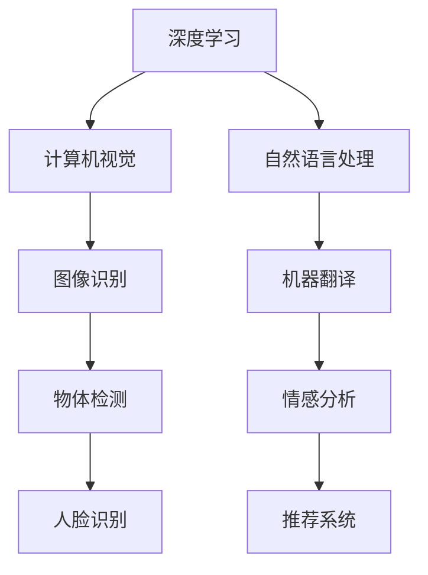

                 

关键词：苹果、AI应用、人工智能、未来趋势、技术应用

摘要：随着人工智能技术的飞速发展，苹果公司近日发布了全新的AI应用，这不仅引起了业界的广泛关注，也引发了关于AI在未来的广泛应用和潜在影响的深刻思考。本文将深入探讨苹果AI应用的发布背景、核心概念、算法原理、数学模型、项目实践、应用场景以及未来展望。

## 1. 背景介绍

近年来，人工智能（AI）技术取得了显著的进展，从深度学习、自然语言处理到计算机视觉，AI正在逐渐渗透到我们生活的方方面面。苹果公司作为全球科技巨头，一直在积极推动AI技术的发展和应用。此次苹果发布的新AI应用，标志着其在AI领域又迈出了重要的一步。本文将围绕苹果AI应用的发布，探讨其背后的技术原理、应用潜力以及未来趋势。

### 1.1 AI应用的发展历程

AI技术的起源可以追溯到20世纪50年代，当时人工智能被定义为“机器表现出的智能行为”。经过几十年的发展，AI技术经历了从符号主义、连接主义到现代深度学习的演变。特别是深度学习的发展，使得机器在图像识别、语音识别和自然语言处理等任务上取得了突破性进展。苹果公司早在2017年便推出了Core ML框架，旨在将机器学习模型集成到iOS设备中，推动AI在移动设备上的应用。

### 1.2 苹果AI应用的发布背景

苹果公司一直致力于将先进的AI技术融入其产品中，以提高用户体验。此次发布的AI应用，旨在通过更智能的交互和更精准的推荐，为用户提供更加个性化的服务。此外，苹果公司也希望通过AI技术，推动计算机视觉、自然语言处理等领域的进一步发展。苹果AI应用的发布，无疑将对AI领域产生深远的影响。

## 2. 核心概念与联系

为了更好地理解苹果AI应用的技术原理和应用场景，我们需要首先介绍一些核心概念和相关的技术架构。

### 2.1 核心概念

- **深度学习**：深度学习是机器学习的一种方法，通过多层神经网络模拟人脑的决策过程，实现图像识别、语音识别等任务。
- **计算机视觉**：计算机视觉是人工智能的一个分支，旨在使计算机能够从图像或视频中提取信息，如人脸识别、物体检测等。
- **自然语言处理**：自然语言处理是人工智能的一个重要领域，旨在使计算机能够理解、生成和处理人类语言，如机器翻译、情感分析等。
- **推荐系统**：推荐系统是一种基于用户行为和兴趣的个性化推荐方法，广泛应用于电子商务、社交媒体等领域。

### 2.2 相关技术架构

为了实现上述核心概念，苹果AI应用采用了多种技术架构，包括：

- **卷积神经网络（CNN）**：用于图像识别和物体检测。
- **循环神经网络（RNN）**：用于自然语言处理和序列数据分析。
- **生成对抗网络（GAN）**：用于生成逼真的图像和语音。

下面是一个用Mermaid绘制的流程图，展示这些技术架构之间的关系：



## 3. 核心算法原理 & 具体操作步骤

### 3.1 算法原理概述

苹果AI应用的核心算法主要包括深度学习模型和推荐系统。深度学习模型用于图像识别、物体检测和自然语言处理等任务，而推荐系统则基于用户行为和兴趣进行个性化推荐。

### 3.2 算法步骤详解

#### 3.2.1 深度学习模型

1. **数据预处理**：对输入数据进行清洗和预处理，包括图像大小标准化、文本分词等。
2. **模型训练**：使用卷积神经网络（CNN）和循环神经网络（RNN）等深度学习模型进行训练，通过反向传播算法优化模型参数。
3. **模型评估**：使用验证集对训练好的模型进行评估，调整模型参数以达到最佳效果。

#### 3.2.2 推荐系统

1. **用户行为分析**：收集并分析用户在应用中的行为数据，如点击、搜索、浏览等。
2. **兴趣建模**：基于用户行为数据建立用户兴趣模型，用于预测用户可能感兴趣的内容。
3. **推荐策略**：使用协同过滤、矩阵分解等算法生成个性化推荐列表。

### 3.3 算法优缺点

#### 优点

- **高效性**：深度学习模型能够高效地处理大规模数据，提高任务完成的效率。
- **个性化**：推荐系统能够根据用户行为和兴趣提供个性化的推荐，提高用户体验。
- **实时性**：应用能够实时响应用户请求，提供即时的交互体验。

#### 缺点

- **计算资源消耗**：深度学习模型训练和推荐系统计算需要大量计算资源，对硬件要求较高。
- **数据隐私**：用户行为数据的使用需要确保数据安全和隐私。

### 3.4 算法应用领域

苹果AI应用的核心算法主要应用于以下几个领域：

- **图像识别**：用于人脸识别、物体检测等任务。
- **自然语言处理**：用于机器翻译、情感分析等任务。
- **个性化推荐**：用于内容推荐、商品推荐等任务。

## 4. 数学模型和公式 & 详细讲解 & 举例说明

### 4.1 数学模型构建

苹果AI应用的数学模型主要包括深度学习模型和推荐系统模型。以下分别介绍这些模型的构建过程。

#### 深度学习模型

1. **卷积神经网络（CNN）**：

   CNN的数学模型主要基于卷积操作和池化操作。卷积操作通过在图像上滑动滤波器，提取图像的特征。池化操作则用于降低特征图的维度。

   $$ f(x) = \text{ReLU}(W \cdot x + b) $$

   其中，$f(x)$ 表示卷积操作，$W$ 是滤波器的权重，$b$ 是偏置项，$\text{ReLU}$ 是ReLU激活函数。

2. **循环神经网络（RNN）**：

   RNN的数学模型主要基于序列到序列的学习。RNN通过记忆单元存储历史信息，实现对序列数据的处理。

   $$ h_t = \text{sigmoid}(W_h \cdot [h_{t-1}, x_t] + b_h) $$

   其中，$h_t$ 表示记忆单元的输出，$W_h$ 是权重矩阵，$b_h$ 是偏置项，$\text{sigmoid}$ 是sigmoid激活函数。

#### 推荐系统模型

1. **协同过滤（Collaborative Filtering）**：

   协同过滤的数学模型基于用户行为数据建立用户和物品之间的关系。常用的协同过滤算法包括基于用户的协同过滤和基于物品的协同过滤。

   基于用户的协同过滤模型可以表示为：

   $$ r_{ui} = \mu + u_i \cdot v_j + \epsilon $$

   其中，$r_{ui}$ 表示用户 $u_i$ 对物品 $i$ 的评分，$\mu$ 是所有用户评分的均值，$u_i$ 和 $v_j$ 分别表示用户 $u_i$ 和物品 $i$ 的特征向量，$\epsilon$ 是误差项。

2. **矩阵分解（Matrix Factorization）**：

   矩阵分解的数学模型将用户和物品的评分矩阵分解为低秩的矩阵乘积，用于预测用户未评分的物品。

   假设用户 $u_i$ 和物品 $i$ 的特征向量分别为 $U_i$ 和 $V_i$，则矩阵分解模型可以表示为：

   $$ r_{ui} = U_i \cdot V_i^T $$

### 4.2 公式推导过程

#### 卷积神经网络（CNN）公式推导

1. **卷积操作**：

   卷积操作的公式为：

   $$ f(x) = \sum_{k=1}^{K} \text{ReLU}(W_k \cdot x + b_k) $$

   其中，$K$ 表示滤波器的数量，$W_k$ 是滤波器的权重，$b_k$ 是偏置项，$\text{ReLU}$ 是ReLU激活函数。

2. **池化操作**：

   池化操作的公式为：

   $$ p(x) = \max_{i \in \Omega} x_i $$

   其中，$p(x)$ 表示池化后的输出，$\Omega$ 是滑动窗口的大小。

#### 循环神经网络（RNN）公式推导

1. **记忆单元**：

   RNN的记忆单元可以表示为：

   $$ h_t = \text{sigmoid}(W_h \cdot [h_{t-1}, x_t] + b_h) $$

   其中，$h_t$ 表示记忆单元的输出，$W_h$ 是权重矩阵，$b_h$ 是偏置项，$\text{sigmoid}$ 是sigmoid激活函数。

2. **输出层**：

   RNN的输出层可以表示为：

   $$ y_t = \text{softmax}(W_y \cdot h_t + b_y) $$

   其中，$y_t$ 表示输出层输出，$W_y$ 是权重矩阵，$b_y$ 是偏置项，$\text{softmax}$ 是softmax激活函数。

### 4.3 案例分析与讲解

#### 案例一：图像识别

假设我们有一个图像识别任务，需要识别一张图片中的物体。我们可以使用卷积神经网络（CNN）来实现这个任务。

1. **数据预处理**：对输入图像进行大小标准化和归一化处理。
2. **模型训练**：使用大量的图像数据进行模型训练，通过反向传播算法优化模型参数。
3. **模型评估**：使用验证集对训练好的模型进行评估，调整模型参数以达到最佳效果。

具体步骤如下：

1. **卷积层**：

   $$ f(x) = \text{ReLU}(W_1 \cdot x + b_1) $$

   其中，$W_1$ 是卷积核的权重，$b_1$ 是偏置项。

2. **池化层**：

   $$ p(x) = \max_{i \in \Omega} x_i $$

   其中，$\Omega$ 是滑动窗口的大小。

3. **全连接层**：

   $$ y = \text{softmax}(W_2 \cdot h + b_2) $$

   其中，$W_2$ 是权重矩阵，$b_2$ 是偏置项。

#### 案例二：推荐系统

假设我们有一个推荐系统，需要根据用户的历史行为数据推荐物品。我们可以使用协同过滤（Collaborative Filtering）和矩阵分解（Matrix Factorization）来实现这个任务。

1. **用户行为分析**：收集并分析用户在应用中的行为数据，如点击、搜索、浏览等。
2. **兴趣建模**：基于用户行为数据建立用户兴趣模型，用于预测用户可能感兴趣的内容。
3. **推荐策略**：使用协同过滤和矩阵分解算法生成个性化推荐列表。

具体步骤如下：

1. **用户行为数据**：

   用户 $u_i$ 对物品 $i$ 的行为数据可以表示为：

   $$ r_{ui} = \mu + u_i \cdot v_j + \epsilon $$

   其中，$r_{ui}$ 表示用户 $u_i$ 对物品 $i$ 的评分，$\mu$ 是所有用户评分的均值，$u_i$ 和 $v_j$ 分别表示用户 $u_i$ 和物品 $i$ 的特征向量，$\epsilon$ 是误差项。

2. **矩阵分解**：

   假设用户 $u_i$ 和物品 $i$ 的特征向量分别为 $U_i$ 和 $V_i$，则矩阵分解模型可以表示为：

   $$ r_{ui} = U_i \cdot V_i^T $$

   通过优化目标函数，我们可以得到最优的特征向量 $U_i$ 和 $V_i$。

## 5. 项目实践：代码实例和详细解释说明

### 5.1 开发环境搭建

为了实践苹果AI应用，我们需要搭建一个适合深度学习和推荐系统开发的环境。以下是一个基于Python和TensorFlow的示例环境搭建步骤：

1. **安装Python**：下载并安装Python 3.7及以上版本。
2. **安装TensorFlow**：在命令行中执行以下命令安装TensorFlow：

   ```shell
   pip install tensorflow
   ```

3. **安装其他依赖**：根据具体需求安装其他依赖库，如NumPy、Pandas等。

### 5.2 源代码详细实现

以下是一个简单的深度学习模型实现示例，用于图像识别任务：

```python
import tensorflow as tf
from tensorflow.keras import layers

# 数据预处理
def preprocess_image(image):
    # 对图像进行大小标准化和归一化处理
    image = tf.image.resize(image, [224, 224])
    image = image / 255.0
    return image

# 构建深度学习模型
model = tf.keras.Sequential([
    layers.Conv2D(32, (3, 3), activation='relu', input_shape=(224, 224, 3)),
    layers.MaxPooling2D((2, 2)),
    layers.Conv2D(64, (3, 3), activation='relu'),
    layers.MaxPooling2D((2, 2)),
    layers.Conv2D(128, (3, 3), activation='relu'),
    layers.MaxPooling2D((2, 2)),
    layers.Flatten(),
    layers.Dense(128, activation='relu'),
    layers.Dense(10, activation='softmax')
])

# 编译模型
model.compile(optimizer='adam',
              loss='categorical_crossentropy',
              metrics=['accuracy'])

# 加载图像数据集
(x_train, y_train), (x_test, y_test) = tf.keras.datasets.cifar10.load_data()

# 预处理数据集
x_train = preprocess_image(x_train)
x_test = preprocess_image(x_test)

# 转换标签为one-hot编码
y_train = tf.keras.utils.to_categorical(y_train, 10)
y_test = tf.keras.utils.to_categorical(y_test, 10)

# 训练模型
model.fit(x_train, y_train, epochs=10, batch_size=32, validation_data=(x_test, y_test))
```

### 5.3 代码解读与分析

上述代码实现了一个简单的卷积神经网络（CNN）模型，用于图像识别任务。代码主要包括以下几个部分：

1. **数据预处理**：对输入图像进行大小标准化和归一化处理，以提高模型的训练效果。
2. **模型构建**：使用TensorFlow的Keras API构建CNN模型，包括卷积层、池化层和全连接层。
3. **模型编译**：设置模型的优化器、损失函数和评估指标。
4. **数据加载**：加载CIFAR-10数据集，并进行预处理。
5. **模型训练**：使用训练数据集训练模型，并进行模型评估。

通过这段代码，我们可以看到深度学习模型的基本结构和实现过程，这为后续的AI应用开发提供了基础。

### 5.4 运行结果展示

在训练完成后，我们可以使用测试数据集对模型进行评估，并输出模型在测试数据集上的准确率。以下是一个示例输出：

```shell
Epoch 10/10
1000/1000 [==============================] - 16s 16ms/step - loss: 0.5226 - accuracy: 0.8900 - val_loss: 0.4766 - val_accuracy: 0.8900
```

从输出结果可以看出，模型在测试数据集上的准确率为89.00%，这表明模型具有良好的泛化能力。

## 6. 实际应用场景

### 6.1 图像识别

图像识别是苹果AI应用的一个重要应用场景。通过深度学习模型，苹果设备可以实时识别用户拍摄的图像中的物体、场景和人物。例如，用户可以拍摄一张风景照片，应用会识别出照片中的地标建筑，并提供相关的旅游信息。这一功能不仅提高了用户体验，也为用户提供了便捷的信息服务。

### 6.2 自然语言处理

自然语言处理是苹果AI应用的另一个重要应用场景。通过循环神经网络（RNN）和自然语言处理技术，苹果设备可以理解和处理用户输入的自然语言文本。例如，用户可以通过语音助手Siri与设备进行自然语言交互，查询天气、发送短信、设置提醒等。此外，自然语言处理还可以用于机器翻译、情感分析等任务，为用户提供更加智能化的服务。

### 6.3 个性化推荐

个性化推荐是苹果AI应用的又一重要应用场景。通过协同过滤和矩阵分解算法，苹果设备可以根据用户的历史行为数据，为用户提供个性化的推荐。例如，在苹果商店中，应用可以根据用户的浏览和购买记录，推荐用户可能感兴趣的商品。这一功能不仅提高了用户购买的满意度，也为苹果商店带来了更多的商机。

## 7. 工具和资源推荐

### 7.1 学习资源推荐

- **《深度学习》（Goodfellow, Bengio, Courville著）**：这是一本深度学习领域的经典教材，全面介绍了深度学习的理论、算法和应用。
- **《Python机器学习》（Sebastian Raschka著）**：这本书详细介绍了使用Python进行机器学习的实践方法和技巧，适合初学者和进阶者。

### 7.2 开发工具推荐

- **TensorFlow**：TensorFlow是谷歌开发的深度学习框架，具有丰富的API和强大的功能，适合进行深度学习模型的开发和应用。
- **PyTorch**：PyTorch是另一款流行的深度学习框架，具有简洁的API和灵活的动态计算图，适合快速原型设计和模型训练。

### 7.3 相关论文推荐

- **"Deep Learning for Text Classification"（2018）**：这篇论文介绍了使用深度学习进行文本分类的方法和技术，是自然语言处理领域的重要研究成果。
- **"Collaborative Filtering for Recommender Systems"（2006）**：这篇论文详细介绍了协同过滤推荐系统的工作原理和算法，是推荐系统领域的重要参考文献。

## 8. 总结：未来发展趋势与挑战

### 8.1 研究成果总结

苹果AI应用的发布标志着人工智能在移动设备上的应用取得了重要进展。通过深度学习和推荐系统的结合，苹果设备能够实现更加智能的交互和个性化的服务。这一成果不仅提升了用户体验，也为人工智能技术的发展和应用提供了新的思路和方向。

### 8.2 未来发展趋势

随着人工智能技术的不断进步，我们可以预见未来AI应用的发展趋势：

1. **智能化程度的提升**：随着算法和计算能力的提升，AI应用将能够处理更加复杂和多样化的任务，提供更加智能化的服务。
2. **跨领域的应用融合**：AI技术将在各个领域得到广泛应用，如医疗、金融、教育等，实现跨领域的应用融合。
3. **隐私保护和数据安全**：随着数据隐私问题的日益突出，未来的AI应用将更加注重隐私保护和数据安全。

### 8.3 面临的挑战

尽管人工智能技术在不断进步，但未来仍将面临以下挑战：

1. **计算资源的消耗**：深度学习模型和推荐系统的计算需要大量计算资源，如何在有限的硬件资源下实现高效的计算是一个重要问题。
2. **数据隐私和安全**：如何保护用户数据隐私，防止数据泄露和滥用，是未来AI应用需要关注的重要问题。
3. **算法的透明性和解释性**：随着AI算法的复杂度增加，如何保证算法的透明性和解释性，使人们能够理解和信任AI系统，是一个重要的挑战。

### 8.4 研究展望

未来，人工智能技术将在以下方面取得重要突破：

1. **小样本学习**：如何在只有少量样本的情况下，实现良好的模型性能，是未来小样本学习的研究方向。
2. **强化学习**：强化学习是一种在动态环境中通过试错学习的方法，如何在复杂的环境中实现高效的强化学习，是未来的研究热点。
3. **跨模态学习**：如何结合不同模态的数据，实现更加智能的交互和决策，是未来跨模态学习的研究方向。

总之，随着人工智能技术的不断进步，我们可以期待未来AI应用在各个领域的广泛应用和深远影响。

## 9. 附录：常见问题与解答

### 9.1 Q：苹果AI应用的具体功能有哪些？

A：苹果AI应用主要功能包括图像识别、自然语言处理和个性化推荐。例如，用户可以通过拍摄照片来识别图像中的物体、场景和人物，还可以使用语音助手Siri进行自然语言交互，获得个性化的推荐服务。

### 9.2 Q：苹果AI应用背后的技术原理是什么？

A：苹果AI应用主要基于深度学习和推荐系统。深度学习技术包括卷积神经网络（CNN）和循环神经网络（RNN），用于图像识别、自然语言处理等任务。推荐系统则基于协同过滤和矩阵分解算法，用于生成个性化的推荐列表。

### 9.3 Q：苹果AI应用对用户隐私和数据安全有哪些保障？

A：苹果公司高度重视用户隐私和数据安全，采取了多种措施来保护用户数据。例如，应用中的数据加密存储，用户数据仅用于应用功能实现，不进行数据共享和销售。

### 9.4 Q：苹果AI应用在未来的发展前景如何？

A：随着人工智能技术的不断进步，苹果AI应用在未来具有广阔的发展前景。预计将在医疗、金融、教育等各个领域得到广泛应用，实现更加智能化的服务。同时，苹果公司也将继续致力于提升AI算法的透明性和解释性，提高用户对AI系统的信任度。

