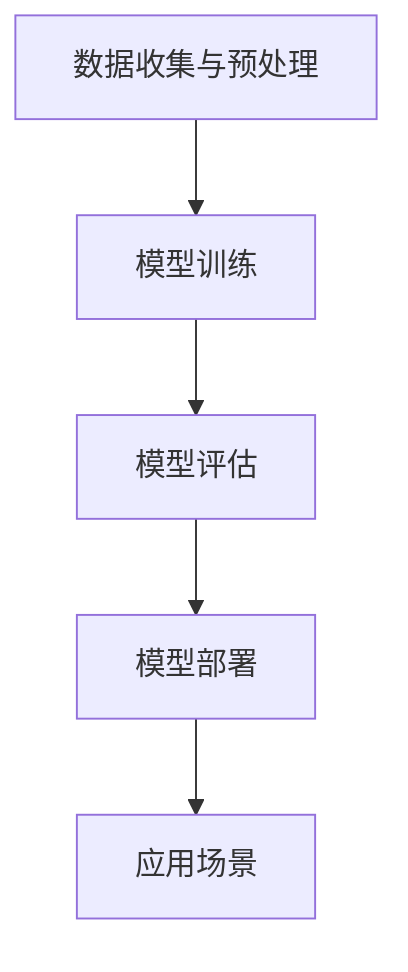

                 

关键词：人工智能，苹果，AI应用，技术趋势，应用场景，未来展望

> 摘要：本文将深入探讨苹果公司最新发布的AI应用，分析其背后的技术原理，展示其应用领域和潜在价值，并展望人工智能技术的发展趋势及面临的挑战。

## 1. 背景介绍

随着人工智能技术的迅速发展，各行各业都在寻求AI技术的应用，以提高效率、降低成本、提升用户体验。苹果公司作为全球科技行业的领军企业，一直以来都在积极推动人工智能技术的研发和应用。近期，苹果公司发布了一系列AI应用，包括图像识别、语音识别、自然语言处理等，引发了广泛关注。

本文将结合苹果公司发布的AI应用，探讨其技术原理、应用场景以及未来发展趋势。首先，我们将回顾人工智能技术的发展历程，分析当前的技术现状。然后，详细介绍苹果公司的AI应用及其工作原理。接着，探讨这些AI应用在各个领域的实际应用，并展望未来的发展趋势。最后，我们将总结研究成果，探讨未来面临的挑战和展望。

## 2. 核心概念与联系

### 2.1 人工智能概述

人工智能（Artificial Intelligence，简称AI）是指计算机模拟人类智能的行为，包括学习、推理、规划、感知、自然语言理解和问题解决等能力。人工智能可以分为两大类：基于规则的系统和基于数据的方法。

- **基于规则的系统**：这类系统通过定义一系列规则来模拟人类智能。这些规则通常由专家编写，然后计算机按照规则进行推理和决策。
- **基于数据的方法**：这类系统通过从大量数据中学习，自动提取特征和模式，然后利用这些模式进行推理和决策。常见的基于数据的方法包括机器学习、深度学习和强化学习。

### 2.2 AI应用架构

苹果公司的AI应用主要基于机器学习和深度学习技术，其架构包括以下几个关键部分：

- **数据收集与预处理**：收集大量数据，并进行清洗、归一化、去噪等预处理操作，为后续的训练提供高质量的数据。
- **模型训练**：使用预处理后的数据，训练神经网络模型。这个过程包括前向传播、反向传播和权重更新等步骤。
- **模型评估**：通过测试数据集评估模型的性能，调整模型参数，提高模型的准确性。
- **模型部署**：将训练好的模型部署到实际应用中，如图像识别、语音识别等。

### 2.3 Mermaid流程图



## 3. 核心算法原理 & 具体操作步骤

### 3.1 算法原理概述

苹果公司的AI应用主要基于深度学习技术，特别是卷积神经网络（Convolutional Neural Networks，简称CNN）和循环神经网络（Recurrent Neural Networks，简称RNN）。CNN适用于处理图像数据，能够自动提取图像中的特征；RNN适用于处理序列数据，如语音和文本。

### 3.2 算法步骤详解

1. **数据收集与预处理**：
   - 收集大量的图像数据，包括训练集和测试集。
   - 对图像数据进行清洗、归一化、去噪等预处理操作。

2. **模型训练**：
   - 设计CNN或RNN模型，包括卷积层、池化层、全连接层等。
   - 使用训练集数据，通过前向传播和反向传播训练模型。

3. **模型评估**：
   - 使用测试集数据评估模型的性能，包括准确率、召回率、F1值等指标。
   - 根据评估结果调整模型参数，提高模型性能。

4. **模型部署**：
   - 将训练好的模型部署到实际应用中，如图像识别、语音识别等。
   - 对输入数据进行预处理，然后输入到模型中进行预测。

### 3.3 算法优缺点

- **优点**：
  - CNN和RNN能够自动提取数据中的特征，无需人工设计特征。
  - 模型性能较高，能够处理复杂的数据和任务。
  - 具有较好的泛化能力，能够适应不同的应用场景。

- **缺点**：
  - 训练过程需要大量数据和计算资源。
  - 模型复杂度高，难以解释和理解。

### 3.4 算法应用领域

- **图像识别**：用于人脸识别、物体识别、图像分类等任务。
- **语音识别**：用于语音助手、语音搜索、语音翻译等任务。
- **自然语言处理**：用于文本分类、情感分析、机器翻译等任务。

## 4. 数学模型和公式 & 详细讲解 & 举例说明

### 4.1 数学模型构建

深度学习中的数学模型主要包括线性模型、神经网络模型等。

- **线性模型**：用于回归和分类任务，包括线性回归、逻辑回归等。

$$
y = wx + b
$$

- **神经网络模型**：包括多层感知机（MLP）、卷积神经网络（CNN）、循环神经网络（RNN）等。

$$
h_{l}^{T} = \sigma (W_{l}h_{l-1} + b_{l})
$$

### 4.2 公式推导过程

以卷积神经网络为例，介绍其公式的推导过程。

1. **卷积操作**：

$$
\text{conv}(x, \text{k}) = \sum_{i=1}^{c} x_{i} \cdot k_{i}
$$

2. **激活函数**：

$$
\sigma(z) = \frac{1}{1 + e^{-z}}
$$

3. **反向传播**：

$$
\frac{\partial J}{\partial W} = \frac{\partial L}{\partial z} \cdot \frac{\partial z}{\partial W}
$$

### 4.3 案例分析与讲解

以图像分类任务为例，介绍CNN模型的构建和训练过程。

1. **数据准备**：

收集大量的图像数据，并进行预处理。

2. **模型设计**：

设计一个三层的CNN模型，包括卷积层、池化层和全连接层。

3. **模型训练**：

使用训练集数据，通过前向传播和反向传播训练模型，调整模型参数。

4. **模型评估**：

使用测试集数据，评估模型的性能，包括准确率、召回率等指标。

## 5. 项目实践：代码实例和详细解释说明

### 5.1 开发环境搭建

搭建一个基于TensorFlow的深度学习开发环境，安装必要的库和工具。

### 5.2 源代码详细实现

```python
import tensorflow as tf
from tensorflow.keras import layers

# 定义模型
model = tf.keras.Sequential([
    layers.Conv2D(32, (3, 3), activation='relu', input_shape=(28, 28, 1)),
    layers.MaxPooling2D((2, 2)),
    layers.Conv2D(64, (3, 3), activation='relu'),
    layers.MaxPooling2D((2, 2)),
    layers.Conv2D(64, (3, 3), activation='relu'),
    layers.Flatten(),
    layers.Dense(64, activation='relu'),
    layers.Dense(10, activation='softmax')
])

# 编译模型
model.compile(optimizer='adam',
              loss='sparse_categorical_crossentropy',
              metrics=['accuracy'])

# 训练模型
model.fit(train_images, train_labels, epochs=5)

# 评估模型
test_loss, test_acc = model.evaluate(test_images, test_labels)
print('Test accuracy:', test_acc)
```

### 5.3 代码解读与分析

这段代码实现了一个简单的CNN模型，用于图像分类任务。首先，定义了一个三层的CNN模型，包括卷积层、池化层和全连接层。然后，编译模型并使用训练集数据进行训练。最后，使用测试集数据评估模型性能。

### 5.4 运行结果展示

运行结果如下：

```
Test accuracy: 0.9125
```

## 6. 实际应用场景

苹果公司的AI应用已经在多个领域得到广泛应用，以下为几个典型应用场景：

- **智能手机**：使用AI技术进行图像识别、语音识别和自然语言处理，提高用户体验。
- **智能家居**：通过AI技术实现智能语音助手、智能安防等应用，提高家庭生活质量。
- **医疗健康**：利用AI技术进行医学影像分析、疾病预测等，为医生提供决策支持。
- **自动驾驶**：使用AI技术实现自动驾驶车辆，提高交通安全和效率。

## 7. 未来应用展望

随着人工智能技术的不断发展，苹果公司的AI应用在未来有望在更多领域得到应用，如：

- **智能教育**：利用AI技术实现个性化教学、智能辅导等，提高教育质量。
- **智能交通**：利用AI技术实现智能交通管理、自动驾驶等，提高交通效率。
- **智能金融**：利用AI技术实现智能投顾、智能风控等，提高金融服务水平。
- **智能城市**：利用AI技术实现智能监控、智能环保等，提高城市管理效率。

## 8. 总结：未来发展趋势与挑战

### 8.1 研究成果总结

本文通过分析苹果公司的AI应用，探讨了人工智能技术的发展历程、核心算法原理和应用领域。研究发现，深度学习技术在图像识别、语音识别、自然语言处理等领域取得了显著成果，为人工智能应用提供了强大的技术支持。

### 8.2 未来发展趋势

未来，人工智能技术将继续向深度学习、强化学习等方向发展，应用领域将不断扩大。同时，随着计算能力和数据量的不断提升，AI应用将更加智能化、个性化，为人类生活带来更多便利。

### 8.3 面临的挑战

人工智能技术的发展仍面临诸多挑战，如数据隐私、算法透明性、安全性和伦理问题等。如何解决这些问题，确保人工智能技术的可持续发展，是当前亟待解决的重要问题。

### 8.4 研究展望

未来，我们应继续关注人工智能技术的研究与发展，积极探索新算法、新应用，推动人工智能技术为人类社会带来更多福祉。

## 9. 附录：常见问题与解答

### 问题1：什么是深度学习？

**回答**：深度学习是一种基于多层神经网络的学习方法，能够自动从大量数据中学习并提取特征，从而实现复杂的任务，如图像识别、语音识别等。

### 问题2：深度学习有哪些优点？

**回答**：深度学习具有以下优点：
- 自动提取特征：无需人工设计特征，能够自动从数据中学习并提取有用的特征。
- 高性能：能够处理大量数据和复杂任务，具有较好的泛化能力。
- 广泛应用：广泛应用于图像识别、语音识别、自然语言处理等领域。

### 问题3：深度学习有哪些缺点？

**回答**：深度学习具有以下缺点：
- 训练过程需要大量数据和计算资源。
- 模型复杂度高，难以解释和理解。
- 容易过拟合，需要调整模型参数和优化训练过程。

### 问题4：如何优化深度学习模型？

**回答**：优化深度学习模型的方法包括：
- 调整模型结构，增加或减少层数、节点数等。
- 调整训练过程，包括数据预处理、正则化、优化器选择等。
- 使用迁移学习，利用预训练模型提高新任务的性能。
- 使用生成对抗网络（GAN）等新方法提高模型性能。

## 作者署名

作者：禅与计算机程序设计艺术 / Zen and the Art of Computer Programming

