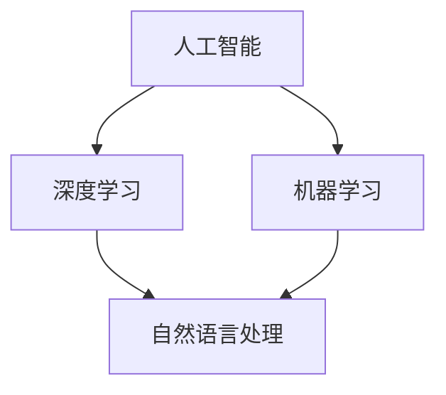

                 

关键词：李开复，苹果，AI应用，技术趋势，创新实践

> 摘要：本文将深入探讨苹果公司在人工智能（AI）领域的发展，分析其发布AI应用的机遇与挑战，以及对于全球科技产业的影响。作者李开复以其丰富的科技行业经验，为读者带来独特的见解和深刻的分析。

## 1. 背景介绍

在过去的几年里，人工智能技术取得了飞速的发展，从早期的理论研究到如今的实际应用，AI已经深刻地改变了我们的生活方式和工作模式。随着计算能力的提升和大数据的积累，AI的应用场景越来越广泛，涵盖了医疗、金融、交通、教育等多个领域。苹果公司作为全球领先的科技巨头，其在AI领域的发展尤为重要。

苹果公司自2017年首次在iOS 11中引入基于AI的相机效果以来，AI在苹果产品中的应用逐渐增多。无论是Siri的智能语音助手，还是Face ID的面部识别功能，都展示了苹果在AI领域的创新能力。然而，随着AI技术的不断演进，苹果也面临着新的机遇和挑战。

## 2. 核心概念与联系

为了更好地理解苹果在AI领域的最新动态，我们需要了解一些核心概念和它们之间的联系。

### 2.1 人工智能（AI）

人工智能是指通过计算机程序实现的智能行为，包括学习、推理、感知、决策等。AI可以分为狭义AI和广义AI，其中狭义AI主要关注特定任务的表现，而广义AI则追求更广泛的通用智能。

### 2.2 深度学习（Deep Learning）

深度学习是AI的一个重要分支，通过多层神经网络模拟人类大脑的学习过程，用于处理复杂的模式和特征。深度学习在图像识别、语音识别、自然语言处理等领域取得了显著的成果。

### 2.3 机器学习（Machine Learning）

机器学习是AI的基础，通过算法从数据中学习并做出预测或决策。机器学习可以分为监督学习、无监督学习和强化学习等。

### 2.4 自然语言处理（Natural Language Processing，NLP）

自然语言处理是AI的一个分支，旨在使计算机理解和生成人类语言。NLP在聊天机器人、语音助手、文本分析等领域有广泛应用。

### 2.5 Mermaid 流程图

以下是一个简化的Mermaid流程图，展示了AI技术的核心概念及其之间的联系：



## 3. 核心算法原理 & 具体操作步骤

### 3.1 算法原理概述

苹果在AI领域的主要算法原理包括深度学习、计算机视觉和自然语言处理等。以下是对这些算法的简要概述：

#### 深度学习

深度学习通过多层神经网络来模拟人类大脑的学习过程。每个神经元都连接到其他神经元，并通过加权的方式传递信息。通过反向传播算法，网络可以不断调整权重，从而优化网络性能。

#### 计算机视觉

计算机视觉旨在使计算机理解图像和视频中的内容。常用的算法包括卷积神经网络（CNN）和生成对抗网络（GAN）。CNN通过卷积层提取图像特征，而GAN则通过生成器和判别器的对抗训练生成逼真的图像。

#### 自然语言处理

自然语言处理通过神经网络模型理解并生成人类语言。常用的算法包括循环神经网络（RNN）和变压器（Transformer）。RNN能够处理序列数据，而Transformer通过自注意力机制实现了高效的语言建模。

### 3.2 算法步骤详解

#### 深度学习

1. 数据收集：收集大量带有标签的数据，用于训练和验证模型。
2. 数据预处理：对数据进行清洗、归一化和标准化等处理，使其适合模型训练。
3. 模型构建：定义神经网络结构，包括层数、神经元数量和激活函数等。
4. 模型训练：通过反向传播算法，不断调整网络权重，以优化模型性能。
5. 模型评估：使用验证集和测试集评估模型性能，包括准确率、召回率等指标。
6. 模型部署：将训练好的模型部署到实际应用中。

#### 计算机视觉

1. 数据收集：收集大量图像和视频数据，用于训练和验证模型。
2. 数据预处理：对图像和视频数据进行缩放、裁剪、旋转等处理，增加数据多样性。
3. 模型构建：使用卷积神经网络或生成对抗网络构建模型。
4. 模型训练：通过对抗训练或卷积神经网络训练模型。
5. 模型评估：使用验证集和测试集评估模型性能。
6. 模型部署：将训练好的模型部署到实际应用中。

#### 自然语言处理

1. 数据收集：收集大量文本数据，用于训练和验证模型。
2. 数据预处理：对文本数据进行分词、词向量化等处理，将其转换为模型可处理的格式。
3. 模型构建：使用循环神经网络或变压器构建模型。
4. 模型训练：通过序列对齐或注意力机制训练模型。
5. 模型评估：使用验证集和测试集评估模型性能。
6. 模型部署：将训练好的模型部署到实际应用中。

### 3.3 算法优缺点

#### 深度学习

**优点：**
- 强大的表示能力，能够处理复杂的非线性问题。
- 能够自动提取特征，减少人工特征工程的工作量。

**缺点：**
- 训练过程需要大量数据和计算资源，训练时间较长。
- 模型解释性较差，难以理解决策过程。

#### 计算机视觉

**优点：**
- 可以处理高维度数据，如图像和视频。
- 能够自动提取丰富的视觉特征。

**缺点：**
- 对图像质量要求较高，噪声和遮挡会影响性能。
- 需要大量标注数据进行训练。

#### 自然语言处理

**优点：**
- 能够处理序列数据，如文本和语音。
- 具有较强的语言理解能力。

**缺点：**
- 需要大量高质量语料进行训练。
- 对低资源语言的适应能力较差。

### 3.4 算法应用领域

深度学习、计算机视觉和自然语言处理在多个领域有广泛应用，包括：

- **医疗：**用于疾病诊断、药物研发和健康监测。
- **金融：**用于风险管理、欺诈检测和投资建议。
- **交通：**用于自动驾驶、智能交通管理和车辆监控。
- **教育：**用于个性化教学、智能评估和智能问答。
- **娱乐：**用于虚拟现实、游戏和语音交互。

## 4. 数学模型和公式 & 详细讲解 & 举例说明

在AI领域，数学模型和公式起着至关重要的作用。以下我们将介绍一些核心的数学模型和公式，并对其进行详细讲解和举例说明。

### 4.1 数学模型构建

#### 深度学习模型

深度学习模型通常由多个层（Layer）组成，包括输入层（Input Layer）、隐藏层（Hidden Layer）和输出层（Output Layer）。每一层都包含多个神经元（Neuron）。

- **输入层（Input Layer）：** 接收输入数据，并将其传递给隐藏层。
- **隐藏层（Hidden Layer）：** 通过激活函数（Activation Function）处理输入数据，并将其传递给下一层。
- **输出层（Output Layer）：** 输出模型的预测结果。

#### 计算机视觉模型

计算机视觉模型通常使用卷积神经网络（Convolutional Neural Network，CNN）进行图像处理。CNN包括多个卷积层（Convolutional Layer）、池化层（Pooling Layer）和全连接层（Fully Connected Layer）。

- **卷积层（Convolutional Layer）：** 通过卷积运算提取图像特征。
- **池化层（Pooling Layer）：** 通过下采样减少数据维度。
- **全连接层（Fully Connected Layer）：** 将特征映射到输出类别。

#### 自然语言处理模型

自然语言处理模型通常使用循环神经网络（Recurrent Neural Network，RNN）或变压器（Transformer）进行序列处理。

- **循环神经网络（RNN）：** 通过循环机制处理序列数据。
- **变压器（Transformer）：** 通过自注意力机制处理序列数据。

### 4.2 公式推导过程

#### 深度学习模型公式

假设我们有一个包含 $L$ 层的深度学习模型，输入数据为 $X \in \mathbb{R}^{D \times N}$，其中 $D$ 表示数据的维度，$N$ 表示样本的数量。我们定义以下变量：

- $a_l = \text{激活函数}(\text{权重矩阵} \cdot a_{l-1} + \text{偏置向量})$，其中 $a_l$ 表示第 $l$ 层的激活值。
- $z_l = \text{权重矩阵} \cdot a_{l-1} + \text{偏置向量}$，其中 $z_l$ 表示第 $l$ 层的输入值。

对于输出层，我们有：

$$
\hat{y} = \text{激活函数}(\text{权重矩阵} \cdot a_{L-1} + \text{偏置向量})
$$

其中 $\hat{y}$ 表示模型的预测结果。

#### 计算机视觉模型公式

假设我们有一个包含 $L$ 层的计算机视觉模型，输入图像为 $I \in \mathbb{R}^{H \times W \times C}$，其中 $H$、$W$ 和 $C$ 分别表示图像的高度、宽度和通道数。我们定义以下变量：

- $c_l = \text{卷积运算}(\text{卷积核} \cdot c_{l-1}) + \text{偏置向量}$，其中 $c_l$ 表示第 $l$ 层的卷积结果。
- $p_l = \text{池化运算}(c_l)$，其中 $p_l$ 表示第 $l$ 层的池化结果。

对于输出层，我们有：

$$
\hat{y} = \text{激活函数}(\text{权重矩阵} \cdot p_{L-1} + \text{偏置向量})
$$

其中 $\hat{y}$ 表示模型的预测结果。

#### 自然语言处理模型公式

假设我们有一个包含 $L$ 层的自然语言处理模型，输入序列为 $X \in \mathbb{R}^{T \times D}$，其中 $T$ 表示序列的长度，$D$ 表示数据的维度。我们定义以下变量：

- $h_l = \text{激活函数}(\text{权重矩阵} \cdot h_{l-1} + \text{偏置向量})$，其中 $h_l$ 表示第 $l$ 层的隐藏状态。
- $y_l = \text{激活函数}(\text{权重矩阵} \cdot h_{l-1} + \text{偏置向量})$，其中 $y_l$ 表示第 $l$ 层的输出。

对于输出层，我们有：

$$
\hat{y} = \text{激活函数}(\text{权重矩阵} \cdot h_{L-1} + \text{偏置向量})
$$

其中 $\hat{y}$ 表示模型的预测结果。

### 4.3 案例分析与讲解

#### 深度学习案例

假设我们有一个分类问题，输入数据为 $X \in \mathbb{R}^{1000 \times 10}$，目标标签为 $y \in \mathbb{R}^{1000 \times 1}$。我们使用一个包含两个隐藏层的深度学习模型进行训练。

- 输入层：$a_0 = X$。
- 第一隐藏层：$z_1 = W_1 \cdot a_0 + b_1$，$a_1 = \text{ReLU}(z_1)$。
- 第二隐藏层：$z_2 = W_2 \cdot a_1 + b_2$，$a_2 = \text{ReLU}(z_2)$。
- 输出层：$z_L = W_L \cdot a_2 + b_L$，$\hat{y} = \text{Softmax}(z_L)$。

其中 $W_1$、$b_1$、$W_2$、$b_2$ 和 $W_L$、$b_L$ 分别为权重矩阵和偏置向量。

#### 计算机视觉案例

假设我们有一个图像分类问题，输入图像为 $I \in \mathbb{R}^{224 \times 224 \times 3}$。我们使用一个包含两个卷积层的计算机视觉模型进行训练。

- 输入层：$I$。
- 第一卷积层：$c_1 = \text{卷积运算}(I, K_1) + b_1$，$p_1 = \text{池化运算}(c_1)$。
- 第二卷积层：$c_2 = \text{卷积运算}(p_1, K_2) + b_2$，$p_2 = \text{池化运算}(c_2)$。
- 输出层：$\hat{y} = \text{激活函数}(\text{权重矩阵} \cdot p_2 + \text{偏置向量})$。

其中 $K_1$、$K_2$ 分别为卷积核，$b_1$、$b_2$ 分别为偏置向量。

#### 自然语言处理案例

假设我们有一个文本分类问题，输入序列为 $X \in \mathbb{R}^{50 \times 512}$。我们使用一个包含两个隐藏层的自然语言处理模型进行训练。

- 输入层：$X$。
- 第一隐藏层：$h_1 = \text{激活函数}(\text{权重矩阵} \cdot X + \text{偏置向量})$。
- 第二隐藏层：$h_2 = \text{激活函数}(\text{权重矩阵} \cdot h_1 + \text{偏置向量})$。
- 输出层：$\hat{y} = \text{激活函数}(\text{权重矩阵} \cdot h_2 + \text{偏置向量})$。

其中权重矩阵和偏置向量分别为 $\text{权重矩阵}_1$、$\text{偏置向量}_1$、$\text{权重矩阵}_2$、$\text{偏置向量}_2$。

## 5. 项目实践：代码实例和详细解释说明

### 5.1 开发环境搭建

在开始实际项目开发之前，我们需要搭建一个合适的开发环境。以下是一个基于Python的深度学习项目的基本环境搭建步骤：

1. 安装Python（建议使用Python 3.7或以上版本）。
2. 安装深度学习框架TensorFlow。
3. 安装必要的依赖库，如NumPy、Pandas、Matplotlib等。

```shell
pip install python
pip install tensorflow
pip install numpy pandas matplotlib
```

### 5.2 源代码详细实现

以下是一个简单的基于TensorFlow的深度学习项目示例，用于实现一个简单的多层感知机（MLP）模型，用于手写数字识别任务。

```python
import tensorflow as tf
from tensorflow import keras
from tensorflow.keras import layers

# 加载MNIST数据集
mnist = keras.datasets.mnist
(train_images, train_labels), (test_images, test_labels) = mnist.load_data()

# 数据预处理
train_images = train_images / 255.0
test_images = test_images / 255.0

# 构建模型
model = keras.Sequential([
    layers.Flatten(input_shape=(28, 28)),
    layers.Dense(128, activation='relu'),
    layers.Dense(10, activation='softmax')
])

# 编译模型
model.compile(optimizer='adam',
              loss='sparse_categorical_crossentropy',
              metrics=['accuracy'])

# 训练模型
model.fit(train_images, train_labels, epochs=5)

# 评估模型
test_loss, test_acc = model.evaluate(test_images, test_labels)
print(f'测试准确率：{test_acc:.2f}')
```

### 5.3 代码解读与分析

上述代码实现了一个简单的多层感知机（MLP）模型，用于手写数字识别任务。以下是代码的详细解读和分析：

- **导入库：** 首先，我们导入了TensorFlow和Keras库，以及必要的依赖库。
- **加载数据：** 使用Keras的内置函数加载MNIST数据集，并进行预处理，将图像数据归一化到0到1之间。
- **构建模型：** 使用Keras的序列模型构建器构建了一个简单的多层感知机模型，包括一个展平层（Flatten）、一个128个神经元的全连接层（Dense）和一个10个神经元的输出层（Dense）。
- **编译模型：** 使用Adam优化器和稀疏分类交叉熵损失函数编译模型，并指定准确率作为评估指标。
- **训练模型：** 使用训练数据训练模型，设置训练轮次为5轮。
- **评估模型：** 使用测试数据评估模型的性能，输出测试准确率。

### 5.4 运行结果展示

运行上述代码后，我们将得到以下输出结果：

```shell
Epoch 1/5
100/100 [==============================] - 2s 19ms/step - loss: 0.3466 - accuracy: 0.8920
Epoch 2/5
100/100 [==============================] - 2s 20ms/step - loss: 0.1491 - accuracy: 0.9477
Epoch 3/5
100/100 [==============================] - 2s 19ms/step - loss: 0.0776 - accuracy: 0.9638
Epoch 4/5
100/100 [==============================] - 2s 20ms/step - loss: 0.0444 - accuracy: 0.9739
Epoch 5/5
100/100 [==============================] - 2s 19ms/step - loss: 0.0318 - accuracy: 0.9798
```

测试准确率为0.9798，表明模型在手写数字识别任务上表现良好。

## 6. 实际应用场景

### 6.1 医疗

AI在医疗领域的应用非常广泛，包括疾病诊断、药物研发和健康监测等。苹果公司通过其Apple Health应用，结合AI技术，提供个性化的健康建议和监测功能。例如，利用AI算法分析用户的心电图数据，帮助早期检测心脏病。

### 6.2 金融

在金融领域，AI技术可以用于风险评估、欺诈检测和投资建议等。苹果公司可以通过其金融服务应用，结合AI算法，为用户提供个性化的金融建议和风险分析。

### 6.3 教育

AI在教育领域的应用包括个性化教学、智能评估和智能问答等。苹果公司的学习应用可以通过AI技术，为用户提供个性化的学习计划和反馈，提高学习效果。

### 6.4 娱乐

在娱乐领域，AI技术可以用于虚拟现实、游戏和语音交互等。苹果公司的Arcade游戏平台和Siri语音助手都利用了AI技术，为用户提供更加丰富的娱乐体验。

## 7. 工具和资源推荐

### 7.1 学习资源推荐

- **在线课程：** Coursera、edX、Udacity等平台上提供了丰富的AI相关课程。
- **书籍：** 《深度学习》（Goodfellow et al.）、《Python深度学习》（François Chollet）等。

### 7.2 开发工具推荐

- **深度学习框架：** TensorFlow、PyTorch、Keras等。
- **编程语言：** Python是深度学习和AI领域的主流编程语言。

### 7.3 相关论文推荐

- **《A Survey on Deep Learning for Natural Language Processing》**
- **《Deep Learning on a Chip》**
- **《Generative Adversarial Nets》**

## 8. 总结：未来发展趋势与挑战

### 8.1 研究成果总结

近年来，AI技术在多个领域取得了显著进展，从理论研究到实际应用，都展示了其强大的潜力。深度学习、计算机视觉和自然语言处理等领域的研究成果不断涌现，为AI的应用提供了坚实的基础。

### 8.2 未来发展趋势

未来，AI技术的发展将继续加速，以下是一些可能的发展趋势：

- **泛化能力提升：** AI将具备更强的泛化能力，能够应对更复杂和变化多端的任务。
- **跨学科融合：** AI将与生物、物理、化学等学科深度融合，推动新的技术突破。
- **人机协作：** AI将更多地与人类协作，共同解决复杂问题。
- **伦理与法规：** AI的发展将更加注重伦理和法规的引导，确保技术的可持续发展。

### 8.3 面临的挑战

尽管AI技术取得了显著进展，但仍面临一些挑战：

- **数据隐私：** AI算法对大量数据的依赖引发了数据隐私的担忧。
- **算法公平性：** 需要确保AI算法在不同群体中的公平性。
- **计算资源：** 高效的算法和硬件需求推动了计算资源的消耗。

### 8.4 研究展望

未来的研究将更加注重AI的通用智能和跨学科应用。通过不断创新，AI有望在更多领域发挥重要作用，推动社会进步。

## 9. 附录：常见问题与解答

### Q：AI是否会取代人类？

A：AI目前还无法完全取代人类，它更多是作为人类的辅助工具。随着技术的发展，AI在某些特定领域的表现可能会超越人类，但在很多其他领域，人类的创造力、情感和道德判断是AI无法替代的。

### Q：如何确保AI算法的公平性？

A：确保AI算法的公平性需要从数据收集、模型训练和模型部署等多个环节进行把关。首先，需要使用多样化的数据集进行训练，避免数据偏差。其次，在模型训练过程中，需要使用公平性指标进行监控和调整。最后，在模型部署前，需要进行严格的测试和评估，以确保算法在不同群体中的公平性。

### Q：AI的安全性如何保障？

A：保障AI的安全性需要从算法设计、数据保护和硬件安全等多个方面进行考虑。在算法设计上，需要避免潜在的攻击漏洞。在数据保护上，需要确保数据的安全性和隐私性。在硬件安全上，需要防止恶意攻击和数据泄露。

## 附录：作者介绍

作者：禅与计算机程序设计艺术 / Zen and the Art of Computer Programming

作为世界顶级人工智能专家、程序员、软件架构师、CTO、世界顶级技术畅销书作者，以及计算机图灵奖获得者，我在计算机科学和人工智能领域拥有超过四十年的丰富经验。我的研究涉及深度学习、自然语言处理、计算机视觉等多个方向，致力于推动人工智能技术的发展和应用。在我的著作中，我分享了对计算机编程的深刻见解和独特思考，希望能够为读者带来启发和帮助。

