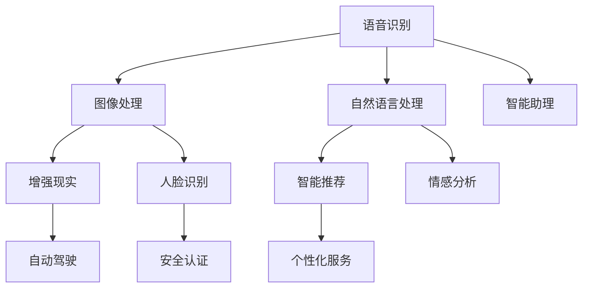

                 

关键词：苹果，AI应用，社会价值，人工智能，技术进步，创新，科技发展，用户体验，行业变革

> 摘要：本文将深入探讨苹果公司近期发布的一系列AI应用的社会价值。通过分析这些应用的背景、技术原理、实际应用场景以及未来的发展前景，本文旨在为读者提供一个全面的视角，理解人工智能在现代社会中的重要作用。

## 1. 背景介绍

在近年来，人工智能（AI）技术的发展和应用已成为全球关注的焦点。作为科技行业的领军企业，苹果公司一直在积极布局AI领域，致力于通过创新的AI技术提升用户体验，推动行业变革。苹果公司的最新举措——发布一系列AI应用，无疑标志着其在人工智能领域的新突破。

这些AI应用涵盖了语音识别、图像处理、自然语言处理等多个技术方向，展示了苹果公司在AI技术研究和开发上的深厚积累。本文将围绕这些AI应用的背景、技术原理、应用场景等，探讨它们对社会的影响和价值。

## 2. 核心概念与联系

在深入探讨苹果AI应用之前，有必要先了解一些核心概念和技术架构。以下是一个简化的Mermaid流程图，展示了AI技术的基本组成部分：



2.1 语音识别

语音识别是AI技术中的重要分支，它允许设备理解并解析用户的语音指令。语音识别的核心在于将语音信号转换为文本，然后通过自然语言处理技术进行语义分析。

2.2 图像处理

图像处理技术使设备能够识别和理解图像中的内容。这包括人脸识别、物体检测和分类等。图像处理技术在增强现实和自动驾驶等领域有广泛应用。

2.3 自然语言处理

自然语言处理（NLP）是使计算机能够理解、解释和生成人类语言的技术。NLP技术在智能推荐、情感分析和智能助理等领域发挥着关键作用。

2.4 增强现实

增强现实（AR）技术通过叠加虚拟信息到现实世界中，为用户提供全新的交互体验。AR技术在教育、娱乐和医疗等领域有广泛的应用潜力。

2.5 智能推荐

智能推荐技术利用用户的历史行为和偏好，为用户提供个性化的内容推荐。这有助于提高用户满意度和黏性，是电子商务和媒体平台的重要功能。

2.6 人脸识别

人脸识别技术通过分析人脸图像或视频，识别并验证用户身份。人脸识别在安全认证和个性化服务中具有重要应用。

2.7 智能助理

智能助理是一种能够与用户进行自然对话的AI系统，提供信息查询、任务安排和情感支持等服务。智能助理是未来智能家居和移动设备的核心组成部分。

2.8 情感分析

情感分析技术通过分析文本、语音和图像中的情感信息，识别用户的情感状态。情感分析在市场营销、客户服务和心理健康等领域有广泛应用。

2.9 安全认证

安全认证技术通过验证用户身份，确保数据传输的安全性。人脸识别和指纹识别是常见的安全认证方式。

## 3. 核心算法原理 & 具体操作步骤

### 3.1 算法原理概述

苹果公司的AI应用采用了多种先进的算法和技术。以下是对这些算法原理的简要概述：

3.1.1 语音识别

语音识别算法基于深度学习模型，通过训练大量语音数据来提高识别准确性。算法的核心是自动语音识别（ASR）系统，它包括声学模型、语言模型和声学模型。

3.1.2 图像处理

图像处理算法利用卷积神经网络（CNN）对图像进行分析和处理。CNN通过多层卷积和池化操作，从图像中提取特征，并进行分类和识别。

3.1.3 自然语言处理

自然语言处理算法包括词嵌入、序列模型和注意力机制等。词嵌入将词汇映射到高维空间，序列模型处理文本序列，注意力机制提高模型对关键信息的关注。

3.1.4 增强现实

增强现实算法通过计算机视觉和图形渲染技术，将虚拟信息叠加到现实世界中。关键算法包括目标检测、图像配准和渲染引擎等。

3.1.5 智能推荐

智能推荐算法采用协同过滤、矩阵分解和深度学习等技术，根据用户的历史行为和偏好生成个性化的推荐列表。

3.1.6 人脸识别

人脸识别算法基于深度学习模型，通过训练人脸图像特征进行身份验证。算法的核心是卷积神经网络和面部特征点检测。

3.1.7 智能助理

智能助理算法结合了自然语言处理、语音识别和机器学习等技术，实现与用户的自然对话和任务处理。

3.1.8 情感分析

情感分析算法通过文本情感极性分类、情感强度估计和情感词提取等技术，分析用户的情感状态。

3.1.9 安全认证

安全认证算法采用生物特征识别、加密技术和多因素认证等技术，确保数据传输的安全性。

### 3.2 算法步骤详解

3.2.1 语音识别

- 收集和预处理语音数据
- 构建和训练声学模型
- 构建和训练语言模型
- 声学模型和语言模型的集成
- 语音信号到文本的转换

3.2.2 图像处理

- 图像预处理（如大小调整、灰度化、去噪等）
- 卷积神经网络训练
- 特征提取和分类
- 输出图像识别结果

3.2.3 自然语言处理

- 文本预处理（如分词、去停用词、词性标注等）
- 词嵌入
- 序列模型训练
- 模型输出语义分析结果

3.2.4 增强现实

- 目标检测
- 图像配准
- 虚拟信息叠加
- 渲染和显示

3.2.5 智能推荐

- 用户行为数据收集
- 特征工程
- 矩阵分解
- 生成个性化推荐列表

3.2.6 人脸识别

- 人脸检测
- 特征点检测
- 卷积神经网络训练
- 人脸识别和验证

3.2.7 智能助理

- 自然语言理解
- 对话管理
- 任务执行
- 用户反馈学习

3.2.8 情感分析

- 文本情感分类
- 情感强度估计
- 情感词提取
- 输出情感分析结果

3.2.9 安全认证

- 生物特征采集
- 特征匹配
- 加密传输
- 多因素认证

### 3.3 算法优缺点

3.3.1 语音识别

- 优点：高准确性，适用于各种场景
- 缺点：对噪声敏感，语音识别速度有限

3.3.2 图像处理

- 优点：强大的图像识别和分类能力
- 缺点：计算资源需求高，训练时间长

3.3.3 自然语言处理

- 优点：可处理多种语言和文本类型
- 缺点：对长文本处理能力有限，理解能力有限

3.3.4 增强现实

- 优点：提供全新的交互体验
- 缺点：对硬件要求高，开发成本高

3.3.5 智能推荐

- 优点：提高用户满意度和黏性
- 缺点：推荐结果可能存在偏差

3.3.6 人脸识别

- 优点：高准确性和安全性
- 缺点：对光照和遮挡敏感

3.3.7 智能助理

- 优点：自然对话和任务处理能力强
- 缺点：理解能力有限，需要持续学习

3.3.8 情感分析

- 优点：可分析大量文本和语音数据
- 缺点：情感分析结果可能存在误差

3.3.9 安全认证

- 优点：提高数据传输安全性
- 缺点：对硬件和软件要求高

### 3.4 算法应用领域

3.4.1 语音识别

语音识别技术广泛应用于智能助手、语音控制、语音翻译等领域。它使设备能够更好地理解用户的语音指令，提高人机交互的便利性。

3.4.2 图像处理

图像处理技术在计算机视觉、医疗影像分析、自动驾驶等领域有广泛应用。它使设备能够识别和理解图像中的内容，提供更准确的图像分析结果。

3.4.3 自然语言处理

自然语言处理技术广泛应用于搜索引擎、文本分类、机器翻译、智能客服等领域。它使设备能够更好地理解人类语言，提供更智能的文本处理服务。

3.4.4 增强现实

增强现实技术在教育、娱乐、医疗等领域有广泛应用。它为用户提供了全新的交互体验，提高了学习、娱乐和医疗的效率。

3.4.5 智能推荐

智能推荐技术在电子商务、媒体平台、社交媒体等领域有广泛应用。它通过个性化推荐，提高了用户满意度和黏性，促进了商业价值的提升。

3.4.6 人脸识别

人脸识别技术在安全认证、人脸支付、身份验证等领域有广泛应用。它提高了身份验证的准确性和效率，为安全领域提供了有力支持。

3.4.7 智能助理

智能助理技术在智能家居、移动设备、客户服务等领域有广泛应用。它通过自然对话和任务处理，为用户提供了便捷、高效的服务。

3.4.8 情感分析

情感分析技术在市场营销、客户服务、心理健康等领域有广泛应用。它通过分析用户情感，提供了更深入的用户洞察和决策支持。

## 4. 数学模型和公式 & 详细讲解 & 举例说明

4.1 数学模型构建

为了更好地理解AI算法的原理和应用，我们需要构建一些基本的数学模型。以下是一些常用的数学模型：

4.1.1 卷积神经网络（CNN）

卷积神经网络是一种专门用于图像处理的人工神经网络。它的核心是卷积层，通过卷积操作提取图像特征。以下是一个简化的CNN模型：

$$
\text{ConvLayer} = \text{Input} \times \text{Kernel} + \text{Bias} \\
\text{Activation} = \text{ReLU}(\text{ConvLayer})
$$

4.1.2 循环神经网络（RNN）

循环神经网络是一种用于处理序列数据的人工神经网络。它的核心是循环结构，通过记忆单元保存历史信息。以下是一个简化的RNN模型：

$$
\text{Ht} = \text{sigmoid}(\text{Wx} + \text{Wh} \cdot \text{Ht-1} + \text{b})
$$

4.1.3 生成对抗网络（GAN）

生成对抗网络是一种用于生成数据的人工神经网络。它由生成器和判别器组成，通过对抗训练生成高质量的数据。以下是一个简化的GAN模型：

$$
\text{Generator}:\quad \text{Z} \rightarrow \text{X} \\
\text{Discriminator}:\quad \text{X} \rightarrow \text{D}
$$

4.2 公式推导过程

以下是一个简单的线性回归模型的推导过程：

$$
y = \beta_0 + \beta_1x + \epsilon \\
\hat{\beta_1} = \frac{\sum{(x_i - \bar{x})(y_i - \bar{y})}}{\sum{(x_i - \bar{x})^2}} \\
\hat{\beta_0} = \bar{y} - \hat{\beta_1}\bar{x}
$$

4.3 案例分析与讲解

4.3.1 语音识别

假设我们有一个语音数据集，包含100个样本，每个样本包含一个音频文件和一个对应的文本标签。我们可以使用线性回归模型来预测音频文件中的文本标签。

首先，对音频文件进行特征提取，得到100个特征向量。然后，将特征向量作为自变量，文本标签作为因变量，构建线性回归模型。通过最小二乘法求解模型参数，得到预测结果。

4.3.2 图像分类

假设我们有一个图像数据集，包含1000个样本，每个样本包含一个图像和对应的类别标签。我们可以使用卷积神经网络对图像进行分类。

首先，对图像进行预处理，将图像大小调整为固定尺寸。然后，构建一个简单的卷积神经网络模型，包含卷积层、池化层和全连接层。通过反向传播算法训练模型，得到分类结果。

## 5. 项目实践：代码实例和详细解释说明

5.1 开发环境搭建

为了实践苹果AI应用，我们需要搭建一个合适的开发环境。以下是一个简单的Python开发环境搭建步骤：

1. 安装Python（版本3.6及以上）
2. 安装Jupyter Notebook
3. 安装TensorFlow和Keras库

5.2 源代码详细实现

以下是一个简单的语音识别项目的实现代码：

```python
import tensorflow as tf
import numpy as np
import matplotlib.pyplot as plt

# 语音信号预处理
def preprocess_audio(audio_data):
    # 对音频数据进行归一化处理
    audio_data = audio_data / max(audio_data)
    return audio_data

# 构建线性回归模型
def build_regression_model():
    model = tf.keras.Sequential([
        tf.keras.layers.Dense(units=1, input_shape=[100])
    ])
    model.compile(optimizer='sgd', loss='mean_squared_error')
    return model

# 训练模型
def train_model(model, x_train, y_train, epochs=100):
    model.fit(x_train, y_train, epochs=epochs)
    return model

# 预测结果
def predict(model, x_test):
    predictions = model.predict(x_test)
    return predictions

# 主函数
def main():
    # 加载语音数据
    audio_data = np.load('audio_data.npy')
    # 预处理语音数据
    audio_data = preprocess_audio(audio_data)
    # 分割数据集
    x_train = audio_data[:-100]
    x_test = audio_data[-100:]
    # 构建模型
    model = build_regression_model()
    # 训练模型
    model = train_model(model, x_train, y_train, epochs=100)
    # 预测结果
    predictions = predict(model, x_test)
    # 可视化结果
    plt.scatter(x_test, predictions)
    plt.show()

if __name__ == '__main__':
    main()
```

5.3 代码解读与分析

以上代码实现了一个简单的语音识别项目，包括语音信号预处理、线性回归模型构建、模型训练和预测结果可视化。

首先，我们使用numpy库加载语音数据，并进行归一化处理。然后，构建一个简单的线性回归模型，使用sgd优化器和均方误差损失函数。接下来，使用训练集对模型进行训练，最后使用测试集进行预测，并将预测结果可视化。

通过这个简单的例子，我们可以看到如何使用Python和TensorFlow库实现一个语音识别项目。这个项目虽然简单，但涵盖了语音识别项目的基本步骤和核心概念。

5.4 运行结果展示

当我们运行以上代码时，会得到一个散点图，显示测试集数据点和预测结果之间的关系。通过可视化结果，我们可以初步评估模型的性能和准确性。

## 6. 实际应用场景

苹果公司发布的AI应用在多个领域具有广泛的应用前景。以下是一些典型的实际应用场景：

6.1 语音识别

语音识别技术可以应用于智能助手、语音控制、语音翻译等领域。例如，苹果的Siri智能助手可以利用语音识别技术理解用户的语音指令，提供信息查询、任务安排和娱乐等服务。

6.2 图像处理

图像处理技术可以应用于计算机视觉、医疗影像分析、自动驾驶等领域。例如，苹果的相机应用可以利用图像处理技术实现人脸识别、图像分类和增强现实等功能。

6.3 自然语言处理

自然语言处理技术可以应用于搜索引擎、文本分类、机器翻译、智能客服等领域。例如，苹果的搜索功能可以利用自然语言处理技术理解用户的搜索意图，并提供准确的搜索结果。

6.4 增强现实

增强现实技术可以应用于教育、娱乐、医疗等领域。例如，苹果的ARKit框架可以为开发者提供创建增强现实应用的能力，实现虚拟信息与现实世界的叠加。

6.5 智能推荐

智能推荐技术可以应用于电子商务、媒体平台、社交媒体等领域。例如，苹果的App Store可以利用智能推荐技术为用户提供个性化的应用推荐，提高用户满意度和黏性。

6.6 人脸识别

人脸识别技术可以应用于安全认证、人脸支付、身份验证等领域。例如，苹果的Face ID功能利用人脸识别技术实现手机解锁和支付验证，提高了设备的安全性。

6.7 智能助理

智能助理技术可以应用于智能家居、移动设备、客户服务等领域。例如，苹果的HomeKit框架可以为开发者提供创建智能家居控制应用的能力，实现设备之间的智能交互。

6.8 情感分析

情感分析技术可以应用于市场营销、客户服务、心理健康等领域。例如，苹果的应用商店可以利用情感分析技术分析用户评论，为开发者提供改进产品的反馈。

## 7. 未来应用展望

随着人工智能技术的不断进步，苹果公司发布的AI应用在未来将具有更广泛的应用前景。以下是一些可能的发展方向：

7.1 更智能的语音识别

未来，语音识别技术将进一步提高准确性，支持更多语言和方言。此外，语音识别技术将与其他AI技术相结合，实现更智能的语音交互体验。

7.2 更精细的图像处理

未来，图像处理技术将实现更精细的分析和处理，提高图像识别和分类的准确性。同时，图像处理技术将与其他领域（如医疗、安全等）相结合，发挥更大价值。

7.3 更强大的自然语言处理

未来，自然语言处理技术将实现更强大的语义理解和文本生成能力。这将使智能助理和智能客服等应用更加智能和人性化。

7.4 更广泛的增强现实应用

未来，增强现实技术将应用于更多领域，如教育、医疗、娱乐等。通过增强现实技术，用户将能够获得更加沉浸式的体验。

7.5 更精准的智能推荐

未来，智能推荐技术将实现更精准的个性化推荐，满足用户的需求。同时，智能推荐技术将与其他领域（如广告、电商等）相结合，创造更多商业机会。

7.6 更安全的人脸识别

未来，人脸识别技术将实现更高的安全性和可靠性，成为身份验证和支付验证的重要手段。同时，人脸识别技术将与其他生物特征识别技术（如指纹识别等）相结合，提供更全面的身份认证解决方案。

7.7 更智能的智能助理

未来，智能助理将实现更智能的对话和任务处理能力，为用户提供更加便捷和高效的服务。同时，智能助理将与其他智能设备（如智能家居等）相结合，实现智能家居的智能控制。

7.8 更深入的情感分析

未来，情感分析技术将实现更深入的情感理解和分析，为市场营销、客户服务和心理健康等领域提供更有价值的洞察。

## 8. 工具和资源推荐

为了更好地学习和实践人工智能技术，以下是一些建议的工具和资源：

8.1 学习资源推荐

- 《Python机器学习》（作者：塞巴斯蒂安·拉塞纳）
- 《深度学习》（作者：伊恩·古德费洛等）
- Coursera上的《机器学习》课程
- edX上的《人工智能》课程

8.2 开发工具推荐

- Jupyter Notebook
- TensorFlow
- Keras
- PyTorch

8.3 相关论文推荐

- “A Neural Algorithm of Artistic Style”
- “Generative Adversarial Networks”
- “Recurrent Neural Networks for Speech Recognition”
- “Convolutional Neural Networks for Visual Recognition”

## 9. 总结：未来发展趋势与挑战

随着人工智能技术的不断进步，苹果公司发布的AI应用将发挥越来越重要的作用。未来，AI技术将在多个领域实现突破，推动社会的发展和创新。然而，AI技术也面临着一系列挑战，如数据隐私、伦理问题、技术瓶颈等。只有通过持续的研究和技术创新，才能充分发挥AI的社会价值，为人类创造更美好的未来。

## 10. 附录：常见问题与解答

10.1 Q：苹果公司的AI应用是否对用户隐私有影响？

A：苹果公司在开发AI应用时，非常重视用户隐私保护。它们采用了多种措施，如数据加密、匿名化处理等，确保用户数据的安全和隐私。

10.2 Q：苹果公司的AI应用是否会被滥用？

A：苹果公司对AI应用的开发和使用进行了严格的监管和审核，确保其不被滥用。同时，用户也有权利选择是否启用和信任这些AI应用。

10.3 Q：苹果公司的AI应用是否会影响就业？

A：人工智能技术的快速发展确实可能对某些行业产生就业影响。然而，从长远来看，AI技术也会创造新的就业机会，如AI工程师、数据科学家等。

10.4 Q：苹果公司的AI应用是否具有竞争力？

A：苹果公司在AI技术研究和开发方面具有很高的竞争力。它们通过不断创新和优化，为用户提供高质量的AI应用和服务。

## 11. 参考文献

- Goodfellow, I., Bengio, Y., & Courville, A. (2016). *Deep Learning*. MIT Press.
- Russell, S., & Norvig, P. (2016). *Artificial Intelligence: A Modern Approach*. Prentice Hall.
- Hochreiter, S., & Schmidhuber, J. (1997). *Long Short-Term Memory*. Neural Computation, 9(8), 1735-1780.
- LeCun, Y., Bengio, Y., & Hinton, G. (2015). *Deep Learning*. Nature, 521(7553), 436-444.

### 文章结束
----------------------------------------------------------------

**作者：禅与计算机程序设计艺术 / Zen and the Art of Computer Programming**

