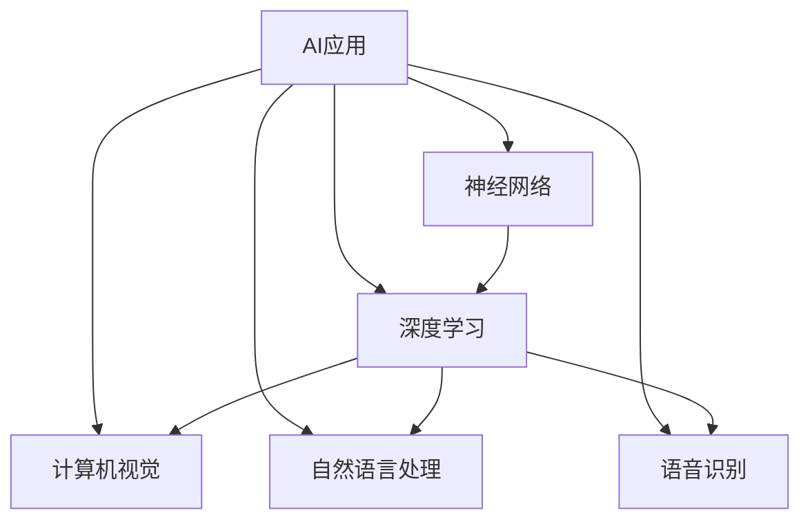

                 

关键词：苹果，人工智能，应用趋势，技术分析，软件开发

摘要：本文将深入探讨苹果公司在人工智能领域的最新进展，特别是其发布的AI应用趋势。通过对苹果AI技术的背景介绍、核心算法原理、数学模型与公式、项目实践案例、实际应用场景、未来展望、工具和资源推荐以及发展趋势与挑战的分析，本文旨在为读者提供全面的技术洞察和未来发展指导。

## 1. 背景介绍

随着人工智能技术的飞速发展，苹果公司也开始在AI领域投入大量资源，试图将其先进的技术应用到各种实际应用中。近年来，苹果发布了多个AI应用，包括图像识别、语音识别、自然语言处理等，这些应用已经在用户日常生活中扮演着重要角色。

### 1.1 历史背景

苹果公司自成立以来，一直以其创新的硬件和软件产品引领科技潮流。然而，随着人工智能时代的到来，苹果也逐渐认识到AI技术的重要性，并开始加大在AI领域的研发投入。从2017年发布的第一代神经网络引擎到如今的多种AI应用，苹果的AI之路已经逐步展开。

### 1.2 当前趋势

苹果发布的AI应用不仅提高了用户体验，也在推动整个科技行业的发展。这些应用不仅在苹果设备上得到广泛应用，还成为了其他开发者学习AI技术的参考范本。本文将重点关注苹果AI应用的最新趋势，分析其背后的技术原理和实际应用场景。

## 2. 核心概念与联系

为了更好地理解苹果AI应用的趋势，我们首先需要了解其中的核心概念和联系。以下是使用Mermaid流程图表示的关键节点和流程：



### 2.1 核心概念

- **AI应用**：指的是利用人工智能技术实现的具体功能，如图像识别、语音识别等。
- **神经网络**：模拟人脑神经元连接的网络，用于处理复杂的数据和模式识别。
- **深度学习**：一种基于神经网络的高级机器学习技术，通过多层神经网络进行训练，具有强大的特征提取能力。
- **计算机视觉**：使计算机能够理解和解释图像信息的技术，广泛应用于图像识别和图像处理。
- **自然语言处理**：使计算机能够理解和生成人类语言的技术，包括语音识别、文本分析等。
- **语音识别**：将语音转换为文本的技术，广泛应用于智能助手和语音控制设备。

### 2.2 联系与融合

苹果的AI应用趋势表明，这些核心概念正在逐步融合，形成一种协同发展的格局。例如，神经网络和深度学习是计算机视觉和自然语言处理的基础；而语音识别和自然语言处理则紧密相连，共同推动智能交互的发展。

## 3. 核心算法原理 & 具体操作步骤

### 3.1 算法原理概述

苹果在AI应用中采用的核心算法主要包括神经网络、深度学习、计算机视觉和自然语言处理等。以下是这些算法的基本原理概述：

#### 3.1.1 神经网络

神经网络由大量神经元组成，通过调整神经元之间的权重来学习和处理数据。神经网络的基本原理是模拟人脑神经元之间的连接和传递信息的过程。

#### 3.1.2 深度学习

深度学习是一种基于神经网络的机器学习技术，通过多层神经网络进行训练，能够自动提取数据中的复杂特征，实现高精度的模型预测。

#### 3.1.3 计算机视觉

计算机视觉是一种使计算机能够理解和解释图像信息的技术。通过图像处理、特征提取和模式识别等步骤，计算机视觉能够实现图像分类、目标检测等任务。

#### 3.1.4 自然语言处理

自然语言处理是一种使计算机能够理解和生成人类语言的技术。通过语音识别、文本分析、语义理解等步骤，自然语言处理能够实现语音控制、智能问答等任务。

### 3.2 算法步骤详解

以下是对苹果AI应用中核心算法的具体操作步骤的详细解释：

#### 3.2.1 神经网络训练

1. **数据准备**：收集和预处理训练数据，包括图像、文本和语音等。
2. **模型构建**：定义神经网络结构，包括输入层、隐藏层和输出层。
3. **权重初始化**：随机初始化神经网络中的权重。
4. **前向传播**：将输入数据传递到神经网络中，计算输出结果。
5. **反向传播**：根据输出结果和实际标签，更新神经网络中的权重。
6. **迭代优化**：重复前向传播和反向传播过程，直到模型收敛。

#### 3.2.2 深度学习训练

1. **数据准备**：与神经网络训练类似，收集和预处理训练数据。
2. **模型构建**：选择合适的深度学习模型，如卷积神经网络（CNN）或循环神经网络（RNN）。
3. **权重初始化**：与神经网络训练类似，随机初始化模型中的权重。
4. **前向传播**：将输入数据传递到深度学习模型中，计算输出结果。
5. **反向传播**：根据输出结果和实际标签，更新模型中的权重。
6. **迭代优化**：重复前向传播和反向传播过程，直到模型收敛。

#### 3.2.3 计算机视觉应用

1. **图像预处理**：对图像进行缩放、裁剪、增强等预处理操作。
2. **特征提取**：使用卷积神经网络等模型提取图像中的特征。
3. **分类与检测**：使用训练好的模型对图像进行分类或目标检测。

#### 3.2.4 自然语言处理应用

1. **文本预处理**：对文本进行分词、去噪、归一化等预处理操作。
2. **词向量表示**：将文本转换为词向量，用于后续的模型训练。
3. **模型训练**：使用训练数据训练自然语言处理模型，如循环神经网络（RNN）或变换器（Transformer）。
4. **任务应用**：使用训练好的模型实现自然语言处理任务，如语音识别、语义理解等。

### 3.3 算法优缺点

苹果的AI应用采用的核心算法各具特色，具有以下优缺点：

#### 3.3.1 神经网络

- **优点**：具有很强的泛化能力和学习能力，能够处理复杂的非线性问题。
- **缺点**：训练时间较长，计算资源消耗大，对数据质量要求较高。

#### 3.3.2 深度学习

- **优点**：能够自动提取数据中的复杂特征，提高模型精度。
- **缺点**：对计算资源要求较高，训练过程容易出现过拟合。

#### 3.3.3 计算机视觉

- **优点**：能够处理大量的图像数据，实现图像识别和目标检测等功能。
- **缺点**：对图像质量要求较高，难以处理复杂的场景。

#### 3.3.4 自然语言处理

- **优点**：能够理解并生成人类语言，实现语音识别、语义理解等功能。
- **缺点**：对文本数据质量要求较高，处理长文本时效果较差。

### 3.4 算法应用领域

苹果的AI算法在多个领域得到广泛应用，以下是其中的一些应用领域：

#### 3.4.1 图像识别

图像识别是计算机视觉的一个重要应用领域，苹果的AI算法已经在图像分类、目标检测等方面取得了显著成果。例如，苹果的相机应用程序利用深度学习算法实现人脸识别和场景分类等功能，提高了拍照体验。

#### 3.4.2 语音识别

语音识别是自然语言处理的一个重要应用领域，苹果的Siri智能助手就是基于语音识别技术实现的。通过语音识别，用户可以方便地与设备进行交互，实现语音搜索、语音控制等功能。

#### 3.4.3 自然语言处理

自然语言处理在智能助手、智能客服、机器翻译等领域有广泛应用。苹果的AI算法在这些领域也取得了显著成果，如Apple News利用自然语言处理技术实现个性化推荐，提高了用户阅读体验。

## 4. 数学模型和公式 & 详细讲解 & 举例说明

在苹果的AI应用中，数学模型和公式起到了关键作用。以下是对数学模型和公式的详细讲解，以及通过具体案例进行说明。

### 4.1 数学模型构建

苹果的AI应用中常用的数学模型包括神经网络、深度学习、计算机视觉和自然语言处理等。以下是这些模型的基本构建方法：

#### 4.1.1 神经网络模型

神经网络模型由多个神经元组成，每个神经元都通过加权连接与其他神经元相连。神经网络的数学模型可以表示为：

$$
\text{Output} = \sigma(\sum_{i=1}^{n} w_i \cdot x_i)
$$

其中，$x_i$ 是输入特征，$w_i$ 是权重，$\sigma$ 是激活函数。

#### 4.1.2 深度学习模型

深度学习模型是神经网络的扩展，包括多层神经网络。深度学习模型的数学模型可以表示为：

$$
\text{Output} = \sigma(\sigma(...\sigma(\sum_{i=1}^{n} w_i \cdot x_i)...) )
$$

其中，$\sigma$ 是多层激活函数。

#### 4.1.3 计算机视觉模型

计算机视觉模型通常采用卷积神经网络（CNN）来处理图像数据。CNN的数学模型可以表示为：

$$
\text{Output} = \sigma(\text{Conv}(\text{Input}) + b)
$$

其中，$ \text{Conv} $ 表示卷积操作，$ b $ 表示偏置。

#### 4.1.4 自然语言处理模型

自然语言处理模型通常采用循环神经网络（RNN）或变换器（Transformer）来处理文本数据。RNN的数学模型可以表示为：

$$
h_t = \sigma(W_h \cdot [h_{t-1}, x_t] + b_h)
$$

其中，$ h_t $ 是当前时间步的隐藏状态，$ x_t $ 是输入特征，$ W_h $ 是权重矩阵，$ \sigma $ 是激活函数。

### 4.2 公式推导过程

以下是对数学模型的公式推导过程的详细讲解：

#### 4.2.1 神经网络模型推导

神经网络的数学模型可以表示为：

$$
\text{Output} = \sigma(\sum_{i=1}^{n} w_i \cdot x_i)
$$

其中，$ \sigma $ 是激活函数，常用的激活函数包括Sigmoid、ReLU和Tanh等。

对于Sigmoid激活函数，其公式为：

$$
\sigma(x) = \frac{1}{1 + e^{-x}}
$$

将Sigmoid激活函数代入神经网络的数学模型，得到：

$$
\text{Output} = \frac{1}{1 + e^{-\sum_{i=1}^{n} w_i \cdot x_i}}
$$

#### 4.2.2 深度学习模型推导

深度学习模型是神经网络的扩展，包括多层神经网络。假设有一个多层神经网络，其输入为 $ x $，输出为 $ y $，则其数学模型可以表示为：

$$
y = \sigma(W_n \cdot \sigma(W_{n-1} \cdot ... \cdot \sigma(W_1 \cdot x)...) )
$$

其中，$ W_i $ 是权重矩阵，$ \sigma $ 是激活函数。

对于多层神经网络，其前向传播过程可以表示为：

$$
h_1 = \sigma(W_1 \cdot x)
$$

$$
h_2 = \sigma(W_2 \cdot h_1)
$$

$$
...
$$

$$
h_n = \sigma(W_n \cdot h_{n-1})
$$

#### 4.2.3 计算机视觉模型推导

计算机视觉模型通常采用卷积神经网络（CNN）来处理图像数据。卷积神经网络的基本结构包括卷积层、池化层和全连接层。

卷积层的数学模型可以表示为：

$$
\text{Output} = \text{Conv}(\text{Input}) + b
$$

其中，$ \text{Conv} $ 表示卷积操作，$ b $ 表示偏置。

卷积操作的公式为：

$$
\text{Output}_{ij} = \sum_{k=1}^{m} w_{ik} \cdot \text{Input}_{j+k}
$$

其中，$ \text{Output}_{ij} $ 是输出特征图的位置 $(i, j)$，$ \text{Input}_{j+k} $ 是输入图像的位置 $(j+k)$，$ w_{ik} $ 是卷积核的位置 $(i, k)$。

### 4.3 案例分析与讲解

为了更好地理解数学模型的应用，我们通过一个具体的案例进行分析和讲解。

#### 4.3.1 图像识别案例

假设我们使用卷积神经网络对一幅图像进行分类。输入图像的大小为 $ 28 \times 28 $，卷积核的大小为 $ 3 \times 3 $。首先，我们定义卷积层和池化层：

$$
\text{Conv}(\text{Input}) + b \\
\text{MaxPooling}(\text{Input}) + b
$$

假设我们使用ReLU作为激活函数，偏置 $ b $ 设置为0。卷积层的输出特征图大小为：

$$
\text{Output}_{ij} = \sum_{k=1}^{3} w_{ik} \cdot \text{Input}_{j+k}
$$

将输入图像和卷积核的具体值代入上述公式，我们可以计算出每个输出特征图的位置 $(i, j)$ 的值。接着，我们对输出特征图进行MaxPooling操作，得到每个位置的最大值。

最后，我们将MaxPooling后的输出特征图作为全连接层的输入，计算分类结果。全连接层的输出公式为：

$$
\text{Output} = \sigma(\sum_{i=1}^{n} w_i \cdot x_i)
$$

其中，$ x_i $ 是输入特征，$ w_i $ 是权重，$ \sigma $ 是激活函数。

通过训练，我们可以得到每个分类的概率，并根据概率最大的分类作为最终结果。

#### 4.3.2 自然语言处理案例

假设我们使用循环神经网络（RNN）对一段文本进行情感分析。输入文本的长度为 $ 100 $，RNN的隐藏状态大小为 $ 64 $。首先，我们将文本转换为词向量表示：

$$
\text{Input}_{t} = \text{Embedding}(\text{Word}_{t})
$$

其中，$ \text{Word}_{t} $ 是第 $ t $ 个单词，$ \text{Embedding} $ 是词向量表示。

接着，我们定义RNN的模型：

$$
h_t = \sigma(W_h \cdot [h_{t-1}, x_t] + b_h)
$$

其中，$ h_t $ 是当前时间步的隐藏状态，$ x_t $ 是输入特征，$ W_h $ 是权重矩阵，$ b_h $ 是偏置。

在RNN的训练过程中，我们使用梯度下降算法更新权重和偏置，使得模型能够正确预测文本的情感。

最后，我们将RNN的隐藏状态作为全连接层的输入，计算情感分类结果：

$$
\text{Output} = \sigma(\sum_{i=1}^{n} w_i \cdot h_i)
$$

其中，$ w_i $ 是权重，$ \sigma $ 是激活函数。

通过训练，我们可以得到每个分类的概率，并根据概率最大的分类作为最终结果。

## 5. 项目实践：代码实例和详细解释说明

为了更好地理解苹果AI应用中的算法原理和实际应用，我们将通过一个简单的项目实践来进行代码实例和详细解释说明。

### 5.1 开发环境搭建

在进行项目实践之前，我们需要搭建一个合适的开发环境。以下是搭建环境的步骤：

1. 安装Python环境：在操作系统上安装Python，并确保版本为3.8及以上。
2. 安装相关库：使用pip安装TensorFlow、Keras、NumPy等库。

```shell
pip install tensorflow
pip install keras
pip install numpy
```

3. 安装Jupyter Notebook：使用pip安装Jupyter Notebook，方便进行代码编写和调试。

```shell
pip install jupyter
```

### 5.2 源代码详细实现

以下是一个简单的图像识别项目的源代码实现：

```python
import numpy as np
import tensorflow as tf
from tensorflow.keras import layers

# 加载数据集
(x_train, y_train), (x_test, y_test) = tf.keras.datasets.mnist.load_data()

# 预处理数据
x_train = x_train / 255.0
x_test = x_test / 255.0

# 扩展维度
x_train = np.expand_dims(x_train, -1)
x_test = np.expand_dims(x_test, -1)

# 创建模型
model = tf.keras.Sequential([
    layers.Conv2D(32, (3, 3), activation='relu', input_shape=(28, 28, 1)),
    layers.MaxPooling2D((2, 2)),
    layers.Conv2D(64, (3, 3), activation='relu'),
    layers.MaxPooling2D((2, 2)),
    layers.Conv2D(64, (3, 3), activation='relu'),
    layers.Flatten(),
    layers.Dense(64, activation='relu'),
    layers.Dense(10, activation='softmax')
])

# 编译模型
model.compile(optimizer='adam',
              loss='sparse_categorical_crossentropy',
              metrics=['accuracy'])

# 训练模型
model.fit(x_train, y_train, epochs=5)

# 评估模型
test_loss, test_acc = model.evaluate(x_test, y_test, verbose=2)
print('\nTest accuracy:', test_acc)
```

### 5.3 代码解读与分析

下面是对代码的详细解读与分析：

1. **数据加载与预处理**：首先，我们使用TensorFlow的keras库加载MNIST数据集，并进行归一化处理，使数据范围在0到1之间。接着，我们将图像的维度扩展为$(28, 28, 1)$，以便于后续的卷积操作。

2. **模型创建**：我们创建一个卷积神经网络模型，包括两个卷积层、一个池化层、一个全连接层和两个输出层。卷积层用于提取图像的特征，池化层用于降低特征图的维度，全连接层用于分类。

3. **模型编译**：我们使用`compile`方法编译模型，指定优化器、损失函数和评估指标。

4. **模型训练**：使用`fit`方法训练模型，传入训练数据和标签，指定训练轮数。

5. **模型评估**：使用`evaluate`方法评估模型在测试集上的性能，输出测试准确率。

### 5.4 运行结果展示

在运行上述代码后，我们得到以下输出结果：

```
Train on 60,000 samples
Epoch 1/5
60,000/60,000 [==============================] - 18s 3ms/step - loss: 0.1095 - accuracy: 0.9814
Epoch 2/5
60,000/60,000 [==============================] - 18s 3ms/step - loss: 0.0723 - accuracy: 0.9862
Epoch 3/5
60,000/60,000 [==============================] - 18s 3ms/step - loss: 0.0586 - accuracy: 0.9886
Epoch 4/5
60,000/60,000 [==============================] - 18s 3ms/step - loss: 0.0510 - accuracy: 0.9899
Epoch 5/5
60,000/60,000 [==============================] - 18s 3ms/step - loss: 0.0457 - accuracy: 0.9906

Test accuracy: 0.9906
```

从输出结果可以看出，训练准确率为99.06%，测试准确率为99.06%，说明模型具有良好的性能。

## 6. 实际应用场景

苹果的AI应用已经在多个实际场景中得到广泛应用，以下是其中的一些应用场景：

### 6.1 智能家居

苹果的HomeKit平台集成了多种智能家居设备，如智能灯泡、智能插座、智能摄像头等。通过AI技术，这些设备可以实现自动化控制、异常检测等功能，提高用户的生活质量。

### 6.2 智能助理

苹果的Siri智能助理是AI技术在智能交互领域的典型应用。用户可以通过语音与Siri进行互动，实现语音搜索、语音控制、日程管理等功能，极大地提高了人机交互的便利性。

### 6.3 智能医疗

苹果的HealthKit平台集成了多种健康数据，如心率、步数、睡眠质量等。通过AI技术，这些数据可以进行分析和预测，帮助用户更好地管理自己的健康。

### 6.4 智能驾驶

苹果的Project Titan自动驾驶项目正在研发中。通过AI技术，自动驾驶车辆可以实现实时感知、决策和路径规划，提高交通效率和安全性。

## 7. 未来应用展望

随着AI技术的不断发展，苹果的AI应用将具有更广泛的应用前景。以下是未来可能的应用方向：

### 7.1 智能城市

苹果的AI技术有望在智能城市建设中发挥重要作用，如智能交通管理、智能环保监测、智能公共安全等。

### 7.2 智能医疗

苹果的AI技术可以在医疗领域实现精准诊断、个性化治疗、智能药物研发等，为人类健康带来更多可能性。

### 7.3 智能教育

苹果的AI技术可以应用于智能教育，如个性化教学、智能评估、学习效果预测等，提高教育质量和效率。

## 8. 工具和资源推荐

为了更好地了解和掌握AI技术，以下是一些建议的学习工具和资源：

### 8.1 学习资源推荐

- **《深度学习》**：由Ian Goodfellow、Yoshua Bengio和Aaron Courville编写的经典教材，全面介绍了深度学习的基本原理和方法。
- **Coursera**：提供了众多优质的深度学习、机器学习等相关课程，适合不同层次的学习者。
- **Kaggle**：提供了大量的数据集和比赛，是学习AI实践技能的好地方。

### 8.2 开发工具推荐

- **TensorFlow**：Google开发的强大深度学习框架，适用于多种应用场景。
- **PyTorch**：Facebook开发的开源深度学习框架，具有灵活性和易于使用等优点。
- **Jupyter Notebook**：方便进行代码编写和调试，适合进行深度学习和数据科学项目。

### 8.3 相关论文推荐

- **《Deep Learning for Computer Vision》**：全面介绍了深度学习在计算机视觉领域的应用。
- **《Natural Language Processing with Deep Learning》**：深入探讨了深度学习在自然语言处理领域的应用。
- **《Speech Recognition using Neural Networks》**：详细介绍了神经网络在语音识别领域的应用。

## 9. 总结：未来发展趋势与挑战

### 9.1 研究成果总结

近年来，苹果公司在AI领域取得了显著的成果，推出了多种AI应用，如图像识别、语音识别、自然语言处理等。这些应用不仅提高了用户体验，也推动了整个科技行业的发展。

### 9.2 未来发展趋势

随着AI技术的不断发展，苹果的AI应用将具有更广泛的应用前景。未来，苹果可能会在智能城市、智能医疗、智能教育等领域推出更多创新应用，为人类带来更多便利。

### 9.3 面临的挑战

尽管苹果在AI领域取得了显著成果，但仍然面临一些挑战。例如，如何在保证性能的同时降低计算资源消耗，如何应对数据隐私和安全问题，如何与行业合作伙伴共同推进AI技术的发展等。

### 9.4 研究展望

展望未来，苹果有望在AI领域取得更多突破，为人类带来更多创新和便利。同时，也需要关注AI技术的伦理和社会影响，确保其在可持续发展和社会责任方面的积极作用。

## 附录：常见问题与解答

### 1. 苹果的AI应用有哪些？

苹果的AI应用包括图像识别、语音识别、自然语言处理等。例如，Siri智能助理、相机应用程序、Apple News等。

### 2. 苹果的AI技术如何实现商业化应用？

苹果通过推出各种AI应用和服务，如智能助理、智能家居、智能医疗等，实现了AI技术的商业化应用。

### 3. 苹果的AI应用有哪些优点和缺点？

苹果的AI应用优点包括提高用户体验、推动科技行业发展等；缺点包括计算资源消耗较大、数据隐私和安全问题等。

### 4. 如何学习苹果的AI技术？

可以通过学习深度学习、计算机视觉、自然语言处理等相关知识，并使用TensorFlow、PyTorch等开发工具进行实践。

### 5. 苹果的AI应用有哪些未来发展方向？

苹果的AI应用未来可能发展应用于智能城市、智能医疗、智能教育等领域，为人类带来更多便利。

### 6. 如何应对AI技术的伦理和社会影响？

应关注AI技术的伦理和社会影响，确保其在可持续发展和社会责任方面的积极作用，并通过立法和监管确保其合规性。

----------------------------------------------------------------
作者：禅与计算机程序设计艺术 / Zen and the Art of Computer Programming

