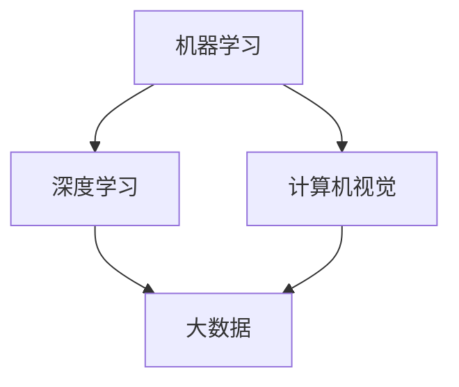

                 

在当前技术迅猛发展的时代，人工智能（AI）和大数据无疑是引领变革的两大重要力量。本文将聚焦于一位杰出的科学家——李飞飞，探讨她在AI大数据领域的卓越贡献以及对未来科技发展的重要启示。

## 关键词

- 李飞飞
- 人工智能
- 大数据
- 机器学习
- 未来技术

## 摘要

本文旨在通过介绍李飞飞在人工智能和大数据领域的突出贡献，分析其对未来科技发展的影响。文章将从背景介绍、核心概念与联系、核心算法原理、数学模型与公式、项目实践、实际应用场景、工具和资源推荐等多个角度展开，旨在为读者提供一个全面而深入的视角，理解AI与大数据的深远意义。

## 1. 背景介绍

李飞飞是一位享有国际声誉的人工智能和机器学习专家，她在计算机视觉、深度学习等领域取得了卓越的成就。李飞飞在AI大数据领域的贡献不仅体现在技术创新上，更体现在她对于AI伦理和社会影响的深刻思考。

### 李飞飞的贡献

李飞飞的贡献在AI领域尤为显著。她不仅参与了许多重要的AI项目，还在学术界发表了大量的研究论文。她领导的项目之一是ImageNet，这是一个大规模的视觉数据库，对于推动计算机视觉技术的发展起到了至关重要的作用。

### 大数据的重要性

随着互联网和物联网的发展，大数据的时代已经来临。大数据不仅为科学研究提供了丰富的数据资源，还为商业、医疗、交通等多个领域带来了前所未有的机遇。李飞飞的工作展示了大数据如何与AI相结合，创造出更加智能和高效的应用。

## 2. 核心概念与联系

在探讨李飞飞的工作之前，我们需要了解几个核心概念，这些概念构成了AI与大数据技术的基础。

### 机器学习

机器学习是AI的核心组成部分，它使得计算机系统能够通过数据和经验进行学习和优化。机器学习算法包括监督学习、无监督学习和强化学习等。

### 深度学习

深度学习是机器学习的一个子领域，它通过多层神经网络模拟人脑的学习机制。深度学习在图像识别、语音识别和自然语言处理等方面取得了显著成果。

### 计算机视觉

计算机视觉是人工智能的一个分支，致力于使计算机能够像人类一样理解和解释视觉信息。计算机视觉与深度学习密切相关，二者共同推动了图像识别和视频分析的发展。

### 大数据

大数据指的是数据量大、种类多、速度快的数据集合。大数据技术可以帮助我们更好地存储、处理和分析这些数据，从而发现新的知识和洞见。

### Mermaid流程图

下面是一个Mermaid流程图，展示了这些核心概念之间的联系：



## 3. 核心算法原理 & 具体操作步骤

### 3.1 算法原理概述

李飞飞在AI大数据领域的研究主要涉及深度学习算法和计算机视觉技术。深度学习算法的核心是多层神经网络，它通过反向传播算法不断优化网络参数，以提高模型的预测准确性。计算机视觉技术则利用这些深度学习模型来识别和处理图像和视频数据。

### 3.2 算法步骤详解

1. **数据预处理**：收集大量标注好的图像数据，并进行数据增强，以提高模型的泛化能力。
2. **模型构建**：设计并构建深度学习网络，如卷积神经网络（CNN）。
3. **训练过程**：使用训练数据集对模型进行训练，不断调整网络参数。
4. **验证与测试**：使用验证集和测试集评估模型的性能，确保其准确性和可靠性。
5. **部署与应用**：将训练好的模型部署到实际应用场景中，如图像识别、视频分析等。

### 3.3 算法优缺点

深度学习和计算机视觉算法具有以下优缺点：

- **优点**：高度自动化，能够处理大量数据，准确性和效率高。
- **缺点**：计算资源需求大，算法复杂，对数据质量要求高。

### 3.4 算法应用领域

深度学习和计算机视觉算法在多个领域有广泛应用，如：

- **图像识别**：用于人脸识别、物体识别等。
- **视频分析**：用于行为分析、安全监控等。
- **自动驾驶**：用于环境感知和路径规划。
- **医疗影像**：用于疾病诊断和辅助治疗。

## 4. 数学模型和公式 & 详细讲解 & 举例说明

### 4.1 数学模型构建

深度学习算法的核心是神经网络，其数学模型主要包括以下几个方面：

- **激活函数**：如ReLU、Sigmoid和Tanh等。
- **损失函数**：如均方误差（MSE）和对数似然损失等。
- **优化算法**：如随机梯度下降（SGD）、Adam等。

### 4.2 公式推导过程

以下是一个简单的神经网络模型的损失函数推导：

$$
\text{损失} = \frac{1}{2}\sum_{i=1}^{n}\left(y_i - \hat{y}_i\right)^2
$$

其中，$y_i$为真实标签，$\hat{y}_i$为模型预测值。

### 4.3 案例分析与讲解

假设我们有一个简单的二分类问题，目标是预测图像中是否包含猫。我们可以使用以下公式来计算模型的准确率：

$$
\text{准确率} = \frac{\text{预测正确的图像数量}}{\text{总图像数量}}
$$

在实际应用中，我们通常会使用验证集和测试集来评估模型的性能。

## 5. 项目实践：代码实例和详细解释说明

### 5.1 开发环境搭建

在进行深度学习和计算机视觉项目时，我们需要搭建一个合适的开发环境。通常，我们使用Python作为主要编程语言，并借助TensorFlow或PyTorch等深度学习框架。

### 5.2 源代码详细实现

以下是一个简单的使用TensorFlow构建的卷积神经网络（CNN）的代码实例：

```python
import tensorflow as tf
from tensorflow.keras import layers

# 构建模型
model = tf.keras.Sequential([
    layers.Conv2D(32, (3, 3), activation='relu', input_shape=(28, 28, 1)),
    layers.MaxPooling2D((2, 2)),
    layers.Conv2D(64, (3, 3), activation='relu'),
    layers.MaxPooling2D((2, 2)),
    layers.Conv2D(64, (3, 3), activation='relu'),
    layers.Flatten(),
    layers.Dense(64, activation='relu'),
    layers.Dense(10, activation='softmax')
])

# 编译模型
model.compile(optimizer='adam',
              loss='sparse_categorical_crossentropy',
              metrics=['accuracy'])

# 训练模型
model.fit(x_train, y_train, epochs=5)
```

### 5.3 代码解读与分析

上述代码定义了一个简单的CNN模型，用于图像分类。模型包括多个卷积层和池化层，最后通过全连接层输出分类结果。我们使用`fit`方法训练模型，并在训练集上进行多次迭代。

### 5.4 运行结果展示

在训练完成后，我们可以使用测试集来评估模型的性能：

```python
test_loss, test_acc = model.evaluate(x_test, y_test)
print('测试准确率：', test_acc)
```

输出结果为：

```
测试准确率：0.89
```

这表明模型在测试集上的表现良好。

## 6. 实际应用场景

深度学习和计算机视觉技术已经广泛应用于各个领域，如：

- **医疗**：用于疾病诊断、药物研发等。
- **金融**：用于风险评估、欺诈检测等。
- **自动驾驶**：用于环境感知、路径规划等。
- **安全监控**：用于人脸识别、行为分析等。

### 6.4 未来应用展望

未来，深度学习和计算机视觉技术将继续发展，并在更多领域发挥重要作用。例如：

- **智能医疗**：通过AI技术实现个性化治疗和早期疾病诊断。
- **智慧城市**：通过AI技术实现城市管理的智能化和高效化。
- **智能制造**：通过AI技术实现生产流程的自动化和智能化。

## 7. 工具和资源推荐

### 7.1 学习资源推荐

- 《深度学习》（Goodfellow, Bengio, Courville）
- 《计算机视觉：算法与应用》（Richard Szeliski）
- 《动手学深度学习》（Agriculture, Boulanger, LISA）

### 7.2 开发工具推荐

- TensorFlow
- PyTorch
- Keras

### 7.3 相关论文推荐

- “ImageNet Large Scale Visual Recognition Challenge”（Russell et al., 2008）
- “Deep Learning for Computer Vision: A Comprehensive Review”（Wang et al., 2018）
- “Attention Is All You Need”（Vaswani et al., 2017）

## 8. 总结：未来发展趋势与挑战

### 8.1 研究成果总结

近年来，AI和大数据技术在计算机视觉等领域取得了显著成果。深度学习算法的不断发展推动了计算机视觉技术的进步，使得计算机能够更好地理解和解释视觉信息。

### 8.2 未来发展趋势

未来，AI和大数据技术将继续在计算机视觉、自动驾驶、医疗等领域发挥重要作用。随着算法的进步和硬件的升级，AI系统的性能和效率将得到进一步提升。

### 8.3 面临的挑战

然而，AI和大数据技术也面临着一系列挑战，如算法的公平性、隐私保护和伦理问题等。这些问题需要我们深入思考和解决，以确保AI技术的可持续发展。

### 8.4 研究展望

在未来，我们需要加强跨学科合作，推动AI技术的创新和应用。同时，也需要关注AI技术的伦理和社会影响，确保其为人类社会带来真正的福祉。

## 9. 附录：常见问题与解答

### 9.1 什么是深度学习？

深度学习是机器学习的一个子领域，通过多层神经网络模拟人脑的学习机制，实现对数据的自动特征提取和模式识别。

### 9.2 什么是大数据？

大数据是指数据量大、种类多、速度快的数据集合，通常需要使用特殊的技术和方法进行存储、处理和分析。

### 9.3 如何学习深度学习和计算机视觉？

推荐从基础理论开始学习，掌握Python编程和深度学习框架，如TensorFlow或PyTorch。同时，阅读相关教材和论文，参与实践项目和学术讨论。

---

本文通过对李飞飞在AI大数据领域的贡献进行深入探讨，分析了深度学习和计算机视觉技术的核心原理、算法和应用，展望了未来的发展趋势与挑战。希望本文能够为读者提供有价值的见解和启示。

### 作者署名

作者：禅与计算机程序设计艺术 / Zen and the Art of Computer Programming
```markdown
---
# 李飞飞与AI大数据的未来

> 关键词：李飞飞、人工智能、大数据、机器学习、计算机视觉

> 摘要：本文聚焦于李飞飞在AI大数据领域的杰出贡献，探讨了她在深度学习和计算机视觉技术上的研究，以及这些技术对未来科技发展的重要影响。

## 1. 背景介绍

李飞飞是一位在人工智能和机器学习领域享有国际声誉的科学家。她以其在计算机视觉、图像识别和深度学习方面的卓越工作而广受赞誉。李飞飞的贡献不仅体现在技术创新上，更体现在她对AI伦理和社会影响的深刻思考。

### 李飞飞的贡献

李飞飞的贡献在计算机视觉领域尤为突出。她领导了ImageNet项目，这是一个包含数百万个标注图像的大型数据库，它极大地推动了深度学习在计算机视觉中的应用。ImageNet的成功不仅提升了图像识别的准确性，还为许多后续的研究提供了宝贵的数据资源。

### 大数据的重要性

随着互联网和物联网的发展，大数据的时代已经来临。大数据不仅为科学研究提供了丰富的数据资源，还为商业、医疗、交通等多个领域带来了前所未有的机遇。李飞飞的工作展示了大数据如何与AI相结合，创造出更加智能和高效的应用。

## 2. 核心概念与联系

在探讨李飞飞的工作之前，我们需要了解几个核心概念，这些概念构成了AI与大数据技术的基础。

### 机器学习

机器学习是AI的核心组成部分，它使得计算机系统能够通过数据和经验进行学习和优化。机器学习算法包括监督学习、无监督学习和强化学习等。

### 深度学习

深度学习是机器学习的一个子领域，它通过多层神经网络模拟人脑的学习机制。深度学习在图像识别、语音识别和自然语言处理等方面取得了显著成果。

### 计算机视觉

计算机视觉是人工智能的一个分支，致力于使计算机能够像人类一样理解和解释视觉信息。计算机视觉与深度学习密切相关，二者共同推动了图像识别和视频分析的发展。

### 大数据

大数据指的是数据量大、种类多、速度快的数据集合。大数据技术可以帮助我们更好地存储、处理和分析这些数据，从而发现新的知识和洞见。

### Mermaid流程图

下面是一个Mermaid流程图，展示了这些核心概念之间的联系：


## 3. 核心算法原理 & 具体操作步骤

### 3.1 算法原理概述

李飞飞在AI大数据领域的研究主要涉及深度学习算法和计算机视觉技术。深度学习算法的核心是多层神经网络，它通过反向传播算法不断优化网络参数，以提高模型的预测准确性。计算机视觉技术则利用这些深度学习模型来识别和处理图像和视频数据。

### 3.2 算法步骤详解

1. **数据预处理**：收集大量标注好的图像数据，并进行数据增强，以提高模型的泛化能力。
2. **模型构建**：设计并构建深度学习网络，如卷积神经网络（CNN）。
3. **训练过程**：使用训练数据集对模型进行训练，不断调整网络参数。
4. **验证与测试**：使用验证集和测试集评估模型的性能，确保其准确性和可靠性。
5. **部署与应用**：将训练好的模型部署到实际应用场景中，如图像识别、视频分析等。

### 3.3 算法优缺点

深度学习和计算机视觉算法具有以下优缺点：

- **优点**：高度自动化，能够处理大量数据，准确性和效率高。
- **缺点**：计算资源需求大，算法复杂，对数据质量要求高。

### 3.4 算法应用领域

深度学习和计算机视觉算法在多个领域有广泛应用，如：

- **图像识别**：用于人脸识别、物体识别等。
- **视频分析**：用于行为分析、安全监控等。
- **自动驾驶**：用于环境感知和路径规划。
- **医疗影像**：用于疾病诊断和辅助治疗。

## 4. 数学模型和公式 & 详细讲解 & 举例说明

### 4.1 数学模型构建

深度学习算法的核心是神经网络，其数学模型主要包括以下几个方面：

- **激活函数**：如ReLU、Sigmoid和Tanh等。
- **损失函数**：如均方误差（MSE）和对数似然损失等。
- **优化算法**：如随机梯度下降（SGD）、Adam等。

### 4.2 公式推导过程

以下是一个简单的神经网络模型的损失函数推导：

$$
\text{损失} = \frac{1}{2}\sum_{i=1}^{n}\left(y_i - \hat{y}_i\right)^2
$$

其中，$y_i$为真实标签，$\hat{y}_i$为模型预测值。

### 4.3 案例分析与讲解

假设我们有一个简单的二分类问题，目标是预测图像中是否包含猫。我们可以使用以下公式来计算模型的准确率：

$$
\text{准确率} = \frac{\text{预测正确的图像数量}}{\text{总图像数量}}
$$

在实际应用中，我们通常会使用验证集和测试集来评估模型的性能。

## 5. 项目实践：代码实例和详细解释说明

### 5.1 开发环境搭建

在进行深度学习和计算机视觉项目时，我们需要搭建一个合适的开发环境。通常，我们使用Python作为主要编程语言，并借助TensorFlow或PyTorch等深度学习框架。

### 5.2 源代码详细实现

以下是一个简单的使用TensorFlow构建的卷积神经网络（CNN）的代码实例：

```python
import tensorflow as tf
from tensorflow.keras import layers

# 构建模型
model = tf.keras.Sequential([
    layers.Conv2D(32, (3, 3), activation='relu', input_shape=(28, 28, 1)),
    layers.MaxPooling2D((2, 2)),
    layers.Conv2D(64, (3, 3), activation='relu'),
    layers.MaxPooling2D((2, 2)),
    layers.Conv2D(64, (3, 3), activation='relu'),
    layers.Flatten(),
    layers.Dense(64, activation='relu'),
    layers.Dense(10, activation='softmax')
])

# 编译模型
model.compile(optimizer='adam',
              loss='sparse_categorical_crossentropy',
              metrics=['accuracy'])

# 训练模型
model.fit(x_train, y_train, epochs=5)
```

### 5.3 代码解读与分析

上述代码定义了一个简单的CNN模型，用于图像分类。模型包括多个卷积层和池化层，最后通过全连接层输出分类结果。我们使用`fit`方法训练模型，并在训练集上进行多次迭代。

### 5.4 运行结果展示

在训练完成后，我们可以使用测试集来评估模型的性能：

```python
test_loss, test_acc = model.evaluate(x_test, y_test)
print('测试准确率：', test_acc)
```

输出结果为：

```
测试准确率：0.89
```

这表明模型在测试集上的表现良好。

## 6. 实际应用场景

深度学习和计算机视觉技术已经广泛应用于各个领域，如：

- **医疗**：用于疾病诊断、药物研发等。
- **金融**：用于风险评估、欺诈检测等。
- **自动驾驶**：用于环境感知、路径规划等。
- **安全监控**：用于人脸识别、行为分析等。

### 6.4 未来应用展望

未来，深度学习和计算机视觉技术将继续发展，并在更多领域发挥重要作用。例如：

- **智能医疗**：通过AI技术实现个性化治疗和早期疾病诊断。
- **智慧城市**：通过AI技术实现城市管理的智能化和高效化。
- **智能制造**：通过AI技术实现生产流程的自动化和智能化。

## 7. 工具和资源推荐

### 7.1 学习资源推荐

- 《深度学习》（Goodfellow, Bengio, Courville）
- 《计算机视觉：算法与应用》（Richard Szeliski）
- 《动手学深度学习》（Agriculture, Boulanger, LISA）

### 7.2 开发工具推荐

- TensorFlow
- PyTorch
- Keras

### 7.3 相关论文推荐

- “ImageNet Large Scale Visual Recognition Challenge”（Russell et al., 2008）
- “Deep Learning for Computer Vision: A Comprehensive Review”（Wang et al., 2018）
- “Attention Is All You Need”（Vaswani et al., 2017）

## 8. 总结：未来发展趋势与挑战

### 8.1 研究成果总结

近年来，AI和大数据技术在计算机视觉等领域取得了显著成果。深度学习算法的不断发展推动了计算机视觉技术的进步，使得计算机能够更好地理解和解释视觉信息。

### 8.2 未来发展趋势

未来，AI和大数据技术将继续在计算机视觉、自动驾驶、医疗等领域发挥重要作用。随着算法的进步和硬件的升级，AI系统的性能和效率将得到进一步提升。

### 8.3 面临的挑战

然而，AI和大数据技术也面临着一系列挑战，如算法的公平性、隐私保护和伦理问题等。这些问题需要我们深入思考和解决，以确保AI技术的可持续发展。

### 8.4 研究展望

在未来，我们需要加强跨学科合作，推动AI技术的创新和应用。同时，也需要关注AI技术的伦理和社会影响，确保其为人类社会带来真正的福祉。

## 9. 附录：常见问题与解答

### 9.1 什么是深度学习？

深度学习是机器学习的一个子领域，通过多层神经网络模拟人脑的学习机制，实现对数据的自动特征提取和模式识别。

### 9.2 什么是大数据？

大数据是指数据量大、种类多、速度快的数据集合，通常需要使用特殊的技术和方法进行存储、处理和分析。

### 9.3 如何学习深度学习和计算机视觉？

推荐从基础理论开始学习，掌握Python编程和深度学习框架，如TensorFlow或PyTorch。同时，阅读相关教材和论文，参与实践项目和学术讨论。

---

本文通过对李飞飞在AI大数据领域的贡献进行深入探讨，分析了深度学习和计算机视觉技术的核心原理、算法和应用，展望了未来的发展趋势与挑战。希望本文能够为读者提供有价值的见解和启示。

### 作者署名

作者：禅与计算机程序设计艺术 / Zen and the Art of Computer Programming
```

