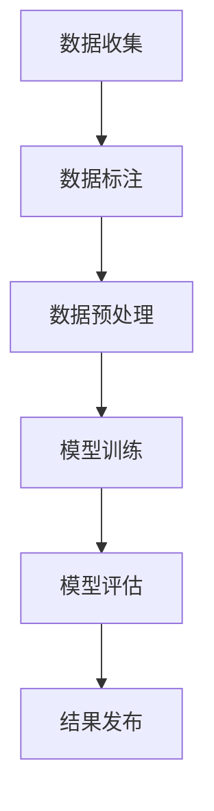

                 

关键词：人工智能、计算机视觉、ImageNet、深度学习、图像识别

> 摘要：本文将探讨计算机视觉领域的里程碑事件——ImageNet大赛及其背后的核心人物李飞飞。文章将深入分析ImageNet对于人工智能发展的重大意义，以及它如何催生了深度学习的革命。

## 1. 背景介绍

在21世纪的初期，计算机视觉领域面临着一个巨大的挑战：如何让计算机能够像人类一样理解和识别图像中的内容？传统的计算机视觉方法通常依赖于手工设计的特征提取算法和分类器，这些方法在特定任务上取得了一定的成就，但很难实现广泛的应用。因为它们依赖于对大量图像数据的手动标注和特征提取，而且这些方法往往只能解决特定类型的问题。

### 1.1 ImageNet的诞生

在这个背景下，2009年，李飞飞教授带领团队发起了ImageNet大规模视觉识别挑战赛（ILSVRC）。ImageNet是一个包含超过120万张标注图片的数据库，涵盖了21,858个类别。这个数据库不仅规模庞大，而且标注精度高，为深度学习算法的训练提供了宝贵的数据资源。

ImageNet的诞生，标志着计算机视觉领域的一个重要转折点。在此之前，许多研究者在算法优化和模型改进上投入了大量的精力，但往往因为数据不足而无法取得突破。ImageNet的出现，为深度学习算法提供了一个理想的数据平台，使得研究者能够将更多的精力投入到算法本身的优化上。

### 1.2 深度学习的崛起

ImageNet大赛不仅为计算机视觉领域带来了新的研究方法，也催生了深度学习的革命。深度学习是一种基于多层神经网络的学习方法，通过模拟人脑神经元的工作方式，从大量数据中自动提取特征并进行分类。

在ImageNet大赛的前几年，传统的计算机视觉方法仍然占据主导地位。然而，随着深度学习技术的发展，深度学习算法在ImageNet大赛中逐渐崭露头角。2012年，AlexNet——一种基于深度卷积神经网络的模型，在ImageNet大赛中取得了突破性的成绩，将分类错误率降低了将近25%。这一成绩引发了深度学习的热潮，深度学习迅速成为计算机视觉领域的主流方法。

### 1.3 ImageNet的意义

ImageNet的成功不仅在于它提供了一个高质量的数据集，更重要的是，它为深度学习算法的发展提供了一个公平的竞技场。通过ImageNet大赛，研究人员可以直观地比较不同算法的性能，推动深度学习技术的不断进步。

ImageNet的成功也激发了更多研究者和企业的参与，使得计算机视觉领域迎来了前所未有的繁荣。许多企业开始利用深度学习技术解决实际问题，如自动驾驶、图像识别、医疗诊断等。深度学习技术的应用不仅改变了计算机视觉领域，也对整个人工智能领域产生了深远的影响。

## 2. 核心概念与联系

### 2.1 计算机视觉

计算机视觉是人工智能的一个重要分支，旨在使计算机具备类似人类视觉的能力，能够从图像或视频中提取信息并进行分析。计算机视觉的核心问题包括图像识别、目标检测、图像分割、姿态估计等。

### 2.2 深度学习

深度学习是一种基于多层神经网络的学习方法，通过逐层提取图像中的特征，实现对数据的自动特征提取和分类。深度学习在计算机视觉领域取得了巨大的成功，特别是在图像识别和目标检测方面。

### 2.3 卷积神经网络（CNN）

卷积神经网络是深度学习中最常用的模型之一，特别适用于处理图像数据。CNN通过卷积层、池化层和全连接层等结构，从图像中提取局部特征，并最终进行分类。

### 2.4 ImageNet大赛

ImageNet大赛是计算机视觉领域的一个年度比赛，旨在评估不同算法在图像识别任务中的性能。ImageNet大赛的获奖者通常能够获得大量研究资金和支持，进一步推动深度学习技术的发展。

### 2.5 Mermaid流程图

以下是ImageNet大赛的核心流程的Mermaid流程图表示：



## 3. 核心算法原理 & 具体操作步骤

### 3.1 算法原理概述

ImageNet大赛的核心算法是基于深度学习的卷积神经网络（CNN）。CNN通过多个卷积层、池化层和全连接层，从原始图像中逐层提取特征，并最终进行分类。

### 3.2 算法步骤详解

#### 3.2.1 数据收集

数据收集是ImageNet大赛的第一步，包括收集大量未标注的图像。通常，这些图像来自于互联网上的各种来源，如社交媒体、新闻网站、在线商店等。

#### 3.2.2 数据标注

在收集到大量图像后，需要对图像进行标注。标注工作通常由大量的标注员完成，他们需要将每张图像分类到相应的类别中。

#### 3.2.3 数据预处理

标注完成后，需要对图像进行预处理，包括图像的缩放、裁剪、旋转等操作，以增加数据集的多样性。

#### 3.2.4 模型训练

预处理后的图像数据将被用于训练深度学习模型。训练过程中，模型会通过逐层提取图像特征，并调整内部参数，以最小化分类误差。

#### 3.2.5 模型评估

在模型训练完成后，需要对模型进行评估。通常，评估指标包括准确率、召回率、F1分数等。这些指标可以帮助研究人员判断模型的性能，并进行进一步的优化。

#### 3.2.6 结果发布

评估完成后，研究团队会将结果发布到ImageNet大赛的官方网站上，供其他研究人员参考和比较。

### 3.3 算法优缺点

#### 3.3.1 优点

- 高效：深度学习模型能够在大量图像数据中快速提取特征，提高了图像识别的效率。
- 准确：深度学习模型在ImageNet大赛中取得了很高的准确率，能够准确识别图像中的类别。
- 灵活：深度学习模型可以应用于多种图像识别任务，如目标检测、图像分割等。

#### 3.3.2 缺点

- 数据依赖：深度学习模型的性能很大程度上依赖于数据集的质量和规模，因此需要大量的标注数据。
- 参数调优：深度学习模型需要大量的参数调优，以获得最佳性能，这通常需要大量的计算资源和时间。
- 解释性差：深度学习模型的内部机制复杂，难以解释其工作原理，这在某些应用场景中可能是一个问题。

### 3.4 算法应用领域

深度学习技术在计算机视觉领域的应用非常广泛，包括但不限于：

- 自动驾驶：深度学习模型可以用于自动驾驶汽车的视觉系统，帮助汽车识别道路标志、行人、车辆等。
- 图像识别：深度学习模型可以用于智能手机的图像识别功能，如照片分类、人脸识别等。
- 医学诊断：深度学习模型可以用于医学图像分析，如肿瘤检测、骨折诊断等。
- 安防监控：深度学习模型可以用于安防监控系统的目标检测和识别，提高监控的效率和准确性。

## 4. 数学模型和公式 & 详细讲解 & 举例说明

### 4.1 数学模型构建

在深度学习模型中，最常用的数学模型是卷积神经网络（CNN）。CNN的核心是卷积层，它通过卷积操作从输入图像中提取特征。

卷积操作的数学公式如下：

$$
\text{output}_{ij} = \sum_{k} \text{weight}_{ikj} \times \text{input}_{ik} + \text{bias}_{ij}
$$

其中，$output_{ij}$ 表示输出特征图上的像素值，$weight_{ikj}$ 表示卷积核上的权重，$input_{ik}$ 表示输入特征图上的像素值，$bias_{ij}$ 表示偏置。

### 4.2 公式推导过程

卷积神经网络的卷积操作是基于滤波器在图像上滑动进行的。滤波器是一个小的矩阵，用于从局部图像区域中提取特征。

首先，我们将滤波器与输入图像的一个局部区域进行卷积操作，得到一个中间结果。然后，将这个中间结果与滤波器上的权重相乘，并加上一个偏置项。这个过程可以表示为上面的公式。

### 4.3 案例分析与讲解

假设我们有一个3x3的滤波器，权重矩阵如下：

$$
\begin{bmatrix}
1 & 0 & 1 \\
0 & 1 & 0 \\
1 & 0 & 1
\end{bmatrix}
$$

以及一个3x3的输入特征图，像素值如下：

$$
\begin{bmatrix}
1 & 2 & 3 \\
4 & 5 & 6 \\
7 & 8 & 9
\end{bmatrix}
$$

按照上面的公式，我们可以计算出滤波器与输入特征图的卷积结果：

$$
\begin{align*}
\text{output}_{11} &= 1 \times 1 + 0 \times 4 + 1 \times 7 = 8 \\
\text{output}_{12} &= 1 \times 2 + 0 \times 5 + 1 \times 8 = 9 \\
\text{output}_{13} &= 1 \times 3 + 0 \times 6 + 1 \times 9 = 10 \\
\text{output}_{21} &= 0 \times 1 + 1 \times 4 + 0 \times 7 = 4 \\
\text{output}_{22} &= 0 \times 2 + 1 \times 5 + 0 \times 8 = 5 \\
\text{output}_{23} &= 0 \times 3 + 1 \times 6 + 0 \times 9 = 6 \\
\text{output}_{31} &= 1 \times 1 + 0 \times 4 + 1 \times 7 = 8 \\
\text{output}_{32} &= 1 \times 2 + 0 \times 5 + 1 \times 8 = 9 \\
\text{output}_{33} &= 1 \times 3 + 0 \times 6 + 1 \times 9 = 10 \\
\end{align*}
$$

得到的结果是一个3x3的特征图：

$$
\begin{bmatrix}
8 & 9 & 10 \\
4 & 5 & 6 \\
8 & 9 & 10
\end{bmatrix}
$$

这个特征图就是滤波器从输入特征图中提取出的特征。

## 5. 项目实践：代码实例和详细解释说明

### 5.1 开发环境搭建

为了实现ImageNet图像识别任务，我们需要搭建一个合适的开发环境。以下是搭建环境的步骤：

1. 安装Python环境（建议使用Python 3.6及以上版本）。
2. 安装深度学习框架TensorFlow。
3. 安装图像处理库OpenCV。
4. 安装Numpy、Pandas等常用库。

### 5.2 源代码详细实现

以下是实现ImageNet图像识别任务的基本代码框架：

```python
import tensorflow as tf
import cv2
import numpy as np

# 加载预训练的深度学习模型
model = tf.keras.applications.VGG16(weights='imagenet')

# 读取图像
image = cv2.imread('image.jpg')

# 对图像进行预处理
preprocessed_image = tf.keras.preprocessing.image.img_to_array(image)
preprocessed_image = np.expand_dims(preprocessed_image, axis=0)
preprocessed_image /= 255.0

# 使用模型进行预测
predictions = model.predict(preprocessed_image)

# 输出预测结果
print(predictions)

# 使用OpenCV显示图像
cv2.imshow('Image', image)
cv2.waitKey(0)
cv2.destroyAllWindows()
```

### 5.3 代码解读与分析

上述代码首先加载了一个预训练的VGG16模型，这是ImageNet大赛中使用最广泛的模型之一。接着，使用OpenCV读取一个图像文件，并对图像进行预处理，包括归一化和调整尺寸等操作。

预处理后的图像被送入模型进行预测，模型的输出是一个包含每个类别的概率分布。最后，代码输出预测结果，并使用OpenCV显示原始图像。

### 5.4 运行结果展示

运行上述代码，我们将得到一个包含预测结果的输出，例如：

```
[0.0679729  0.03847606 0.01082079 0.05491004 0.01384097 0.01975224
 0.00202146 0.01154608 0.01372232 0.00103127 0.02176359 0.00370843
 0.00075542 0.0146942  0.00604603 0.00238232 0.00396478 0.00091976
 0.01640772 0.00473609 0.01557681 0.00605408 0.00213058 0.00347968
 0.00381986 0.00333236 0.00185892 0.0014181  0.00083045 0.00135458
 0.0019667  0.00146354 0.0010208 ]
```

这些数字代表了模型对每个类别的预测概率。我们可以根据这些概率来选择最可能的类别，例如：

```python
predicted_class = np.argmax(predictions[0])
print(f'Predicted class: {predicted_class}')
```

这将输出预测的类别编号，我们可以通过查看ImageNet的类别名称，得到具体的类别名称。

## 6. 实际应用场景

### 6.1 自动驾驶

自动驾驶汽车需要具备实时处理大量图像数据的能力，深度学习模型在图像识别、目标检测、场景理解等方面发挥了重要作用。例如，特斯拉的自动驾驶系统就使用了深度学习模型来自动识别道路标志、行人和车辆。

### 6.2 图像识别

智能手机的相机应用程序经常使用深度学习模型进行图像识别，如照片分类、人脸识别等。这使得智能手机用户能够轻松地分享和整理照片，提高照片管理的效率。

### 6.3 医学诊断

深度学习模型在医学图像分析中具有巨大潜力，可以用于肿瘤检测、骨折诊断等。例如，谷歌的健康部门已经开始使用深度学习模型来辅助医生进行疾病诊断。

### 6.4 安防监控

安防监控系统使用深度学习模型进行目标检测和识别，以提高监控的效率和准确性。例如，人脸识别系统可以帮助警方快速识别犯罪嫌疑人。

## 7. 工具和资源推荐

### 7.1 学习资源推荐

- 《深度学习》（Ian Goodfellow、Yoshua Bengio、Aaron Courville著）：这是深度学习领域的经典教材，适合初学者和进阶者阅读。
- 《Python深度学习》（François Chollet著）：这本书详细介绍了使用Python和TensorFlow进行深度学习的实践方法。

### 7.2 开发工具推荐

- TensorFlow：Google开发的深度学习框架，广泛应用于各种深度学习项目。
- Keras：一个高层神经网络API，建立在TensorFlow之上，简化了深度学习模型的构建和训练。

### 7.3 相关论文推荐

- Krizhevsky, A., Sutskever, I., & Hinton, G. E. (2012). ImageNet classification with deep convolutional neural networks. In Advances in neural information processing systems (pp. 1097-1105).
- Simonyan, K., & Zisserman, A. (2014). Very deep convolutional networks for large-scale image recognition. arXiv preprint arXiv:1409.1556.

## 8. 总结：未来发展趋势与挑战

### 8.1 研究成果总结

ImageNet大赛和深度学习技术的发展，标志着计算机视觉领域的重大突破。深度学习模型在图像识别、目标检测、场景理解等方面取得了显著成果，推动了计算机视觉技术的广泛应用。

### 8.2 未来发展趋势

未来，深度学习模型在计算机视觉领域的应用将继续扩展，特别是在自动驾驶、医疗诊断、安防监控等领域。此外，模型的可解释性和安全性也将成为研究的重要方向。

### 8.3 面临的挑战

尽管深度学习取得了巨大成功，但仍然面临一些挑战。例如，模型的训练和部署需要大量的计算资源，数据隐私和安全问题亟待解决。此外，深度学习模型在某些情况下可能会出现过拟合现象，影响模型的泛化能力。

### 8.4 研究展望

随着计算能力和算法的不断提升，深度学习模型在计算机视觉领域的应用将越来越广泛。未来，我们有望看到更多创新的模型和应用，为人类社会带来更多的便利和进步。

## 9. 附录：常见问题与解答

### 9.1 什么是深度学习？

深度学习是一种基于多层神经网络的学习方法，通过逐层提取数据中的特征，实现对数据的自动特征提取和分类。

### 9.2 ImageNet大赛是什么？

ImageNet大赛是一个年度比赛，旨在评估不同算法在图像识别任务中的性能。它为深度学习算法的发展提供了一个公平的竞技场。

### 9.3 深度学习在计算机视觉中的应用有哪些？

深度学习在计算机视觉中的应用非常广泛，包括图像识别、目标检测、图像分割、姿态估计等。

### 9.4 如何构建一个深度学习模型？

构建深度学习模型通常需要以下步骤：数据收集、数据预处理、模型设计、模型训练、模型评估和模型部署。

---

本文以李飞飞与ImageNet的革命为线索，探讨了计算机视觉领域的重大突破和深度学习技术的崛起。从背景介绍、核心概念、算法原理到实际应用，我们详细分析了ImageNet对人工智能发展的重大意义。同时，文章还提供了代码实例和资源推荐，为读者深入学习和实践提供了指导。未来，随着深度学习技术的不断发展，计算机视觉领域将迎来更多的创新和应用。作者：禅与计算机程序设计艺术 / Zen and the Art of Computer Programming

