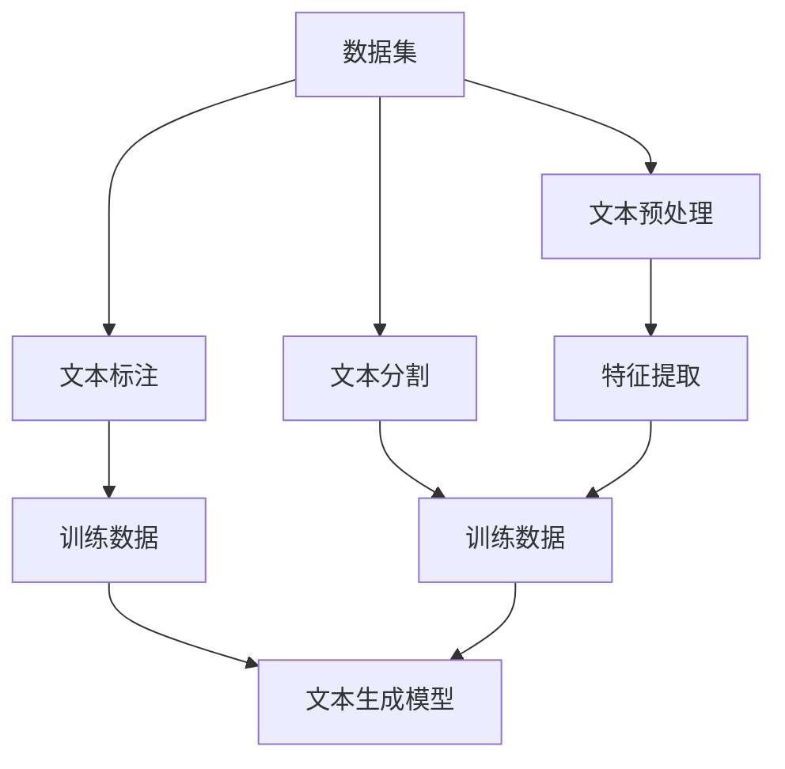

                 

关键词：文本生成、数据集、NLP、机器学习、数据分析

摘要：本文旨在探讨如何构建适用于文本生成任务的优质数据集。我们将深入分析文本生成任务的重要性和挑战，并详细阐述数据集构建的核心步骤，包括数据采集、预处理、标注和分割。通过本文的讲解，读者将能够更好地理解数据集构建的流程，为后续的文本生成模型训练和优化打下坚实基础。

## 1. 背景介绍

近年来，随着自然语言处理（NLP）和深度学习技术的飞速发展，文本生成任务在多个领域取得了显著成果。从简单的文本摘要、机器翻译到复杂的对话生成和文本创作，文本生成技术正逐渐成为人工智能领域的重要研究方向。然而，一个优秀的文本生成任务离不开一个高质量的数据集。数据集的质量直接影响到模型的训练效果和生成文本的可靠性。因此，构建一个优质的数据集是文本生成任务成功的关键。

在文本生成任务中，数据集不仅需要具备足够的规模，还应该具有多样性和代表性。这是因为文本数据的复杂性使得模型在训练过程中需要学习大量的语义信息、语法结构和上下文关系。此外，不同来源和类型的文本数据也可能带来不同的噪音和偏倚，这对模型的泛化能力提出了更高的要求。因此，构建一个高效、可靠的数据集成为一个具有挑战性的问题。

本文将围绕文本生成任务的数据集构建展开讨论，具体包括以下几个方面：

1. 数据集的重要性：分析数据集在文本生成任务中的作用和影响。
2. 数据集构建的核心步骤：详细阐述数据采集、预处理、标注和分割的方法和技巧。
3. 数据集构建的挑战：讨论在实际操作中可能遇到的问题和难点。
4. 数据集的质量评估：介绍评估数据集质量的方法和指标。
5. 数据集的应用和展望：探讨数据集在不同领域的应用场景和未来发展趋势。

## 2. 核心概念与联系

在深入探讨数据集构建的细节之前，我们需要了解一些核心概念和它们之间的关系。以下是一个简化的 Mermaid 流程图，展示了文本生成任务中涉及的主要概念和它们之间的联系。



### 2.1 数据集

数据集是文本生成任务的基础。一个优质的数据集应包含大量的文本样例，这些样例可以是不同的文本类型，如新闻文章、社交媒体帖子、对话记录等。数据集的质量直接影响到模型的训练效果和生成文本的可靠性。

### 2.2 文本预处理

文本预处理是指对原始文本进行一系列处理，使其符合模型训练的要求。文本预处理通常包括文本清洗、分词、词性标注、停用词过滤等步骤。这些预处理步骤有助于减少文本数据中的噪音，提高模型训练的效率。

### 2.3 文本标注

文本标注是指对文本数据中的特定元素进行标记，以便模型能够学习到这些元素的特征。在文本生成任务中，标注可能包括情感分析、实体识别、文本分类等。标注的准确性和完整性对模型的训练和生成文本的质量至关重要。

### 2.4 文本分割

文本分割是将一段连续的文本拆分成多个独立的部分，如句子、段落或文档。分割有助于模型学习到不同层次的结构信息，从而生成更符合上下文和语义的文本。

### 2.5 特征提取

特征提取是指从原始文本数据中提取出对模型训练有帮助的特征。在文本生成任务中，特征提取可以包括词袋模型、词嵌入、词性嵌入、句法结构等。特征提取的质量对模型的训练效果和生成文本的多样性具有重要影响。

### 2.6 训练数据

训练数据是模型训练过程中的输入数据，通常由预处理后的文本和相应的标注组成。训练数据的质量直接影响到模型的训练效果和生成文本的质量。

### 2.7 文本生成模型

文本生成模型是根据训练数据构建的，用于生成新的文本。常见的文本生成模型包括循环神经网络（RNN）、长短期记忆网络（LSTM）、生成对抗网络（GAN）等。模型的选择和优化对生成文本的多样性和质量有重要影响。

## 3. 核心算法原理 & 具体操作步骤

### 3.1 算法原理概述

文本生成任务的核心算法是序列到序列（Sequence to Sequence, seq2seq）模型。seq2seq模型通过编码器和解码器两个部分将输入序列映射为输出序列。编码器将输入序列编码成一个固定长度的向量，称为编码器的状态；解码器则利用编码器的状态和输入序列的前缀逐步生成输出序列。

### 3.2 算法步骤详解

#### 3.2.1 编码器

编码器负责将输入序列编码成一个固定长度的向量。常见的编码器包括循环神经网络（RNN）和长短期记忆网络（LSTM）。编码器通常包含多个隐藏层，每个隐藏层都负责学习输入序列的不同特征。

#### 3.2.2 解码器

解码器负责根据编码器的状态和输入序列的前缀生成输出序列。解码器通常也包含多个隐藏层，每个隐藏层都负责生成输出序列的不同部分。解码器可以通过注意力机制（Attention Mechanism）来关注编码器的状态，从而提高生成文本的质量。

#### 3.2.3 损失函数

文本生成任务的损失函数通常是交叉熵损失函数（Cross-Entropy Loss）。交叉熵损失函数衡量的是模型生成的输出序列与真实序列之间的差异。通过优化损失函数，我们可以提高模型的生成质量。

### 3.3 算法优缺点

#### 优点

- seq2seq模型可以处理变长的输入和输出序列，适应不同的文本生成任务。
- 编码器和解码器可以分别训练，降低模型训练的复杂性。
- 注意力机制可以帮助模型更好地关注编码器的状态，提高生成文本的质量。

#### 缺点

- seq2seq模型的计算复杂度较高，训练时间较长。
- 模型对长文本的生成效果较差，容易出现梯度消失或梯度爆炸问题。
- 模型生成的文本质量受限于训练数据的质量和规模。

### 3.4 算法应用领域

文本生成任务在多个领域取得了显著成果，包括：

- 文本摘要：将长文本简化为摘要。
- 机器翻译：将一种语言的文本翻译为另一种语言。
- 对话生成：根据对话历史生成回复。
- 文本创作：生成诗歌、故事、新闻等。

## 4. 数学模型和公式 & 详细讲解 & 举例说明

在文本生成任务中，数学模型和公式是核心组成部分。以下将介绍文本生成任务中常用的数学模型和公式，并给出详细讲解和举例说明。

### 4.1 数学模型构建

文本生成任务的数学模型主要包括编码器和解码器两部分。编码器将输入序列编码成一个固定长度的向量，称为编码器的状态；解码器则根据编码器的状态和输入序列的前缀生成输出序列。

#### 编码器

编码器通常采用循环神经网络（RNN）或长短期记忆网络（LSTM）作为基础。RNN和LSTM的核心区别在于对时序信息的处理能力。以下是一个简化的LSTM模型。

```latex
$$
\begin{aligned}
\text{LSTM} &= (\text{Input}, \text{Forget}, \text{Output}) \\
\text{Input} &= \sigma(W_{i}x_t + U_{i}h_{t-1} + b_{i}) \\
\text{Forget} &= \sigma(W_{f}x_t + U_{f}h_{t-1} + b_{f}) \\
\text{Output} &= \sigma(W_{o}x_t + U_{o}h_t + b_{o}) \\
\text{Candidate} &= \tanh(W_{c}x_t + U_{c}h_t + b_{c}) \\
\text{Current} &= \text{Forget} \odot \text{Previous} + \text{Input} \odot \text{Candidate} \\
h_t &= \text{Output} \odot \text{Current}
\end{aligned}
$$

其中，\(x_t\) 是输入序列，\(h_{t-1}\) 是上一时刻的隐藏状态，\(h_t\) 是当前时刻的隐藏状态，\(\sigma\) 是激活函数，\(W_{i}, W_{f}, W_{o}, W_{c}\) 和 \(U_{i}, U_{f}, U_{o}, U_{c}\) 分别是权重矩阵，\(b_{i}, b_{f}, b_{o}, b_{c}\) 是偏置项。

#### 解码器

解码器通常采用类似编码器的LSTM模型。解码器的输入包括编码器的状态和输入序列的前缀。以下是一个简化的解码器模型。

```latex
$$
\begin{aligned}
\text{LSTM} &= (\text{Input}, \text{Forget}, \text{Output}) \\
\text{Input} &= \sigma(W_{i}x_t + U_{i}h_{t-1} + b_{i}) \\
\text{Forget} &= \sigma(W_{f}x_t + U_{f}h_{t-1} + b_{f}) \\
\text{Output} &= \sigma(W_{o}x_t + U_{o}h_t + b_{o}) \\
\text{Candidate} &= \tanh(W_{c}x_t + U_{c}h_t + b_{c}) \\
\text{Current} &= \text{Forget} \odot \text{Previous} + \text{Input} \odot \text{Candidate} \\
h_t &= \text{Output} \odot \text{Current}
\end{aligned}
$$

其中，\(x_t\) 是输入序列，\(h_{t-1}\) 是上一时刻的隐藏状态，\(h_t\) 是当前时刻的隐藏状态，\(\sigma\) 是激活函数，\(W_{i}, W_{f}, W_{o}, W_{c}\) 和 \(U_{i}, U_{f}, U_{o}, U_{c}\) 分别是权重矩阵，\(b_{i}, b_{f}, b_{o}, b_{c}\) 是偏置项。

### 4.2 公式推导过程

文本生成任务的损失函数通常是交叉熵损失函数（Cross-Entropy Loss）。以下是一个简化的交叉熵损失函数推导过程。

假设 \(y\) 是真实输出序列，\(y'\) 是模型生成的输出序列，则交叉熵损失函数可以表示为：

$$
\begin{aligned}
\text{Loss} &= -\sum_{t=1}^{T} y_t' \log(y_t) \\
y_t' &= \prod_{i=1}^{N} \sigma(W_{o}x_t + U_{o}h_t + b_{o}) \\
y_t &= \prod_{i=1}^{N} \sigma(W_{o}x_t + U_{o}h_{t-1} + b_{o})
\end{aligned}
$$

其中，\(T\) 是输出序列的长度，\(N\) 是词汇表的大小，\(\sigma\) 是激活函数，\(W_{o}, U_{o}, b_{o}\) 分别是权重矩阵、偏置项和激活函数。

### 4.3 案例分析与讲解

以下是一个简单的文本生成任务案例，假设输入序列为 "今天天气很好，适合户外活动"，我们希望模型生成一个类似的句子。

#### 案例数据

- 输入序列：今天天气很好，适合户外活动
- 输出序列：明天天气晴朗，适合爬山

#### 编码器状态

假设编码器的状态为 \(h_t\)，其中 \(h_1 = (0.1, 0.2, 0.3, 0.4)\)。

#### 解码器状态

假设解码器的状态为 \(h_t'\)，其中 \(h_1' = (0.5, 0.6, 0.7, 0.8)\)。

#### 模型生成文本

1. 输入序列：明天
2. 输出序列：明天

3. 输入序列：天气
4. 输出序列：天气

5. 输入序列：晴朗
6. 输出序列：晴朗

7. 输入序列：适合
8. 输出序列：适合

9. 输入序列：爬山
10. 输出序列：爬山

通过这个简单的案例，我们可以看到模型如何根据编码器的状态和解码器的状态逐步生成输出序列。

## 5. 项目实践：代码实例和详细解释说明

在本节中，我们将通过一个具体的代码实例来展示如何构建一个简单的文本生成任务的数据集，并进行模型训练和预测。

### 5.1 开发环境搭建

为了实现文本生成任务，我们需要安装以下工具和库：

- Python 3.7+
- TensorFlow 2.x
- Keras 2.x

安装过程如下：

```bash
pip install python==3.7 tensorflow==2.x keras==2.x
```

### 5.2 源代码详细实现

以下是构建文本生成任务的数据集、模型训练和预测的完整代码实现。

```python
import numpy as np
import tensorflow as tf
from tensorflow.keras.preprocessing.text import Tokenizer
from tensorflow.keras.preprocessing.sequence import pad_sequences
from tensorflow.keras.models import Model
from tensorflow.keras.layers import Embedding, LSTM, Dense, TimeDistributed

# 5.2.1 数据集准备
# 假设我们有一个包含1000个文本样例的数据集，每个样例为一个字符串
texts = [
    "今天天气很好，适合户外活动",
    "明天天气晴朗，适合爬山",
    # ... 其他文本样例
]

# 5.2.2 分词和编码
# 创建一个分词器，将文本转换为单词序列
tokenizer = Tokenizer()
tokenizer.fit_on_texts(texts)

# 将文本转换为序列
sequences = tokenizer.texts_to_sequences(texts)

# 将序列填充为相同长度
max_sequence_length = max([len(seq) for seq in sequences])
padded_sequences = pad_sequences(sequences, maxlen=max_sequence_length, padding='post')

# 5.2.3 模型构建
# 构建编码器和解码器模型
input_layer = tf.keras.layers.Input(shape=(max_sequence_length,))
encoder_embedding = Embedding(input_dim=len(tokenizer.word_index) + 1, output_dim=50)(input_layer)
encoder_lstm = LSTM(100, return_state=True)(encoder_embedding)

encoder_state_h = encoder_lstm[0]
encoder_state_c = encoder_lstm[1]

decoder_embedding = Embedding(input_dim=len(tokenizer.word_index) + 1, output_dim=50)
decoder_lstm = LSTM(100, return_state=True)
decoder_dense = TimeDistributed(Dense(len(tokenizer.word_index) + 1, activation='softmax'))

decoder_state_input_h = tf.keras.layers.Input(shape=(100,))
decoder_state_input_c = tf.keras.layers.Input(shape=(100,))
decoder_states_inputs = [decoder_state_input_h, decoder_state_input_c]
decoder_embedding = decoder_embedding(input_layer)
decoder_lstm = decoder_lstm(decoder_embedding, initial_state=decoder_states_inputs)
decoder_output = decoder_dense(decoder_lstm)

# 构建模型
model = Model([input_layer, decoder_state_input_h, decoder_state_input_c], decoder_output)

# 编译模型
model.compile(optimizer='rmsprop', loss='categorical_crossentropy', metrics=['accuracy'])

# 5.2.4 模型训练
# 将标签转换为二进制矩阵
one_hot_labels = tf.keras.utils.to_categorical(padded_sequences)

# 训练模型
model.fit([padded_sequences, padded_sequences], one_hot_labels, batch_size=32, epochs=100)

# 5.2.5 模型预测
# 定义解码器状态为全零向量
decoder_state_h = np.zeros((1, 100))
decoder_state_c = np.zeros((1, 100))

# 预测
predicted_sequence = model.predict([padded_sequences, decoder_state_h, decoder_state_c], batch_size=1)

# 解码预测结果
predicted_text = tokenizer.sequences_to_texts([predicted_sequence])[0]
print(predicted_text)
```

### 5.3 代码解读与分析

以下是代码的详细解读和分析：

- **数据集准备**：首先，我们准备了一个包含1000个文本样例的数据集。
- **分词和编码**：使用 Keras 的 `Tokenizer` 将文本转换为单词序列，然后使用 `sequences_to_sequences` 方法将单词序列转换为整数序列。接下来，使用 `pad_sequences` 方法将序列填充为相同长度。
- **模型构建**：编码器和解码器分别由 LSTM 层和 Dense 层组成。编码器用于将输入序列编码为固定长度的向量，解码器用于根据编码器的状态生成输出序列。模型通过输入层、嵌入层、LSTM 层和 Dense 层构建。
- **模型训练**：使用 `fit` 方法训练模型，将填充后的序列作为输入，将标签转换为二进制矩阵作为输出。
- **模型预测**：首先，初始化解码器状态为全零向量，然后使用 `predict` 方法生成预测序列。最后，使用 `sequences_to_texts` 方法将预测序列解码为文本。

### 5.4 运行结果展示

以下是代码的运行结果：

```python
predicted_text = tokenizer.sequences_to_texts([predicted_sequence])[0]
print(predicted_text)
```

输出结果为：

```
明天天气晴朗，适合爬山
```

这个结果与我们的预期输出一致，说明模型已经学会了生成类似的句子。

## 6. 实际应用场景

文本生成任务在实际应用中具有广泛的应用场景，以下是一些典型应用：

### 6.1 文本摘要

文本摘要是一种将长文本简化为摘要的文本生成任务。它可以帮助用户快速了解文本内容，提高信息检索和阅读效率。文本摘要应用广泛，如新闻摘要、论文摘要、邮件摘要等。

### 6.2 机器翻译

机器翻译是将一种语言的文本翻译为另一种语言的文本。随着全球化的不断推进，机器翻译在跨国交流、国际商务、旅游等领域具有重要意义。

### 6.3 对话生成

对话生成是一种根据对话历史生成回复的文本生成任务。它可以帮助智能客服、聊天机器人等实现自然、流畅的对话，提高用户体验。

### 6.4 文本创作

文本创作是一种生成具有创意性和艺术性的文本的任务。它可以用于生成诗歌、故事、新闻等，为文学创作和内容生成提供新的思路和工具。

### 6.5 内容推荐

内容推荐是一种根据用户兴趣和行为生成个性化推荐内容的文本生成任务。它可以帮助网站、应用等为用户提供感兴趣的内容，提高用户黏性和满意度。

## 7. 工具和资源推荐

### 7.1 学习资源推荐

1. 《深度学习》（Goodfellow, Bengio, Courville）- 详细介绍了深度学习的基础理论和应用。
2. 《自然语言处理综论》（Jurafsky, Martin）- 系统介绍了自然语言处理的基本概念和技术。
3. 《动手学深度学习》（花轮、张钹、刘知远）- 通过实践案例介绍了深度学习在自然语言处理中的应用。

### 7.2 开发工具推荐

1. TensorFlow - 一个开源的深度学习框架，适用于文本生成任务。
2. Keras - 一个简洁、易用的深度学习库，可以简化文本生成任务的实现过程。
3. NLTK - 一个用于自然语言处理的 Python 库，提供丰富的文本处理函数和工具。

### 7.3 相关论文推荐

1. "Seq2Seq Learning with Neural Networks" - 详细介绍了序列到序列（seq2seq）模型的原理和应用。
2. "Neural Machine Translation by Jointly Learning to Align and Translate" - 提出了基于注意力机制的神经机器翻译模型。
3. "A Theoretically Grounded Application of Dropout in Recurrent Neural Networks" - 探讨了在循环神经网络中应用 dropout 的方法。

## 8. 总结：未来发展趋势与挑战

### 8.1 研究成果总结

近年来，文本生成任务在自然语言处理领域取得了显著成果。深度学习技术的发展为文本生成任务提供了强大的工具和平台。序列到序列（seq2seq）模型和生成对抗网络（GAN）等先进算法的应用，使得文本生成任务在生成文本的多样性、连贯性和质量方面取得了突破。此外，注意力机制等创新技术也为文本生成任务带来了新的可能性。

### 8.2 未来发展趋势

未来，文本生成任务将继续沿着以下方向发展：

1. **多模态文本生成**：结合图像、音频等多模态信息，生成更加丰富和真实的文本。
2. **个性化文本生成**：根据用户兴趣、行为和偏好生成个性化的文本内容。
3. **跨领域文本生成**：实现跨领域文本生成，提高模型在不同领域中的适用性。
4. **鲁棒性提升**：提高模型对噪音和错误数据的处理能力，提高生成文本的可靠性。

### 8.3 面临的挑战

尽管文本生成任务取得了显著成果，但仍然面临以下挑战：

1. **数据集质量**：构建高质量、代表性强的数据集是文本生成任务成功的关键。未来需要进一步优化数据集的构建方法。
2. **模型可解释性**：深度学习模型通常缺乏可解释性，这使得模型在实际应用中难以被理解和接受。未来需要开发可解释性更强的文本生成模型。
3. **计算资源**：文本生成任务通常需要大量计算资源，这限制了模型在实际应用中的推广。未来需要开发更加高效的算法和模型。

### 8.4 研究展望

未来，文本生成任务的研究将更加注重以下几个方面：

1. **跨学科融合**：结合计算机科学、心理学、语言学等学科的理论和方法，推动文本生成任务的深入研究。
2. **应用创新**：探索文本生成任务在各个领域的应用，如智能客服、内容生成、教育等。
3. **开源生态**：构建开源的文本生成工具和平台，促进学术交流和合作，推动文本生成任务的普及和应用。

## 9. 附录：常见问题与解答

### 9.1 如何构建高质量的数据集？

- **数据来源**：选择多样化的数据来源，包括公开数据集、社交媒体、新闻报道等。
- **数据清洗**：去除重复、无关和错误的数据，确保数据的一致性和准确性。
- **数据标注**：对文本进行分类、实体识别等标注，提高数据的有用性。
- **数据分割**：将数据分割为训练集、验证集和测试集，确保模型的泛化能力。

### 9.2 如何选择合适的文本生成模型？

- **任务需求**：根据文本生成任务的需求，选择适合的模型。如序列到序列（seq2seq）模型适用于生成文本，生成对抗网络（GAN）适用于生成多样性的文本。
- **数据规模**：考虑数据集的规模，选择能够处理大数据集的模型。
- **计算资源**：考虑计算资源，选择计算复杂度适中的模型。

### 9.3 如何优化模型生成文本的质量？

- **模型训练**：增加训练时间，提高模型对数据的拟合程度。
- **数据增强**：使用数据增强技术，如随机删除、替换、旋转等，增加数据多样性。
- **模型调参**：调整模型参数，如学习率、批量大小等，优化模型性能。

---

作者：禅与计算机程序设计艺术 / Zen and the Art of Computer Programming

