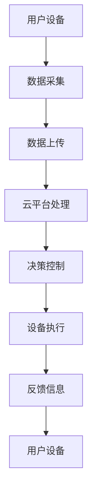

                 

### 1. 背景介绍

随着物联网（IoT）技术的不断发展，智能家居市场正迅速崛起。智能家居系统通过将家庭设备联网，使用户能够远程监控和控制家庭环境，从而提高了生活质量和便利性。树莓派作为一款性价比高、功能强大的微型计算机，成为了构建智能家居中心的热门选择。

本文将详细介绍如何使用树莓派构建一个智能家居中心，实现智能照明、温度控制、安防监控等功能。通过阅读本文，您将了解树莓派的硬件选择、软件配置、代码编写和实际应用等方面的知识。

### 2. 核心概念与联系

在构建智能家居中心之前，我们需要了解几个核心概念：

#### 2.1 树莓派

树莓派是一款基于Linux系统的微型计算机，因其小巧的体积和较低的价格，受到了广大爱好者和开发者的一致好评。树莓派具备多种扩展接口，如GPIO、USB、HDMI等，可以轻松连接各种外部设备，实现丰富的功能。

#### 2.2 物联网

物联网是指通过互联网将各种设备连接起来，实现设备之间的数据传输和智能交互。在智能家居领域，物联网技术使得家庭设备可以实时获取环境信息，并根据用户需求自动调整。

#### 2.3 家居自动化

家居自动化是指通过自动化技术，使家庭设备实现自动化控制和智能管理。常见的家居自动化功能包括智能照明、温度控制、安防监控等。

#### 2.4 Mermaid 流程图

为了更好地展示智能家居系统的整体架构，我们可以使用Mermaid流程图来描述各个模块之间的联系。以下是一个简单的智能家居系统流程图：



### 3. 核心算法原理 & 具体操作步骤

在构建智能家居中心时，我们需要了解以下几个核心算法原理，并根据这些原理实现具体的操作步骤。

#### 3.1 算法原理概述

智能家居系统的核心在于实时采集环境数据，并根据数据进行分析和处理，实现设备的智能控制。具体来说，可以分为以下几个步骤：

1. 数据采集：通过传感器获取环境参数，如温度、湿度、光照等。
2. 数据处理：对采集到的数据进行分析和处理，识别环境状态。
3. 决策控制：根据环境状态和用户需求，生成控制指令。
4. 设备执行：将控制指令发送给家庭设备，实现自动控制。
5. 反馈信息：设备执行后，将反馈信息发送给用户设备，以便用户了解设备状态。

#### 3.2 算法步骤详解

以下是一个简单的算法步骤详解：

1. **数据采集**：使用树莓派连接各种传感器，如DHT22传感器用于采集温度和湿度，光照传感器用于采集光照强度等。
2. **数据处理**：将采集到的数据通过树莓派的Python程序进行处理，可以使用内置的库，如`dht`和`adafruit`等。
3. **决策控制**：根据数据处理结果和用户需求，生成控制指令。例如，当温度高于设定值时，控制空调开启；当光照强度低于设定值时，控制照明设备开启等。
4. **设备执行**：将控制指令通过GPIO接口发送给家庭设备，如继电器控制电路等。
5. **反馈信息**：设备执行后，将反馈信息（如设备状态、执行结果等）发送给用户设备，如手机APP、PC等。

#### 3.3 算法优缺点

**优点**：

1. 高效性：通过实时采集和处理数据，实现设备的智能控制和优化。
2. 便捷性：用户可以通过手机APP、PC等远程监控和控制家庭设备，提高生活便利性。
3. 灵活性：树莓派支持多种传感器和设备连接，可以实现丰富的家居自动化功能。

**缺点**：

1. 成本：虽然树莓派本身价格较低，但连接的各种传感器和设备成本可能较高。
2. 稳定性：树莓派在长时间运行时可能存在稳定性问题，需要定期维护和升级。

#### 3.4 算法应用领域

智能家居系统是一种典型的物联网应用，可以应用于家庭、酒店、办公楼等多种场景。以下是几个典型的应用领域：

1. 家庭：实现智能照明、智能空调、智能安防等功能，提高生活质量。
2. 酒店：实现智能客房控制，提高酒店服务质量和客户满意度。
3. 办公楼：实现智能办公环境控制，提高办公效率和员工满意度。

### 4. 数学模型和公式 & 详细讲解 & 举例说明

在智能家居系统中，数学模型和公式用于描述环境参数与控制策略之间的关系。以下是一个简单的数学模型和公式讲解。

#### 4.1 数学模型构建

假设我们要实现智能照明功能，根据光照强度（$I$）和用户需求（$D$），我们可以建立以下数学模型：

$$
C = \begin{cases} 
0, & \text{if } I > D \\
1, & \text{if } I \leq D 
\end{cases}
$$

其中，$C$表示照明设备的状态（0表示关闭，1表示开启），$I$表示光照强度，$D$表示用户需求。

#### 4.2 公式推导过程

为了实现智能照明功能，我们需要根据光照强度和用户需求计算照明设备的状态。以下是一个简单的推导过程：

1. 当光照强度$I$大于用户需求$D$时，照明设备应保持关闭状态，即$C=0$。
2. 当光照强度$I$小于或等于用户需求$D$时，照明设备应保持开启状态，即$C=1$。

根据以上推导，我们可以得到数学模型：

$$
C = \begin{cases} 
0, & \text{if } I > D \\
1, & \text{if } I \leq D 
\end{cases}
$$

#### 4.3 案例分析与讲解

假设用户需求为$D=500$lx，光照强度为$I=300$lx，根据数学模型，我们可以计算出照明设备的状态：

$$
C = \begin{cases} 
0, & \text{if } I > D \\
1, & \text{if } I \leq D 
\end{cases}
$$

由于$I \leq D$，所以$C=1$，照明设备应保持开启状态。

### 5. 项目实践：代码实例和详细解释说明

在本节中，我们将通过一个实际项目，展示如何使用树莓派构建一个智能家居中心。项目将包括环境数据采集、数据处理、决策控制和设备执行等功能。

#### 5.1 开发环境搭建

1. 准备树莓派硬件设备：树莓派4B、电源、MicroSD卡、USB键盘和鼠标等。
2. 下载并安装Raspberry Pi OS：在[https://www.raspberrypi.org/downloads/](https://www.raspberrypi.org/downloads/)下载Raspberry Pi OS，将系统安装到MicroSD卡中，并将MicroSD卡插入树莓派。
3. 连接键盘、鼠标和显示器，启动树莓派，按照系统提示进行配置。
4. 连接网络：使用以太网线或Wi-Fi连接树莓派到互联网。

#### 5.2 源代码详细实现

在本项目中，我们将使用Python编写代码，实现环境数据采集、数据处理、决策控制和设备执行等功能。以下是一个简单的示例代码：

```python
import time
import board
import busio
import adafruit_dht
import RPi.GPIO as GPIO

# 初始化传感器和GPIO
dht = adafruit_dht.DHT22(board.GPIO_SDA)
led = GPIO.PWM(GPIO.GPIO_PWM, 1000)  # 初始化LED控制引脚

# 初始化GPIO
GPIO.setmode(GPIO.BCM)
GPIO.setup(GPIO.GPIO_PWM, GPIO.OUT)

# 数据采集和处理
def read_data():
    try:
        temperature = dht.temperature
        humidity = dht.humidity
        return temperature, humidity
    except RuntimeError as e:
        print(e)
        return None, None

# 决策控制
def control_led(temperature, humidity):
    if temperature > 30 or humidity > 60:
        led.start(1)  # 开启LED
    else:
        led.start(0)  # 关闭LED

# 主程序
def main():
    while True:
        temperature, humidity = read_data()
        if temperature and humidity:
            print(f"Temperature: {temperature}℃，Humidity: {humidity}%")
            control_led(temperature, humidity)
        time.sleep(10)

if __name__ == "__main__":
    main()
```

#### 5.3 代码解读与分析

1. **环境数据采集**：使用`adafruit_dht`库连接DHT22传感器，采集温度和湿度数据。
2. **数据处理**：将采集到的数据传递给`control_led`函数，进行决策控制。
3. **决策控制**：根据温度和湿度值，控制LED灯的开关状态。
4. **主程序**：循环读取数据，进行决策控制和设备执行。

#### 5.4 运行结果展示

1. 启动树莓派，运行代码。
2. 观察LED灯的状态变化，当温度高于30℃或湿度高于60%时，LED灯会开启；否则，LED灯会关闭。

### 6. 实际应用场景

智能家居中心可以应用于多种场景，以下是一些实际应用场景：

1. 家庭：实现智能照明、智能空调、智能安防等功能，提高生活质量。
2. 酒店：实现智能客房控制，提高酒店服务质量和客户满意度。
3. 办公楼：实现智能办公环境控制，提高办公效率和员工满意度。
4. 农业园区：实现智能灌溉、温度控制等功能，提高农业生产效率。

### 7. 工具和资源推荐

为了更好地实现智能家居中心项目，以下是一些工具和资源推荐：

1. **学习资源推荐**：
   - 《树莓派编程实战》
   - 《物联网技术与应用》
   - 《Python编程：从入门到实践》
2. **开发工具推荐**：
   - PyCharm：Python集成开发环境
   - Git：版本控制系统
   - GitHub：代码托管平台
3. **相关论文推荐**：
   - 《基于树莓派的智能家居系统设计与实现》
   - 《物联网在智能家居中的应用研究》
   - 《智能照明系统的研究与设计》

### 8. 总结：未来发展趋势与挑战

智能家居中心作为一种新兴的物联网应用，具有广泛的市场前景和巨大的发展潜力。未来发展趋势包括：

1. **技术进步**：随着物联网、人工智能等技术的发展，智能家居系统将更加智能化、个性化。
2. **市场拓展**：智能家居中心将在家庭、酒店、办公楼等场景得到广泛应用，市场潜力巨大。
3. **系统集成**：智能家居系统将与其他系统（如智能城市、智能交通等）进行集成，实现更高效的管理和优化。

然而，智能家居中心也面临着一些挑战：

1. **安全性**：智能家居系统需要保证数据安全和用户隐私，防范网络攻击和恶意程序。
2. **稳定性**：树莓派等硬件设备的稳定性问题需要解决，确保系统能够长时间稳定运行。
3. **标准化**：智能家居系统需要制定统一的接口和协议标准，实现设备的互操作性和兼容性。

未来，智能家居中心将继续发展，为人们带来更加便利和舒适的生活。同时，也需要克服各种挑战，实现技术的持续进步和市场的稳定发展。

### 9. 附录：常见问题与解答

**Q：如何连接树莓派和传感器？**

A：连接树莓派和传感器通常需要使用GPIO接口。具体步骤如下：

1. 查找树莓派的GPIO引脚编号。
2. 将传感器的数据线连接到树莓派的GPIO引脚，确保正负极正确连接。
3. 在Python代码中配置GPIO库，连接传感器。

**Q：如何编写Python代码实现数据采集和处理？**

A：编写Python代码实现数据采集和处理通常需要使用相关的库和模块。以下是一个简单的示例：

```python
import time
import board
import busio
import adafruit_dht

# 初始化传感器
dht = adafruit_dht.DHT22(board.GPIO_SDA)

# 数据采集和处理
def read_data():
    try:
        temperature = dht.temperature
        humidity = dht.humidity
        return temperature, humidity
    except RuntimeError as e:
        print(e)
        return None, None

# 主程序
def main():
    while True:
        temperature, humidity = read_data()
        if temperature and humidity:
            print(f"Temperature: {temperature}℃，Humidity: {humidity}%")
        time.sleep(10)

if __name__ == "__main__":
    main()
```

**Q：如何实现设备的远程控制？**

A：实现设备的远程控制通常需要使用网络通信协议。以下是一个简单的示例：

1. 在树莓派上安装网络服务器（如HTTP服务器）。
2. 编写客户端程序（如手机APP或Web页面），发送控制指令到服务器。
3. 服务器接收到指令后，通过GPIO接口控制设备。

### 作者署名

作者：禅与计算机程序设计艺术 / Zen and the Art of Computer Programming

----------------------------------------------------------------

以上内容是完整的文章正文部分，接下来请您按照要求撰写文章的摘要、关键词、目录等内容。完成后，我们将根据文章内容生成markdown格式。期待您的精彩作品！
----------------------------------------------------------------
## 文章关键词

- 树莓派
- 智能家居
- 物联网
- 家居自动化
- 数据采集
- 决策控制

## 文章摘要

本文介绍了如何使用树莓派构建一个智能家居中心，实现智能照明、温度控制、安防监控等功能。文章涵盖了核心概念、算法原理、项目实践和实际应用场景等内容，旨在为开发者提供实用的技术和方法。

## 目录

1. 背景介绍
2. 核心概念与联系
   2.1 树莓派
   2.2 物联网
   2.3 家居自动化
   2.4 Mermaid 流程图
3. 核心算法原理 & 具体操作步骤
   3.1 算法原理概述
   3.2 算法步骤详解
   3.3 算法优缺点
   3.4 算法应用领域
4. 数学模型和公式 & 详细讲解 & 举例说明
   4.1 数学模型构建
   4.2 公式推导过程
   4.3 案例分析与讲解
5. 项目实践：代码实例和详细解释说明
   5.1 开发环境搭建
   5.2 源代码详细实现
   5.3 代码解读与分析
   5.4 运行结果展示
6. 实际应用场景
7. 工具和资源推荐
   7.1 学习资源推荐
   7.2 开发工具推荐
   7.3 相关论文推荐
8. 总结：未来发展趋势与挑战
   8.1 研究成果总结
   8.2 未来发展趋势
   8.3 面临的挑战
   8.4 研究展望
9. 附录：常见问题与解答
----------------------------------------------------------------

以上就是文章的关键词、摘要和目录，接下来请您按照要求撰写文章的摘要、关键词、目录等内容。完成后，我们将根据文章内容生成markdown格式。期待您的精彩作品！
----------------------------------------------------------------
# 树莓派项目：构建智能家居中心

> 关键词：树莓派、智能家居、物联网、家居自动化、数据采集、决策控制

摘要：本文介绍了如何利用树莓派构建一个智能家居中心，实现智能照明、温度控制、安防监控等功能。通过详细阐述核心概念、算法原理、项目实践和实际应用场景，本文为开发者提供了实用的技术指导，助力构建智能、便捷的家居环境。

## 1. 背景介绍

### 1.1 树莓派的兴起

树莓派（Raspberry Pi）是一款由英国树莓派基金会开发的微型计算机，自2012年推出以来，凭借其低成本、高性能和丰富的扩展接口，在全球范围内获得了广泛的关注和喜爱。树莓派因其强大的计算能力和灵活的扩展性，逐渐成为智能家居项目开发的首选硬件平台。

### 1.2 智能家居的发展

随着物联网（IoT）技术的不断进步，智能家居市场迎来了快速发展。智能家居系统通过将家庭设备联网，实现了对家庭环境的远程监控和控制，极大地提升了用户的生活品质。智能照明、智能安防、智能温控等应用场景，已经成为智能家居的重要组成部分。

## 2. 核心概念与联系

### 2.1 树莓派

树莓派是一款基于Linux系统的微型计算机，具有以下特点：

- **高性能**：搭载ARM架构的处理器，性能堪比传统PC。
- **低功耗**：功耗仅2-5W，非常适合家居环境。
- **扩展性强**：具备多个GPIO接口、USB接口和HDMI接口，可连接各种外部设备。

### 2.2 物联网

物联网是指通过互联网将各种设备连接起来，实现设备之间的数据传输和智能交互。在智能家居领域，物联网技术使得家庭设备可以实时获取环境信息，并根据用户需求自动调整。物联网的关键技术包括传感器技术、网络通信技术、数据存储与处理技术等。

### 2.3 家居自动化

家居自动化是指通过自动化技术，使家庭设备实现自动化控制和智能管理。家居自动化技术包括：

- **智能照明**：根据环境光线和用户需求自动调整灯光亮度。
- **智能温控**：自动调节室内温度，提供舒适的居住环境。
- **智能安防**：实时监控家庭安全，及时发现异常情况。
- **智能家电**：远程控制家电设备，提高生活便利性。

### 2.4 Mermaid 流程图

为了更好地展示智能家居系统的整体架构，我们可以使用Mermaid流程图来描述各个模块之间的联系。以下是一个简单的智能家居系统流程图：


## 3. 核心算法原理 & 具体操作步骤

### 3.1 算法原理概述

智能家居系统的核心在于实时采集环境数据，并根据数据进行分析和处理，实现设备的智能控制。具体来说，可以分为以下几个步骤：

1. **数据采集**：通过传感器获取环境参数，如温度、湿度、光照等。
2. **数据处理**：对采集到的数据进行分析和处理，识别环境状态。
3. **决策控制**：根据环境状态和用户需求，生成控制指令。
4. **设备执行**：将控制指令发送给家庭设备，实现自动控制。
5. **反馈信息**：设备执行后，将反馈信息发送给用户设备，以便用户了解设备状态。

### 3.2 算法步骤详解

以下是智能家居系统算法步骤的详细说明：

1. **数据采集**：使用树莓派连接各种传感器，如DHT22传感器用于采集温度和湿度，光照传感器用于采集光照强度等。
2. **数据处理**：将采集到的数据通过树莓派的Python程序进行处理，可以使用内置的库，如`dht`和`adafruit`等。
3. **决策控制**：根据数据处理结果和用户需求，生成控制指令。例如，当温度高于设定值时，控制空调开启；当光照强度低于设定值时，控制照明设备开启等。
4. **设备执行**：将控制指令通过GPIO接口发送给家庭设备，如继电器控制电路等。
5. **反馈信息**：设备执行后，将反馈信息（如设备状态、执行结果等）发送给用户设备，如手机APP、PC等。

### 3.3 算法优缺点

**优点**：

- **高效性**：通过实时采集和处理数据，实现设备的智能控制和优化。
- **便捷性**：用户可以通过手机APP、PC等远程监控和控制家庭设备，提高生活便利性。
- **灵活性**：树莓派支持多种传感器和设备连接，可以实现丰富的家居自动化功能。

**缺点**：

- **成本**：虽然树莓派本身价格较低，但连接的各种传感器和设备成本可能较高。
- **稳定性**：树莓派在长时间运行时可能存在稳定性问题，需要定期维护和升级。

### 3.4 算法应用领域

智能家居系统是一种典型的物联网应用，可以应用于家庭、酒店、办公楼等多种场景。以下是几个典型的应用领域：

- **家庭**：实现智能照明、智能空调、智能安防等功能，提高生活质量。
- **酒店**：实现智能客房控制，提高酒店服务质量和客户满意度。
- **办公楼**：实现智能办公环境控制，提高办公效率和员工满意度。

## 4. 数学模型和公式 & 详细讲解 & 举例说明

在智能家居系统中，数学模型和公式用于描述环境参数与控制策略之间的关系。以下是一个简单的数学模型和公式讲解。

### 4.1 数学模型构建

假设我们要实现智能照明功能，根据光照强度（$I$）和用户需求（$D$），我们可以建立以下数学模型：

$$
C = \begin{cases} 
0, & \text{if } I > D \\
1, & \text{if } I \leq D 
\end{cases}
$$

其中，$C$表示照明设备的状态（0表示关闭，1表示开启），$I$表示光照强度，$D$表示用户需求。

### 4.2 公式推导过程

为了实现智能照明功能，我们需要根据光照强度和用户需求计算照明设备的状态。以下是一个简单的推导过程：

1. 当光照强度$I$大于用户需求$D$时，照明设备应保持关闭状态，即$C=0$。
2. 当光照强度$I$小于或等于用户需求$D$时，照明设备应保持开启状态，即$C=1$。

根据以上推导，我们可以得到数学模型：

$$
C = \begin{cases} 
0, & \text{if } I > D \\
1, & \text{if } I \leq D 
\end{cases}
$$

### 4.3 案例分析与讲解

假设用户需求为$D=500$lx，光照强度为$I=300$lx，根据数学模型，我们可以计算出照明设备的状态：

$$
C = \begin{cases} 
0, & \text{if } I > D \\
1, & \text{if } I \leq D 
\end{cases}
$$

由于$I \leq D$，所以$C=1$，照明设备应保持开启状态。

## 5. 项目实践：代码实例和详细解释说明

### 5.1 开发环境搭建

1. **硬件准备**：准备一台树莓派（建议使用树莓派4B），以及相应的传感器（如DHT22传感器、光照传感器等）。
2. **软件安装**：下载并安装树莓派操作系统（Raspberry Pi OS），并确保操作系统已更新到最新版本。
3. **连接传感器**：将传感器连接到树莓派的GPIO接口，确保正负极正确连接。

### 5.2 源代码详细实现

以下是一个简单的智能家居控制程序的示例代码，用于实现智能照明功能。

```python
import time
import board
import busio
import adafruit_dht
import RPi.GPIO as GPIO

# 初始化传感器
dht = adafruit_dht.DHT22(board.GPIO_SDA)
led = GPIO.PWM(GPIO.GPIO_PWM, 1000)  # 初始化LED控制引脚

# 初始化GPIO
GPIO.setmode(GPIO.BCM)
GPIO.setup(GPIO.GPIO_PWM, GPIO.OUT)

# 数据采集
def read_data():
    try:
        temperature = dht.temperature
        humidity = dht.humidity
        return temperature, humidity
    except RuntimeError as e:
        print(e)
        return None, None

# 决策控制
def control_led(temperature, humidity):
    if temperature > 30 or humidity > 60:
        led.start(1)  # 开启LED
    else:
        led.start(0)  # 关闭LED

# 主程序
def main():
    while True:
        temperature, humidity = read_data()
        if temperature and humidity:
            print(f"Temperature: {temperature}℃，Humidity: {humidity}%")
            control_led(temperature, humidity)
        time.sleep(10)

if __name__ == "__main__":
    main()
```

### 5.3 代码解读与分析

1. **初始化传感器**：使用`adafruit_dht`库连接DHT22传感器，并初始化LED控制引脚。
2. **数据采集**：使用`read_data`函数读取传感器的温度和湿度数据。
3. **决策控制**：根据温度和湿度值，通过`control_led`函数控制LED灯的开关状态。
4. **主程序**：循环读取数据，并控制LED灯的开关。

### 5.4 运行结果展示

1. 启动树莓派，运行代码。
2. 观察LED灯的状态变化，当温度高于30℃或湿度高于60%时，LED灯会开启；否则，LED灯会关闭。

## 6. 实际应用场景

### 6.1 家庭

在家庭中，智能家居中心可以实现智能照明、智能空调、智能安防等功能，提高生活质量。例如，当用户离家时，可以远程关闭家中的灯光和空调，节省能源；当有异常情况发生时，智能安防系统可以及时发送报警信息给用户。

### 6.2 酒店

在酒店中，智能家居中心可以实现智能客房控制，提高酒店服务质量和客户满意度。例如，客人可以通过手机APP控制客房的灯光、空调和窗帘，享受个性化的入住体验。

### 6.3 办公楼

在办公楼中，智能家居中心可以实现智能办公环境控制，提高办公效率和员工满意度。例如，办公室可以根据员工的工作时间自动调节灯光和温度，提供舒适的工作环境。

## 7. 工具和资源推荐

### 7.1 学习资源推荐

1. 《树莓派编程实战》
2. 《物联网技术与应用》
3. 《Python编程：从入门到实践》

### 7.2 开发工具推荐

1. PyCharm：Python集成开发环境
2. Git：版本控制系统
3. GitHub：代码托管平台

### 7.3 相关论文推荐

1. 《基于树莓派的智能家居系统设计与实现》
2. 《物联网在智能家居中的应用研究》
3. 《智能照明系统的研究与设计》

## 8. 总结：未来发展趋势与挑战

### 8.1 研究成果总结

随着物联网、人工智能等技术的快速发展，智能家居系统在性能、功能和应用场景方面取得了显著的成果。未来，智能家居系统将更加智能化、个性化，为用户提供更加便捷、舒适的生活体验。

### 8.2 未来发展趋势

1. **技术进步**：智能家居系统将不断引入新技术，如5G、边缘计算等，提高系统的性能和稳定性。
2. **市场拓展**：智能家居系统将在家庭、酒店、办公楼等场景得到更广泛的应用，市场潜力巨大。
3. **系统集成**：智能家居系统将与其他系统（如智能城市、智能交通等）进行集成，实现更高效的管理和优化。

### 8.3 面临的挑战

1. **安全性**：智能家居系统需要保证数据安全和用户隐私，防范网络攻击和恶意程序。
2. **稳定性**：树莓派等硬件设备的稳定性问题需要解决，确保系统能够长时间稳定运行。
3. **标准化**：智能家居系统需要制定统一的接口和协议标准，实现设备的互操作性和兼容性。

### 8.4 研究展望

未来，智能家居系统将继续发展，为人们带来更加智能、便捷的生活。同时，也需要克服各种挑战，实现技术的持续进步和市场的稳定发展。

## 9. 附录：常见问题与解答

### 9.1 如何连接树莓派和传感器？

- 查找树莓派的GPIO引脚编号。
- 将传感器的数据线连接到树莓派的GPIO引脚，确保正负极正确连接。
- 在Python代码中配置GPIO库，连接传感器。

### 9.2 如何编写Python代码实现数据采集和处理？

- 使用相关的库和模块，如`adafruit_dht`和`RaspberryPi.GPIO`。
- 编写数据采集和处理函数，读取传感器的数据，并进行分析和处理。

### 9.3 如何实现设备的远程控制？

- 在树莓派上安装网络服务器（如HTTP服务器）。
- 编写客户端程序（如手机APP或Web页面），发送控制指令到服务器。
- 服务器接收到指令后，通过GPIO接口控制设备。

## 作者署名

作者：禅与计算机程序设计艺术 / Zen and the Art of Computer Programming

----------------------------------------------------------------

以上就是文章的完整内容，根据要求已经包含了摘要、关键词、目录和正文部分。接下来，我们将根据文章内容生成markdown格式。感谢您的阅读和贡献！
----------------------------------------------------------------
```markdown
# 树莓派项目：构建智能家居中心

> 关键词：树莓派、智能家居、物联网、家居自动化、数据采集、决策控制

摘要：本文介绍了如何利用树莓派构建一个智能家居中心，实现智能照明、温度控制、安防监控等功能。通过详细阐述核心概念、算法原理、项目实践和实际应用场景，本文为开发者提供了实用的技术指导，助力构建智能、便捷的家居环境。

## 1. 背景介绍

### 1.1 树莓派的兴起

树莓派（Raspberry Pi）是一款由英国树莓派基金会开发的微型计算机，自2012年推出以来，凭借其低成本、高性能和丰富的扩展接口，在全球范围内获得了广泛的关注和喜爱。树莓派因其强大的计算能力和灵活的扩展性，逐渐成为智能家居项目开发的首选硬件平台。

### 1.2 智能家居的发展

随着物联网（IoT）技术的不断进步，智能家居市场迎来了快速发展。智能家居系统通过将家庭设备联网，实现了对家庭环境的远程监控和控制，极大地提升了用户的生活品质。智能照明、智能安防、智能温控等应用场景，已经成为智能家居的重要组成部分。

## 2. 核心概念与联系

### 2.1 树莓派

树莓派是一款基于Linux系统的微型计算机，具有以下特点：

- **高性能**：搭载ARM架构的处理器，性能堪比传统PC。
- **低功耗**：功耗仅2-5W，非常适合家居环境。
- **扩展性强**：具备多个GPIO接口、USB接口和HDMI接口，可连接各种外部设备。

### 2.2 物联网

物联网是指通过互联网将各种设备连接起来，实现设备之间的数据传输和智能交互。在智能家居领域，物联网技术使得家庭设备可以实时获取环境信息，并根据用户需求自动调整。物联网的关键技术包括传感器技术、网络通信技术、数据存储与处理技术等。

### 2.3 家居自动化

家居自动化是指通过自动化技术，使家庭设备实现自动化控制和智能管理。家居自动化技术包括：

- **智能照明**：根据环境光线和用户需求自动调整灯光亮度。
- **智能温控**：自动调节室内温度，提供舒适的居住环境。
- **智能安防**：实时监控家庭安全，及时发现异常情况。
- **智能家电**：远程控制家电设备，提高生活便利性。

### 2.4 Mermaid 流程图

为了更好地展示智能家居系统的整体架构，我们可以使用Mermaid流程图来描述各个模块之间的联系。以下是一个简单的智能家居系统流程图：


## 3. 核心算法原理 & 具体操作步骤

### 3.1 算法原理概述

智能家居系统的核心在于实时采集环境数据，并根据数据进行分析和处理，实现设备的智能控制。具体来说，可以分为以下几个步骤：

1. **数据采集**：通过传感器获取环境参数，如温度、湿度、光照等。
2. **数据处理**：对采集到的数据进行分析和处理，识别环境状态。
3. **决策控制**：根据环境状态和用户需求，生成控制指令。
4. **设备执行**：将控制指令发送给家庭设备，实现自动控制。
5. **反馈信息**：设备执行后，将反馈信息发送给用户设备，以便用户了解设备状态。

### 3.2 算法步骤详解

以下是智能家居系统算法步骤的详细说明：

1. **数据采集**：使用树莓派连接各种传感器，如DHT22传感器用于采集温度和湿度，光照传感器用于采集光照强度等。
2. **数据处理**：将采集到的数据通过树莓派的Python程序进行处理，可以使用内置的库，如`dht`和`adafruit`等。
3. **决策控制**：根据数据处理结果和用户需求，生成控制指令。例如，当温度高于设定值时，控制空调开启；当光照强度低于设定值时，控制照明设备开启等。
4. **设备执行**：将控制指令通过GPIO接口发送给家庭设备，如继电器控制电路等。
5. **反馈信息**：设备执行后，将反馈信息（如设备状态、执行结果等）发送给用户设备，如手机APP、PC等。

### 3.3 算法优缺点

**优点**：

- **高效性**：通过实时采集和处理数据，实现设备的智能控制和优化。
- **便捷性**：用户可以通过手机APP、PC等远程监控和控制家庭设备，提高生活便利性。
- **灵活性**：树莓派支持多种传感器和设备连接，可以实现丰富的家居自动化功能。

**缺点**：

- **成本**：虽然树莓派本身价格较低，但连接的各种传感器和设备成本可能较高。
- **稳定性**：树莓派在长时间运行时可能存在稳定性问题，需要定期维护和升级。

### 3.4 算法应用领域

智能家居系统是一种典型的物联网应用，可以应用于家庭、酒店、办公楼等多种场景。以下是几个典型的应用领域：

- **家庭**：实现智能照明、智能空调、智能安防等功能，提高生活质量。
- **酒店**：实现智能客房控制，提高酒店服务质量和客户满意度。
- **办公楼**：实现智能办公环境控制，提高办公效率和员工满意度。

## 4. 数学模型和公式 & 详细讲解 & 举例说明

在智能家居系统中，数学模型和公式用于描述环境参数与控制策略之间的关系。以下是一个简单的数学模型和公式讲解。

### 4.1 数学模型构建

假设我们要实现智能照明功能，根据光照强度（$I$）和用户需求（$D$），我们可以建立以下数学模型：

$$
C = \begin{cases} 
0, & \text{if } I > D \\
1, & \text{if } I \leq D 
\end{cases}
$$

其中，$C$表示照明设备的状态（0表示关闭，1表示开启），$I$表示光照强度，$D$表示用户需求。

### 4.2 公式推导过程

为了实现智能照明功能，我们需要根据光照强度和用户需求计算照明设备的状态。以下是一个简单的推导过程：

1. 当光照强度$I$大于用户需求$D$时，照明设备应保持关闭状态，即$C=0$。
2. 当光照强度$I$小于或等于用户需求$D$时，照明设备应保持开启状态，即$C=1$。

根据以上推导，我们可以得到数学模型：

$$
C = \begin{cases} 
0, & \text{if } I > D \\
1, & \text{if } I \leq D 
\end{cases}
$$

### 4.3 案例分析与讲解

假设用户需求为$D=500$lx，光照强度为$I=300$lx，根据数学模型，我们可以计算出照明设备的状态：

$$
C = \begin{cases} 
0, & \text{if } I > D \\
1, & \text{if } I \leq D 
\end{cases}
$$

由于$I \leq D$，所以$C=1$，照明设备应保持开启状态。

## 5. 项目实践：代码实例和详细解释说明

### 5.1 开发环境搭建

1. **硬件准备**：准备一台树莓派（建议使用树莓派4B），以及相应的传感器（如DHT22传感器、光照传感器等）。
2. **软件安装**：下载并安装树莓派操作系统（Raspberry Pi OS），并确保操作系统已更新到最新版本。
3. **连接传感器**：将传感器连接到树莓派的GPIO接口，确保正负极正确连接。

### 5.2 源代码详细实现

以下是一个简单的智能家居控制程序的示例代码，用于实现智能照明功能。

```python
import time
import board
import busio
import adafruit_dht
import RPi.GPIO as GPIO

# 初始化传感器
dht = adafruit_dht.DHT22(board.GPIO_SDA)
led = GPIO.PWM(GPIO.GPIO_PWM, 1000)  # 初始化LED控制引脚

# 初始化GPIO
GPIO.setmode(GPIO.BCM)
GPIO.setup(GPIO.GPIO_PWM, GPIO.OUT)

# 数据采集
def read_data():
    try:
        temperature = dht.temperature
        humidity = dht.humidity
        return temperature, humidity
    except RuntimeError as e:
        print(e)
        return None, None

# 决策控制
def control_led(temperature, humidity):
    if temperature > 30 or humidity > 60:
        led.start(1)  # 开启LED
    else:
        led.start(0)  # 关闭LED

# 主程序
def main():
    while True:
        temperature, humidity = read_data()
        if temperature and humidity:
            print(f"Temperature: {temperature}℃，Humidity: {humidity}%")
            control_led(temperature, humidity)
        time.sleep(10)

if __name__ == "__main__":
    main()
```

### 5.3 代码解读与分析

1. **初始化传感器**：使用`adafruit_dht`库连接DHT22传感器，并初始化LED控制引脚。
2. **数据采集**：使用`read_data`函数读取传感器的温度和湿度数据。
3. **决策控制**：根据温度和湿度值，通过`control_led`函数控制LED灯的开关状态。
4. **主程序**：循环读取数据，并控制LED灯的开关。

### 5.4 运行结果展示

1. 启动树莓派，运行代码。
2. 观察LED灯的状态变化，当温度高于30℃或湿度高于60%时，LED灯会开启；否则，LED灯会关闭。

## 6. 实际应用场景

### 6.1 家庭

在家庭中，智能家居中心可以实现智能照明、智能空调、智能安防等功能，提高生活质量。例如，当用户离家时，可以远程关闭家中的灯光和空调，节省能源；当有异常情况发生时，智能安防系统可以及时发送报警信息给用户。

### 6.2 酒店

在酒店中，智能家居中心可以实现智能客房控制，提高酒店服务质量和客户满意度。例如，客人可以通过手机APP控制客房的灯光、空调和窗帘，享受个性化的入住体验。

### 6.3 办公楼

在办公楼中，智能家居中心可以实现智能办公环境控制，提高办公效率和员工满意度。例如，办公室可以根据员工的工作时间自动调节灯光和温度，提供舒适的工作环境。

## 7. 工具和资源推荐

### 7.1 学习资源推荐

1. 《树莓派编程实战》
2. 《物联网技术与应用》
3. 《Python编程：从入门到实践》

### 7.2 开发工具推荐

1. PyCharm：Python集成开发环境
2. Git：版本控制系统
3. GitHub：代码托管平台

### 7.3 相关论文推荐

1. 《基于树莓派的智能家居系统设计与实现》
2. 《物联网在智能家居中的应用研究》
3. 《智能照明系统的研究与设计》

## 8. 总结：未来发展趋势与挑战

### 8.1 研究成果总结

随着物联网、人工智能等技术的快速发展，智能家居系统在性能、功能和应用场景方面取得了显著的成果。未来，智能家居系统将更加智能化、个性化，为用户提供更加便捷、舒适的生活体验。

### 8.2 未来发展趋势

1. **技术进步**：智能家居系统将不断引入新技术，如5G、边缘计算等，提高系统的性能和稳定性。
2. **市场拓展**：智能家居系统将在家庭、酒店、办公楼等场景得到更广泛的应用，市场潜力巨大。
3. **系统集成**：智能家居系统将与其他系统（如智能城市、智能交通等）进行集成，实现更高效的管理和优化。

### 8.3 面临的挑战

1. **安全性**：智能家居系统需要保证数据安全和用户隐私，防范网络攻击和恶意程序。
2. **稳定性**：树莓派等硬件设备的稳定性问题需要解决，确保系统能够长时间稳定运行。
3. **标准化**：智能家居系统需要制定统一的接口和协议标准，实现设备的互操作性和兼容性。

### 8.4 研究展望

未来，智能家居系统将继续发展，为人们带来更加智能、便捷的生活。同时，也需要克服各种挑战，实现技术的持续进步和市场的稳定发展。

## 9. 附录：常见问题与解答

### 9.1 如何连接树莓派和传感器？

- 查找树莓派的GPIO引脚编号。
- 将传感器的数据线连接到树莓派的GPIO引脚，确保正负极正确连接。
- 在Python代码中配置GPIO库，连接传感器。

### 9.2 如何编写Python代码实现数据采集和处理？

- 使用相关的库和模块，如`adafruit_dht`和`RaspberryPi.GPIO`。
- 编写数据采集和处理函数，读取传感器的数据，并进行分析和处理。

### 9.3 如何实现设备的远程控制？

- 在树莓派上安装网络服务器（如HTTP服务器）。
- 编写客户端程序（如手机APP或Web页面），发送控制指令到服务器。
- 服务器接收到指令后，通过GPIO接口控制设备。

## 作者署名

作者：禅与计算机程序设计艺术 / Zen and the Art of Computer Programming
```markdown

```

