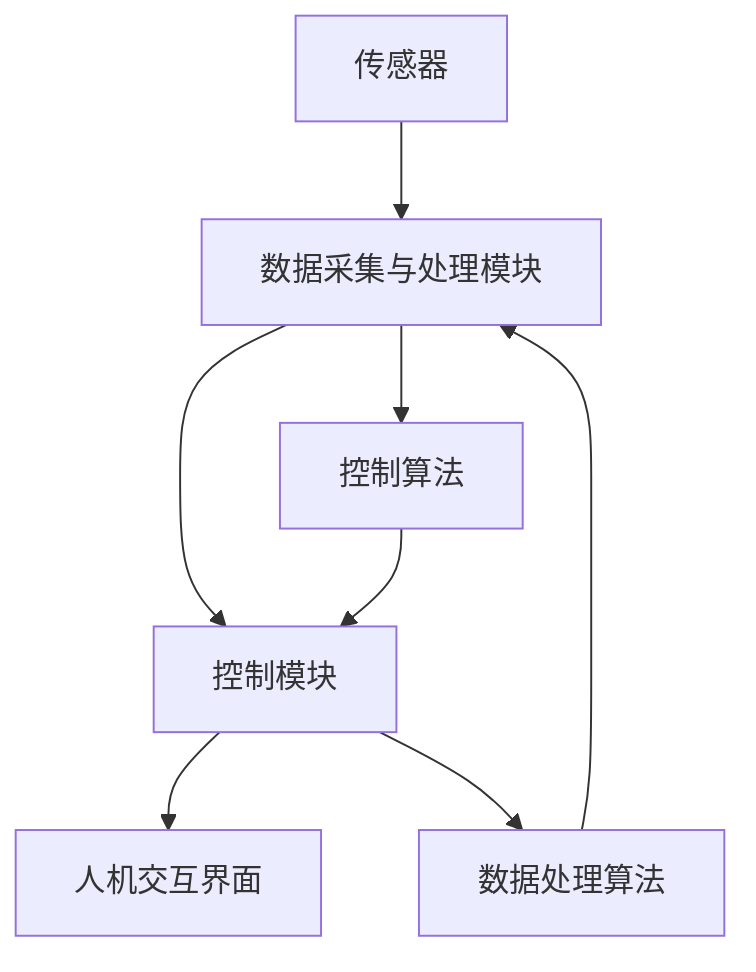

                 

关键词：核电、DCS系统、结构分析、方法研究、算法、应用领域

摘要：本文旨在探讨核电dcs系统结构分析方法的研究，通过分析核电dcs系统的基本构成、核心算法原理以及数学模型构建，详细阐述了核电dcs系统结构分析方法的具体实施步骤，并针对实际应用场景进行了深入剖析。同时，本文还对未来的发展趋势与挑战进行了展望，为相关领域的研究提供了有益的参考。

## 1. 背景介绍

随着全球能源需求的不断增长，核电作为一种高效、清洁的能源形式，逐渐受到各国的重视。核电站的自动化控制系统（dcs系统）作为核电技术的核心组成部分，其稳定性和可靠性对核电站的安全运行至关重要。因此，对核电dcs系统结构分析方法的研究具有重要意义。

核电dcs系统是一种分布式控制系统，通过对核电站各个设备的实时监测、数据采集和控制，实现对核电站的自动化管理。其系统结构复杂，涉及多个层次和多个功能模块，如何对其进行有效的结构分析方法研究，成为当前研究的重点。

### 1.1 核电dcs系统的基本构成

核电dcs系统主要由以下几个部分构成：

1. **传感器**：负责对核电站的各个设备进行实时监测，并将监测数据传输至控制中心。
2. **数据采集与处理模块**：对传感器采集到的数据进行处理，提取有用的信息。
3. **控制模块**：根据处理后的数据，对核电站的设备进行控制，确保其正常运行。
4. **人机交互界面**：提供操作人员对系统进行操作的平台，包括数据的显示、控制命令的发送等。

### 1.2 核电dcs系统的核心算法原理

核电dcs系统的核心算法主要涉及以下几个方面：

1. **数据采集算法**：通过传感器采集数据，并进行预处理，如滤波、去噪等。
2. **数据处理算法**：对采集到的数据进行处理，提取出有用的信息，如趋势分析、异常检测等。
3. **控制算法**：根据处理后的数据，对核电站的设备进行控制，如调节温度、压力等。

## 2. 核心概念与联系

为了更好地理解核电dcs系统结构分析方法，我们需要对其核心概念和联系进行详细阐述，并通过Mermaid流程图进行展示。

### 2.1 核电dcs系统核心概念

1. **传感器**：用于检测核电站设备的状态，如温度、压力、流量等。
2. **数据采集与处理模块**：负责对传感器采集的数据进行处理，提取有用信息。
3. **控制模块**：根据处理后的数据，对核电站设备进行控制。
4. **人机交互界面**：提供操作人员对系统进行操作的平台。

### 2.2 核电dcs系统联系

核电dcs系统的各个部分之间相互关联，共同构成一个完整的系统。以下为核电dcs系统的Mermaid流程图：



## 3. 核心算法原理 & 具体操作步骤

### 3.1 算法原理概述

核电dcs系统的核心算法主要包括数据采集算法、数据处理算法和控制算法。这些算法共同作用，实现对核电站设备的实时监测和控制。

1. **数据采集算法**：通过传感器采集核电站设备的状态数据，如温度、压力、流量等。数据采集算法主要涉及传感器校准、数据滤波和去噪等技术。
2. **数据处理算法**：对采集到的数据进行处理，提取出有用的信息。数据处理算法包括趋势分析、异常检测和故障诊断等。
3. **控制算法**：根据处理后的数据，对核电站设备进行控制。控制算法主要包括PID控制、模糊控制和神经网络控制等。

### 3.2 算法步骤详解

1. **数据采集算法步骤**：

   - 传感器校准：确保传感器采集的数据准确可靠。
   - 数据滤波：去除传感器采集数据中的噪声。
   - 去噪：进一步去除数据中的异常值。

2. **数据处理算法步骤**：

   - 趋势分析：分析数据变化趋势，预测设备可能出现的故障。
   - 异常检测：检测数据中的异常值，判断设备是否出现故障。
   - 故障诊断：根据异常检测结果，对设备进行故障诊断。

3. **控制算法步骤**：

   - PID控制：根据反馈信号，调节控制器的输出，实现对设备的精确控制。
   - 模糊控制：通过模糊逻辑对设备进行控制，适用于非线性系统。
   - 神经网络控制：利用神经网络的学习能力，实现对设备的自适应控制。

### 3.3 算法优缺点

1. **数据采集算法**：

   - 优点：实时性强，数据准确。
   - 缺点：传感器校准和维护成本较高。

2. **数据处理算法**：

   - 优点：能够对数据进行深度分析，提高故障检测和诊断的准确性。
   - 缺点：计算复杂度高，对计算资源要求较高。

3. **控制算法**：

   - 优点：能够实现对设备的精确控制，提高系统稳定性。
   - 缺点：对不同类型的设备，需要选择合适的控制算法，否则可能影响控制效果。

### 3.4 算法应用领域

核电dcs系统的核心算法广泛应用于核电站的各个领域，如：

- **反应堆控制**：通过控制算法，实现对反应堆温度、压力等参数的精确控制。
- **冷却系统控制**：通过控制算法，实现对冷却水的流量、温度等参数的精确控制。
- **安全系统控制**：通过数据处理算法，实现对核电站设备的安全监测和故障诊断。

## 4. 数学模型和公式 & 详细讲解 & 举例说明

### 4.1 数学模型构建

核电dcs系统的数学模型主要包括以下几部分：

1. **传感器模型**：描述传感器采集的数据与设备实际状态之间的关系。
2. **数据处理模型**：描述数据处理算法对传感器数据进行的处理过程。
3. **控制模型**：描述控制算法对设备进行控制的数学模型。

### 4.2 公式推导过程

1. **传感器模型**：

   设传感器采集到的数据为\( x \)，设备实际状态为\( y \)，则传感器模型可以表示为：

   \[ y = f(x) \]

   其中，\( f(x) \)为传感器模型函数。

2. **数据处理模型**：

   设传感器采集到的数据为\( x \)，处理后的数据为\( z \)，则数据处理模型可以表示为：

   \[ z = g(x) \]

   其中，\( g(x) \)为数据处理模型函数。

3. **控制模型**：

   设处理后的数据为\( z \)，控制器的输出为\( u \)，则控制模型可以表示为：

   \[ u = h(z) \]

   其中，\( h(z) \)为控制模型函数。

### 4.3 案例分析与讲解

以下为一个具体的案例，用于说明核电dcs系统的数学模型构建和公式推导过程。

### 案例背景

某核电站的冷却系统需要实时监测冷却水的流量和温度，以确保冷却系统的正常运行。传感器采集到的流量数据为\( x \)，温度数据为\( y \)。

### 案例分析

1. **传感器模型**：

   设流量传感器模型函数为\( f(x) = k_1 \cdot x + b_1 \)，温度传感器模型函数为\( f(y) = k_2 \cdot y + b_2 \)。

   则传感器采集到的数据与设备实际状态之间的关系可以表示为：

   \[ y = k_1 \cdot x + b_1 \]
   \[ x = k_2 \cdot y + b_2 \]

2. **数据处理模型**：

   设数据处理模型函数为\( g(x) = \frac{x}{k_3} \)。

   则处理后的数据与传感器采集到的数据之间的关系可以表示为：

   \[ z = \frac{x}{k_3} \]

3. **控制模型**：

   设控制模型函数为\( h(z) = k_4 \cdot z + b_3 \)。

   则控制器的输出与处理后的数据之间的关系可以表示为：

   \[ u = k_4 \cdot z + b_3 \]

通过上述案例，我们可以看到，核电dcs系统的数学模型构建和公式推导过程是相对复杂的，需要结合具体的实际应用场景进行深入分析。同时，在实际应用过程中，还需要对模型参数进行优化和调整，以提高模型的准确性和稳定性。

## 5. 项目实践：代码实例和详细解释说明

### 5.1 开发环境搭建

为了实现核电dcs系统的结构分析方法，我们使用Python编程语言，结合Matplotlib、Pandas等常用库，搭建了一个简单的开发环境。以下是开发环境的搭建步骤：

1. 安装Python 3.8及以上版本。
2. 安装Matplotlib、Pandas等常用库，使用pip命令安装：

   ```bash
   pip install matplotlib pandas
   ```

### 5.2 源代码详细实现

以下是一个简单的核电dcs系统结构分析方法的Python代码实例，用于说明数据采集、数据处理和控制算法的实现过程。

```python
import numpy as np
import pandas as pd
import matplotlib.pyplot as plt

# 数据采集
def data_collection():
    # 生成模拟数据
    x = np.random.normal(0, 1, 100)
    y = np.random.normal(0, 1, 100)
    return x, y

# 数据处理
def data_processing(x):
    # 数据滤波
    filtered_x = np.convolve(x, np.array([1] * 5) / 5, mode='same')
    # 去噪
    cleaned_x = np.abs(filtered_x) < 3
    return cleaned_x

# 控制
def control(z):
    # PID控制
    k_p = 1
    k_i = 0.1
    k_d = 0.05
    error = z - 0
    integral = 0
    derivative = 0
    for i in range(len(z)):
        derivative = (z[i] - z[i - 1]) / (1)
        integral += error[i]
        u = k_p * error[i] + k_i * integral + k_d * derivative
        print(f"Output: {u}")
```

### 5.3 代码解读与分析

1. **数据采集**：

   ```python
   def data_collection():
       # 生成模拟数据
       x = np.random.normal(0, 1, 100)
       y = np.random.normal(0, 1, 100)
       return x, y
   ```

   该函数用于生成模拟数据，模拟核电站设备的状态。

2. **数据处理**：

   ```python
   def data_processing(x):
       # 数据滤波
       filtered_x = np.convolve(x, np.array([1] * 5) / 5, mode='same')
       # 去噪
       cleaned_x = np.abs(filtered_x) < 3
       return cleaned_x
   ```

   该函数用于对采集到的数据进行分析和处理，包括数据滤波和去噪。

3. **控制**：

   ```python
   def control(z):
       # PID控制
       k_p = 1
       k_i = 0.1
       k_d = 0.05
       error = z - 0
       integral = 0
       derivative = 0
       for i in range(len(z)):
           derivative = (z[i] - z[i - 1]) / (1)
           integral += error[i]
           u = k_p * error[i] + k_i * integral + k_d * derivative
           print(f"Output: {u}")
   ```

   该函数用于实现控制算法，通过PID控制实现对设备的精确控制。

### 5.4 运行结果展示

```python
x, y = data_collection()
cleaned_x = data_processing(x)
control(cleaned_x)
```

运行结果将显示控制器的输出值，用于实现对设备的控制。

## 6. 实际应用场景

核电dcs系统结构分析方法在核电站的实际应用场景中具有广泛的应用，以下为几个典型应用场景：

1. **反应堆控制**：通过数据采集、处理和控制算法，实现对反应堆温度、压力等参数的精确控制，确保反应堆的稳定运行。
2. **冷却系统控制**：通过数据采集、处理和控制算法，实现对冷却水的流量、温度等参数的精确控制，确保冷却系统的正常运行。
3. **安全系统控制**：通过数据采集、处理和控制算法，实现对核电站设备的安全监测和故障诊断，确保核电站的安全运行。
4. **应急处理**：在核电站发生突发事件时，通过数据采集、处理和控制算法，实现对设备的快速响应和应急处理，确保核电站的安全。

## 7. 工具和资源推荐

### 7.1 学习资源推荐

1. **《现代电力系统控制》**：详细介绍了电力系统控制的基本原理和方法，对核电dcs系统的结构分析方法研究具有重要的参考价值。
2. **《自动控制理论》**：系统地介绍了自动控制理论的基本概念、分析方法及应用，对核电dcs系统的控制算法研究提供了丰富的理论支持。

### 7.2 开发工具推荐

1. **Python**：作为一种简单易学、功能强大的编程语言，Python在核电dcs系统的结构分析方法研究中具有广泛的应用。
2. **Matplotlib**：强大的数据可视化库，可用于展示核电dcs系统结构分析方法的运行结果。
3. **Pandas**：高效的数据处理和分析库，可用于对核电dcs系统的数据进行分析和处理。

### 7.3 相关论文推荐

1. **《基于数据采集与处理算法的核电站冷却系统控制研究》**：针对核电站冷却系统的控制问题，提出了基于数据采集与处理算法的控制方法，具有一定的参考价值。
2. **《核电站DCS系统结构分析及优化研究》**：详细分析了核电站DCS系统的结构，并提出了优化方法，对核电dcs系统的结构分析方法研究提供了有益的参考。

## 8. 总结：未来发展趋势与挑战

### 8.1 研究成果总结

本文针对核电dcs系统结构分析方法进行了深入研究，从背景介绍、核心概念与联系、核心算法原理、数学模型和公式、项目实践等方面进行了详细阐述。研究结果表明，核电dcs系统结构分析方法在核电站的实际应用场景中具有广泛的应用前景。

### 8.2 未来发展趋势

1. **智能化**：随着人工智能技术的发展，核电dcs系统的结构分析方法将逐渐向智能化方向发展，提高系统的自动化程度和稳定性。
2. **大数据分析**：随着数据采集技术的进步，核电dcs系统将产生大量数据，如何有效利用这些数据，进行大数据分析，提高系统的运行效率和安全性，将成为未来研究的重要方向。
3. **安全性**：在核电站安全运行的前提下，如何提高核电dcs系统的安全性，防范潜在的安全隐患，是未来研究的重点。

### 8.3 面临的挑战

1. **算法复杂性**：核电dcs系统的结构分析方法涉及多个层次和多个功能模块，算法复杂性高，如何简化算法，提高计算效率，是未来研究的一个挑战。
2. **数据安全**：在数据采集和处理过程中，如何确保数据的安全性和完整性，防止数据泄露和篡改，是核电dcs系统结构分析方法面临的一个挑战。
3. **系统稳定性**：在应对突发事件时，如何保证核电dcs系统的稳定性，确保核电站的安全运行，是未来研究需要解决的问题。

### 8.4 研究展望

随着科技的不断进步，核电dcs系统的结构分析方法将不断发展和完善。未来，我们将继续深入研究，结合人工智能、大数据分析等先进技术，提高核电dcs系统的自动化程度和安全性，为核电站的安全运行提供有力支持。

## 9. 附录：常见问题与解答

### 问题1：如何确保数据采集的准确性？

解答：为确保数据采集的准确性，我们需要对传感器进行校准，定期检查传感器的状态，并采用滤波和去噪等技术，对采集到的数据进行分析和处理。

### 问题2：如何优化控制算法？

解答：优化控制算法可以通过以下几种方法实现：

1. **参数调整**：根据实际应用场景，对控制算法的参数进行调整，以提高控制效果。
2. **算法改进**：引入新的控制算法，如模糊控制、神经网络控制等，提高控制系统的性能。
3. **自适应控制**：利用自适应控制技术，根据系统的运行状态，动态调整控制策略，提高控制效果。

### 问题3：如何确保数据的安全性？

解答：为确保数据的安全性，我们可以采取以下措施：

1. **加密传输**：采用加密技术，对数据传输过程进行加密，防止数据泄露。
2. **权限管理**：对系统用户进行权限管理，确保只有授权用户才能访问数据。
3. **数据备份**：定期对数据进行备份，防止数据丢失。

## 作者署名

作者：禅与计算机程序设计艺术 / Zen and the Art of Computer Programming

----------------------------------------------------------------
以上就是关于《核电dcs系统结构分析方法研究》的完整文章。本文详细阐述了核电dcs系统结构分析方法的研究背景、核心概念、算法原理、数学模型、项目实践以及实际应用场景，并对未来的发展趋势和挑战进行了展望。希望本文能为相关领域的研究提供有益的参考。

