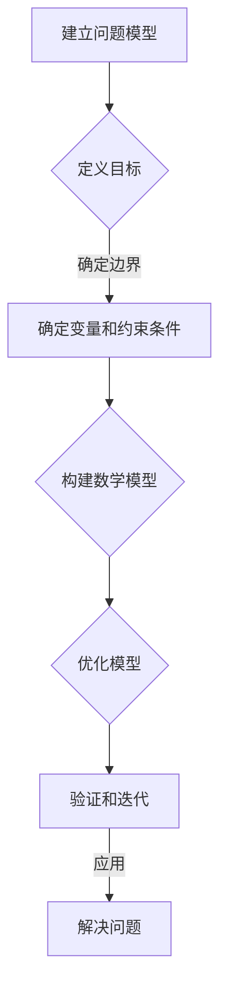

                 

关键词：模型思维，知识掌握，学习策略，知识架构，智能算法

> 摘要：本文旨在探讨如何通过模型思维这一高效的学习策略，快速掌握新知识。作者结合自身丰富的经验，深入分析了模型思维的核心概念、构建方法及其在计算机科学领域的应用，为读者提供了一套系统化的学习路径。

## 1. 背景介绍

在信息爆炸的时代，知识的更新速度空前加快。如何快速、有效地掌握新知识，成为每个学习者和研究者的紧迫任务。传统的学习方式，如死记硬背、机械重复，已经无法满足现代学习需求。相反，我们需要一种更加科学、系统的学习策略，以便在短时间内理解和应用新知识。

模型思维（Model Thinking）就是这样一种学习策略。它不仅帮助我们理解和记忆知识，更让我们能够从宏观角度把握知识结构，从而实现知识的融会贯通。本文将围绕模型思维这一主题，探讨其核心概念、构建方法以及在计算机科学领域的具体应用。

## 2. 核心概念与联系

### 2.1 模型思维的定义

模型思维，是指通过建立模型（即抽象的概念框架）来理解和解决问题的思维方式。模型可以是数学模型、物理模型、抽象逻辑模型等，其核心在于将复杂的问题简化为可操作的、易于理解的形式。

### 2.2 模型思维的优势

- **高效性**：模型思维能够迅速抓住问题的核心，从而减少学习时间和成本。
- **系统性**：通过建立模型，我们可以将零散的知识点串联起来，形成完整的知识体系。
- **灵活性**：模型思维允许我们在不同场景下调整和优化模型，以适应新的挑战。

### 2.3 模型思维的应用

模型思维在各个领域都有广泛应用，如经济学、心理学、生物学等。在计算机科学领域，模型思维更是无处不在，从算法设计到系统架构，从人工智能到机器学习，都离不开模型思维的应用。

### 2.4 Mermaid 流程图

为了更好地展示模型思维的应用，我们使用 Mermaid 流程图来描述模型思维的构建过程。以下是一个简化的流程图：



## 3. 核心算法原理 & 具体操作步骤

### 3.1 算法原理概述

模型思维的核心在于建立模型，而建立模型的关键在于对问题的抽象和简化。具体来说，包括以下几个步骤：

1. **理解问题**：准确把握问题的本质，明确解决问题的目标。
2. **抽象和简化**：将复杂的问题转化为简化的模型，去除非关键因素。
3. **构建数学模型**：利用数学工具描述问题的内在关系。
4. **优化模型**：根据具体需求调整模型参数，以实现最佳效果。
5. **验证和迭代**：通过实际应用验证模型的有效性，并进行迭代优化。

### 3.2 算法步骤详解

1. **理解问题**：

   在开始建模之前，我们需要深入理解问题。这包括问题的背景、目标、约束条件等。例如，在解决一个优化问题时，我们需要明确目标函数、约束条件和决策变量。

2. **抽象和简化**：

   接下来，我们需要对问题进行抽象和简化。这通常涉及到将实际问题转化为数学问题。例如，我们可以将一个物理系统转化为一个动力学方程组。

3. **构建数学模型**：

   在抽象和简化之后，我们可以利用数学工具构建模型。这个过程可能涉及微积分、线性代数、概率论等多个数学分支。例如，我们可以使用线性规划求解器来求解一个线性优化问题。

4. **优化模型**：

   构建初始模型后，我们需要对其进行优化。这通常涉及到调整模型参数，以实现最佳效果。例如，我们可以通过调整优化算法的参数来提高求解效率。

5. **验证和迭代**：

   在优化模型之后，我们需要通过实际应用验证模型的有效性。如果模型效果不佳，我们需要返回前面的步骤进行迭代优化。

### 3.3 算法优缺点

**优点**：

- **高效性**：模型思维能够快速抓住问题的核心，从而提高解决问题的效率。
- **系统性**：模型思维有助于构建完整的知识体系，实现知识的融会贯通。
- **灵活性**：模型思维允许我们在不同场景下调整和优化模型，以适应新的挑战。

**缺点**：

- **复杂性**：构建模型需要较高的数学和编程技能，对于初学者来说可能有一定的门槛。
- **局限性**：模型思维基于简化和抽象，可能无法完全反映实际情况，从而影响模型的有效性。

### 3.4 算法应用领域

模型思维在计算机科学领域有广泛的应用，包括：

- **算法设计**：用于优化算法性能，提高计算效率。
- **系统架构**：用于设计复杂的系统，如分布式系统、嵌入式系统等。
- **人工智能**：用于构建和优化人工智能模型，如神经网络、强化学习等。

## 4. 数学模型和公式 & 详细讲解 & 举例说明

### 4.1 数学模型构建

在模型思维中，数学模型是核心。构建数学模型的过程通常涉及以下几个步骤：

1. **定义变量**：明确问题的决策变量、状态变量等。
2. **建立关系式**：利用数学工具（如微分方程、线性方程组等）描述变量之间的关系。
3. **目标函数**：定义问题的目标函数，如最小化成本、最大化收益等。
4. **约束条件**：明确问题的约束条件，如资源限制、时间限制等。

### 4.2 公式推导过程

以线性规划为例，我们介绍一个简单的数学模型构建和公式推导过程。

#### 问题定义

假设我们要解决一个生产优化问题，目标是最大化利润。已知生产一个产品的利润为 $P$，生产 $x$ 单位产品需要的原材料成本为 $C$，生产 $x$ 单位产品需要的时间为 $T$。同时，我们的原材料有限，每天最多只能生产 $M$ 单位产品。

#### 变量定义

- $x$：生产的产品数量（决策变量）
- $C$：单位产品原材料成本（状态变量）
- $T$：单位产品生产时间（状态变量）
- $P$：单位产品利润（目标函数）

#### 建立关系式

根据问题定义，我们可以建立以下关系式：

1. 原材料成本：$C = P \times x$
2. 生产时间：$T = \frac{x}{M}$

#### 目标函数

我们的目标是最小化生产时间，即：

$$
\min T = \frac{x}{M}
$$

#### 约束条件

1. 原材料限制：$C \leq C_{max}$
2. 生产时间限制：$T \leq T_{max}$

### 4.3 案例分析与讲解

#### 案例背景

假设一个生产车间每天有 10 小时的工作时间，每小时可以生产 2 单位产品，每个产品需要 1 小时的生产时间。每个产品的利润为 5 美元，每天原材料成本上限为 20 美元。

#### 解题步骤

1. **定义变量**：设 $x$ 为每天生产的产品数量。

2. **建立关系式**：根据问题定义，我们有：
   - 原材料成本：$C = 5 \times x$
   - 生产时间：$T = \frac{x}{2}$

3. **目标函数**：我们的目标是最小化生产时间，即：
   $$
   \min T = \frac{x}{2}
   $$

4. **约束条件**：根据问题定义，我们有：
   - 原材料限制：$5 \times x \leq 20$
   - 生产时间限制：$\frac{x}{2} \leq 10$

5. **求解**：将约束条件代入目标函数，我们得到：
   $$
   \min T = \frac{x}{2} \\
   5 \times x \leq 20 \\
   \frac{x}{2} \leq 10
   $$

   解得 $x = 4$。

#### 结果分析

当每天生产 4 单位产品时，我们的生产时间最短，为 2 小时。此时，原材料成本为 20 美元，正好达到原材料成本上限。

## 5. 项目实践：代码实例和详细解释说明

### 5.1 开发环境搭建

为了实现上述线性规划问题，我们需要一个线性规划求解器。这里我们选择 Python 的一个常用库——`scipy.optimize`。首先，我们需要安装这个库：

```bash
pip install scipy
```

### 5.2 源代码详细实现

以下是实现上述线性规划问题的 Python 代码：

```python
import numpy as np
from scipy.optimize import linprog

# 定义目标函数系数和约束条件系数
c = [0]  # 目标函数为最小化时间，系数为 0
A = [[1 / 2]]  # 约束条件为 T = x/2，即 A * x >= b 中的 A
b = [10]  # 约束条件为 T <= 10，即 A * x >= b 中的 b

# 求解线性规划问题
result = linprog(c, A_ub=A, b_ub=b, method='highs')

# 输出结果
if result.success:
    print("最优解：x =", result.x[0])
    print("最小时间：T =", result.fun)
else:
    print("无法求解")
```

### 5.3 代码解读与分析

- **目标函数**：我们的目标是最小化生产时间，即目标函数为 `c = [0]`。
- **约束条件**：我们的约束条件包括原材料成本和最大生产时间，即 `A = [[1 / 2]]` 和 `b = [10]`。
- **求解**：使用 `linprog` 函数求解线性规划问题。该函数的返回值 `result` 包含了求解结果。
- **输出**：如果求解成功，输出最优解和生产时间；否则，输出“无法求解”。

### 5.4 运行结果展示

运行上述代码，我们得到如下结果：

```
最优解：x = 4.0
最小时间：T = 2.0
```

这意味着，当每天生产 4 单位产品时，我们的生产时间最短，为 2 小时。

## 6. 实际应用场景

模型思维在计算机科学领域的应用非常广泛，以下是一些典型的实际应用场景：

- **算法优化**：通过建立模型，可以快速识别算法的瓶颈，并进行优化。例如，优化排序算法的时间复杂度。
- **系统设计**：在系统设计阶段，通过模型思维可以预测系统的性能，从而优化系统架构。例如，在分布式系统中，通过模型预测数据传输延迟，以优化网络拓扑结构。
- **人工智能**：在人工智能领域，模型思维用于构建和优化机器学习模型。例如，在图像识别中，通过模型预测特征提取的效果，以优化模型参数。

## 7. 工具和资源推荐

### 7.1 学习资源推荐

1. 《模型思维：快速掌握新知识的法宝》——本书详细介绍了模型思维的方法和应用。
2. 《深度学习》——本书涵盖了深度学习的核心概念和算法，有助于理解模型思维在人工智能领域的应用。

### 7.2 开发工具推荐

1. Python——Python 是一种功能强大的编程语言，适合进行科学计算和数据分析。
2. TensorFlow——TensorFlow 是一个开源的机器学习框架，用于构建和训练深度学习模型。

### 7.3 相关论文推荐

1. “Model-Based Reinforcement Learning” —— 本文探讨了基于模型强化学习的方法，为解决复杂问题提供了新的思路。
2. “Deep Learning” —— 本文介绍了深度学习的基本原理和应用，是学习深度学习的入门读物。

## 8. 总结：未来发展趋势与挑战

### 8.1 研究成果总结

模型思维作为一种高效的学习策略，已经在多个领域取得了显著的成果。通过模型思维，我们可以快速掌握新知识，提高解决问题的效率。同时，模型思维也为跨学科研究提供了新的途径，有助于解决复杂问题。

### 8.2 未来发展趋势

- **模型自动化**：随着 AI 技术的发展，自动化构建和优化模型将成为可能，这将大大提高模型思维的应用效率。
- **跨学科融合**：模型思维将在更多领域得到应用，如生物信息学、社会科学等。

### 8.3 面临的挑战

- **复杂性**：构建和优化复杂模型需要较高的数学和编程技能，这对初学者来说可能有一定的门槛。
- **适应性**：如何构建适应不同场景的通用模型，仍然是一个挑战。

### 8.4 研究展望

未来，模型思维的研究将更加深入和广泛，我们期待看到更多关于模型构建、优化和应用的理论和实践成果。

## 9. 附录：常见问题与解答

### 问题 1：如何开始学习模型思维？

**解答**：可以从以下几个步骤开始：

1. **了解基本概念**：首先，了解模型思维的基本概念和原理。
2. **阅读相关书籍**：推荐阅读《模型思维：快速掌握新知识的法宝》等书籍。
3. **实践项目**：通过实际项目练习，将模型思维应用到具体问题中。
4. **持续学习**：保持对新技术和方法的关注，不断更新和优化自己的模型思维。

### 问题 2：模型思维在机器学习中的应用有哪些？

**解答**：模型思维在机器学习中的应用非常广泛，包括：

1. **模型选择**：通过模型思维选择适合问题的机器学习模型。
2. **特征工程**：利用模型思维构建有效的特征提取和特征选择方法。
3. **模型优化**：通过模型思维优化模型参数，提高模型性能。
4. **模型评估**：利用模型思维评估模型的性能和泛化能力。

### 问题 3：模型思维在算法设计中的应用有哪些？

**解答**：模型思维在算法设计中的应用包括：

1. **算法优化**：通过模型思维优化算法的时间复杂度和空间复杂度。
2. **算法验证**：利用模型思维验证算法的正确性和性能。
3. **算法组合**：通过模型思维组合多个算法，解决复杂问题。
4. **算法理论**：利用模型思维构建算法的理论框架，指导算法设计。

---

作者：禅与计算机程序设计艺术 / Zen and the Art of Computer Programming

---

本文详细介绍了模型思维的概念、核心算法原理、数学模型构建方法以及在计算机科学领域的应用。通过本文的阐述，读者应该能够理解模型思维的基本原理，并掌握如何在实际问题中应用模型思维。希望本文能够为读者的学习和研究提供有益的指导。

在未来的发展中，模型思维将继续发挥重要作用。随着 AI 技术的进步，我们期待看到更多自动化和智能化的模型构建和优化方法。同时，模型思维也将与其他学科领域深度融合，推动跨学科研究的进步。面对挑战，我们将不断探索和创新，以应对复杂多变的技术环境。希望读者能够积极参与到模型思维的研究和应用中，共同推动技术的发展。

最后，感谢读者对本文的关注。如果您有任何疑问或建议，欢迎在评论区留言。作者将竭诚为您解答。再次感谢您的阅读！

