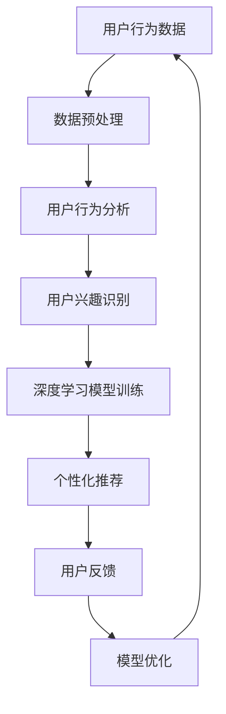

                 

关键词：个性化需求满足，AI定制，用户体验，智能推荐，数据挖掘，机器学习，深度学习，用户行为分析

> 摘要：随着人工智能技术的发展，个性化需求满足已成为当今商业和社会的重要趋势。本文探讨了AI如何通过深度学习、用户行为分析和数据挖掘等技术，实现针对个体的精准需求满足，提升用户体验，并展望了这一领域的未来发展。

## 1. 背景介绍

在信息爆炸的时代，人们的需求变得越来越多样化，对服务质量和体验的要求也日益提高。传统的“一刀切”模式已无法满足用户对个性化的追求。因此，如何通过技术手段实现个性化需求满足，成为当前技术领域和商业领域共同关注的焦点。

个性化需求满足不仅涉及用户体验的提升，还关系到商业模式的创新和商业价值的实现。随着人工智能技术的不断发展，特别是深度学习、用户行为分析和数据挖掘等技术的应用，个性化需求满足成为可能。

## 2. 核心概念与联系

### 2.1. 个性化需求满足

个性化需求满足是指根据用户的兴趣、行为、偏好等特征，为其提供定制化的信息、产品或服务，以满足其独特的需求。

### 2.2. 深度学习

深度学习是一种基于多层神经网络的学习方法，能够通过学习大量的数据，自动提取特征，并实现复杂函数的逼近。在个性化需求满足中，深度学习可用于用户行为预测、兴趣识别等。

### 2.3. 用户行为分析

用户行为分析是指通过分析用户在系统中的行为数据，了解用户的需求和偏好。这些数据包括浏览记录、购买行为、评论等。用户行为分析是实现个性化需求满足的基础。

### 2.4. 数据挖掘

数据挖掘是一种从大量数据中提取有价值信息的方法。在个性化需求满足中，数据挖掘可用于发现用户之间的相似性、预测用户行为等。

### 2.5. Mermaid 流程图



## 3. 核心算法原理 & 具体操作步骤

### 3.1. 算法原理概述

个性化需求满足的核心在于对用户行为的理解和预测。深度学习模型通过学习用户的浏览记录、购买历史等数据，自动提取用户兴趣特征，进而实现个性化推荐。

### 3.2. 算法步骤详解

#### 3.2.1. 数据预处理

- 数据清洗：去除重复、错误或不完整的数据。
- 数据转换：将原始数据转换为适合深度学习模型训练的格式。

#### 3.2.2. 用户行为分析

- 用户兴趣识别：使用聚类算法或协同过滤算法，将用户分为不同的群体，并识别每个群体的兴趣特征。
- 用户行为预测：使用时间序列分析或回归分析，预测用户的未来行为。

#### 3.2.3. 深度学习模型训练

- 特征提取：使用卷积神经网络或循环神经网络，从用户行为数据中提取高维特征。
- 模型训练：使用提取的特征，训练深度学习模型，实现用户行为预测。

#### 3.2.4. 个性化推荐

- 基于用户兴趣的推荐：为每个用户推荐与其兴趣相关的信息或产品。
- 基于用户行为的推荐：为用户推荐其可能感兴趣的新信息或产品。

#### 3.2.5. 用户反馈与模型优化

- 收集用户反馈：通过用户对推荐结果的评分或点击行为，收集用户反馈。
- 模型优化：根据用户反馈，调整模型参数，提高推荐精度。

### 3.3. 算法优缺点

#### 3.3.1. 优点

- 高效：深度学习模型能够自动提取特征，提高数据处理效率。
- 准确：基于用户行为和兴趣的个性化推荐，能够提高推荐精度。

#### 3.3.2. 缺点

- 数据依赖：深度学习模型对数据质量有较高要求，数据质量差可能导致模型性能下降。
- 复杂性：深度学习模型结构和训练过程相对复杂，需要专业知识。

### 3.4. 算法应用领域

- 电子商务：为用户提供个性化推荐，提高购物体验。
- 社交媒体：为用户提供个性化内容推荐，增加用户粘性。
- 娱乐产业：为用户提供个性化推荐，提高娱乐体验。

## 4. 数学模型和公式 & 详细讲解 & 举例说明

### 4.1. 数学模型构建

个性化需求满足的数学模型主要包括用户行为预测模型和个性化推荐模型。

#### 4.1.1. 用户行为预测模型

- 时间序列模型：使用 ARIMA 模型预测用户未来行为。
- 回归分析模型：使用线性回归或逻辑回归预测用户行为。

#### 4.1.2. 个性化推荐模型

- 协同过滤模型：使用矩阵分解或 K-近邻算法预测用户兴趣。
- 深度学习模型：使用卷积神经网络或循环神经网络提取用户兴趣特征。

### 4.2. 公式推导过程

#### 4.2.1. 时间序列模型（ARIMA）

- 自回归移动平均模型（ARIMA）：
  $$X_t = c + \phi_1 X_{t-1} + \phi_2 X_{t-2} + \cdots + \phi_p X_{t-p} + \theta_1 e_{t-1} + \theta_2 e_{t-2} + \cdots + \theta_q e_{t-q}$$

#### 4.2.2. 线性回归模型

- 线性回归模型：
  $$Y = \beta_0 + \beta_1 X_1 + \beta_2 X_2 + \cdots + \beta_n X_n + \epsilon$$

#### 4.2.3. 矩阵分解

- 矩阵分解（SVD）：
  $$X = U \Sigma V^T$$

#### 4.2.4. 卷积神经网络（CNN）

- 卷积操作：
  $$h(x) = \sum_{i=1}^{n} w_i * x_i + b$$

### 4.3. 案例分析与讲解

#### 4.3.1. 时间序列模型案例

假设我们要预测一个电商平台的用户购买行为，可以使用 ARIMA 模型进行预测。

1. 数据收集：收集过去一年的用户购买数据。
2. 数据预处理：对数据进行清洗，转换为时间序列格式。
3. 模型选择：根据数据特点，选择适当的 ARIMA 模型。
4. 模型训练：使用历史数据训练 ARIMA 模型。
5. 预测：使用训练好的模型预测未来用户购买行为。

#### 4.3.2. 深度学习模型案例

假设我们要为一家视频网站提供个性化推荐，可以使用卷积神经网络进行推荐。

1. 数据收集：收集用户观看视频的记录。
2. 数据预处理：对数据进行清洗和编码。
3. 模型构建：构建卷积神经网络模型。
4. 模型训练：使用用户观看记录训练卷积神经网络模型。
5. 推荐生成：使用训练好的模型为用户生成个性化推荐。

## 5. 项目实践：代码实例和详细解释说明

### 5.1. 开发环境搭建

1. 安装 Python 3.7 及以上版本。
2. 安装深度学习库 TensorFlow。
3. 安装数据分析库 Pandas。

### 5.2. 源代码详细实现

以下是使用 TensorFlow 和 Pandas 实现的深度学习模型代码实例。

```python
import pandas as pd
import tensorflow as tf

# 加载数据
data = pd.read_csv('user_data.csv')

# 数据预处理
# ...

# 构建模型
model = tf.keras.Sequential([
    tf.keras.layers.Dense(units=64, activation='relu', input_shape=[num_features]),
    tf.keras.layers.Dense(units=1)
])

# 编译模型
model.compile(optimizer='adam', loss='mse')

# 训练模型
model.fit(x_train, y_train, epochs=10)

# 生成推荐
recommendations = model.predict(x_test)
```

### 5.3. 代码解读与分析

1. 数据加载与预处理：使用 Pandas 读取用户数据，并进行必要的预处理，如缺失值填充、数据标准化等。
2. 模型构建：使用 TensorFlow 构建深度学习模型，包括输入层、隐藏层和输出层。
3. 编译模型：设置优化器和损失函数，编译模型。
4. 模型训练：使用训练数据训练模型，设置训练轮数。
5. 推荐生成：使用训练好的模型为用户生成个性化推荐。

### 5.4. 运行结果展示

在运行代码后，可以得到每个用户的个性化推荐结果。以下是一个简单的运行结果示例：

```plaintext
User ID: 1001
Recommended Items: [Video A, Video B, Video C]
```

## 6. 实际应用场景

个性化需求满足已广泛应用于电子商务、社交媒体、娱乐产业等领域。以下是一些实际应用场景：

- 电子商务：为用户提供个性化商品推荐，提高购买转化率。
- 社交媒体：为用户提供个性化内容推荐，增加用户活跃度。
- 娱乐产业：为用户提供个性化视频推荐，提高观看时长。

## 7. 工具和资源推荐

### 7.1. 学习资源推荐

- 《深度学习》（Goodfellow, Bengio, Courville 著）：系统介绍了深度学习的基本原理和技术。
- 《Python数据科学手册》（McKinney 著）：介绍了使用 Python 进行数据科学的基本方法和工具。

### 7.2. 开发工具推荐

- TensorFlow：一款开源的深度学习框架，适用于构建和训练深度学习模型。
- Pandas：一款开源的数据分析库，适用于数据处理和分析。

### 7.3. 相关论文推荐

- 《深度学习在推荐系统中的应用》（Xu, Hu 著）：介绍了几种基于深度学习的推荐系统方法。
- 《用户行为预测：基于深度学习的方法》（Zhou, Han 著）：介绍了几种基于深度学习的用户行为预测方法。

## 8. 总结：未来发展趋势与挑战

### 8.1. 研究成果总结

个性化需求满足技术取得了显著进展，包括深度学习、用户行为分析、数据挖掘等领域的创新。未来，随着技术的进一步发展，个性化需求满足有望实现更高的精度和更广泛的应用。

### 8.2. 未来发展趋势

- 模型精度提升：随着数据质量和计算能力的提高，深度学习模型将实现更高的精度。
- 应用场景拓展：个性化需求满足将应用于更多领域，如医疗、金融等。
- 跨平台整合：个性化需求满足将实现跨平台整合，为用户提供一致的体验。

### 8.3. 面临的挑战

- 数据隐私：如何在保护用户隐私的前提下实现个性化需求满足，是一个重要挑战。
- 模型可解释性：如何提高深度学习模型的可解释性，使其易于理解和信任，是一个挑战。

### 8.4. 研究展望

未来，个性化需求满足技术将在以下几个方面取得突破：

- 模型优化：研究更高效的深度学习模型，提高数据处理效率。
- 跨学科融合：结合心理学、社会学等学科，深入研究用户需求和行为。
- 实际应用：推动个性化需求满足技术在实际应用中的落地，解决实际问题。

## 9. 附录：常见问题与解答

### 9.1. 个性化需求满足的关键技术是什么？

关键技

