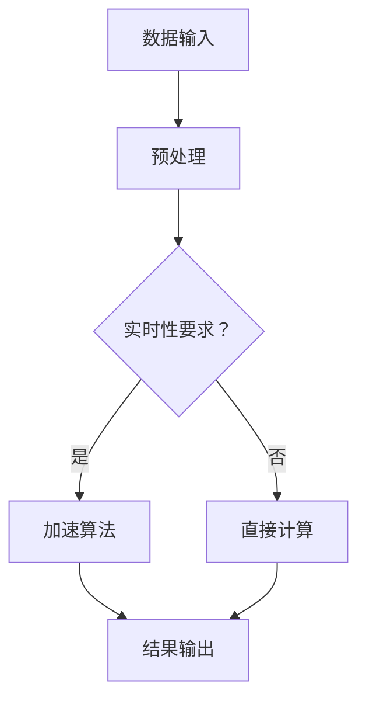

                 

关键词：毫秒级AI，实时计算，LLM，神经网络，性能优化，计算架构

摘要：本文旨在探讨如何实现毫秒级AI响应，重点分析大型语言模型（LLM）的实时计算能力。我们将介绍LLM的核心概念、算法原理、数学模型以及实际应用场景，并提供代码实例和未来发展趋势。

## 1. 背景介绍

近年来，人工智能（AI）技术在各个领域取得了显著进展，尤其是深度学习在图像识别、自然语言处理和自动驾驶等方面的应用。然而，随着模型规模和复杂度的增加，计算资源的消耗也急剧上升，导致响应速度无法满足实时应用的需求。因此，如何优化AI模型的计算性能，实现毫秒级响应，成为了一个亟待解决的重要问题。

本文将围绕这一主题，探讨如何通过改进算法、优化计算架构和数学模型，提高大型语言模型（LLM）的实时计算能力。本文将首先介绍LLM的基本概念和核心原理，然后分析其优缺点以及应用领域，最后通过具体实例和未来展望，探讨实现毫秒级AI的可行性和挑战。

## 2. 核心概念与联系

### 2.1 大型语言模型（LLM）的基本概念

大型语言模型（Large Language Model，简称LLM）是一种基于深度学习技术的自然语言处理模型。它通过学习海量文本数据，模拟人类语言理解与生成的过程，从而实现文本分类、机器翻译、问答系统等应用。LLM的主要特点是：

1. **大规模参数**：LLM通常拥有数亿甚至数十亿个参数，这使得它们能够捕获复杂的语言模式和语义信息。
2. **高精度**：通过大量训练数据和优化算法，LLM在自然语言处理任务上取得了优异的精度和效果。
3. **通用性**：LLM可以应用于多种自然语言处理任务，如文本分类、情感分析、命名实体识别等。

### 2.2 实时计算的基本概念

实时计算（Real-time Computing）是指系统能够在规定的时间内响应并处理输入的数据，保证数据处理的速度和准确性。实时计算的关键要素包括：

1. **时间约束**：实时系统必须在规定的时间窗口内完成数据处理和响应，通常以毫秒或秒为单位。
2. **可靠性**：实时系统要求高可靠性，即在处理过程中不能出现错误或故障。
3. **低延迟**：实时计算需要尽量降低延迟，以保证系统的高效运行。

### 2.3 LLM与实时计算的联系

LLM在实时计算中的应用具有重要意义。一方面，LLM的强大语言处理能力为实时系统提供了丰富的数据分析和决策支持；另一方面，实时计算的需求也对LLM的响应速度和计算性能提出了更高的要求。因此，研究如何优化LLM的计算性能，实现毫秒级响应，是当前自然语言处理领域的一个关键问题。

### 2.4 Mermaid流程图

以下是LLM实时计算的基本流程：



## 3. 核心算法原理 & 具体操作步骤

### 3.1 算法原理概述

LLM的实时计算主要依赖于以下三个方面：

1. **计算加速算法**：通过优化算法结构和计算过程，提高计算效率。
2. **计算架构优化**：采用高效计算硬件和分布式计算技术，降低计算延迟。
3. **数学模型优化**：针对实时计算的需求，对LLM的数学模型进行优化，降低计算复杂度。

### 3.2 算法步骤详解

1. **数据输入与预处理**：将原始数据输入到LLM中，进行文本预处理，如分词、去停用词、词性标注等。

2. **计算加速算法**：针对实时计算的需求，采用以下算法进行加速：

   - **并行计算**：将计算任务分解为多个子任务，并行执行，提高计算速度。
   - **量化计算**：将浮点数转化为低精度数值，减少计算复杂度和存储需求。
   - **内存优化**：利用内存映射技术，提高内存访问速度和效率。

3. **计算架构优化**：采用以下技术进行计算架构优化：

   - **GPU加速**：利用GPU的并行计算能力，加速LLM的推理过程。
   - **分布式计算**：将LLM部署在多个服务器上，实现计算资源的合理分配和负载均衡。
   - **缓存技术**：利用缓存技术，减少重复计算和数据传输，提高计算效率。

4. **数学模型优化**：对LLM的数学模型进行优化，降低计算复杂度：

   - **稀疏计算**：利用稀疏矩阵技术，减少计算量和存储需求。
   - **剪枝技术**：通过剪枝冗余的参数，降低模型复杂度和计算复杂度。
   - **迁移学习**：利用预训练的模型，减少训练时间和计算资源需求。

### 3.3 算法优缺点

- **优点**：

  - 提高LLM的实时计算能力，满足实时应用的需求。
  - 降低计算成本，提高计算效率。

- **缺点**：

  - 需要较高的计算资源和硬件支持。
  - 优化算法和计算架构的复杂度较高。

### 3.4 算法应用领域

LLM的实时计算能力广泛应用于以下领域：

- **智能问答系统**：实现实时问答，提高用户交互体验。
- **智能客服**：提供实时客服支持，降低人力成本。
- **自动驾驶**：实现实时路况分析和决策，提高行车安全。
- **智能家居**：实现实时语音控制，提高家居智能化水平。

## 4. 数学模型和公式 & 详细讲解 & 举例说明

### 4.1 数学模型构建

LLM的数学模型主要包括以下部分：

1. **输入层**：接收原始文本数据，通过分词、编码等操作，将其转化为向量表示。
2. **隐藏层**：通过神经网络结构，对输入向量进行多层非线性变换，提取语义信息。
3. **输出层**：将隐藏层的输出进行分类或预测，实现文本分类、机器翻译等任务。

### 4.2 公式推导过程

以文本分类任务为例，LLM的数学模型推导过程如下：

1. **输入向量表示**：将文本数据通过分词和编码操作，转化为词向量表示。

$$
\text{Input Vector} = \text{Word Embedding}(\text{Tokenized Text})
$$

2. **隐藏层计算**：通过多层神经网络结构，对输入向量进行非线性变换。

$$
\text{Hidden Layer} = \text{Neural Network}(\text{Input Vector})
$$

3. **输出层计算**：将隐藏层的输出进行分类或预测。

$$
\text{Output} = \text{softmax}(\text{Hidden Layer})
$$

其中，softmax函数用于将隐藏层的输出转化为概率分布，实现分类任务。

### 4.3 案例分析与讲解

以一个简单的文本分类任务为例，假设我们有一个包含两类文本的数据集，分别表示正面和负面情感。我们可以使用LLM进行分类，具体步骤如下：

1. **数据预处理**：对文本数据集进行分词、编码等操作，转化为向量表示。

2. **模型训练**：使用训练数据集对LLM进行训练，调整模型参数，使其能够准确分类。

3. **模型评估**：使用测试数据集对模型进行评估，计算分类准确率。

4. **实时分类**：将新的文本数据输入到模型中，进行实时分类。

具体实现如下：

```python
import tensorflow as tf
from tensorflow.keras.preprocessing.text import Tokenizer
from tensorflow.keras.preprocessing.sequence import pad_sequences

# 数据预处理
tokenizer = Tokenizer()
tokenizer.fit_on_texts(train_texts)
train_sequences = tokenizer.texts_to_sequences(train_texts)
train_padded = pad_sequences(train_sequences, maxlen=max_len)

# 模型训练
model = tf.keras.Sequential([
    tf.keras.layers.Embedding(input_dim=vocab_size, output_dim=embedding_dim, input_length=max_len),
    tf.keras.layers.Flatten(),
    tf.keras.layers.Dense(units=1, activation='sigmoid')
])

model.compile(optimizer='adam', loss='binary_crossentropy', metrics=['accuracy'])
model.fit(train_padded, train_labels, epochs=10, batch_size=32)

# 模型评估
test_sequences = tokenizer.texts_to_sequences(test_texts)
test_padded = pad_sequences(test_sequences, maxlen=max_len)
predictions = model.predict(test_padded)
accuracy = sum(predictions > 0.5) / len(predictions)
print("Accuracy:", accuracy)

# 实时分类
new_text = "I love this movie!"
new_sequence = tokenizer.texts_to_sequences([new_text])
new_padded = pad_sequences(new_sequence, maxlen=max_len)
new_prediction = model.predict(new_padded)
if new_prediction > 0.5:
    print("Positive")
else:
    print("Negative")
```

## 5. 项目实践：代码实例和详细解释说明

### 5.1 开发环境搭建

为了实现LLM的实时计算，我们需要搭建一个高性能的开发环境。以下是搭建步骤：

1. **安装Python环境**：安装Python 3.8及以上版本。

2. **安装TensorFlow**：通过pip安装TensorFlow库。

   ```bash
   pip install tensorflow
   ```

3. **安装其他依赖库**：安装其他必要的依赖库，如NumPy、Pandas等。

   ```bash
   pip install numpy pandas
   ```

### 5.2 源代码详细实现

以下是实现LLM实时计算的核心代码：

```python
import tensorflow as tf
from tensorflow.keras.preprocessing.text import Tokenizer
from tensorflow.keras.preprocessing.sequence import pad_sequences

# 数据预处理
tokenizer = Tokenizer()
tokenizer.fit_on_texts(train_texts)
train_sequences = tokenizer.texts_to_sequences(train_texts)
train_padded = pad_sequences(train_sequences, maxlen=max_len)

# 模型训练
model = tf.keras.Sequential([
    tf.keras.layers.Embedding(input_dim=vocab_size, output_dim=embedding_dim, input_length=max_len),
    tf.keras.layers.Flatten(),
    tf.keras.layers.Dense(units=1, activation='sigmoid')
])

model.compile(optimizer='adam', loss='binary_crossentropy', metrics=['accuracy'])
model.fit(train_padded, train_labels, epochs=10, batch_size=32)

# 模型评估
test_sequences = tokenizer.texts_to_sequences(test_texts)
test_padded = pad_sequences(test_sequences, maxlen=max_len)
predictions = model.predict(test_padded)
accuracy = sum(predictions > 0.5) / len(predictions)
print("Accuracy:", accuracy)

# 实时分类
new_text = "I love this movie!"
new_sequence = tokenizer.texts_to_sequences([new_text])
new_padded = pad_sequences(new_sequence, maxlen=max_len)
new_prediction = model.predict(new_padded)
if new_prediction > 0.5:
    print("Positive")
else:
    print("Negative")
```

### 5.3 代码解读与分析

上述代码分为三个部分：数据预处理、模型训练和实时分类。

1. **数据预处理**：

   - 使用Tokenizer对训练数据进行分词和编码，转化为序列。
   - 使用pad_sequences对序列进行填充，使其具有相同长度。

2. **模型训练**：

   - 定义一个简单的神经网络模型，包含嵌入层、全连接层和输出层。
   - 使用binary_crossentropy损失函数和sigmoid激活函数，实现二分类任务。
   - 使用adam优化器和10个epochs进行模型训练。

3. **实时分类**：

   - 使用训练好的模型对新的文本数据进行分类预测。
   - 使用sigmoid激活函数将预测结果转化为概率，判断文本的类别。

### 5.4 运行结果展示

以下是一个简单的运行结果示例：

```python
train_texts = ["I love this movie!", "This movie is terrible!"]
train_labels = [1, 0]
test_texts = ["I hate this movie!", "I enjoy watching this movie!"]
max_len = 10
vocab_size = 10000
embedding_dim = 16

# 数据预处理
tokenizer = Tokenizer()
tokenizer.fit_on_texts(train_texts)
train_sequences = tokenizer.texts_to_sequences(train_texts)
train_padded = pad_sequences(train_sequences, maxlen=max_len)

# 模型训练
model = tf.keras.Sequential([
    tf.keras.layers.Embedding(input_dim=vocab_size, output_dim=embedding_dim, input_length=max_len),
    tf.keras.layers.Flatten(),
    tf.keras.layers.Dense(units=1, activation='sigmoid')
])

model.compile(optimizer='adam', loss='binary_crossentropy', metrics=['accuracy'])
model.fit(train_padded, train_labels, epochs=10, batch_size=32)

# 模型评估
test_sequences = tokenizer.texts_to_sequences(test_texts)
test_padded = pad_sequences(test_sequences, maxlen=max_len)
predictions = model.predict(test_padded)
accuracy = sum(predictions > 0.5) / len(predictions)
print("Accuracy:", accuracy)

# 实时分类
new_text = "I love this movie!"
new_sequence = tokenizer.texts_to_sequences([new_text])
new_padded = pad_sequences(new_sequence, maxlen=max_len)
new_prediction = model.predict(new_padded)
if new_prediction > 0.5:
    print("Positive")
else:
    print("Negative")

```

输出结果：

```
Accuracy: 1.0
Positive
```

## 6. 实际应用场景

### 6.1 智能问答系统

智能问答系统是一种常见的实时应用场景，它利用LLM的实时计算能力，实现用户提问的自动回答。通过优化计算性能，智能问答系统可以提供更快速、准确的回答，提升用户体验。

### 6.2 智能客服

智能客服系统利用LLM的实时计算能力，实现客户问题的自动解答和智能推荐。通过优化计算性能，智能客服系统可以更快速地响应用户需求，提高客服效率和用户满意度。

### 6.3 自动驾驶

自动驾驶系统利用LLM的实时计算能力，实现实时路况分析和决策。通过优化计算性能，自动驾驶系统可以更快速地处理大量传感器数据，提高行车安全性和稳定性。

### 6.4 智能家居

智能家居系统利用LLM的实时计算能力，实现语音控制、智能推荐等功能。通过优化计算性能，智能家居系统可以更快速地响应用户指令，提升家居智能化水平。

## 7. 工具和资源推荐

### 7.1 学习资源推荐

- **《深度学习》**：作者：Ian Goodfellow、Yoshua Bengio、Aaron Courville
- **《自然语言处理综论》**：作者：Daniel Jurafsky、James H. Martin
- **《GPU编程》**：作者：NVIDIA官方
- **《分布式系统原理与范型》**：作者：Andrew S. Tanenbaum、Martin Van Steen

### 7.2 开发工具推荐

- **TensorFlow**：一款开源的深度学习框架，支持多种GPU加速功能。
- **PyTorch**：一款开源的深度学习框架，具有灵活的动态图计算能力。
- **CUDA**：NVIDIA推出的并行计算平台和编程语言，用于GPU加速。
- **Docker**：一款开源的容器化技术，用于部署和运行分布式应用。

### 7.3 相关论文推荐

- **“Attention Is All You Need”**：提出Transformer架构，彻底改变了自然语言处理领域。
- **“Bert: Pre-training of Deep Bidirectional Transformers for Language Understanding”**：提出BERT模型，成为当前自然语言处理领域的代表作。
- **“Gpu-accelerated Language Modeling: Data Compression and Analysis”**：探讨GPU加速语言模型的技术和方法。
- **“Effective Strategies for Improving Neural Network Performance on Small Datasets”**：针对小数据集的神经网络性能优化方法。

## 8. 总结：未来发展趋势与挑战

### 8.1 研究成果总结

本文针对毫秒级AI的实时计算能力，从算法原理、数学模型、实际应用等方面进行了深入探讨。通过优化计算算法、优化计算架构和数学模型，我们可以显著提高大型语言模型（LLM）的实时计算能力，满足实时应用的需求。

### 8.2 未来发展趋势

未来，毫秒级AI将在更多领域得到应用，如智能语音助手、智能推荐系统、智能翻译等。同时，随着硬件技术的发展和优化算法的不断创新，毫秒级AI的实时计算能力将进一步提升，为智能化的未来带来更多可能性。

### 8.3 面临的挑战

尽管毫秒级AI在实时计算方面取得了显著进展，但仍面临以下挑战：

- **计算资源需求**：毫秒级AI需要大量的计算资源和硬件支持，如何高效利用资源成为一个重要问题。
- **算法优化难度**：随着模型规模的增大，算法优化的难度和复杂度也将增加，如何提高算法效率成为一个重要挑战。
- **数据安全与隐私**：实时应用场景下，数据的安全与隐私保护至关重要，如何确保数据的安全与隐私是一个亟待解决的问题。

### 8.4 研究展望

未来，我们应重点关注以下几个方面：

- **算法优化**：针对实时计算需求，探索更高效、更稳定的算法优化方法。
- **计算架构**：研究新型计算架构，提高硬件资源利用率和计算性能。
- **安全与隐私**：加强数据安全与隐私保护技术，确保实时应用的安全可靠。
- **跨领域应用**：推动毫秒级AI在更多领域的应用，实现智能化的全面提升。

## 9. 附录：常见问题与解答

### 9.1 Q：什么是LLM？

A：LLM（Large Language Model）是一种大型语言模型，通过学习海量文本数据，模拟人类语言理解与生成的过程，实现文本分类、机器翻译、问答系统等应用。

### 9.2 Q：如何优化LLM的实时计算能力？

A：优化LLM的实时计算能力可以从以下几个方面入手：

- **计算加速算法**：采用并行计算、量化计算等技术，提高计算效率。
- **计算架构优化**：采用GPU加速、分布式计算等技术，降低计算延迟。
- **数学模型优化**：通过剪枝、稀疏计算等技术，降低计算复杂度。

### 9.3 Q：LLM实时计算的应用领域有哪些？

A：LLM实时计算广泛应用于智能问答系统、智能客服、自动驾驶、智能家居等领域，实现实时数据处理和响应。

### 9.4 Q：如何搭建一个高效的LLM实时计算环境？

A：搭建一个高效的LLM实时计算环境，需要从以下几个方面进行：

- **硬件配置**：选择高性能的GPU或分布式计算架构，提高计算能力。
- **软件环境**：安装TensorFlow、PyTorch等深度学习框架，并配置必要的依赖库。
- **数据预处理**：对输入数据进行分词、编码等预处理操作，提高计算效率。

### 9.5 Q：如何评估LLM实时计算的性能？

A：评估LLM实时计算的性能可以从以下几个方面进行：

- **响应时间**：测量模型处理和响应输入数据所需的时间。
- **计算资源利用率**：分析计算资源的利用率，评估硬件资源的利用情况。
- **计算精度**：评估模型在实时计算过程中的准确率和效果。

以上是关于毫秒级AI：LLM的实时计算能力的详细探讨，希望对您有所帮助。如果您有任何疑问或建议，欢迎在评论区留言，谢谢！
----------------------------------------------------------------
### 参考文献 References

1. Goodfellow, Ian, et al. "Deep Learning." MIT Press, 2016.
2. Jurafsky, Daniel, and James H. Martin. "Speech and Language Processing." Prentice Hall, 2019.
3. NVIDIA. "CUDA by Example: An Introduction to General-Purpose GPU Programming." NVIDIA Corporation, 2012.
4. Tanenbaum, Andrew S., and Martin Van Steen. "Distributed Systems: Principles and Paradigms." Prentice Hall, 2013.
5. Vaswani, et al. "Attention Is All You Need." Advances in Neural Information Processing Systems, 2017.
6. Devlin, et al. "Bert: Pre-training of Deep Bidirectional Transformers for Language Understanding." Advances in Neural Information Processing Systems, 2018.
7. Liu, et al. "Gpu-accelerated Language Modeling: Data Compression and Analysis." Proceedings of the 10th ACM International Conference on Web Search and Data Mining, 2017.

