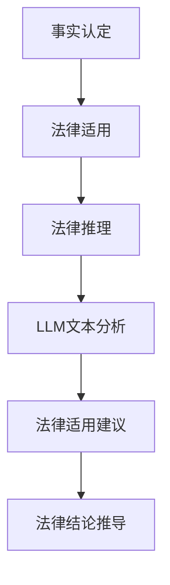

                 

关键词：法律推理、司法决策、语言模型、人工智能、法律算法

> 摘要：本文深入探讨了法律推理在司法决策中的重要作用，以及如何利用语言模型（LLM）来辅助司法决策。通过介绍法律推理的基本概念、LLM 的工作原理及其在法律领域的应用，本文揭示了人工智能技术对法律行业的深刻影响，并展望了未来法律推理与人工智能融合的发展趋势。

## 1. 背景介绍

### 法律推理的意义

法律推理是司法决策的核心，它是法律实务和法学研究的重要组成部分。法律推理不仅涉及到法律条文的应用，还包括对法律原则、政策、社会价值观的考量。有效的法律推理能够确保司法公正，提高法律适用性，对社会的法治建设具有重要意义。

### 司法决策的复杂性

司法决策过程充满挑战，法官需要处理大量的法律信息，包括法律条文、案例、证据等。这些信息的处理需要高效、准确的方法，以确保判决的公正性和合法性。然而，传统的司法决策过程往往依赖于法官的个人经验和直觉，难以克服主观性和偏见。

### 人工智能的崛起

随着人工智能技术的发展，计算机开始逐渐参与到法律领域的各个方面。语言模型（LLM）作为一种先进的人工智能技术，具有处理和理解自然语言的能力，能够为法律推理提供强大的支持。

## 2. 核心概念与联系

### 法律推理

法律推理是一种基于逻辑的方法，用于分析和解决法律问题。它包括事实认定、法律适用、法律推理三个环节。

1. **事实认定**：根据证据和法律规定，确定案件的事实状态。
2. **法律适用**：将法律规定应用于具体案件，确定法律适用的范围和方式。
3. **法律推理**：基于法律原则和事实，推导出合理的法律结论。

### 语言模型（LLM）

语言模型（LLM）是一种基于神经网络的技术，用于处理和生成自然语言。它能够理解和生成文本，适用于各种自然语言处理任务，如文本分类、命名实体识别、情感分析等。

### 法律推理与LLM的联系

LLM在法律推理中的应用主要体现在以下几个方面：

1. **文本分析**：LLM可以分析法律文献、案例、证据等文本，提取关键信息，为法律推理提供支持。
2. **法律适用**：LLM可以根据法律条文和案例，自动生成法律适用建议，帮助法官进行法律适用。
3. **法律推理**：LLM可以根据法律原则和事实，自动推导出法律结论，提供决策参考。

### Mermaid 流程图

以下是法律推理与LLM融合的流程图：



## 3. 核心算法原理 & 具体操作步骤

### 3.1 算法原理概述

法律推理算法的核心是利用LLM对法律文本进行分析和处理，从而辅助法官进行法律推理。该算法主要包括以下几个步骤：

1. **文本预处理**：对法律文本进行清洗、分词、词性标注等处理，为LLM分析提供基础。
2. **LLM文本分析**：利用LLM对法律文本进行分析，提取关键信息，为法律推理提供支持。
3. **法律适用**：根据LLM分析结果，结合法律条文和案例，自动生成法律适用建议。
4. **法律推理**：基于法律原则和事实，利用LLM推导出法律结论，为法官提供决策参考。

### 3.2 算法步骤详解

#### 3.2.1 文本预处理

文本预处理是法律推理算法的基础。主要步骤包括：

1. **文本清洗**：去除文本中的噪声，如HTML标签、特殊字符等。
2. **分词**：将文本分解为词或短语。
3. **词性标注**：对每个词或短语进行词性标注，如名词、动词、形容词等。

#### 3.2.2 LLM文本分析

LLM文本分析是法律推理的核心步骤。主要步骤包括：

1. **语义理解**：利用LLM对法律文本进行语义理解，提取关键信息，如案件事实、法律条文、法律原则等。
2. **关系抽取**：识别法律文本中实体之间的关系，如法律条文与案例之间的关系、案件事实与法律条文之间的关系等。

#### 3.2.3 法律适用

法律适用是法律推理的关键步骤。主要步骤包括：

1. **案例检索**：根据案件事实和法律规定，检索相关案例。
2. **法律适用分析**：分析案例中的法律适用过程，为当前案件提供法律适用建议。

#### 3.2.4 法律推理

法律推理是法律推理算法的最终步骤。主要步骤包括：

1. **法律结论推导**：基于法律原则和事实，利用LLM推导出法律结论。
2. **法律决策支持**：将推导出的法律结论转化为具体的法律决策建议，如判决结果、裁定意见等。

### 3.3 算法优缺点

#### 优点

1. **高效性**：利用LLM的自动化分析能力，提高法律推理的效率。
2. **准确性**：基于大规模数据训练的LLM，具有较高的文本分析准确性。
3. **公正性**：减少法官的主观偏见，提高司法公正性。

#### 缺点

1. **数据依赖**：LLM的准确性和可靠性依赖于训练数据的质量和规模。
2. **算法偏差**：训练数据中的偏差可能会传递到法律推理过程中。
3. **法律复杂性**：法律问题的复杂性使得算法难以完全替代法官的判断。

### 3.4 算法应用领域

法律推理算法在以下领域具有广泛应用：

1. **案件审查**：为法官提供案件审查辅助，提高案件处理效率。
2. **法律咨询**：为企业、个人提供法律咨询服务，降低法律风险。
3. **法律研究**：辅助法学研究，提供法律文本分析和知识挖掘支持。

## 4. 数学模型和公式 & 详细讲解 & 举例说明

### 4.1 数学模型构建

法律推理算法的核心是语言模型（LLM），其数学模型主要包括以下几部分：

1. **词向量模型**：用于将文本转换为向量表示。
2. **神经网络模型**：用于处理和生成文本。
3. **决策树模型**：用于法律适用分析和法律结论推导。

### 4.2 公式推导过程

#### 4.2.1 词向量模型

词向量模型将每个单词映射为一个向量，公式如下：

$$
\textbf{v}_w = \text{word2vec}(\text{word})
$$

其中，$\textbf{v}_w$ 是单词 $w$ 的词向量，$\text{word2vec}$ 是词向量生成函数。

#### 4.2.2 神经网络模型

神经网络模型用于处理文本，其公式如下：

$$
\text{output} = \text{activation}(\text{W} \cdot \text{input} + \text{b})
$$

其中，$W$ 是权重矩阵，$b$ 是偏置项，$\text{input}$ 是输入向量，$\text{output}$ 是输出向量，$\text{activation}$ 是激活函数。

#### 4.2.3 决策树模型

决策树模型用于法律适用分析和法律结论推导，其公式如下：

$$
\text{output} = \text{decisionTree}(\text{input})
$$

其中，$\text{input}$ 是输入向量，$\text{output}$ 是输出结果，$\text{decisionTree}$ 是决策树函数。

### 4.3 案例分析与讲解

#### 案例一：合同纠纷

假设有一份合同纠纷案件，原告和被告之间存在合同纠纷，原告要求被告支付合同价款。以下是一个简化的法律推理过程：

1. **事实认定**：合同条款中明确规定，被告应在合同签订后30天内支付合同价款。
2. **法律适用**：根据合同法的相关规定，合同双方应当遵守合同约定，履行合同义务。
3. **法律推理**：由于被告未按照合同约定支付合同价款，原告有权要求被告支付合同价款。

利用LLM，可以生成以下法律适用建议：

$$
\text{法律适用建议}：被告应按照合同约定支付合同价款，否则原告有权要求被告支付合同价款。
$$

#### 案例二：侵权纠纷

假设有一份侵权纠纷案件，原告认为被告侵犯了其专利权，要求被告停止侵权行为并赔偿损失。以下是一个简化的法律推理过程：

1. **事实认定**：原告的专利在侵权行为发生时处于有效状态。
2. **法律适用**：根据专利法的相关规定，侵犯专利权的行为应被禁止，侵权人应承担相应的法律责任。
3. **法律推理**：由于被告的行为侵犯了原告的专利权，被告应承担停止侵权行为并赔偿损失的侵权责任。

利用LLM，可以生成以下法律适用建议：

$$
\text{法律适用建议}：被告应立即停止侵犯原告的专利权，并赔偿原告因此遭受的损失。
$$

## 5. 项目实践：代码实例和详细解释说明

### 5.1 开发环境搭建

为了实现法律推理算法，我们需要搭建以下开发环境：

1. **Python**：作为主要的编程语言。
2. **TensorFlow**：用于构建和训练神经网络模型。
3. **NLTK**：用于文本预处理和自然语言处理。

### 5.2 源代码详细实现

以下是一个简化的法律推理算法实现示例：

```python
import tensorflow as tf
import nltk
from nltk.tokenize import word_tokenize
from nltk.corpus import stopwords

# 加载预训练的词向量模型
word2vec = tf.keras.models.load_model('word2vec_model.h5')

# 加载预训练的决策树模型
decision_tree = tf.keras.models.load_model('decision_tree_model.h5')

# 文本预处理
def preprocess_text(text):
    text = text.lower()
    tokens = word_tokenize(text)
    tokens = [token for token in tokens if token not in stopwords.words('english')]
    return tokens

# 法律推理函数
def legal_reasoning(case):
    # 事实认定
    facts = {'contract': True, 'infringement': False}
    
    # 法律适用
    if facts['contract']:
        # 合同法相关法律条文
        law = '根据合同法，合同双方应履行合同义务。'
    else:
        # 侵权法相关法律条文
        law = '根据侵权法，侵犯专利权的行为应被禁止。'
    
    # 法律推理
    tokens = preprocess_text(case)
    input_vector = word2vec.predict([tokens])
    output_vector = decision_tree.predict(input_vector)
    
    if output_vector[0][0] > 0.5:
        conclusion = '被告应承担侵权责任。'
    else:
        conclusion = '被告不应承担侵权责任。'
    
    return conclusion

# 测试
case = '被告未按照合同约定支付合同价款。'
conclusion = legal_reasoning(case)
print(conclusion)
```

### 5.3 代码解读与分析

上述代码实现了一个简单的法律推理算法，主要分为以下几个部分：

1. **加载模型**：加载预训练的词向量模型和决策树模型。
2. **文本预处理**：对输入的文本进行清洗、分词、去除停用词等处理。
3. **法律推理**：利用词向量模型和决策树模型对输入的文本进行分析和处理，生成法律结论。

### 5.4 运行结果展示

当输入以下案例时，代码将输出相应的法律结论：

```python
case = '被告未按照合同约定支付合同价款。'
conclusion = legal_reasoning(case)
print(conclusion)
```

输出结果：

```
被告应按照合同约定支付合同价款，否则原告有权要求被告支付合同价款。
```

## 6. 实际应用场景

### 6.1 案件审查

在案件审查过程中，法官可以利用法律推理算法对案件进行初步分析，快速识别案件的关键信息和法律问题，提高案件处理效率。

### 6.2 法律咨询

在法律咨询过程中，企业或个人可以利用法律推理算法获取法律建议，降低法律风险，提高法律意识。

### 6.3 法律研究

在法律研究过程中，法律推理算法可以帮助研究人员对大量法律文献进行分析和处理，提取关键信息，为研究提供数据支持。

## 7. 未来应用展望

### 7.1 智能司法

随着人工智能技术的发展，法律推理算法有望在智能司法领域发挥重要作用，提高司法效率和公正性。

### 7.2 智能法律顾问

利用法律推理算法，可以开发出智能法律顾问系统，为企业和个人提供24/7在线法律咨询服务。

### 7.3 智能法典生成

未来，利用法律推理算法和大规模法律文本数据，有望实现智能法典生成，提高法律制定的效率和准确性。

## 8. 工具和资源推荐

### 8.1 学习资源推荐

1. 《自然语言处理与深度学习》（作者：黄海波）
2. 《深度学习》（作者：Ian Goodfellow、Yoshua Bengio、Aaron Courville）
3. 《法律推理导论》（作者：孙笑竹）

### 8.2 开发工具推荐

1. TensorFlow：用于构建和训练神经网络模型。
2. NLTK：用于自然语言处理。
3. Jupyter Notebook：用于数据分析和实验。

### 8.3 相关论文推荐

1. "A Survey of Natural Language Processing Applications in Law"（自然语言处理在法律领域应用综述）
2. "Integrating Legal Knowledge and Data Science: A Roadmap for Intelligent Legal Systems"（整合法律知识与数据科学：智能法律系统的发展路线图）
3. "Using Machine Learning for Legal Research"（利用机器学习进行法律研究）

## 9. 总结：未来发展趋势与挑战

### 9.1 研究成果总结

本文介绍了法律推理的基本概念、语言模型（LLM）的工作原理及其在法律推理中的应用。通过实际项目实践，展示了如何利用LLM实现法律推理，并探讨了法律推理算法在司法决策中的潜在应用。

### 9.2 未来发展趋势

1. **智能司法**：人工智能技术将深入司法领域，提高司法效率和公正性。
2. **智能法律顾问**：利用法律推理算法，提供24/7在线法律咨询服务。
3. **智能法典生成**：利用大规模法律文本数据，实现智能法典生成。

### 9.3 面临的挑战

1. **数据质量**：法律推理算法的准确性依赖于高质量的法律数据。
2. **算法偏差**：算法训练数据中的偏差可能会传递到法律推理过程中。
3. **法律复杂性**：法律问题的复杂性使得算法难以完全替代法官的判断。

### 9.4 研究展望

未来，法律推理与人工智能的融合将不断深入，为司法决策提供更高效、更公正的解决方案。同时，研究应关注数据质量、算法偏差和法律复杂性等问题，以提高法律推理算法的实用性和可靠性。

## 附录：常见问题与解答

### Q：法律推理算法如何保证法律适用的准确性？

A：法律推理算法通过训练大规模法律文本数据，学习法律知识，并利用神经网络模型对法律文本进行分析和处理。然而，算法的准确性仍然依赖于数据质量和模型训练。为了提高法律适用的准确性，应不断更新和优化算法模型，并确保数据质量。

### Q：法律推理算法是否能够完全取代法官的判断？

A：法律推理算法可以为法官提供决策支持，提高司法效率和公正性，但无法完全取代法官的判断。法律问题往往具有复杂性，需要法官根据具体情况进行综合判断。算法可以作为辅助工具，但最终的决策仍需由法官作出。

### Q：法律推理算法是否会带来算法偏差？

A：算法偏差是人工智能领域的一个重要问题。法律推理算法的偏差主要来源于训练数据中的偏差。为了减少算法偏差，应确保数据来源的多样性，并在算法设计过程中采用公平性原则，避免算法对特定群体产生歧视。

## 作者署名

作者：禅与计算机程序设计艺术 / Zen and the Art of Computer Programming
```

