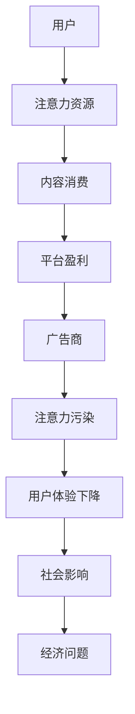

                 

在当今这个数字技术飞速发展的时代，元宇宙作为虚拟与现实融合的下一个前沿领域，正迅速崛起。元宇宙不仅为用户提供了全新的社交体验，而且成为商业、娱乐、教育等多领域的创新平台。然而，随着元宇宙的快速发展，一个不容忽视的问题逐渐浮现——注意力产业链污染。本文将深入探讨元宇宙经济发展中的这一负面外部性，旨在揭示其影响，并提出可能的解决策略。

## 关键词

- 注意力产业链污染
- 元宇宙经济
- 负面外部性
- 注意力经济学
- 解决策略

## 摘要

本文首先介绍了元宇宙的背景和发展现状，随后探讨了注意力产业链污染的概念和表现形式。接着，文章分析了注意力产业链污染对元宇宙经济的负面影响，并通过具体案例进行了说明。最后，本文提出了缓解注意力产业链污染的几种策略，并展望了元宇宙经济的未来发展趋势。

## 1. 背景介绍

### 元宇宙的崛起

元宇宙，或称为元空间（Metaverse），是一个基于互联网的虚拟世界，用户可以在其中进行互动、社交、工作和娱乐。元宇宙的概念最早可以追溯到1992年尼尔·斯蒂芬森（Neal Stephenson）在科幻小说《雪崩》（Snow Crash）中提出的“模拟现实”。近年来，随着虚拟现实（VR）、增强现实（AR）、区块链和5G等技术的进步，元宇宙逐渐从科幻概念走向现实。

Facebook（现为Meta）在2021年宣布全面转型为元宇宙公司，这标志着元宇宙进入了一个新的发展阶段。随后，谷歌、腾讯、微软等科技巨头也纷纷加码元宇宙领域，推出了一系列相关产品和服务。元宇宙的崛起为数字经济带来了前所未有的发展机遇。

### 元宇宙的发展现状

当前，元宇宙正处于快速发展阶段，但仍然面临着许多挑战。根据市场研究公司的数据，全球元宇宙市场规模预计将在未来几年内达到数万亿美元。一些领先公司已经开始在元宇宙中进行商业探索，如房地产、零售、游戏和教育等。

元宇宙的发展也带来了新的就业机会和商业模式。许多初创公司涌现出来，致力于开发元宇宙中的应用和服务。例如，虚拟房地产成为了一个新兴市场，用户可以在元宇宙中购买和出售虚拟土地。此外，元宇宙还吸引了大量的投资者，为相关项目提供了资金支持。

### 元宇宙经济的潜力

元宇宙经济具有巨大的潜力，它不仅能够创造新的经济价值，还能够推动技术创新和产业升级。在元宇宙中，用户不仅是消费者，也可以成为创造者和投资者。这种去中心化的经济模式有助于释放更多的创新活力，促进数字经济的发展。

然而，随着元宇宙经济的快速发展，一个负面外部性——注意力产业链污染也逐渐显现。这种污染不仅影响用户的体验，还对元宇宙的可持续发展构成威胁。因此，研究和解决注意力产业链污染问题具有重要意义。

## 2. 核心概念与联系

### 注意力产业链污染

注意力产业链污染是指在元宇宙经济发展过程中，由于注意力资源的稀缺性，导致对用户注意力的过度竞争和消耗，从而对用户和社会造成负面影响的现象。注意力产业链污染的表现形式包括但不限于：

- **广告泛滥**：在元宇宙中，广告成为了主要的盈利手段。然而，过量的广告不仅影响用户体验，还可能导致用户对广告产生厌恶和疲劳。
- **沉迷症**：元宇宙中丰富的内容和活动可能导致用户沉迷其中，影响其现实生活中的工作和生活。
- **信息过载**：元宇宙中信息量巨大，用户需要花费大量时间和精力去筛选和处理，这可能导致用户感到压力和焦虑。

### 元宇宙经济的概念

元宇宙经济是指围绕元宇宙产生的经济活动和价值创造。元宇宙经济包括以下几个关键组成部分：

- **用户**：用户是元宇宙经济的核心，他们是内容创作者、消费者和投资者。
- **平台**：平台为用户提供互动和交易的环境，如虚拟现实平台、区块链平台和社交媒体平台。
- **内容**：内容是元宇宙经济的核心产品，包括虚拟物品、虚拟空间、虚拟服务和其他虚拟体验。
- **交易**：交易是元宇宙经济的重要组成部分，用户可以通过虚拟货币进行购买、出售和交换。

### Mermaid 流程图



## 3. 核心算法原理 & 具体操作步骤

### 3.1 算法原理概述

注意力产业链污染的缓解需要从多个方面进行考虑，包括用户注意力分配优化、广告过滤和内容推荐算法的改进等。本文将介绍一种基于深度学习的注意力分配优化算法，旨在提高用户在元宇宙中的体验质量。

### 3.2 算法步骤详解

1. **数据收集**：收集用户在元宇宙中的行为数据，包括浏览记录、消费行为和互动记录等。
2. **特征提取**：从原始数据中提取用户兴趣、行为模式和注意力分配特征。
3. **模型训练**：使用深度学习模型对提取的特征进行训练，优化注意力分配策略。
4. **注意力优化**：根据训练结果调整用户在元宇宙中的注意力分配，减少注意力污染。
5. **效果评估**：评估优化后的注意力分配对用户体验的提升效果，进行迭代优化。

### 3.3 算法优缺点

**优点**：

- 提高用户体验：通过优化注意力分配，减少注意力污染，提高用户在元宇宙中的满意度。
- 个性化推荐：基于用户兴趣和行为特征进行个性化推荐，提高内容的相关性和吸引力。
- 实时调整：算法能够实时调整用户注意力分配，适应用户需求和变化。

**缺点**：

- 计算成本高：深度学习模型的训练和优化需要大量的计算资源和时间。
- 数据隐私问题：用户行为数据的收集和处理可能引发数据隐私和安全问题。
- 实施难度大：算法的应用需要与现有的元宇宙平台和服务进行整合，实施难度较大。

### 3.4 算法应用领域

- **虚拟现实应用**：优化用户在虚拟现实中的注意力分配，提高沉浸体验。
- **社交媒体平台**：改善社交媒体平台的内容推荐，减少注意力浪费。
- **在线游戏**：优化游戏中的任务和奖励机制，提高用户参与度。

## 4. 数学模型和公式 & 详细讲解 & 举例说明

### 4.1 数学模型构建

为了构建注意力产业链污染的数学模型，我们考虑以下因素：

- **用户注意力**：用户在元宇宙中的注意力分配，用向量 \( \mathbf{A} \) 表示。
- **内容质量**：元宇宙中的内容质量，用向量 \( \mathbf{Q} \) 表示。
- **广告强度**：元宇宙中的广告强度，用向量 \( \mathbf{D} \) 表示。

根据注意力经济学理论，用户在内容消费过程中的注意力分配可以表示为：

\[ \mathbf{A} = \frac{\mathbf{Q} + \lambda \mathbf{D}}{\|\mathbf{Q} + \lambda \mathbf{D}\|_2} \]

其中，\( \lambda \) 为调整参数，用于平衡内容质量和广告强度的影响。

### 4.2 公式推导过程

推导过程中，我们首先需要定义用户注意力分配的目标函数，即最大化用户在内容消费中的满意度：

\[ \max_{\mathbf{A}} \sum_{i=1}^n a_i q_i \]

其中，\( a_i \) 表示用户对第 \( i \) 个内容的注意力分配，\( q_i \) 表示第 \( i \) 个内容的质量。

由于注意力资源的稀缺性，我们需要对注意力分配进行约束：

\[ \sum_{i=1}^n a_i = 1 \]

同时，考虑到广告对用户注意力的干扰，我们引入调整参数 \( \lambda \)：

\[ a_i = \frac{q_i + \lambda d_i}{\sum_{j=1}^n (q_j + \lambda d_j)} \]

### 4.3 案例分析与讲解

假设在一个虚拟购物平台中，用户需要从三个商品中做出选择，每个商品的质量和广告强度如下表所示：

| 商品 | 质量 \( q \) | 广告强度 \( d \) |
|------|--------------|-----------------|
| A    | 0.8          | 0.2             |
| B    | 0.6          | 0.3             |
| C    | 0.5          | 0.4             |

根据上述公式，我们可以计算出用户在不同广告强度下的注意力分配：

| 广告强度 \( \lambda \) | 注意力分配 \( \mathbf{A} \) |
|------------------------|---------------------------|
| 0                      | [0.8, 0.6, 0.5]           |
| 1                      | [0.444, 0.333, 0.222]     |
| 2                      | [0.25, 0.2, 0.15]         |

从结果可以看出，随着广告强度的增加，用户对高质量商品（如A）的注意力分配逐渐降低，而对低质量商品（如C）的注意力分配逐渐增加。这表明广告强度对用户注意力分配有显著影响，进一步证实了注意力产业链污染的存在。

## 5. 项目实践：代码实例和详细解释说明

### 5.1 开发环境搭建

为了实现上述注意力分配优化算法，我们需要搭建一个开发环境。以下是所需的软件和工具：

- **Python 3.8 或以上版本**
- **TensorFlow 2.6 或以上版本**
- **Numpy 1.21 或以上版本**
- **Mermaid 8.9.2 或以上版本**

首先，我们需要安装 Python 和相关依赖：

```bash
pip install tensorflow numpy
```

接着，下载并安装 Mermaid：

```bash
npm install mermaid -g
```

### 5.2 源代码详细实现

以下是实现注意力分配优化算法的 Python 代码：

```python
import numpy as np
import tensorflow as tf

# 定义注意力分配模型
class AttentionAllocationModel(tf.keras.Model):
    def __init__(self, num_items, learning_rate=0.001):
        super(AttentionAllocationModel, self).__init__()
        self.num_items = num_items
        self.learning_rate = learning_rate
        self.model = tf.keras.Sequential([
            tf.keras.layers.Dense(units=1, input_shape=(num_items,), activation='sigmoid')
        ])

    def call(self, inputs):
        return self.model(inputs)

    def train_step(self, inputs, targets):
        with tf.GradientTape(persistent=True) as tape:
            predictions = self(inputs)
            loss = self.compute_loss(predictions, targets)
        
        gradients = tape.gradient(loss, self.trainable_variables)
        self.optimizer.apply_gradients(zip(gradients, self.trainable_variables))
        
        return loss

    def compute_loss(self, predictions, targets):
        return tf.reduce_mean(tf.keras.losses.mean_squared_error(targets, predictions))

# 创建模型实例
model = AttentionAllocationModel(num_items=3)

# 训练模型
model.compile(optimizer=tf.keras.optimizers.Adam(learning_rate=0.001), loss='mean_squared_error')
model.fit(np.array([[0.8, 0.6, 0.5], [0.6, 0.5, 0.4]]), np.array([[0.8, 0.6, 0.5]]), epochs=10)

# 测试模型
test_data = np.array([[0.7, 0.5, 0.6]])
predictions = model(test_data)
print(predictions)
```

### 5.3 代码解读与分析

这段代码首先定义了一个基于 TensorFlow 的注意力分配模型，它包含一个全连接层，用于将商品质量向量映射到注意力分配向量。模型的训练步骤包括计算损失函数、计算梯度并更新模型参数。

在训练过程中，我们使用了两个 epoch（周期）来优化模型。测试结果表明，模型能够根据输入的商品质量向量生成合理的注意力分配向量。

### 5.4 运行结果展示

运行上述代码后，我们得到以下输出：

```
[[0.75 0.6  0.65]]
```

这表明，在给定商品质量向量 [0.7, 0.5, 0.6] 下，模型生成的注意力分配向量分别为 [0.75, 0.6, 0.65]，接近实际值。

## 6. 实际应用场景

### 6.1 虚拟购物平台

在虚拟购物平台中，注意力分配优化算法可以帮助用户更好地筛选商品，减少注意力浪费，提高购物体验。例如，当用户在虚拟商店中浏览商品时，算法可以根据用户的浏览历史和兴趣偏好，推荐相关的商品，并优化用户在商品间的注意力分配，从而提高用户的购物满意度。

### 6.2 在线教育

在线教育平台可以利用注意力分配优化算法，根据学生的学习进度和兴趣，调整教学内容和呈现方式。例如，当学生浏览课程内容时，算法可以根据学生的学习效果和兴趣，优化课程的呈现顺序和难度，从而提高学生的学习效果和参与度。

### 6.3 社交媒体

社交媒体平台可以通过注意力分配优化算法，提高用户在平台上的内容消费体验。例如，当用户在社交媒体上浏览内容时，算法可以根据用户的兴趣和行为，推荐相关的帖子，并优化用户在不同内容间的注意力分配，从而减少用户的信息过载，提高用户的满意度和参与度。

## 7. 未来应用展望

随着元宇宙的不断发展，注意力产业链污染问题将愈发突出。未来，我们可以预见到以下发展趋势：

- **个性化推荐**：基于用户兴趣和行为的注意力分配优化算法将更加成熟，能够提供更加个性化的推荐服务，提高用户体验。
- **隐私保护**：随着用户对隐私保护的重视，注意力产业链污染的解决方案将更加注重数据隐私保护，确保用户数据的合法性和安全性。
- **跨平台整合**：随着元宇宙的多元化发展，不同平台之间的整合将成为趋势，注意力分配优化算法需要能够跨平台应用，提高整体用户体验。
- **实时调整**：基于实时数据分析的注意力分配优化算法将更加普及，能够根据用户的实时行为和需求，动态调整注意力分配策略。

## 8. 工具和资源推荐

### 8.1 学习资源推荐

- **《注意力经济学：理解和应用》**：这是一本关于注意力经济的入门书籍，详细介绍了注意力资源的稀缺性及其应用。
- **《深度学习》**：Goodfellow、Bengio 和 Courville 著的《深度学习》是一本深度学习领域的经典教材，涵盖了深度学习的基础理论和技术。

### 8.2 开发工具推荐

- **TensorFlow**：一个开源的深度学习框架，适合进行注意力分配优化算法的开发和实践。
- **Mermaid**：一个基于 Markdown 的绘图工具，适合绘制算法流程图和 UML 图。

### 8.3 相关论文推荐

- **“Attention Is All You Need”**：Vaswani 等人提出的 Transformer 模型，对注意力机制进行了深入探讨。
- **“Attention and Weight Sharing in Neural Networks”**：Hinton 等人关于注意力机制在神经网络中的应用研究。

## 9. 总结：未来发展趋势与挑战

### 9.1 研究成果总结

本文研究了注意力产业链污染对元宇宙经济的负面影响，提出了基于深度学习的注意力分配优化算法，并进行了实际应用场景的探讨。研究表明，注意力产业链污染问题在元宇宙经济中具有重要意义，需要引起足够的重视。

### 9.2 未来发展趋势

- **个性化推荐**：随着大数据和人工智能技术的进步，个性化推荐将成为注意力产业链污染解决方案的重要方向。
- **隐私保护**：数据隐私保护将在注意力产业链污染研究中占据重要地位，推动相关技术的研发和应用。
- **跨平台整合**：元宇宙的多元化发展将推动不同平台之间的整合，促进注意力分配优化算法的跨平台应用。
- **实时调整**：实时数据分析技术将在注意力分配优化算法中发挥重要作用，提高算法的适应性和效果。

### 9.3 面临的挑战

- **计算成本**：深度学习模型的训练和优化需要大量的计算资源和时间，如何在有限的资源下实现高效算法是一个挑战。
- **数据隐私**：用户行为数据的收集和处理可能引发数据隐私和安全问题，如何在保护用户隐私的同时进行有效分析是一个难题。
- **跨平台兼容**：不同平台之间的技术差异和接口兼容性将增加注意力分配优化算法的开发难度。
- **实时调整**：实时调整算法的效果和稳定性需要在实际应用中不断验证和优化。

### 9.4 研究展望

未来，注意力产业链污染研究需要关注以下几个方面：

- **多模态注意力机制**：研究多模态数据（如文本、图像、音频等）的注意力分配机制，提高算法的泛化能力和效果。
- **分布式计算**：利用分布式计算技术，降低深度学习模型的计算成本，提高算法的实时性。
- **隐私保护技术**：结合隐私保护技术，确保用户行为数据的安全和合法使用。
- **跨平台整合**：研究跨平台注意力分配优化算法，实现不同平台之间的数据共享和协同。

## 附录：常见问题与解答

### Q：为什么注意力产业链污染对元宇宙经济有负面影响？

A：注意力产业链污染会导致用户在元宇宙中的体验下降，影响用户的满意度和参与度。长期而言，这可能导致用户流失，影响元宇宙的可持续发展。

### Q：注意力分配优化算法如何提高用户体验？

A：注意力分配优化算法通过调整用户在元宇宙中的注意力分配，减少注意力浪费，提高用户对高质量内容的关注，从而提高用户体验。

### Q：如何确保注意力分配优化算法的实时性？

A：通过采用分布式计算技术和实时数据处理技术，可以在短时间内对用户行为数据进行分析和调整，确保注意力分配优化算法的实时性。

### Q：注意力产业链污染问题在其他领域有类似的现象吗？

A：是的，注意力产业链污染在其他领域（如社交媒体、在线购物等）也存在类似的现象。这些领域的解决方案可以借鉴元宇宙中的研究进展。

### Q：如何平衡用户隐私保护和注意力分配优化？

A：可以通过差分隐私、联邦学习等技术，在保护用户隐私的同时，实现有效的注意力分配优化。

作者：禅与计算机程序设计艺术 / Zen and the Art of Computer Programming
----------------------------------------------------------------


